# 自己無撞着な関係波閉鎖系におけるインフレーション的急拡大の機構
## ――正規化監査、rank 生成、二乗閉包保存、simplex 対称化および公理系の再構成

**著者:** 木原 範昭  
**所属:** WF System Co., Ltd.  
**日付:** 2026-08-26  
**状態:** 完成稿 v2（DOI 取得前）

---

## 要旨

先行研究「N体関係波閉鎖系における三方向生成の時間構造――二段階seed除去による因果分離」では、外部seedを除去した状態でも、長い潜伏過程の後に関係波系がインフレーション的な急拡大を起こし、初期には存在しなかった三方向的な準安定構造へ移行することを報告した。しかし、その急拡大が何によって開始し、何が実際に拡大し、なぜ停止し、どのように方向が生成されるのかについては未解明な点が残っていた。

本研究では、この未解明部分を解くため、既存プログラムをコードまで遡って監査し、系の唯一の規模パラメータを $N$ として $N=3,\ldots,16$ を再検証した。完全二体関係数は

$$
M=\frac{N(N-1)}2
$$

である。

第一に、先行実験の時間発展コードには、生成子 $K$ をそのスペクトルノルム $\sigma_{\max}$ で割る

$$
K\rightarrow K/\sigma_{\max}
$$

という、本来の物理規則として不要な正規化が混入していた。この正規化を除去して再実験した結果、インフレーション的急拡大は消失せず、むしろ急拡大の時間発展が速くなった。したがって、先行研究の急拡大は正規化によるアーティファクトではなく、正規化は逆に急拡大を抑制していた。

第二に、初期化関数 `make_parent` を精査した結果、従来公理として置いていた

$$
\sum_m z_m^2=0,\qquad U^n=I
$$

を初期化の拘束条件として直接与えていないことが確認された。`make_parent` が行っている本質的操作は、実数乱数で与えた初期位相から、実反対称な関係作用の自己無撞着な固有モード固定点を探索することである。この固定点では、複素回転対、二乗ゼロ閉包、rank-2 初期平面、および有限位相閉鎖が自発的に成立した。したがって、本モデルのより基礎的な原理は「自己無撞着性」であり、複素構造、二乗ゼロ閉包、有限回帰性は、その自己無撞着固定点から導出される構造として再整理できる。

第三に、時間発展では、現在の $M$ 本の関係波から位相依存生成子を構成し、Cayley 変換による位相回転を行い、その結果を次の $M$ 本の波へ書き戻す。この反復によって、`make_parent` が与える rank-2 初期状態から rank-4 構造が自発的に立ち上がる。rank-4 は初期条件として作り込まれていない。急拡大しているのは、新たに立ち上がった親平面外方向への複素振幅成分であり、実験条件によって多数桁、約 $10^{30}$ オーダーに及ぶ二乗振幅の増大が観測された。一方、全過程を通じて

$$
\sum_m z_m^2\simeq0
$$

は数値精度内で保存される。したがってこれは外部からエネルギーを注入して全体ノルムを増大させる過程ではなく、閉じた有限系の内部で新たな方向へ振幅が再配分される過程である。

第四に、長時間発展を追跡すると、急拡大の停止過程と、関係波の振幅および位相関係が複素simplex対称性と整合する準安定配置へ再編成される過程とが同一の時間発展上で対応して進行することが分かった。停止の因果機構そのものは一意には特定できていないが、発展方向として

$$
\text{rank-2初期状態}
\rightarrow
\text{rank-4生成}
\rightarrow
\text{新方向への急拡大}
\rightarrow
\text{振幅・位相秩序化}
\rightarrow
\text{simplex対称配置}
\rightarrow
\text{準安定化}
$$

が確認された。

第五に、$N=3$ から $16$ の全系列で、$M$ 本の複素関係波は $N$ 頂点、rank $N-1$ の複素simplexを形成し、準安定状態では全辺の振幅二乗が原則として

$$
|z_{ij}|^2\rightarrow\frac1M
$$

へ等振幅化することを確認した。また各頂点 $i$ について

$$
\sum_{j\neq i} z_{ij}^2\simeq0
$$

が成立し、各頂点状態が自分以外の $N-1$ 本の関係波の線形合成閉包として成立することも確認した。

さらに、この自明な頂点閉包を除外して追加閉包を探索したところ、$N=5$ に特異な非自明対称性が見つかった。$N=5, M=10$ では、頂点閉包から導けない2辺ゼロ閉包が13個存在し、その最良残差は $1.88\times10^{-10}$ まで収束する。さらに10辺全体を

$$
10=2+2+2+2+2
$$

の5個の非自明閉包へ完全分割する exact cover が12通り存在した。

以上の結果は、先行研究で観測されたseedなしインフレーション的急拡大が数値正規化や任意の刻みによる人工現象ではなく、自己無撞着な関係波閉鎖系自身の力学として再現されること、またその基礎公理系を「自己無撞着性」へさらに還元できる可能性を示す。

---

## 1. はじめに

本研究シリーズでは、$N$ 個の存在と、その全二体関係

$$
M=\frac{N(N-1)}2
$$

を関係波として扱う閉鎖系を数値的に研究してきた。従来は基礎条件として、

$$
\sum_m z_m^2=0
$$

という非自明二乗ゼロ閉包と、

$$
U^n=I
$$

という有限回帰性を公理として置き、その上で有限閉鎖系、位相、方向、相互作用、量子化の可能性を検討してきた。

先行研究 [K8] では、外部seedを段階的に除去しても、系が長い潜伏過程の後に幾何級数的な急拡大を起こし、急拡大中に方向部分空間が回転・混合し、最終的に三方向的な準安定構造へ移行することを確認した。したがって「seedが無ければ急拡大しない」という単純な説明は否定された。

しかし同研究では、次の問題が未解明として残った。

1. なぜ急拡大が開始するのか。
2. 実際に何が急拡大しているのか。
3. rank-4 はいつ、どこから現れるのか。
4. なぜ急拡大は停止するのか。
5. なぜ方向が生成されるのか。
6. 初期化や時間発展に含まれる数値正規化・刻みが現象を作っていないか。
7. 従来の二公理 $\sum z^2=0$ と $U^n=I$ は本当に独立な入力公理なのか。

本研究は、これらを実装監査と $N=3$〜16 の再実験によって再検証する。

---

## 2. 先行研究からの継承点と本研究での訂正

### 2.1 直接の先行研究

直接の先行研究は [K8] である。同研究は、seedを除去しても急拡大と方向生成が存続することを確認した。

一方、同論文には次の記述があった。

> 初期化 `make_parent` は零二乗閉塞条件を前提としている。

今回、コードを原本まで遡って監査した結果、この記述は修正が必要であることが分かった。

`make_parent` は、$\sum z_m^2=0$ を数値拘束として直接課していない。実際に行っているのは、位相依存の実反対称作用に対する自己無撞着固有モード固定点の探索である。その結果として、二乗ゼロ閉包が出力側に現れている。

したがって本論文は、[K8] の実験事実を否定するものではなく、**初期化機構の理解をコード監査によって訂正し、その結果として公理系をさらに上流へ再構成する**ものである。

### 2.2 何を再検証したか

本研究では、

- 原本コード
- `make_parent`
- Cayley時間発展
- $K/\sigma_{\max}$ 正規化
- 処理刻み `GAMMA`
- rank の時間発展
- $Z^T Z$
- 複素距離
- simplex rank
- 振幅・位相の準安定化
- 部分ゼロ閉包

を再監査した。

---

## 3. 系の最小入力

本研究で独立な規模パラメータは $N$ とする。

$N$ 個の存在の全二体関係を取るため、

$$
M=\binom N2=\frac{N(N-1)}2
$$

は導出量であり、独立パラメータではない。

現在の実装を抽象化すると、最小入力は

$$
\boxed{
N
+\text{完全二体関係}
+\text{自己無撞着固定点条件}
}
$$

である。

---

## 4. `make_parent` の実装監査

### 4.1 実コード

現在使用している `make_parent` の中心部は以下である。

```python
def make_parent(sys_lr, rng, iters=400, beta=0.5, tol=1e-8, restarts=3):
    best = (None, np.inf, None)
    for _ in range(restarts):
        theta = rng.uniform(0.0, 2.0 * np.pi, sys_lr.m)
        v = None
        for it in range(iters):
            sys_lr.set_theta(theta)
            ev, EV = np.linalg.eig(sys_lr.J @ sys_lr.G)
            idx = int(np.argmin(ev.imag))  # lambda = -i sigma_max
            v = sys_lr.w(EV[:, idx].astype(complex))
            v = v / np.linalg.norm(v)
            theta_new = np.angle(v)
            mix = (1.0 - beta) * np.exp(1j * theta) \
                + beta * np.exp(1j * theta_new)
            theta = np.angle(mix)

            if it % 10 == 9:
                sys_lr.set_theta(np.angle(v))
                res_now = _eigenmode_residual(sys_lr, v)
                if res_now < tol:
                    break

        sys_lr.set_theta(np.angle(v))
        residual = _eigenmode_residual(sys_lr, v)
        if residual < best[1]:
            best = (v, residual, sys_lr.sigma_spectrum())
        if residual < tol:
            break

    v, residual, sig = best
    sys_lr.set_theta(np.angle(v))
    return v, residual, sig
```

ここで初期値 `theta` は、

```python
theta = rng.uniform(0.0, 2.0*np.pi, M)
```

という**実数乱数**である。

実部・虚部の二組の乱数振幅を物理初期値として与えてはいない。

数値実装上 `astype(complex)` を用いているのは、実行列 `J @ G` の複素共役固有モードを格納するためであり、複素位相関係を外部条件として指定しているわけではない。

### 4.2 固定点としての自己無撞着性

概念的には、

$$
\theta
\rightarrow
G(\theta)
\rightarrow
v
\rightarrow
\arg v
\rightarrow
\theta'
$$

を反復し、

$$
\boxed{\theta'=\theta}
$$

となる固定点を探索している。

したがって `make_parent` の本質は、

$$
\boxed{\mathcal F(X)=X}
$$

という自己無撞着固定点条件である。

---

## 5. 複素構造の自発生成

### 5.1 実反対称作用

生成子 $K$ は実反対称である。

$$
K^T=-K.
$$

非零固有モードは

$$
Kv=i\sigma v
$$

の形を取る。

$$
v=a+ib
$$

と書くと、

$$
Ka=-\sigma b,\qquad
Kb=\sigma a.
$$

したがって $a,b$ は独立に外部から与えた二成分ではなく、**実反対称作用の非零固有モード内部に現れる回転対**である。

この意味で、

$$
\boxed{
\text{実数初期位相}
+\text{自己無撞着な実反対称作用}
\Rightarrow
\text{複素回転構造}
}
$$

と読むことができる。

---

## 6. 自己無撞着性から二乗ゼロ閉包

実反対称性から任意の $v$ について

$$
v^T K v=0
$$

である。

自己無撞着非零固有モード

$$
Kv=i\sigma v,\qquad \sigma\neq0
$$

を代入すると、

$$
v^TKv=i\sigma v^Tv=0.
$$

したがって

$$
\boxed{v^Tv=0}
$$

すなわち、

$$
\boxed{\sum_m v_m^2=0}
$$

が従う。

さらに $v=a+ib$ とすれば、

$$
\sum_m(a_m+ib_m)^2=0
$$

より、

$$
\boxed{\|a\|^2=\|b\|^2},
\qquad
\boxed{a\cdot b=0}.
$$

したがって、二乗ゼロ閉包は `make_parent` に外部拘束として与えたものではなく、自己無撞着な非零反対称固有モードから導かれる。

---

## 7. 各頂点における線形合成閉包

$N$ 頂点の完全グラフでは、頂点 $i$ に接続する関係波は $N-1$ 本である。

今回の $N=3$〜16 解析では、$N\ge4$ について各頂点で

$$
\boxed{
\sum_{j\neq i} z_{ij}^2\simeq0
}
$$

が数値精度内で成立した。

これは各頂点状態が、自分以外の $N-1$ 個の関係波から構成される線形合成閉包であることを意味する。

$$
\boxed{
\text{1頂点の状態}
=
(N-1)\text{本の関係波の自己無撞着な線形合成状態}
}
$$

である。

各関係 $z_{ij}$ は頂点 $i$ と $j$ の双方の局所閉包に属するため、全体系は互いに重なり合う $N$ 個の局所線形閉包によって被覆される。

---

## 8. 二乗閉包から compact phase orbit へ――$U^n=I$ との論理的区別

$$
v^Tv=0
$$

より、$v=a+ib$ について

$$
\|a\|=\|b\|,
\qquad
a\perp b
$$

であり、状態は有限半径の回転対

$$
X(\theta)=a\cos\theta+b\sin\theta
$$

として表せる。

したがって

$$
X(\theta+2\pi)=X(\theta)
$$

であり、自己無撞着固定点から **compact な $S^1$ 位相軌道**までは導出できる。

ただし、ここから有限回帰

$$
U^n=I
$$

が自動的に従うわけではない。有限 $n$ で元に戻るためには位相増分が

$$
\frac{\Delta\theta}{2\pi}\in\mathbb Q
$$

である必要がある。無理数回転なら軌道は $S^1$ 上に稠密であり、有限回では閉じない。

したがって本研究で厳密に整理できる論理階層は

$$
\boxed{
\text{自己無撞着固定点}
\Rightarrow
\text{複素回転対}
\Rightarrow
\sum z_m^2=0
\Rightarrow
S^1\text{ compactness}
}
$$

までである。

一方、

$$
\boxed{
S^1\text{ compactness}
+
\text{rational phase locking / discrete phase selection}
\Rightarrow
U^n=I
}
$$

と分離する必要がある。したがって従来公理として置いた $U^n=I$ を自己無撞着性から完全に導出した、とは本論文では主張しない。位相の有理ロック機構は、別途行った位相離散化実験と接続して今後検証すべき独立課題である。

## 9. 時間発展の実装

時間発展では、各stepで現在状態の位相を読み、

```python
sys_lr.set_theta(np.angle(Z))
sig_est, wp = sys_lr.sigma_max_power(wp)
Z = sys_lr.cayley_step(Z, sig_est)
```

として次状態を書き戻す。

物理的には、

$$
Z_t
\rightarrow
\theta_t=\arg Z_t
\rightarrow
K(\theta_t)
\rightarrow
U_t Z_t
\rightarrow
Z_{t+1}
$$

である。

したがって生成子は固定ではなく、**現在の波状態を読み出した結果から毎step再構成される状態依存生成子**である。

---

## 10. Cayley更新と位相回転

時間発展は

$$
Z_{t+1}
=
(I-\gamma K_t)^{-1}
(I+\gamma K_t)Z_t
$$

という Cayley 変換である。

実反対称 $K_t$ に対し、この更新はノルム保存回転となる。

固有モード

$$
K_tv=i\sigma v
$$

に対しては、

$$
v\rightarrow
\frac{1+i\gamma\sigma}
     {1-i\gamma\sigma}v
=
e^{i\Delta\phi}v,
$$

$$
\boxed{
\Delta\phi
=
2\arctan(\gamma\sigma)
}
$$

である。

この式が「状態を読み出し、位相を回転し、次状態へ書き戻す」処理の数式表現である。

---

## 11. 不要な $K/\sigma_{\max}$ 正規化と時間再パラメータ化

### 11.1 旧コードと修正版

先行コードでは生成子を

$$
K\rightarrow\frac{K}{\sigma_{\max}}
$$

としていた。修正版では生の $K$ を用いる。

同一状態において Cayley 写像は

$$
C\!\left(\frac K\sigma,\gamma\right)
=
C\!\left(K,\frac\gamma\sigma\right)
$$

という恒等式を満たす。したがって連続極限では、正規化あり・なしのベクトル場は同じ方向を持ち、状態依存の時計の付け替えとして理解できる。

従来の step 軸比較では、N=4,5について成長率比 raw/normalized と到達step比 normalized/raw がそれぞれ

$$
N=4:\quad2.708\ \text{vs}\ 2.702,
$$

$$
N=5:\quad3.495\ \text{vs}\ 3.489
$$

と一致しており、時間再パラメータ化解釈を強く示唆した。

### 11.2 累積位相軸による追加検証

今回さらに、既存N=5データを支配モードの累積 Cayley 位相

$$
\Phi(t)=\sum_{s<t}2\arctan(\gamma\sigma_s)
$$

で再描画した。

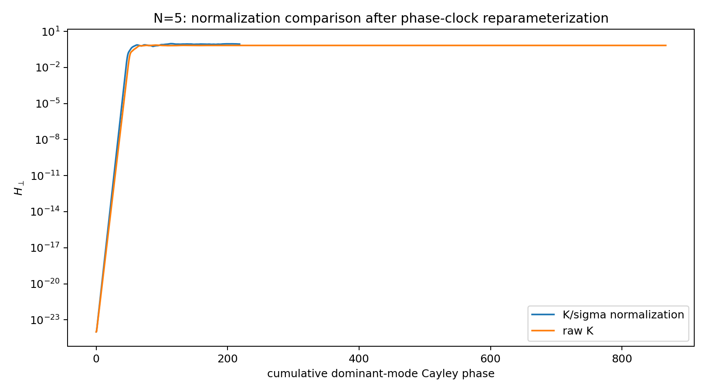

結果として、成長域の $\log_{10}H_\perp$ RMSE は **0.944 decade** であり、有限stepの2曲線は完全には重ならなかった。

したがって結論は次のように修正される。

$$
\boxed{
K/\sigma_{\max}\text{ は連続極限では時間再パラメータ化に対応するが、}
\gamma=\tan(\pi/144)\text{ の有限stepでは完全同一軌道ではない。}
}
$$

正規化を除去しても急拡大そのものが消えないという先行比較の結論は維持されるが、「正規化は単に速度を遅くしただけ」と有限stepで厳密同一視するのは避ける。

## 12. `144` は物理定数ではなく時間刻みである

コードでは、

```python
GAMMA = math.tan(math.pi / 144.0)
```

としている。

ここで注意すべきなのは、$\pi/144$ は Cayley パラメータの角であり、$\sigma=1$ の正規化固有モードに対する実際の一step回転角は

$$
\Delta\phi
=
2\arctan[\tan(\pi/144)]
=
\frac{2\pi}{144}
=
\frac{\pi}{72}
=
2.5^\circ
$$

である。

したがって「144」は物理定数ではなく、2.5°刻みを得るために選んだ数値時間刻みの分母である。

N=5について、

$$
n_\gamma=144,\ 288,\ 576,\ 1152,\ 2304
$$

と刻みを細分化し、

$$
\gamma=\tan(\pi/n_\gamma)
$$

として連続刻み極限を調べた。

累積位相あたりの成長率は、

- 144: 1.131171 /rad
- 288: 1.145300 /rad
- 576: 1.152475 /rad
- 1152: 1.156090 /rad
- 2304: 1.157905 /rad

へ収束した。

したがって、

$$
\boxed{
144\text{ に固有の物理的共鳴はなく、}
\gamma\rightarrow0
\text{ の連続時間極限へ収束する。}
}
$$

**図3　時間刻み細分化による連続極限の検証。** $n_\gamma=144,288,576,1152,2304$ と細分化しても、累積位相で読み直した成長率は同一極限へ収束する。したがって144は物理定数ではなく数値刻みである。

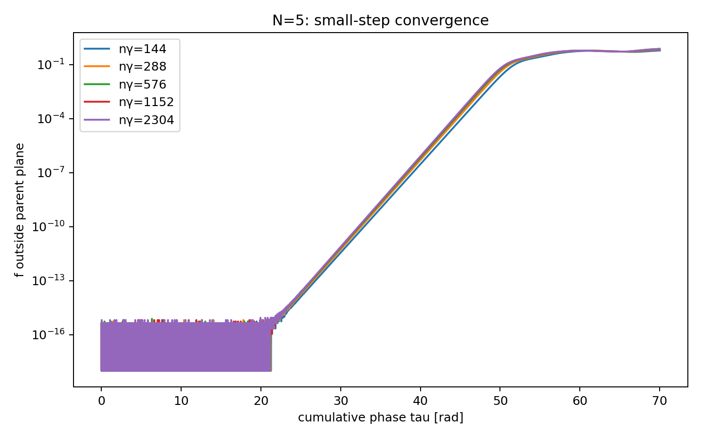

---

## 13. rank-2 初期状態と rank-4 の自発生成

`make_parent` によって得られる親状態は、実部と虚部が張る rank-2 の初期平面を持つ。

この初期状態から時間発展を開始すると、親平面外成分が自発的に立ち上がり、rank-4 の読出し構造へ移行する。

重要なのは、

$$
\boxed{
\text{rank-4 は初期条件として与えていない}
}
$$

という点である。

rank-4 は現在状態を読み出して生成子を再構成し、位相回転結果を書き戻す反復によって自発的に生成される。

ここでいう rank-4 は、後述する複素simplexの Gram rank $N-1$ とは異なる。前者は時間発展によって立ち上がる「二つの2次元回転平面」の読出し、後者は $N$ 頂点距離幾何のsimplex rankである。

---

## 14. 三方向の生成

初期 rank-2 平面を $A$ とする。

時間発展によって親平面外に第二の2次元平面 $B$ が立ち上がる。

この二平面の相対配置を読出すと、

1. 両平面に関係する共有方向、
2. 平面 $A$ 側の独立方向、
3. 平面 $B$ 側の独立方向、

という三方向として識別できる。

したがって、

$$
\boxed{
\text{rank-2}
\rightarrow
\text{rank-4}
\rightarrow
\text{三方向的読出し}
}
$$

という生成系列が得られる。

先行研究 [K8] で観測された「三方向」は、最初から固定された3軸を増幅したものではなく、急拡大中に部分空間の回転・混合を伴って動的に形成される。

---

## 15. 何が急拡大しているのか――厳密保存下の内部移送

親平面への射影成分と直交成分を $Z_\parallel,Z_\perp$ とし、

$$
H_\parallel=\|Z_\parallel\|^2,
\qquad
H_\perp=\|Z_\perp\|^2.
$$

固定された直交分解なので

$$
H_\parallel+H_\perp=H_{\rm total}
$$

である。

今回、corrected raw-$K$ N=5データから両者を直接重ね描きした。

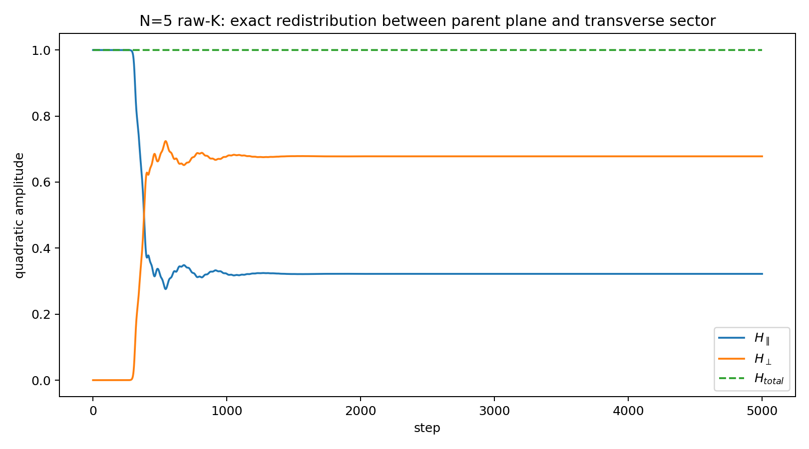

実装上の最大誤差は

$$
\max|H_\parallel+H_\perp-H_{\rm total}|=4.44\times10^{-16}.
$$

step 5000では

$$
H_\parallel=0.3220054054,
\qquad
H_\perp=0.6779945946.
$$

したがって $H_\perp$ の急拡大は外部からの注入ではなく、親平面内成分から直交方向への**厳密な内部再配分**である。

また

$$
0\le H_\perp\le H_{\rm total}=\text{const.}
$$

なので、指数増大が無限に継続しないこと自体は運動学的に強制される。

## 16. Cayley 更新による二つの厳密保存則

各stepの生成子は実反対称である。

$$
K_t^T=-K_t.
$$

したがって Cayley 写像

$$
C_t=(I-\gamma K_t)^{-1}(I+\gamma K_t)
$$

は恒等的に

$$
C_t^T C_t=I
$$

を満たす実直交行列である。

よって exact arithmetic では、生成子が毎step状態依存で変化しても、

$$
\boxed{Z_{t+1}^\dagger Z_{t+1}=Z_t^\dagger Z_t}
$$

および

$$
\boxed{Z_{t+1}^T Z_{t+1}=Z_t^T Z_t}
$$

が厳密に保存される。

したがって従来の「$H_{\rm total}$ がほぼ一定」「$Z^TZ\simeq0$ が維持された」という記述は、数値的発見ではなく**更新則の構造定理**へ格上げされる。N=5 raw-$K$ 実装で観測した $10^{-15}$ 程度の残差は、この厳密定理の浮動小数点実装誤差である。

この定理は、インフレーション的急拡大が保存則を破るエネルギー生成ではなく、保存された全体量の内部再配置であることを解析的に保証する。

## 17. 複素simplexとヌル錐――局所閉包の幾何定理

各関係の複素二乗距離を

$$
q_{ij}=z_{ij}^2=(x_i-x_j)\cdot(x_i-x_j)
$$

とし、重心を

$$
\sum_i x_i=0
$$

に取る。

各頂点 $i$ の star 和は

$$
\sum_{j\ne i}(x_i-x_j)^2
=Nx_i^2+T,
\qquad
T\equiv\sum_jx_j^2.
$$

全頂点で局所閉包

$$
\sum_{j\ne i}q_{ij}=0
$$

が成立すると、

$$
x_i^2=-T/N
$$

が全 $i$ で共通となる。これを全頂点で足すと $T=-T$ なので

$$
T=0,
$$

したがって

$$
\boxed{x_i\cdot x_i=0\quad\forall i}.
$$

逆も直ちに成立するため、

$$
\boxed{
\text{全頂点の star 二乗閉包}
\Longleftrightarrow
\text{全 simplex 頂点が複素ヌル錐上にある}
}
$$

は定理である。

このとき

$$
q_{ij}=-2x_i\cdot x_j.
$$

また N=3〜16 の全系列で複素Gram rankは

$$
\operatorname{rank}B=N-1
$$

であり、$N$ 頂点は $N-1$ 次元複素simplexを構成する。

## 18. 等モジュラー・ヌル複素simplexへの準安定化

長時間発展後、多くの $N$ で

$$
|z_{ij}|^2\rightarrow\frac1M
$$

へ等分配する。

前節のヌル錐定理と合わせると、準安定状態は

$$
\boxed{
\text{equimodular null complex simplex}
}
$$

として一つの幾何対象にまとめられる。

すなわち

$$
x_i^2=0,
\qquad
|x_i\cdot x_j|=\frac{1}{2M}\quad(i\ne j).
$$

N=5について振幅分配のスペクトルエントロピー

$$
p_m=\frac{|z_m|^2}{\sum_k|z_k|^2},
\qquad
S=-\sum_mp_m\ln p_m
$$

を計算した。

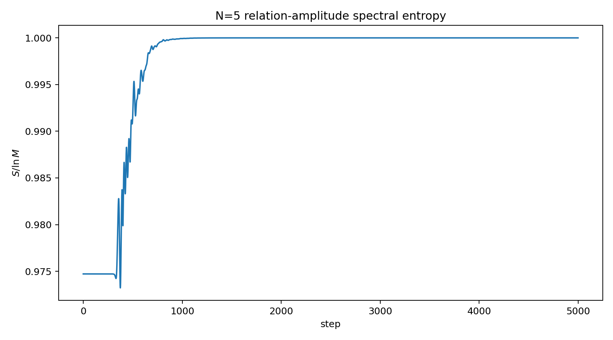

初期 $S/\ln M=0.97472$、step 375で一度0.97322まで低下した後、step 5000では

$$
\boxed{S/\ln M=1.000000}
$$

に到達した。したがって最終等分配は定量的にも完全である。ただし $S(t)$ は厳密単調ではないため、単純な H 定理とは異なる。

## 19. 急拡大の停止：運動学的上限と、その後のsimplex秩序化

Cayley直交性より

$$
H_\perp\le H_{\rm total}=\text{const.}
$$

であるため、指数増大が無限に続かず飽和すること自体は運動学的に説明できる。

したがって「なぜ停止するか」という問題は二つに分離される。

1. **なぜ無限増大しないか**：全ノルム保存による上限で解決。
2. **なぜ特定の等モジュラーsimplex配置へ移行するか**：依然として力学的問題。

N=5では $H_\perp$ がほぼ飽和した後も、位相・距離4群の秩序化は長時間続く。

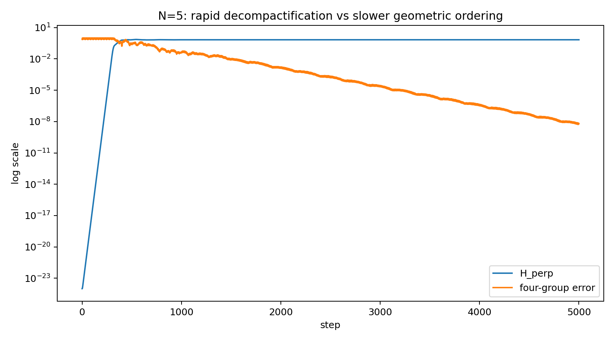

したがって時間発展は

$$
\boxed{
\text{linear instability / rapid transfer}
\rightarrow
\text{bounded saturation}
\rightarrow
\text{slow simplex ordering}
}
$$

という少なくとも二段階を持つ。

## 20. $N=3$〜16 の系列

主要結果をまとめる。

| N | M | simplex rank | 準安定位相構造の概略 |
|---:|---:|---:|---|
| 3 | 3 | 2 | 三角simplex、5000 stepでは緩和途上 |
| 4 | 6 | 3 | $2+2+2$：四面体の3組の対辺 |
| 5 | 10 | 4 | $3+3+2+2$、さらに非自明2辺閉包 |
| 6 | 15 | 5 | 厳密には多クラス、緩和の遅い境界例 |
| 7 | 21 | 6 | 高精度では21辺非縮退 |
| 8 | 28 | 7 | 高精度では28辺非縮退 |
| 9 | 36 | 8 | 高精度では36辺非縮退 |
| 10 | 45 | 9 | 高精度では45辺非縮退 |
| 11 | 55 | 10 | 高精度では55辺非縮退 |
| 12 | 66 | 11 | 高精度では66辺非縮退 |
| 13 | 78 | 12 | 高精度では78辺非縮退 |
| 14 | 91 | 13 | 非縮退、6辺quasi-closure候補 |
| 15 | 105 | 14 | 高精度では105辺非縮退 |
| 16 | 120 | 15 | 高精度では120辺非縮退 |

普遍的なのは、

$$
\boxed{
\operatorname{rank}=N-1
}
$$

と、準安定状態での

$$
\boxed{
|z|^2\rightarrow1/M
}
$$

である。

一方、少数位相群や追加閉包は $N$ に強く依存する。

---

## 21. N=4 の対辺構造――120°は数値近似ではなく定理

N=4では6辺が3組の対辺

$$
(12,34),\qquad(13,24),\qquad(14,23)
$$

へ分かれる。

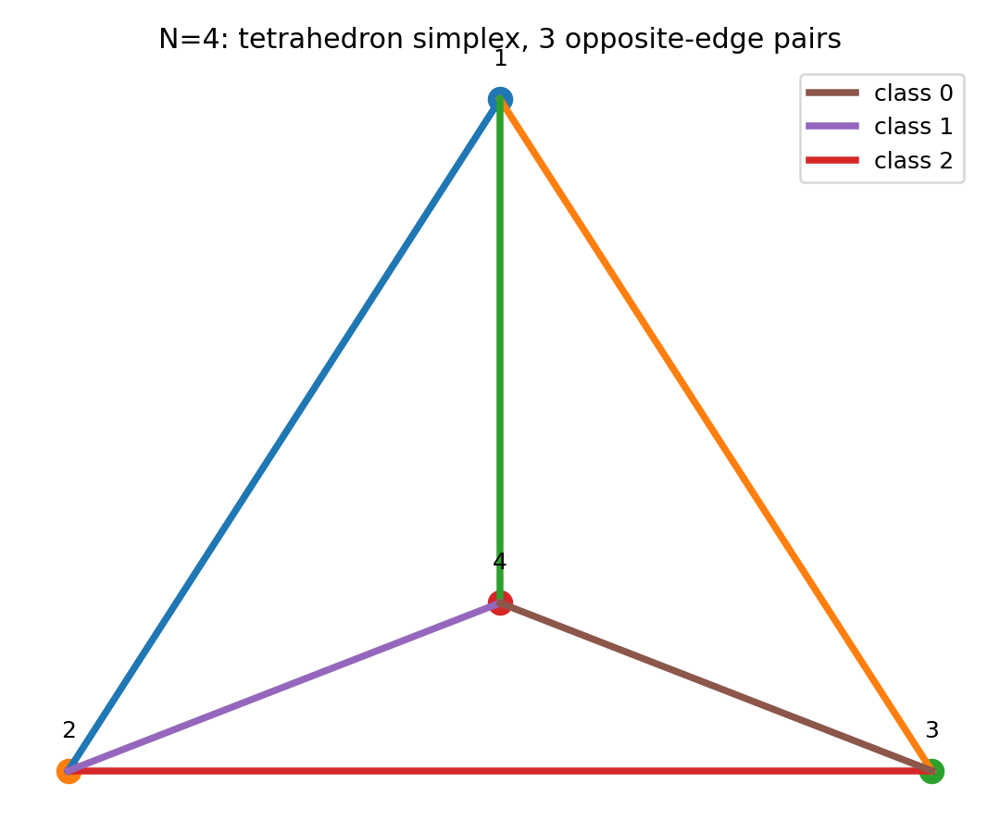

各頂点 star は3群から1本ずつ含み、局所閉包は

$$
v_1+v_2+v_3=0
$$

となる。準安定等分配では

$$
|v_1|=|v_2|=|v_3|.
$$

等 modulus の3複素数が和ゼロを作るためには複素平面上で正三角形を構成するしかなく、

$$
\boxed{\Delta\arg=2\pi/3=120^\circ}
$$

が厳密に従う。

したがって従来の「約120°」は数値観察ではなく、局所閉包＋等分配からの定理である。また120°配置には反対符号対が存在しないため、N=4にN=5型の2辺ゼロ閉包がないことも同時に説明できる。

## 22. N=5 の特殊対称性

N=5 は今回の $N=3$〜16 系列の中で、単なる「5頂点・rank 4 の複素simplex」にとどまらず、**位相分類、複素二乗距離分類、3次元的読出し、さらに一般の頂点閉包から独立な部分ゼロ閉包が同時に重なる最も明瞭な特異例**である。

ここでは N=5 を、最終状態だけでなく時間発展を含めて詳しく記述する。

まず、N=5で得られた構造を一枚で把握できる総合図を示す。以下の詳細節は、この図の各要素を順に分解して検証したものである。

**図7A　N=5複素関係距離構造の総合図。** 5頂点・10関係、rank 4、$3+3+2+2$ の4群、$K_5$ 上での辺配置、45組の位相差分類、3次元四角錐としての読出しを一枚にまとめた。N=5で「何が特別なのか」を最も直接に示す図である。

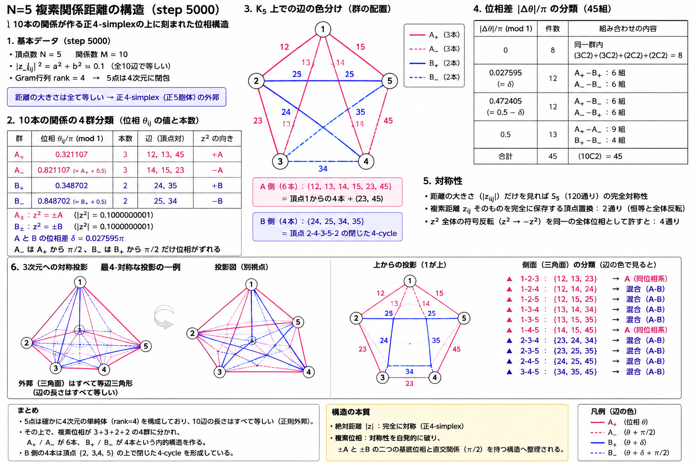

**図7B　N=5複素simplex完全解析の総合図。** 最終4群構造だけでなく、親平面外成分 $H_\perp$ の急拡大、4群一致誤差の長時間緩和、代表到達stepまで同じ時間軸上に整理している。急拡大が先にほぼ完了し、その後に位相・距離秩序化が継続する二段階発展を一望できる。

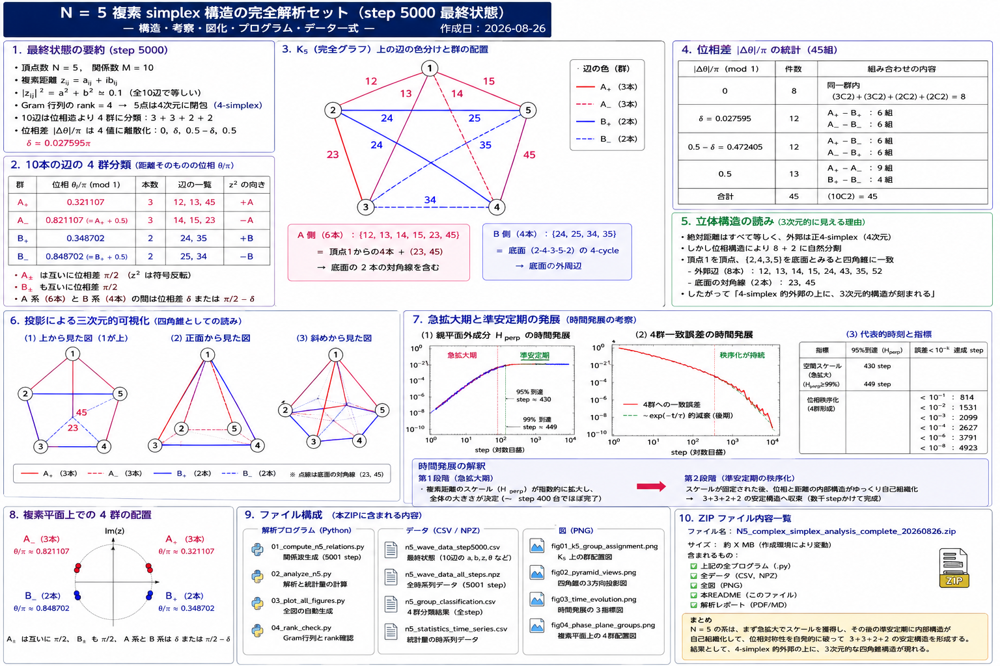

### 22.1 基本幾何：5頂点・10関係・rank 4

N=5 では、完全二体関係数は

$$
M=\frac{5\cdot4}{2}=10
$$

である。

10本の複素関係波 $z_{ij}$ から複素二乗距離

$$
d_{ij}^2=z_{ij}^2
$$

を作り、中心化複素Gram行列

$$
B=-\frac12 JD^2J
$$

を構成すると、非自明rankは

$$
\boxed{\operatorname{rank}B=4}
$$

となる。

したがって、まず基礎構造は通常の4-simplexに対応する「5頂点・10辺・rank 4」であり、この点自体はN=5だけの特異性ではない。特異性は、その10関係の**位相と複素二乗距離がさらに少数の高対称クラスへ自己組織化すること**にある。

### 22.2 10辺は最終的に $3+3+2+2$ の4群へ秩序化する

step 5000 の準安定状態では、10辺は

$$
A_+:\{12,13,45\},
$$

$$
A_-:\{14,15,23\},
$$

$$
B_+:\{24,35\},
$$

$$
B_-:\{25,34\}
$$

という

$$
\boxed{10=3+3+2+2}
$$

の4群へ収束する。

ここで重要なのは、これは単なる「位相の近い辺を人為的にクラスタリングした」分類ではないことである。各辺について $a,b,a^2,b^2,ab$ を直接追うと、同じ群に属する辺は複素二乗距離

$$
z_{ij}^2=(a_{ij}^2-b_{ij}^2)+2i a_{ij}b_{ij}
$$

の実部・虚部まで同一クラスへ収束する。

**図8　N=5の最終複素二乗距離クラス。** 10辺が4群へ分離し、各群内部で $z^2$ が同一値へ収束することを示す。

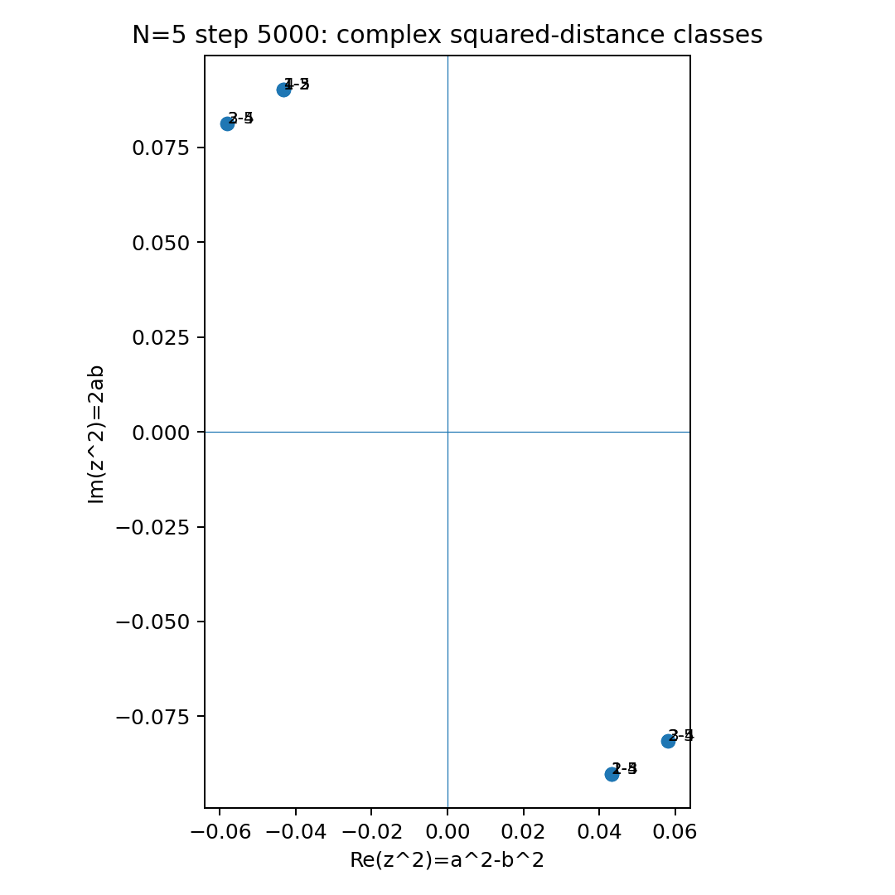

### 22.3 4群は「2種類の距離方向 × 符号反転」としてさらに縮約できる

4群の間には、

$$
A_-=-A_+,
\qquad
B_-=-B_+
$$

という関係が成立する。

したがって4群は独立な4種類ではなく、本質的には

$$
\boxed{
2\text{種類の複素二乗距離方向}
\times
\text{符号反転}
}
$$

である。

複素二乗距離では符号反転 $z^2\rightarrow-z^2$ は位相を $\pi$ だけずらすため、$A_+$ と $A_-$、$B_+$ と $B_-$ はそれぞれ同じ距離族の反対向きとして読める。

**図9　N=5の二つの距離族と符号反転。** $A$ 系と $B$ 系の二つの基本成分、およびその符号反転によって4群全体が構成される。

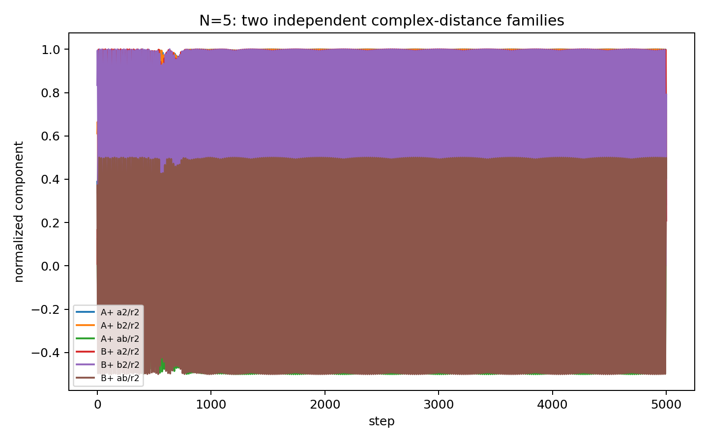

この構造は、N=5の位相分類を「4種類の偶然なクラス」ではなく、**二つの基本方向に対する反転対称性**として読む根拠になる。

### 22.4 3次元四角錐としての読出し

N=5の距離幾何そのものは rank 4 の4-simplexである。しかし、上の $3+3+2+2$ 位相・距離分類を用いると、10辺は3次元の四角錐として非常に自然に配置できる。

四角錐の辺数は、

- 底面4辺
- 頂点から底面4頂点へ向かう側辺4本
- 底面対角線2本

で、合計

$$
4+4+2=10
$$

である。

したがって全10関係を

$$
\boxed{8\text{外郭辺}+2\text{底面対角線}}
$$

として3次元的に読むことができる。

**図10　N=5の3次元四角錐読出し。** rank 4 の複素simplexそのものを3次元へ縮退させたという主張ではなく、最終位相・距離クラスが3次元四角錐の辺・対角線構造として読めることを示す。

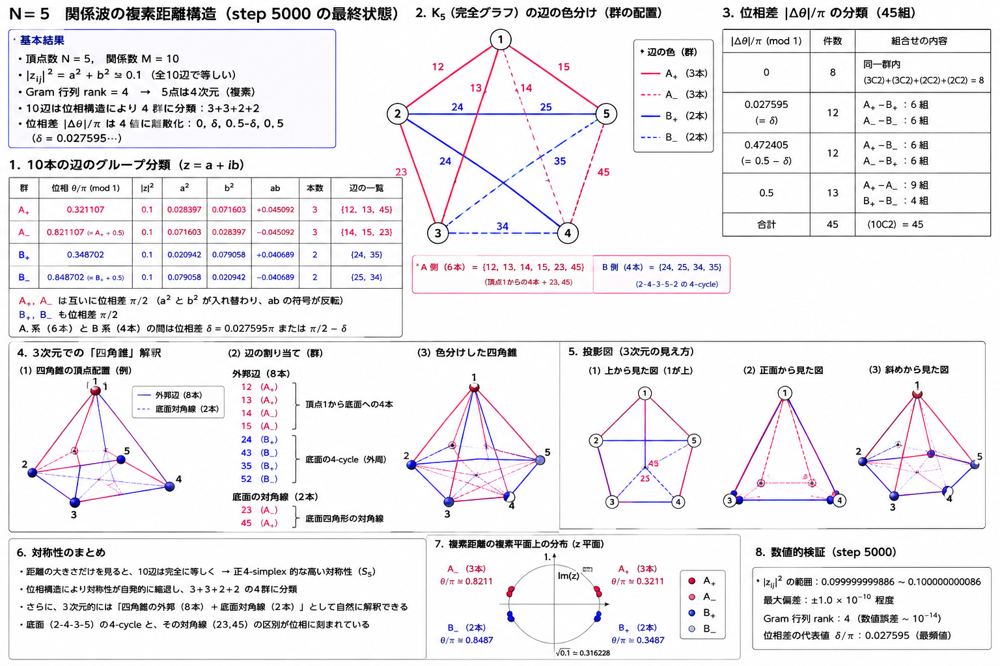

ここは誤読を避けるため重要である。

$$
\boxed{
\text{複素simplex rank}=4
}
$$

と、

$$
\boxed{
\text{位相・距離分類の3次元的読出し}
}
$$

は異なる観測量であり、両者は矛盾しない。

### 22.5 この4群は急拡大の初めから存在するのではない

最終 $3+3+2+2$ 構造を step ごとに逆追跡すると、急拡大の開始時点から完成形が固定されているわけではない。

親平面外振幅は先に急増し、その後に群内の位相差・距離差が長時間をかけて縮小する。

N=5では、親平面外二乗振幅 $H_\perp$ が最終値の99%へ到達するのは約 step 449 であるのに対し、4群構造の最終パターンへの誤差は、

$$
10^{-4}\text{ 以下}:\ \text{step }2627,
$$

$$
10^{-8}\text{ 以下}:\ \text{step }4923
$$

まで緩和を続ける。

**図11　N=5の4群構造への収束。** 急拡大が停止した後にも、群内部の位相・複素距離の均等化が長く続く。

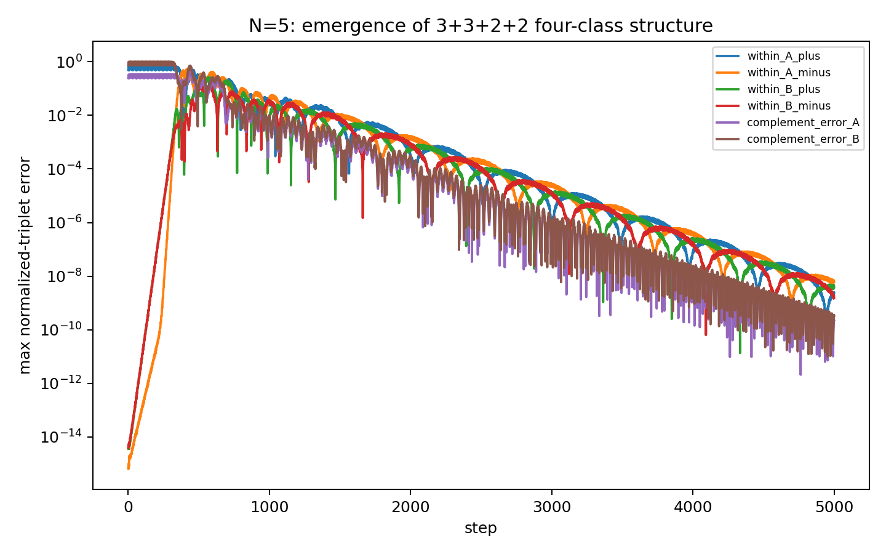

したがってN=5の時間発展は、

$$
\boxed{
\text{新方向への急拡大}
\rightarrow
\text{4群位相・距離構造への秩序化}
}
$$

という二段階である。

この観測は、本論文全体の「急拡大停止とsimplex対称化が時間的に対応する」という主張を、N=5で最も詳細に可視化した例である。

### 22.6 N=5の全体構造

以上をまとめると、N=5では同じ10本の関係波に、異なる読み出し階層が同時に成立する。

1. **完全グラフとして:** $K_5$、10辺。
2. **距離幾何として:** 5頂点・rank 4 の複素4-simplex。
3. **準安定位相分類として:** $3+3+2+2$ の4群。
4. **代数的縮約として:** 2種類の複素距離方向とその符号反転。
5. **3次元的読出しとして:** 四角錐の8外郭辺 + 2底面対角線。
6. **局所閉包として:** 各頂点に接続する4辺のvertex-starゼロ閉包。
7. **追加閉包として:** vertex-star spanでは説明できない非自明2辺ゼロ閉包。

**図12　N=5複素simplex完全解析図。** 同じ10関係が、rank 4 simplex、4群位相構造、二距離族、3次元四角錐読出しとして同時に記述できることに加え、急拡大期から準安定期への時間発展までを統合している。個別図8〜11の関係を一枚で確認できる。


### 22.7 非自明2辺ゼロ閉包の導出：13個と12通りは $3+3+2+2$ から必然

各頂点の自明な4辺 star 閉包を除外した後、N=5では2辺ゼロ閉包が13個観測された。

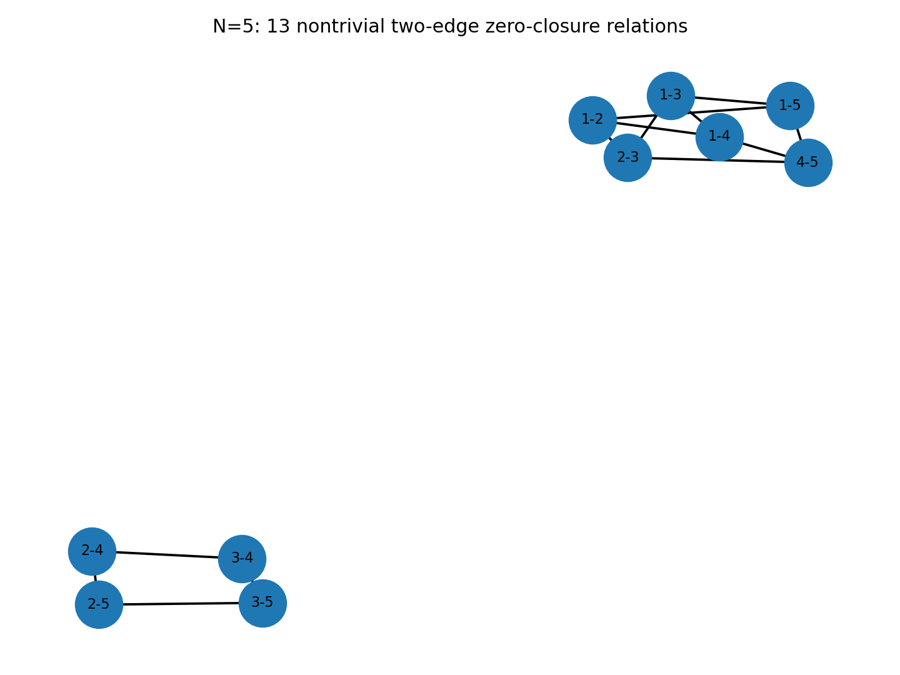

しかしこれは独立な数値偶然ではない。4群を

$$
A_+,\ A_-,\ B_+,\ B_-
$$

とし、そのサイズが

$$
|A_+|=|A_-|=3,
\qquad
|B_+|=|B_-|=2
$$

で、二乗距離値が

$$
q(A_-)=-q(A_+),
\qquad
q(B_-)=-q(B_+)
$$

なら、2辺ゼロ閉包 $q_e+q_f=0$ は反対符号群間の全組合せに一致する。

したがって個数は

$$
\boxed{3\times3+2\times2=13}.
$$

さらに10辺全体を5個のゼロ対へ完全分割するには、$A_+$ と $A_-$ の全単射 $3!$ 通りと、$B_+$ と $B_-$ の全単射 $2!$ 通りを独立に選ぶので、

$$
\boxed{3!\times2!=12}.
$$

従来数値探索で得た「13個」と「12 exact covers」は、したがって $3+3+2+2$ 符号対構造の**組合せ論的必然**として導出できる。

最良数値例

$$
z_{23}^2+z_{45}^2\simeq0
$$

の残差 $1.88\times10^{-10}$ は、この導出構造を数値実装が再現していることの検証値と位置づけられる。


### 22.8 N=5は「低次元だから単純」ではない

N=4にも $2+2+2$ の明瞭な対辺対称性があるが、その閉包はvertex-star閉包の線形帰結として説明できる。一方、N=5では、4群構造に加えて、一般のstar-spanから独立な2辺閉包とexact coverが現れる。

したがって今回の $N=3$〜16 系列でN=5が特別なのは、単に辺数が少なく可視化しやすいからではない。

$$
\boxed{
\text{simplex対称性}
+
\text{位相縮退}
+
\text{3次元的読出し}
+
\text{追加ゼロ閉包}
}
$$

が同一のNで重なることが、N=5の特異性である。

## 23. N=14〜16 の追加閉包探索

自明な $N-1$ 辺vertex-star閉包より小さい全次数を対象に、

- N=14: $k=2,\ldots,12$
- N=15: $k=2,\ldots,13$
- N=16: $k=2,\ldots,14$

を探索した。

N=14では $k=6$ に

$$
C=9.25\times10^{-7}
$$

の候補が存在したが、時間発展では $10^{-6}$ 近傍で停止し、N=5のように $10^{-8}$, $10^{-10}$ へ連続収束しない。

したがってこれは厳密な追加閉包ではなく quasi-closure と分類する。

N=15,16では探索した全次数で $10^{-6}$ を明瞭に下回る追加閉包は確認されなかった。

---

## 24. 本研究での公理系再構成――確定した部分と未確定な部分

従来は

$$
\sum z_m^2=0,
\qquad
U^n=I
$$

を二つの基本公理としていた。

今回、自己無撞着な実反対称固有モードから

$$
\boxed{
\text{self-consistency}
\Rightarrow
\text{complex rotating pair}
\Rightarrow
\sum z_m^2=0
\Rightarrow
S^1\text{ compact phase orbit}
}
$$

までは解析的に整理できた。

しかし

$$
S^1\text{ compactness}\not\Rightarrow U^n=I
$$

である。有限回帰には位相増分の有理ロックが別途必要である。

したがって本論文の公理削減の結論は、**二乗ゼロ閉包と複素回転構造は自己無撞着性から導出できるが、$U^n=I$ の完全導出には rational phase locking の追加機構が必要**、という形に修正する。

## 25. 先行研究との関係

### 25.1 研究の時間的順序

本研究の数値モデルは、以下に挙げる外部先行研究を実装または再現する目的で構築したものではない。

研究の時間的順序は、

$$
\boxed{
\text{独立な数値実験}
\rightarrow
\text{現象の発見}
\rightarrow
\text{後日の文献調査}
\rightarrow
\text{構造的関係の認識}
}
$$

である。

したがって外部文献は、本モデルの出発仮定ではなく、独立に得られた結果を既存研究空間へ位置づけるために引用する。

### 25.2 実構造からの複素構造

Aste [E1] は、有限次元の実Euclidean Hilbert空間の線形力学から複素構造が現れる可能性を論じている。

本研究との共通点は「複素数を最初から原始的な入力としなくてもよい」という問題意識にある。

一方、本研究では完全二体関係から構成した実反対称作用の自己無撞着固定点が複素回転対を生成する点が異なる。

### 25.3 高次元自由度からの低次元膨張時空

Lorentzian type IIB / IKKT matrix modelでは、多数の行列自由度から低次元の膨張時空が動的に現れる可能性が数値的に研究されている [E2,E3]。

本研究も、多数の関係自由度からrank生成と方向選択が生じるという構造的類似を持つ。

ただし作用、自由度、確率測度、数値手法は異なり、本研究はIKKT模型の再現ではない。

### 25.4 インフレーションと動的コンパクト化

Kihara et al. [E4] は10次元Einstein–Yang–Mills系において、4次元側の指数膨張と余剰次元のコンパクト化を同一の力学系で研究している。

本研究のseedなし系では全主軸が等方的に展開するが、将来の倍音seed実験では、一部方向が巨視化し、別の方向がcompactなまま残る異方的分離を検証する予定である。

この意味で、同研究は今後の比較対象として重要である。

---

## 26. 考察――開始機構は相対平衡の線形不安定性として定量化された

### 26.1 seedless onset と固定点残差

明示seedを一切加えず $Z_0=v$ とし、`make_parent` toleranceを $10^{-6},10^{-8},10^{-10},10^{-12}$ と変更した。

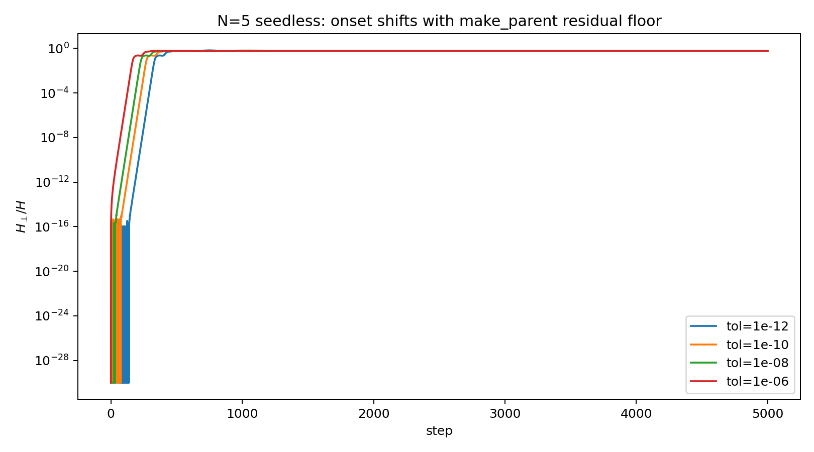

$f=H_\perp/H_{\rm total}\ge10^{-8}$ の onset step は72, 134, 176, 238と遅延した一方、成長率は約0.17251/stepで一定だった。

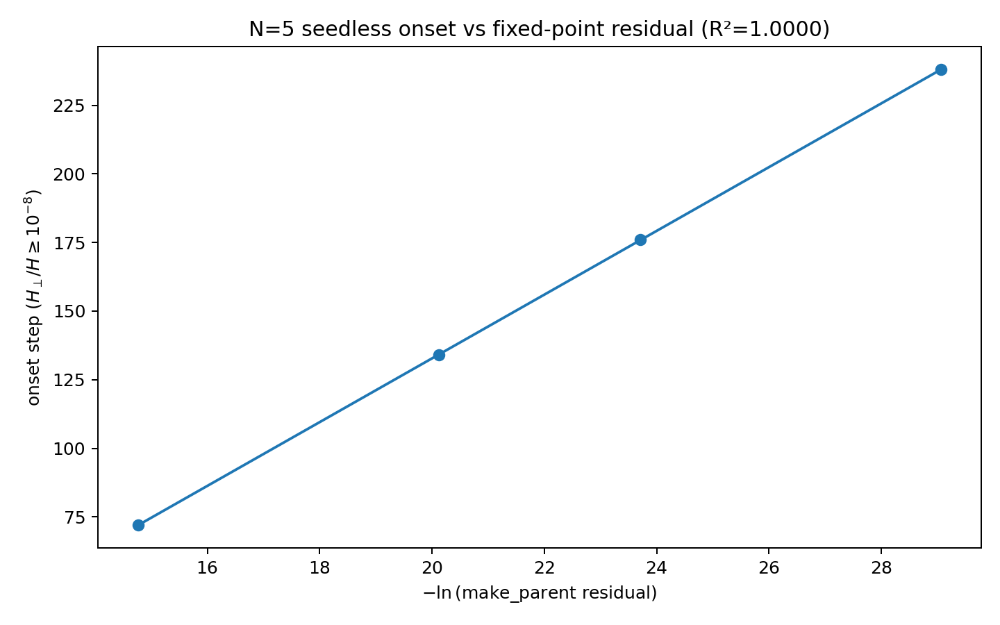

$$
t_{\rm onset}=a[-\ln\varepsilon_{\rm parent}]+b
$$

の回帰は

$$
a=11.6162,
\qquad R^2=0.999992.
$$

したがって「seedなし」の内在床は `make_parent` 固定点残差であり、残差は開始時刻を変えるが成長率は変えない。

### 26.2 rotating-frame Jacobian が rank-4 と成長率を同時に説明する

親状態の一step全体位相回転を除いた rotating-frame map の20実次元 Jacobian を数値線形化した。

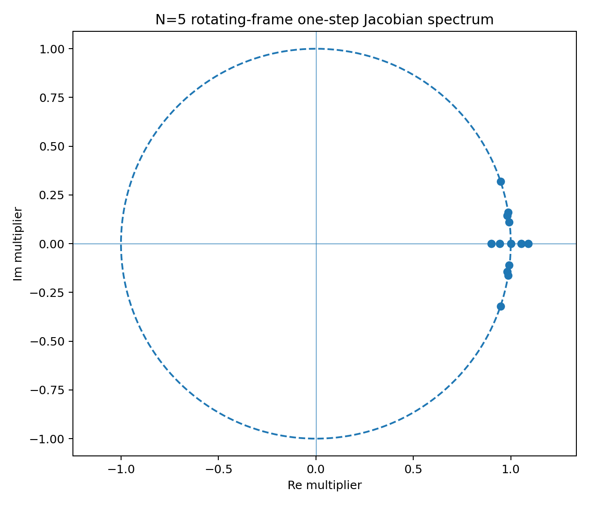

最大 multiplier は

$$
\mu_1=\mu_2=1.090086569
$$

という2重縮退であり、最大不安定空間は2実次元である。

したがって

$$
\boxed{\text{parent rank-2}+\text{dominant unstable 2D}=\text{rank-4}}
$$

という選択則が得られる。

さらに振幅指数

$$
\lambda_A=\ln\mu_1=0.0862571143
$$

から二乗振幅指数

$$
2\lambda_A=0.172514229
$$

を予測する。これは直接時間発展の $H_\perp$ 成長率 0.172513 程度と一致する。

さらに

$$
\frac1{\lambda_A}=11.5932
$$

は、tol掃引で得た onset-vs-residual の傾き 11.6162 と一致する。

したがって N=5 の急拡大開始については、

$$
\boxed{
\text{self-consistent relative equilibrium}
\rightarrow
\text{linear instability}
\rightarrow
\text{dominant 2D unstable eigenspace}
\rightarrow
\text{rank-4 and }H_\perp\text{ exponential growth}
}
$$

という定量的機構が成立する。

なお第2不安定対

$$
\mu_3=\mu_4=1.052603212
$$

も存在し、より遅い副成長指数 $2\ln\mu_3\simeq0.10253$ を予測する。

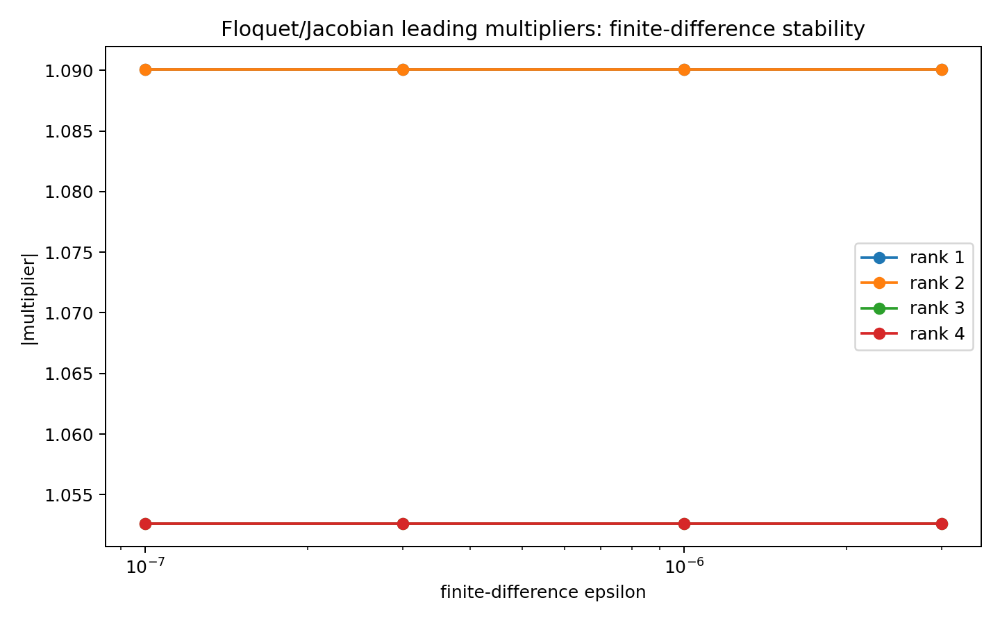

### 26.3 preheating 型 mode transfer との構造的類似

本系では全ノルムが厳密保存されるため、急拡大はエネルギー生成というより、コヒーレント親モードから直交モードへの指数的 transfer である。構造的には宇宙論的 inflation 本体より、parametric mode amplification / preheating に近い。

ただし本論文では標準的なpreheating方程式との同一性を主張しない。Floquet不安定性、親成分の枯渇、飽和後の長時間再配分という力学的類似を指摘するに留める。

### 26.4 N=5 のモジュライ seed 掃引

8個の parent random seed で5000 stepを再実行したところ、全runで最終群サイズは

$$
3+3+2+2
$$

となり、二距離族 modulus はともに約0.1へ収束した。

一方、符号を商に取った二距離族間の相対位相はrun間で変化した。

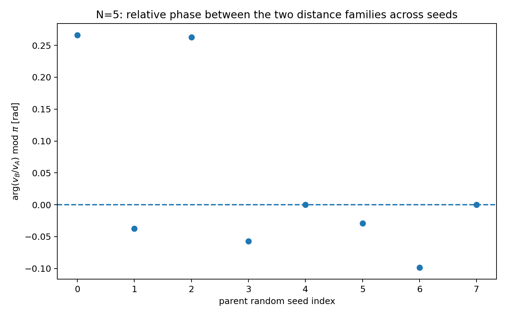

これは $3+3+2+2$ と等 modulus が剛的に選択される一方、距離族間相対位相には平坦方向が残る可能性を支持する。より長時間・多数seedでの追試が必要である。

## 27. 限界と今後の課題

今回の追加解析によって、従来の未解決問題の一部は縮約された。

1. **急拡大開始**：N=5では相対平衡の線形不安定性として定量化できた。他Nで同じFloquet構造が成立するかを確認する。
2. **rank-4選択**：N=5では最大不安定2実次元が説明する。第2不安定対の実時間成長を直接分離する。
3. **停止**：無限増大しない理由は全ノルム保存で解決。残る問題は、なぜ等モジュラー・ヌルsimplexへ秩序化するかである。
4. **熱化／秩序化**：スペクトルエントロピーは最終的に最大となるが単調ではない。N依存の緩和時間・FPUT型準可積分性の有無を調べる。
5. **N=5のモジュライ**：相対位相が真の平坦方向か、超長時間でロックするかを多数seed・長時間で確認する。
6. **$U^n=I$**：自己無撞着性からcompact phase orbitまでは導出したが、有限回帰には rational phase locking の機構が必要である。
7. **N=5特異性の一般分類**：反対符号位相クラスの存在条件を $K_N$ の均衡辺クラス設計として分類する。
8. **他NのFloquet spectrum**：N=3〜16で不安定空間次元とsimplex秩序の対応を系列化する。

## 28. 結論

本研究は、seedなし関係波閉鎖系の急拡大を再監査し、数値観察の一部を厳密定理へ、開始機構の一部を線形安定性問題へ格上げした。

主要結果は次の通りである。

1. 実反対称生成子のCayley更新は実直交であり、$Z^\dagger Z$ と $Z^TZ$ を厳密保存する。
2. したがって $H_\perp$ の増大は外部注入ではなく、$H_\parallel$ からの内部移送であり、$H_\perp\le H_{\rm total}$ が急拡大の運動学的上限を与える。
3. $K/\sigma_{\max}$ 正規化は連続極限では状態依存の時間再パラメータ化に対応するが、現行有限stepでは完全な同一軌道ではない。
4. seedless N=5では `make_parent` 固定点残差を小さくすると onset が $-\ln\varepsilon$ に比例して遅れ、成長率は不変である。
5. rotating-frame Jacobian の最大不安定 multiplier は2重縮退 $\mu=1.090086569$ で、2実次元の最速不安定空間が parent rank-2 に加わることでrank-4を説明する。
6. $2\ln\mu=0.172514$ は直接測定した $H_\perp$ 成長率約0.172513と一致し、$1/\ln\mu=11.593$ は onset-vs-residual の実測傾き11.616と一致する。
7. 全頂点 star 二乗閉包は、重心表示において全simplex頂点が複素ヌル錐上にあることと同値である。
8. 等分配と合わせた準安定状態は **equimodular null complex simplex** として統一的に記述できる。
9. N=4の120°位相差は局所閉包＋等分配から厳密に導出される。
10. N=5の13個の非自明2辺閉包と12通りのexact coverは、$3+3+2+2$ 符号対構造から $3\times3+2\times2=13$、$3!2!=12$ と厳密に導出される。
11. N=5の8-seed掃引では $3+3+2+2$ と等 modulus は全runで再現した一方、二距離族間相対位相は一意に固定されず、モジュライの可能性を示した。
12. 自己無撞着性から複素回転構造、二乗ゼロ閉包、compact $S^1$ 位相軌道までは導出できるが、$U^n=I$ には別途 rational phase locking が必要である。

したがってN=5の急拡大開始は、少なくとも数値線形化の範囲で

$$
\boxed{
\text{self-consistent rank-2 relative equilibrium}
\rightarrow
\text{dominant 2D linear instability}
\rightarrow
\text{rank-4}
\rightarrow
\text{exponential internal mode transfer}
\rightarrow
\text{bounded saturation}
\rightarrow
\text{equimodular null-simplex ordering}
}
$$

という一つの力学系列として記述できる。

## 自己引用

**[K1]** N. Kihara, *Anonymous Equal-Amplitude Composite-Wave Model: Basic Axiom System v9 — Pure Definition*, 2026.

**[K2]** 木原範昭, 「N体完全二体関係波における生成子ランク線形上界と三方向飽和」, 2026. Concept DOI: 10.5281/zenodo.21465898.

**[K3]** 木原範昭, 「N体固定生成子系における平面分解読出し」, 2026. Concept DOI: 10.5281/zenodo.21468959.

**[K4]** 木原範昭, 「N体関係波閉鎖系における状態の自発的分裂の開始と帰結の三分類」, 2026. Concept DOI: 10.5281/zenodo.21486233.

**[K5]** 木原範昭, 「波の数は系の分解能である」, 2026. Concept DOI: 10.5281/zenodo.21486544.

**[K6]** 木原範昭, 「完全二体関係波の反対称生成子から生じる三方向構造」, 2026.

**[K7]** 木原範昭, 「N体関係波閉鎖系における三方向空間の創発」, 2026.

**[K8]** 木原範昭, 「N体関係波閉鎖系における三方向生成の時間構造――二段階seed除去による因果分離」, 2026. Version DOI: 10.5281/zenodo.21614403; Concept DOI: 10.5281/zenodo.21614402.  
note: https://note.com/kiharanoriaki/n/n48a02cd70f47

## 外部先行研究

**[E1]** A. Aste, “Origin of the Complex Structure of Quantum Mechanics,” arXiv:1905.12894, 2019.  
https://arxiv.org/abs/1905.12894

**[E2]** T. Aoki, M. Hirasawa, Y. Ito, J. Nishimura, A. Tsuchiya, “On the structure of the emergent 3D expanding space in the Lorentzian type IIB matrix model,” *Progress of Theoretical and Experimental Physics* 2019, 093B03 (2019). DOI: 10.1093/ptep/ptz092.

**[E3]** M. Hirasawa, K. N. Anagnostopoulos, T. Azuma, K. Hatakeyama, J. Nishimura, S. Papadoudis, A. Tsuchiya, “The effects of SUSY on the emergent spacetime in the Lorentzian type IIB matrix model,” arXiv:2407.03491, 2024.  
https://arxiv.org/abs/2407.03491

**[E4]** H. Kihara, M. Nitta, M. Sasaki, C.-M. Yoo, I. Zaballa, “Dynamical Compactification and Inflation in Einstein-Yang-Mills Theory with Higher Derivative Coupling,” *Physical Review D* **80**, 066004 (2009). DOI: 10.1103/PhysRevD.80.066004.

---

## 再現性に関する注記

本研究で用いた再実験データ・プログラム・図化は、2026-08-26 に作成した以下の検証パッケージ群に保存している。

- `K_sigma_normalization_artifact_test_N4_N5_20260826.zip`
- `N5_gamma_continuum_test_bundle_20260825.zip`
- `N3_N4_complex_simplex_complete_analysis_20260826.zip`
- `N5_complex_simplex_complete_analysis_20260826.zip`
- `N6_N7_complex_simplex_complete_analysis_20260826.zip`
- `N8_N9_complex_simplex_complete_analysis_20260826.zip`
- `N10_N11_complex_simplex_complete_analysis_20260826.zip`
- `N12_N13_complex_simplex_complete_analysis_20260826.zip`
- `N14_N15_complex_simplex_complete_analysis_20260826.zip`
- `N16_complex_simplex_complete_analysis_20260826.zip`
- `N3_N16_partial_zero_closure_analysis_20260826.zip`
- `N3_N16_nontrivial_zero_closure_analysis_20260826.zip`
- `N14_N16_complete_nontrivial_zero_closure_search_20260826.zip`
- `N5_dynamics_followup_theorems_and_stability_20260826.zip`

これらのプログラム・生データ・図化を用いることで、本稿の主要数値結果を再現できる。
