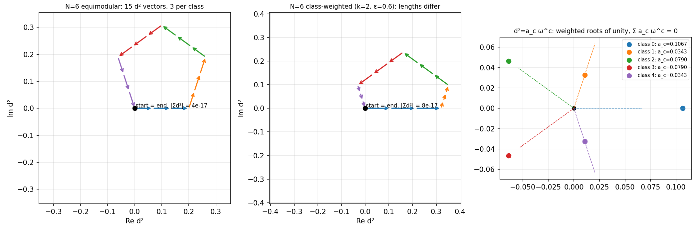
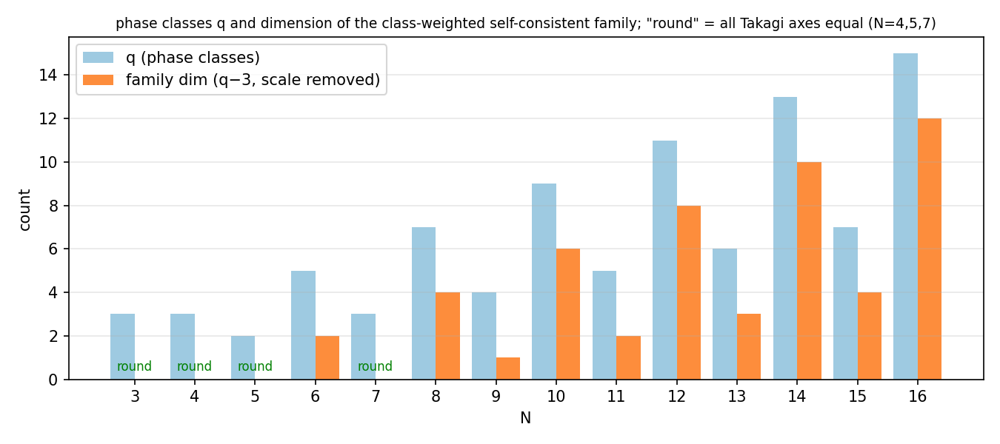
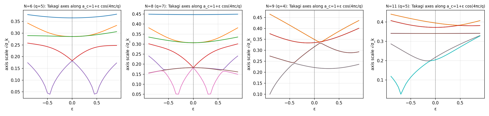
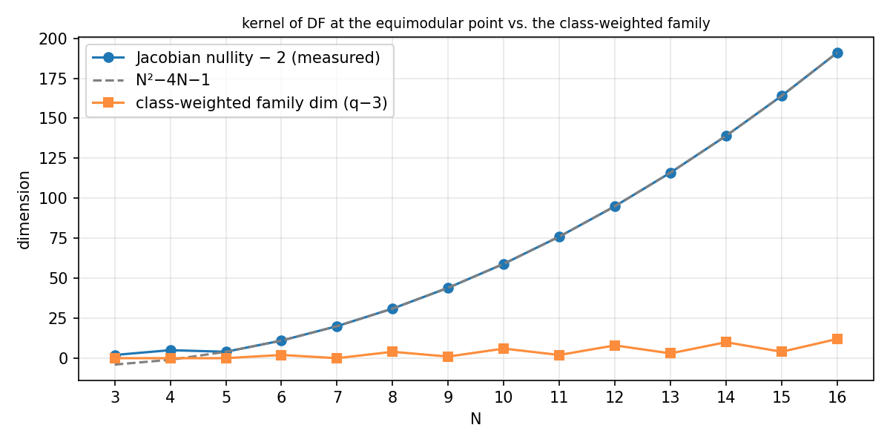
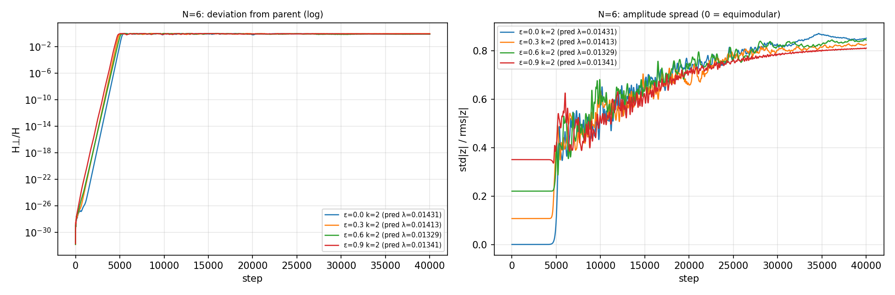
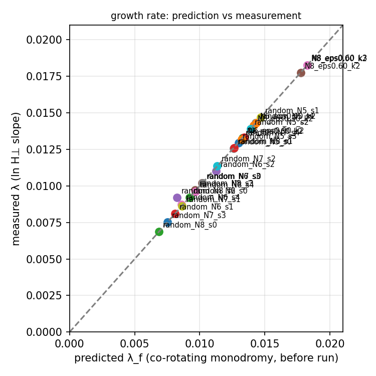
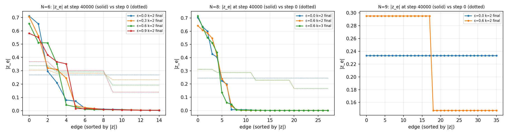
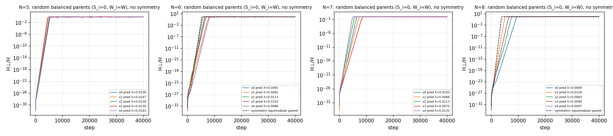
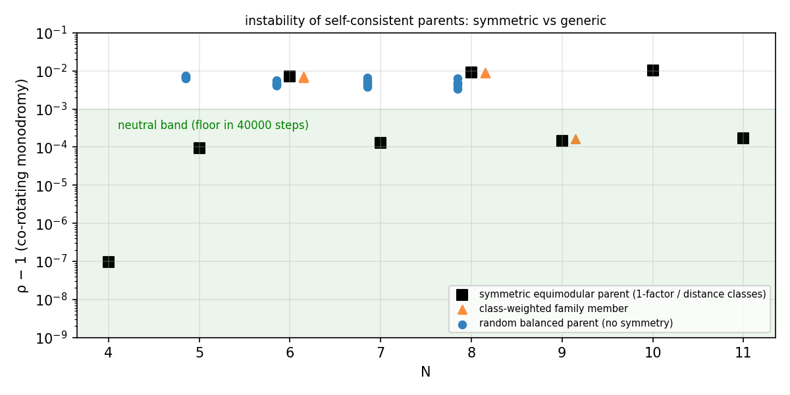

# 複素シンプレックス：重心閉塞と非等モジュラー族——等モジュラー条件を外した組み直し

**作成日:** 2026-08-30　**位置づけ:** 基礎文書『複素シンプレックス基礎——N=3 から順に』（`../複素シンプレックス基礎_N別全展開_20260830/`、以下「基礎文書」）の続編。基礎文書は「自己無撞着」に加えて「等モジュラー（全波の大きさが等しい）」を**選択**していた。本文書はその選択を外し、位相配置・相互作用 K・B 行列・Takagi 軸の規約は一切変えずに、振幅を自由にして組み直す。
**方針（木原指示）:** 必要なのは各波の長さが等しいことではなく、複素二乗距離ベクトルが中心で釣り合うこと（重心が原点）ではないか——この問いを、代数（全展開）・数値（N=3〜16）・力学（40000 step 走行 29 本）の 3 面で決着させる。仮説は走行前に固定し、外れた予測も修正過程ごと記録する。
**再現:** `bash run_all.sh`（全パス＋PDF＋SHA、約 12 分）。力学は手作り親パッケージ（`../手作り親_設計点走行_N4toN8_20260829/`）の走行プログラムを 3 行だけ変更したコピーで、N8 テンプレートと同一（振幅込み K、厳密線形回転 exp((2π/124)K)、種なし、正規化なし、直接読出し H⊥）。

## 0. 用語と分類

### 0.1 基礎文書から引き継ぐ用語

波 z = a + b·i（1 組に 1 個）、状態ベクトル v、ノルム ‖v‖、2 乗距離 d² = z²、複素シンプレックス、閉塞 Σz² = 0、局所閉塞、B = −½JD²J、Takagi 値 σ_k と軸スケール √σ_k、埋め込み座標 x_i、rank、相互作用 K_ef = Im(z̄_e z_f)（点を共有する組のみ）、自己無撞着 i·K·v = μ·v（μ ≠ 0）、等モジュラー。定義は基礎文書 §0.1 のとおりで、ここでは繰り返さない。

### 0.2 本文書で新しく使う記号

- **M** = N(N−1)/2：波の総数。**A**：M×M の隣接行列（点を共有する組どうしで 1、それ以外と対角は 0）。K = A·Im(z̄z^T)（· は成分ごとの積）。
- **位相クラス**：基礎文書の構成で同じ位相を持つ組の集まり。偶数 N は 1-因子分解の色（q = N−1 クラス、各頂点に各クラス 1 本）、奇数 N は距離クラス（q = (N−1)/2、各頂点に各クラス 2 本）。クラス c の位相は θ_c = πc/q、d² の角度は 2θ_c = 2πc/q。**ω** = e^{2πi/q}。
- **クラス別振幅二乗 a_c**：クラス c の全ての波について |z|² = a_c と置く。等モジュラーは a_c ≡ r² の特殊例。
- **頂点局所和 S_i** := Σ_{k≠i} z_ik²（頂点 i に集まる組の d² の和。局所閉塞は S_i = 0）。
- **頂点重み W_i** := Σ_{k≠i} |z_ik|²（頂点 i に集まる組のエネルギー）。Σ_i W_i = 2‖v‖²。
- **共回転モノドロミー ρ**：1 刻み写像 Φ(z) = exp(−i(2π/L)·iK(z)) z（L = 124）を親 v の周りで線形化し、親自身の回転 e^{−iφ}（φ = (2π/L)μ）を戻した実 2M×2M 行列 G = R(+φ)·DΦ(v) の最大固有値絶対値。H⊥（親からのずれのエネルギー）の 1 刻み成長率は λ_f = 2 ln ρ。

### 0.3 何が公理・選択・規約・定理か（基礎文書 §0.2 との差分）

- 公理 1〜3（波・相互作用・発展）：変更なし。
- 選択：**自己無撞着のみ**。等モジュラーは選択から外す（本文書の主題）。
- 規約：スケール（‖v‖ は走行比較のため同 N の先行親に一致させる。§1 の代数展開では r² = 1/15）、全体位相（クラス 0 を θ = 0）。
- 定理：大域閉塞 Σz² = 0（基礎文書）、一般和則（§1）、クラス重み付き族の存在条件（§2）、自己無撞着の頂点形（§3）、およびそれらの系。数値で確立した事実は【実測】と明記する。

## 1. 一般和則（重み付き和則）の全展開

基礎文書の和則 Σsin²φ = −μ/r²、Σsin2φ = 0 は等モジュラーを先に置いた特殊形である。等モジュラーを置かずに展開する。

**設定**：z_e = r_e e^{iθ_e}（r_e > 0）。隣接する 2 組 e, f の位相差を φ_ef = θ_f − θ_e と書く。

**導出 1（K の成分）**：K_ef = A_ef Im(z̄_e z_f) = A_ef r_e r_f Im(e^{i(θ_f−θ_e)}) = A_ef r_e r_f sin φ_ef。

**導出 2（自己無撞着の e 成分）**：(i·K·v)_e = i Σ_f A_ef r_e r_f sin φ_ef · r_f e^{iθ_f} = μ r_e e^{iθ_e}。両辺を r_e e^{iθ_e}（≠ 0）で割る：

　i Σ_f A_ef r_f² sin φ_ef e^{iφ_ef} = μ.

**導出 3（実部・虚部）**：i sin φ e^{iφ} = i sin φ cos φ − sin²φ。よって

- 実部条件：**Σ_{f∼e} r_f² sin²φ_ef = −μ**
- 虚部条件：**Σ_{f∼e} r_f² sin 2φ_ef = 0**

（f∼e は e と点を共有する組にわたる和）。これが**一般和則**である。r_f ≡ r を代入すれば基礎文書の形に戻る。隣接波の寄与は「振幅二乗 r_f² を重みとする」——大きい波ほど強く押す——という構造が、等モジュラーでは r² に吸収されて見えなくなっていた。

## 2. クラス重み付き族：重心が原点なら閉じる

### 2.1 条件の導出（偶数 N）

1-因子分解では、組 e（クラス c）から見て、他の各クラス c′ ≠ c に隣接組がちょうど 2 本ある（e = (i,j) に対し、頂点 i のクラス c′ の 1 本と頂点 j のクラス c′ の 1 本。両端点が同じ組になることは完全マッチングでは起こらない）。同じクラスの隣接組は 0 本。位相差は φ = π(c′−c)/q、2φ = 2π(c′−c)/q。

一般和則に代入する。sin²φ = (1 − cos 2φ)/2 なので、実部条件と虚部条件をまとめて 1 本の複素条件にできる：

　Σ_{c′≠c} 2a_{c′} sin²φ = −μ　かつ　Σ_{c′≠c} 2a_{c′} sin 2φ = 0
　⇔　Σ_{c′≠c} a_{c′} (1 − e^{2πi(c′−c)/q}) = −μ　（実部が第 1 式、虚部が第 2 式）
　⇔　Σ_{c′≠c} a_{c′} − ω^{−c} (T − a_c ω^c) = −μ,　ここで **T := Σ_c a_c ω^c**.

整理すると **ω^{−c} T = a_c + Σ_{c′≠c} a_{c′} + μ = Σ_{c′} a_{c′} + μ**（全ての c について）。右辺は c によらない実数なので、q ≥ 3 では ω^{−c}T が c = 0, 1 で同時に実になるには T = 0 しかない（ω^{−1} は実でない）。q = 2（ω = −1）でも同じ結論 a_0 = a_1 に落ちる。よって

- **クラス重み付き族の存在条件：Σ_c a_c ω^c = 0**（複素平面上で、振幅二乗 a_c を重みとした 1 の q 乗根の重心が原点）
- **回転速度：μ = −Σ_c a_c = −(N−1)·〈|z|²〉**（〈|z|²〉 は全組平均。各クラスは同数 N/2 本なので Σa_c = q〈|z|²〉 = (N−1)〈|z|²〉）

μ/〈|z|²〉 = −(N−1) は等モジュラーの μ/r² = −(N−1) をそのまま一般化している。

### 2.2 条件の導出（奇数 N）

距離クラスでは、組 e = (i, i+d)（クラス d）から見て、他のクラス d′ の隣接組は頂点 i に 2 本、頂点 i+d に 2 本の計 4 本、同じクラス d の隣接組は 2 本（位相差 0、寄与なし）。よって係数が 2 から 4 になるだけで条件は同じ **Σ_c a_c ω^c = 0**、μ = −2Σ_c a_c = −(N−1)〈|z|²〉（各クラス N 本、Σa_c = q〈|z|²〉、2q = N−1）。

### 2.3 自由度の数え上げと q ≤ 3 の強制

Σa_c ω^c = 0 は実条件 2 本（q ≥ 3）。未知数 q 個から全体スケール 1 個を除くと、族の実次元は **q − 3**（q ≥ 3）、q = 2 は a_0 = a_1 で 0。

- q = 3（N = 4, 7）：a_0 + a_1ω + a_2ω² = 0 で 1, ω, ω² の実線形関係は 1 + ω + ω² = 0 だけなので a_0 = a_1 = a_2。**等モジュラーが強制される。**
- q = 2（N = 5）：a_0 = a_1。同上。
- q ≥ 4（N = 6, 8, 9, …）：**非等モジュラーな自己無撞着解の連続族**が存在する。具体形：a_c = 1 + ε cos(2πkc/q)、k ≢ 0, ±1 (mod q)、|ε| < 1（三角和の直交性で Σa_c ω^c = 0 が厳密に成り立ち、全 a_c > 0）。

### 2.4 実測（N = 3〜16、`program/pass1_family.py`、`results/family_table.csv`）

| N | M | q | 族次元（理論 q−3＝実測） | 等モジュラー点の Takagi 軸（相異なる値） | 丸い |
|---|---|---|---|---|---|
| 3 | 3 | — | 0（Z_3 配置、rank 1） | 0.2582 | ○ |
| 4 | 6 | 3 | 0 | 0.2582 | ○ |
| 5 | 10 | 2 | 0 | 0.2730 | ○ |
| 6 | 15 | 5 | 2 | 0.3651 / 0.2857 / 0.1826 | × |
| 7 | 21 | 3 | 0 | 0.2970 | ○ |
| 8 | 28 | 7 | 4 | 0.4472 / 0.3071 / 0.1826 | × |
| 9 | 36 | 4 | 1 | 0.3497 / 0.3353 / 0.3162 / 0.2218 | × |
| 10 | 45 | 9 | 6 | 0.5164 / 0.3247 / 0.1826 | × |
| 11 | 55 | 5 | 2 | 0.3951 / 0.3724 / 0.3409 / 0.2176 / 0.2048 | × |
| 12 | 66 | 11 | 8 | 0.5774 / 0.3398 / 0.1826 | × |
| 13 | 78 | 6 | 3 | 0.4357 / 0.4071 / 0.3647 / 0.2162 / 0.2059 / 0.1969 | × |
| 14 | 91 | 13 | 10 | 0.6325 / 0.3532 / 0.1826 | × |
| 15 | 105 | 7 | 4 | 0.4726 / 0.4395 / 0.3872 / 0.2154 / 0.2110 / 0.1954 / 0.1927 | × |
| 16 | 120 | 15 | 12 | 0.6831 / 0.3651 / 0.1826 | × |

- 族次元の理論値 q−3 は、条件 a → Σa_cω^c の実 rank（q ≥ 3 で 2、q = 2 で 1）の数値計算と全 N で一致。
- **丸い（全 Takagi 軸等長）N = 3, 4, 5, 7 ⇔ 族次元 0**：基礎文書で実測されていた「丸いのは N=4,5,7 だけ」は、「クラス重み付き族が点に退化する N」と 14 個の N 全てで一致する。
- 族メンバー（k = 2、ε = 0.6）の実測：全 N（6〜16）で自己無撞着残差 ≤ 3e-16、大域閉塞 ≤ 4e-16、**局所閉塞 ≤ 3e-17（保たれる）**、rank = N−1（保たれる）、μ は等モジュラー点と同一、|z| は [0.166, 0.327] の幅（等モジュラー 0.258）。**変わるのは Takagi 軸（形）だけ**。
- 対照（k = 1、Σa_cω^c ≠ 0）：残差 0.06〜0.29、閉塞 0.3。自己無撞着でない。条件が必要十分であることの確認。

図 1：N=6。左：等モジュラー（15 本の d² を頭尾でつないだ閉路、各クラス 3 本ずつ）。中：クラス重み付き（k=2, ε=0.6）——各辺の長さが違っても閉路は原点で閉じる（|Σd²| = 8e-17）。右：d² = a_c ω^c を重み付き 1 の 5 乗根として見たもの。必要なのは**重み付き重心が原点**であって等長ではない。

図 2：q と族次元 q−3。丸い N（4, 5, 7、および N=3）はちょうど族次元 0 の N。

図 3：族の 1 パラメータ路 a_c = 1 + ε cos(4πc/q) に沿う Takagi 軸（N = 6, 8, 9, 11）。ε = 0（等モジュラー）で縮退していた軸が ε ≠ 0 で分裂する。閉塞・局所閉塞・rank・μ は路上で一定（`data/family_path_N*.csv`）。

## 3. 自己無撞着の頂点形（厳密な書き換え）

クラス構造を一切使わない、任意の状態に対する恒等式を導く。これが §4 以降の全ての鍵になる。

**導出 4**：Im(z̄_e z_f) = (z̄_e z_f − z_e z̄_f)/(2i) なので

　(i·K·v)_e = i Σ_f A_ef (z̄_e z_f − z_e z̄_f)/(2i) · z_f = ½ [ z̄_e (A z²)_e − z_e (A|z|²)_e ]

（z² と |z|² は成分ごと）。すなわち **i·K·v = ½[ z̄·(Az²) − z·(A|z|²) ]**（ここの · は成分ごとの積）。

**導出 5（隣接和を頂点量で書く）**：e = (i,j) の隣接組は「i に集まる組（e 自身を除く）」と「j に集まる組（e 自身を除く）」なので

　(Az²)_e = S_i + S_j − 2z_e²,　(A|z|²)_e = W_i + W_j − 2|z_e|².

**導出 6（自己無撞着の頂点形）**：i·K·v = μv の e 成分に代入し z_e を掛けて整理する：

　½[ z̄_e (S_i + S_j − 2z_e²) − z_e (W_i + W_j − 2|z_e|²) ] = μ z_e
　⇔ z̄_e (S_i + S_j) = z_e (2μ + W_i + W_j)
　⇔ **S_i + S_j = (2μ + W_i + W_j) · z_e² / |z_e|²**　…(★)　（両辺に z_e/|z_e|² を掛けた）

(★) は自己無撞着と同値（各辺について）。右辺は z_e² の実数倍なので、**自己無撞着とは「隣り合う 2 頂点の局所和 S_i + S_j が、その辺の d² = z_e² と同じ向き（または逆向き）を向く」こと**である。

**系 1（局所閉塞＋頂点重み均等 ⇒ 自己無撞着）**：S_i = 0（全 i）かつ W_i = W（全 i）なら (★) の両辺は 2μ + 2W = 0 で満たされ、μ = −W。
**系 2（自己無撞着＋局所閉塞 ⇒ 頂点重み均等）**：S ≡ 0 なら (★) から W_i + W_j = −2μ が全ての辺で成り立ち、完全グラフ（N ≥ 3）では W_i ≡ −μ。
**系 3**：等モジュラー親では W_i = (N−1)r²、よって μ = −(N−1)r²（基礎文書の実測値の証明）。クラス重み付き族では W_i = Σ_c a_c（偶数）/ 2Σ_c a_c（奇数）で §2 の μ を再現する。

【実測】(★) の残差は等モジュラー親・族メンバー（N = 4〜11）で ≤ 6e-16、max|S_i| ≤ 8e-17、W の幅 ≤ 3e-16、W̄ = −μ が 6 桁一致。乱数状態（自己無撞着でない）では (★) 残差 1.9（`results/identity_check.csv`）。

## 4. 解多様体の次元：等モジュラー点はどれだけ孤立しているか

### 4.1 ヤコビアン核（`program/pass2_jacobian.py`）

F(v) := i·K(v)v − μ(v)v（μ(v) = Re〈v, iKv〉/〈v,v〉）の実ヤコビアン（2M×2M、中心差分 h = 1e-6、F は 3 次多項式なので誤差 O(h²)）を等モジュラー点で計算し、核次元（特異値 < 最大値×1e-7）を数えた。核にはスケール方向と全体位相方向の 2 本が必ず入る（実測残差 1e-10 で確認）。

| N | M | 核次元 | 非自明（−2） | クラス重み付き族 q−3 | 2M − (3N−1) |
|---|---|---|---|---|---|
| 4 | 6 | 7 | 5 | 0 | 1 |
| 5 | 10 | 6 | 4 | 0 | 6 |
| 6 | 15 | 13 | 11 | 2 | 13 |
| 7 | 21 | 22 | 20 | 0 | 22 |
| 8 | 28 | 33 | 31 | 4 | 33 |
| 9 | 36 | 46 | 44 | 1 | 46 |
| 10 | 45 | 61 | 59 | 6 | 61 |
| 11 | 55 | 78 | 76 | 2 | 78 |
| 12 | 66 | 97 | 95 | 8 | 97 |
| 13 | 78 | 118 | 116 | 3 | 118 |
| 14 | 91 | 141 | 139 | 10 | 141 |
| 15 | 105 | 166 | 164 | 4 | 166 |
| 16 | 120 | 193 | 191 | 12 | 193 |

**核次元 = N² − 4N + 1 = 2M − (3N − 1)（N ≥ 5、全 12 点で一致）**。ヤコビアンの rank はわずか 3N − 1 である。

**解釈（§3 の系から）**：{S_i = 0（全 i：実 2N 本）, W_i = W（実 N−1 本）} は合計 3N − 1 本の実拘束であり、系 1 によりこの集合は自己無撞着解に含まれる。拘束が独立なら解集合の次元は 2M − (3N−1)——これが核次元と**厳密に一致**する。つまり等モジュラー点の近くでは、**自己無撞着解の集合＝{局所閉塞 ∧ 頂点重み均等}** であり、その次元は N² − 4N + 1（スケール・位相込み）。クラス重み付き族（q−3）はその中の、位相をクラスに固定した小さな切片にすぎない。

### 4.2 核方向は本物の解につながるか（`program/pass2b_nullspace_probe.py`）

核次元は接空間の上界にすぎない（特異点なら過大評価）。核（自明 2 方向を除く）内のランダム方向へ δ = 1e-3‖v‖ 動かし、F = 0 を Gauss–Newton（‖v‖ と全体位相を固定）で解いた（各 N 100 方向）。

| N | 収束（残差 <1e-12） | 到達距離/δ | クラス内 \|z\| 幅 | クラス内位相幅 | PCA 次元 | generic 点の核次元 | 局所閉塞保持（<1e-10） | rank | 丸さ（軸相対幅）親→解 |
|---|---|---|---|---|---|---|---|---|---|
| 4 | 100/100 | 1.00 | 2.2e-3 | 1e-16 | 5 | 7 | **0/100（中央 5.7e-4）** | 3 | 2e-16 → 1.7e-3 |
| 5 | 100/100 | 1.00 | 4.2e-6 | 3.1e-3 | 6 | 6 | 100/100 | 4 | 2e-16 → 1.6e-3 |
| 6 | 100/100 | 1.00 | 1.1e-3 | 1.9e-3 | 12 | 13 | 100/100 | 5 | 0.500 → 0.501 |
| 7 | 100/100 | 1.00 | 2.1e-3 | 2.7e-3 | 21 | 22 | 100/100 | 6 | 2e-16 → 1.8e-3 |
| 8 | 100/100 | 1.00 | 1.9e-3 | 2.4e-3 | 32 | 33 | 100/100 | 7 | 0.592 → 0.593 |

- 全方向で本物の自己無撞着解に到達し（距離 = δ、δ² に戻らない）、到達解集合の PCA 次元は核次元 − 1（固定した ‖v‖ の分）。**核次元は接空間の次元であり、等モジュラー点は特異点ではない。** generic な解での核次元も同じ（多様体の次元は一定）。
- 解はクラス一様族の外にある（クラス内で |z| も位相もばらつく）。
- **N ≥ 5 では局所閉塞が族全体で保たれる**（100/100、≤ 1e-14）。§4.1 の解釈どおり、この近傍の自己無撞着解は全て頂点ヌル錐上（x_i·x_i = 0）にある。
- **N = 4 は例外**：局所閉塞が破れた解（S_i ≠ 0）に到達する。核次元 7 は 2M − (3N−1) = 1 より大きく、{S=0, W=W} 以外の分枝が N=4 にだけ存在する。(★) の右辺 (2μ + W_i + W_j) z_e²/|z_e|² が零でない解である。
- **丸さは保たれない**：N = 5, 7 の丸い親から δ = 1e-3 動くと軸の相対幅は 1.6e-3〜1.8e-3（≈ δ）。「丸い」は多様体上の 1 点の性質であり、族の性質ではない。

図 4：ヤコビアン核次元（非自明）は N² − 4N − 1 に乗る。クラス重み付き族（橙）はその一部。

## 5. 鏡像状態と用語の訂正（基礎文書への差分）

1. **v̄ について**。基礎文書の閉塞証明は「v̄ も回転速度 −μ の解」と書いたが、これは**固定した行列 K(v) の固有ベクトル**としての話である。状態を共役すると K(v̄) = A·Im(v v̄^T) = −K(v) なので、非線形系としては i·K(v̄)·v̄ = −i·K(v)·v̄ = −(−μ v̄) = **+μ v̄**。すなわち **v̄ は同じ μ の自己無撞着状態（鏡像）**である。閉塞証明自体（固定 K の直交性）は影響を受けない。
2. **「光円錐」→「複素ヌル錐」**。x_i·x_i = 0 は複素二次形式の零集合であり、複素の場合は時間的／空間的の区別を持たない。N = 5 だけは d² が全て実で R^{2,2} に実埋め込みされるので（基礎文書 §4）、そこでは実擬ユークリッドのヌル錐（光円錐）と呼んでよい。
3. **和則**は一般和則（§1）の等モジュラー特殊形と位置づける。

## 6. 力学：等モジュラーは物理に必要か（事前登録と結果）

### 6.1 走行前に固定した予測（`program/pass3_parents.py` → `results/parents_predictions.csv`）

親 9 個（‖v‖ は同 N の先行親に一致：N6 1.036862、N8 1.301688、N9 1.40）。各親について共回転モノドロミー ρ と λ_f = 2 ln ρ を走行前に計算した。**対照テスト**：ε = 0（等モジュラー）の N6/N8 で λ_f = 0.01431 / 0.01825 が手作り親パッケージの実測 0.01431 / 0.01825 と 4 桁一致（先行の連続流線形化 0.01466 / 0.01861 より良い。離散写像を直接線形化しているため）。

| 親 | q | \|z\| 範囲 | rank | 予測 ρ | 予測 λ_f | 予測 |
|---|---|---|---|---|---|---|
| N6 ε=0 | 5 | 0.2677 | 5 | 1.00718 | 0.01431 | インフレーション |
| N6 ε=0.3 k=2 | 5 | 0.233〜0.305 | 5 | 1.00709 | 0.01413 | インフレーション |
| N6 ε=0.6 k=2 | 5 | 0.192〜0.339 | 5 | 1.00667 | 0.01329 | インフレーション |
| N6 ε=0.9 k=2 | 5 | 0.140〜0.369 | 5 | 1.00673 | 0.01341 | インフレーション |
| N8 ε=0 | 7 | 0.2460 | 7 | 1.00917 | 0.01825 | インフレーション |
| N8 ε=0.6 k=2 | 7 | 0.167〜0.311 | 7 | 1.00892 | 0.01775 | インフレーション |
| N8 ε=0.6 k=3 | 7 | 0.167〜0.311 | 7 | 1.00918 | 0.01827 | インフレーション |
| N9 ε=0 | 4 | 0.2333 | 8 | 1.000145 | 0.00029 | （弱い）インフレーション ← **外れ、§6.3** |
| N9 ε=0.6 k=2 | 4 | 0.148〜0.295 | 8 | 1.000165 | 0.00033 | （弱い）インフレーション ← **外れ、§6.3** |

事前の仮説：**H1** 族メンバーは等モジュラー親と同様にインフレーションする（等モジュラーは不安定性に無関係）。**H2** λ は族の上で連続に変わる（数 % 程度）。**H3** N = 9（奇数、q = 4、丸くない）は「丸い ⇔ 中立」の鎖が正しければインフレーションする。

### 6.2 結果（`results/dynamics_summary.csv`、図 5〜7）

| 親 | f(0) 床 | max f | t50 実測 | λ 実測 | 実測/予測 | 最終 \|z\| 範囲 | 最終 PR/M |
|---|---|---|---|---|---|---|---|
| N6 ε=0 | 3.4e-32 | 0.997 | 5269 | 0.01431 | 1.0000 | 0.002〜0.712 | 0.172 |
| N6 ε=0.3 | 1.5e-32 | 0.998 | 4908 | 0.01413 | 1.0001 | 0.003〜0.706 | 0.207 |
| N6 ε=0.6 | 1.5e-32 | 0.993 | 5064 | 0.01329 | 1.0001 | 0.003〜0.654 | 0.231 |
| N6 ε=0.9 | 2.0e-32 | 0.977 | 4762 | 0.01333 | 0.9938 | 0.002〜0.581 | 0.285 |
| N8 ε=0 | 4.2e-32 | 0.990 | 3791 | 0.01825 | 1.0000 | 0.000〜0.704 | 0.171 |
| N8 ε=0.6 k=2 | 4.7e-32 | 0.999 | 3828 | 0.01775 | 0.9999 | 0.000〜0.642 | 0.187 |
| N8 ε=0.6 k=3 | 1.3e-32 | 0.995 | 3977 | 0.01827 | 0.9999 | 0.000〜0.716 | 0.165 |
| N9 ε=0 | 2.5e-32 | **6.4e-18** | — | —（べき乗則 t^4.7） | — | 0.2333（不変） | 1.000 |
| N9 ε=0.6 | 2.0e-33 | **5.7e-18** | — | —（べき乗則 t^5.4） | — | 0.148〜0.295（不変） | 0.735 |

- **H1 成立**：N6/N8 の族メンバー 5 本は全てインフレーションし飽和した。**H2 成立**：λ の実測/予測比は 0.994〜1.0001、λ は族上で 1〜7% 変化する（N6 で ε とともに減少、N8 では k による）。
- 飽和後は全て少数辺に局在（PR/M 0.17〜0.29、|z| の最大が 0.58〜0.72、最小が 0）。初期の振幅分布（等モジュラーか否か）は最終状態に残らない（図 7）。**力学は等モジュラーを保存しないし、要求もしない**。
- **H3 不成立**：N = 9 は等モジュラー親も族メンバーも床（f ≤ 6.4e-18、べき乗則の丸め蓄積、指数成長なし）。手作り親パッケージの N = 5, 7 の床（2.5e-19 / 1.3e-18）と同じ振る舞い。

図 5：N=6。左：H⊥/H（対数）。4 本とも同じ形で飽和、ε で t50 が数百 step ずれるだけ。右：振幅の広がり std|z|/rms|z|——初期値 0（等モジュラー）〜0.35 の違いは飽和後に消え、全て 0.8 付近へ。

図 6：予測 λ_f（走行前）と実測 λ。対角線上。

図 7：step 40000 の |z_e|（実線、降順）と step 0（点線）。N6/N8 は初期分布によらず同型の局在へ。N9 は初期分布のまま。

### 6.3 N = 9 の予測が外れた理由と修正（`program/pass3b_monodromy_calibration.py`）

事前予測は「ρ > 1 + 1e-9 なら不安定」という閾値を置いていた。走行後、既知の床親（N = 4, 5, 7）で ρ を較正した：

| N | q | ρ − 1 | λ_f | 既知の挙動（40000 step） |
|---|---|---|---|---|
| 4 | 3 | 9.6e-8 | 0.000000 | 床 1.5e-23 |
| 5 | 2 | 9.5e-5 | 0.000190 | 床 2.5e-19 |
| 6 | 5 | 7.2e-3 | 0.01431 | 飽和 t50=5269 |
| 7 | 3 | 1.3e-4 | 0.000263 | 床 1.3e-18 |
| 8 | 7 | 9.2e-3 | 0.01825 | 飽和 t50=3791 |
| 9 | 4 | 1.5e-4 | 0.000291 | 床 6.4e-18（本文書） |
| 10 | 9 | 1.0e-2 | 0.02015 | 未走行（予測：飽和） |
| 11 | 5 | 1.7e-4 | 0.000337 | 未走行（予測：床） |

**床の親でも ρ − 1 ~ 1e-4 は出る**（N=5, 7 で実証。刻み由来の弱い非ユニタリ性で、成長は 40000 step で丸め床に埋もれるべき乗則にしかならない）。インフレーションは ρ − 1 ≳ 3e-3。閾値を 1e-9 に置いた事前予測が誤りで、力学の理解は変わらない。**修正後の判定規則：ρ − 1 > 1e-3 で「インフレーション」、それ未満は「床」**。この規則で N = 4〜9 の実走行 6 種類は全て正しく分類される。N = 9 は「丸くないが床」なので、**「丸い ⇔ 中立」は片側（丸い ⇒ 中立）しか成り立たない**。

### 6.4 対称性を捨てた親：乱数生成の均衡状態 20 個（`program/pass7_balanced_random.py`）

§3 の系 1 は親の作り方を与える：位相クラスも 1-因子分解も使わず、乱数初期値から {S_i = 0, W_i = W_0} だけを Newton で解けばよい（拘束 3N 本、未知数 2M 本、一意でない）。N = 5〜8 で各 5 個生成した（‖v‖ は同 N の先行親に一致）。

【実測】20 個全てが自己無撞着（残差 ≤ 1.1e-16）、大域・局所閉塞 ≤ 1e-16、rank = N−1、**丸さ 0.35〜0.76（全て丸くない）**、|z| は 0.004〜0.43 と大きくばらつく。走行前予測は **20 個全てインフレーション**（ρ − 1 = 3.4e-3〜7.4e-3、λ_f = 0.0069〜0.0147）。

走行結果（40000 step）：**20/20 が予測どおりインフレーションし飽和**。λ の実測/予測比は 0.977〜1.016（19 個）、1.113（random_N8_s2 の 1 個。成長区間で第 2 モードが混ざり傾きの単一指数フィットが崩れたもの、R² は `dynamics_summary.csv`）。t50 は 4442〜9364。

| N | 予測 λ_f の範囲 | 実測 λ の範囲 | t50 の範囲 | 対称等モジュラー親の挙動 |
|---|---|---|---|---|
| 5 | 0.0126〜0.0147 | 0.0126〜0.0147 | 4442〜5357 | **床**（丸い） |
| 6 | 0.0081〜0.0113 | 0.0081〜0.0110 | 5695〜8123 | 飽和 t50=5269 |
| 7 | 0.0075〜0.0132 | 0.0075〜0.0132 | 4886〜8647 | **床**（丸い） |
| 8 | 0.0069〜0.0127 | 0.0069〜0.0126 | 4993〜9364 | 飽和 t50=3791 |

図 8：乱数均衡親の H⊥/H。N = 5, 7 でも全てインフレーション（同 N の対称親は床）。

図 9：全親の ρ − 1。対称等モジュラー親（黒）だけが N = 4, 5, 7, 9, 11 で中立帯に落ち、族メンバー（橙）も乱数均衡親（青）も、対称親が床である N = 5, 7 を含めて全て不安定帯にある。

**結論（力学）**：床（中立）は、局所閉塞＋頂点重み均等という自己無撞着の条件に加えて高い対称性（1-因子分解／距離クラスの位相等配分）を持つ**特定の点だけの非一般的性質**である。自己無撞着解多様体（N² − 4N + 1 次元）上の generic な点は N = 5〜8 の全てでインフレーションする。**インフレーションが「一般則」で、床が「例外」**——手作り親パッケージで「偶数＝不安定／奇数＝中立」と見えた縞は、対称親という測度零の点列を偶奇で辿った結果だった。

## 7. 結論

1. **等モジュラーは不要**。自己無撞着に必要なのは各辺で S_i + S_j ∥ z_e²（★）であり、局所閉塞＋頂点重み均等はその十分条件（μ = −W）。基礎文書の等モジュラー・クラス構成はこの条件を満たす特別な点である。閉塞は「複素二乗距離ベクトルの重み付き重心が原点」（長さが違ってよい）で、局所閉塞も同様。
2. **自己無撞着解は孤立していない**。等モジュラー点を通る解集合は次元 N² − 4N + 1 の多様体（N ≥ 5）で、{局所閉塞 ∧ 頂点重み均等} と一致する（拘束数 3N − 1 とヤコビアン rank が一致、核方向 100/100 が本物の解へ到達）。N = 4 だけ局所閉塞を破る分枝を持つ。
3. **丸い ⇔ 族次元 0（クラス重み付き族の範囲で）**は N = 3〜16 で成立するが、丸さは多様体上で保たれない 1 点の性質。**丸い ⇒ 中立**は成り立つが逆は N = 9 で破れる。
4. **力学は等モジュラーを保存も要求もしない**。族メンバー 5 本・乱数均衡親 20 本は全てインフレーションし、λ は走行前のモノドロミー予測と 4 桁一致（25/25、うち 1 本は 11% ずれ）。飽和後の局在状態は初期振幅分布を記憶しない。
5. 記録された修正：N = 9 の「弱い不安定」予測は閾値の誤り（床親でも ρ − 1 ~ 1e-4）。較正で判定規則を ρ − 1 > 1e-3 に改め、N = 4〜9 の全実走行と整合。

**残課題**：(a) N ≥ 5 で「自己無撞着 ⇒ 局所閉塞」が多様体の外（N = 4 型の分枝）でも成り立つかの証明または反例。(b) 対称親が中立になる機構——モノドロミーの不安定固有値が対称親でだけ消える理由（対称性による選択則の候補）。(c) 多様体上の generic 点で「丸さ」と λ_f の関係（図 9 では相関が見えない）。(d) N = 10（予測：飽和）、N = 11（予測：床）の実走行による較正規則の追加検証。
