# 複素シンプレックス基礎——N=3 から順に、数え上げと全計算の展開と図化

**作成日:** 2026-08-30　**方針（木原指示）:** ただの複素シンプレックスの一般論ではなく、**今回の実験データ（手作りの自己無撞着状態）を使い**、N=3 から順番に「頂点の数・辺の数・対角線の数・面の数・角度の数」を整理し、**すべての計算方法を省略なく展開**し、最後に図化する。用語は初出で必ず定義する。
**再現:** `bash run_all.sh`（`program/make_N3.py` 等。数値は全て標準出力に展開される）

## 0.1 用語の定義（この文書内で使うもの）

- **波**：このテキストでは「波」を **1 個の複素数 z = a + b·i** で表す（a=実部、b=虚部。大きさ |z| = √(a²+b²)、位相 θ = 角度）。空間に広がる波形や、時間の関数として振動する量を指すのでは**ない**——大きさと位相を持ち、発展（下記）のもとで回転する複素数そのものを、このテキストでは波と呼ぶ。波は 2 つの点の組（関係）ごとに 1 個ある。そして複素シンプレックス（下記）では、**この波（複素数）が辺や対角線の長さを表現する**（2 乗距離 d² = z²）。
- **発展**：このテキストでは、一般的な「時間発展」の意味では**なく**、公理 3 の規則——行列 K の指示どおり全ての波を少しずつ回す——を 1 刻みとして、**それを繰り返し適用すること**の意味で使う。刻みの通し番号を τ と書くが、**τ は時間ではない**（時間に相当する量は、状態自身の位相の進みとして別に定義されるべきもので、幾何を扱う本文書では踏み込まない）。
- **状態ベクトル v**：M 本の波の値を 1 列に並べたもの。N=3 なら v = (z(0,1), z(0,2), z(1,2))。
- **ノルム ‖v‖**：状態ベクトルの大きさ。‖v‖² = 各波の (a²+b²) の総和。系全体の大きさを表す（力学で厳密に保存される量）。
- **2 乗距離 d²**：その組の「距離の 2 乗」を d² = z² = (a²−b²) + (2ab)i と定める（複素数）。
- **シンプレックス（単体）**：N 個の頂点をすべて互いに結んだ図形。N=3 なら三角形、N=4 なら四面体、N=5 以上はその高次元版。形は「全ての 2 点間の距離」を与えれば決まる。
- **複素シンプレックス**：シンプレックスの「距離の 2 乗」を、実数から複素数に広げたもの。すなわち **N 個の頂点と、全ての 2 点組に与えられた複素数 d²_ij の組**。本文書では d²_ij = z_ij²、つまり**各組の波の 2 乗を、その組の 2 乗距離として読む**。波の側面（大きさと位相を持ち回転する）と幾何の側面（距離と形）は、同じ z の 2 つの読み方である。
- **閉塞**：Σz² = 0（全組の 2 乗距離の総和が零）。
- **局所閉塞**：1 つの頂点に集まる組だけで Σz² = 0。
- **B 行列**：B = −½ J D² J（J = I − 11ᵀ/N、D² は d² を並べた N×N 行列）。実の距離幾何の標準手順（Schoenberg）の複素化。
- **Takagi 値 σ_k・軸スケール r_k=√σ_k**：B の特異値と、そこから作る「配置が方向 k にどれだけ広がっているかの幅」。
- **埋め込み座標 x_i**：(x_i−x_j)·(x_i−x_j) = d²_ij を厳密に満たす頂点座標（Autonne–Takagi 分解 B = Σσ_k v_k v_kᵀ から x_ik = √σ_k v_k[i]）。
- **rank**：非零の σ_k の本数＝配置が張る複素次元。上限は N−1（中心化で 1 消える）。
- **相互作用（行列 K）**：この系では、波どうしが互いを回し合う。波 e が波 f から受ける押しの強さを、点を共有する組（例：(0,1) と (0,2) は点 0 を共有）についてだけ
　　K_ef = Im(z̄_e · z_f) = a_e·b_f − b_e·a_f
　と定める（共有しない組は 0。N=3 では全 3 本が互いに点を共有する）。右辺は 2 つの複素数が張る平行四辺形の符号付き面積で、**波 e と f の位相が直交（90° 差）のとき最強、平行（0° か 180° 差）のとき零**。K をこの数を並べた M×M の実行列とすると、力学は「各刻みで全部の波を K の指示どおり少しずつ回す」ことになる。
- **回転速度 μ と自己無撞着状態**：一般の状態では、波ごとに受ける押しがバラバラなので、時間とともに形が変わる。ところが特別な状態では、**全部の波が受ける押しがちょうど「全体を同じ速さで一様に回せ」という指示に一致**する。式で書くと、ある 1 個の実数 μ（全体の回転速度）が存在して
　　i·K·v = μ·v　（v は状態ベクトル、左辺＝押しの効果、右辺＝一様回転）
　が成り立つ。これを**自己無撞着状態**と呼ぶ（μ ≠ 0 のものだけを指す。μ = 0 は回っていない）。自己無撞着状態は力学のもとで**形を一切変えず、全体が速さ μ で回転し続ける**。実験ではこれを初期状態に用いる（実験シリーズ内の略称は「親」だが、本文書では使わない）。
- **等モジュラー**：全ての波の大きさ |z| が等しいこと。本文書の各 N の具体例は「等モジュラーな自己無撞着状態」である。
- **和則**：等モジュラーな自己無撞着状態について、方程式 i·K·v = μ·v を波 1 本ぶんの成分で書き下すと現れる 2 つの条件の総称。φ をその波と隣接する波（点を共有する波）との位相差として
　　実部条件：Σ_隣接 sin²φ = −μ/r²　　虚部条件：Σ_隣接 sin 2φ = 0
　（和は隣接する波すべてにわたる。どの波についても同じ形で成り立つ。）導出の全展開は §2.2 の導出 3。

## 0.2 何が公理で、何が選択・規約で、何が定理か

この文書に現れる主張は次の 4 種類に必ず分類される。各節でもどれに当たるかを明記する。

**公理（この系の定義。仮定であり、証明しない）**

- **公理 1（波）**：N 個の点があり、その全ての 2 点組（M = N(N−1)/2 組）に複素数の波 z = a + b·i が 1 個ずつある。
- **公理 2（相互作用）**：点を共有する組どうしだけが、強さ K_ef = Im(z̄_e·z_f)（§0.1）で互いを回し合う。
- **公理 3（発展）**：各刻みで、全ての波が行列 K の指示どおりに少しずつ回る。（この規則から ‖v‖² が厳密に保存されることは定理として従う。）

**選択（公理ではない。無数にある状態の中から、この文書が調べる対象を絞る条件）**

- **自己無撞着**：i·K·v = μ·v（μ ≠ 0）を満たす状態だけを初期状態に選ぶ。これは方程式であり、**解が存在するかどうかは自明でない**——各 N の節で解を実際に構成して見せる（そこは定理側の仕事）。
- **等モジュラー**：さらに、全ての波の大きさ |z| が等しい解だけを選ぶ。
- **等モジュラー自己無撞着状態**＝両方を満たす状態。本文書の各 N の具体例はすべてこれ（等しくない解——星型など——は対象外と明記した上で除外）。

**規約（どちらに決めても物理が変わらない取り決め）**

- **スケールの規約**：この系にはスケール対称性がある——全波を一斉に λ 倍しても、K の各成分が λ² 倍になるだけで、状態の形（大きさの比・位相差）と発展の軌跡は変わらない（回転が λ² 倍速く進むだけ）。よって共通の大きさ r の値は規約で決める。本文書は r² = 1/15。
- **全体回転の規約**：全波の位相を一斉にずらしても何も変わらないので、基準の組を θ = 0° に置く。

**定理（公理＋選択から計算だけで導かれるもの。各節で全展開する）**

- ‖v‖² の保存（公理 2 の K が実反対称——K_ef = −K_fe——であることの帰結）。
- **和則**（実部条件 Σsin²φ = −μ/r²、虚部条件 Σsin2φ = 0）：自己無撞着の方程式の成分展開（§2.2 導出 3）。
- **閉塞 Σz² = 0**：自己無撞着（μ≠0）だけから従う。証明（3 行）：K は実行列なので、i·K·v = μ·v の両辺の複素共役を取ると i·K·v̄ = −μ·v̄。つまり v̄ も解で、回転速度は −μ。μ ≠ 0 なら v と v̄ は異なる速さの固有方向だから直交し、その内積 v̄†v… 正確には (v̄, v) の内積 = Σ z_e² = 0。∎（各 N の節では数値でも確認する。）
- 位相間隔の一意性（N=3 の 60° など）、μ/r² の値、B の rank と形——各 N の節の計算結果。

## 1. 数え上げの方法（一般式のみ。各 N の数値はそれぞれの N の節に置く）

N 個の頂点に対して：

- **波（関係）の総数** M = N(N−1)/2 —— 2 点の組の数。
- **辺と対角線の区別**：頂点を円周に並べたとき、隣どうしを結ぶ組を「辺」（N 本）、それ以外を「対角線」（M − N 本）と呼ぶ。これは絵を描くための呼び分けにすぎず、**複素シンプレックスとしては全ての組が対等に波を持つ**（対角線にも波がある）。
- **面（三角形）の数** = C(N,3) = N(N−1)(N−2)/6 —— 3 頂点の選び方の数。
- **位相の種類の数・d² の角度の種類の数・rank**：これらは一般式ではなく、各 N の状態を構成して初めて決まる量。各 N の節の数え上げ小節に記載し、全 N を終えた最終節で一覧表にまとめる。

## 2. N=3 の全展開

### 2.0 N=3 の複素シンプレックスの定義

§0.1 の一般定義を N=3 で具体化する。

- 頂点：3 個。番号 {0, 1, 2}。
- 2 点の組：(0,1)、(0,2)、(1,2) の 3 つ（これで全部）。
- 波：各組に 1 個ずつ、複素数 z(0,1)、z(0,2)、z(1,2)。実部・虚部で書けば z(0,1) = a₁ + b₁i など、実数 6 個 (a₁,b₁,a₂,b₂,a₃,b₃) が状態の全て。
- 状態ベクトル：v = ( z(0,1), z(0,2), z(1,2) )。
- 2 乗距離：d²(0,1) = z(0,1)²、d²(0,2) = z(0,2)²、d²(1,2) = z(1,2)²。

**N=3 の複素シンプレックスとは、3 個の頂点と、この 3 つの複素 2 乗距離の組**である。以降の節の計算はすべて、この 6 個の実数を入力として行う。

### 2.1 数え上げ（N=3）

§1 の方法を N=3 に適用する：

| 量 | 値 | 計算 |
|---|---|---|
| 頂点 | 3 | — |
| 波の総数 M | 3 | 3×2/2 = 3 |
| 辺 | 3 | 円周に並べた隣どうし。三角形では全組が辺 |
| 対角線 | 0 | M − N = 3 − 3 = 0（三角形に対角線はない） |
| 面（三角形） | 1 | C(3,3) = 1 |
| 位相の種類 | 3（0/60/120°） | §2.2 導出 3 で導く。**3 本の波がそれぞれ自分だけの位相を持つ**（等配分の最小形） |
| d² の角度の種類 | 3（0/120/240°） | 位相の 2 倍（§2.3） |
| rank | 1 | §2.7 の計算結果（実測・機械精度） |

### 2.2 波の値 (a, b) の一覧と、その導出

まず結果の一覧。N=3 の等モジュラー自己無撞着状態（§0 で定義。以下この節では単に「この状態」と書く）は、次の 3 個の複素数で全てが決まる：

| 組 | a（実部） | b（虚部） | \|z\| | θ |
|---|---|---|---|---|
| (0,2) | +0.258198890 | 0 | 0.258198890 | 0° |
| (1,2) | +0.129099445 | +0.223606798 | 0.258198890 | 60° |
| (0,1) | −0.129099445 | +0.223606798 | 0.258198890 | 120° |

この値は選んだのではなく、以下の 4 段でほぼ一意に**導出される**。

**導出 1：3 本の波の大きさを等しく取ること（等モジュラー）。** 「大きさ」とは各波の |z| = √(a²+b²)（§0）のこと。自己無撞着状態（§0：i·K·v = μ·v を満たし、形を変えず一様回転する状態）は 1 種類ではない。同じ方程式を満たす状態の中には、3 本の波の大きさ |z(0,1)|、|z(0,2)|、|z(1,2)| が互いに異なるものも存在する。本文書では、その中から**3 本の大きさがすべて等しいもの（これを等モジュラーと呼ぶ、§0）だけを選んで**調べる。等しいその共通の値を r と書く。つまりこの段は計算による導出ではなく、§0.2 の「選択」に当たる。

**導出 2：記号 r・v・‖v‖ の定義と、r の値の設定。** 記号を定める：

- **r**：導出 1 で共通とした、全ての波の大きさ。|z(0,1)| = |z(0,2)| = |z(1,2)| = r。
- **v**：3 本の波の値を 1 列に並べた状態ベクトル v = (z(0,1), z(0,2), z(1,2))（§0）。
- **‖v‖**：その大きさ。定義どおり展開すると
　‖v‖² = |z(0,1)|² + |z(0,2)|² + |z(1,2)|² = (a²+b²)の総和 = r² + r² + r² = **3r²**

この系はスケール対称（§0.2 の規約の項）なので、**r の値そのものは物理を決めず、1 個だけ自由に選んでよい定数**である（§0.2 の「規約」）。本文書では数値例として

　r² = 1/15 = 0.066666667、 r = 1/√15 = **0.258198890**、 したがって ‖v‖² = 3r² = 1/5、‖v‖ = 0.447213595

を採る。この選び方だと以下の全ての量が簡単な分数になる（例：μ = −1/10）。

**導出 3：位相の間隔が 60° になること（ここが本体）。** 3 本の波の位相を θ₁, θ₂, θ₃ と書く（それぞれ組 (0,1), (0,2), (1,2) の θ）。自己無撞着の方程式 i·K·v = μ·v（§0）を、等モジュラーの場合に成分で全展開する。

まず K の成分（§0 の定義）。波 e = r·e^{iθ_e}、波 f = r·e^{iθ_f} なら

　K_ef = Im(z̄_e·z_f) = Im( r e^{−iθ_e} · r e^{iθ_f} ) = r²·sin(θ_f − θ_e)

方程式の左辺の第 e 成分は、e と点を共有する波 f にわたる和で

　(i·K·v)_e = i·Σ_f K_ef·z_f = i·Σ_f r² sin(θ_f−θ_e)·r e^{iθ_f}

これが右辺 μ·z_e = μ·r e^{iθ_e} に等しい。両辺を r e^{iθ_e} で割り、位相差 φ_f = θ_f − θ_e とおくと

　i·r²·Σ_f sinφ_f·e^{iφ_f} = μ

左辺を e^{iφ} = cosφ + i·sinφ で展開：

　i·r²·Σ_f ( sinφ_f cosφ_f + i·sin²φ_f ) = r²·( −Σ_f sin²φ_f ) + i·r²·( Σ_f sinφ_f cosφ_f )

μ は実数だから、**実部と虚部が別々の条件になる**：

　実部：Σ_f sin²φ_f = −μ/r² （どの辺 e でも同じ値。「和則・実部条件」と呼ぶ）
　虚部：Σ_f sinφ_f cosφ_f = 0、すなわち Σ_f sin 2φ_f = 0 （「和則・虚部条件」。sin2φ = 2 sinφ cosφ を使った）

N=3 では全 3 組が互いに点を共有するので、各辺の「隣接」は残り 2 本。u = 2(θ₂−θ₁)、w = 2(θ₃−θ₂) とおいて虚部条件を 3 辺分書くと：

　辺1: sin u + sin(u+w) = 0
　辺2: −sin u + sin w = 0
　辺3: −sin w − sin(u+w) = 0

辺2 より sin w = sin u。対称解 w = u を取ると辺1 は sin u + sin 2u = 0、すなわち

　sin u (1 + 2cos u) = 0 → **cos u = −1/2**（sin u = 0 は全同位相＝凍った μ=0 の自明解で、閉塞も破れるので除外）

よって u = ±120°、位相差 θ₂−θ₁ = θ₃−θ₂ = **±60°**。実部条件は自動的に揃う：どの辺も Σsin²φ = sin²60° + sin²120° = 3/4 + 3/4 = 3/2（→ μ/r² = −3/2）。つまり **60° 間隔は方程式の解**であり、鏡映（±）と組のラベル替え・全体回転を除いて一意である。

**導出 4：基準（全体回転）の固定。** 全波を一斉に回す自由度は物理に効かない（大きさ・位相差・d² の角度差すべて不変）。§0.2 の全体回転の規約により、組 (0,2) を θ=0° に置く。以上で θ = 0°, 60°, 120°、そして

　a = r·cosθ、b = r·sinθ

から冒頭の一覧が出る。検算（各行）：

- (0,2)：a = r×cos0° = 0.258198890×1 = +0.258198890、b = r×sin0° = 0
- (1,2)：a = 0.258198890×(1/2) = +0.129099445、b = 0.258198890×(√3/2 = 0.866025404) = +0.223606798
- (0,1)：a = 0.258198890×(−1/2) = −0.129099445、b = +0.223606798
- どの行も a²+b² = 0.066666667、|z| = √0.066666667 = 0.258198890 ✓

### 2.3 2 乗距離 d² = z² = (a²−b²) + (2ab)i

| 組 | a²−b² | 2ab | d² | \|d²\| | 角度 |
|---|---|---|---|---|---|
| (0,2) | 0.066666667−0 = +0.066666667 | 0 | +0.066666667 | 0.066666667 | 0° |
| (1,2) | 0.016666667−0.050000000 = −0.033333333 | 2×0.129099445×0.223606798 = +0.057735027 | −0.033333333+0.057735027i | 0.066666667 | 120° |
| (0,1) | −0.033333333 | −0.057735027 | −0.033333333−0.057735027i | 0.066666667 | 240° |

**大きさは 3 組とも同じ 0.066666667（=r²）。違うのは角度だけ（0/120/240°）。**

### 2.4 閉塞（大域）——図 2 の内容

Σz² = (+0.066666667) + (−0.033333333+0.057735027i) + (−0.033333333−0.057735027i)
　= (0.066666667−0.033333333−0.033333333) + (0.057735027−0.057735027)i = **0**（実測 7e-18）。
幾何的には：**3 本の d² ベクトルを首尾接続すると閉じた三角形になる**（図 2）。

### 2.5 閉塞の判定（N=3）

**前提。** N=3 の複素シンプレックスの定義は §2.0。閉塞の 2 つの定義（§0.1）を N=3 の記号で書くと：

- **閉塞（大域）**＝ 3 つ全部の和が零：d²(0,1) + d²(0,2) + d²(1,2) = 0
- **局所閉塞（頂点 i の）**＝ 頂点 i を含む組だけの和が零。たとえば頂点 0 なら d²(0,1) + d²(0,2) = 0

どちらも**公理でも仮定でもない**。状態が与えられたら計算して零かどうかを判定する**導出量**である（§0.2）。大域閉塞は、自己無撞着（μ≠0）から**必ず**従う【定理。証明は §0.2 の 3 行】。局所閉塞には、そのような一般保証は**ない**。

**N=3 の判定。**

- 大域閉塞：**成り立つ**【定理＋実測】。§2.4 で数値展開したとおり和は零（実測 3e-17）。
- 局所閉塞：**成り立たない**【定理】。しかもこの状態に限らず、N=3 では零でない波で全頂点の局所閉塞を満たすことが不可能である。証明：d₁ = d²(0,1)、d₂ = d²(0,2)、d₃ = d²(1,2) とおく。3 頂点の局所閉塞は d₁+d₂ = 0、d₁+d₃ = 0、d₂+d₃ = 0。第 1 式から第 2 式を引くと d₂ = d₃、同様に d₁ = d₂ = d₃。これを第 1 式に入れると 2d₁ = 0、よって d₁ = d₂ = d₃ = 0、すなわち全ての波が零。∎
- この状態での実測：頂点 0 の局所和 = +0.033333333 − 0.057735027i ≠ 0（大きさは r² にちょうど等しい）。頂点 1, 2 も同じ大きさで非零。

**N=3 以外ではどうか。** 局所閉塞は N ≥ 4 でも自動には成り立たない。実際、自己無撞着だが等モジュラーでない状態（例：1 本の波とその隣だけが光る星型、N=6）では、大域閉塞は成り立つのに局所和は全頂点で非零（−4, −4, +2, +2, +2, +2 という実測例がある）。一方、本文書が扱う**等モジュラー**自己無撞着状態では、N ≥ 4 の測った全ての例で局所閉塞が成立している——ただし**これは実測であって、一般の証明は現時点で存在しない（未解決）**。各 N の節で個別に判定していく。
### 2.6 和則と自己無撞着

各波の隣接は 2 本（N=3 は全組が互いに隣接）。位相差は ±60° と ±120° なので
　Σsin²φ = sin²60° + sin²120° = 3/4 + 3/4 = **3/2**（N−1 = 2 に届かない：3 本が互いに 90° にはなれないため。N=3 例外の第 2 の理由）
　Σsin2φ = sin120° + sin240° = +0.866025 − 0.866025 = 0 ✓
自己無撞着は成立：μ = −1/10 = −0.100000000、**μ/r² = −3/2**（残差 2e-17）。

### 2.7 B 行列と形

B = −½JD²J を成分計算すると（実測値）：
```
B = [ +0.011111−0.019245i  +0.011111+0.019245i  −0.022222        ]
    [ +0.011111+0.019245i  −0.022222            +0.011111−0.019245i ]
    [ −0.022222            +0.011111−0.019245i  +0.011111+0.019245i ]
```
Takagi 値 σ = (0.066666667, **0**, **0**)——**厳密に rank 1**。軸スケール r₁ = √σ₁ = 0.258198890（=r、波の大きさと一致）。

つまり N=3 の複素シンプレックスは、**1 本の複素軸（実 2 次元ぶん）の中に完全に収まる**。埋め込み座標（図 3）：
　x₀ = −0.129100+0.074536i、x₁ = −0.149071i、x₂ = +0.129100+0.074536i
——この 3 点は 1 枚の複素平面上の**正三角形**であり、(x_i−x_j)·(x_i−x_j) が上の d² を機械精度（5e-17、機械精度）で再現する。

### 2.8 N=3 のまとめ（主張の種別を明記）

- 【選択＋定理】大きさの等しい 3 本の波の位相は 60° 間隔（0/60/120°）に**一意に定まる**（導出 3 の方程式の解）。このとき d² の角度は 0/120/240° になる（§2.3）。
- 【定理・実測（機械精度）】大域閉塞 Σz² = 0 は成立（§2.4）。局所閉塞は N=3 では**不可能**【定理、§2.5】。なお局所閉塞は N≥4 でも自動では成り立たない（§2.5 末尾）。
- 【実測（機械精度）】形は「1 本の複素軸の中の正三角形」＝rank 1。Takagi 値 (1/15, 0, 0)。※「rank が N−1 に届かないのは N=3 だけ」という N 横断の主張は、この文書でこれから各 N を構成しながら確認していく事項であり、ここでは述べない。
- 【定理】μ/r² = −3/2（導出 3 の 60° 間隔と実部条件 Σsin²φ = 3/2 から従う）。
- 【規約の帰結】波の大きさ r 自体に制限はない。スケール対称性（§0.2）により、全体を λ 倍した状態も同じ性質を持つ同じ形であり、大きさは物理を決めない。本文書の数値はすべて規約 r² = 1/15 での代表値である。
- （この状態が発展のもとでどう振る舞うか——回り続けるのか、崩れるのか——は力学の問いであり、幾何を扱う本文書の範囲外。§0.1「発展」の注記のとおり別文書に譲る。）

### 図

図 1：3 本の波の複素平面（同一円上、0/60/120°）
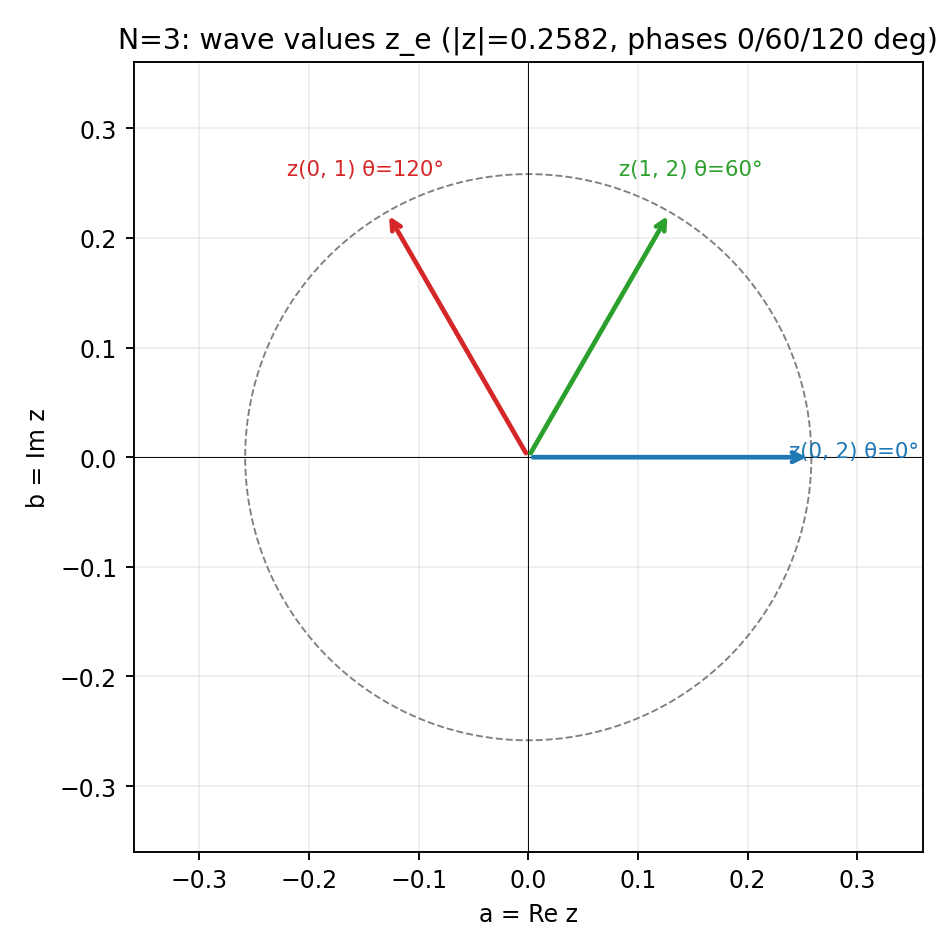
図 2：d² ベクトルの首尾接続＝閉塞の三角形
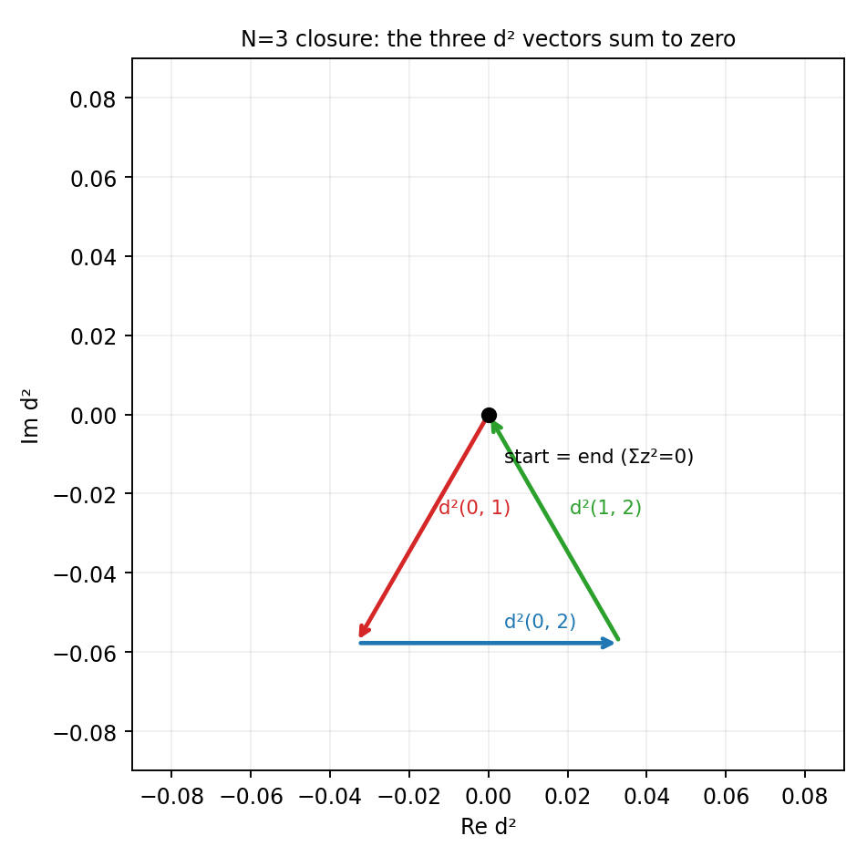
図 3：埋め込み（1 複素軸内の正三角形）
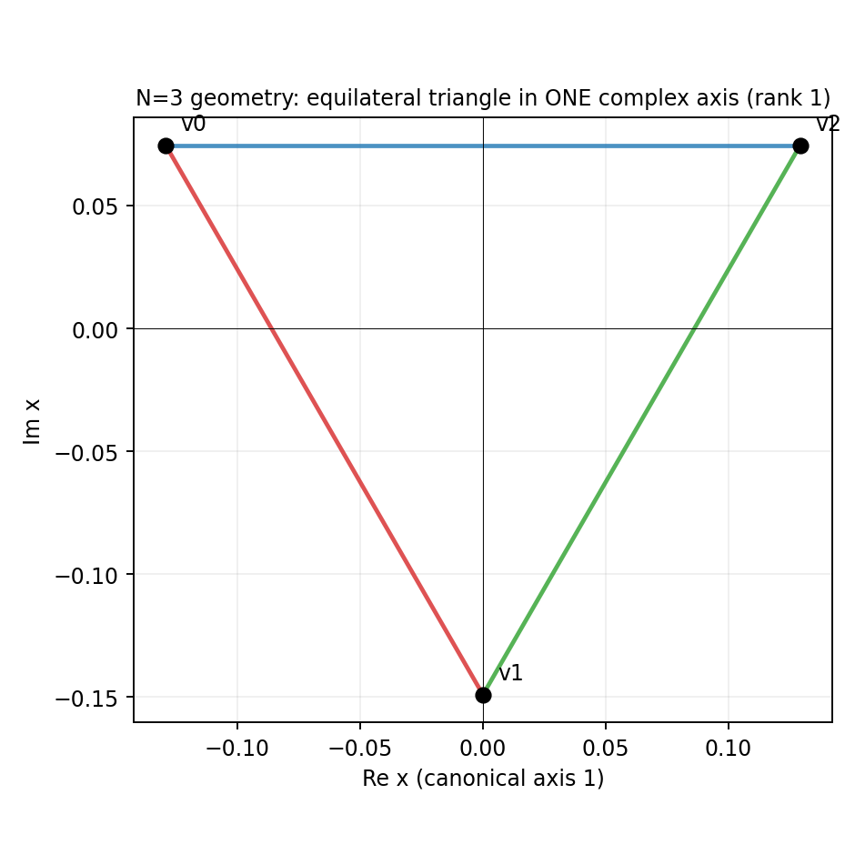

## 3. N=4 の全展開

### 3.0 N=4 の複素シンプレックスの定義

頂点 4 個 {0,1,2,3}。2 点の組は 6 つ：(0,1), (0,2), (0,3), (1,2), (1,3), (2,3)。各組に波 z が 1 個（実数 12 個が状態の全て）。2 乗距離は d² = z²。**N=4 の複素シンプレックスとは、4 頂点とこの 6 つの複素 2 乗距離の組**。

### 3.1 数え上げ（N=4）

| 量 | 値 | 計算 |
|---|---|---|
| 頂点 | 4 | — |
| 波の総数 M | 6 | 4×3/2 |
| 辺 | 4 | 円周の隣どうし (0,1),(1,2),(2,3),(0,3) |
| 対角線 | 2 | M−N = 2：(0,2),(1,3) |
| 面（三角形） | 4 | C(4,3) = 4（正四面体の 4 面） |
| 位相の種類 | 3（0/60/120°） | §3.2。**向かい合う組のペアごと**に 1 種類 |
| d² の角度の種類 | 3（0/120/240°） | 位相の 2 倍 |
| rank | 3 = N−1 | §3.7（最大次元。N=3 と違う） |

### 3.2 波の値 (a, b) の一覧と、その構成

**構成の鍵は「向かい合う組」**。6 つの組は、頂点を共有しない 2 つずつのペア 3 組に分かれる：

- ペア 0：(0,3) と (1,2)　　- ペア 1：(0,2) と (1,3)（＝2 本の対角線）　　- ペア 2：(0,1) と (2,3)

（正四面体で言えば「ねじれの位置にある対辺」の 3 ペア。各頂点は 3 ペアから 1 本ずつを受け持つ。）**同じペアの 2 本に同じ位相**を与え、ペアごとに 0°, 60°, 120° とする（60° = 180°÷3）。スケールは規約 r² = 1/15（§0.2。‖v‖² = 6r² = 2/5）。

| 組 | ペア | θ | a = r·cosθ | b = r·sinθ | \|z\| |
|---|---|---|---|---|---|
| (0,3) | 0 | 0° | +0.258198890 | 0 | 0.258198890 |
| (1,2) | 0 | 0° | +0.258198890 | 0 | 0.258198890 |
| (0,2) | 1 | 60° | +0.129099445 | +0.223606798 | 0.258198890 |
| (1,3) | 1 | 60° | +0.129099445 | +0.223606798 | 0.258198890 |
| (0,1) | 2 | 120° | −0.129099445 | +0.223606798 | 0.258198890 |
| (2,3) | 2 | 120° | −0.129099445 | +0.223606798 | 0.258198890 |

**この状態が自己無撞着であることの検証【定理・実測】**：どの組も、隣接する 4 本（向かいの相棒だけは頂点を共有しないので隣接でない）との位相差が ±60° か ±120°。sin²60° = sin²120° = 3/4 なので

　実部条件：Σsin²φ = 3/4 × 4 = **3 = N−1** ✓（全組で同じ値。よって μ/r² = −3）
　虚部条件：±60° と ±120° が対で入り sin2φ が打ち消し合って 0 ✓

数値検証：μ = −1/5 = −0.200000000、残差 5.0e-17。**N=3 と違い、どの隣接もコントラスト 3/4 を均等に出す**（60° も 120° も sin² は同じ 3/4）。
※この構成が（ラベル替え・鏡映・全体回転を除いて）一意かどうかは、N=3 のような証明をここでは行わない【未証明】。実験でこの状態を用いたという事実（§0.2 の選択）だけを記す。

### 3.3 2 乗距離

d² = (a²−b²) + 2ab·i。ペアごとに：ペア 0 → +0.066666667（角度 0°）、ペア 1 → −0.033333333+0.057735027i（120°）、ペア 2 → −0.033333333−0.057735027i（240°）。**各角度が 2 本ずつ**。

### 3.4 閉塞の判定（N=4）

- **大域閉塞【定理・実測】**：Σz² = 2 × r²(1 + ω + ω²) = 0（ω = e^{i120°}。1+ω+ω² = 0 は 3 つの冪根の和）。実測 6e-17。
- **局所閉塞【定理・実測】——N=3 と違い、全頂点で成立する**。理由は 1 行：**各頂点は 3 つのペアから 1 本ずつ、つまり角度 0°/120°/240° の d² を 1 個ずつ持つ**。よって頂点 i の局所和 = r²(1+ω+ω²) = 0。実測：全頂点で ≤3e-17。幾何の言葉では**全頂点が光円錐上**にある（§3.7 の埋め込みで x·x ≤ 3e-17 を確認）。

### 3.5 和則の数値（§3.2 に含めた。全組 Σsin²φ = 3、Σsin2φ = 0）

### 3.6 自己無撞着の値

μ = −3r² = −3/15 = **−1/5**。μ/r² = −(N−1) = −3。**N≥4 の系列 μ/r² = −(N−1) の最初の例**（N=3 の −3/2 はこの系列に乗らない）。

### 3.7 B 行列と形

B = −½JD²J（成分は `program/make_N4.py` の出力参照）。Takagi 値 σ = (1/15, 1/15, 1/15, 0)：

- **rank 3 = N−1（最大次元）**。N=3（rank 1）と違い、退化していない。
- **3 本の軸スケールが全て等しい 0.258198890**——どの方向にも同じ幅の「丸い」配置【実測・機械精度】。
- 頂点のエルミート半径は 4 頂点とも 0.223606798（= √(1/20)）で等しく、かつ全頂点で x·x = 0（光円錐上）。
- 埋め込み座標は距離を 5e-17 で再現。

### 3.8 N=4 のまとめ（種別）

- 【選択＋実測】向かい合う組の 3 ペアに位相 0/60/120° を等配分した等モジュラー状態は自己無撞着（残差 5e-17）。一意性は未証明。
- 【定理・実測】大域閉塞・**局所閉塞とも成立**（各頂点が 3 角度を 1 個ずつ持つため。N=3 との最大の違い）。全頂点が光円錐上。
- 【定理】μ/r² = −(N−1) = −3（和則の実部条件 Σsin²φ = 3 から）。
- 【実測（機械精度）】rank = 3 = N−1、3 軸すべて等長＝丸い。
- 【規約の帰結】大きさに制限はない（スケール対称性。数値は r²=1/15 の代表値）。

### 図（N=4）

6 本の波（3 ペア × 2、同一円上 0/60/120°）
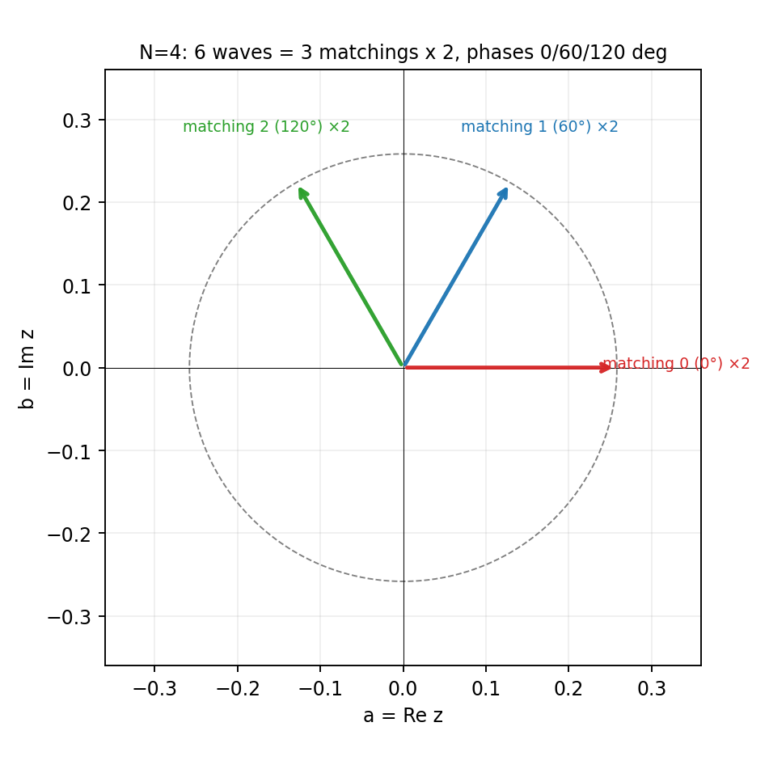
6 本の d² ベクトルの首尾接続（各角度 2 本ずつで閉じる）
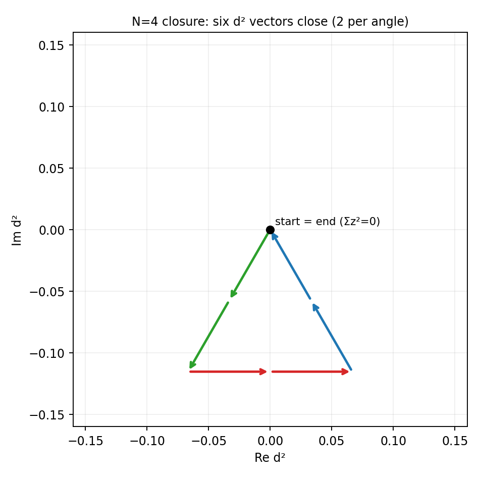
埋め込み（3 本の等長な複素軸に 4 頂点。丸い rank 3）
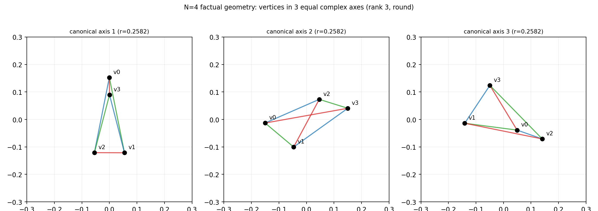

## 4. N=5 の全展開

### 4.0 N=5 の複素シンプレックスの定義

頂点 5 個 {0,…,4}。2 点の組は M = 5×4/2 = 10 個。各組に波 z が 1 個（実数 20 個が状態の全て）。2 乗距離は d² = z²。**N=5 の複素シンプレックスとは、5 頂点とこの 10 個の複素 2 乗距離の組**。

### 4.1 数え上げ（N=5）

| 量 | 値 | 計算 |
|---|---|---|
| 頂点 | 5 | — |
| 波の総数 M | 10 | 5×4/2 |
| 辺 | 5 | 円周の隣どうしの 5 本 |
| 対角線 | 5 | M − N = 10 − 5 |
| 面（三角形） | 10 | C(5,3) |
| 位相の種類 | 2（θ = k×90°） | §4.2 の構成 |
| d² の角度の種類 | 2（k×180°） | 位相の 2 倍 |
| rank | 4 = N−1 | §4.4 の計算結果 |

### 4.2 波の値 (a, b) と構成、自己無撞着の検証

**構成（奇数 N の設計＝距離クラス分解）**。頂点を円周に並べ、組 (i,j) の「距離」を d = |i−j| を N で折り返した値（1〜2）とする。距離 d のクラスは各頂点にちょうど 2 本ずつ属する（5 本、全 2 クラスで 10 組を覆う）。クラス d の波に位相 θ = (d−1)×90°（= (d−1)×180°/2）を与える。
スケールは規約 r² = 1/15（§0.2。‖v‖² = 10r² = 2/3）。同じクラスの波は同じ (a, b) を持つので、クラスごとに列挙する：

| クラス | θ | a = r·cosθ | b = r·sinθ | 本数 | 所属する組 |
|---|---|---|---|---|---|
| 0 | 0° | +0.258198890 | +0.000000000 | 5 | (0, 1) (0, 4) (1, 2) (2, 3) (3, 4) |
| 1 | 90° | +0.000000000 | +0.258198890 | 5 | (0, 2) (0, 3) (1, 3) (1, 4) (2, 4) |

**自己無撞着の検証【定理・実測】**：和則（§0.1）を全 10 組で数値検査——実部条件 Σsin²φ の値は全組で 4.000000（= N−1 = 4、ばらつき 0e+00）、虚部条件 |Σsin2φ| ≤ 5e-16。方程式の残差 1.6e-17。よって μ/r² = −(N−1) = −4、**μ = −4/15 = -0.266666667**。
※この構成の一意性は証明していない【未証明】。

**特記（この N だけ）**：位相が 0°/90° のため d² が**全て実数**（+r² と −r²）。この配置は実の擬ユークリッド空間に埋め込める（符号数 (2,2)）。詳しくは本節末尾の補足。

### 4.3 2 乗距離（クラスごと）

| クラス | d² の角度 | d² の値 |
|---|---|---|
| 0 | 0° | +0.066666667+0.000000000i |
| 1 | 180° | -0.066666667+0.000000000i |

### 4.4 閉塞の判定・B 行列と形

- **大域閉塞【定理・実測】**：全体では各角度が 5 本ずつ → 5×r²×（2 乗根の和）= 0。実測 |Σz²| = 4e-17。
- **局所閉塞【定理・実測】**：各頂点は 2 クラスを 2 本ずつ持つ。d² の角度は (d−1)×180° = (d−1)×360°/2、つまり **1 の 2 乗根が 2 個ずつ**。冪根の総和は零なので局所和 = 2r²×(2 乗根の和) = 0。実測 max|局所和| = 2e-17。よって**全頂点が光円錐上**（埋め込みで max|x·x| = 7e-17）。
- **B = −½JD²J の Takagi 軸【実測・機械精度】**：軸スケールの相異なる値は 0.273012086 （全軸等長＝丸い）。rank = 4。頂点のエルミート半径：0.244189433。埋め込みの距離再現誤差 max = 2e-16。

### 4.5 N=5 のまとめ（種別）

- 【選択＋実測】距離クラス分解に位相を等間隔で配った等モジュラー状態は自己無撞着（残差 2e-17）。
- 【定理・実測】大域閉塞・局所閉塞とも成立。全頂点が光円錐上。
- 【定理】μ/r² = −(N−1) = −4。
- 【実測（機械精度）】rank = 4（最大次元）、軸は全て等長（丸い）。
- 【規約の帰結】大きさに制限はない（スケール対称性）。

### 図（N=5）

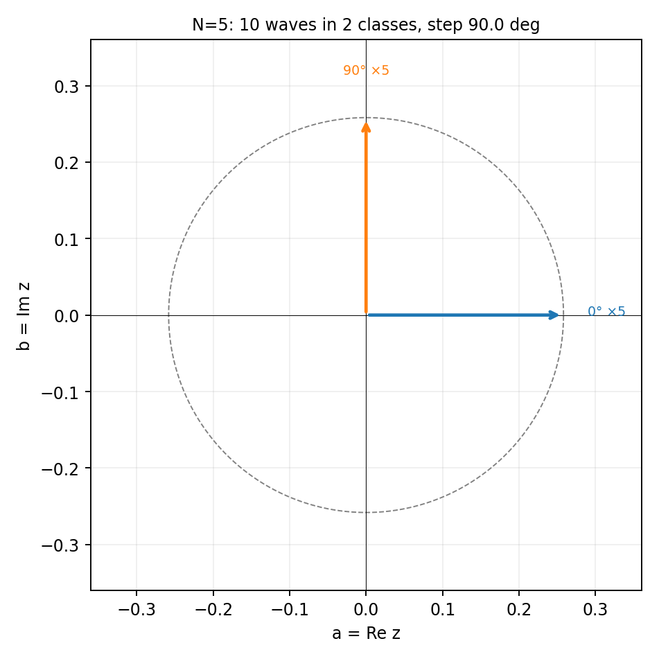
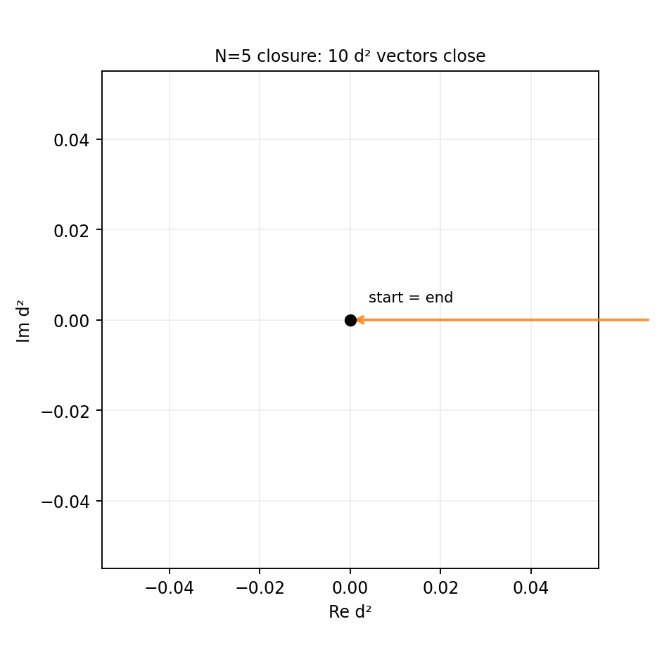
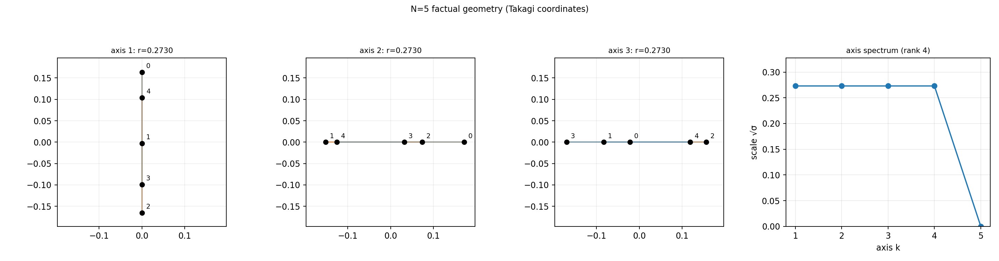

### 4.6 補足：N=5 だけの特別な性質——実の擬ユークリッド空間に置ける

位相が 0° と 90° の 2 種類しかないため、d² = z² は +r²（辺の 5 組）と −r²（対角線の 5 組）の**実数**になる。距離の 2 乗が実数なら、複素空間を使わずに**実の空間で符号だけ混ぜた幾何**（擬ユークリッド空間）に置ける。実測（機械精度）：

- 埋め込み先は空間的方向 2 本＋時間的方向 2 本の 4 次元空間 R^{2,2}（B が実行列になり、固有値が +2 個・−2 個・0 が 1 個）。
- 5 頂点の座標は「2 枚の円」に載る：空間的 2 平面では角度 144°×j（対角線＝五角星の回り方）、時間的 2 平面では角度 72°×j（辺＝五角形の回り方）、**半径は同じ**。これはユークリッド 4 次元の正五胞体（4 次元の正単体）の標準座標そのもので、違いは片方の円が時間的であることだけ。
- 全 5 頂点で x·x = 0（光円錐上）。この光円錐は 4 次元空間の中の 3 次元の面で、その光的方向の全体は球面ではなく**トーラス**（2 つの円の積）。5 頂点は共通半径のトーラス上、時間円 1 周につき空間円 2 周の**巻き数 1:2 の 1 本の閉曲線**の上に等間隔で並ぶ。
- 辺の組（+r²）は空間的間隔、対角線の組（−r²）は時間的間隔——「対角線は長さでなく**間隔の種類**で辺と区別される」。

この読み替えができるのは（N=3〜16 の設計の中では）N=5 だけである【実測】。他の N は d² が本当に複素になり、複素シンプレックスが必須になる。

## 5. N=6 の全展開

### 5.0 N=6 の複素シンプレックスの定義

頂点 6 個 {0,…,5}。2 点の組は M = 6×5/2 = 15 個。各組に波 z が 1 個（実数 30 個が状態の全て）。2 乗距離は d² = z²。**N=6 の複素シンプレックスとは、6 頂点とこの 15 個の複素 2 乗距離の組**。

### 5.1 数え上げ（N=6）

| 量 | 値 | 計算 |
|---|---|---|
| 頂点 | 6 | — |
| 波の総数 M | 15 | 6×5/2 |
| 辺 | 6 | 円周の隣どうしの 6 本 |
| 対角線 | 9 | M − N = 15 − 6 |
| 面（三角形） | 20 | C(6,3) |
| 位相の種類 | 5（θ = k×36°） | §5.2 の構成 |
| d² の角度の種類 | 5（k×72°） | 位相の 2 倍 |
| rank | 5 = N−1 | §5.4 の計算結果 |

### 5.2 波の値 (a, b) と構成、自己無撞着の検証

**構成（偶数 N の設計＝完全マッチング分解）**。6 人で全員に相手がいるペアの組ませ方（完全マッチング、1 組 3 本）が、ちょうど 5 セットで全 15 組を重複なく覆う（総当たり戦の 5 節）。セット（色）c = 0..4 の波に位相 θ = c×36°（= c×180°/5）を与える。各頂点はどの色の波もちょうど 1 本ずつ持つ。
スケールは規約 r² = 1/15（§0.2。‖v‖² = 15r² = 1）。同じクラスの波は同じ (a, b) を持つので、クラスごとに列挙する：

| クラス | θ | a = r·cosθ | b = r·sinθ | 本数 | 所属する組 |
|---|---|---|---|---|---|
| 0 | 0° | +0.258198890 | +0.000000000 | 3 | (0, 5) (1, 4) (2, 3) |
| 1 | 36° | +0.208887290 | +0.151765500 | 3 | (0, 2) (1, 5) (3, 4) |
| 2 | 72° | +0.079787845 | +0.245561737 | 3 | (0, 4) (1, 3) (2, 5) |
| 3 | 108° | -0.079787845 | +0.245561737 | 3 | (0, 1) (2, 4) (3, 5) |
| 4 | 144° | -0.208887290 | +0.151765500 | 3 | (0, 3) (1, 2) (4, 5) |

**自己無撞着の検証【定理・実測】**：和則（§0.1）を全 15 組で数値検査——実部条件 Σsin²φ の値は全組で 5.000000（= N−1 = 5、ばらつき 9e-16）、虚部条件 |Σsin2φ| ≤ 4e-16。方程式の残差 3.3e-17。よって μ/r² = −(N−1) = −5、**μ = −1/3 = -0.333333333**。
※この構成の一意性は証明していない【未証明】。

### 5.3 2 乗距離（クラスごと）

| クラス | d² の角度 | d² の値 |
|---|---|---|
| 0 | 0° | +0.066666667+0.000000000i |
| 1 | 72° | +0.020601133+0.063403768i |
| 2 | 144° | -0.053934466+0.039185683i |
| 3 | 216° | -0.053934466-0.039185683i |
| 4 | 288° | +0.020601133-0.063403768i |

### 5.4 閉塞の判定・B 行列と形

- **大域閉塞【定理・実測】**：全体では各角度が 3 本ずつ → 3×r²×（5 乗根の和）= 0。実測 |Σz²| = 4e-17。
- **局所閉塞【定理・実測】**：各頂点は 5 色を 1 本ずつ持つ。d² の角度は色 c で c×72° = c×360°/5、つまり **1 の 5 乗根がちょうど 1 個ずつ**。冪根の総和は零なので局所和 = r²×(5 乗根の和) = 0。実測 max|局所和| = 3e-17。よって**全頂点が光円錐上**（埋め込みで max|x·x| = 8e-17）。
- **B = −½JD²J の Takagi 軸【実測・機械精度】**：軸スケールの相異なる値は 0.365148372、0.285744043、0.182574186 （等長でない。相異なる値 3 種：長い軸あり）。rank = 5。頂点のエルミート半径：0.260847430、0.243005323。埋め込みの距離再現誤差 max = 2e-16。

### 5.5 N=6 のまとめ（種別）

- 【選択＋実測】完全マッチング分解に位相を等間隔で配った等モジュラー状態は自己無撞着（残差 3e-17）。
- 【定理・実測】大域閉塞・局所閉塞とも成立。全頂点が光円錐上。
- 【定理】μ/r² = −(N−1) = −5。
- 【実測（機械精度）】rank = 5（最大次元）、軸は等長でない（1 本だけ長い軸を持つ）。
- 【規約の帰結】大きさに制限はない（スケール対称性）。

### 図（N=6）

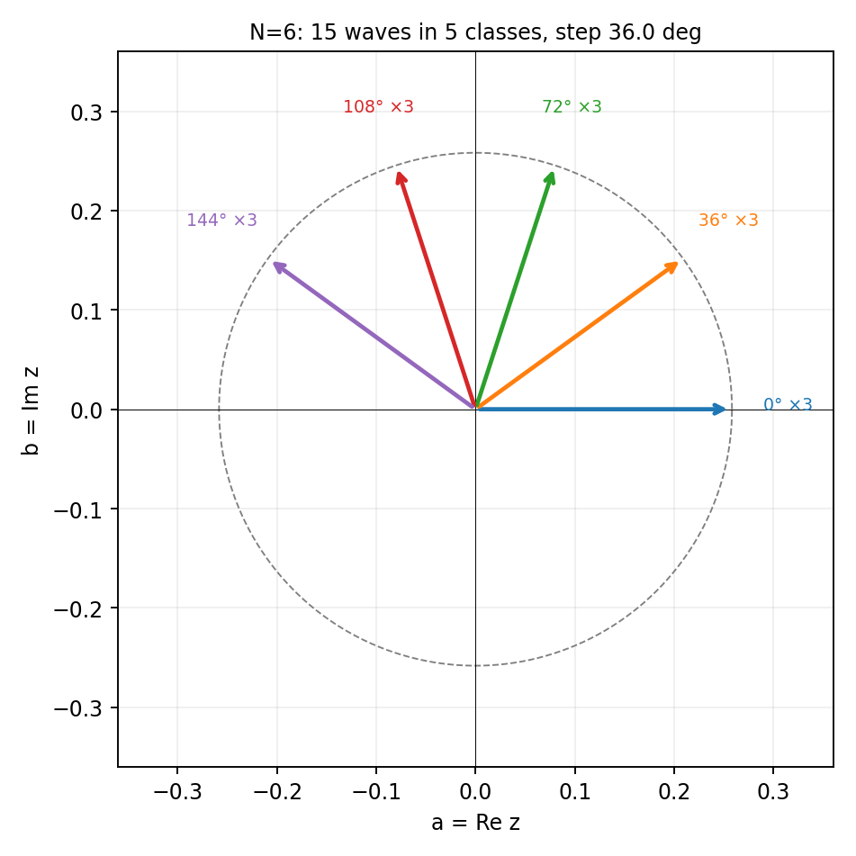

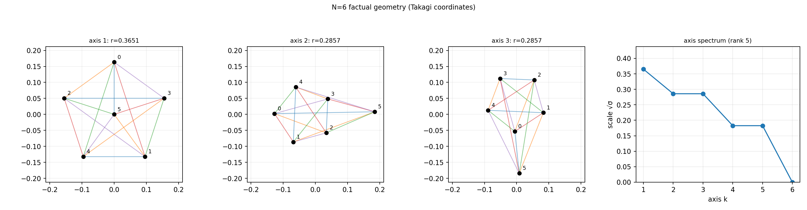

## 6. N=7 の全展開

### 6.0 N=7 の複素シンプレックスの定義

頂点 7 個 {0,…,6}。2 点の組は M = 7×6/2 = 21 個。各組に波 z が 1 個（実数 42 個が状態の全て）。2 乗距離は d² = z²。**N=7 の複素シンプレックスとは、7 頂点とこの 21 個の複素 2 乗距離の組**。

### 6.1 数え上げ（N=7）

| 量 | 値 | 計算 |
|---|---|---|
| 頂点 | 7 | — |
| 波の総数 M | 21 | 7×6/2 |
| 辺 | 7 | 円周の隣どうしの 7 本 |
| 対角線 | 14 | M − N = 21 − 7 |
| 面（三角形） | 35 | C(7,3) |
| 位相の種類 | 3（θ = k×60°） | §6.2 の構成 |
| d² の角度の種類 | 3（k×120°） | 位相の 2 倍 |
| rank | 6 = N−1 | §6.4 の計算結果 |

### 6.2 波の値 (a, b) と構成、自己無撞着の検証

**構成（奇数 N の設計＝距離クラス分解）**。頂点を円周に並べ、組 (i,j) の「距離」を d = |i−j| を N で折り返した値（1〜3）とする。距離 d のクラスは各頂点にちょうど 2 本ずつ属する（7 本、全 3 クラスで 21 組を覆う）。クラス d の波に位相 θ = (d−1)×60°（= (d−1)×180°/3）を与える。
スケールは規約 r² = 1/15（§0.2。‖v‖² = 21r² = 7/5）。同じクラスの波は同じ (a, b) を持つので、クラスごとに列挙する：

| クラス | θ | a = r·cosθ | b = r·sinθ | 本数 | 所属する組 |
|---|---|---|---|---|---|
| 0 | 0° | +0.258198890 | +0.000000000 | 7 | (0, 1) (0, 6) (1, 2) (2, 3) (3, 4) (4, 5) (5, 6) |
| 1 | 60° | +0.129099445 | +0.223606798 | 7 | (0, 2) (0, 5) (1, 3) (1, 6) (2, 4) (3, 5) (4, 6) |
| 2 | 120° | -0.129099445 | +0.223606798 | 7 | (0, 3) (0, 4) (1, 4) (1, 5) (2, 5) (2, 6) (3, 6) |

**自己無撞着の検証【定理・実測】**：和則（§0.1）を全 21 組で数値検査——実部条件 Σsin²φ の値は全組で 6.000000（= N−1 = 6、ばらつき 9e-16）、虚部条件 |Σsin2φ| ≤ 2e-15。方程式の残差 9.5e-17。よって μ/r² = −(N−1) = −6、**μ = −2/5 = -0.400000000**。
※この構成の一意性は証明していない【未証明】。

### 6.3 2 乗距離（クラスごと）

| クラス | d² の角度 | d² の値 |
|---|---|---|
| 0 | 0° | +0.066666667+0.000000000i |
| 1 | 120° | -0.033333333+0.057735027i |
| 2 | 240° | -0.033333333-0.057735027i |

### 6.4 閉塞の判定・B 行列と形

- **大域閉塞【定理・実測】**：全体では各角度が 7 本ずつ → 7×r²×（3 乗根の和）= 0。実測 |Σz²| = 2e-16。
- **局所閉塞【定理・実測】**：各頂点は 3 クラスを 2 本ずつ持つ。d² の角度は (d−1)×120° = (d−1)×360°/3、つまり **1 の 3 乗根が 2 個ずつ**。冪根の総和は零なので局所和 = 2r²×(3 乗根の和) = 0。実測 max|局所和| = 6e-17。よって**全頂点が光円錐上**（埋め込みで max|x·x| = 6e-17）。
- **B = −½JD²J の Takagi 軸【実測・機械精度】**：軸スケールの相異なる値は 0.296970891 （全軸等長＝丸い）。rank = 6。頂点のエルミート半径：0.274941620。埋め込みの距離再現誤差 max = 1e-16。

### 6.5 N=7 のまとめ（種別）

- 【選択＋実測】距離クラス分解に位相を等間隔で配った等モジュラー状態は自己無撞着（残差 9e-17）。
- 【定理・実測】大域閉塞・局所閉塞とも成立。全頂点が光円錐上。
- 【定理】μ/r² = −(N−1) = −6。
- 【実測（機械精度）】rank = 6（最大次元）、軸は全て等長（丸い）。
- 【規約の帰結】大きさに制限はない（スケール対称性）。

### 図（N=7）

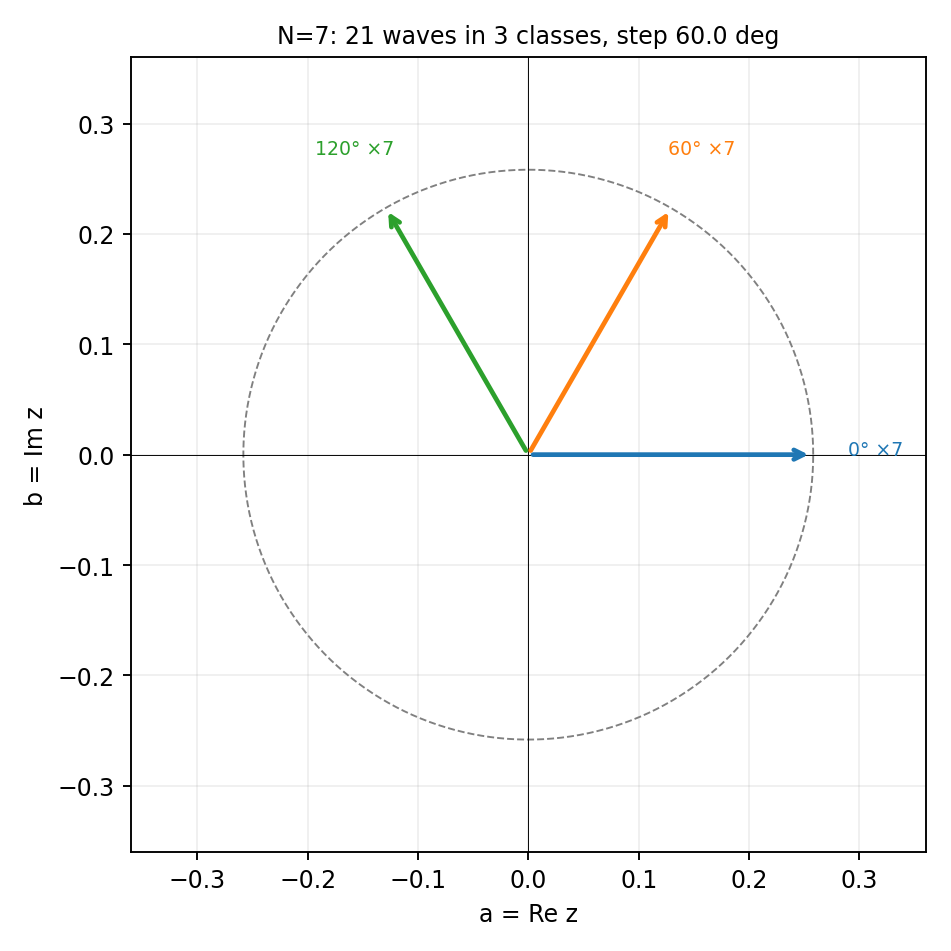
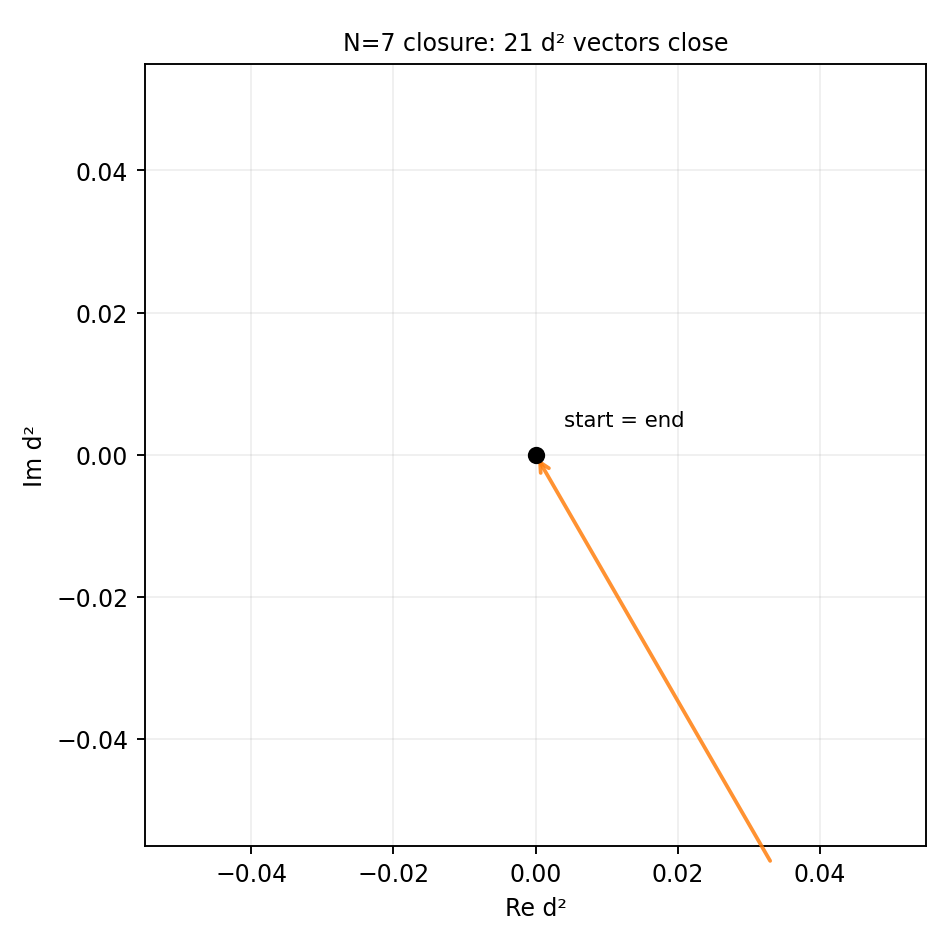
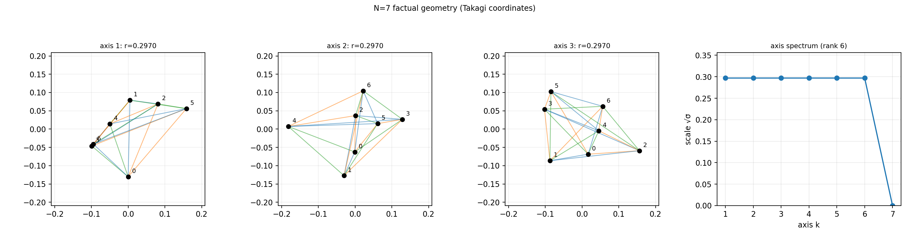

## 7. N=8 の全展開

### 7.0 N=8 の複素シンプレックスの定義

頂点 8 個 {0,…,7}。2 点の組は M = 8×7/2 = 28 個。各組に波 z が 1 個（実数 56 個が状態の全て）。2 乗距離は d² = z²。**N=8 の複素シンプレックスとは、8 頂点とこの 28 個の複素 2 乗距離の組**。

### 7.1 数え上げ（N=8）

| 量 | 値 | 計算 |
|---|---|---|
| 頂点 | 8 | — |
| 波の総数 M | 28 | 8×7/2 |
| 辺 | 8 | 円周の隣どうしの 8 本 |
| 対角線 | 20 | M − N = 28 − 8 |
| 面（三角形） | 56 | C(8,3) |
| 位相の種類 | 7（θ = k×25.7143°） | §7.2 の構成 |
| d² の角度の種類 | 7（k×51.4286°） | 位相の 2 倍 |
| rank | 7 = N−1 | §7.4 の計算結果 |

### 7.2 波の値 (a, b) と構成、自己無撞着の検証

**構成（偶数 N の設計＝完全マッチング分解）**。8 人で全員に相手がいるペアの組ませ方（完全マッチング、1 組 4 本）が、ちょうど 7 セットで全 28 組を重複なく覆う（総当たり戦の 7 節）。セット（色）c = 0..6 の波に位相 θ = c×25.7143°（= c×180°/7）を与える。各頂点はどの色の波もちょうど 1 本ずつ持つ。
スケールは規約 r² = 1/15（§0.2。‖v‖² = 28r² = 28/15）。同じクラスの波は同じ (a, b) を持つので、クラスごとに列挙する：

| クラス | θ | a = r·cosθ | b = r·sinθ | 本数 | 所属する組 |
|---|---|---|---|---|---|
| 0 | 0° | +0.258198890 | +0.000000000 | 4 | (0, 7) (1, 6) (2, 5) (3, 4) |
| 1 | 25.7143° | +0.232629161 | +0.112028300 | 4 | (0, 2) (1, 7) (3, 6) (4, 5) |
| 2 | 51.4286° | +0.160984375 | +0.201868021 | 4 | (0, 4) (1, 3) (2, 7) (5, 6) |
| 3 | 77.1429° | +0.057454658 | +0.251725305 | 4 | (0, 6) (1, 5) (2, 4) (3, 7) |
| 4 | 102.857° | -0.057454658 | +0.251725305 | 4 | (0, 1) (2, 6) (3, 5) (4, 7) |
| 5 | 128.571° | -0.160984375 | +0.201868021 | 4 | (0, 3) (1, 2) (4, 6) (5, 7) |
| 6 | 154.286° | -0.232629161 | +0.112028300 | 4 | (0, 5) (1, 4) (2, 3) (6, 7) |

**自己無撞着の検証【定理・実測】**：和則（§0.1）を全 28 組で数値検査——実部条件 Σsin²φ の値は全組で 7.000000（= N−1 = 7、ばらつき 9e-16）、虚部条件 |Σsin2φ| ≤ 1e-15。方程式の残差 5.2e-17。よって μ/r² = −(N−1) = −7、**μ = −7/15 = -0.466666667**。
※この構成の一意性は証明していない【未証明】。

### 7.3 2 乗距離（クラスごと）

| クラス | d² の角度 | d² の値 |
|---|---|---|
| 0 | 0° | +0.066666667+0.000000000i |
| 1 | 51.4286° | +0.041565987+0.052122099i |
| 2 | 102.857° | -0.014834729+0.064995194i |
| 3 | 154.286° | -0.060064591+0.028925583i |
| 4 | 205.714° | -0.060064591-0.028925583i |
| 5 | 257.143° | -0.014834729-0.064995194i |
| 6 | 308.571° | +0.041565987-0.052122099i |

### 7.4 閉塞の判定・B 行列と形

- **大域閉塞【定理・実測】**：全体では各角度が 4 本ずつ → 4×r²×（7 乗根の和）= 0。実測 |Σz²| = 1e-16。
- **局所閉塞【定理・実測】**：各頂点は 7 色を 1 本ずつ持つ。d² の角度は色 c で c×51.4286° = c×360°/7、つまり **1 の 7 乗根がちょうど 1 個ずつ**。冪根の総和は零なので局所和 = r²×(7 乗根の和) = 0。実測 max|局所和| = 4e-17。よって**全頂点が光円錐上**（埋め込みで max|x·x| = 7e-17）。
- **B = −½JD²J の Takagi 軸【実測・機械精度】**：軸スケールの相異なる値は 0.447213595、0.307051957、0.182574186 （等長でない。相異なる値 3 種：長い軸あり）。rank = 7。頂点のエルミート半径：0.287220806、0.250542084。埋め込みの距離再現誤差 max = 2e-16。

### 7.5 N=8 のまとめ（種別）

- 【選択＋実測】完全マッチング分解に位相を等間隔で配った等モジュラー状態は自己無撞着（残差 5e-17）。
- 【定理・実測】大域閉塞・局所閉塞とも成立。全頂点が光円錐上。
- 【定理】μ/r² = −(N−1) = −7。
- 【実測（機械精度）】rank = 7（最大次元）、軸は等長でない（1 本だけ長い軸を持つ）。
- 【規約の帰結】大きさに制限はない（スケール対称性）。

### 図（N=8）

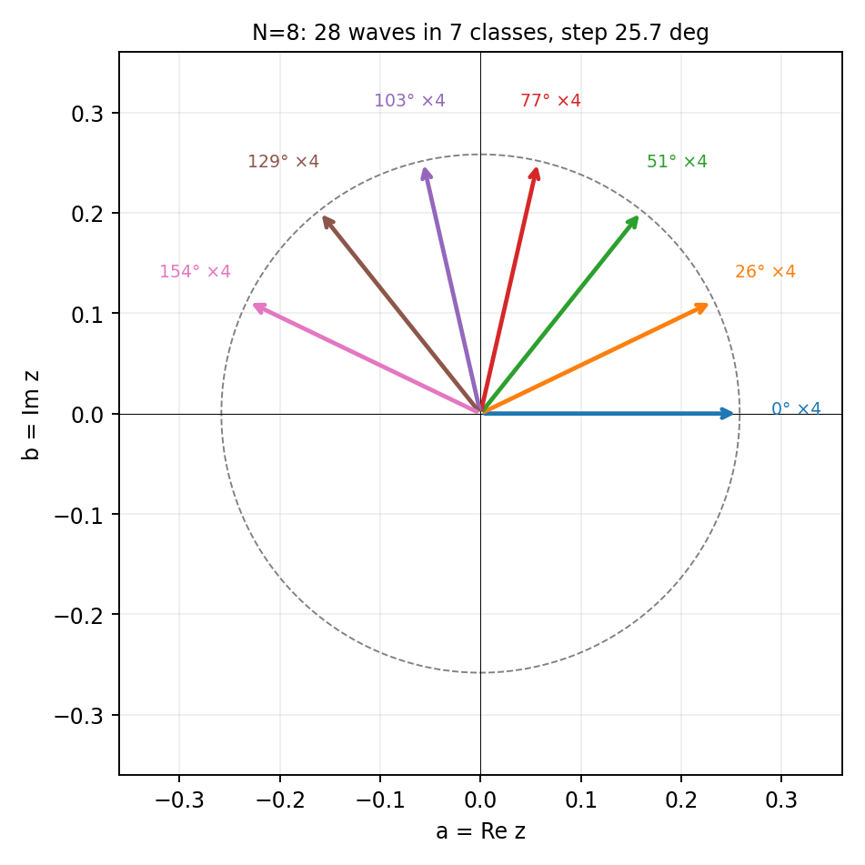
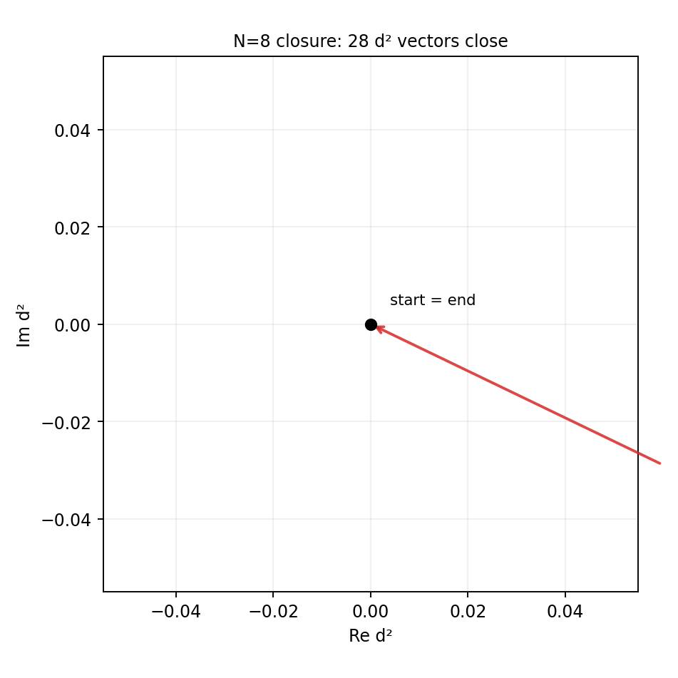
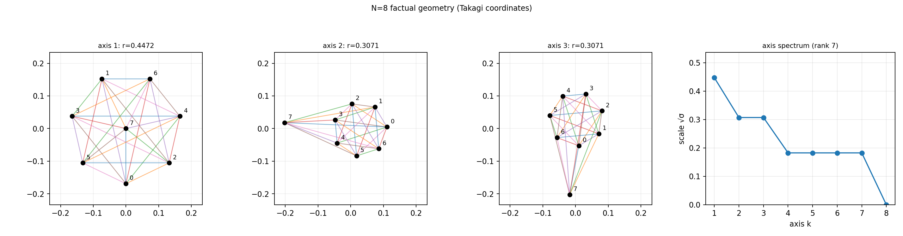

## 8. N=9 の全展開

### 8.0 N=9 の複素シンプレックスの定義

頂点 9 個 {0,…,8}。2 点の組は M = 9×8/2 = 36 個。各組に波 z が 1 個（実数 72 個が状態の全て）。2 乗距離は d² = z²。**N=9 の複素シンプレックスとは、9 頂点とこの 36 個の複素 2 乗距離の組**。

### 8.1 数え上げ（N=9）

| 量 | 値 | 計算 |
|---|---|---|
| 頂点 | 9 | — |
| 波の総数 M | 36 | 9×8/2 |
| 辺 | 9 | 円周の隣どうしの 9 本 |
| 対角線 | 27 | M − N = 36 − 9 |
| 面（三角形） | 84 | C(9,3) |
| 位相の種類 | 4（θ = k×45°） | §8.2 の構成 |
| d² の角度の種類 | 4（k×90°） | 位相の 2 倍 |
| rank | 8 = N−1 | §8.4 の計算結果 |

### 8.2 波の値 (a, b) と構成、自己無撞着の検証

**構成（奇数 N の設計＝距離クラス分解）**。頂点を円周に並べ、組 (i,j) の「距離」を d = |i−j| を N で折り返した値（1〜4）とする。距離 d のクラスは各頂点にちょうど 2 本ずつ属する（9 本、全 4 クラスで 36 組を覆う）。クラス d の波に位相 θ = (d−1)×45°（= (d−1)×180°/4）を与える。
スケールは規約 r² = 1/15（§0.2。‖v‖² = 36r² = 12/5）。同じクラスの波は同じ (a, b) を持つので、クラスごとに列挙する：

| クラス | θ | a = r·cosθ | b = r·sinθ | 本数 | 所属する組 |
|---|---|---|---|---|---|
| 0 | 0° | +0.258198890 | +0.000000000 | 9 | (0, 1) (0, 8) (1, 2) (2, 3) (3, 4) (4, 5) (5, 6) (6, 7) (7, 8) |
| 1 | 45° | +0.182574186 | +0.182574186 | 9 | (0, 2) (0, 7) (1, 3) (1, 8) (2, 4) (3, 5) (4, 6) (5, 7) (6, 8) |
| 2 | 90° | +0.000000000 | +0.258198890 | 9 | (0, 3) (0, 6) (1, 4) (1, 7) (2, 5) (2, 8) (3, 6) (4, 7) (5, 8) |
| 3 | 135° | -0.182574186 | +0.182574186 | 9 | (0, 4) (0, 5) (1, 5) (1, 6) (2, 6) (2, 7) (3, 7) (3, 8) (4, 8) |

**自己無撞着の検証【定理・実測】**：和則（§0.1）を全 36 組で数値検査——実部条件 Σsin²φ の値は全組で 8.000000（= N−1 = 8、ばらつき 9e-16）、虚部条件 |Σsin2φ| ≤ 1e-15。方程式の残差 2.8e-17。よって μ/r² = −(N−1) = −8、**μ = −8/15 = -0.533333333**。
※この構成の一意性は証明していない【未証明】。

**特記**：N=9 では一部の距離クラスが 1 つの輪でなく複数の輪に分かれる（距離が N と公約数を持つため）。設計の成立に必要なのは「各頂点に各クラスが 2 本ずつ」だけなので、結論は変わらない（残差 3e-17 で検証済み）。

### 8.3 2 乗距離（クラスごと）

| クラス | d² の角度 | d² の値 |
|---|---|---|
| 0 | 0° | +0.066666667+0.000000000i |
| 1 | 90° | +0.000000000+0.066666667i |
| 2 | 180° | -0.066666667+0.000000000i |
| 3 | 270° | -0.000000000-0.066666667i |

### 8.4 閉塞の判定・B 行列と形

- **大域閉塞【定理・実測】**：全体では各角度が 9 本ずつ → 9×r²×（4 乗根の和）= 0。実測 |Σz²| = 3e-17。
- **局所閉塞【定理・実測】**：各頂点は 4 クラスを 2 本ずつ持つ。d² の角度は (d−1)×90° = (d−1)×360°/4、つまり **1 の 4 乗根が 2 個ずつ**。冪根の総和は零なので局所和 = 2r²×(4 乗根の和) = 0。実測 max|局所和| = 3e-17。よって**全頂点が光円錐上**（埋め込みで max|x·x| = 6e-17）。
- **B = −½JD²J の Takagi 軸【実測・機械精度】**：軸スケールの相異なる値は 0.349660915、0.335255203、0.316227766、0.221771922 （等長でない。相異なる値 4 種：長い軸あり）。rank = 8。頂点のエルミート半径：0.292058439。埋め込みの距離再現誤差 max = 1e-16。

### 8.5 N=9 のまとめ（種別）

- 【選択＋実測】距離クラス分解に位相を等間隔で配った等モジュラー状態は自己無撞着（残差 3e-17）。
- 【定理・実測】大域閉塞・局所閉塞とも成立。全頂点が光円錐上。
- 【定理】μ/r² = −(N−1) = −8。
- 【実測（機械精度）】rank = 8（最大次元）、軸は等長でない（1 本だけ長い軸を持つ）。
- 【規約の帰結】大きさに制限はない（スケール対称性）。

### 図（N=9）

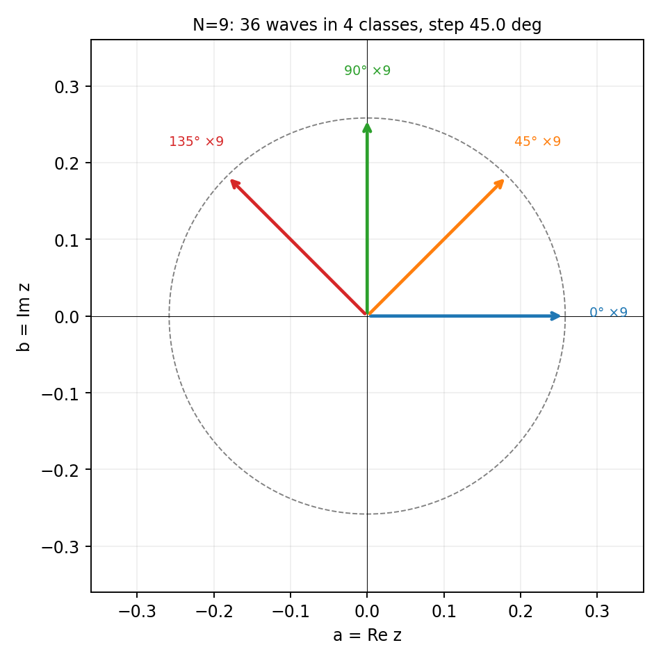
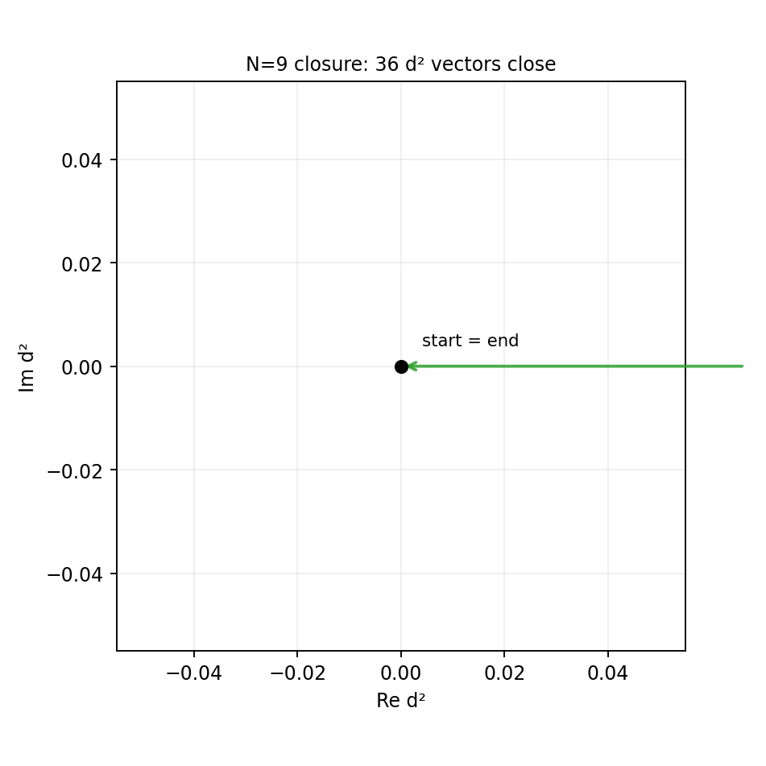
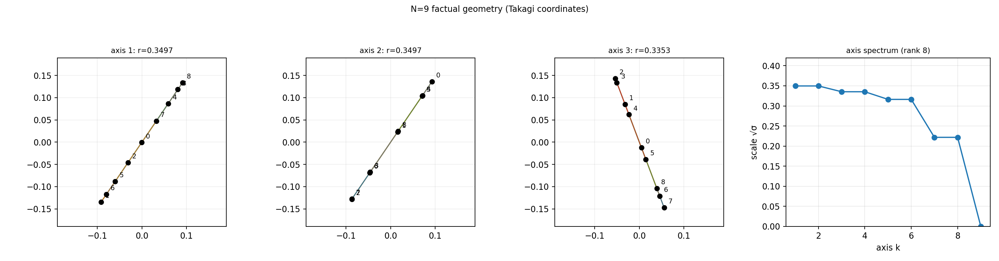

## 9. N=10 の全展開

### 9.0 N=10 の複素シンプレックスの定義

頂点 10 個 {0,…,9}。2 点の組は M = 10×9/2 = 45 個。各組に波 z が 1 個（実数 90 個が状態の全て）。2 乗距離は d² = z²。**N=10 の複素シンプレックスとは、10 頂点とこの 45 個の複素 2 乗距離の組**。

### 9.1 数え上げ（N=10）

| 量 | 値 | 計算 |
|---|---|---|
| 頂点 | 10 | — |
| 波の総数 M | 45 | 10×9/2 |
| 辺 | 10 | 円周の隣どうしの 10 本 |
| 対角線 | 35 | M − N = 45 − 10 |
| 面（三角形） | 120 | C(10,3) |
| 位相の種類 | 9（θ = k×20°） | §9.2 の構成 |
| d² の角度の種類 | 9（k×40°） | 位相の 2 倍 |
| rank | 9 = N−1 | §9.4 の計算結果 |

### 9.2 波の値 (a, b) と構成、自己無撞着の検証

**構成（偶数 N の設計＝完全マッチング分解）**。10 人で全員に相手がいるペアの組ませ方（完全マッチング、1 組 5 本）が、ちょうど 9 セットで全 45 組を重複なく覆う（総当たり戦の 9 節）。セット（色）c = 0..8 の波に位相 θ = c×20°（= c×180°/9）を与える。各頂点はどの色の波もちょうど 1 本ずつ持つ。
スケールは規約 r² = 1/15（§0.2。‖v‖² = 45r² = 3）。同じクラスの波は同じ (a, b) を持つので、クラスごとに列挙する：

| クラス | θ | a = r·cosθ | b = r·sinθ | 本数 | 所属する組 |
|---|---|---|---|---|---|
| 0 | 0° | +0.258198890 | +0.000000000 | 5 | (0, 9) (1, 8) (2, 7) (3, 6) (4, 5) |
| 1 | 20° | +0.242627591 | +0.088309221 | 5 | (0, 2) (1, 9) (3, 8) (4, 7) (5, 6) |
| 2 | 40° | +0.197791825 | +0.165967047 | 5 | (0, 4) (1, 3) (2, 9) (5, 8) (6, 7) |
| 3 | 60° | +0.129099445 | +0.223606798 | 5 | (0, 6) (1, 5) (2, 4) (3, 9) (7, 8) |
| 4 | 80° | +0.044835767 | +0.254276268 | 5 | (0, 8) (1, 7) (2, 6) (3, 5) (4, 9) |
| 5 | 100° | -0.044835767 | +0.254276268 | 5 | (0, 1) (2, 8) (3, 7) (4, 6) (5, 9) |
| 6 | 120° | -0.129099445 | +0.223606798 | 5 | (0, 3) (1, 2) (4, 8) (5, 7) (6, 9) |
| 7 | 140° | -0.197791825 | +0.165967047 | 5 | (0, 5) (1, 4) (2, 3) (6, 8) (7, 9) |
| 8 | 160° | -0.242627591 | +0.088309221 | 5 | (0, 7) (1, 6) (2, 5) (3, 4) (8, 9) |

**自己無撞着の検証【定理・実測】**：和則（§0.1）を全 45 組で数値検査——実部条件 Σsin²φ の値は全組で 9.000000（= N−1 = 9、ばらつき 2e-15）、虚部条件 |Σsin2φ| ≤ 3e-15。方程式の残差 1.5e-16。よって μ/r² = −(N−1) = −9、**μ = −3/5 = -0.600000000**。
※この構成の一意性は証明していない【未証明】。

### 9.3 2 乗距離（クラスごと）

| クラス | d² の角度 | d² の値 |
|---|---|---|
| 0 | 0° | +0.066666667+0.000000000i |
| 1 | 40° | +0.051069630+0.042852507i |
| 2 | 80° | +0.011576545+0.065653850i |
| 3 | 120° | -0.033333333+0.057735027i |
| 4 | 160° | -0.062646175+0.022801343i |
| 5 | 200° | -0.062646175-0.022801343i |
| 6 | 240° | -0.033333333-0.057735027i |
| 7 | 280° | +0.011576545-0.065653850i |
| 8 | 320° | +0.051069630-0.042852507i |

### 9.4 閉塞の判定・B 行列と形

- **大域閉塞【定理・実測】**：全体では各角度が 5 本ずつ → 5×r²×（9 乗根の和）= 0。実測 |Σz²| = 3e-16。
- **局所閉塞【定理・実測】**：各頂点は 9 色を 1 本ずつ持つ。d² の角度は色 c で c×40° = c×360°/9、つまり **1 の 9 乗根がちょうど 1 個ずつ**。冪根の総和は零なので局所和 = r²×(9 乗根の和) = 0。実測 max|局所和| = 7e-17。よって**全頂点が光円錐上**（埋め込みで max|x·x| = 6e-17）。
- **B = −½JD²J の Takagi 軸【実測・機械精度】**：軸スケールの相異なる値は 0.516397779、0.324667915、0.182574186 （等長でない。相異なる値 3 種：長い軸あり）。rank = 9。頂点のエルミート半径：0.308007029、0.254431141。埋め込みの距離再現誤差 max = 2e-16。

### 9.5 N=10 のまとめ（種別）

- 【選択＋実測】完全マッチング分解に位相を等間隔で配った等モジュラー状態は自己無撞着（残差 1e-16）。
- 【定理・実測】大域閉塞・局所閉塞とも成立。全頂点が光円錐上。
- 【定理】μ/r² = −(N−1) = −9。
- 【実測（機械精度）】rank = 9（最大次元）、軸は等長でない（1 本だけ長い軸を持つ）。
- 【規約の帰結】大きさに制限はない（スケール対称性）。

### 図（N=10）

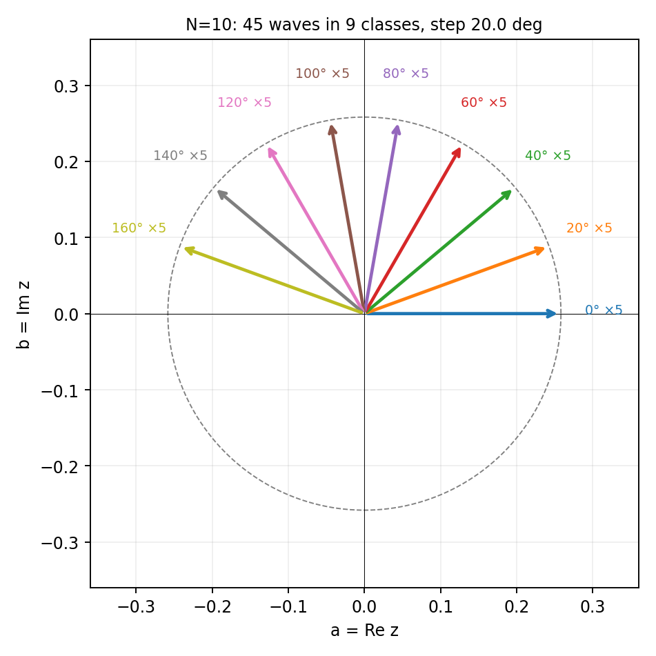
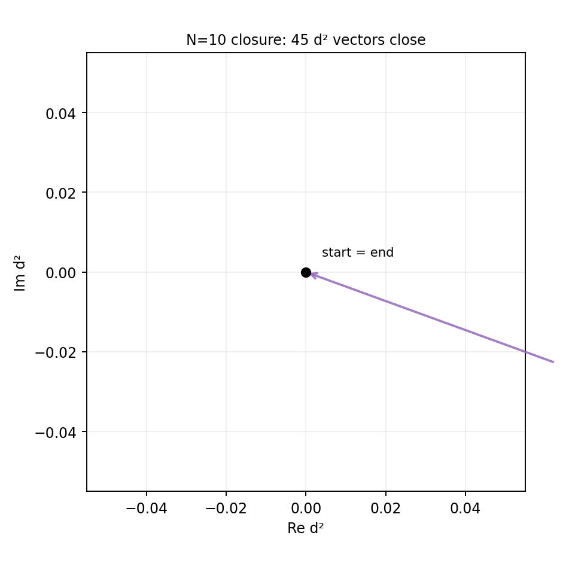
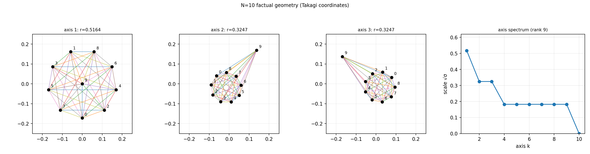

## 10. N=11 の全展開

### 10.0 N=11 の複素シンプレックスの定義

頂点 11 個 {0,…,10}。2 点の組は M = 11×10/2 = 55 個。各組に波 z が 1 個（実数 110 個が状態の全て）。2 乗距離は d² = z²。**N=11 の複素シンプレックスとは、11 頂点とこの 55 個の複素 2 乗距離の組**。

### 10.1 数え上げ（N=11）

| 量 | 値 | 計算 |
|---|---|---|
| 頂点 | 11 | — |
| 波の総数 M | 55 | 11×10/2 |
| 辺 | 11 | 円周の隣どうしの 11 本 |
| 対角線 | 44 | M − N = 55 − 11 |
| 面（三角形） | 165 | C(11,3) |
| 位相の種類 | 5（θ = k×36°） | §10.2 の構成 |
| d² の角度の種類 | 5（k×72°） | 位相の 2 倍 |
| rank | 10 = N−1 | §10.4 の計算結果 |

### 10.2 波の値 (a, b) と構成、自己無撞着の検証

**構成（奇数 N の設計＝距離クラス分解）**。頂点を円周に並べ、組 (i,j) の「距離」を d = |i−j| を N で折り返した値（1〜5）とする。距離 d のクラスは各頂点にちょうど 2 本ずつ属する（11 本、全 5 クラスで 55 組を覆う）。クラス d の波に位相 θ = (d−1)×36°（= (d−1)×180°/5）を与える。
スケールは規約 r² = 1/15（§0.2。‖v‖² = 55r² = 11/3）。同じクラスの波は同じ (a, b) を持つので、クラスごとに列挙する：

| クラス | θ | a = r·cosθ | b = r·sinθ | 本数 | 所属する組 |
|---|---|---|---|---|---|
| 0 | 0° | +0.258198890 | +0.000000000 | 11 | (0, 1) (0, 10) (1, 2) (2, 3) (3, 4) (4, 5) (5, 6) (6, 7) (7, 8) (8, 9) (9, 10) |
| 1 | 36° | +0.208887290 | +0.151765500 | 11 | (0, 2) (0, 9) (1, 3) (1, 10) (2, 4) (3, 5) (4, 6) (5, 7) (6, 8) (7, 9) (8, 10) |
| 2 | 72° | +0.079787845 | +0.245561737 | 11 | (0, 3) (0, 8) (1, 4) (1, 9) (2, 5) (2, 10) (3, 6) (4, 7) (5, 8) (6, 9) (7, 10) |
| 3 | 108° | -0.079787845 | +0.245561737 | 11 | (0, 4) (0, 7) (1, 5) (1, 8) (2, 6) (2, 9) (3, 7) (3, 10) (4, 8) (5, 9) (6, 10) |
| 4 | 144° | -0.208887290 | +0.151765500 | 11 | (0, 5) (0, 6) (1, 6) (1, 7) (2, 7) (2, 8) (3, 8) (3, 9) (4, 9) (4, 10) (5, 10) |

**自己無撞着の検証【定理・実測】**：和則（§0.1）を全 55 組で数値検査——実部条件 Σsin²φ の値は全組で 10.000000（= N−1 = 10、ばらつき 2e-15）、虚部条件 |Σsin2φ| ≤ 2e-15。方程式の残差 6.2e-17。よって μ/r² = −(N−1) = −10、**μ = −2/3 = -0.666666667**。
※この構成の一意性は証明していない【未証明】。

### 10.3 2 乗距離（クラスごと）

| クラス | d² の角度 | d² の値 |
|---|---|---|
| 0 | 0° | +0.066666667+0.000000000i |
| 1 | 72° | +0.020601133+0.063403768i |
| 2 | 144° | -0.053934466+0.039185683i |
| 3 | 216° | -0.053934466-0.039185683i |
| 4 | 288° | +0.020601133-0.063403768i |

### 10.4 閉塞の判定・B 行列と形

- **大域閉塞【定理・実測】**：全体では各角度が 11 本ずつ → 11×r²×（5 乗根の和）= 0。実測 |Σz²| = 3e-16。
- **局所閉塞【定理・実測】**：各頂点は 5 クラスを 2 本ずつ持つ。d² の角度は (d−1)×72° = (d−1)×360°/5、つまり **1 の 5 乗根が 2 個ずつ**。冪根の総和は零なので局所和 = 2r²×(5 乗根の和) = 0。実測 max|局所和| = 6e-17。よって**全頂点が光円錐上**（埋め込みで max|x·x| = 9e-17）。
- **B = −½JD²J の Takagi 軸【実測・機械精度】**：軸スケールの相異なる値は 0.395116115、0.372366066、0.340937944、0.217578398、0.204837607 （等長でない。相異なる値 5 種：長い軸あり）。rank = 10。頂点のエルミート半径：0.301605015。埋め込みの距離再現誤差 max = 2e-16。

### 10.5 N=11 のまとめ（種別）

- 【選択＋実測】距離クラス分解に位相を等間隔で配った等モジュラー状態は自己無撞着（残差 6e-17）。
- 【定理・実測】大域閉塞・局所閉塞とも成立。全頂点が光円錐上。
- 【定理】μ/r² = −(N−1) = −10。
- 【実測（機械精度）】rank = 10（最大次元）、軸は等長でない（1 本だけ長い軸を持つ）。
- 【規約の帰結】大きさに制限はない（スケール対称性）。

### 図（N=11）

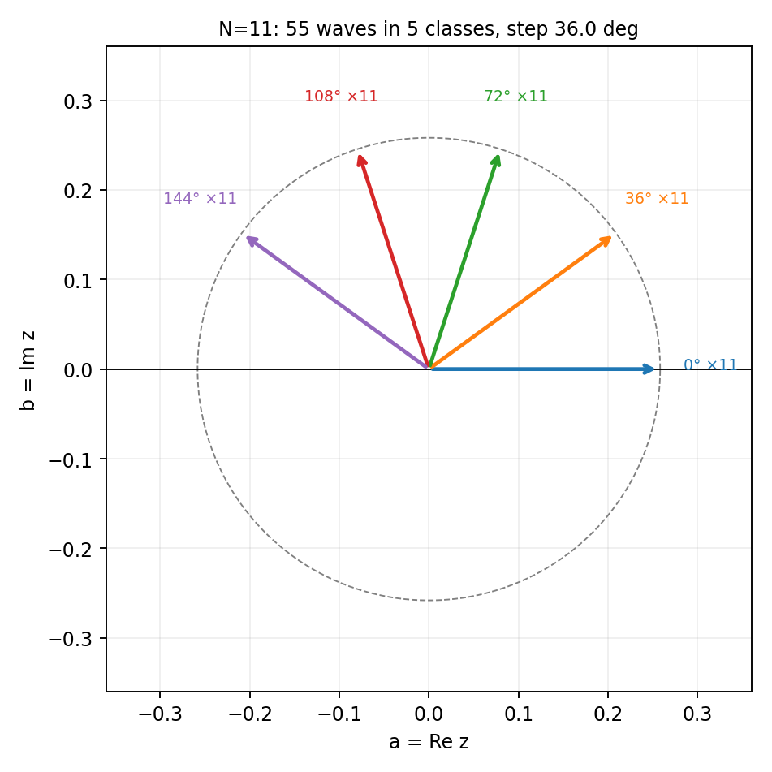
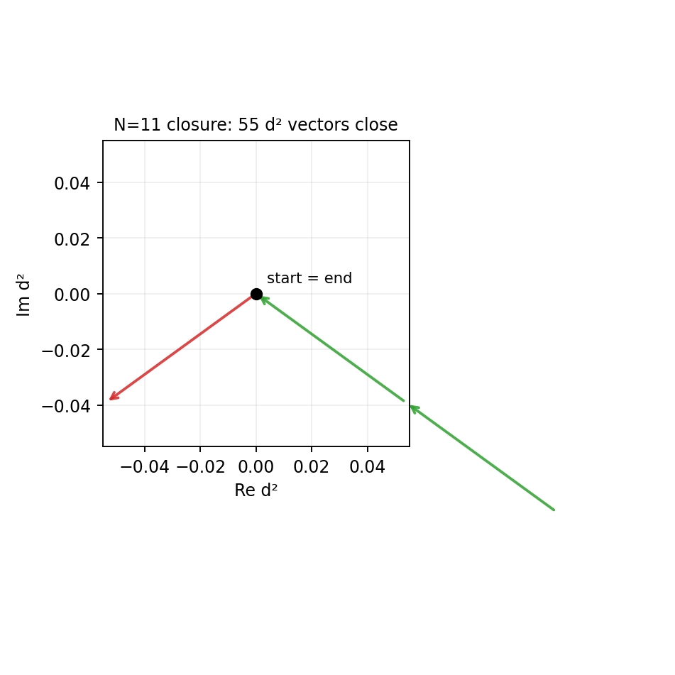
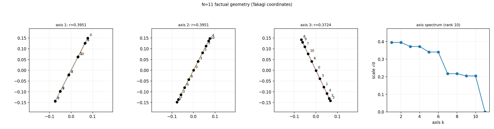

## 11. N=12 の全展開

### 11.0 N=12 の複素シンプレックスの定義

頂点 12 個 {0,…,11}。2 点の組は M = 12×11/2 = 66 個。各組に波 z が 1 個（実数 132 個が状態の全て）。2 乗距離は d² = z²。**N=12 の複素シンプレックスとは、12 頂点とこの 66 個の複素 2 乗距離の組**。

### 11.1 数え上げ（N=12）

| 量 | 値 | 計算 |
|---|---|---|
| 頂点 | 12 | — |
| 波の総数 M | 66 | 12×11/2 |
| 辺 | 12 | 円周の隣どうしの 12 本 |
| 対角線 | 54 | M − N = 66 − 12 |
| 面（三角形） | 220 | C(12,3) |
| 位相の種類 | 11（θ = k×16.3636°） | §11.2 の構成 |
| d² の角度の種類 | 11（k×32.7273°） | 位相の 2 倍 |
| rank | 11 = N−1 | §11.4 の計算結果 |

### 11.2 波の値 (a, b) と構成、自己無撞着の検証

**構成（偶数 N の設計＝完全マッチング分解）**。12 人で全員に相手がいるペアの組ませ方（完全マッチング、1 組 6 本）が、ちょうど 11 セットで全 66 組を重複なく覆う（総当たり戦の 11 節）。セット（色）c = 0..10 の波に位相 θ = c×16.3636°（= c×180°/11）を与える。各頂点はどの色の波もちょうど 1 本ずつ持つ。
スケールは規約 r² = 1/15（§0.2。‖v‖² = 66r² = 22/5）。同じクラスの波は同じ (a, b) を持つので、クラスごとに列挙する：

| クラス | θ | a = r·cosθ | b = r·sinθ | 本数 | 所属する組 |
|---|---|---|---|---|---|
| 0 | 0° | +0.258198890 | +0.000000000 | 6 | (0, 11) (1, 10) (2, 9) (3, 8) (4, 7) (5, 6) |
| 1 | 16.3636° | +0.247740021 | +0.072743033 | 6 | (0, 2) (1, 11) (3, 10) (4, 9) (5, 8) (6, 7) |
| 2 | 32.7273° | +0.217210728 | +0.139592859 | 6 | (0, 4) (1, 3) (2, 11) (5, 10) (6, 9) (7, 8) |
| 3 | 49.0909° | +0.169084314 | +0.195133701 | 6 | (0, 6) (1, 5) (2, 4) (3, 11) (7, 10) (8, 9) |
| 4 | 65.4545° | +0.107259695 | +0.234865971 | 6 | (0, 8) (1, 7) (2, 6) (3, 5) (4, 11) (9, 10) |
| 5 | 81.8182° | +0.036745533 | +0.255570797 | 6 | (0, 10) (1, 9) (2, 8) (3, 7) (4, 6) (5, 11) |
| 6 | 98.1818° | -0.036745533 | +0.255570797 | 6 | (0, 1) (2, 10) (3, 9) (4, 8) (5, 7) (6, 11) |
| 7 | 114.545° | -0.107259695 | +0.234865971 | 6 | (0, 3) (1, 2) (4, 10) (5, 9) (6, 8) (7, 11) |
| 8 | 130.909° | -0.169084314 | +0.195133701 | 6 | (0, 5) (1, 4) (2, 3) (6, 10) (7, 9) (8, 11) |
| 9 | 147.273° | -0.217210728 | +0.139592859 | 6 | (0, 7) (1, 6) (2, 5) (3, 4) (8, 10) (9, 11) |
| 10 | 163.636° | -0.247740021 | +0.072743033 | 6 | (0, 9) (1, 8) (2, 7) (3, 6) (4, 5) (10, 11) |

**自己無撞着の検証【定理・実測】**：和則（§0.1）を全 66 組で数値検査——実部条件 Σsin²φ の値は全組で 11.000000（= N−1 = 11、ばらつき 4e-15）、虚部条件 |Σsin2φ| ≤ 2e-15。方程式の残差 8.8e-17。よって μ/r² = −(N−1) = −11、**μ = −11/15 = -0.733333333**。
※この構成の一意性は証明していない【未証明】。

### 11.3 2 乗距離（クラスごと）

| クラス | d² の角度 | d² の値 |
|---|---|---|
| 0 | 0° | +0.066666667+0.000000000i |
| 1 | 32.7273° | +0.056083569+0.036042721i |
| 2 | 65.4545° | +0.027694334+0.060642133i |
| 3 | 98.1818° | -0.009487656+0.065988096i |
| 4 | 130.909° | -0.043657382+0.050383305i |
| 5 | 163.636° | -0.063966198+0.018782170i |
| 6 | 196.364° | -0.063966198-0.018782170i |
| 7 | 229.091° | -0.043657382-0.050383305i |
| 8 | 261.818° | -0.009487656-0.065988096i |
| 9 | 294.545° | +0.027694334-0.060642133i |
| 10 | 327.273° | +0.056083569-0.036042721i |

### 11.4 閉塞の判定・B 行列と形

- **大域閉塞【定理・実測】**：全体では各角度が 6 本ずつ → 6×r²×（11 乗根の和）= 0。実測 |Σz²| = 1e-16。
- **局所閉塞【定理・実測】**：各頂点は 11 色を 1 本ずつ持つ。d² の角度は色 c で c×32.7273° = c×360°/11、つまり **1 の 11 乗根がちょうど 1 個ずつ**。冪根の総和は零なので局所和 = r²×(11 乗根の和) = 0。実測 max|局所和| = 3e-17。よって**全頂点が光円錐上**（埋め込みで max|x·x| = 8e-17）。
- **B = −½JD²J の Takagi 軸【実測・機械精度】**：軸スケールの相異なる値は 0.577350269、0.339808849、0.182574186 （等長でない。相異なる値 3 種：長い軸あり）。rank = 11。頂点のエルミート半径：0.325342203、0.256744046。埋め込みの距離再現誤差 max = 3e-16。

### 11.5 N=12 のまとめ（種別）

- 【選択＋実測】完全マッチング分解に位相を等間隔で配った等モジュラー状態は自己無撞着（残差 9e-17）。
- 【定理・実測】大域閉塞・局所閉塞とも成立。全頂点が光円錐上。
- 【定理】μ/r² = −(N−1) = −11。
- 【実測（機械精度）】rank = 11（最大次元）、軸は等長でない（1 本だけ長い軸を持つ）。
- 【規約の帰結】大きさに制限はない（スケール対称性）。

### 図（N=12）

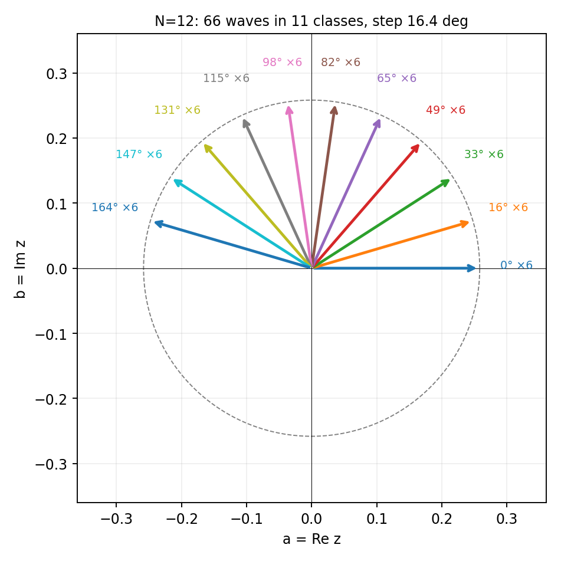
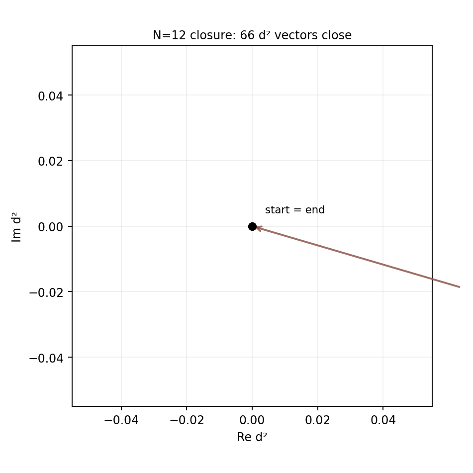
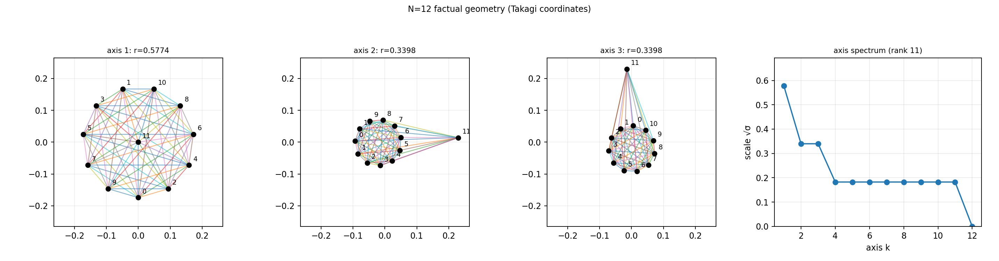

## 12. N=13 の全展開

### 12.0 N=13 の複素シンプレックスの定義

頂点 13 個 {0,…,12}。2 点の組は M = 13×12/2 = 78 個。各組に波 z が 1 個（実数 156 個が状態の全て）。2 乗距離は d² = z²。**N=13 の複素シンプレックスとは、13 頂点とこの 78 個の複素 2 乗距離の組**。

### 12.1 数え上げ（N=13）

| 量 | 値 | 計算 |
|---|---|---|
| 頂点 | 13 | — |
| 波の総数 M | 78 | 13×12/2 |
| 辺 | 13 | 円周の隣どうしの 13 本 |
| 対角線 | 65 | M − N = 78 − 13 |
| 面（三角形） | 286 | C(13,3) |
| 位相の種類 | 6（θ = k×30°） | §12.2 の構成 |
| d² の角度の種類 | 6（k×60°） | 位相の 2 倍 |
| rank | 12 = N−1 | §12.4 の計算結果 |

### 12.2 波の値 (a, b) と構成、自己無撞着の検証

**構成（奇数 N の設計＝距離クラス分解）**。頂点を円周に並べ、組 (i,j) の「距離」を d = |i−j| を N で折り返した値（1〜6）とする。距離 d のクラスは各頂点にちょうど 2 本ずつ属する（13 本、全 6 クラスで 78 組を覆う）。クラス d の波に位相 θ = (d−1)×30°（= (d−1)×180°/6）を与える。
スケールは規約 r² = 1/15（§0.2。‖v‖² = 78r² = 26/5）。同じクラスの波は同じ (a, b) を持つので、クラスごとに列挙する：

| クラス | θ | a = r·cosθ | b = r·sinθ | 本数 | 所属する組 |
|---|---|---|---|---|---|
| 0 | 0° | +0.258198890 | +0.000000000 | 13 | (0, 1) (0, 12) (1, 2) (2, 3) (3, 4) (4, 5) (5, 6) (6, 7) (7, 8) (8, 9) (9, 10) (10, 11) (11, 12) |
| 1 | 30° | +0.223606798 | +0.129099445 | 13 | (0, 2) (0, 11) (1, 3) (1, 12) (2, 4) (3, 5) (4, 6) (5, 7) (6, 8) (7, 9) (8, 10) (9, 11) (10, 12) |
| 2 | 60° | +0.129099445 | +0.223606798 | 13 | (0, 3) (0, 10) (1, 4) (1, 11) (2, 5) (2, 12) (3, 6) (4, 7) (5, 8) (6, 9) (7, 10) (8, 11) (9, 12) |
| 3 | 90° | +0.000000000 | +0.258198890 | 13 | (0, 4) (0, 9) (1, 5) (1, 10) (2, 6) (2, 11) (3, 7) (3, 12) (4, 8) (5, 9) (6, 10) (7, 11) (8, 12) |
| 4 | 120° | -0.129099445 | +0.223606798 | 13 | (0, 5) (0, 8) (1, 6) (1, 9) (2, 7) (2, 10) (3, 8) (3, 11) (4, 9) (4, 12) (5, 10) (6, 11) (7, 12) |
| 5 | 150° | -0.223606798 | +0.129099445 | 13 | (0, 6) (0, 7) (1, 7) (1, 8) (2, 8) (2, 9) (3, 9) (3, 10) (4, 10) (4, 11) (5, 11) (5, 12) (6, 12) |

**自己無撞着の検証【定理・実測】**：和則（§0.1）を全 78 組で数値検査——実部条件 Σsin²φ の値は全組で 12.000000（= N−1 = 12、ばらつき 2e-15）、虚部条件 |Σsin2φ| ≤ 2e-15。方程式の残差 1.5e-16。よって μ/r² = −(N−1) = −12、**μ = −4/5 = -0.800000000**。
※この構成の一意性は証明していない【未証明】。

### 12.3 2 乗距離（クラスごと）

| クラス | d² の角度 | d² の値 |
|---|---|---|
| 0 | 0° | +0.066666667+0.000000000i |
| 1 | 60° | +0.033333333+0.057735027i |
| 2 | 120° | -0.033333333+0.057735027i |
| 3 | 180° | -0.066666667+0.000000000i |
| 4 | 240° | -0.033333333-0.057735027i |
| 5 | 300° | +0.033333333-0.057735027i |

### 12.4 閉塞の判定・B 行列と形

- **大域閉塞【定理・実測】**：全体では各角度が 13 本ずつ → 13×r²×（6 乗根の和）= 0。実測 |Σz²| = 5e-16。
- **局所閉塞【定理・実測】**：各頂点は 6 クラスを 2 本ずつ持つ。d² の角度は (d−1)×60° = (d−1)×360°/6、つまり **1 の 6 乗根が 2 個ずつ**。冪根の総和は零なので局所和 = 2r²×(6 乗根の和) = 0。実測 max|局所和| = 1e-16。よって**全頂点が光円錐上**（埋め込みで max|x·x| = 9e-17）。
- **B = −½JD²J の Takagi 軸【実測・機械精度】**：軸スケールの相異なる値は 0.435667331、0.407077226、0.364716343、0.216210665、0.205945730、0.196861967 （等長でない。相異なる値 6 種：長い軸あり）。rank = 12。頂点のエルミート半径：0.307958846。埋め込みの距離再現誤差 max = 2e-16。

### 12.5 N=13 のまとめ（種別）

- 【選択＋実測】距離クラス分解に位相を等間隔で配った等モジュラー状態は自己無撞着（残差 1e-16）。
- 【定理・実測】大域閉塞・局所閉塞とも成立。全頂点が光円錐上。
- 【定理】μ/r² = −(N−1) = −12。
- 【実測（機械精度）】rank = 12（最大次元）、軸は等長でない（1 本だけ長い軸を持つ）。
- 【規約の帰結】大きさに制限はない（スケール対称性）。

### 図（N=13）

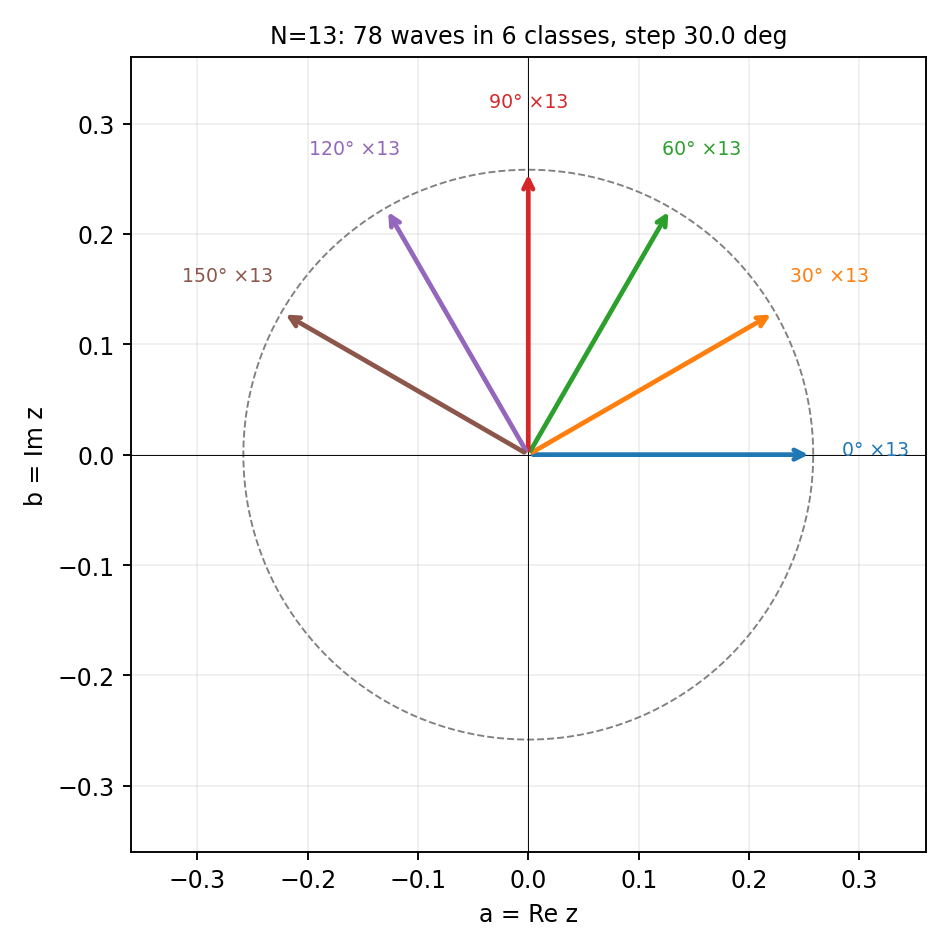
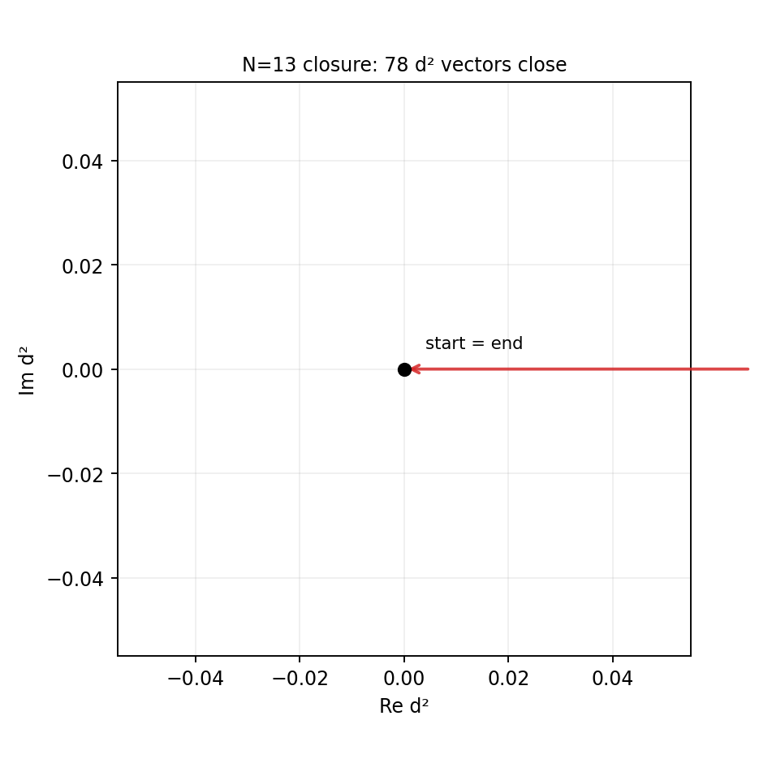
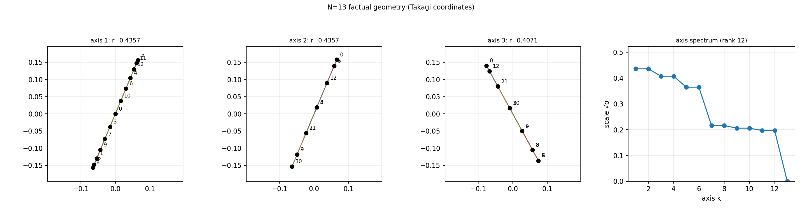

## 13. N=14 の全展開

### 13.0 N=14 の複素シンプレックスの定義

頂点 14 個 {0,…,13}。2 点の組は M = 14×13/2 = 91 個。各組に波 z が 1 個（実数 182 個が状態の全て）。2 乗距離は d² = z²。**N=14 の複素シンプレックスとは、14 頂点とこの 91 個の複素 2 乗距離の組**。

### 13.1 数え上げ（N=14）

| 量 | 値 | 計算 |
|---|---|---|
| 頂点 | 14 | — |
| 波の総数 M | 91 | 14×13/2 |
| 辺 | 14 | 円周の隣どうしの 14 本 |
| 対角線 | 77 | M − N = 91 − 14 |
| 面（三角形） | 364 | C(14,3) |
| 位相の種類 | 13（θ = k×13.8462°） | §13.2 の構成 |
| d² の角度の種類 | 13（k×27.6923°） | 位相の 2 倍 |
| rank | 13 = N−1 | §13.4 の計算結果 |

### 13.2 波の値 (a, b) と構成、自己無撞着の検証

**構成（偶数 N の設計＝完全マッチング分解）**。14 人で全員に相手がいるペアの組ませ方（完全マッチング、1 組 7 本）が、ちょうど 13 セットで全 91 組を重複なく覆う（総当たり戦の 13 節）。セット（色）c = 0..12 の波に位相 θ = c×13.8462°（= c×180°/13）を与える。各頂点はどの色の波もちょうど 1 本ずつ持つ。
スケールは規約 r² = 1/15（§0.2。‖v‖² = 91r² = 91/15）。同じクラスの波は同じ (a, b) を持つので、クラスごとに列挙する：

| クラス | θ | a = r·cosθ | b = r·sinθ | 本数 | 所属する組 |
|---|---|---|---|---|---|
| 0 | 0° | +0.258198890 | +0.000000000 | 7 | (0, 13) (1, 12) (2, 11) (3, 10) (4, 9) (5, 8) (6, 7) |
| 1 | 13.8462° | +0.250696099 | +0.061791039 | 7 | (0, 2) (1, 13) (3, 12) (4, 11) (5, 10) (6, 9) (7, 8) |
| 2 | 27.6923° | +0.228623763 | +0.119991007 | 7 | (0, 4) (1, 3) (2, 13) (5, 12) (6, 11) (7, 10) (8, 9) |
| 3 | 41.5385° | +0.193264644 | +0.171217534 | 7 | (0, 6) (1, 5) (2, 4) (3, 13) (7, 12) (8, 11) (9, 10) |
| 4 | 55.3846° | +0.146673687 | +0.212493520 | 7 | (0, 8) (1, 7) (2, 6) (3, 5) (4, 13) (9, 12) (10, 11) |
| 5 | 69.2308° | +0.091558588 | +0.241420156 | 7 | (0, 10) (1, 9) (2, 8) (3, 7) (4, 6) (5, 13) (11, 12) |
| 6 | 83.0769° | +0.031122437 | +0.256316329 | 7 | (0, 12) (1, 11) (2, 10) (3, 9) (4, 8) (5, 7) (6, 13) |
| 7 | 96.9231° | -0.031122437 | +0.256316329 | 7 | (0, 1) (2, 12) (3, 11) (4, 10) (5, 9) (6, 8) (7, 13) |
| 8 | 110.769° | -0.091558588 | +0.241420156 | 7 | (0, 3) (1, 2) (4, 12) (5, 11) (6, 10) (7, 9) (8, 13) |
| 9 | 124.615° | -0.146673687 | +0.212493520 | 7 | (0, 5) (1, 4) (2, 3) (6, 12) (7, 11) (8, 10) (9, 13) |
| 10 | 138.462° | -0.193264644 | +0.171217534 | 7 | (0, 7) (1, 6) (2, 5) (3, 4) (8, 12) (9, 11) (10, 13) |
| 11 | 152.308° | -0.228623763 | +0.119991007 | 7 | (0, 9) (1, 8) (2, 7) (3, 6) (4, 5) (10, 12) (11, 13) |
| 12 | 166.154° | -0.250696099 | +0.061791039 | 7 | (0, 11) (1, 10) (2, 9) (3, 8) (4, 7) (5, 6) (12, 13) |

**自己無撞着の検証【定理・実測】**：和則（§0.1）を全 91 組で数値検査——実部条件 Σsin²φ の値は全組で 13.000000（= N−1 = 13、ばらつき 5e-15）、虚部条件 |Σsin2φ| ≤ 2e-15。方程式の残差 1.3e-16。よって μ/r² = −(N−1) = −13、**μ = −13/15 = -0.866666667**。
※この構成の一意性は証明していない【未証明】。

### 13.3 2 乗距離（クラスごと）

| クラス | d² の角度 | d² の値 |
|---|---|---|
| 0 | 0° | +0.066666667+0.000000000i |
| 1 | 27.6923° | +0.059030402+0.030981545i |
| 2 | 55.3846° | +0.037870983+0.054865591i |
| 3 | 83.0769° | +0.008035779+0.066180592i |
| 4 | 110.769° | -0.023640326+0.062334416i |
| 5 | 138.462° | -0.049900717+0.044208177i |
| 6 | 166.154° | -0.064729454+0.015954378i |
| 7 | 193.846° | -0.064729454-0.015954378i |
| 8 | 221.538° | -0.049900717-0.044208177i |
| 9 | 249.231° | -0.023640326-0.062334416i |
| 10 | 276.923° | +0.008035779-0.066180592i |
| 11 | 304.615° | +0.037870983-0.054865591i |
| 12 | 332.308° | +0.059030402-0.030981545i |

### 13.4 閉塞の判定・B 行列と形

- **大域閉塞【定理・実測】**：全体では各角度が 7 本ずつ → 7×r²×（13 乗根の和）= 0。実測 |Σz²| = 5e-16。
- **局所閉塞【定理・実測】**：各頂点は 13 色を 1 本ずつ持つ。d² の角度は色 c で c×27.6923° = c×360°/13、つまり **1 の 13 乗根がちょうど 1 個ずつ**。冪根の総和は零なので局所和 = r²×(13 乗根の和) = 0。実測 max|局所和| = 8e-17。よって**全頂点が光円錐上**（埋め込みで max|x·x| = 8e-17）。
- **B = −½JD²J の Takagi 軸【実測・機械精度】**：軸スケールの相異なる値は 0.632455532、0.353159897、0.182574186 （等長でない。相異なる値 3 種：長い軸あり）。rank = 13。頂点のエルミート半径：0.340313392、0.258243170。埋め込みの距離再現誤差 max = 2e-16。

### 13.5 N=14 のまとめ（種別）

- 【選択＋実測】完全マッチング分解に位相を等間隔で配った等モジュラー状態は自己無撞着（残差 1e-16）。
- 【定理・実測】大域閉塞・局所閉塞とも成立。全頂点が光円錐上。
- 【定理】μ/r² = −(N−1) = −13。
- 【実測（機械精度）】rank = 13（最大次元）、軸は等長でない（1 本だけ長い軸を持つ）。
- 【規約の帰結】大きさに制限はない（スケール対称性）。

### 図（N=14）

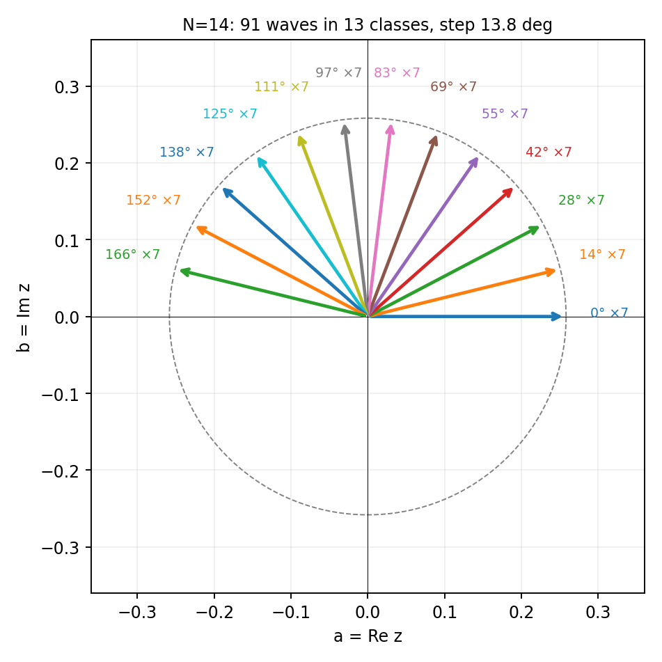
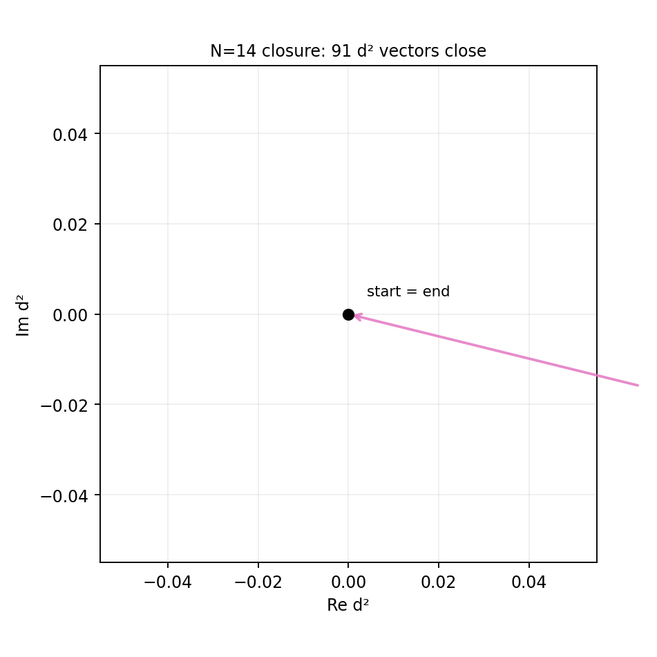
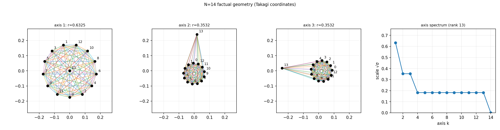

## 14. N=15 の全展開

### 14.0 N=15 の複素シンプレックスの定義

頂点 15 個 {0,…,14}。2 点の組は M = 15×14/2 = 105 個。各組に波 z が 1 個（実数 210 個が状態の全て）。2 乗距離は d² = z²。**N=15 の複素シンプレックスとは、15 頂点とこの 105 個の複素 2 乗距離の組**。

### 14.1 数え上げ（N=15）

| 量 | 値 | 計算 |
|---|---|---|
| 頂点 | 15 | — |
| 波の総数 M | 105 | 15×14/2 |
| 辺 | 15 | 円周の隣どうしの 15 本 |
| 対角線 | 90 | M − N = 105 − 15 |
| 面（三角形） | 455 | C(15,3) |
| 位相の種類 | 7（θ = k×25.7143°） | §14.2 の構成 |
| d² の角度の種類 | 7（k×51.4286°） | 位相の 2 倍 |
| rank | 14 = N−1 | §14.4 の計算結果 |

### 14.2 波の値 (a, b) と構成、自己無撞着の検証

**構成（奇数 N の設計＝距離クラス分解）**。頂点を円周に並べ、組 (i,j) の「距離」を d = |i−j| を N で折り返した値（1〜7）とする。距離 d のクラスは各頂点にちょうど 2 本ずつ属する（15 本、全 7 クラスで 105 組を覆う）。クラス d の波に位相 θ = (d−1)×25.7143°（= (d−1)×180°/7）を与える。
スケールは規約 r² = 1/15（§0.2。‖v‖² = 105r² = 7）。同じクラスの波は同じ (a, b) を持つので、クラスごとに列挙する：

| クラス | θ | a = r·cosθ | b = r·sinθ | 本数 | 所属する組 |
|---|---|---|---|---|---|
| 0 | 0° | +0.258198890 | +0.000000000 | 15 | (0, 1) (0, 14) (1, 2) (2, 3) (3, 4) (4, 5) (5, 6) (6, 7) (7, 8) (8, 9) (9, 10) (10, 11) (11, 12) (12, 13) (13, 14) |
| 1 | 25.7143° | +0.232629161 | +0.112028300 | 15 | (0, 2) (0, 13) (1, 3) (1, 14) (2, 4) (3, 5) (4, 6) (5, 7) (6, 8) (7, 9) (8, 10) (9, 11) (10, 12) (11, 13) (12, 14) |
| 2 | 51.4286° | +0.160984375 | +0.201868021 | 15 | (0, 3) (0, 12) (1, 4) (1, 13) (2, 5) (2, 14) (3, 6) (4, 7) (5, 8) (6, 9) (7, 10) (8, 11) (9, 12) (10, 13) (11, 14) |
| 3 | 77.1429° | +0.057454658 | +0.251725305 | 15 | (0, 4) (0, 11) (1, 5) (1, 12) (2, 6) (2, 13) (3, 7) (3, 14) (4, 8) (5, 9) (6, 10) (7, 11) (8, 12) (9, 13) (10, 14) |
| 4 | 102.857° | -0.057454658 | +0.251725305 | 15 | (0, 5) (0, 10) (1, 6) (1, 11) (2, 7) (2, 12) (3, 8) (3, 13) (4, 9) (4, 14) (5, 10) (6, 11) (7, 12) (8, 13) (9, 14) |
| 5 | 128.571° | -0.160984375 | +0.201868021 | 15 | (0, 6) (0, 9) (1, 7) (1, 10) (2, 8) (2, 11) (3, 9) (3, 12) (4, 10) (4, 13) (5, 11) (5, 14) (6, 12) (7, 13) (8, 14) |
| 6 | 154.286° | -0.232629161 | +0.112028300 | 15 | (0, 7) (0, 8) (1, 8) (1, 9) (2, 9) (2, 10) (3, 10) (3, 11) (4, 11) (4, 12) (5, 12) (5, 13) (6, 13) (6, 14) (7, 14) |

**自己無撞着の検証【定理・実測】**：和則（§0.1）を全 105 組で数値検査——実部条件 Σsin²φ の値は全組で 14.000000（= N−1 = 14、ばらつき 5e-15）、虚部条件 |Σsin2φ| ≤ 4e-15。方程式の残差 1.9e-16。よって μ/r² = −(N−1) = −14、**μ = −14/15 = -0.933333333**。
※この構成の一意性は証明していない【未証明】。

**特記**：N=15 では一部の距離クラスが 1 つの輪でなく複数の輪に分かれる（距離が N と公約数を持つため）。設計の成立に必要なのは「各頂点に各クラスが 2 本ずつ」だけなので、結論は変わらない（残差 2e-16 で検証済み）。

### 14.3 2 乗距離（クラスごと）

| クラス | d² の角度 | d² の値 |
|---|---|---|
| 0 | 0° | +0.066666667+0.000000000i |
| 1 | 51.4286° | +0.041565987+0.052122099i |
| 2 | 102.857° | -0.014834729+0.064995194i |
| 3 | 154.286° | -0.060064591+0.028925583i |
| 4 | 205.714° | -0.060064591-0.028925583i |
| 5 | 257.143° | -0.014834729-0.064995194i |
| 6 | 308.571° | +0.041565987-0.052122099i |

### 14.4 閉塞の判定・B 行列と形

- **大域閉塞【定理・実測】**：全体では各角度が 15 本ずつ → 15×r²×（7 乗根の和）= 0。実測 |Σz²| = 4e-16。
- **局所閉塞【定理・実測】**：各頂点は 7 クラスを 2 本ずつ持つ。d² の角度は (d−1)×51.4286° = (d−1)×360°/7、つまり **1 の 7 乗根が 2 個ずつ**。冪根の総和は零なので局所和 = 2r²×(7 乗根の和) = 0。実測 max|局所和| = 1e-16。よって**全頂点が光円錐上**（埋め込みで max|x·x| = 1e-16）。
- **B = −½JD²J の Takagi 軸【実測・機械精度】**：軸スケールの相異なる値は 0.472648580、0.439506541、0.387196133、0.215419304、0.210960155、0.195371618、0.192745420 （等長でない。相異なる値 7 種：長い軸あり）。rank = 14。頂点のエルミート半径：0.312562325。埋め込みの距離再現誤差 max = 3e-16。

### 14.5 N=15 のまとめ（種別）

- 【選択＋実測】距離クラス分解に位相を等間隔で配った等モジュラー状態は自己無撞着（残差 2e-16）。
- 【定理・実測】大域閉塞・局所閉塞とも成立。全頂点が光円錐上。
- 【定理】μ/r² = −(N−1) = −14。
- 【実測（機械精度）】rank = 14（最大次元）、軸は等長でない（1 本だけ長い軸を持つ）。
- 【規約の帰結】大きさに制限はない（スケール対称性）。

### 図（N=15）

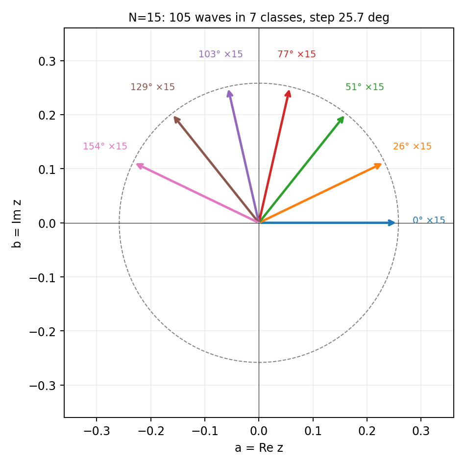
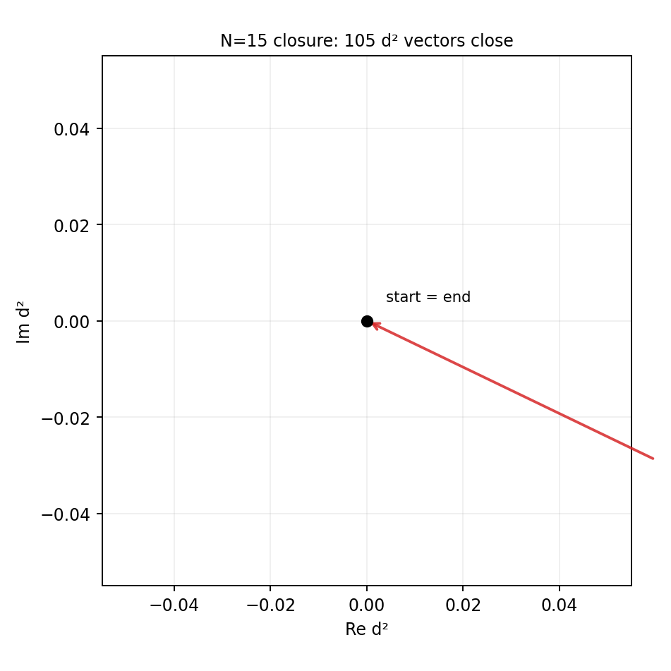
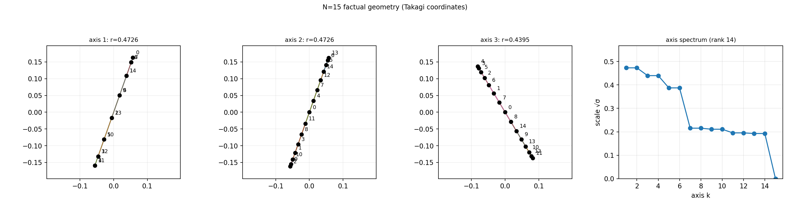

## 15. N=16 の全展開

### 15.0 N=16 の複素シンプレックスの定義

頂点 16 個 {0,…,15}。2 点の組は M = 16×15/2 = 120 個。各組に波 z が 1 個（実数 240 個が状態の全て）。2 乗距離は d² = z²。**N=16 の複素シンプレックスとは、16 頂点とこの 120 個の複素 2 乗距離の組**。

### 15.1 数え上げ（N=16）

| 量 | 値 | 計算 |
|---|---|---|
| 頂点 | 16 | — |
| 波の総数 M | 120 | 16×15/2 |
| 辺 | 16 | 円周の隣どうしの 16 本 |
| 対角線 | 104 | M − N = 120 − 16 |
| 面（三角形） | 560 | C(16,3) |
| 位相の種類 | 15（θ = k×12°） | §15.2 の構成 |
| d² の角度の種類 | 15（k×24°） | 位相の 2 倍 |
| rank | 15 = N−1 | §15.4 の計算結果 |

### 15.2 波の値 (a, b) と構成、自己無撞着の検証

**構成（偶数 N の設計＝完全マッチング分解）**。16 人で全員に相手がいるペアの組ませ方（完全マッチング、1 組 8 本）が、ちょうど 15 セットで全 120 組を重複なく覆う（総当たり戦の 15 節）。セット（色）c = 0..14 の波に位相 θ = c×12°（= c×180°/15）を与える。各頂点はどの色の波もちょうど 1 本ずつ持つ。
スケールは規約 r² = 1/15（§0.2。‖v‖² = 120r² = 8）。同じクラスの波は同じ (a, b) を持つので、クラスごとに列挙する：

| クラス | θ | a = r·cosθ | b = r·sinθ | 本数 | 所属する組 |
|---|---|---|---|---|---|
| 0 | 0° | +0.258198890 | +0.000000000 | 8 | (0, 15) (1, 14) (2, 13) (3, 12) (4, 11) (5, 10) (6, 9) (7, 8) |
| 1 | 12° | +0.252556625 | +0.053682568 | 8 | (0, 2) (1, 15) (3, 14) (4, 13) (5, 12) (6, 11) (7, 10) (8, 9) |
| 2 | 24° | +0.235876423 | +0.105018950 | 8 | (0, 4) (1, 3) (2, 15) (5, 14) (6, 13) (7, 12) (8, 11) (9, 10) |
| 3 | 36° | +0.208887290 | +0.151765500 | 8 | (0, 6) (1, 5) (2, 4) (3, 15) (7, 14) (8, 13) (9, 12) (10, 11) |
| 4 | 48° | +0.172768780 | +0.191879169 | 8 | (0, 8) (1, 7) (2, 6) (3, 5) (4, 15) (9, 14) (10, 13) (11, 12) |
| 5 | 60° | +0.129099445 | +0.223606798 | 8 | (0, 10) (1, 9) (2, 8) (3, 7) (4, 6) (5, 15) (11, 14) (12, 13) |
| 6 | 72° | +0.079787845 | +0.245561737 | 8 | (0, 12) (1, 11) (2, 10) (3, 9) (4, 8) (5, 7) (6, 15) (13, 14) |
| 7 | 84° | +0.026989133 | +0.256784449 | 8 | (0, 14) (1, 13) (2, 12) (3, 11) (4, 10) (5, 9) (6, 8) (7, 15) |
| 8 | 96° | -0.026989133 | +0.256784449 | 8 | (0, 1) (2, 14) (3, 13) (4, 12) (5, 11) (6, 10) (7, 9) (8, 15) |
| 9 | 108° | -0.079787845 | +0.245561737 | 8 | (0, 3) (1, 2) (4, 14) (5, 13) (6, 12) (7, 11) (8, 10) (9, 15) |
| 10 | 120° | -0.129099445 | +0.223606798 | 8 | (0, 5) (1, 4) (2, 3) (6, 14) (7, 13) (8, 12) (9, 11) (10, 15) |
| 11 | 132° | -0.172768780 | +0.191879169 | 8 | (0, 7) (1, 6) (2, 5) (3, 4) (8, 14) (9, 13) (10, 12) (11, 15) |
| 12 | 144° | -0.208887290 | +0.151765500 | 8 | (0, 9) (1, 8) (2, 7) (3, 6) (4, 5) (10, 14) (11, 13) (12, 15) |
| 13 | 156° | -0.235876423 | +0.105018950 | 8 | (0, 11) (1, 10) (2, 9) (3, 8) (4, 7) (5, 6) (12, 14) (13, 15) |
| 14 | 168° | -0.252556625 | +0.053682568 | 8 | (0, 13) (1, 12) (2, 11) (3, 10) (4, 9) (5, 8) (6, 7) (14, 15) |

**自己無撞着の検証【定理・実測】**：和則（§0.1）を全 120 組で数値検査——実部条件 Σsin²φ の値は全組で 15.000000（= N−1 = 15、ばらつき 7e-15）、虚部条件 |Σsin2φ| ≤ 3e-15。方程式の残差 2.2e-16。よって μ/r² = −(N−1) = −15、**μ = −1 = -1.000000000**。
※この構成の一意性は証明していない【未証明】。

### 15.3 2 乗距離（クラスごと）

| クラス | d² の角度 | d² の値 |
|---|---|---|
| 0 | 0° | +0.066666667+0.000000000i |
| 1 | 24° | +0.060903031+0.027115776i |
| 2 | 48° | +0.044608707+0.049542988i |
| 3 | 72° | +0.020601133+0.063403768i |
| 4 | 96° | -0.006968564+0.066301460i |
| 5 | 120° | -0.033333333+0.057735027i |
| 6 | 144° | -0.053934466+0.039185683i |
| 7 | 168° | -0.065209840+0.013860779i |
| 8 | 192° | -0.065209840-0.013860779i |
| 9 | 216° | -0.053934466-0.039185683i |
| 10 | 240° | -0.033333333-0.057735027i |
| 11 | 264° | -0.006968564-0.066301460i |
| 12 | 288° | +0.020601133-0.063403768i |
| 13 | 312° | +0.044608707-0.049542988i |
| 14 | 336° | +0.060903031-0.027115776i |

### 15.4 閉塞の判定・B 行列と形

- **大域閉塞【定理・実測】**：全体では各角度が 8 本ずつ → 8×r²×（15 乗根の和）= 0。実測 |Σz²| = 2e-16。
- **局所閉塞【定理・実測】**：各頂点は 15 色を 1 本ずつ持つ。d² の角度は色 c で c×24° = c×360°/15、つまり **1 の 15 乗根がちょうど 1 個ずつ**。冪根の総和は零なので局所和 = r²×(15 乗根の和) = 0。実測 max|局所和| = 7e-17。よって**全頂点が光円錐上**（埋め込みで max|x·x| = 9e-17）。
- **B = −½JD²J の Takagi 軸【実測・機械精度】**：軸スケールの相異なる値は 0.683130051、0.365148372、0.182574186 （等長でない。相異なる値 3 種：長い軸あり）。rank = 15。頂点のエルミート半径：0.353553391、0.259272486。埋め込みの距離再現誤差 max = 2e-16。

### 15.5 N=16 のまとめ（種別）

- 【選択＋実測】完全マッチング分解に位相を等間隔で配った等モジュラー状態は自己無撞着（残差 2e-16）。
- 【定理・実測】大域閉塞・局所閉塞とも成立。全頂点が光円錐上。
- 【定理】μ/r² = −(N−1) = −15。
- 【実測（機械精度）】rank = 15（最大次元）、軸は等長でない（1 本だけ長い軸を持つ）。
- 【規約の帰結】大きさに制限はない（スケール対称性）。

### 図（N=16）

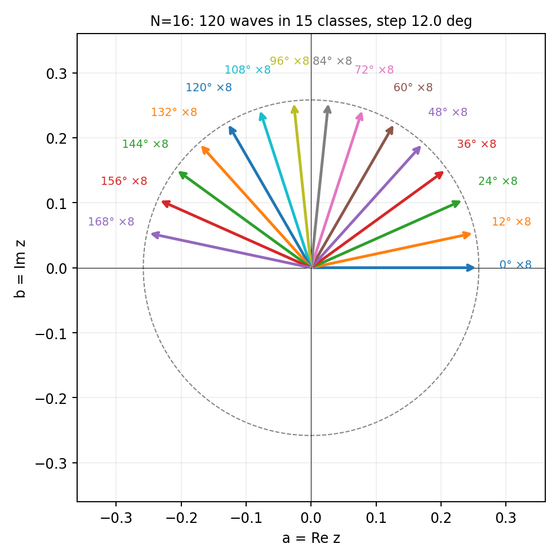
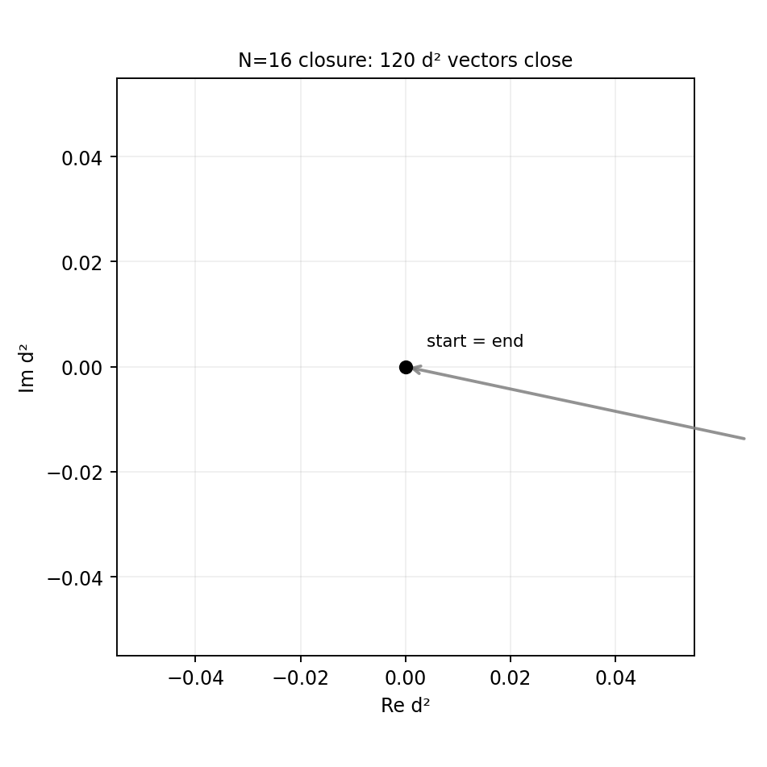
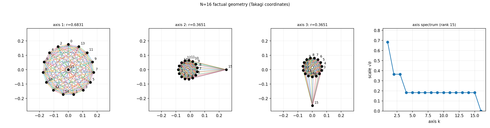

## 16. 全 N の一覧表（まとめ）

各 N の節で個別に導いた数え上げと計算結果を、最後に一覧する（§1 の方針どおり、ここで初めて表にする）。

| N | 頂点 | 波 M | 辺 | 対角線 | 面 | 位相の種類 | d² 角度の種類 | rank | 軸の形 |
|---|---|---|---|---|---|---|---|---|---|
| 3 | 3 | 3 | 3 | 0 | 1 | 3（0/60/120°） | 3 | **1**（例外） | —（rank1） |
| 4 | 4 | 6 | 4 | 2 | 4 | 3（k×60°） | 3 | 3 = N−1 | 丸い |
| 5 | 5 | 10 | 5 | 5 | 10 | 2（k×90°） | 2 | 4 = N−1 | 丸い |
| 6 | 6 | 15 | 6 | 9 | 20 | 5（k×36°） | 5 | 5 = N−1 | 等長でない |
| 7 | 7 | 21 | 7 | 14 | 35 | 3（k×60°） | 3 | 6 = N−1 | 丸い |
| 8 | 8 | 28 | 8 | 20 | 56 | 7（k×25.7143°） | 7 | 7 = N−1 | 等長でない |
| 9 | 9 | 36 | 9 | 27 | 84 | 4（k×45°） | 4 | 8 = N−1 | 等長でない |
| 10 | 10 | 45 | 10 | 35 | 120 | 9（k×20°） | 9 | 9 = N−1 | 等長でない |
| 11 | 11 | 55 | 11 | 44 | 165 | 5（k×36°） | 5 | 10 = N−1 | 等長でない |
| 12 | 12 | 66 | 12 | 54 | 220 | 11（k×16.3636°） | 11 | 11 = N−1 | 等長でない |
| 13 | 13 | 78 | 13 | 65 | 286 | 6（k×30°） | 6 | 12 = N−1 | 等長でない |
| 14 | 14 | 91 | 14 | 77 | 364 | 13（k×13.8462°） | 13 | 13 = N−1 | 等長でない |
| 15 | 15 | 105 | 15 | 90 | 455 | 7（k×25.7143°） | 7 | 14 = N−1 | 等長でない |
| 16 | 16 | 120 | 16 | 104 | 560 | 15（k×12°） | 15 | 15 = N−1 | 等長でない |

注：
- rank は全 N で最大（N−1）に達する。例外は N=3 のみ（rank 1）。
- 軸がすべて等長（丸い）なのは N=4, 5, 7 の 3 つだけ。N≥9 は奇数の設計でも等長にならない。
- d² が実数（実の擬ユークリッド空間に置ける）のは N=5 のみ（§4.6）。
- μ/r² = −(N−1) は N=4〜16 のすべてで成立（N=3 は −3/2）。
