# 複素シンプレックス基礎（非等モジュラー版）——N=3 から順に、数え上げと全計算の展開と図化

**作成日:** 2026-08-30　**方針（木原指示）:** 等モジュラー版『複素シンプレックス基礎——N=3 から順に』（`../複素シンプレックス基礎_N別全展開_20260830/`、以下「等モジュラー版」）と**同じ構成・同じ順序・同じ図の様式**で、**等モジュラー（全波の大きさが等しい）という選択だけを外した**状態について、N=3 から順番に「頂点の数・辺の数・対角線の数・面の数・角度の数」を整理し、**すべての計算方法を省略なく展開**し、最後に図化する。各節に等モジュラー版の値を並記し、節ごとに比較できるようにする。用語は初出で必ず定義する。
**再現:** `bash run_all.sh`（`program/make_N.py N`、`program/assemble.py`。数値は全て標準出力に展開される）

## 0.1 用語の定義（この文書内で使うもの）

等モジュラー版 §0.1 の定義（波・発展・状態ベクトル v・ノルム ‖v‖・2 乗距離 d²・シンプレックス・複素シンプレックス・閉塞・局所閉塞・B 行列・Takagi 値と軸スケール・埋め込み座標・rank・相互作用 K・回転速度 μ と自己無撞着状態・等モジュラー）をそのまま使う。本文書で追加する用語：

- **平均振幅二乗 r̄²**：全 M 組の |z|² の平均。〈|z|²〉 とも書く。等モジュラー状態では r̄² = r²。
- **一般和則**：自己無撞着 i·K·v = μ·v を、大きさの等しくない波について成分で書き下したもの。z_e = r_e e^{iθ_e}、隣接する組 f との位相差 φ_ef = θ_f − θ_e として
　　実部条件：Σ_{f∼e} r_f² sin²φ_ef = −μ　　虚部条件：Σ_{f∼e} r_f² sin 2φ_ef = 0
　（和は e と点を共有する組 f にわたる。**隣接波の振幅二乗 r_f² が重みになる**。r_f ≡ r と置けば等モジュラー版の和則 Σsin²φ = −μ/r²、Σsin2φ = 0 に戻る。）導出は等モジュラー版 §2.2 導出 3 と同じ手順で、r を r_f に置き換えるだけである：K_ef = r_e r_f sin φ_ef、(i·K·v)_e = i Σ_f r_e r_f sin φ_ef · r_f e^{iθ_f} = μ r_e e^{iθ_e}、両辺を r_e e^{iθ_e} で割って i Σ_f r_f² sin φ_ef e^{iφ_ef} = μ、実部と虚部に分ける。
- **位相クラス**：等モジュラー版の構成で同じ位相を持つ組の集まり（偶数 N：完全マッチングの色、q = N−1 クラス、各頂点に各クラス 1 本／奇数 N：距離クラス、q = (N−1)/2、各頂点に各クラス 2 本）。クラス c の位相は θ_c = c×180°/q、d² の角度は c×360°/q。ω := e^{i·360°/q}。
- **クラス重み付き族**：位相配置は等モジュラー版のまま、クラス c の振幅二乗を a_c（クラス内で共通）とした状態。自己無撞着になる条件は **Σ_c a_c ω^c = 0**（振幅二乗を重みとした 1 の q 乗根の重心が原点）で、そのとき μ = −(N−1)·r̄²（導出は各 N の節 §.2）。q ≤ 3（N = 4, 5, 7）では a_c 全部等しいが強制され、族は等モジュラー点に退化する。
- **頂点局所和 S_i** := Σ_{k≠i} z_ik²（頂点 i に集まる組の d² の和。局所閉塞は S_i = 0）。**頂点重み W_i** := Σ_{k≠i} |z_ik|²。
- **自己無撞着の頂点形【定理】**：(i·K·v)_e = ½[ z̄_e (S_i+S_j−2z_e²) − z_e (W_i+W_j−2|z_e|²) ]（e=(i,j)）なので、自己無撞着は各辺で **S_i + S_j = (2μ + W_i + W_j)·z_e²/|z_e|²** と同値。系：**局所閉塞 S_i = 0（全頂点）かつ頂点重み均等 W_i = W（全頂点）ならば自己無撞着で μ = −W**。逆に自己無撞着かつ局所閉塞なら W_i ≡ −μ。
- **多様体上の代表点**：等モジュラー点を通る自己無撞着解の集合（N ≥ 5 では {S_i = 0, W_i = W} と一致し、実次元 N²−4N+1）の上で、等モジュラー点から離れた 1 点。クラス重み付き族が退化する N = 3, 4, 5, 7 の代表状態に使う。
- **複素ヌル錐**：x·x = 0（複素二次形式の零集合）。等モジュラー版で「光円錐」と呼んだもの。複素の場合は時間的／空間的の区別がないのでこの名で呼ぶ（N=5 等モジュラー版のように d² が全て実で R^{2,2} に置ける場合だけ光円錐と呼べる）。

## 0.2 何が公理で、何が選択・規約で、何が定理か

**公理（この系の定義。仮定であり、証明しない）**：等モジュラー版 §0.2 の公理 1（波）・公理 2（相互作用）・公理 3（発展）と同一。

**選択（無数にある状態の中から、この文書が調べる対象を絞る条件）**

- **自己無撞着**：i·K·v = μ·v（μ ≠ 0）を満たす状態だけを選ぶ（等モジュラー版と同じ）。
- **等モジュラーは選ばない**。代わりに各 N で次の 1 点を代表として選ぶ：
　(A) q ≥ 4 の N（6, 8, 9, …, 16）：クラス重み付き族の点 a_c = r̄²(1 + 0.6·cos(4πc/q))。位相配置は等モジュラー版と同一。
　(B) q ≤ 3 の N（3, 4, 5, 7）：多様体上の代表点——等モジュラー点から自己無撞着写像 F(v) = i·K(v)v − μ(v)v のヤコビアン核（スケール・全体回転を除く）の固定方向へ 0.3‖v‖ 動かし、Newton で解に戻した点。N = 5, 7 は局所閉塞 S_i = 0 と頂点重み均等を拘束に入れた分枝（§0.1 の定理により自動的に自己無撞着）。N = 3, 4 にはその分枝が存在しない（N=3 は局所閉塞が不可能、N=4 は {S=0, W 均等} がスケール分しかない）ので F = 0 だけで解く。
- 代表点の選び方に一意性はない。**等モジュラー版との差が「状態の選び方」だけ**であることが本文書の要点なので、以降の全ての計算は等モジュラー版と同じ手順で行い、値を並記する。

**規約（どちらに決めても物理が変わらない取り決め）**

- **スケールの規約**：平均振幅二乗 r̄² = 〈|z|²〉 = 1/15（等モジュラー版の r² = 1/15 と同じ ‖v‖² = M/15。よって μ の値も等モジュラー版と一致する）。
- **全体回転の規約**：クラス 0 の最初の組を θ = 0° に置く。

**定理（公理＋選択から計算だけで導かれるもの。各節で全展開する）**

- ‖v‖² の保存（K が実反対称であることの帰結）。
- **一般和則**（§0.1）：自己無撞着の成分展開。
- **閉塞 Σz² = 0**：自己無撞着（μ≠0）だけから従う。証明（3 行）：K は実行列なので、固定した行列 K = K(v) について i·K·v = μ·v の両辺の複素共役を取ると i·K·v̄ = −μ·v̄。μ ≠ 0 なら v と v̄ は同じエルミート行列 iK の異なる固有値の固有ベクトルだから直交し、その内積 (v̄)†v = v^Tv = Σ z_e² = 0。□（注：状態としての v̄ は K(v̄) = −K(v) なので非線形系では同じ μ の自己無撞着状態（鏡像）である。証明で使うのは固定 K の直交性だけ。）
- **クラス重み付き族の条件** Σ_c a_c ω^c = 0 と μ = −(N−1)r̄²（各 N の節 §.2 で導出）。
- **自己無撞着の頂点形**と、その系「局所閉塞＋頂点重み均等 ⇒ 自己無撞着」（§0.1）。
- 位相・振幅の値、μ、B の rank と形——各 N の節の計算結果。

## 1. 数え上げの方法（一般式のみ。各 N の数値はそれぞれの N の節に置く）

N 個の頂点に対して：

- **波（関係）の総数** M = N(N−1)/2 —— 2 点の組の数。
- **辺と対角線の区別**：頂点を円周に並べたとき、隣どうしを結ぶ組を「辺」（N 本）、それ以外を「対角線」（M − N 本）と呼ぶ。これは絵を描くための呼び分けにすぎず、**複素シンプレックスとしては全ての組が対等に波を持つ**（対角線にも波がある）。
- **面（三角形）の数** = C(N,3) = N(N−1)(N−2)/6 —— 3 頂点の選び方の数。
- **位相の種類の数・大きさの種類の数・d² の角度の種類の数・rank**：これらは一般式ではなく、各 N の状態を構成して初めて決まる量。各 N の節の数え上げ小節に記載し、全 N を終えた最終節で一覧表にまとめる。等モジュラー版との違いは「大きさの種類」が 1 でなくなること。

## 2. N=3 の全展開

### 2.0 N=3 の複素シンプレックスの定義

頂点 3 個 {0,…,2}。2 点の組は M = 3×2/2 = 3 個。各組に波 z が 1 個（実数 6 個が状態の全て）。2 乗距離は d² = z²。**N=3 の複素シンプレックスとは、3 頂点とこの 3 個の複素 2 乗距離の組**。

### 2.1 数え上げ（N=3）

| 量 | 値 | 計算 |
|---|---|---|
| 頂点 | 3 | — |
| 波の総数 M | 3 | 3×2/2 |
| 辺 | 3 | 円周の隣どうしの 3 本 |
| 対角線 | 0 | M − N = 3 − 3 |
| 面（三角形） | 1 | C(3,3) |
| 位相の種類 | 3（全組で異なる） | §2.2 の構成（等モジュラー版：3） |
| 大きさ \|z\| の種類 | 3 | §2.2（等モジュラー版：1） |
| d² の角度の種類 | 3 | 位相の 2 倍 |
| rank | 2 = N−1 | §2.4 の計算結果（等モジュラー版：1） |

### 2.2 波の値 (a, b) と構成、自己無撞着の検証

**構成（多様体上の代表点）**。N=3 では 3 本の波が互いに隣接する。等モジュラー版の状態（位相 0/60/120°、大きさ共通）から、自己無撞着写像 F(v) = i·K(v)v − μ(v)v のヤコビアン核（スケール・全体回転を除いて 2 次元）の固定方向へ 0.3‖v‖ 動かし、Gauss–Newton で F = 0 に戻した状態（§0.2 の選択 (B)）。大きさも位相差も 3 本で全て異なる。
スケールは規約 〈|z|²〉 = r̄² = 1/15（§0.2。‖v‖² = 3r̄² = 1/5、等モジュラー版と同じ）。全組を列挙する：

| 組 | 等モジュラー版のクラス（θ） | θ | \|z\| | a | b |
|---|---|---|---|---|---|
| (0, 1) | 2（120°） | 148.963° | 0.185688865 | -0.159104175 | +0.095740357 |
| (0, 2) | 0（0°） | 0.000° | 0.268572824 | +0.268572824 | -0.000000000 |
| (1, 2) | 1（60°） | 80.480° | 0.305594967 | +0.050542057 | +0.301386436 |

**自己無撞着の検証【定理・実測】**：一般和則（§0.1）を全 3 組で数値検査——実部条件 Σ_f |z_f|² sin²φ の値は全組で 0.100000000（ばらつき 1e-17。= −μ）、虚部条件 |Σ_f |z_f|² sin2φ| ≤ 3e-18。方程式の残差 1.9e-17。よって **μ = -0.100000000**——**等モジュラー版と同じ値**（-0.100000000）。
※この状態は等モジュラー点を通る自己無撞着解多様体（次元は §0.2 参照）上の 1 点で、一意性はない。

### 2.3 2 乗距離（組ごと）

| 組 | d² の角度 | \|d²\| = \|z\|² | d² の値 |
|---|---|---|---|
| (0, 1) | 297.925° | 0.034480354 | +0.016147923-0.030465381i |
| (0, 2) | 0.000° | 0.072131362 | +0.072131362-0.000000000i |
| (1, 2) | 160.960° | 0.093388284 | -0.088279285+0.030465381i |

**角度も大きさも組ごとに違う。**

### 2.4 閉塞の判定・B 行列と形

- **大域閉塞【定理・実測】**：自己無撞着（μ≠0）から従う（§0.2 の定理）。実測 |Σz²| = 4e-17。
- **局所閉塞【実測】：破れる**。頂点ごとの |局所和|/r̄² = 1.401、1.082、0.517（等モジュラー版は全頂点 0）。頂点は複素ヌル錐上に**ない**（|x·x|/r̄² = 0.467、0.361、0.172）。
- **B = −½JD²J の Takagi 軸【実測・機械精度】**：軸スケールの相異なる値は 0.248079573、0.188035192 （等長でない。相異なる値 2 種）。**等モジュラー版**：0.258198890（丸い）。rank = 2。頂点のエルミート半径：0.179722664。埋め込みの距離再現誤差 max = 7e-17。

### 2.5 N=3 のまとめ（種別）

- 【選択＋実測】多様体上の代表点は自己無撞着（残差 2e-17）。等モジュラーは**使っていない**。
- 【定理・実測】大域閉塞は成立。局所閉塞は**破れる**。
- 【定理】μ = -0.100000000：等モジュラー版と同一（μ は平均振幅二乗だけで決まる）。
- 【実測（機械精度）】rank = 2（最大次元）、軸は等長でない（等モジュラー版：丸い）。**等モジュラー版との差は形（Takagi 軸）だけ**、および局所閉塞の破れ。
- 【規約の帰結】大きさに制限はない（スケール対称性）。

### 2.6 補足：等モジュラー版 §2.2 導出 3 との対応——60° 間隔はどこへ行ったか

等モジュラー版では「3 本の大きさが等しい」を置いたうえで虚部条件を解き、位相間隔 60° が**一意**に出た。大きさを等しくしないと、一般和則（§0.1）の 6 本の実条件（3 組 × 実部・虚部）は未知数 3 個の大きさ・2 個の位相差・μ の 6 個に対して従属で、解は**2 パラメータの連続族**になる（自己無撞着写像のヤコビアン核が、スケール・全体回転を除いて 2 次元【実測】）。つまり **2 つの振幅比を与えると位相差が決まる**。本節の代表点でその 6 本を数値展開すると：

- 組 (0, 1)：実部 0.072131·sin²(-148.963°) + 0.093388·sin²(-68.483°) = 0.100000000（= −μ）、虚部 0.072131·sin(-297.925°) + 0.093388·sin(-136.965°) = +0.0e+00
- 組 (0, 2)：実部 0.034480·sin²(+148.963°) + 0.093388·sin²(+80.480°) = 0.100000000（= −μ）、虚部 0.034480·sin(+297.925°) + 0.093388·sin(+160.960°) = -3.5e-18
- 組 (1, 2)：実部 0.034480·sin²(+68.483°) + 0.072131·sin²(-80.480°) = 0.100000000（= −μ）、虚部 0.034480·sin(+136.965°) + 0.072131·sin(-160.960°) = +3.5e-18

実部は 3 組とも同じ値 0.100000000 = −μ（等モジュラー版の 3/2·r² = 0.1 と同じ μ = −1/10）。位相差は 80.480° と 68.483° で、60° ではない。

**局所閉塞**は等モジュラー版 §2.5 の定理どおり N=3 では不可能：頂点ごとの |局所和|/r̄² = 1.401、1.082、0.517（等モジュラー版は 3 頂点とも 1.000）。

**形**：等モジュラー版は rank 1（1 本の複素軸内の正三角形）だったが、この状態は **rank 2 = N−1**。大きさを崩すと N=3 でも最大次元に達する——「rank が N−1 に届かないのは N=3 だけ」は等モジュラー点の性質であって、N=3 の複素シンプレックス一般の性質ではない【実測】。

### 図（N=3）

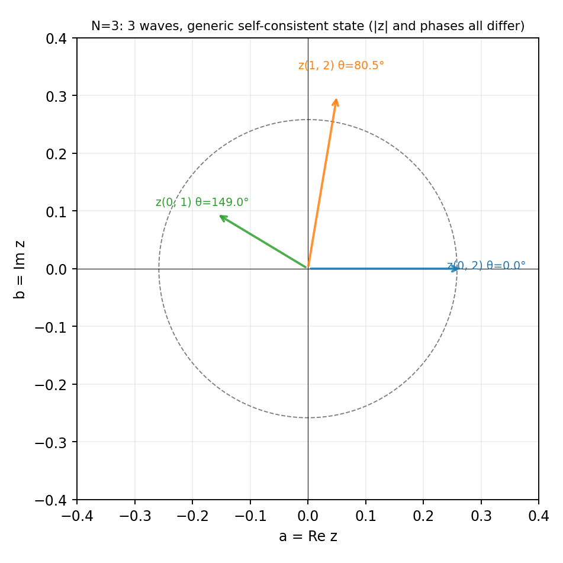

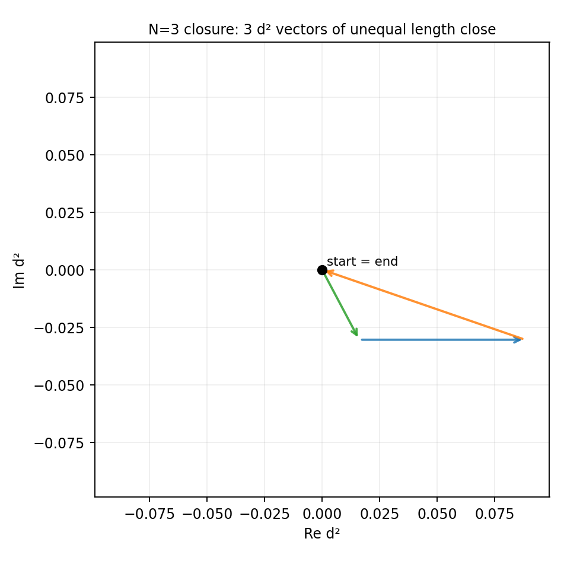

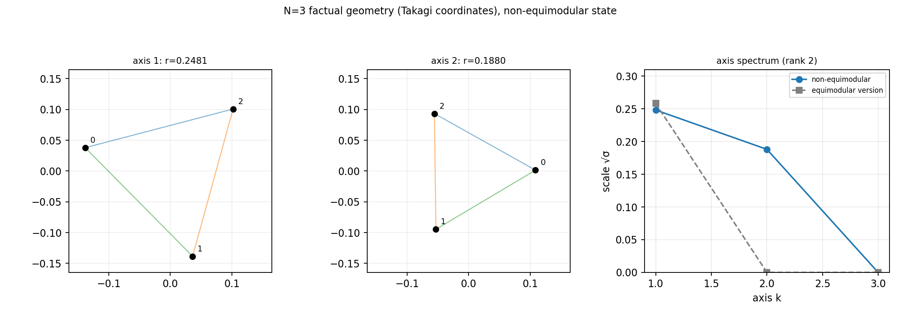

## 3. N=4 の全展開

### 3.0 N=4 の複素シンプレックスの定義

頂点 4 個 {0,…,3}。2 点の組は M = 4×3/2 = 6 個。各組に波 z が 1 個（実数 12 個が状態の全て）。2 乗距離は d² = z²。**N=4 の複素シンプレックスとは、4 頂点とこの 6 個の複素 2 乗距離の組**。

### 3.1 数え上げ（N=4）

| 量 | 値 | 計算 |
|---|---|---|
| 頂点 | 4 | — |
| 波の総数 M | 6 | 4×3/2 |
| 辺 | 4 | 円周の隣どうしの 4 本 |
| 対角線 | 2 | M − N = 6 − 4 |
| 面（三角形） | 4 | C(4,3) |
| 位相の種類 | 4 | §3.2 の構成（等モジュラー版：3） |
| 大きさ \|z\| の種類 | 6 | §3.2（等モジュラー版：1） |
| d² の角度の種類 | 4 | 位相の 2 倍 |
| rank | 3 = N−1 | §3.4 の計算結果（等モジュラー版：3） |

### 3.2 波の値 (a, b) と構成、自己無撞着の検証

**構成（多様体上の代表点）**。等モジュラー版の状態（3 ペアに 0/60/120°）から、自己無撞着写像のヤコビアン核（スケール・全体回転を除いて 5 次元）の固定方向へ 0.3‖v‖ 動かし、Gauss–Newton で F = 0 に戻した状態（§0.2 の選択 (B)）。N=4 では局所閉塞を保ったまま非等モジュラーにする道がない（{S_i=0, W_i 均等} の解集合はスケール分の 1 次元しかない）ので、この状態は**局所閉塞を破る**（§3.4）。
スケールは規約 〈|z|²〉 = r̄² = 1/15（§0.2。‖v‖² = 6r̄² = 2/5、等モジュラー版と同じ）。全組を列挙する：

| 組 | 等モジュラー版のクラス（θ） | θ | \|z\| | a | b |
|---|---|---|---|---|---|
| (0, 1) | 2（120°） | 135.015° | 0.281295744 | -0.198958095 | +0.198854147 |
| (0, 2) | 1（60°） | 61.040° | 0.247370728 | +0.119775543 | +0.216439591 |
| (0, 3) | 0（0°） | 0.000° | 0.276768735 | +0.276768735 | +0.000000000 |
| (1, 2) | 0（0°） | 0.000° | 0.112530782 | +0.112530782 | -0.000000000 |
| (1, 3) | 1（60°） | 61.040° | 0.327136627 | +0.158397752 | +0.286231593 |
| (2, 3) | 2（120°） | 135.015° | 0.251789485 | -0.178088568 | +0.177995524 |

**自己無撞着の検証【定理・実測】**：一般和則（§0.1）を全 6 組で数値検査——実部条件 Σ_f |z_f|² sin²φ の値は全組で 0.200000000（ばらつき 8e-17。= −μ）、虚部条件 |Σ_f |z_f|² sin2φ| ≤ 6e-17。方程式の残差 5.1e-17。よって **μ = -0.200000000** = −(N−1)·r̄² = −1/5——**等モジュラー版と同じ値**（-0.200000000）。
※この状態は等モジュラー点を通る自己無撞着解多様体（次元は §0.2 参照）上の 1 点で、一意性はない。

### 3.3 2 乗距離（組ごと）

| 組 | d² の角度 | \|d²\| = \|z\|² | d² の値 |
|---|---|---|---|
| (0, 1) | 270.030° | 0.079127296 | +0.000041352-0.079127285i |
| (0, 2) | 122.081° | 0.061192277 | -0.032499916+0.051848339i |
| (0, 3) | 0.000° | 0.076600933 | +0.076600933+0.000000000i |
| (1, 2) | 0.000° | 0.012663177 | +0.012663177-0.000000000i |
| (1, 3) | 122.081° | 0.107018373 | -0.056838677+0.090676882i |
| (2, 3) | 270.030° | 0.063397945 | +0.000033132-0.063397936i |

**角度も大きさも組ごとに違う。**

### 3.4 閉塞の判定・B 行列と形

- **大域閉塞【定理・実測】**：自己無撞着（μ≠0）から従う（§0.2 の定理）。実測 |Σz²| = 7e-17。
- **局所閉塞【実測】：破れる**。頂点ごとの |局所和|/r̄² = 0.778、0.684、0.344、0.506（等モジュラー版は全頂点 0）。頂点は複素ヌル錐上に**ない**（|x·x|/r̄² = 0.195、0.171、0.086、0.126）。
- **B = −½JD²J の Takagi 軸【実測・機械精度】**：軸スケールの相異なる値は 0.309989240、0.252456206、0.201622468 （等長でない。相異なる値 3 種）。**等モジュラー版**：0.258198890（丸い）。rank = 3。頂点のエルミート半径：0.235296918、0.230045630、0.222914535、0.206161496。埋め込みの距離再現誤差 max = 8e-17。

### 3.5 N=4 のまとめ（種別）

- 【選択＋実測】多様体上の代表点は自己無撞着（残差 5e-17）。等モジュラーは**使っていない**。
- 【定理・実測】大域閉塞は成立。局所閉塞は**破れる**。
- 【定理】μ = -0.200000000 = −(N−1)·〈|z|²〉：等モジュラー版と同一（μ は平均振幅二乗だけで決まる）。
- 【実測（機械精度）】rank = 3（最大次元）、軸は等長でない（等モジュラー版：丸い）。**等モジュラー版との差は形（Takagi 軸）だけ**、および局所閉塞の破れ。
- 【規約の帰結】大きさに制限はない（スケール対称性）。

### 3.6 補足：等モジュラー版 §3.4 との対応——局所閉塞はなぜ破れるか

等モジュラー版では「各頂点が 3 ペアから 1 本ずつ、角度 0/120/240° の d² を 1 個ずつ持つ」ので局所和 = r²(1+ω+ω²) = 0 だった。大きさを崩すと、各頂点の 3 本の d² は長さが違うので 1+ω+ω² 型の相殺が起こらない。§0.1 の定理は「局所閉塞＋頂点重み均等 ⇒ 自己無撞着」だが、N=4 ではその逆向きの道——局所閉塞を保ったまま非等モジュラーにする——が閉じている：{S_i = 0（実 8 本）, W_i 均等（実 3 本）} の 11 本の拘束は 12 個の実数に対して独立で、解はスケール分の 1 次元、すなわち等モジュラー点しかない【実測：ヤコビアン rank】。一方 F = 0 だけなら解集合は 7 次元（自明 2 を除いて 5）あり、その全てが局所閉塞を破る。

**自己無撞着の頂点形（§0.1 の定理）の数値検証**——局所閉塞が破れていても S_i + S_j は z_e² の実数倍になっている：

- 組 (0, 1)：S_0+S_1 = +0.000008-0.015729i、(2μ+W_0+W_1)·z²/|z|² = +0.000008-0.015729i、差 2e-16
- 組 (0, 2)：S_0+S_2 = +0.024339-0.038829i、(2μ+W_0+W_2)·z²/|z|² = +0.024339-0.038829i、差 3e-17
- 組 (0, 3)：S_0+S_3 = +0.063938-0.000000i、(2μ+W_0+W_3)·z²/|z|² = +0.063938+0.000000i、差 1e-16
- 組 (1, 2)：S_1+S_2 = -0.063938-0.000000i、(2μ+W_1+W_2)·z²/|z|² = -0.063938+0.000000i、差 1e-16
- 組 (1, 3)：S_1+S_3 = -0.024339+0.038829i、(2μ+W_1+W_3)·z²/|z|² = -0.024339+0.038829i、差 6e-17
- 組 (2, 3)：S_2+S_3 = -0.000008+0.015729i、(2μ+W_2+W_3)·z²/|z|² = -0.000008+0.015729i、差 2e-16

頂点重み W_i = 0.216921、0.198809、0.137253、0.247017（等モジュラー版は 4 頂点とも 3r² = 0.2）——均等でない。μ = -0.200000000 は等モジュラー版と同じ −1/5（μ は平均振幅二乗だけで決まる：Σ_i W_i = 2‖v‖² で ‖v‖² を固定しているため）。

### 図（N=4）

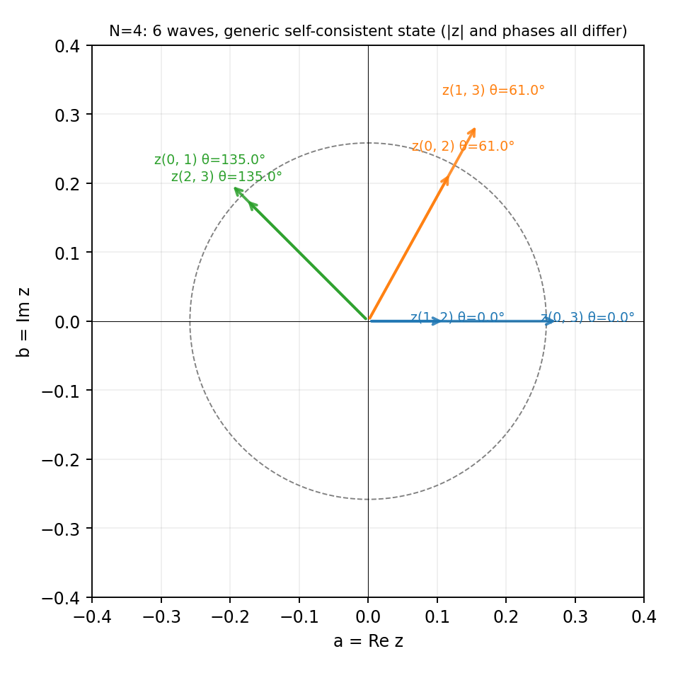

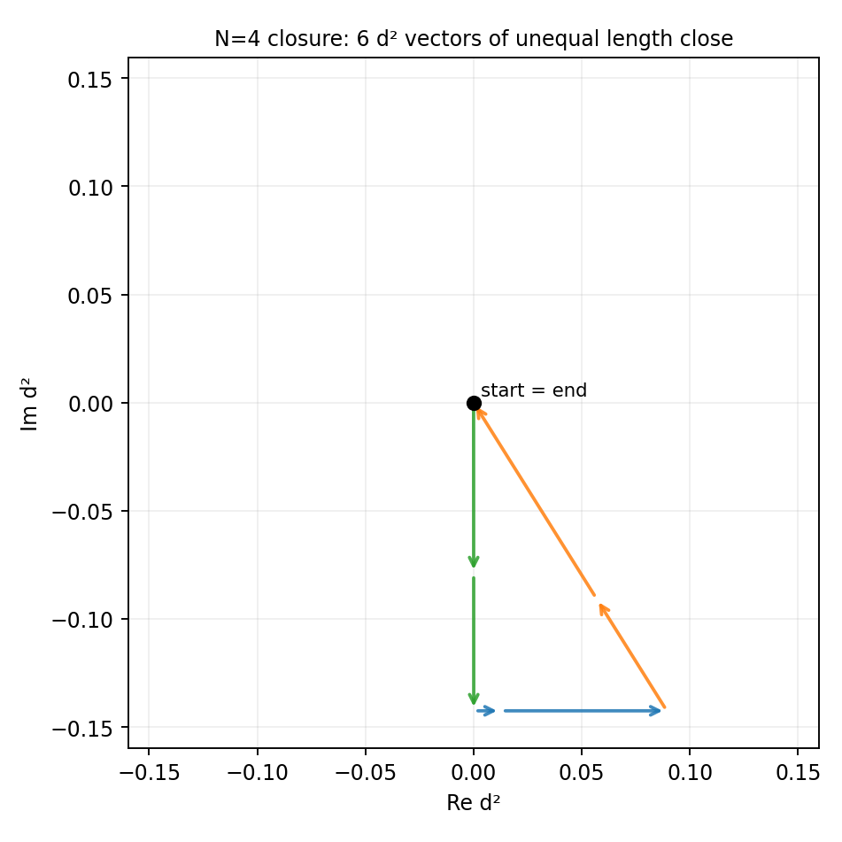

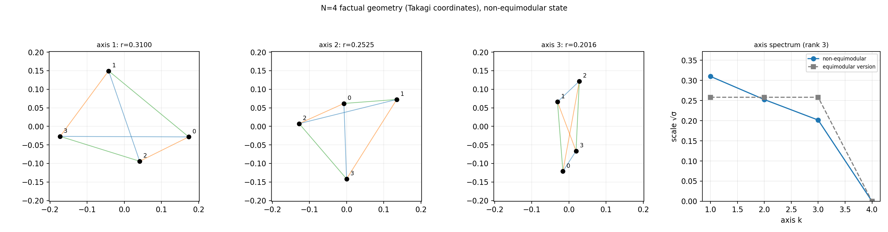

## 4. N=5 の全展開

### 4.0 N=5 の複素シンプレックスの定義

頂点 5 個 {0,…,4}。2 点の組は M = 5×4/2 = 10 個。各組に波 z が 1 個（実数 20 個が状態の全て）。2 乗距離は d² = z²。**N=5 の複素シンプレックスとは、5 頂点とこの 10 個の複素 2 乗距離の組**。

### 4.1 数え上げ（N=5）

| 量 | 値 | 計算 |
|---|---|---|
| 頂点 | 5 | — |
| 波の総数 M | 10 | 5×4/2 |
| 辺 | 5 | 円周の隣どうしの 5 本 |
| 対角線 | 5 | M − N = 10 − 5 |
| 面（三角形） | 10 | C(5,3) |
| 位相の種類 | 10（全組で異なる） | §4.2 の構成（等モジュラー版：2） |
| 大きさ \|z\| の種類 | 10 | §4.2（等モジュラー版：1） |
| d² の角度の種類 | 10 | 位相の 2 倍 |
| rank | 4 = N−1 | §4.4 の計算結果（等モジュラー版：4） |

### 4.2 波の値 (a, b) と構成、自己無撞着の検証

**構成（多様体上の代表点）**。クラス重み付き族（§0.2 (A)）は q = 2 ≤ 3 のため点に退化する（Σ_c a_c ω^c = 0 が a_c 全部等しいを強制）。そこで等モジュラー版の状態から、ヤコビアン核の固定方向へ 0.3‖v‖ 動かし、**局所閉塞 S_i = 0 と頂点重み W_i = Σ_k|z_ik|² の均等**を拘束にした Newton で戻した状態（§0.2 の選択 (B)。§0.1 の定理「局所閉塞＋頂点重み均等 ⇒ 自己無撞着、μ = −W」により自動的に自己無撞着）。
スケールは規約 〈|z|²〉 = r̄² = 1/15（§0.2。‖v‖² = 10r̄² = 2/3、等モジュラー版と同じ）。全組を列挙する：

| 組 | 等モジュラー版のクラス（θ） | θ | \|z\| | a | b |
|---|---|---|---|---|---|
| (0, 1) | 0（0°） | 0.000° | 0.259074638 | +0.259074638 | -0.000000000 |
| (0, 2) | 1（90°） | 74.771° | 0.228280617 | +0.059963560 | +0.220264413 |
| (0, 3) | 1（90°） | 75.998° | 0.270658268 | +0.065485406 | +0.262616754 |
| (0, 4) | 0（0°） | 332.468° | 0.272358332 | +0.241515421 | -0.125894251 |
| (1, 2) | 0（0°） | 321.033° | 0.264464769 | +0.205624767 | -0.166313166 |
| (1, 3) | 1（90°） | 90.791° | 0.233701636 | -0.003224553 | +0.233679389 |
| (1, 4) | 1（90°） | 55.611° | 0.273841067 | +0.154666489 | +0.225980546 |
| (2, 3) | 0（0°） | 3.146° | 0.288017926 | +0.287583766 | +0.015808314 |
| (2, 4) | 1（90°） | 73.883° | 0.248311674 | +0.068932847 | +0.238551776 |
| (3, 4) | 0（0°） | 335.627° | 0.236304864 | +0.215244453 | -0.097518275 |

**自己無撞着の検証【定理・実測】**：一般和則（§0.1）を全 10 組で数値検査——実部条件 Σ_f |z_f|² sin²φ の値は全組で 0.266666667（ばらつき 1e-16。= −μ）、虚部条件 |Σ_f |z_f|² sin2φ| ≤ 3e-17。方程式の残差 5.2e-17。よって **μ = -0.266666667** = −(N−1)·r̄² = −4/15——**等モジュラー版と同じ値**（-0.266666667）。
※この状態は等モジュラー点を通る自己無撞着解多様体（次元は §0.2 参照）上の 1 点で、一意性はない。

**特記**：等モジュラー版では位相が 0°/90° で d² が全て実数（実の擬ユークリッド空間 R^{2,2} に置けた）が、この状態では位相が 10 種類に散り、d² は複素になる（max|Im d²| = 0.070）。**実埋め込みは等モジュラー点だけの性質**である。

### 4.3 2 乗距離（組ごと）

| 組 | d² の角度 | \|d²\| = \|z\|² | d² の値 |
|---|---|---|---|
| (0, 1) | 0.000° | 0.067119668 | +0.067119668-0.000000000i |
| (0, 2) | 149.542° | 0.052112040 | -0.044920783+0.026415676i |
| (0, 3) | 151.997° | 0.073255898 | -0.064679221+0.034395130i |
| (0, 4) | 304.937° | 0.074179061 | +0.042480336-0.060810806i |
| (1, 2) | 282.067° | 0.069941614 | +0.014621476-0.068396212i |
| (1, 3) | 181.581° | 0.054616455 | -0.054595659-0.001507023i |
| (1, 4) | 111.223° | 0.074988930 | -0.027145484+0.069903235i |
| (2, 3) | 6.293° | 0.082954325 | +0.082454520+0.009092429i |
| (2, 4) | 147.765° | 0.061658687 | -0.052155212+0.032888106i |
| (3, 4) | 311.253° | 0.055839989 | +0.036820361-0.041980536i |

**角度も大きさも組ごとに違う。**

### 4.4 閉塞の判定・B 行列と形

- **大域閉塞【定理・実測】**：自己無撞着（μ≠0）から従う（§0.2 の定理）。実測 |Σz²| = 3e-17。
- **局所閉塞【選択＋実測】**：拘束に入れた分枝を選んだので成立。実測 max|局所和| = 3e-17。よって**全頂点が複素ヌル錐上**（埋め込みで max|x·x| = 7e-17）。
- **B = −½JD²J の Takagi 軸【実測・機械精度】**：軸スケールの相異なる値は 0.320491716、0.284042754、0.249245638、0.205274423 （等長でない。相異なる値 4 種）。**等モジュラー版**：0.273012086（丸い）。rank = 4。頂点のエルミート半径：0.242070265、0.241880965、0.239524120、0.238877493、0.236891384。埋め込みの距離再現誤差 max = 2e-16。

### 4.5 N=5 のまとめ（種別）

- 【選択＋実測】多様体上の代表点は自己無撞着（残差 5e-17）。等モジュラーは**使っていない**。
- 【定理・実測】大域閉塞は成立。局所閉塞は成立（全頂点が複素ヌル錐上）。
- 【定理】μ = -0.266666667 = −(N−1)·〈|z|²〉：等モジュラー版と同一（μ は平均振幅二乗だけで決まる）。
- 【実測（機械精度）】rank = 4（最大次元）、軸は等長でない（等モジュラー版：丸い）。**等モジュラー版との差は形（Takagi 軸）だけ**。
- 【規約の帰結】大きさに制限はない（スケール対称性）。

### 図（N=5）

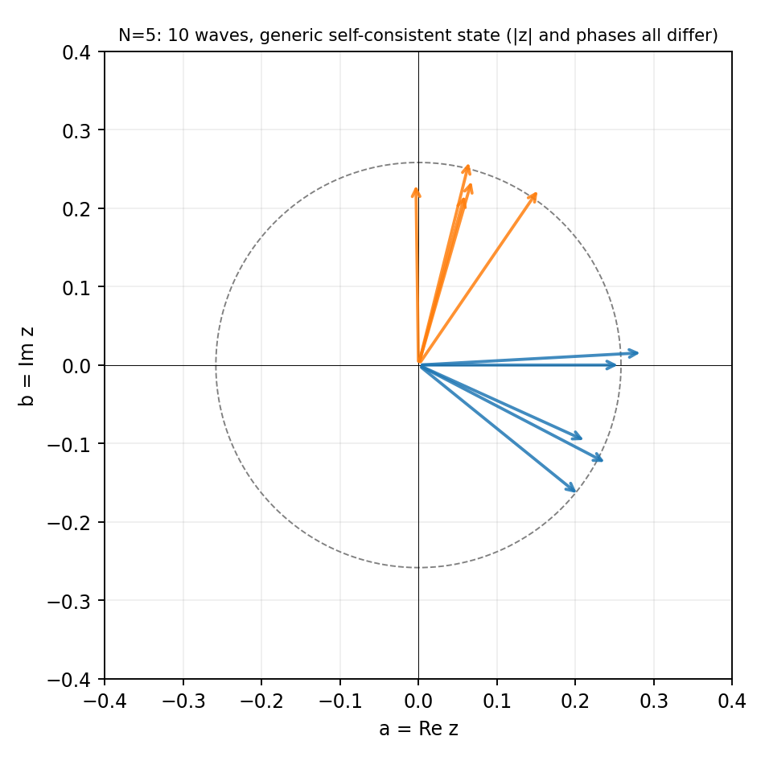

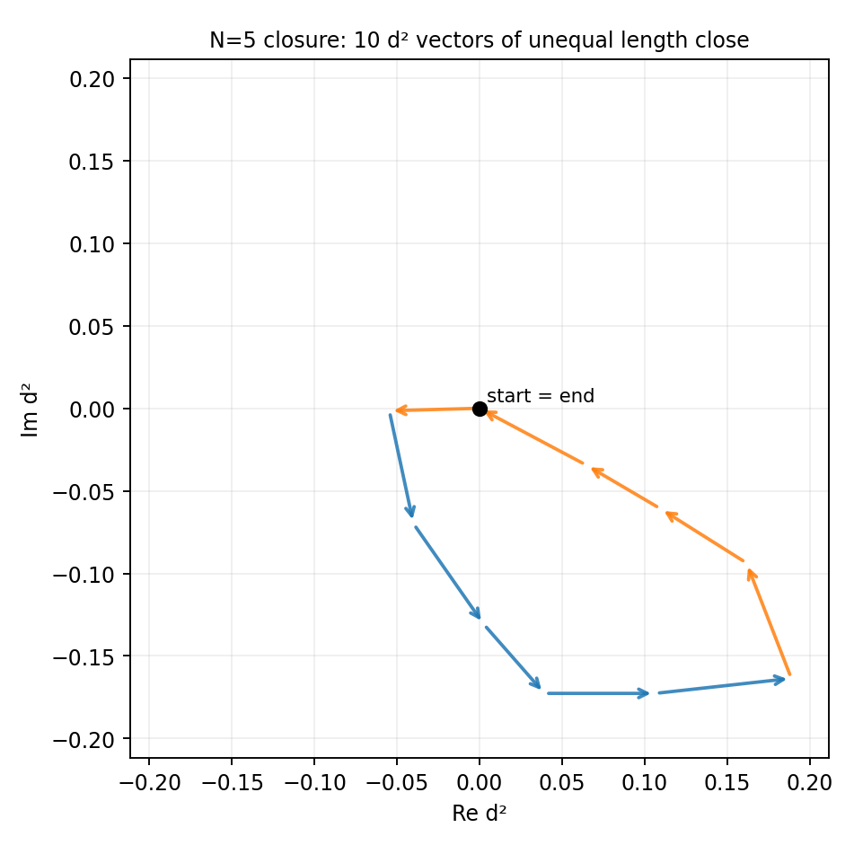

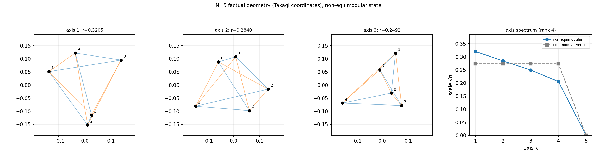

### 4.6 補足：等モジュラー版 §4.6（実の擬ユークリッド空間）との対応

等モジュラー版の N=5 は位相が 0°/90° の 2 種類しかなく d² が全て実数（+r² と −r²）で、R^{2,2} に実埋め込みできた（5 頂点が巻き数 1:2 のトーラス閉曲線に等間隔）。本節の代表点は局所閉塞・頂点重み均等・μ・rank を全て保ったまま、位相が 10 種類に散り d² は複素になる。**実埋め込み（光円錐・トーラス）は N=5 の性質ではなく、等モジュラー点の性質**である【実測】。複素ヌル錐上にあること（x·x = 0）だけが残る。

## 5. N=6 の全展開

### 5.0 N=6 の複素シンプレックスの定義

頂点 6 個 {0,…,5}。2 点の組は M = 6×5/2 = 15 個。各組に波 z が 1 個（実数 30 個が状態の全て）。2 乗距離は d² = z²。**N=6 の複素シンプレックスとは、6 頂点とこの 15 個の複素 2 乗距離の組**。

### 5.1 数え上げ（N=6）

| 量 | 値 | 計算 |
|---|---|---|
| 頂点 | 6 | — |
| 波の総数 M | 15 | 6×5/2 |
| 辺 | 6 | 円周の隣どうしの 6 本 |
| 対角線 | 9 | M − N = 15 − 6 |
| 面（三角形） | 20 | C(6,3) |
| 位相の種類 | 5（θ = k×36°） | §5.2 の構成（等モジュラー版：5） |
| 大きさ \|z\| の種類 | 3 | §5.2（等モジュラー版：1） |
| d² の角度の種類 | 5 | 位相の 2 倍 |
| rank | 5 = N−1 | §5.4 の計算結果（等モジュラー版：5） |

### 5.2 波の値 (a, b) と構成、自己無撞着の検証

**構成（偶数 N の設計＝完全マッチング分解、位相は等モジュラー版と同一）**。6 人で全員に相手がいるペアの組ませ方（完全マッチング、1 組 3 本）が、ちょうど 5 セットで全 15 組を重複なく覆う。セット（色）c = 0..4 の波に位相 θ = c×36°（= c×180°/5）を与える。各頂点はどの色の波もちょうど 1 本ずつ持つ。
**振幅（等モジュラー版との唯一の違い）**。クラス c の振幅二乗を a_c = r̄²(1 + 0.6·cos(4πc/5))、r̄² = 1/15 とする（§0.2 の選択 (A)）。値は a_0 = 0.106666667、a_1 = 0.034305987、a_2 = 0.079027346、a_3 = 0.079027346、a_4 = 0.034305987（平均は r̄² = 1/15 = 0.066666667、‖v‖² = 15r̄² = 1 で等モジュラー版と同じ）。

**この振幅が自己無撞着を保つ理由（導出）**。組 e（クラス c）から見て他の各クラス c′ に隣接組が 2 本、同じクラスの隣接組は位相差 0 で寄与しない。一般和則（§0.1）に代入し、実部条件と虚部条件を 1 本の複素条件にまとめると ω^{−c}·Σ_{c′} a_{c′} ω^{c′} = Σ_{c′} a_{c′} + μ/1（全ての c で同じ実数）。q = 5 ≥ 3 でこれが全 c について実になるのは **Σ_c a_c ω^c = 0** のときだけで、そのとき μ = −1·Σ_c a_c = −(N−1)·r̄²。a_c = r̄²(1+0.6cos(4πc/q)) は三角和の直交性で Σ_c a_c ω^c = 0 を厳密に満たす（実測 |Σ a_c ω^c| = 3e-17）。つまり**必要なのは「振幅二乗を重みとした 1 の 5 乗根の重心が原点」であって、振幅が等しいことではない**。
スケールは規約 〈|z|²〉 = r̄² = 1/15（§0.2。‖v‖² = 15r̄² = 1、等モジュラー版と同じ）。同じクラスの波は同じ (a, b) を持つので、クラスごとに列挙する：

| クラス | θ | a_c = \|z\|² | \|z\| | a | b | 本数 | 所属する組 |
|---|---|---|---|---|---|---|---|
| 0 | 0° | 0.106666667 | 0.326598632 | +0.326598632 | +0.000000000 | 3 | (0,5) (1,4) (2,3) |
| 1 | 36° | 0.034305987 | 0.185218754 | +0.149845120 | +0.108868852 | 3 | (0,2) (1,5) (3,4) |
| 2 | 72° | 0.079027346 | 0.281118029 | +0.086870249 | +0.267359134 | 3 | (0,4) (1,3) (2,5) |
| 3 | 108° | 0.079027346 | 0.281118029 | -0.086870249 | +0.267359134 | 3 | (0,1) (2,4) (3,5) |
| 4 | 144° | 0.034305987 | 0.185218754 | -0.149845120 | +0.108868852 | 3 | (0,3) (1,2) (4,5) |

**自己無撞着の検証【定理・実測】**：一般和則（§0.1）を全 15 組で数値検査——実部条件 Σ_f |z_f|² sin²φ の値は全組で 0.333333333（ばらつき 1e-16。= −μ）、虚部条件 |Σ_f |z_f|² sin2φ| ≤ 5e-17。方程式の残差 4.4e-17。よって **μ = -0.333333333** = −(N−1)·r̄² = −1/3——**等モジュラー版と同じ値**（-0.333333333）。
※この族は q−3 = 2 個の実パラメータを持つ連続族で、等モジュラー版はその 1 点（ε=0）である。

### 5.3 2 乗距離（クラスごと）

| クラス | d² の角度 | \|d²\| = a_c | d² の値 |
|---|---|---|---|
| 0 | 0° | 0.106666667 | +0.106666667+0.000000000i |
| 1 | 72° | 0.034305987 | +0.010601133+0.032626932i |
| 2 | 144° | 0.079027346 | -0.063934466+0.046451109i |
| 3 | 216° | 0.079027346 | -0.063934466-0.046451109i |
| 4 | 288° | 0.034305987 | +0.010601133-0.032626932i |

**角度は等モジュラー版と同じ、大きさ |d²| = a_c がクラスごとに違う。**

### 5.4 閉塞の判定・B 行列と形

- **大域閉塞【定理・実測】**：全体では各色が 3 本ずつ → 3×Σ_c a_c ω^c = 0。実測 |Σz²| = 8e-17。
- **局所閉塞【定理・実測】**：各頂点は 5 色を 1 本ずつ持つ。d² は色 c で a_c·ω^c（ω = e^{i·360°/5}）なので局所和 = Σ_c a_c ω^c = 0（§5.2 の条件そのもの）。実測 max|局所和| = 3e-17。よって**全頂点が複素ヌル錐上**（埋め込みで max|x·x| = 5e-17）。
- **B = −½JD²J の Takagi 軸【実測・機械精度】**：軸スケールの相異なる値は 0.371812753、0.306576821、0.296435617、0.244655116、0.095484092 （等長でない。相異なる値 5 種）。**等モジュラー版**：0.365148372、0.285744043、0.182574186（相異なる値 3 種）。rank = 5。頂点のエルミート半径：0.269358593、0.258237827、0.248783059、0.246232483。埋め込みの距離再現誤差 max = 1e-16。

### 5.5 N=6 のまとめ（種別）

- 【選択＋実測】クラス重み付き（振幅二乗 a_c = r̄²(1+0.6cos(4πc/q))）の状態は自己無撞着（残差 4e-17）。等モジュラーは**使っていない**。
- 【定理・実測】大域閉塞は成立。局所閉塞は成立（全頂点が複素ヌル錐上）。
- 【定理】μ = -0.333333333 = −(N−1)·〈|z|²〉：等モジュラー版と同一（μ は平均振幅二乗だけで決まる）。
- 【実測（機械精度）】rank = 5（最大次元）、軸は等長でない（等モジュラー版：相異なる値 3 種）。**等モジュラー版との差は形（Takagi 軸）だけ**。
- 【規約の帰結】大きさに制限はない（スケール対称性）。

### 図（N=6）

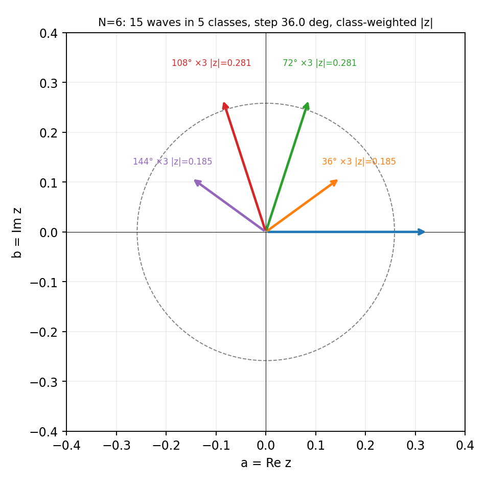

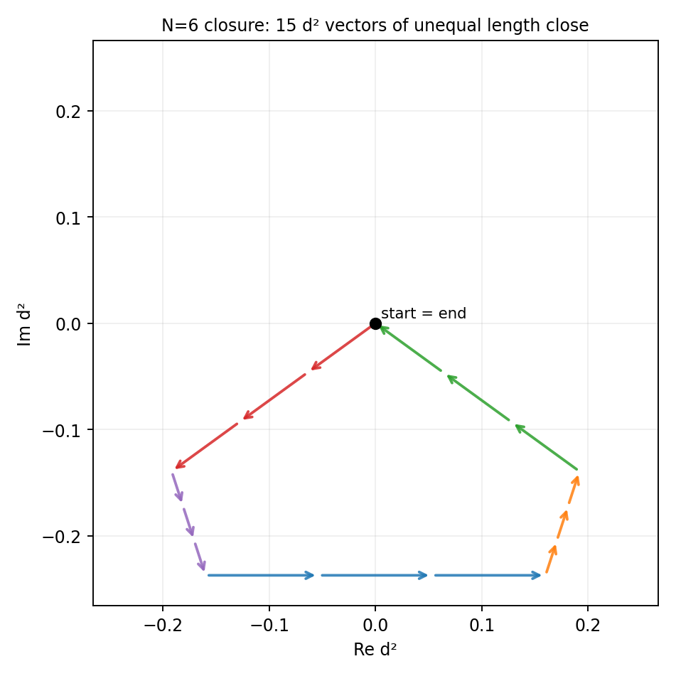

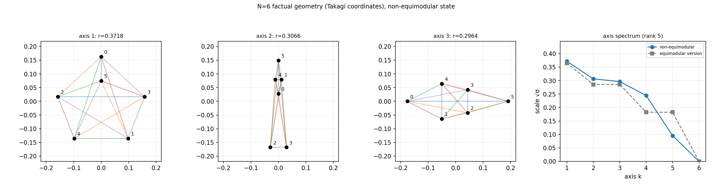

## 6. N=7 の全展開

### 6.0 N=7 の複素シンプレックスの定義

頂点 7 個 {0,…,6}。2 点の組は M = 7×6/2 = 21 個。各組に波 z が 1 個（実数 42 個が状態の全て）。2 乗距離は d² = z²。**N=7 の複素シンプレックスとは、7 頂点とこの 21 個の複素 2 乗距離の組**。

### 6.1 数え上げ（N=7）

| 量 | 値 | 計算 |
|---|---|---|
| 頂点 | 7 | — |
| 波の総数 M | 21 | 7×6/2 |
| 辺 | 7 | 円周の隣どうしの 7 本 |
| 対角線 | 14 | M − N = 21 − 7 |
| 面（三角形） | 35 | C(7,3) |
| 位相の種類 | 21（全組で異なる） | §6.2 の構成（等モジュラー版：3） |
| 大きさ \|z\| の種類 | 21 | §6.2（等モジュラー版：1） |
| d² の角度の種類 | 21 | 位相の 2 倍 |
| rank | 6 = N−1 | §6.4 の計算結果（等モジュラー版：6） |

### 6.2 波の値 (a, b) と構成、自己無撞着の検証

**構成（多様体上の代表点）**。クラス重み付き族（§0.2 (A)）は q = 3 ≤ 3 のため点に退化する（Σ_c a_c ω^c = 0 が a_c 全部等しいを強制）。そこで等モジュラー版の状態から、ヤコビアン核の固定方向へ 0.3‖v‖ 動かし、**局所閉塞 S_i = 0 と頂点重み W_i = Σ_k|z_ik|² の均等**を拘束にした Newton で戻した状態（§0.2 の選択 (B)。§0.1 の定理「局所閉塞＋頂点重み均等 ⇒ 自己無撞着、μ = −W」により自動的に自己無撞着）。
スケールは規約 〈|z|²〉 = r̄² = 1/15（§0.2。‖v‖² = 21r̄² = 7/5、等モジュラー版と同じ）。全組を列挙する：

| 組 | 等モジュラー版のクラス（θ） | θ | \|z\| | a | b |
|---|---|---|---|---|---|
| (0, 1) | 0（0°） | 0.000° | 0.201627089 | +0.201627089 | -0.000000000 |
| (0, 2) | 1（60°） | 45.585° | 0.246707075 | +0.172658912 | +0.176219412 |
| (0, 3) | 2（120°） | 112.636° | 0.217848633 | -0.083845409 | +0.201067089 |
| (0, 4) | 2（120°） | 130.293° | 0.319741594 | -0.206776513 | +0.243881448 |
| (0, 5) | 1（60°） | 65.302° | 0.288305314 | +0.120462986 | +0.261932478 |
| (0, 6) | 0（0°） | 4.652° | 0.256260547 | +0.255416341 | +0.020783665 |
| (1, 2) | 0（0°） | 343.106° | 0.243914272 | +0.233388066 | -0.070881468 |
| (1, 3) | 1（60°） | 75.665° | 0.306291297 | +0.075835917 | +0.296754566 |
| (1, 4) | 2（120°） | 97.872° | 0.155044025 | -0.021234480 | +0.153583028 |
| (1, 5) | 2（120°） | 140.730° | 0.307585975 | -0.238122929 | +0.194696180 |
| (1, 6) | 1（60°） | 46.130° | 0.295618343 | +0.204870712 | +0.213115452 |
| (2, 3) | 0（0°） | 358.598° | 0.285435146 | +0.285349660 | -0.006985272 |
| (2, 4) | 1（60°） | 59.100° | 0.263115145 | +0.135119661 | +0.225770363 |
| (2, 5) | 2（120°） | 108.517° | 0.220240465 | -0.069943959 | +0.208838946 |
| (2, 6) | 2（120°） | 111.854° | 0.283606738 | -0.105569890 | +0.263225721 |
| (3, 4) | 0（0°） | 10.739° | 0.245123412 | +0.240830462 | +0.045674677 |
| (3, 5) | 1（60°） | 72.220° | 0.230575020 | +0.070408483 | +0.219562031 |
| (3, 6) | 2（120°） | 144.896° | 0.252990245 | -0.206972864 | +0.145486418 |
| (4, 5) | 0（0°） | 6.114° | 0.285051159 | +0.283429752 | +0.030360156 |
| (4, 6) | 1（60°） | 86.746° | 0.251311427 | +0.014265774 | +0.250906199 |
| (5, 6) | 0（0°） | 7.892° | 0.198358383 | +0.196479525 | +0.027236822 |

**自己無撞着の検証【定理・実測】**：一般和則（§0.1）を全 21 組で数値検査——実部条件 Σ_f |z_f|² sin²φ の値は全組で 0.400000000（ばらつき 2e-16。= −μ）、虚部条件 |Σ_f |z_f|² sin2φ| ≤ 1e-16。方程式の残差 7.3e-17。よって **μ = -0.400000000** = −(N−1)·r̄² = −2/5——**等モジュラー版と同じ値**（-0.400000000）。
※この状態は等モジュラー点を通る自己無撞着解多様体（次元は §0.2 参照）上の 1 点で、一意性はない。

### 6.3 2 乗距離（組ごと）

| 組 | d² の角度 | \|d²\| = \|z\|² | d² の値 |
|---|---|---|---|
| (0, 1) | 0.000° | 0.040653483 | +0.040653483-0.000000000i |
| (0, 2) | 91.169° | 0.060864381 | -0.001242181+0.060851704i |
| (0, 3) | 225.272° | 0.047458027 | -0.033397922-0.033717105i |
| (0, 4) | 260.586° | 0.102234687 | -0.016721634-0.100857911i |
| (0, 5) | 130.605° | 0.083119954 | -0.054097292+0.063106337i |
| (0, 6) | 9.304° | 0.065669468 | +0.064805547+0.010616975i |
| (1, 2) | 326.212° | 0.059494172 | +0.049445807-0.033085777i |
| (1, 3) | 151.330° | 0.093814359 | -0.082312186+0.045009310i |
| (1, 4) | 195.744° | 0.024038650 | -0.023136843-0.006522511i |
| (1, 5) | 281.459° | 0.094609132 | +0.018795927-0.092723249i |
| (1, 6) | 92.260° | 0.087390205 | -0.003446187+0.087322229i |
| (2, 3) | 357.195° | 0.081473223 | +0.081375635-0.003986490i |
| (2, 4) | 118.200° | 0.069229580 | -0.032714934+0.061012030i |
| (2, 5) | 217.033° | 0.048505863 | -0.038721548-0.029214045i |
| (2, 6) | 223.708° | 0.080432782 | -0.058142779-0.055577421i |
| (3, 4) | 21.478° | 0.060085487 | +0.055913135+0.021999707i |
| (3, 5) | 144.440° | 0.053164840 | -0.043250131+0.030918059i |
| (3, 6) | 289.791° | 0.064004064 | +0.021671469-0.060223481i |
| (4, 5) | 12.228° | 0.081254163 | +0.079410685+0.017209943i |
| (4, 6) | 173.492° | 0.063157433 | -0.062750409+0.007158742i |
| (5, 6) | 15.785° | 0.039346048 | +0.037862359+0.010702956i |

**角度も大きさも組ごとに違う。**

### 6.4 閉塞の判定・B 行列と形

- **大域閉塞【定理・実測】**：自己無撞着（μ≠0）から従う（§0.2 の定理）。実測 |Σz²| = 7e-17。
- **局所閉塞【選択＋実測】**：拘束に入れた分枝を選んだので成立。実測 max|局所和| = 7e-17。よって**全頂点が複素ヌル錐上**（埋め込みで max|x·x| = 1e-16）。
- **B = −½JD²J の Takagi 軸【実測・機械精度】**：軸スケールの相異なる値は 0.342999844、0.318811079、0.315382259、0.301271597、0.278912612、0.223650202 （等長でない。相異なる値 6 種）。**等モジュラー版**：0.296970891（丸い）。rank = 6。頂点のエルミート半径：0.282514619、0.280110607、0.279527246、0.276245399、0.275373213、0.274176568、0.271302301。埋め込みの距離再現誤差 max = 2e-16。

### 6.5 N=7 のまとめ（種別）

- 【選択＋実測】多様体上の代表点は自己無撞着（残差 7e-17）。等モジュラーは**使っていない**。
- 【定理・実測】大域閉塞は成立。局所閉塞は成立（全頂点が複素ヌル錐上）。
- 【定理】μ = -0.400000000 = −(N−1)·〈|z|²〉：等モジュラー版と同一（μ は平均振幅二乗だけで決まる）。
- 【実測（機械精度）】rank = 6（最大次元）、軸は等長でない（等モジュラー版：丸い）。**等モジュラー版との差は形（Takagi 軸）だけ**。
- 【規約の帰結】大きさに制限はない（スケール対称性）。

### 図（N=7）

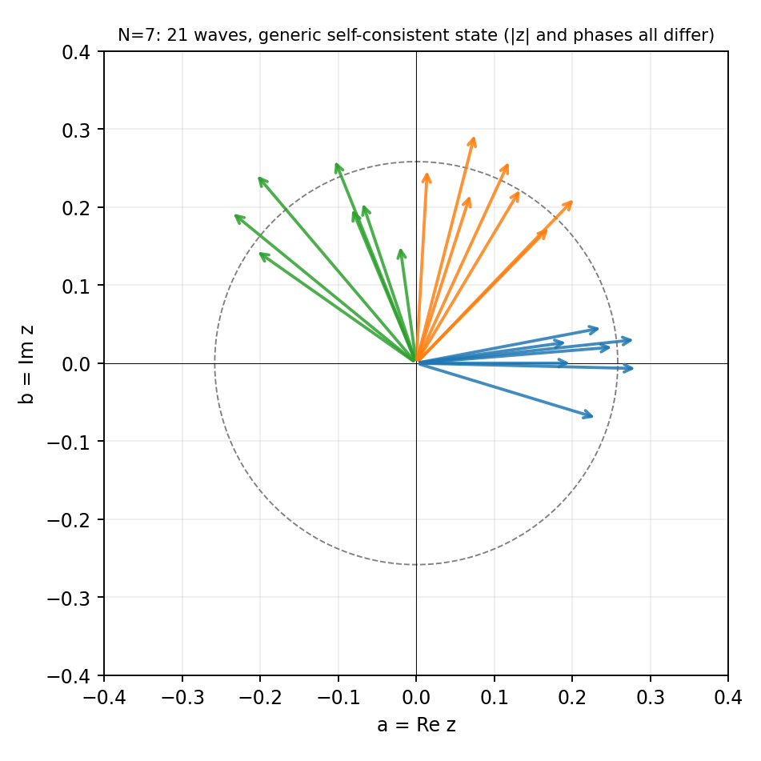

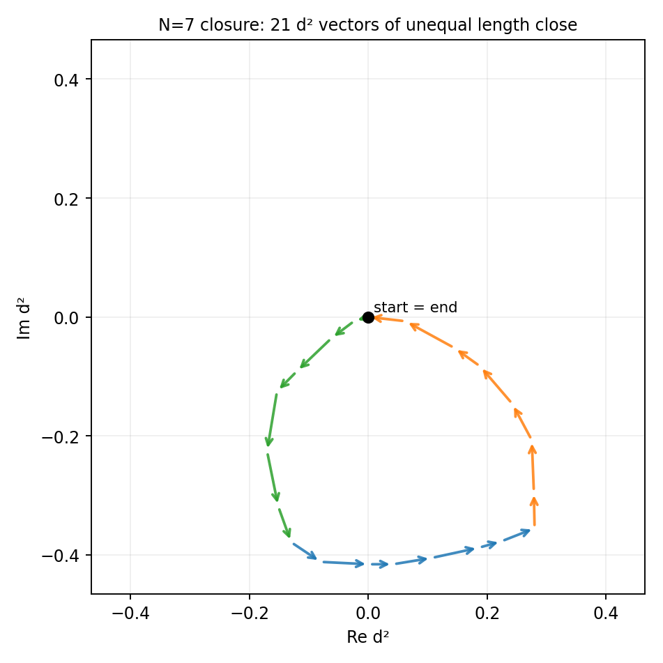

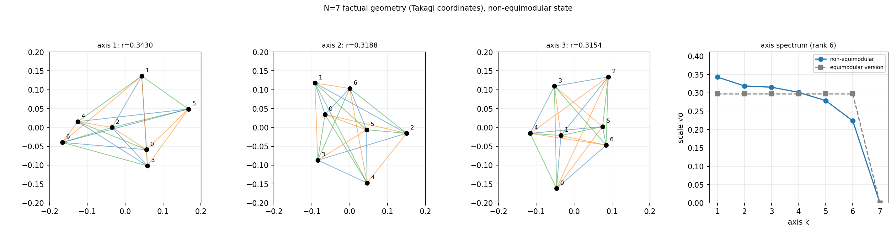

## 7. N=8 の全展開

### 7.0 N=8 の複素シンプレックスの定義

頂点 8 個 {0,…,7}。2 点の組は M = 8×7/2 = 28 個。各組に波 z が 1 個（実数 56 個が状態の全て）。2 乗距離は d² = z²。**N=8 の複素シンプレックスとは、8 頂点とこの 28 個の複素 2 乗距離の組**。

### 7.1 数え上げ（N=8）

| 量 | 値 | 計算 |
|---|---|---|
| 頂点 | 8 | — |
| 波の総数 M | 28 | 8×7/2 |
| 辺 | 8 | 円周の隣どうしの 8 本 |
| 対角線 | 20 | M − N = 28 − 8 |
| 面（三角形） | 56 | C(8,3) |
| 位相の種類 | 7（θ = k×25.7143°） | §7.2 の構成（等モジュラー版：7） |
| 大きさ \|z\| の種類 | 4 | §7.2（等モジュラー版：1） |
| d² の角度の種類 | 7 | 位相の 2 倍 |
| rank | 7 = N−1 | §7.4 の計算結果（等モジュラー版：7） |

### 7.2 波の値 (a, b) と構成、自己無撞着の検証

**構成（偶数 N の設計＝完全マッチング分解、位相は等モジュラー版と同一）**。8 人で全員に相手がいるペアの組ませ方（完全マッチング、1 組 4 本）が、ちょうど 7 セットで全 28 組を重複なく覆う。セット（色）c = 0..6 の波に位相 θ = c×25.7143°（= c×180°/7）を与える。各頂点はどの色の波もちょうど 1 本ずつ持つ。
**振幅（等モジュラー版との唯一の違い）**。クラス c の振幅二乗を a_c = r̄²(1 + 0.6·cos(4πc/7))、r̄² = 1/15 とする（§0.2 の選択 (A)）。値は a_0 = 0.106666667、a_1 = 0.057765829、a_2 = 0.030627912、a_3 = 0.091606259、a_4 = 0.091606259、a_5 = 0.030627912、a_6 = 0.057765829（平均は r̄² = 1/15 = 0.066666667、‖v‖² = 28r̄² = 28/15 で等モジュラー版と同じ）。

**この振幅が自己無撞着を保つ理由（導出）**。組 e（クラス c）から見て他の各クラス c′ に隣接組が 2 本、同じクラスの隣接組は位相差 0 で寄与しない。一般和則（§0.1）に代入し、実部条件と虚部条件を 1 本の複素条件にまとめると ω^{−c}·Σ_{c′} a_{c′} ω^{c′} = Σ_{c′} a_{c′} + μ/1（全ての c で同じ実数）。q = 7 ≥ 3 でこれが全 c について実になるのは **Σ_c a_c ω^c = 0** のときだけで、そのとき μ = −1·Σ_c a_c = −(N−1)·r̄²。a_c = r̄²(1+0.6cos(4πc/q)) は三角和の直交性で Σ_c a_c ω^c = 0 を厳密に満たす（実測 |Σ a_c ω^c| = 6e-17）。つまり**必要なのは「振幅二乗を重みとした 1 の 7 乗根の重心が原点」であって、振幅が等しいことではない**。
スケールは規約 〈|z|²〉 = r̄² = 1/15（§0.2。‖v‖² = 28r̄² = 28/15、等モジュラー版と同じ）。同じクラスの波は同じ (a, b) を持つので、クラスごとに列挙する：

| クラス | θ | a_c = \|z\|² | \|z\| | a | b | 本数 | 所属する組 |
|---|---|---|---|---|---|---|---|
| 0 | 0° | 0.106666667 | 0.326598632 | +0.326598632 | +0.000000000 | 4 | (0,7) (1,6) (2,5) (3,4) |
| 1 | 25.7143° | 0.057765829 | 0.240345229 | +0.216543569 | +0.104281887 | 4 | (0,2) (1,7) (3,6) (4,5) |
| 2 | 51.4286° | 0.030627912 | 0.175008320 | +0.109115903 | +0.136827014 | 4 | (0,4) (1,3) (2,7) (5,6) |
| 3 | 77.1429° | 0.091606259 | 0.302665259 | +0.067349356 | +0.295076809 | 4 | (0,6) (1,5) (2,4) (3,7) |
| 4 | 102.857° | 0.091606259 | 0.302665259 | -0.067349356 | +0.295076809 | 4 | (0,1) (2,6) (3,5) (4,7) |
| 5 | 128.571° | 0.030627912 | 0.175008320 | -0.109115903 | +0.136827014 | 4 | (0,3) (1,2) (4,6) (5,7) |
| 6 | 154.286° | 0.057765829 | 0.240345229 | -0.216543569 | +0.104281887 | 4 | (0,5) (1,4) (2,3) (6,7) |

**自己無撞着の検証【定理・実測】**：一般和則（§0.1）を全 28 組で数値検査——実部条件 Σ_f |z_f|² sin²φ の値は全組で 0.466666667（ばらつき 2e-16。= −μ）、虚部条件 |Σ_f |z_f|² sin2φ| ≤ 2e-16。方程式の残差 5.3e-17。よって **μ = -0.466666667** = −(N−1)·r̄² = −7/15——**等モジュラー版と同じ値**（-0.466666667）。
※この族は q−3 = 4 個の実パラメータを持つ連続族で、等モジュラー版はその 1 点（ε=0）である。

### 7.3 2 乗距離（クラスごと）

| クラス | d² の角度 | \|d²\| = a_c | d² の値 |
|---|---|---|---|
| 0 | 0° | 0.106666667 | +0.106666667+0.000000000i |
| 1 | 51.4286° | 0.057765829 | +0.036016405+0.045163144i |
| 2 | 102.857° | 0.030627912 | -0.006815352+0.029860006i |
| 3 | 154.286° | 0.091606259 | -0.082534387+0.039746466i |
| 4 | 205.714° | 0.091606259 | -0.082534387-0.039746466i |
| 5 | 257.143° | 0.030627912 | -0.006815352-0.029860006i |
| 6 | 308.571° | 0.057765829 | +0.036016405-0.045163144i |

**角度は等モジュラー版と同じ、大きさ |d²| = a_c がクラスごとに違う。**

### 7.4 閉塞の判定・B 行列と形

- **大域閉塞【定理・実測】**：全体では各色が 4 本ずつ → 4×Σ_c a_c ω^c = 0。実測 |Σz²| = 1e-16。
- **局所閉塞【定理・実測】**：各頂点は 7 色を 1 本ずつ持つ。d² は色 c で a_c·ω^c（ω = e^{i·360°/7}）なので局所和 = Σ_c a_c ω^c = 0（§7.2 の条件そのもの）。実測 max|局所和| = 3e-17。よって**全頂点が複素ヌル錐上**（埋め込みで max|x·x| = 5e-17）。
- **B = −½JD²J の Takagi 軸【実測・機械精度】**：軸スケールの相異なる値は 0.448176121、0.341563488、0.321844459、0.281155894、0.172195925、0.172051556、0.164491536 （等長でない。相異なる値 7 種）。**等モジュラー版**：0.447213595、0.307051957、0.182574186（相異なる値 3 種）。rank = 7。頂点のエルミート半径：0.296585466、0.272225527、0.266762926、0.265908668、0.265199125。埋め込みの距離再現誤差 max = 1e-16。

### 7.5 N=8 のまとめ（種別）

- 【選択＋実測】クラス重み付き（振幅二乗 a_c = r̄²(1+0.6cos(4πc/q))）の状態は自己無撞着（残差 5e-17）。等モジュラーは**使っていない**。
- 【定理・実測】大域閉塞は成立。局所閉塞は成立（全頂点が複素ヌル錐上）。
- 【定理】μ = -0.466666667 = −(N−1)·〈|z|²〉：等モジュラー版と同一（μ は平均振幅二乗だけで決まる）。
- 【実測（機械精度）】rank = 7（最大次元）、軸は等長でない（等モジュラー版：相異なる値 3 種）。**等モジュラー版との差は形（Takagi 軸）だけ**。
- 【規約の帰結】大きさに制限はない（スケール対称性）。

### 図（N=8）

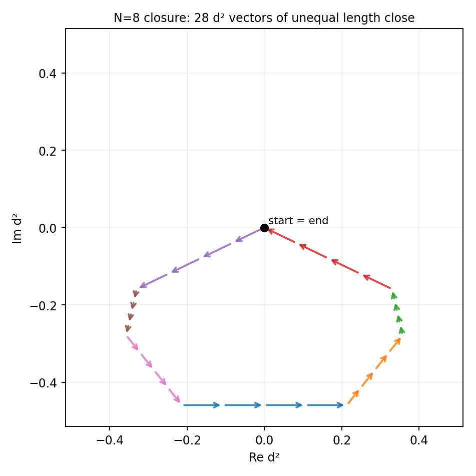

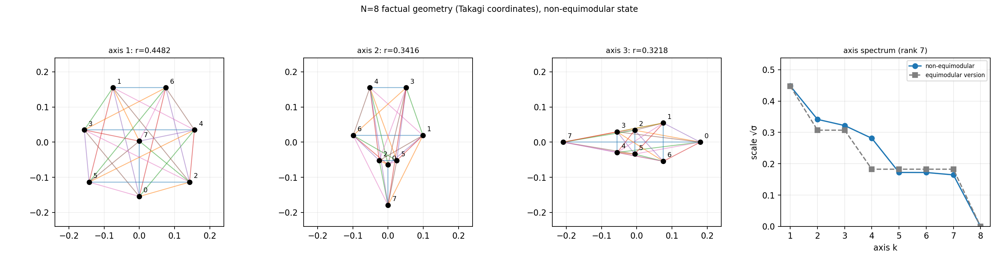

## 8. N=9 の全展開

### 8.0 N=9 の複素シンプレックスの定義

頂点 9 個 {0,…,8}。2 点の組は M = 9×8/2 = 36 個。各組に波 z が 1 個（実数 72 個が状態の全て）。2 乗距離は d² = z²。**N=9 の複素シンプレックスとは、9 頂点とこの 36 個の複素 2 乗距離の組**。

### 8.1 数え上げ（N=9）

| 量 | 値 | 計算 |
|---|---|---|
| 頂点 | 9 | — |
| 波の総数 M | 36 | 9×8/2 |
| 辺 | 9 | 円周の隣どうしの 9 本 |
| 対角線 | 27 | M − N = 36 − 9 |
| 面（三角形） | 84 | C(9,3) |
| 位相の種類 | 4（θ = k×45°） | §8.2 の構成（等モジュラー版：4） |
| 大きさ \|z\| の種類 | 2 | §8.2（等モジュラー版：1） |
| d² の角度の種類 | 4 | 位相の 2 倍 |
| rank | 8 = N−1 | §8.4 の計算結果（等モジュラー版：8） |

### 8.2 波の値 (a, b) と構成、自己無撞着の検証

**構成（奇数 N の設計＝距離クラス分解、位相は等モジュラー版と同一）**。頂点を円周に並べ、組 (i,j) の「距離」を d = |i−j| を N で折り返した値（1〜4）とする。距離 d のクラスは各頂点にちょうど 2 本ずつ属する（9 本、全 4 クラスで 36 組を覆う）。クラス d の波に位相 θ = (d−1)×45°（= (d−1)×180°/4）を与える。
**振幅（等モジュラー版との唯一の違い）**。クラス c の振幅二乗を a_c = r̄²(1 + 0.6·cos(4πc/4))、r̄² = 1/15 とする（§0.2 の選択 (A)）。値は a_0 = 0.106666667、a_1 = 0.026666667、a_2 = 0.106666667、a_3 = 0.026666667（平均は r̄² = 1/15 = 0.066666667、‖v‖² = 36r̄² = 12/5 で等モジュラー版と同じ）。

**この振幅が自己無撞着を保つ理由（導出）**。組 e（クラス c）から見て他の各クラス c′ に隣接組が 4 本、同じクラスの隣接組は位相差 0 で寄与しない。一般和則（§0.1）に代入し、実部条件と虚部条件を 1 本の複素条件にまとめると ω^{−c}·Σ_{c′} a_{c′} ω^{c′} = Σ_{c′} a_{c′} + μ/2（全ての c で同じ実数）。q = 4 ≥ 3 でこれが全 c について実になるのは **Σ_c a_c ω^c = 0** のときだけで、そのとき μ = −2·Σ_c a_c = −(N−1)·r̄²。a_c = r̄²(1+0.6cos(4πc/q)) は三角和の直交性で Σ_c a_c ω^c = 0 を厳密に満たす（実測 |Σ a_c ω^c| = 1e-17）。つまり**必要なのは「振幅二乗を重みとした 1 の 4 乗根の重心が原点」であって、振幅が等しいことではない**。
スケールは規約 〈|z|²〉 = r̄² = 1/15（§0.2。‖v‖² = 36r̄² = 12/5、等モジュラー版と同じ）。同じクラスの波は同じ (a, b) を持つので、クラスごとに列挙する：

| クラス | θ | a_c = \|z\|² | \|z\| | a | b | 本数 | 所属する組 |
|---|---|---|---|---|---|---|---|
| 0 | 0° | 0.106666667 | 0.326598632 | +0.326598632 | +0.000000000 | 9 | (0,1) (0,8) (1,2) (2,3) (3,4) (4,5) (5,6) (6,7) (7,8) |
| 1 | 45° | 0.026666667 | 0.163299316 | +0.115470054 | +0.115470054 | 9 | (0,2) (0,7) (1,3) (1,8) (2,4) (3,5) (4,6) (5,7) (6,8) |
| 2 | 90° | 0.106666667 | 0.326598632 | +0.000000000 | +0.326598632 | 9 | (0,3) (0,6) (1,4) (1,7) (2,5) (2,8) (3,6) (4,7) (5,8) |
| 3 | 135° | 0.026666667 | 0.163299316 | -0.115470054 | +0.115470054 | 9 | (0,4) (0,5) (1,5) (1,6) (2,6) (2,7) (3,7) (3,8) (4,8) |

**自己無撞着の検証【定理・実測】**：一般和則（§0.1）を全 36 組で数値検査——実部条件 Σ_f |z_f|² sin²φ の値は全組で 0.533333333（ばらつき 3e-16。= −μ）、虚部条件 |Σ_f |z_f|² sin2φ| ≤ 6e-17。方程式の残差 1.7e-16。よって **μ = -0.533333333** = −(N−1)·r̄² = −8/15——**等モジュラー版と同じ値**（-0.533333333）。
※この族は q−3 = 1 個の実パラメータを持つ連続族で、等モジュラー版はその 1 点（ε=0）である。

**特記**：N=9 では一部の距離クラスが複数の輪に分かれるが、必要なのは「各頂点に各クラスが 2 本ずつ」だけなので結論は変わらない（残差 2e-16）。

### 8.3 2 乗距離（クラスごと）

| クラス | d² の角度 | \|d²\| = a_c | d² の値 |
|---|---|---|---|
| 0 | 0° | 0.106666667 | +0.106666667+0.000000000i |
| 1 | 90° | 0.026666667 | +0.000000000+0.026666667i |
| 2 | 180° | 0.106666667 | -0.106666667+0.000000000i |
| 3 | 270° | 0.026666667 | -0.000000000-0.026666667i |

**角度は等モジュラー版と同じ、大きさ |d²| = a_c がクラスごとに違う。**

### 8.4 閉塞の判定・B 行列と形

- **大域閉塞【定理・実測】**：全体では各クラスが 9 本ずつ → 9×Σ_c a_c ω^c = 0。実測 |Σz²| = 1e-16。
- **局所閉塞【定理・実測】**：各頂点は 4 クラスを 2 本ずつ持つ。d² はクラス c で a_c·ω^c（ω = e^{i·360°/4}）なので局所和 = 2Σ_c a_c ω^c = 0（§8.2 の条件そのもの）。実測 max|局所和| = 3e-17。よって**全頂点が複素ヌル錐上**（埋め込みで max|x·x| = 9e-17）。
- **B = −½JD²J の Takagi 軸【実測・機械精度】**：軸スケールの相異なる値は 0.400000000、0.371846407、0.291620830、0.222462429 （等長でない。相異なる値 4 種）。**等モジュラー版**：0.349660915、0.335255203、0.316227766、0.221771922（相異なる値 4 種）。rank = 8。頂点のエルミート半径：0.310126136。埋め込みの距離再現誤差 max = 2e-16。

### 8.5 N=9 のまとめ（種別）

- 【選択＋実測】クラス重み付き（振幅二乗 a_c = r̄²(1+0.6cos(4πc/q))）の状態は自己無撞着（残差 2e-16）。等モジュラーは**使っていない**。
- 【定理・実測】大域閉塞は成立。局所閉塞は成立（全頂点が複素ヌル錐上）。
- 【定理】μ = -0.533333333 = −(N−1)·〈|z|²〉：等モジュラー版と同一（μ は平均振幅二乗だけで決まる）。
- 【実測（機械精度）】rank = 8（最大次元）、軸は等長でない（等モジュラー版：相異なる値 4 種）。**等モジュラー版との差は形（Takagi 軸）だけ**。
- 【規約の帰結】大きさに制限はない（スケール対称性）。

### 図（N=9）

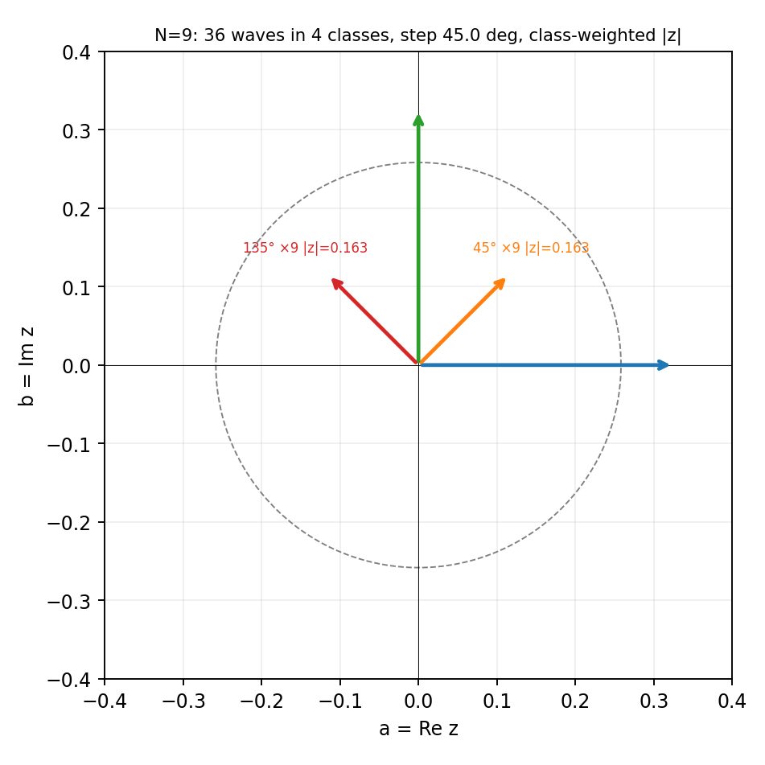

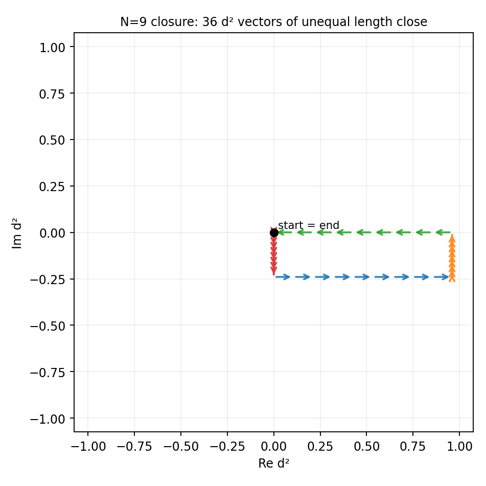

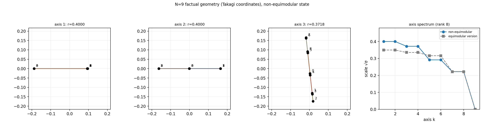

## 9. N=10 の全展開

### 9.0 N=10 の複素シンプレックスの定義

頂点 10 個 {0,…,9}。2 点の組は M = 10×9/2 = 45 個。各組に波 z が 1 個（実数 90 個が状態の全て）。2 乗距離は d² = z²。**N=10 の複素シンプレックスとは、10 頂点とこの 45 個の複素 2 乗距離の組**。

### 9.1 数え上げ（N=10）

| 量 | 値 | 計算 |
|---|---|---|
| 頂点 | 10 | — |
| 波の総数 M | 45 | 10×9/2 |
| 辺 | 10 | 円周の隣どうしの 10 本 |
| 対角線 | 35 | M − N = 45 − 10 |
| 面（三角形） | 120 | C(10,3) |
| 位相の種類 | 9（θ = k×20°） | §9.2 の構成（等モジュラー版：9） |
| 大きさ \|z\| の種類 | 5 | §9.2（等モジュラー版：1） |
| d² の角度の種類 | 9 | 位相の 2 倍 |
| rank | 9 = N−1 | §9.4 の計算結果（等モジュラー版：9） |

### 9.2 波の値 (a, b) と構成、自己無撞着の検証

**構成（偶数 N の設計＝完全マッチング分解、位相は等モジュラー版と同一）**。10 人で全員に相手がいるペアの組ませ方（完全マッチング、1 組 5 本）が、ちょうど 9 セットで全 45 組を重複なく覆う。セット（色）c = 0..8 の波に位相 θ = c×20°（= c×180°/9）を与える。各頂点はどの色の波もちょうど 1 本ずつ持つ。
**振幅（等モジュラー版との唯一の違い）**。クラス c の振幅二乗を a_c = r̄²(1 + 0.6·cos(4πc/9))、r̄² = 1/15 とする（§0.2 の選択 (A)）。値は a_0 = 0.106666667、a_1 = 0.073612594、a_2 = 0.029078962、a_3 = 0.046666667、a_4 = 0.097308444、a_5 = 0.097308444、a_6 = 0.046666667、a_7 = 0.029078962、a_8 = 0.073612594（平均は r̄² = 1/15 = 0.066666667、‖v‖² = 45r̄² = 3 で等モジュラー版と同じ）。

**この振幅が自己無撞着を保つ理由（導出）**。組 e（クラス c）から見て他の各クラス c′ に隣接組が 2 本、同じクラスの隣接組は位相差 0 で寄与しない。一般和則（§0.1）に代入し、実部条件と虚部条件を 1 本の複素条件にまとめると ω^{−c}·Σ_{c′} a_{c′} ω^{c′} = Σ_{c′} a_{c′} + μ/1（全ての c で同じ実数）。q = 9 ≥ 3 でこれが全 c について実になるのは **Σ_c a_c ω^c = 0** のときだけで、そのとき μ = −1·Σ_c a_c = −(N−1)·r̄²。a_c = r̄²(1+0.6cos(4πc/q)) は三角和の直交性で Σ_c a_c ω^c = 0 を厳密に満たす（実測 |Σ a_c ω^c| = 1e-16）。つまり**必要なのは「振幅二乗を重みとした 1 の 9 乗根の重心が原点」であって、振幅が等しいことではない**。
スケールは規約 〈|z|²〉 = r̄² = 1/15（§0.2。‖v‖² = 45r̄² = 3、等モジュラー版と同じ）。同じクラスの波は同じ (a, b) を持つので、クラスごとに列挙する：

| クラス | θ | a_c = \|z\|² | \|z\| | a | b | 本数 | 所属する組 |
|---|---|---|---|---|---|---|---|
| 0 | 0° | 0.106666667 | 0.326598632 | +0.326598632 | +0.000000000 | 5 | (0,9) (1,8) (2,7) (3,6) (4,5) |
| 1 | 20° | 0.073612594 | 0.271316409 | +0.254954027 | +0.092795677 | 5 | (0,2) (1,9) (3,8) (4,7) (5,6) |
| 2 | 40° | 0.029078962 | 0.170525546 | +0.130630147 | +0.109611708 | 5 | (0,4) (1,3) (2,9) (5,8) (6,7) |
| 3 | 60° | 0.046666667 | 0.216024690 | +0.108012345 | +0.187082869 | 5 | (0,6) (1,5) (2,4) (3,9) (7,8) |
| 4 | 80° | 0.097308444 | 0.311943015 | +0.054168336 | +0.307203899 | 5 | (0,8) (1,7) (2,6) (3,5) (4,9) |
| 5 | 100° | 0.097308444 | 0.311943015 | -0.054168336 | +0.307203899 | 5 | (0,1) (2,8) (3,7) (4,6) (5,9) |
| 6 | 120° | 0.046666667 | 0.216024690 | -0.108012345 | +0.187082869 | 5 | (0,3) (1,2) (4,8) (5,7) (6,9) |
| 7 | 140° | 0.029078962 | 0.170525546 | -0.130630147 | +0.109611708 | 5 | (0,5) (1,4) (2,3) (6,8) (7,9) |
| 8 | 160° | 0.073612594 | 0.271316409 | -0.254954027 | +0.092795677 | 5 | (0,7) (1,6) (2,5) (3,4) (8,9) |

**自己無撞着の検証【定理・実測】**：一般和則（§0.1）を全 45 組で数値検査——実部条件 Σ_f |z_f|² sin²φ の値は全組で 0.600000000（ばらつき 3e-16。= −μ）、虚部条件 |Σ_f |z_f|² sin2φ| ≤ 1e-16。方程式の残差 1.2e-16。よって **μ = -0.600000000** = −(N−1)·r̄² = −3/5——**等モジュラー版と同じ値**（-0.600000000）。
※この族は q−3 = 6 個の実パラメータを持つ連続族で、等モジュラー版はその 1 点（ε=0）である。

### 9.3 2 乗距離（クラスごと）

| クラス | d² の角度 | \|d²\| = a_c | d² の値 |
|---|---|---|---|
| 0 | 0° | 0.106666667 | +0.106666667+0.000000000i |
| 1 | 40° | 0.073612594 | +0.056390518+0.047317263i |
| 2 | 80° | 0.029078962 | +0.005049509+0.028637187i |
| 3 | 120° | 0.046666667 | -0.023333333+0.040414519i |
| 4 | 160° | 0.097308444 | -0.091440027+0.033281448i |
| 5 | 200° | 0.097308444 | -0.091440027-0.033281448i |
| 6 | 240° | 0.046666667 | -0.023333333-0.040414519i |
| 7 | 280° | 0.029078962 | +0.005049509-0.028637187i |
| 8 | 320° | 0.073612594 | +0.056390518-0.047317263i |

**角度は等モジュラー版と同じ、大きさ |d²| = a_c がクラスごとに違う。**

### 9.4 閉塞の判定・B 行列と形

- **大域閉塞【定理・実測】**：全体では各色が 5 本ずつ → 5×Σ_c a_c ω^c = 0。実測 |Σz²| = 1e-16。
- **局所閉塞【定理・実測】**：各頂点は 9 色を 1 本ずつ持つ。d² は色 c で a_c·ω^c（ω = e^{i·360°/9}）なので局所和 = Σ_c a_c ω^c = 0（§9.2 の条件そのもの）。実測 max|局所和| = 3e-17。よって**全頂点が複素ヌル錐上**（埋め込みで max|x·x| = 8e-17）。
- **B = −½JD²J の Takagi 軸【実測・機械精度】**：軸スケールの相異なる値は 0.517045596、0.344705043、0.342973613、0.336430083、0.218897863、0.185178474、0.180971885、0.159383417、0.154860237 （等長でない。相異なる値 9 種）。**等モジュラー版**：0.516397779、0.324667915、0.182574186（相異なる値 3 種）。rank = 9。頂点のエルミート半径：0.318280974、0.280597015、0.280557300、0.278521812、0.272776080、0.264473162。埋め込みの距離再現誤差 max = 3e-16。

### 9.5 N=10 のまとめ（種別）

- 【選択＋実測】クラス重み付き（振幅二乗 a_c = r̄²(1+0.6cos(4πc/q))）の状態は自己無撞着（残差 1e-16）。等モジュラーは**使っていない**。
- 【定理・実測】大域閉塞は成立。局所閉塞は成立（全頂点が複素ヌル錐上）。
- 【定理】μ = -0.600000000 = −(N−1)·〈|z|²〉：等モジュラー版と同一（μ は平均振幅二乗だけで決まる）。
- 【実測（機械精度）】rank = 9（最大次元）、軸は等長でない（等モジュラー版：相異なる値 3 種）。**等モジュラー版との差は形（Takagi 軸）だけ**。
- 【規約の帰結】大きさに制限はない（スケール対称性）。

### 図（N=10）

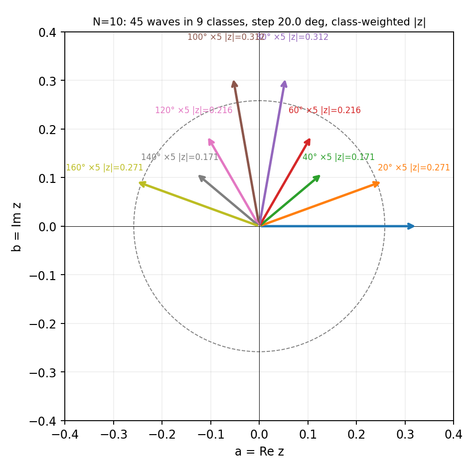

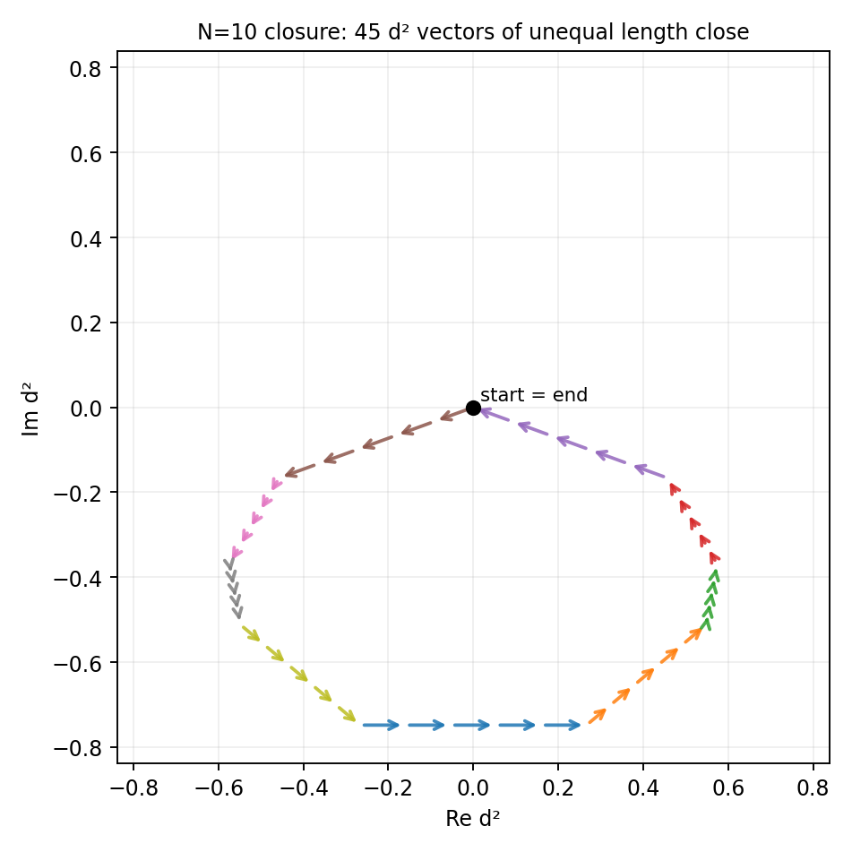

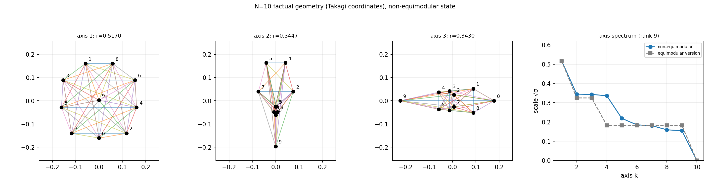

## 10. N=11 の全展開

### 10.0 N=11 の複素シンプレックスの定義

頂点 11 個 {0,…,10}。2 点の組は M = 11×10/2 = 55 個。各組に波 z が 1 個（実数 110 個が状態の全て）。2 乗距離は d² = z²。**N=11 の複素シンプレックスとは、11 頂点とこの 55 個の複素 2 乗距離の組**。

### 10.1 数え上げ（N=11）

| 量 | 値 | 計算 |
|---|---|---|
| 頂点 | 11 | — |
| 波の総数 M | 55 | 11×10/2 |
| 辺 | 11 | 円周の隣どうしの 11 本 |
| 対角線 | 44 | M − N = 55 − 11 |
| 面（三角形） | 165 | C(11,3) |
| 位相の種類 | 5（θ = k×36°） | §10.2 の構成（等モジュラー版：5） |
| 大きさ \|z\| の種類 | 3 | §10.2（等モジュラー版：1） |
| d² の角度の種類 | 5 | 位相の 2 倍 |
| rank | 10 = N−1 | §10.4 の計算結果（等モジュラー版：10） |

### 10.2 波の値 (a, b) と構成、自己無撞着の検証

**構成（奇数 N の設計＝距離クラス分解、位相は等モジュラー版と同一）**。頂点を円周に並べ、組 (i,j) の「距離」を d = |i−j| を N で折り返した値（1〜5）とする。距離 d のクラスは各頂点にちょうど 2 本ずつ属する（11 本、全 5 クラスで 55 組を覆う）。クラス d の波に位相 θ = (d−1)×36°（= (d−1)×180°/5）を与える。
**振幅（等モジュラー版との唯一の違い）**。クラス c の振幅二乗を a_c = r̄²(1 + 0.6·cos(4πc/5))、r̄² = 1/15 とする（§0.2 の選択 (A)）。値は a_0 = 0.106666667、a_1 = 0.034305987、a_2 = 0.079027346、a_3 = 0.079027346、a_4 = 0.034305987（平均は r̄² = 1/15 = 0.066666667、‖v‖² = 55r̄² = 11/3 で等モジュラー版と同じ）。

**この振幅が自己無撞着を保つ理由（導出）**。組 e（クラス c）から見て他の各クラス c′ に隣接組が 4 本、同じクラスの隣接組は位相差 0 で寄与しない。一般和則（§0.1）に代入し、実部条件と虚部条件を 1 本の複素条件にまとめると ω^{−c}·Σ_{c′} a_{c′} ω^{c′} = Σ_{c′} a_{c′} + μ/2（全ての c で同じ実数）。q = 5 ≥ 3 でこれが全 c について実になるのは **Σ_c a_c ω^c = 0** のときだけで、そのとき μ = −2·Σ_c a_c = −(N−1)·r̄²。a_c = r̄²(1+0.6cos(4πc/q)) は三角和の直交性で Σ_c a_c ω^c = 0 を厳密に満たす（実測 |Σ a_c ω^c| = 6e-17）。つまり**必要なのは「振幅二乗を重みとした 1 の 5 乗根の重心が原点」であって、振幅が等しいことではない**。
スケールは規約 〈|z|²〉 = r̄² = 1/15（§0.2。‖v‖² = 55r̄² = 11/3、等モジュラー版と同じ）。同じクラスの波は同じ (a, b) を持つので、クラスごとに列挙する：

| クラス | θ | a_c = \|z\|² | \|z\| | a | b | 本数 | 所属する組 |
|---|---|---|---|---|---|---|---|
| 0 | 0° | 0.106666667 | 0.326598632 | +0.326598632 | +0.000000000 | 11 | (0,1) (0,10) (1,2) (2,3) (3,4) (4,5) (5,6) (6,7) (7,8) (8,9) (9,10) |
| 1 | 36° | 0.034305987 | 0.185218754 | +0.149845120 | +0.108868852 | 11 | (0,2) (0,9) (1,3) (1,10) (2,4) (3,5) (4,6) (5,7) (6,8) (7,9) (8,10) |
| 2 | 72° | 0.079027346 | 0.281118029 | +0.086870249 | +0.267359134 | 11 | (0,3) (0,8) (1,4) (1,9) (2,5) (2,10) (3,6) (4,7) (5,8) (6,9) (7,10) |
| 3 | 108° | 0.079027346 | 0.281118029 | -0.086870249 | +0.267359134 | 11 | (0,4) (0,7) (1,5) (1,8) (2,6) (2,9) (3,7) (3,10) (4,8) (5,9) (6,10) |
| 4 | 144° | 0.034305987 | 0.185218754 | -0.149845120 | +0.108868852 | 11 | (0,5) (0,6) (1,6) (1,7) (2,7) (2,8) (3,8) (3,9) (4,9) (4,10) (5,10) |

**自己無撞着の検証【定理・実測】**：一般和則（§0.1）を全 55 組で数値検査——実部条件 Σ_f |z_f|² sin²φ の値は全組で 0.666666667（ばらつき 7e-16。= −μ）、虚部条件 |Σ_f |z_f|² sin2φ| ≤ 3e-16。方程式の残差 1.6e-16。よって **μ = -0.666666667** = −(N−1)·r̄² = −2/3——**等モジュラー版と同じ値**（-0.666666667）。
※この族は q−3 = 2 個の実パラメータを持つ連続族で、等モジュラー版はその 1 点（ε=0）である。

### 10.3 2 乗距離（クラスごと）

| クラス | d² の角度 | \|d²\| = a_c | d² の値 |
|---|---|---|---|
| 0 | 0° | 0.106666667 | +0.106666667+0.000000000i |
| 1 | 72° | 0.034305987 | +0.010601133+0.032626932i |
| 2 | 144° | 0.079027346 | -0.063934466+0.046451109i |
| 3 | 216° | 0.079027346 | -0.063934466-0.046451109i |
| 4 | 288° | 0.034305987 | +0.010601133-0.032626932i |

**角度は等モジュラー版と同じ、大きさ |d²| = a_c がクラスごとに違う。**

### 10.4 閉塞の判定・B 行列と形

- **大域閉塞【定理・実測】**：全体では各クラスが 11 本ずつ → 11×Σ_c a_c ω^c = 0。実測 |Σz²| = 9e-16。
- **局所閉塞【定理・実測】**：各頂点は 5 クラスを 2 本ずつ持つ。d² はクラス c で a_c·ω^c（ω = e^{i·360°/5}）なので局所和 = 2Σ_c a_c ω^c = 0（§10.2 の条件そのもの）。実測 max|局所和| = 2e-16。よって**全頂点が複素ヌル錐上**（埋め込みで max|x·x| = 1e-16）。
- **B = −½JD²J の Takagi 軸【実測・機械精度】**：軸スケールの相異なる値は 0.389102051、0.381377917、0.341311466、0.297293873、0.285577893 （等長でない。相異なる値 5 種）。**等モジュラー版**：0.395116115、0.372366066、0.340937944、0.217578398、0.204837607（相異なる値 5 種）。rank = 10。頂点のエルミート半径：0.325654981。埋め込みの距離再現誤差 max = 2e-16。

### 10.5 N=11 のまとめ（種別）

- 【選択＋実測】クラス重み付き（振幅二乗 a_c = r̄²(1+0.6cos(4πc/q))）の状態は自己無撞着（残差 2e-16）。等モジュラーは**使っていない**。
- 【定理・実測】大域閉塞は成立。局所閉塞は成立（全頂点が複素ヌル錐上）。
- 【定理】μ = -0.666666667 = −(N−1)·〈|z|²〉：等モジュラー版と同一（μ は平均振幅二乗だけで決まる）。
- 【実測（機械精度）】rank = 10（最大次元）、軸は等長でない（等モジュラー版：相異なる値 5 種）。**等モジュラー版との差は形（Takagi 軸）だけ**。
- 【規約の帰結】大きさに制限はない（スケール対称性）。

### 図（N=11）

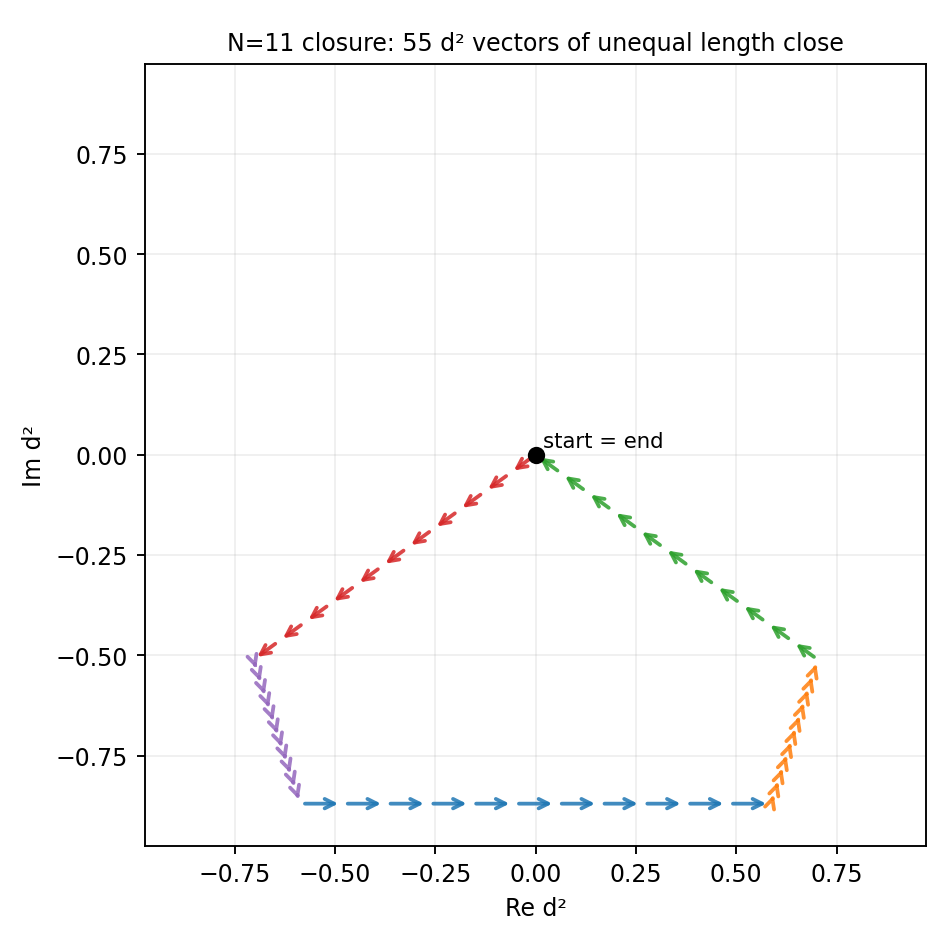

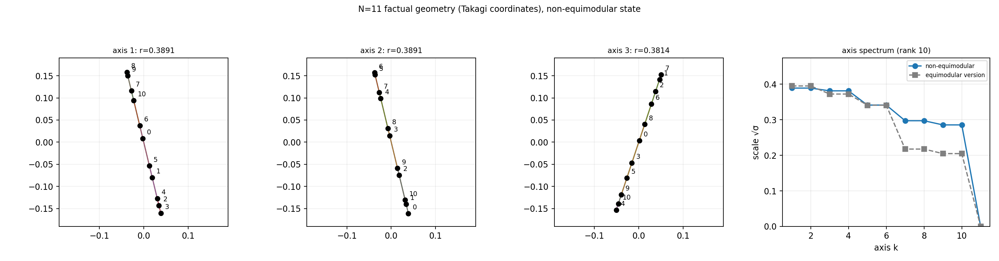

## 11. N=12 の全展開

### 11.0 N=12 の複素シンプレックスの定義

頂点 12 個 {0,…,11}。2 点の組は M = 12×11/2 = 66 個。各組に波 z が 1 個（実数 132 個が状態の全て）。2 乗距離は d² = z²。**N=12 の複素シンプレックスとは、12 頂点とこの 66 個の複素 2 乗距離の組**。

### 11.1 数え上げ（N=12）

| 量 | 値 | 計算 |
|---|---|---|
| 頂点 | 12 | — |
| 波の総数 M | 66 | 12×11/2 |
| 辺 | 12 | 円周の隣どうしの 12 本 |
| 対角線 | 54 | M − N = 66 − 12 |
| 面（三角形） | 220 | C(12,3) |
| 位相の種類 | 11（θ = k×16.3636°） | §11.2 の構成（等モジュラー版：11） |
| 大きさ \|z\| の種類 | 6 | §11.2（等モジュラー版：1） |
| d² の角度の種類 | 11 | 位相の 2 倍 |
| rank | 11 = N−1 | §11.4 の計算結果（等モジュラー版：11） |

### 11.2 波の値 (a, b) と構成、自己無撞着の検証

**構成（偶数 N の設計＝完全マッチング分解、位相は等モジュラー版と同一）**。12 人で全員に相手がいるペアの組ませ方（完全マッチング、1 組 6 本）が、ちょうど 11 セットで全 66 組を重複なく覆う。セット（色）c = 0..10 の波に位相 θ = c×16.3636°（= c×180°/11）を与える。各頂点はどの色の波もちょうど 1 本ずつ持つ。
**振幅（等モジュラー版との唯一の違い）**。クラス c の振幅二乗を a_c = r̄²(1 + 0.6·cos(4πc/11))、r̄² = 1/15 とする（§0.2 の選択 (A)）。値は a_0 = 0.106666667、a_1 = 0.083283267、a_2 = 0.040472237、a_3 = 0.028286948、a_4 = 0.060974073、a_5 = 0.100316808、a_6 = 0.100316808、a_7 = 0.060974073、a_8 = 0.028286948、a_9 = 0.040472237、a_10 = 0.083283267（平均は r̄² = 1/15 = 0.066666667、‖v‖² = 66r̄² = 22/5 で等モジュラー版と同じ）。

**この振幅が自己無撞着を保つ理由（導出）**。組 e（クラス c）から見て他の各クラス c′ に隣接組が 2 本、同じクラスの隣接組は位相差 0 で寄与しない。一般和則（§0.1）に代入し、実部条件と虚部条件を 1 本の複素条件にまとめると ω^{−c}·Σ_{c′} a_{c′} ω^{c′} = Σ_{c′} a_{c′} + μ/1（全ての c で同じ実数）。q = 11 ≥ 3 でこれが全 c について実になるのは **Σ_c a_c ω^c = 0** のときだけで、そのとき μ = −1·Σ_c a_c = −(N−1)·r̄²。a_c = r̄²(1+0.6cos(4πc/q)) は三角和の直交性で Σ_c a_c ω^c = 0 を厳密に満たす（実測 |Σ a_c ω^c| = 1e-16）。つまり**必要なのは「振幅二乗を重みとした 1 の 11 乗根の重心が原点」であって、振幅が等しいことではない**。
スケールは規約 〈|z|²〉 = r̄² = 1/15（§0.2。‖v‖² = 66r̄² = 22/5、等モジュラー版と同じ）。同じクラスの波は同じ (a, b) を持つので、クラスごとに列挙する：

| クラス | θ | a_c = \|z\|² | \|z\| | a | b | 本数 | 所属する組 |
|---|---|---|---|---|---|---|---|
| 0 | 0° | 0.106666667 | 0.326598632 | +0.326598632 | +0.000000000 | 6 | (0,11) (1,10) (2,9) (3,8) (4,7) (5,6) |
| 1 | 16.3636° | 0.083283267 | 0.288588404 | +0.276898546 | +0.081304749 | 6 | (0,2) (1,11) (3,10) (4,9) (5,8) (6,7) |
| 2 | 32.7273° | 0.040472237 | 0.201177129 | +0.169240971 | +0.108764568 | 6 | (0,4) (1,3) (2,11) (5,10) (6,9) (7,8) |
| 3 | 49.0909° | 0.028286948 | 0.168187240 | +0.110139219 | +0.127107435 | 6 | (0,6) (1,5) (2,4) (3,11) (7,10) (8,9) |
| 4 | 65.4545° | 0.060974073 | 0.246929288 | +0.102578133 | +0.224614781 | 6 | (0,8) (1,7) (2,6) (3,5) (4,11) (9,10) |
| 5 | 81.8182° | 0.100316808 | 0.316728287 | +0.045075135 | +0.313504450 | 6 | (0,10) (1,9) (2,8) (3,7) (4,6) (5,11) |
| 6 | 98.1818° | 0.100316808 | 0.316728287 | -0.045075135 | +0.313504450 | 6 | (0,1) (2,10) (3,9) (4,8) (5,7) (6,11) |
| 7 | 114.545° | 0.060974073 | 0.246929288 | -0.102578133 | +0.224614781 | 6 | (0,3) (1,2) (4,10) (5,9) (6,8) (7,11) |
| 8 | 130.909° | 0.028286948 | 0.168187240 | -0.110139219 | +0.127107435 | 6 | (0,5) (1,4) (2,3) (6,10) (7,9) (8,11) |
| 9 | 147.273° | 0.040472237 | 0.201177129 | -0.169240971 | +0.108764568 | 6 | (0,7) (1,6) (2,5) (3,4) (8,10) (9,11) |
| 10 | 163.636° | 0.083283267 | 0.288588404 | -0.276898546 | +0.081304749 | 6 | (0,9) (1,8) (2,7) (3,6) (4,5) (10,11) |

**自己無撞着の検証【定理・実測】**：一般和則（§0.1）を全 66 組で数値検査——実部条件 Σ_f |z_f|² sin²φ の値は全組で 0.733333333（ばらつき 3e-16。= −μ）、虚部条件 |Σ_f |z_f|² sin2φ| ≤ 1e-16。方程式の残差 8.6e-17。よって **μ = -0.733333333** = −(N−1)·r̄² = −11/15——**等モジュラー版と同じ値**（-0.733333333）。
※この族は q−3 = 8 個の実パラメータを持つ連続族で、等モジュラー版はその 1 点（ε=0）である。

### 11.3 2 乗距離（クラスごと）

| クラス | d² の角度 | \|d²\| = a_c | d² の値 |
|---|---|---|---|
| 0 | 0° | 0.106666667 | +0.106666667+0.000000000i |
| 1 | 32.7273° | 0.083283267 | +0.070062343+0.045026334i |
| 2 | 65.4545° | 0.040472237 | +0.016812775+0.036814842i |
| 3 | 98.1818° | 0.028286948 | -0.004025652+0.027999027i |
| 4 | 130.909° | 0.060974073 | -0.039929526+0.046081130i |
| 5 | 163.636° | 0.100316808 | -0.096253272+0.028262511i |
| 6 | 196.364° | 0.100316808 | -0.096253272-0.028262511i |
| 7 | 229.091° | 0.060974073 | -0.039929526-0.046081130i |
| 8 | 261.818° | 0.028286948 | -0.004025652-0.027999027i |
| 9 | 294.545° | 0.040472237 | +0.016812775-0.036814842i |
| 10 | 327.273° | 0.083283267 | +0.070062343-0.045026334i |

**角度は等モジュラー版と同じ、大きさ |d²| = a_c がクラスごとに違う。**

### 11.4 閉塞の判定・B 行列と形

- **大域閉塞【定理・実測】**：全体では各色が 6 本ずつ → 6×Σ_c a_c ω^c = 0。実測 |Σz²| = 3e-16。
- **局所閉塞【定理・実測】**：各頂点は 11 色を 1 本ずつ持つ。d² は色 c で a_c·ω^c（ω = e^{i·360°/11}）なので局所和 = Σ_c a_c ω^c = 0（§11.2 の条件そのもの）。実測 max|局所和| = 5e-17。よって**全頂点が複素ヌル錐上**（埋め込みで max|x·x| = 8e-17）。
- **B = −½JD²J の Takagi 軸【実測・機械精度】**：軸スケールの相異なる値は 0.577822105、0.367407693、0.358189006、0.357110208、0.260113669、0.205247413、0.204239579、0.174243094、0.169496159、0.142363679、0.141035096 （等長でない。相異なる値 11 種）。**等モジュラー版**：0.577350269、0.339808849、0.182574186（相異なる値 3 種）。rank = 11。頂点のエルミート半径：0.336602853、0.290786008、0.290088744、0.287142193、0.280896218、0.271713774、0.263549680。埋め込みの距離再現誤差 max = 2e-16。

### 11.5 N=12 のまとめ（種別）

- 【選択＋実測】クラス重み付き（振幅二乗 a_c = r̄²(1+0.6cos(4πc/q))）の状態は自己無撞着（残差 9e-17）。等モジュラーは**使っていない**。
- 【定理・実測】大域閉塞は成立。局所閉塞は成立（全頂点が複素ヌル錐上）。
- 【定理】μ = -0.733333333 = −(N−1)·〈|z|²〉：等モジュラー版と同一（μ は平均振幅二乗だけで決まる）。
- 【実測（機械精度）】rank = 11（最大次元）、軸は等長でない（等モジュラー版：相異なる値 3 種）。**等モジュラー版との差は形（Takagi 軸）だけ**。
- 【規約の帰結】大きさに制限はない（スケール対称性）。

### 図（N=12）

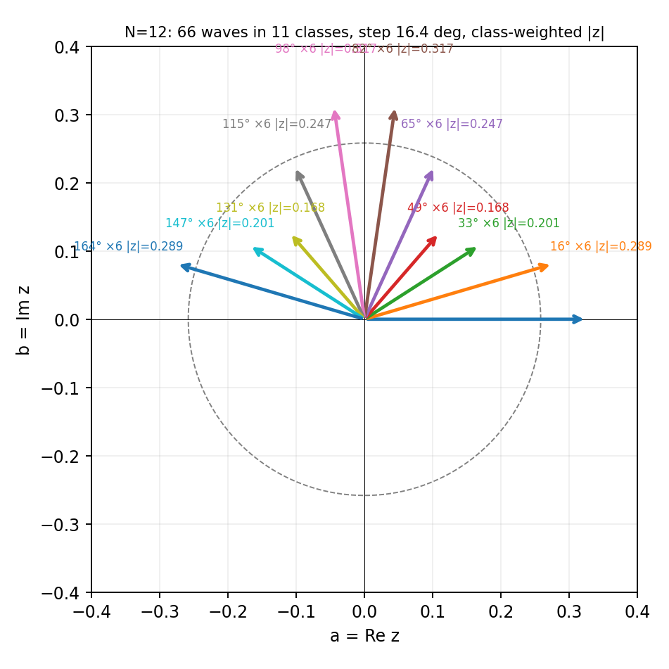

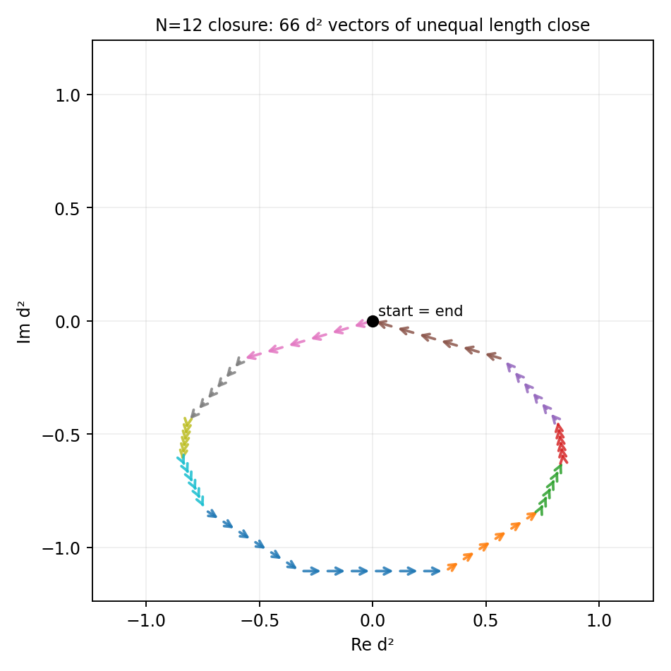

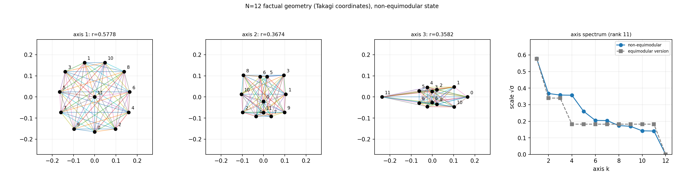

## 12. N=13 の全展開

### 12.0 N=13 の複素シンプレックスの定義

頂点 13 個 {0,…,12}。2 点の組は M = 13×12/2 = 78 個。各組に波 z が 1 個（実数 156 個が状態の全て）。2 乗距離は d² = z²。**N=13 の複素シンプレックスとは、13 頂点とこの 78 個の複素 2 乗距離の組**。

### 12.1 数え上げ（N=13）

| 量 | 値 | 計算 |
|---|---|---|
| 頂点 | 13 | — |
| 波の総数 M | 78 | 13×12/2 |
| 辺 | 13 | 円周の隣どうしの 13 本 |
| 対角線 | 65 | M − N = 78 − 13 |
| 面（三角形） | 286 | C(13,3) |
| 位相の種類 | 6（θ = k×30°） | §12.2 の構成（等モジュラー版：6） |
| 大きさ \|z\| の種類 | 2 | §12.2（等モジュラー版：1） |
| d² の角度の種類 | 6 | 位相の 2 倍 |
| rank | 12 = N−1 | §12.4 の計算結果（等モジュラー版：12） |

### 12.2 波の値 (a, b) と構成、自己無撞着の検証

**構成（奇数 N の設計＝距離クラス分解、位相は等モジュラー版と同一）**。頂点を円周に並べ、組 (i,j) の「距離」を d = |i−j| を N で折り返した値（1〜6）とする。距離 d のクラスは各頂点にちょうど 2 本ずつ属する（13 本、全 6 クラスで 78 組を覆う）。クラス d の波に位相 θ = (d−1)×30°（= (d−1)×180°/6）を与える。
**振幅（等モジュラー版との唯一の違い）**。クラス c の振幅二乗を a_c = r̄²(1 + 0.6·cos(4πc/6))、r̄² = 1/15 とする（§0.2 の選択 (A)）。値は a_0 = 0.106666667、a_1 = 0.046666667、a_2 = 0.046666667、a_3 = 0.106666667、a_4 = 0.046666667、a_5 = 0.046666667（平均は r̄² = 1/15 = 0.066666667、‖v‖² = 78r̄² = 26/5 で等モジュラー版と同じ）。

**この振幅が自己無撞着を保つ理由（導出）**。組 e（クラス c）から見て他の各クラス c′ に隣接組が 4 本、同じクラスの隣接組は位相差 0 で寄与しない。一般和則（§0.1）に代入し、実部条件と虚部条件を 1 本の複素条件にまとめると ω^{−c}·Σ_{c′} a_{c′} ω^{c′} = Σ_{c′} a_{c′} + μ/2（全ての c で同じ実数）。q = 6 ≥ 3 でこれが全 c について実になるのは **Σ_c a_c ω^c = 0** のときだけで、そのとき μ = −2·Σ_c a_c = −(N−1)·r̄²。a_c = r̄²(1+0.6cos(4πc/q)) は三角和の直交性で Σ_c a_c ω^c = 0 を厳密に満たす（実測 |Σ a_c ω^c| = 1e-17）。つまり**必要なのは「振幅二乗を重みとした 1 の 6 乗根の重心が原点」であって、振幅が等しいことではない**。
スケールは規約 〈|z|²〉 = r̄² = 1/15（§0.2。‖v‖² = 78r̄² = 26/5、等モジュラー版と同じ）。同じクラスの波は同じ (a, b) を持つので、クラスごとに列挙する：

| クラス | θ | a_c = \|z\|² | \|z\| | a | b | 本数 | 所属する組 |
|---|---|---|---|---|---|---|---|
| 0 | 0° | 0.106666667 | 0.326598632 | +0.326598632 | +0.000000000 | 13 | (0,1) (0,12) (1,2) (2,3) (3,4) (4,5) (5,6) (6,7) (7,8) (8,9) (9,10) (10,11) (11,12) |
| 1 | 30° | 0.046666667 | 0.216024690 | +0.187082869 | +0.108012345 | 13 | (0,2) (0,11) (1,3) (1,12) (2,4) (3,5) (4,6) (5,7) (6,8) (7,9) (8,10) (9,11) (10,12) |
| 2 | 60° | 0.046666667 | 0.216024690 | +0.108012345 | +0.187082869 | 13 | (0,3) (0,10) (1,4) (1,11) (2,5) (2,12) (3,6) (4,7) (5,8) (6,9) (7,10) (8,11) (9,12) |
| 3 | 90° | 0.106666667 | 0.326598632 | +0.000000000 | +0.326598632 | 13 | (0,4) (0,9) (1,5) (1,10) (2,6) (2,11) (3,7) (3,12) (4,8) (5,9) (6,10) (7,11) (8,12) |
| 4 | 120° | 0.046666667 | 0.216024690 | -0.108012345 | +0.187082869 | 13 | (0,5) (0,8) (1,6) (1,9) (2,7) (2,10) (3,8) (3,11) (4,9) (4,12) (5,10) (6,11) (7,12) |
| 5 | 150° | 0.046666667 | 0.216024690 | -0.187082869 | +0.108012345 | 13 | (0,6) (0,7) (1,7) (1,8) (2,8) (2,9) (3,9) (3,10) (4,10) (4,11) (5,11) (5,12) (6,12) |

**自己無撞着の検証【定理・実測】**：一般和則（§0.1）を全 78 組で数値検査——実部条件 Σ_f |z_f|² sin²φ の値は全組で 0.800000000（ばらつき 2e-16。= −μ）、虚部条件 |Σ_f |z_f|² sin2φ| ≤ 2e-16。方程式の残差 1.0e-16。よって **μ = -0.800000000** = −(N−1)·r̄² = −4/5——**等モジュラー版と同じ値**（-0.800000000）。
※この族は q−3 = 3 個の実パラメータを持つ連続族で、等モジュラー版はその 1 点（ε=0）である。

### 12.3 2 乗距離（クラスごと）

| クラス | d² の角度 | \|d²\| = a_c | d² の値 |
|---|---|---|---|
| 0 | 0° | 0.106666667 | +0.106666667+0.000000000i |
| 1 | 60° | 0.046666667 | +0.023333333+0.040414519i |
| 2 | 120° | 0.046666667 | -0.023333333+0.040414519i |
| 3 | 180° | 0.106666667 | -0.106666667+0.000000000i |
| 4 | 240° | 0.046666667 | -0.023333333-0.040414519i |
| 5 | 300° | 0.046666667 | +0.023333333-0.040414519i |

**角度は等モジュラー版と同じ、大きさ |d²| = a_c がクラスごとに違う。**

### 12.4 閉塞の判定・B 行列と形

- **大域閉塞【定理・実測】**：全体では各クラスが 13 本ずつ → 13×Σ_c a_c ω^c = 0。実測 |Σz²| = 6e-16。
- **局所閉塞【定理・実測】**：各頂点は 6 クラスを 2 本ずつ持つ。d² はクラス c で a_c·ω^c（ω = e^{i·360°/6}）なので局所和 = 2Σ_c a_c ω^c = 0（§12.2 の条件そのもの）。実測 max|局所和| = 1e-16。よって**全頂点が複素ヌル錐上**（埋め込みで max|x·x| = 8e-17）。
- **B = −½JD²J の Takagi 軸【実測・機械精度】**：軸スケールの相異なる値は 0.443511323、0.410459473、0.367260832、0.340473214、0.239206737、0.129999151 （等長でない。相異なる値 6 種）。**等モジュラー版**：0.435667331、0.407077226、0.364716343、0.216210665、0.205945730、0.196861967（相異なる値 6 種）。rank = 12。頂点のエルミート半径：0.325836543。埋め込みの距離再現誤差 max = 3e-16。

### 12.5 N=13 のまとめ（種別）

- 【選択＋実測】クラス重み付き（振幅二乗 a_c = r̄²(1+0.6cos(4πc/q))）の状態は自己無撞着（残差 1e-16）。等モジュラーは**使っていない**。
- 【定理・実測】大域閉塞は成立。局所閉塞は成立（全頂点が複素ヌル錐上）。
- 【定理】μ = -0.800000000 = −(N−1)·〈|z|²〉：等モジュラー版と同一（μ は平均振幅二乗だけで決まる）。
- 【実測（機械精度）】rank = 12（最大次元）、軸は等長でない（等モジュラー版：相異なる値 6 種）。**等モジュラー版との差は形（Takagi 軸）だけ**。
- 【規約の帰結】大きさに制限はない（スケール対称性）。

### 図（N=13）

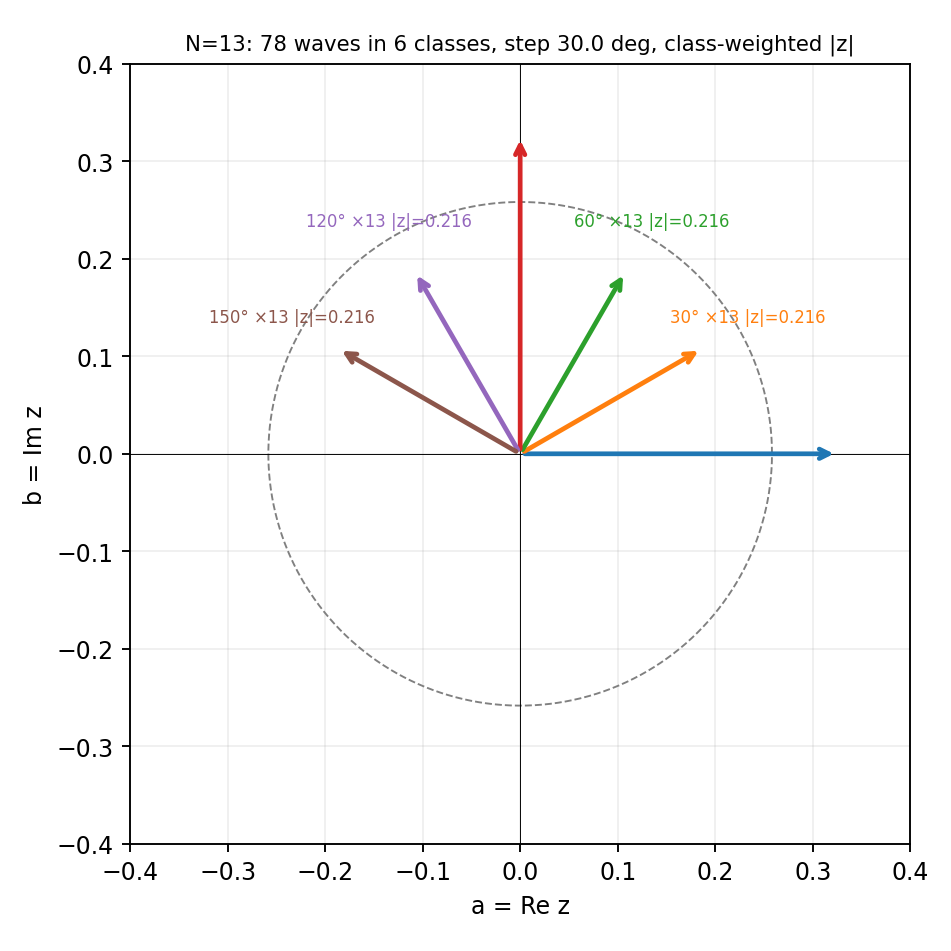

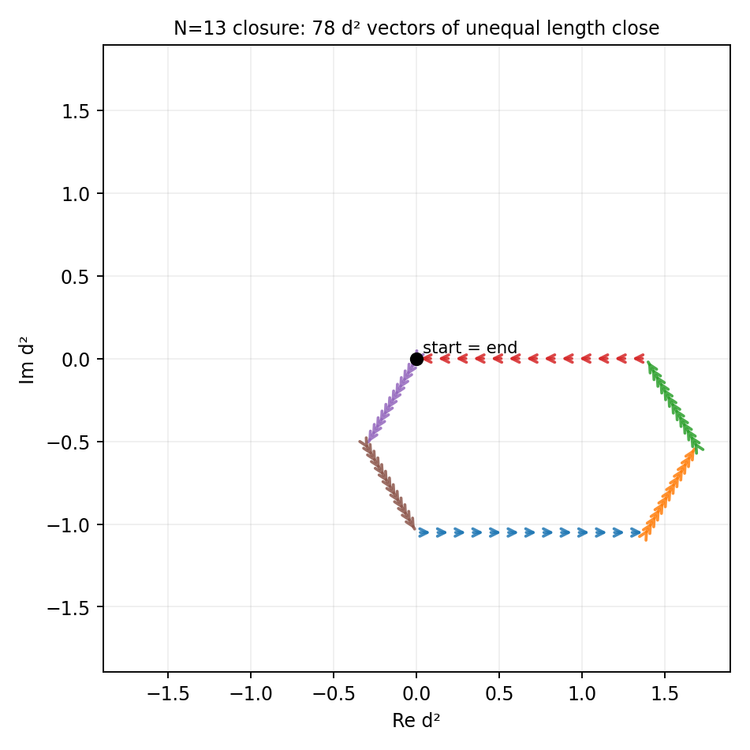

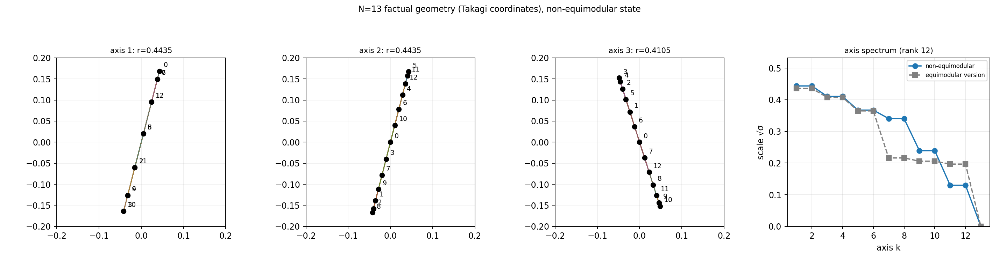

## 13. N=14 の全展開

### 13.0 N=14 の複素シンプレックスの定義

頂点 14 個 {0,…,13}。2 点の組は M = 14×13/2 = 91 個。各組に波 z が 1 個（実数 182 個が状態の全て）。2 乗距離は d² = z²。**N=14 の複素シンプレックスとは、14 頂点とこの 91 個の複素 2 乗距離の組**。

### 13.1 数え上げ（N=14）

| 量 | 値 | 計算 |
|---|---|---|
| 頂点 | 14 | — |
| 波の総数 M | 91 | 14×13/2 |
| 辺 | 14 | 円周の隣どうしの 14 本 |
| 対角線 | 77 | M − N = 91 − 14 |
| 面（三角形） | 364 | C(14,3) |
| 位相の種類 | 13（θ = k×13.8462°） | §13.2 の構成（等モジュラー版：13） |
| 大きさ \|z\| の種類 | 7 | §13.2（等モジュラー版：1） |
| d² の角度の種類 | 13 | 位相の 2 倍 |
| rank | 13 = N−1 | §13.4 の計算結果（等モジュラー版：13） |

### 13.2 波の値 (a, b) と構成、自己無撞着の検証

**構成（偶数 N の設計＝完全マッチング分解、位相は等モジュラー版と同一）**。14 人で全員に相手がいるペアの組ませ方（完全マッチング、1 組 7 本）が、ちょうど 13 セットで全 91 組を重複なく覆う。セット（色）c = 0..12 の波に位相 θ = c×13.8462°（= c×180°/13）を与える。各頂点はどの色の波もちょうど 1 本ずつ持つ。
**振幅（等モジュラー版との唯一の違い）**。クラス c の振幅二乗を a_c = r̄²(1 + 0.6·cos(4πc/13))、r̄² = 1/15 とする（§0.2 の選択 (A)）。値は a_0 = 0.106666667、a_1 = 0.089389257、a_2 = 0.052482471、a_3 = 0.027828994、a_4 = 0.036726237、a_5 = 0.071488134、a_6 = 0.102084908、a_7 = 0.102084908、a_8 = 0.071488134、a_9 = 0.036726237、a_10 = 0.027828994、a_11 = 0.052482471、a_12 = 0.089389257（平均は r̄² = 1/15 = 0.066666667、‖v‖² = 91r̄² = 91/15 で等モジュラー版と同じ）。

**この振幅が自己無撞着を保つ理由（導出）**。組 e（クラス c）から見て他の各クラス c′ に隣接組が 2 本、同じクラスの隣接組は位相差 0 で寄与しない。一般和則（§0.1）に代入し、実部条件と虚部条件を 1 本の複素条件にまとめると ω^{−c}·Σ_{c′} a_{c′} ω^{c′} = Σ_{c′} a_{c′} + μ/1（全ての c で同じ実数）。q = 13 ≥ 3 でこれが全 c について実になるのは **Σ_c a_c ω^c = 0** のときだけで、そのとき μ = −1·Σ_c a_c = −(N−1)·r̄²。a_c = r̄²(1+0.6cos(4πc/q)) は三角和の直交性で Σ_c a_c ω^c = 0 を厳密に満たす（実測 |Σ a_c ω^c| = 7e-17）。つまり**必要なのは「振幅二乗を重みとした 1 の 13 乗根の重心が原点」であって、振幅が等しいことではない**。
スケールは規約 〈|z|²〉 = r̄² = 1/15（§0.2。‖v‖² = 91r̄² = 91/15、等モジュラー版と同じ）。同じクラスの波は同じ (a, b) を持つので、クラスごとに列挙する：

| クラス | θ | a_c = \|z\|² | \|z\| | a | b | 本数 | 所属する組 |
|---|---|---|---|---|---|---|---|
| 0 | 0° | 0.106666667 | 0.326598632 | +0.326598632 | +0.000000000 | 7 | (0,13) (1,12) (2,11) (3,10) (4,9) (5,8) (6,7) |
| 1 | 13.8462° | 0.089389257 | 0.298980361 | +0.290292536 | +0.071550684 | 7 | (0,2) (1,13) (3,12) (4,11) (5,10) (6,9) (7,8) |
| 2 | 27.6923° | 0.052482471 | 0.229090531 | +0.202849591 | +0.106463678 | 7 | (0,4) (1,3) (2,13) (5,12) (6,11) (7,10) (8,9) |
| 3 | 41.5385° | 0.027828994 | 0.166820244 | +0.124866746 | +0.110622284 | 7 | (0,6) (1,5) (2,4) (3,13) (7,12) (8,11) (9,10) |
| 4 | 55.3846° | 0.036726237 | 0.191640906 | +0.108864443 | +0.157717373 | 7 | (0,8) (1,7) (2,6) (3,5) (4,13) (9,12) (10,11) |
| 5 | 69.2308° | 0.071488134 | 0.267372650 | +0.094811648 | +0.249997770 | 7 | (0,10) (1,9) (2,8) (3,7) (4,6) (5,13) (11,12) |
| 6 | 83.0769° | 0.102084908 | 0.319507289 | +0.038512348 | +0.317177721 | 7 | (0,12) (1,11) (2,10) (3,9) (4,8) (5,7) (6,13) |
| 7 | 96.9231° | 0.102084908 | 0.319507289 | -0.038512348 | +0.317177721 | 7 | (0,1) (2,12) (3,11) (4,10) (5,9) (6,8) (7,13) |
| 8 | 110.769° | 0.071488134 | 0.267372650 | -0.094811648 | +0.249997770 | 7 | (0,3) (1,2) (4,12) (5,11) (6,10) (7,9) (8,13) |
| 9 | 124.615° | 0.036726237 | 0.191640906 | -0.108864443 | +0.157717373 | 7 | (0,5) (1,4) (2,3) (6,12) (7,11) (8,10) (9,13) |
| 10 | 138.462° | 0.027828994 | 0.166820244 | -0.124866746 | +0.110622284 | 7 | (0,7) (1,6) (2,5) (3,4) (8,12) (9,11) (10,13) |
| 11 | 152.308° | 0.052482471 | 0.229090531 | -0.202849591 | +0.106463678 | 7 | (0,9) (1,8) (2,7) (3,6) (4,5) (10,12) (11,13) |
| 12 | 166.154° | 0.089389257 | 0.298980361 | -0.290292536 | +0.071550684 | 7 | (0,11) (1,10) (2,9) (3,8) (4,7) (5,6) (12,13) |

**自己無撞着の検証【定理・実測】**：一般和則（§0.1）を全 91 組で数値検査——実部条件 Σ_f |z_f|² sin²φ の値は全組で 0.866666667（ばらつき 4e-16。= −μ）、虚部条件 |Σ_f |z_f|² sin2φ| ≤ 1e-16。方程式の残差 2.7e-16。よって **μ = -0.866666667** = −(N−1)·r̄² = −13/15——**等モジュラー版と同じ値**（-0.866666667）。
※この族は q−3 = 10 個の実パラメータを持つ連続族で、等モジュラー版はその 1 点（ε=0）である。

### 13.3 2 乗距離（クラスごと）

| クラス | d² の角度 | \|d²\| = a_c | d² の値 |
|---|---|---|---|
| 0 | 0° | 0.106666667 | +0.106666667+0.000000000i |
| 1 | 27.6923° | 0.089389257 | +0.079150256+0.041541259i |
| 2 | 55.3846° | 0.052482471 | +0.029813442+0.043192227i |
| 3 | 83.0769° | 0.027828994 | +0.003354415+0.027626089i |
| 4 | 110.769° | 0.036726237 | -0.013023303+0.034339628i |
| 5 | 138.462° | 0.071488134 | -0.053509637+0.047405401i |
| 6 | 166.154° | 0.102084908 | -0.099118506+0.024430517i |
| 7 | 193.846° | 0.102084908 | -0.099118506-0.024430517i |
| 8 | 221.538° | 0.071488134 | -0.053509637-0.047405401i |
| 9 | 249.231° | 0.036726237 | -0.013023303-0.034339628i |
| 10 | 276.923° | 0.027828994 | +0.003354415-0.027626089i |
| 11 | 304.615° | 0.052482471 | +0.029813442-0.043192227i |
| 12 | 332.308° | 0.089389257 | +0.079150256-0.041541259i |

**角度は等モジュラー版と同じ、大きさ |d²| = a_c がクラスごとに違う。**

### 13.4 閉塞の判定・B 行列と形

- **大域閉塞【定理・実測】**：全体では各色が 7 本ずつ → 7×Σ_c a_c ω^c = 0。実測 |Σz²| = 3e-16。
- **局所閉塞【定理・実測】**：各頂点は 13 色を 1 本ずつ持つ。d² は色 c で a_c·ω^c（ω = e^{i·360°/13}）なので局所和 = Σ_c a_c ω^c = 0（§13.2 の条件そのもの）。実測 max|局所和| = 6e-17。よって**全頂点が複素ヌル錐上**（埋め込みで max|x·x| = 1e-16）。
- **B = −½JD²J の Takagi 軸【実測・機械精度】**：軸スケールの相異なる値は 0.632820112、0.392642599、0.371680235、0.371676104、0.295803835、0.208913986、0.207671216、0.199426879、0.197512933、0.153858005、0.152121826、0.137191440、0.136028768 （等長でない。相異なる値 13 種）。**等モジュラー版**：0.632455532、0.353159897、0.182574186（相異なる値 3 種）。rank = 13。頂点のエルミート半径：0.352408208、0.298083495、0.297087264、0.293859425、0.287967330、0.279457028、0.269816036、0.262863348。埋め込みの距離再現誤差 max = 3e-16。

### 13.5 N=14 のまとめ（種別）

- 【選択＋実測】クラス重み付き（振幅二乗 a_c = r̄²(1+0.6cos(4πc/q))）の状態は自己無撞着（残差 3e-16）。等モジュラーは**使っていない**。
- 【定理・実測】大域閉塞は成立。局所閉塞は成立（全頂点が複素ヌル錐上）。
- 【定理】μ = -0.866666667 = −(N−1)·〈|z|²〉：等モジュラー版と同一（μ は平均振幅二乗だけで決まる）。
- 【実測（機械精度）】rank = 13（最大次元）、軸は等長でない（等モジュラー版：相異なる値 3 種）。**等モジュラー版との差は形（Takagi 軸）だけ**。
- 【規約の帰結】大きさに制限はない（スケール対称性）。

### 図（N=14）

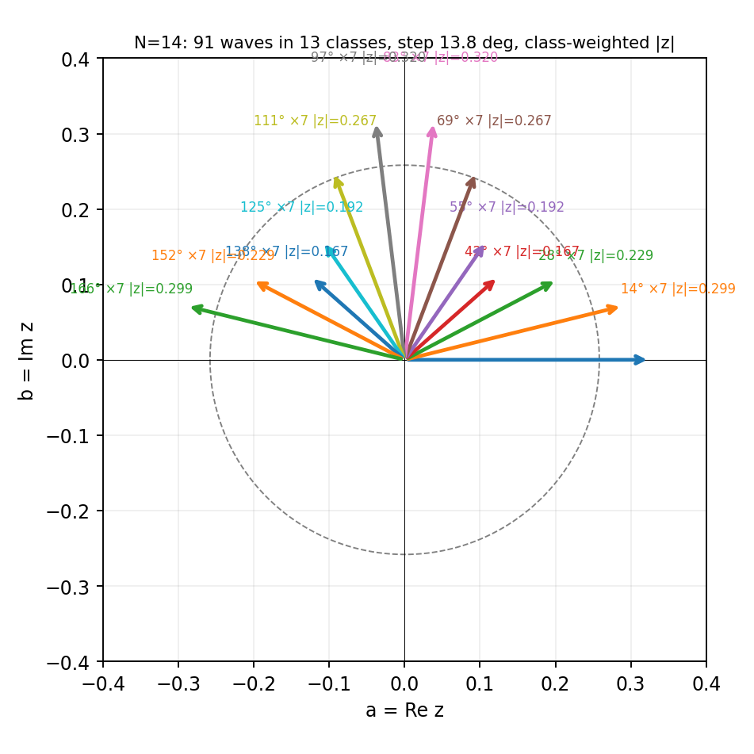

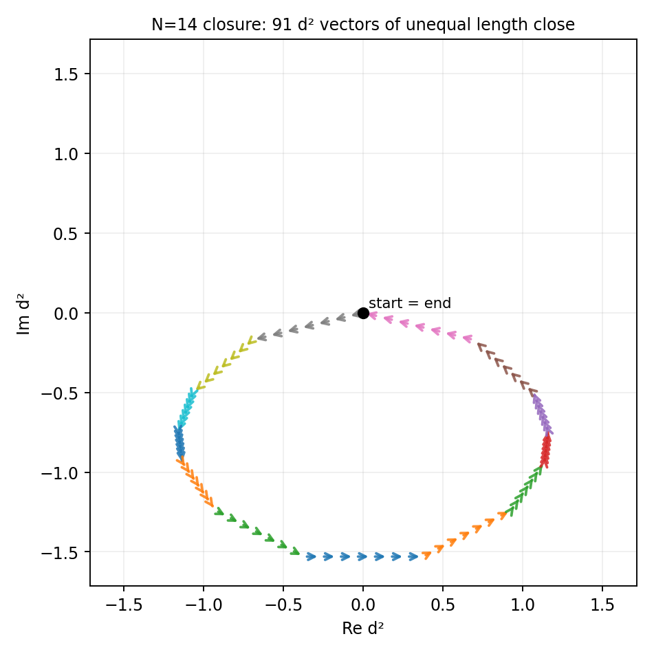

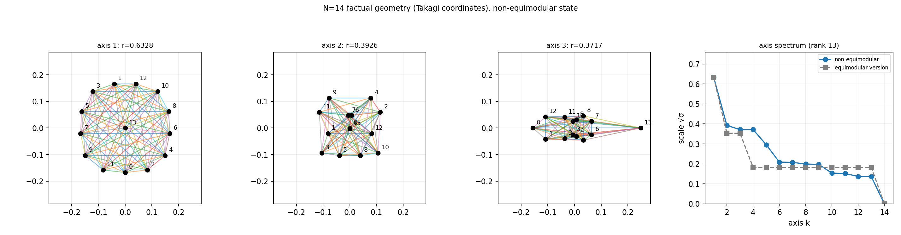

## 14. N=15 の全展開

### 14.0 N=15 の複素シンプレックスの定義

頂点 15 個 {0,…,14}。2 点の組は M = 15×14/2 = 105 個。各組に波 z が 1 個（実数 210 個が状態の全て）。2 乗距離は d² = z²。**N=15 の複素シンプレックスとは、15 頂点とこの 105 個の複素 2 乗距離の組**。

### 14.1 数え上げ（N=15）

| 量 | 値 | 計算 |
|---|---|---|
| 頂点 | 15 | — |
| 波の総数 M | 105 | 15×14/2 |
| 辺 | 15 | 円周の隣どうしの 15 本 |
| 対角線 | 90 | M − N = 105 − 15 |
| 面（三角形） | 455 | C(15,3) |
| 位相の種類 | 7（θ = k×25.7143°） | §14.2 の構成（等モジュラー版：7） |
| 大きさ \|z\| の種類 | 4 | §14.2（等モジュラー版：1） |
| d² の角度の種類 | 7 | 位相の 2 倍 |
| rank | 14 = N−1 | §14.4 の計算結果（等モジュラー版：14） |

### 14.2 波の値 (a, b) と構成、自己無撞着の検証

**構成（奇数 N の設計＝距離クラス分解、位相は等モジュラー版と同一）**。頂点を円周に並べ、組 (i,j) の「距離」を d = |i−j| を N で折り返した値（1〜7）とする。距離 d のクラスは各頂点にちょうど 2 本ずつ属する（15 本、全 7 クラスで 105 組を覆う）。クラス d の波に位相 θ = (d−1)×25.7143°（= (d−1)×180°/7）を与える。
**振幅（等モジュラー版との唯一の違い）**。クラス c の振幅二乗を a_c = r̄²(1 + 0.6·cos(4πc/7))、r̄² = 1/15 とする（§0.2 の選択 (A)）。値は a_0 = 0.106666667、a_1 = 0.057765829、a_2 = 0.030627912、a_3 = 0.091606259、a_4 = 0.091606259、a_5 = 0.030627912、a_6 = 0.057765829（平均は r̄² = 1/15 = 0.066666667、‖v‖² = 105r̄² = 7 で等モジュラー版と同じ）。

**この振幅が自己無撞着を保つ理由（導出）**。組 e（クラス c）から見て他の各クラス c′ に隣接組が 4 本、同じクラスの隣接組は位相差 0 で寄与しない。一般和則（§0.1）に代入し、実部条件と虚部条件を 1 本の複素条件にまとめると ω^{−c}·Σ_{c′} a_{c′} ω^{c′} = Σ_{c′} a_{c′} + μ/2（全ての c で同じ実数）。q = 7 ≥ 3 でこれが全 c について実になるのは **Σ_c a_c ω^c = 0** のときだけで、そのとき μ = −2·Σ_c a_c = −(N−1)·r̄²。a_c = r̄²(1+0.6cos(4πc/q)) は三角和の直交性で Σ_c a_c ω^c = 0 を厳密に満たす（実測 |Σ a_c ω^c| = 1e-16）。つまり**必要なのは「振幅二乗を重みとした 1 の 7 乗根の重心が原点」であって、振幅が等しいことではない**。
スケールは規約 〈|z|²〉 = r̄² = 1/15（§0.2。‖v‖² = 105r̄² = 7、等モジュラー版と同じ）。同じクラスの波は同じ (a, b) を持つので、クラスごとに列挙する：

| クラス | θ | a_c = \|z\|² | \|z\| | a | b | 本数 | 所属する組 |
|---|---|---|---|---|---|---|---|
| 0 | 0° | 0.106666667 | 0.326598632 | +0.326598632 | +0.000000000 | 15 | (0,1) (0,14) (1,2) (2,3) (3,4) (4,5) (5,6) (6,7) (7,8) (8,9) (9,10) (10,11) (11,12) (12,13) (13,14) |
| 1 | 25.7143° | 0.057765829 | 0.240345229 | +0.216543569 | +0.104281887 | 15 | (0,2) (0,13) (1,3) (1,14) (2,4) (3,5) (4,6) (5,7) (6,8) (7,9) (8,10) (9,11) (10,12) (11,13) (12,14) |
| 2 | 51.4286° | 0.030627912 | 0.175008320 | +0.109115903 | +0.136827014 | 15 | (0,3) (0,12) (1,4) (1,13) (2,5) (2,14) (3,6) (4,7) (5,8) (6,9) (7,10) (8,11) (9,12) (10,13) (11,14) |
| 3 | 77.1429° | 0.091606259 | 0.302665259 | +0.067349356 | +0.295076809 | 15 | (0,4) (0,11) (1,5) (1,12) (2,6) (2,13) (3,7) (3,14) (4,8) (5,9) (6,10) (7,11) (8,12) (9,13) (10,14) |
| 4 | 102.857° | 0.091606259 | 0.302665259 | -0.067349356 | +0.295076809 | 15 | (0,5) (0,10) (1,6) (1,11) (2,7) (2,12) (3,8) (3,13) (4,9) (4,14) (5,10) (6,11) (7,12) (8,13) (9,14) |
| 5 | 128.571° | 0.030627912 | 0.175008320 | -0.109115903 | +0.136827014 | 15 | (0,6) (0,9) (1,7) (1,10) (2,8) (2,11) (3,9) (3,12) (4,10) (4,13) (5,11) (5,14) (6,12) (7,13) (8,14) |
| 6 | 154.286° | 0.057765829 | 0.240345229 | -0.216543569 | +0.104281887 | 15 | (0,7) (0,8) (1,8) (1,9) (2,9) (2,10) (3,10) (3,11) (4,11) (4,12) (5,12) (5,13) (6,13) (6,14) (7,14) |

**自己無撞着の検証【定理・実測】**：一般和則（§0.1）を全 105 組で数値検査——実部条件 Σ_f |z_f|² sin²φ の値は全組で 0.933333333（ばらつき 6e-16。= −μ）、虚部条件 |Σ_f |z_f|² sin2φ| ≤ 4e-16。方程式の残差 1.8e-16。よって **μ = -0.933333333** = −(N−1)·r̄² = −14/15——**等モジュラー版と同じ値**（-0.933333333）。
※この族は q−3 = 4 個の実パラメータを持つ連続族で、等モジュラー版はその 1 点（ε=0）である。

**特記**：N=15 では一部の距離クラスが複数の輪に分かれるが、必要なのは「各頂点に各クラスが 2 本ずつ」だけなので結論は変わらない（残差 2e-16）。

### 14.3 2 乗距離（クラスごと）

| クラス | d² の角度 | \|d²\| = a_c | d² の値 |
|---|---|---|---|
| 0 | 0° | 0.106666667 | +0.106666667+0.000000000i |
| 1 | 51.4286° | 0.057765829 | +0.036016405+0.045163144i |
| 2 | 102.857° | 0.030627912 | -0.006815352+0.029860006i |
| 3 | 154.286° | 0.091606259 | -0.082534387+0.039746466i |
| 4 | 205.714° | 0.091606259 | -0.082534387-0.039746466i |
| 5 | 257.143° | 0.030627912 | -0.006815352-0.029860006i |
| 6 | 308.571° | 0.057765829 | +0.036016405-0.045163144i |

**角度は等モジュラー版と同じ、大きさ |d²| = a_c がクラスごとに違う。**

### 14.4 閉塞の判定・B 行列と形

- **大域閉塞【定理・実測】**：全体では各クラスが 15 本ずつ → 15×Σ_c a_c ω^c = 0。実測 |Σz²| = 1e-15。
- **局所閉塞【定理・実測】**：各頂点は 7 クラスを 2 本ずつ持つ。d² はクラス c で a_c·ω^c（ω = e^{i·360°/7}）なので局所和 = 2Σ_c a_c ω^c = 0（§14.2 の条件そのもの）。実測 max|局所和| = 2e-16。よって**全頂点が複素ヌル錐上**（埋め込みで max|x·x| = 8e-17）。
- **B = −½JD²J の Takagi 軸【実測・機械精度】**：軸スケールの相異なる値は 0.496391314、0.431740982、0.378795818、0.322679937、0.292492791、0.234802157、0.142989701 （等長でない。相異なる値 7 種）。**等モジュラー版**：0.472648580、0.439506541、0.387196133、0.215419304、0.210960155、0.195371618、0.192745420（相異なる値 7 種）。rank = 14。頂点のエルミート半径：0.334971315。埋め込みの距離再現誤差 max = 3e-16。

### 14.5 N=15 のまとめ（種別）

- 【選択＋実測】クラス重み付き（振幅二乗 a_c = r̄²(1+0.6cos(4πc/q))）の状態は自己無撞着（残差 2e-16）。等モジュラーは**使っていない**。
- 【定理・実測】大域閉塞は成立。局所閉塞は成立（全頂点が複素ヌル錐上）。
- 【定理】μ = -0.933333333 = −(N−1)·〈|z|²〉：等モジュラー版と同一（μ は平均振幅二乗だけで決まる）。
- 【実測（機械精度）】rank = 14（最大次元）、軸は等長でない（等モジュラー版：相異なる値 7 種）。**等モジュラー版との差は形（Takagi 軸）だけ**。
- 【規約の帰結】大きさに制限はない（スケール対称性）。

### 図（N=15）

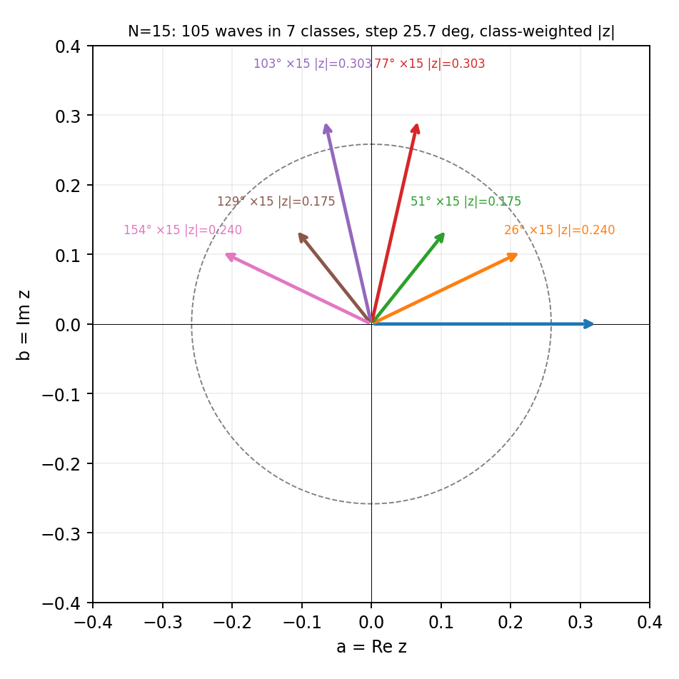

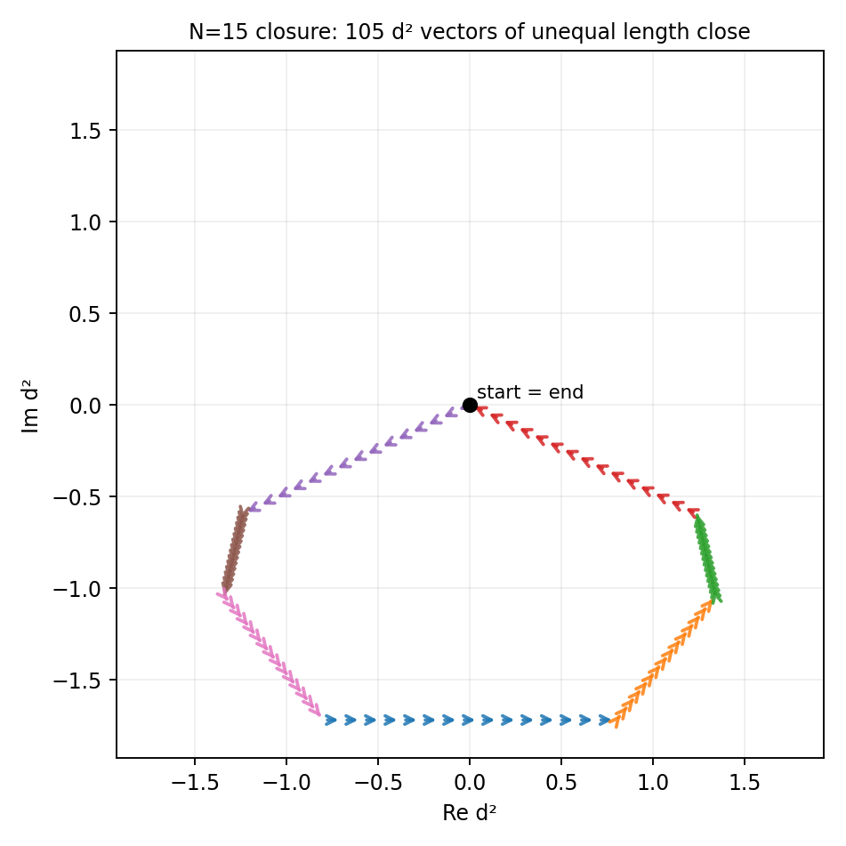

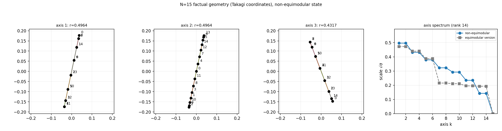

## 15. N=16 の全展開

### 15.0 N=16 の複素シンプレックスの定義

頂点 16 個 {0,…,15}。2 点の組は M = 16×15/2 = 120 個。各組に波 z が 1 個（実数 240 個が状態の全て）。2 乗距離は d² = z²。**N=16 の複素シンプレックスとは、16 頂点とこの 120 個の複素 2 乗距離の組**。

### 15.1 数え上げ（N=16）

| 量 | 値 | 計算 |
|---|---|---|
| 頂点 | 16 | — |
| 波の総数 M | 120 | 16×15/2 |
| 辺 | 16 | 円周の隣どうしの 16 本 |
| 対角線 | 104 | M − N = 120 − 16 |
| 面（三角形） | 560 | C(16,3) |
| 位相の種類 | 15（θ = k×12°） | §15.2 の構成（等モジュラー版：15） |
| 大きさ \|z\| の種類 | 8 | §15.2（等モジュラー版：1） |
| d² の角度の種類 | 15 | 位相の 2 倍 |
| rank | 15 = N−1 | §15.4 の計算結果（等モジュラー版：15） |

### 15.2 波の値 (a, b) と構成、自己無撞着の検証

**構成（偶数 N の設計＝完全マッチング分解、位相は等モジュラー版と同一）**。16 人で全員に相手がいるペアの組ませ方（完全マッチング、1 組 8 本）が、ちょうど 15 セットで全 120 組を重複なく覆う。セット（色）c = 0..14 の波に位相 θ = c×12°（= c×180°/15）を与える。各頂点はどの色の波もちょうど 1 本ずつ持つ。
**振幅（等モジュラー版との唯一の違い）**。クラス c の振幅二乗を a_c = r̄²(1 + 0.6·cos(4πc/15))、r̄² = 1/15 とする（§0.2 の選択 (A)）。値は a_0 = 0.106666667、a_1 = 0.093431891、a_2 = 0.062485528、a_3 = 0.034305987、a_4 = 0.027540763、a_5 = 0.046666667、a_6 = 0.079027346、a_7 = 0.103208485、a_8 = 0.103208485、a_9 = 0.079027346、a_10 = 0.046666667、a_11 = 0.027540763、a_12 = 0.034305987、a_13 = 0.062485528、a_14 = 0.093431891（平均は r̄² = 1/15 = 0.066666667、‖v‖² = 120r̄² = 8 で等モジュラー版と同じ）。

**この振幅が自己無撞着を保つ理由（導出）**。組 e（クラス c）から見て他の各クラス c′ に隣接組が 2 本、同じクラスの隣接組は位相差 0 で寄与しない。一般和則（§0.1）に代入し、実部条件と虚部条件を 1 本の複素条件にまとめると ω^{−c}·Σ_{c′} a_{c′} ω^{c′} = Σ_{c′} a_{c′} + μ/1（全ての c で同じ実数）。q = 15 ≥ 3 でこれが全 c について実になるのは **Σ_c a_c ω^c = 0** のときだけで、そのとき μ = −1·Σ_c a_c = −(N−1)·r̄²。a_c = r̄²(1+0.6cos(4πc/q)) は三角和の直交性で Σ_c a_c ω^c = 0 を厳密に満たす（実測 |Σ a_c ω^c| = 3e-17）。つまり**必要なのは「振幅二乗を重みとした 1 の 15 乗根の重心が原点」であって、振幅が等しいことではない**。
スケールは規約 〈|z|²〉 = r̄² = 1/15（§0.2。‖v‖² = 120r̄² = 8、等モジュラー版と同じ）。同じクラスの波は同じ (a, b) を持つので、クラスごとに列挙する：

| クラス | θ | a_c = \|z\|² | \|z\| | a | b | 本数 | 所属する組 |
|---|---|---|---|---|---|---|---|
| 0 | 0° | 0.106666667 | 0.326598632 | +0.326598632 | +0.000000000 | 8 | (0,15) (1,14) (2,13) (3,12) (4,11) (5,10) (6,9) (7,8) |
| 1 | 12° | 0.093431891 | 0.305666306 | +0.298986764 | +0.063551599 | 8 | (0,2) (1,15) (3,14) (4,13) (5,12) (6,11) (7,10) (8,9) |
| 2 | 24° | 0.062485528 | 0.249971055 | +0.228359921 | +0.101672388 | 8 | (0,4) (1,3) (2,15) (5,14) (6,13) (7,12) (8,11) (9,10) |
| 3 | 36° | 0.034305987 | 0.185218754 | +0.149845120 | +0.108868852 | 8 | (0,6) (1,5) (2,4) (3,15) (7,14) (8,13) (9,12) (10,11) |
| 4 | 48° | 0.027540763 | 0.165954098 | +0.111044966 | +0.123327929 | 8 | (0,8) (1,7) (2,6) (3,5) (4,15) (9,14) (10,13) (11,12) |
| 5 | 60° | 0.046666667 | 0.216024690 | +0.108012345 | +0.187082869 | 8 | (0,10) (1,9) (2,8) (3,7) (4,6) (5,15) (11,14) (12,13) |
| 6 | 72° | 0.079027346 | 0.281118029 | +0.086870249 | +0.267359134 | 8 | (0,12) (1,11) (2,10) (3,9) (4,8) (5,7) (6,15) (13,14) |
| 7 | 84° | 0.103208485 | 0.321260774 | +0.033580895 | +0.319500874 | 8 | (0,14) (1,13) (2,12) (3,11) (4,10) (5,9) (6,8) (7,15) |
| 8 | 96° | 0.103208485 | 0.321260774 | -0.033580895 | +0.319500874 | 8 | (0,1) (2,14) (3,13) (4,12) (5,11) (6,10) (7,9) (8,15) |
| 9 | 108° | 0.079027346 | 0.281118029 | -0.086870249 | +0.267359134 | 8 | (0,3) (1,2) (4,14) (5,13) (6,12) (7,11) (8,10) (9,15) |
| 10 | 120° | 0.046666667 | 0.216024690 | -0.108012345 | +0.187082869 | 8 | (0,5) (1,4) (2,3) (6,14) (7,13) (8,12) (9,11) (10,15) |
| 11 | 132° | 0.027540763 | 0.165954098 | -0.111044966 | +0.123327929 | 8 | (0,7) (1,6) (2,5) (3,4) (8,14) (9,13) (10,12) (11,15) |
| 12 | 144° | 0.034305987 | 0.185218754 | -0.149845120 | +0.108868852 | 8 | (0,9) (1,8) (2,7) (3,6) (4,5) (10,14) (11,13) (12,15) |
| 13 | 156° | 0.062485528 | 0.249971055 | -0.228359921 | +0.101672388 | 8 | (0,11) (1,10) (2,9) (3,8) (4,7) (5,6) (12,14) (13,15) |
| 14 | 168° | 0.093431891 | 0.305666306 | -0.298986764 | +0.063551599 | 8 | (0,13) (1,12) (2,11) (3,10) (4,9) (5,8) (6,7) (14,15) |

**自己無撞着の検証【定理・実測】**：一般和則（§0.1）を全 120 組で数値検査——実部条件 Σ_f |z_f|² sin²φ の値は全組で 1.000000000（ばらつき 4e-16。= −μ）、虚部条件 |Σ_f |z_f|² sin2φ| ≤ 2e-16。方程式の残差 1.5e-16。よって **μ = -1.000000000** = −(N−1)·r̄² = −1——**等モジュラー版と同じ値**（-1.000000000）。
※この族は q−3 = 12 個の実パラメータを持つ連続族で、等モジュラー版はその 1 点（ε=0）である。

### 15.3 2 乗距離（クラスごと）

| クラス | d² の角度 | \|d²\| = a_c | d² の値 |
|---|---|---|---|
| 0 | 0° | 0.106666667 | +0.106666667+0.000000000i |
| 1 | 24° | 0.093431891 | +0.085354280+0.038002174i |
| 2 | 48° | 0.062485528 | +0.041810979+0.046435797i |
| 3 | 72° | 0.034305987 | +0.010601133+0.032626932i |
| 4 | 96° | 0.027540763 | -0.002878794+0.027389891i |
| 5 | 120° | 0.046666667 | -0.023333333+0.040414519i |
| 6 | 144° | 0.079027346 | -0.063934466+0.046451109i |
| 7 | 168° | 0.103208485 | -0.100953132+0.021458251i |
| 8 | 192° | 0.103208485 | -0.100953132-0.021458251i |
| 9 | 216° | 0.079027346 | -0.063934466-0.046451109i |
| 10 | 240° | 0.046666667 | -0.023333333-0.040414519i |
| 11 | 264° | 0.027540763 | -0.002878794-0.027389891i |
| 12 | 288° | 0.034305987 | +0.010601133-0.032626932i |
| 13 | 312° | 0.062485528 | +0.041810979-0.046435797i |
| 14 | 336° | 0.093431891 | +0.085354280-0.038002174i |

**角度は等モジュラー版と同じ、大きさ |d²| = a_c がクラスごとに違う。**

### 15.4 閉塞の判定・B 行列と形

- **大域閉塞【定理・実測】**：全体では各色が 8 本ずつ → 8×Σ_c a_c ω^c = 0。実測 |Σz²| = 5e-16。
- **局所閉塞【定理・実測】**：各頂点は 15 色を 1 本ずつ持つ。d² は色 c で a_c·ω^c（ω = e^{i·360°/15}）なので局所和 = Σ_c a_c ω^c = 0（§15.2 の条件そのもの）。実測 max|局所和| = 6e-17。よって**全頂点が複素ヌル錐上**（埋め込みで max|x·x| = 2e-16）。
- **B = −½JD²J の Takagi 軸【実測・機械精度】**：軸スケールの相異なる値は 0.683422641、0.417190827、0.383817946、0.383816121、0.327690179、0.216661218、0.216341731、0.204193664、0.202257764、0.177464478、0.176616856、0.147638372、0.145998388、0.131171032、0.130710504 （等長でない。相異なる値 15 種）。**等モジュラー版**：0.683130051、0.365148372、0.182574186（相異なる値 3 種）。rank = 15。頂点のエルミート半径：0.366367142、0.303382621、0.302368538、0.299235964、0.293824067、0.286186942、0.277008058、0.268094053、0.262369923。埋め込みの距離再現誤差 max = 5e-16。

### 15.5 N=16 のまとめ（種別）

- 【選択＋実測】クラス重み付き（振幅二乗 a_c = r̄²(1+0.6cos(4πc/q))）の状態は自己無撞着（残差 1e-16）。等モジュラーは**使っていない**。
- 【定理・実測】大域閉塞は成立。局所閉塞は成立（全頂点が複素ヌル錐上）。
- 【定理】μ = -1.000000000 = −(N−1)·〈|z|²〉：等モジュラー版と同一（μ は平均振幅二乗だけで決まる）。
- 【実測（機械精度）】rank = 15（最大次元）、軸は等長でない（等モジュラー版：相異なる値 3 種）。**等モジュラー版との差は形（Takagi 軸）だけ**。
- 【規約の帰結】大きさに制限はない（スケール対称性）。

### 図（N=16）

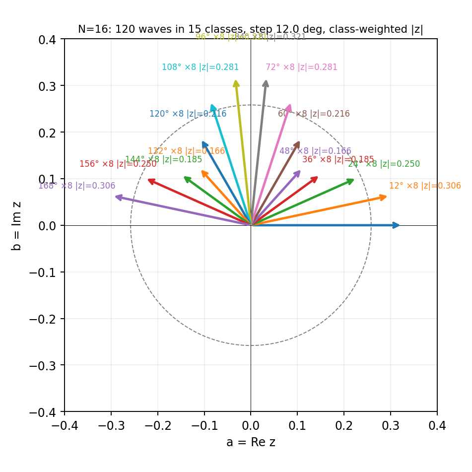

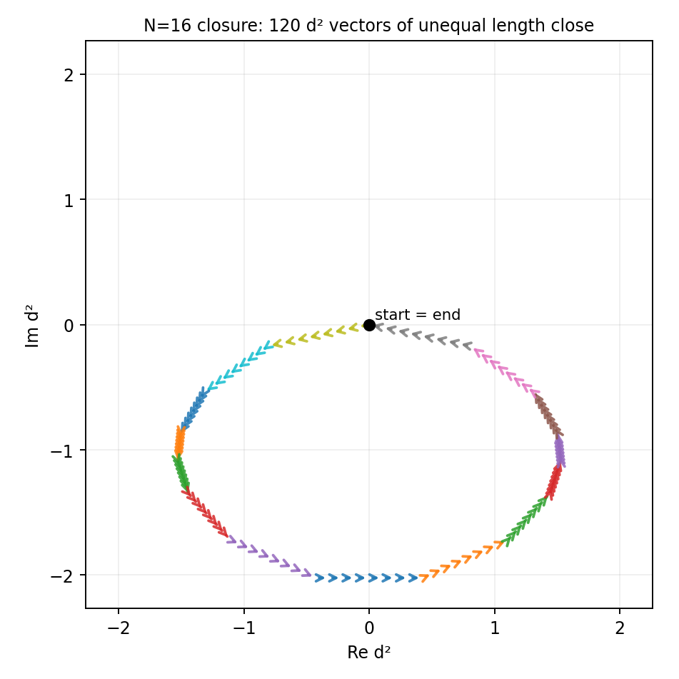

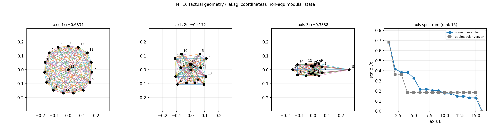

## 16. 全 N の一覧表（まとめ）

各 N の節で個別に導いた数え上げと計算結果を、最後に一覧する（§1 の方針どおり、ここで初めて表にする）。「/」の左が本文書（非等モジュラー）、右が等モジュラー版の値。代表状態 A＝クラス重み付き族、B＝多様体上の代表点（§0.2）。軸の形：丸＝全軸等長、非＝等長でない。局所閉塞：○＝成立、×＝破れ、—＝不可能。

| N | 頂点 | 波 M | 辺 | 対角線 | 面 | 代表 | 位相の種類 | 大きさの種類 | d² 角度 | 局所閉塞 | rank | 軸の形 |
|---|---|---|---|---|---|---|---|---|---|---|---|---|
| 3 | 3 | 3 | 3 | 0 | 1 | B | 3 / 3 | 3 / 1 | 3 | **×** / — | 2 / 1 | 非 / 丸 |
| 4 | 4 | 6 | 4 | 2 | 4 | B | 4 / 3 | 6 / 1 | 4 | **×** / ○ | 3 / 3 | 非 / 丸 |
| 5 | 5 | 10 | 5 | 5 | 10 | B | 10 / 2 | 10 / 1 | 10 | ○ / ○ | 4 / 4 | 非 / 丸 |
| 6 | 6 | 15 | 6 | 9 | 20 | A | 5 / 5 | 3 / 1 | 5 | ○ / ○ | 5 / 5 | 非 / 非 |
| 7 | 7 | 21 | 7 | 14 | 35 | B | 21 / 3 | 21 / 1 | 21 | ○ / ○ | 6 / 6 | 非 / 丸 |
| 8 | 8 | 28 | 8 | 20 | 56 | A | 7 / 7 | 4 / 1 | 7 | ○ / ○ | 7 / 7 | 非 / 非 |
| 9 | 9 | 36 | 9 | 27 | 84 | A | 4 / 4 | 2 / 1 | 4 | ○ / ○ | 8 / 8 | 非 / 非 |
| 10 | 10 | 45 | 10 | 35 | 120 | A | 9 / 9 | 5 / 1 | 9 | ○ / ○ | 9 / 9 | 非 / 非 |
| 11 | 11 | 55 | 11 | 44 | 165 | A | 5 / 5 | 3 / 1 | 5 | ○ / ○ | 10 / 10 | 非 / 非 |
| 12 | 12 | 66 | 12 | 54 | 220 | A | 11 / 11 | 6 / 1 | 11 | ○ / ○ | 11 / 11 | 非 / 非 |
| 13 | 13 | 78 | 13 | 65 | 286 | A | 6 / 6 | 2 / 1 | 6 | ○ / ○ | 12 / 12 | 非 / 非 |
| 14 | 14 | 91 | 14 | 77 | 364 | A | 13 / 13 | 7 / 1 | 13 | ○ / ○ | 13 / 13 | 非 / 非 |
| 15 | 15 | 105 | 15 | 90 | 455 | A | 7 / 7 | 4 / 1 | 7 | ○ / ○ | 14 / 14 | 非 / 非 |
| 16 | 16 | 120 | 16 | 104 | 560 | A | 15 / 15 | 8 / 1 | 15 | ○ / ○ | 15 / 15 | 非 / 非 |

注：

- μ は全 N で等モジュラー版と同じ値（μ = −(N−1)·r̄²、N=3 は −3r̄²/2）。μ は平均振幅二乗で決まり、振幅の分布によらない。
- 大域閉塞 Σz² = 0 は全 N で成立（定理）。局所閉塞は N=5〜16 で成立（(A) はクラス条件 Σa_cω^c = 0 から自動、N=5,7 は分枝の選択）、N=3 は不可能、N=4 は非等モジュラーにすると必ず破れる。
- rank は全 N で最大（N−1）。**N=3 も rank 2** に達する（等モジュラー版の rank 1 は等モジュラー点の退化）。
- 軸が全て等長（丸い）な N は**ない**。等モジュラー版で丸かった N=4,5,7 も、大きさを崩すと丸くない。丸さは等モジュラー点の性質。
- d² が実数の N は**ない**（等モジュラー版の N=5 だけの実埋め込みは消える）。
- 等モジュラー版と違うのは「大きさの種類」「軸の形」（および N=4 の局所閉塞、N=3 の rank）だけで、数え上げ・μ・大域閉塞・rank の最大性は同じ。
