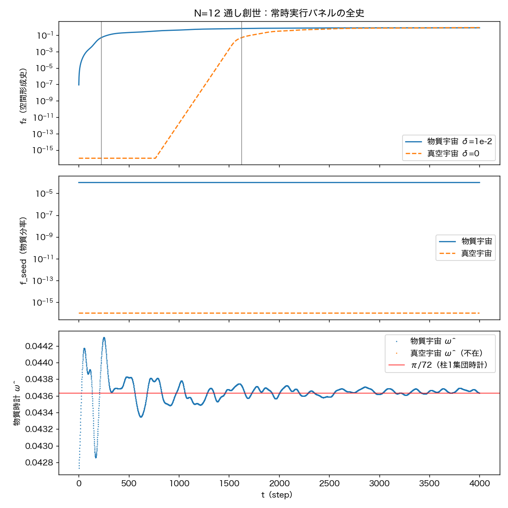
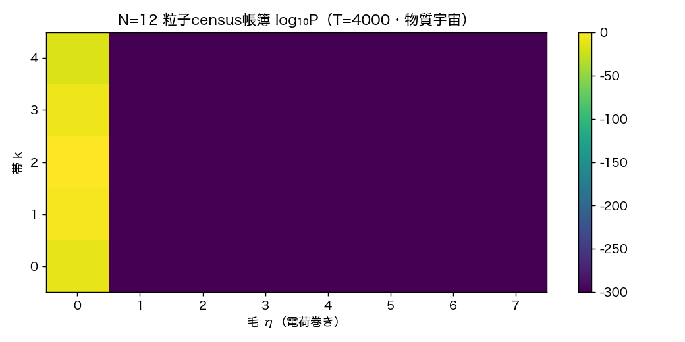
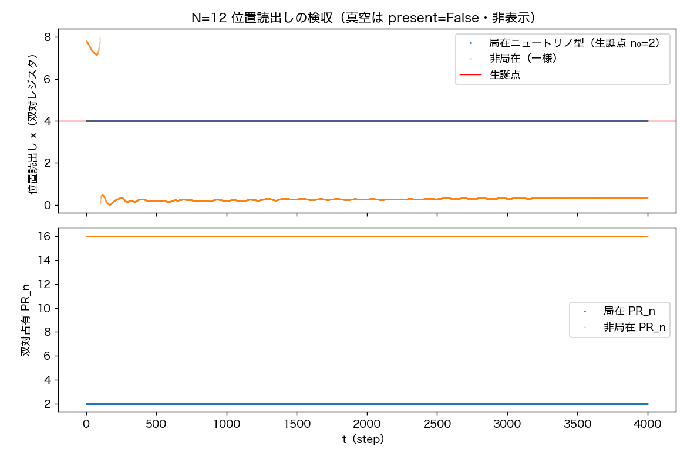

# 粒子実験テストベッド仕様書 v1

**著者**: 木原範昭
**日付**: 2026年8月7日
**種別**: 仕様書（テスト環境の前提条件・構成・基準値の明示）

---

## 1. 目的と適用範囲

本書は、波の力学シリーズにおける粒子実験（EPR・ベル・衝突・観測理論等）の
共通テスト環境の仕様を定める。以後の粒子実験は本仕様の環境と関数を使用する。

## 2. 参照

- 統一関数モジュール: `../統一万能関数_v1/`
  （unified_interaction_v1.py / unified_readout_v1.py / run_qualification_v1.py）
- 力学の正本系譜: 万能非弾性写像 v3（二体・doi:10.5281/zenodo.21808091系）、
  N体Cayley系（自発的分裂予備実験）、多体レジスタ系（多体接続・
  doi:10.5281/zenodo.21809814）
- 読出しの定義: 重力読出し論文 §2.2（doi:10.5281/zenodo.21832257）、
  周期表 v2（doi:10.5281/zenodo.21830706）
- 空間・時間の創発: 空間軸3軸と固有時間の創生（doi:10.5281/zenodo.21816651）

## 3. 前提条件と仮定

1. 力学 F と読出し G は宇宙の第0ステップから毎ステップ・一様に実行される。
   計器の途中投入・時代による切替・適応的サンプリングは行わない。
2. 外部干渉は、宇宙安定後の粒子投入（神の手）一回のみとし、イベントとして
   記録する。
3. 真空宇宙（シードなし）では空間は形成されるが、固有時間は取得できない。
   実験は物質を含む物理的真空の上で行う。
4. 時刻参照は物質時計 ω=π/72（U^144 集団時計）とする。ω は N に依存しない。
5. 物質生成は毛の和則 m* = 2·m_pump − m_seed の指定する帳簿セルに限られる。
6. 少数体特異域（N≤6）はテスト環境として使用しない。

## 4. 統一関数の仕様

### 4.1 統一万能相互作用関数（unified_interaction_v1.py）

- 建築: F[Ψ] = R(G[Ψ])·Ψ。IF文なし・種別分岐なし・調整定数なし。
- UnifiedEngine: 状態 C2 ∈ ℂ^(M×Nn×Nη)、M=N(N−1)/2。
  - 線形部: 共有O。θ̄_e = arg Σ_k c_e[k] → LowRankSystem.set_theta →
    σ_max（warm-start冪反復）→ Cayley直交步 (I−γK̃)⁻¹(I+γK̃)。
  - 読出し（生成子側）: θ = atan2(√P_f, √P_b)、R = scale·sin²θ。
  - 非線形部: 媒介頂点 0.5i(R(cA·W−cB·W̄)+(cAR·W−cBR·W̄))、RK4部分步。
  - Nη=1 で正本 VertexEngineV2 に退化する。
- build_standard_universe(n, δ): 標準宇宙の構成。
  真空 = control親（k=2, 毛0）。シード = 親第1セクション状態×δ（k=1, 毛0）。
  δ>0 で物質宇宙、δ=0 で真空宇宙。
- 二体力学は collision_step_exact の再輸出のみを使用する。

### 4.2 統一場の万能読出関数（unified_readout_v1.py）

規約: 純関係量のみ・パラメータなし・種別分岐なし・全時代同一定義・
毎ステップ実行・受動（状態に書かない）。判定閾値は実験側の責務。

| メンバー | 定義 |
|---|---|
| g_invariants | 総パワー P_tot |
| g_space_history | f₂ = 親平面の面外分率 |
| g_matter_fraction | f_seed = 奇数帯パワー分率 |
| g_census | 帯k × 毛η のパワー帳簿 |
| g_wave_census | セル別の波数勘定: 参加本数（振幅²>0 の厳密判定・閾値なし）と実効本数 PR_M |
| g_position_1d | 奇数帯内容の双対レジスタ巻きモーメント偏角。二重被覆種は mod Nn/2 で読む。内容なしは present=False |
| g_collective_residual | 一段残差 r（大域位相整合後の状態変化） |
| g_matter_clock | ω̂ = 生成内容の一段位相前進。担体なしは acquirable=False |

呼び出し: g_panel(C2, p2, q2, C_flat_prev, c_gen_prev)。G は無状態
（履歴は呼び出し側が _carry で持ち回す）。

## 5. 粒子の同定（周期表 [4] による翻訳）

本テストベッドは物理同定済みである。内部レジスタの巻き（毛 η）は
周期表 [4] の電荷則 Q=η/3 により粒子種に同定される。本書は以後、
同定名で表記する。

| 巻き η | 電荷 Q=η/3 | パリティ | 同定（周期表 [4]） |
|---|---|---|---|
| 0 | 0 | 奇数帯（フェルミオン） | ニュートリノ型 |
| 0 | 0 | 偶数帯（ボゾン） | 光子型 |
| −3 | −1 | 奇数帯 | 電子型 |
| +3 | +1 | 奇数帯 | 陽電子型 |
| +2 | +2/3（単独不可読） | 奇数帯 | u型クォーク |
| −1 | −1/3（単独不可読） | 奇数帯 | d型クォーク |

3∤η の種は単独では電荷が読めない（閉じ込め・周期表柱2）。

## 6. 標準テスト環境の仕様

| 項目 | 値 |
|---|---|
| N（ノード数） | 12（M=66） |
| レジスタ | 帯 Nn=5（時代・census作業）／Nn=16（位置・ドメイン作業・正本[2] v3準拠）、毛 Nη=8 |
| 宇宙の準備 | build_standard_universe による通し創世（T≥4000） |
| 標準物質レシピ | 中性（ポンプ巻き0 × シード巻き0）→ 生成物質は**ニュートリノ型のみ**（§5） |
| シード振幅 δ | 制御窓 [10⁻³, 10⁻¹]。物質量 f ≈ δ² |
| 時刻参照 | 物質時計 ω=π/72 |
| 粒子投入 | 宇宙安定後（crossing＋凝縮完了以降）に一回 |

## 7. 検収項目と結果

### 6.1 統一関数の資格審査（run_qualification_v1.py）

| 項目 | 内容 | 結果 |
|---|---|---|
| Q1 | UnifiedEngine と検証済エンジンのビット一致（T=200） | PASS |
| Q2 | Nη=1 退化と正本 VertexEngineV2 のビット一致（T=200） | PASS |
| Q3 | 読出し f₂・r と正本式の一致（差 0.0e+00） | PASS |
| Q4 | 読出しの受動性（パネル有無でビット一致） | PASS |
| Q5 | 二体正本の閉塞保存（2.0e-18／50衝突） | PASS |

### 6.2 環境の検収（run_tb_genesis_universe_v2.py・N=4,6,12,20,50,100）

| 項目 | 内容 | 結果 |
|---|---|---|
| 全時代定義性 | 常時パネルの NaN/Inf ゼロ | PASS |
| 受動性 | パネル有無でビット一致 | PASS |
| 時代構造 | crossing → 凝縮 → 時代変調（g_meta > g_lat） | PASS |
| 真空対照 | 空間形成あり・物質 0・時計取得不能 | PASS |
| census決定性 | 帳簿外比 ≤ 10⁻⁸（毛外 0） | PASS |

## 8. 基準値（対照データ）

今後のテストでの本仕様での対照条件として基準点の情報を取得した。
取得した情報は本仕様書の仮定と条件での値であり、今後の条件変更や
テストベッドの仕様変更があった場合は、別途再取得する。

### 8.1 通し創世の基準値（δ=10⁻² 物質宇宙／δ=0 真空宇宙・T=4000）

| N | M | crossing（物質） | crossing（真空） | f_seed（物質） | f_seed（真空） | ω̂（物質） | ω̂ 取得率（真空） |
|---|---|---|---|---|---|---|---|
| 4 | 6 | 164 | 991 | 1.15e-4 | 0 | 0.0435±0.0006 | 0.00 |
| 6 | 15 | 238 | 1413 | 1.00e-4 | 0 | 0.0436±0.0004 | 0.00 |
| 12 | 66 | 224 | 1624 | 1.00e-4 | 0 | 0.0437±0.0002 | 0.00 |
| 20 | 190 | 277 | 1617 | 1.00e-4 | 0 | 0.0436 | 0.00 |
| 50 | 1225 | 368 | 2445 | 1.00e-4 | 0 | 0.0436 | 0.00 |
| 100 | 4950 | 835 | 2383 | 1.00e-4 | 0 | 0.0436 | 0.00 |

ω̂ の全N平均は π/72 = 0.04363 に一致する。

#### 8.1a 数え上げ規定（本仕様の中核・誤読防止）

粒子の勘定は、モード枠 → 帳簿 → 種 → 占有 → 個数 という同一対象の
縮約の階梯である。各段は別の主題ではなく、同じ「モードの励起」を
異なる粒度で数えたものである。定義・式・値を固定する。

**(1) モード枠 D**
定義: この宇宙に存在し得る全内容の枠。式: D = M × Nn × Nη（複素）。
値: 66×5×8 = **2640 モード**（Nn=16 では 8448）。
**存在し得る全ての粒子内容は、この 2640 モードの励起として存在する。
周期表 [4] は、まさにこのモード枠の分類表である。** 三方向の意味は:
M方向（66）＝同一内容の関係網上の展開（空間的広がりの自由度）、
帯方向（Nn）＝内容の形（倍音構造・パリティ＝統計）、
巻き方向（Nη）＝電荷番地。

**(2) 帳簿セル B**
定義: モード枠を（帯 k, 巻き η）で集約した勘定単位——M方向（同一セル
内容の空間展開）を潰した集約であり、census はこの粒度で数える。
式: B = Nn × Nη。
値: 5×8 = **40**（内訳: 奇数帯セル 2×8=16・偶数帯セル 2×8=16・
零モード行 1×8=8。Nn=16 では 128 = 64＋56＋8）。

**(3) 種クラス S**
定義: 種の分類子は（統計パリティ, 巻き η）の対である。統計パリティは
エンジンの奇偶マスク（奇数帯=フェルミオン型・偶数帯=ボゾン型・
k=0 は零モードでいずれの種にも属さない）。式: S = 2 × Nη。
値: 2×8 = **16 クラス**（同定は §5: ニュートリノ型=(奇,0)、
光子型=(偶,0)、電子型=(奇,−3) 等）。
**同一パリティ内の複数の帯（奇: k=1,3）は別の種ではなく、同一種の
内部形（倍音構造）である**——局在には全奇数帯の重ね合わせを要する
（§8.5）ことがその証左。

**(4) 場の量**
定義: 種クラスごとのパワー（連続量・個数ではない）。
標準物質宇宙（N=12・δ=10⁻²・T=4000）の値:

| 種クラス（パリティ, η） | 同定 | パワー | 帯内訳 |
|---|---|---|---|
| (偶, 0) | 光子型（凝縮体＝真空） | 0.99990 | k=2: ほぼ全量・k=4: 1.8e-16 |
| (奇, 0) | ニュートリノ型（物質） | 1.0005e-4 | k=1: 99.973%・k=3: 0.027% |
| 零モード | （種ではない） | 1.7e-11 | k=0 |
| 他の 14 クラス | 荷電種ほか | **厳密 0** | — |

占有: **2/16 クラス**。

**(5) 粒子数（波の数）n**
定義: **周期表は波の表であり、粒子＝波、個数＝波の本数である。**
種セルの内容に参加する関係波の本数を数える。粗数え＝非零参加本数、
実効本数＝参加比 PR_M（=(Σ|c|²)²/Σ|c|⁴・M方向）。
値（N=12・δ=10⁻²・T=4000 終端・実測）:
光子型凝縮体 **66本**（実効 65.94）／ニュートリノ型シード起源 **66本**
（実効 40.32）／ニュートリノ型生成 **66本**（実効 65.90）／
荷電種 **0本（厳密）**。全関係波 M=**66本**——各波は複数種の内容を
重ね持つ（重ね合わせ）ため、種別参加本数の単純和は 66 を超える。
補助読出し（別の量）: 局在ドメイン数（ωロック局在塊の数・周期表柱9）
——標準宇宙 0（全内容が非局在）・局在構成 1（§8.5）。これは「局在した
可算塊」の計数であって波の本数ではない。

**縮約の階梯（要約）**:
D=2640 モード枠（周期表の分類対象・粒子はその励起）
→ B=40 帳簿セル（M方向を潰した勘定）
→ S=16 種クラス（周期表 [4] の分類: パリティ×巻き）
→ 占有 2 クラス（光子型・ニュートリノ型）
→ 波の数: 光子型 66本（実効65.94）・ニュートリノ型 66本・荷電種 0本
（局在ドメイン数は別読出し: 標準 0・局在構成 1）。
同じ励起を、枠→帳簿→種→量→本数の順に粗視化して数えている。

**表の読み方**: crossing = 急拡大の検出時刻（f₂>0.05・物質宇宙は
シード点火・真空宇宙は内在床点火）。f_seed = 奇数帯パワー分率
（＝ニュートリノ型の場の量）。ω̂ = 物質時計。

#### 8.1b 標準物質宇宙の全粒子一覧（N=12・δ=10⁻²・T=4000 終端・帳簿全セル）

| 帯 k | 巻き η | 同定（§5） | 場の量（パワー） | 全体構成比 | 物質内構成比 | 波の数（本） | 実効本数 PR_M |
|---|---|---|---|---|---|---|---|
| 2 | 0 | 光子型凝縮体（真空・ポンプ） | 1.0000 | 99.990% | — | **66** | 65.94 |
| 1 | 0 | **ニュートリノ型（シード起源）** | 1.0003e-4 | 1.0002e-4 | **99.973%** | 66 | 40.32 |
| 3 | 0 | **ニュートリノ型（生成・相棒帯）** | 2.653e-8 | 2.653e-8 | 0.027% | 66 | 65.90 |
| 0 | 0 | 一様モード（凝縮体の零モード） | 1.67e-11 | 1.67e-11 | — | 66 | 53.38 |
| 4 | 0 | 光子型（高次帯） | 1.76e-16 | 1.76e-16 | — | 66 | 65.66 |
| 全ての η≠0 | — | 荷電種（電子型・クォーク型等） | **厳密 0** | 0 | 0 | **0** | 0 |
| **全関係波** | | | **1.0001** | **100%** | | **M = 66 本** | |

**N=12 標準物質宇宙の波の数 = M = 66 本。** 66本すべてが光子型凝縮体に
参加し（実効 65.94 本）、**マクロに多数の光子型の波が真空を構成する**。
同じ66本がニュートリノ型内容も重ね持つ（重ね合わせ——種別参加本数の
単純和は66を超える）。荷電種の波は **0 本（厳密）**。
局在ドメイン数（可算な局在塊・別読出し）: 標準 0・局在構成 1（§8.5）。
本表の波数・実効本数は統一 G の g_wave_census による読出し値である
（内部状態の直接読取りは禁止・§3-1 のルールに従う）。
ABCD 投入実験の検収はこの表の形式（波の数＋実効本数＋ドメイン数）で行う。
構成比はパワー基準。

**図1**: N=12 通し創世の常時パネル全史。上: f₂（空間形成史・物質宇宙と
真空宇宙）。中: f_seed（物質分率）。下: 物質時計 ω̂ の π/72 への定着
（真空宇宙は時計不在）。

**図2**: N=12 粒子census帳簿（帯k×毛η・log₁₀P・T=4000）。生成内容は
毛0の列のみ。

### 8.2 物質生成の基準値（V2 census・N=12・T=300）

| レシピ | 予言 m* | 巻き集中度 | 生成種の同定 | f_final（δ=10⁻²） | 後期成長率 |
|---|---|---|---|---|
| 中性（巻き0×巻き0） | 0 | 1.0000 | ニュートリノ型 | 1.0e-4 | ≤ 8e-5/step |
| 対照（巻き2×巻き1） | 3 | 1.0000 | 陽電子型（+3） | 1.0e-4 | 同上 |

決定論再現: 同一シードで差 0.0e+00。ノルムドリフト ≤ 1e-13。

### 8.3 安定窓の背景統計（各Nの npz・JSON に全系列を収録）

安定窓 [2000, 4000] における f₂・f_seed・r・ノルムの平均・標準偏差・
ドリフトを result_tb_genesis_universe_v2.json に記録した。

### 8.4 少数体域の参考値

N=4 は第3次元が結晶化しない（三方向準安定の後期持続率 0.27）。
N=5 は結晶化するが曖昧さ最大・結晶学的禁止位数。N≤6 は使用しない（§3-6）。

### 8.5 xyzt 読出しの基準値

位置読出し（統一 G の g_position_1d・二重被覆対応）の検収
（run_tb_position_readout_v1.py・N=12・Nn=16・T=4000）:

| 構成 | 位置読み値 | 生誕点との偏差 | ドメイン PR_n | 重心std |
|---|---|---|---|---|
| 局在ニュートリノ型 | 4.000（mod Nn/2・被覆2） | 0.000 セル | 2.00（維持） | 0.000 |
| 非局在（一様） | present=True | — | 16.00（一様の署名） | — |
| 真空（物質なし） | present=False | — | — | — |

奇数帯（フェルミオン型）内容は対蹠二点構造（周期表柱7）を持ち、
位置は巻き数2モーメントにより mod Nn/2 で読む（統一 G が被覆を判定して
出力する）。物質は生誕位置に留まり、真空は空として読める。

**図3**: 位置読出しの検収（Nn=16）。局在ニュートリノ型は生誕点に静止、
非局在は一様、真空は不在指標。

3次元（x, y, z）＋τ の読出しは正本 [2] の 3D レジスタ実測を参照値とする
（D=(8,8,8)・予言速度 (0.05, 0.03, 0.02) セル/step）:

| τ（step） | 読出し (x,y,z) | 予言 | 偏差 |
|---|---|---|---|
| 100 | (1.0, 3.0, 2.0) | (1.0, 3.0, 2.0) | (0.0, 0.0, 0.0) |
| 200 | (2.0, 6.0, 4.0) | (2.0, 6.0, 4.0) | (0.0, 0.0, 0.0) |
| 300 | (3.0, 1.0, 6.0) | (3.0, 1.0, 6.0) | (0.0, 0.0, 0.0) |

PR は全時刻 3.39 で一定（剛体並進）。τ は §8.1 の物質時計（ω=π/72）で
読む。3D 読出しの統一 G への統合は §9-2 の未確定項目である。

## 9. 未確定項目

1. **スピン読出し: 汎用万能読出関数が未確定。今後の実験で確定する。**
   確定までスピンを要する実験は本テストベッドで実施しない。
2. 統一 G の位置読出しは 1D（二重被覆対応済・Nn=16 で検収済）。3D（xyz）は正本 [2] の 3D レジスタ読出しの統合後に追加する。
3. 長期飽和（T≫4000）は未取得。
5. 粒子数の読出し（ωロック同値類の数・周期表柱9）は統一 G に未実装。
   実装までの構成比はパワー基準（§8.1b）。
4. シードレシピは中性・対照の2種のみ検収済み。

## 10. 保守条項

今後のテストで本仕様の前提（§3）との不一致が見つかった場合は、
テストベッドを見直し、本仕様書を改訂する。基準値（§7）は改訂の都度、
再取得する。

## 11. 再現性

全検収スクリプト・結果 JSON・図・全史 npz は
`../統一万能関数_v1/` および本フォルダ（`./`）
に置く。判定基準は各スクリプト冒頭に実行前固定で記録した。
図は保存済みデータのみから再生成できる。

## 引用文献

[1] 木原範昭, フェルミオン的構造の生成——万能非弾性写像, Zenodo (2026). doi:10.5281/zenodo.21808091
[2] 木原範昭, インフレーションの終わり方が物質生成の始まり方である（多体接続）, Zenodo (2026). doi:10.5281/zenodo.21809814
[3] 木原範昭, 空間軸3軸と固有時間の創生, Zenodo (2026). doi:10.5281/zenodo.21816651
[4] 木原範昭, 波の周期表 v2, Zenodo (2026). doi:10.5281/zenodo.21830706
[5] 木原範昭, 波と場の二層分離——場の読出し万能関数によるゲージ場と重力場の統合, Zenodo (2026). doi:10.5281/zenodo.21832257
[6] 木原範昭, 二段階seed除去による準安定相の因果分離（第8論文）, Zenodo (2026). doi:10.5281/zenodo.21614402
[7] 木原範昭, 開始様式の判別——増幅と不安定な相対平衡, Zenodo (2026). doi:10.5281/zenodo.21798854
