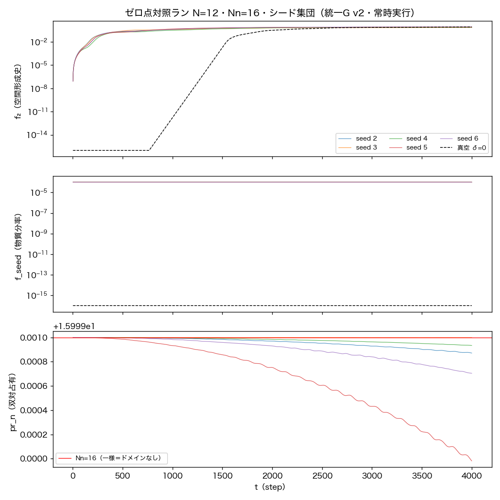

# 粒子実験テストベッド仕様書 v2

**著者**: 木原範昭
**日付**: 2026年8月8日
**種別**: 仕様書（テスト環境の前提条件・構成・基準値の明示）
**位置づけ**: v1（2026-08-07）の監査による全面改訂。v1 の基準値は本書で置き換える。

---

## 0. 改訂の理由と是正記録

v1 の公開前監査（2026-08-08・全数値の再検証）により、仕様として成立して
いない箇所が六つ見つかった。**力学 F の側に誤りはなく、通し創世の物理的
結論（crossing・ω=π/72・真空対照・和則・δ²則）は統一読出しで再導出しても
最大差 0.0e+00 で一致した。** 欠陥はすべて読出しと基準値の側にあった。

| # | v1 の欠陥 | 是正 |
|---|---|---|
| 1 | **数え上げが機能していない**: 「波の本数」は `count = #(振幅²>0)` の台集合濃度であり、到達可能な全セルが例外なく M=66 になる（パワー 1.0 の凝縮体も 9.1e-22 の数値塵も同じ 66）。`count ≡ M×(power>0)` で情報量ゼロ。 | 個数を較正で定義し直した（§8.1）。ε＝単一局在ドメインのパワー、n̂_P=P/ε、n̂_PR=pr_n/pr_n(単一)。較正実験で加法性と力学下の整数保存を実測（§7.4）。 |
| 2 | **数え上げの値が実験環境の値でない**: D=2640・B=40・占有2/16 は Nn=5 専用。実験が走る Nn=16 では B=128・D=8448 で別の帳簿になる。 | 標準環境を **Nn=16 に一本化**（§6）。基準値は全て Nn=16 で再取得（§8）。Nn=5 の値は歴史的記録として §8.5 に退避。 |
| 3 | **ゼロ点になっていない**: 単一シード・単一終端の一点値で、ゆらぎ帯がない。 | シード集団（5本）×全ステップ時系列で平均・std・分位を取得（§8.2）。 |
| 4 | **「安定窓」が定常でない**: f₂ は窓内で 8–24% ドリフトしていた。 | 定常性を検定し、定常な量と非定常な量を分類して明記（§8.2）。**f₂・一段残差 r・時計担体パワーは T=4000 では未飽和**——基準値として使えないことを明示。 |
| 5 | **記録の欠落**: 結果 JSON に N=20/50/100 しか残っておらず、標準テストベッド N=12 の検収記録が存在しなかった（後続実行で上書き）。§8.1b の表を作ったスクリプトも存在せず再現不能。 | 全基準値を単一スクリプト `run_tb_zeropoint_Nn16_v1.py` で取得し、JSON・npz・図を同時保存（§11）。 |
| 6 | **手続き違反**: 通し創世ランは統一 G を一度も呼んでおらず、読出しはインライン実装だった（G モジュールは走行の18分後に作成）。位置の全史は二重被覆非対応の旧読出しで、統一 G と最大 4.49 セルずれる。 | 全実験を統一 G 経由に統一。位置は選択層を宣言して適用（§4.3）。 |

**設計上の総括**: v1 の G は「曖昧さの読出し」と「どれを採るかの選択」を一体に
焼き込み、確定値をひとつだけ返していた。低N の系では粒子としての存在性・
空間の次元・時間の存在そのものが曖昧であり、**確定して見えるのは読出し側の
選択の結果である**——という本シリーズの立場に対し、v1 の読出し関数の型は
矛盾していた。v2 は G から選択を外に出す（§4.2・§4.3）。

---

## 1. 目的と適用範囲

本書は、波の力学シリーズにおける粒子実験（EPR・ベル・衝突・観測理論等）の
共通テスト環境の仕様を定める。以後の粒子実験は本仕様の環境と関数を使用する。

## 2. 参照

- 統一関数モジュール: `../統一万能関数_v1/`
  （unified_interaction_v1.py / unified_readout_v2.py / selection_v1.py /
  run_qualification_v1.py / run_qualification_readout_v2.py）
- 力学の正本系譜: 万能非弾性写像 v3（二体・doi:10.5281/zenodo.21808091系）、
  N体Cayley系（自発的分裂予備実験）、多体レジスタ系（多体接続・
  doi:10.5281/zenodo.21809814）
- 読出しの定義: 重力読出し論文 §2.2（doi:10.5281/zenodo.21832257）、
  周期表 v2（doi:10.5281/zenodo.21830706）
- 空間・時間の創発: 空間軸3軸と固有時間の創生（doi:10.5281/zenodo.21816651）

## 3. 前提条件と仮定

1. 力学 F と読出し G は宇宙の第0ステップから毎ステップ・一様に実行される。
   計器の途中投入・時代による切替・適応的サンプリングは行わない。
2. **読出しは統一 G のみを用いる。内部状態の直接読取りは禁止。**
3. **G は選択をしない（R7）。確定値が必要な場合は選択層 S を適用し、
   どの選択子とどのパラメータを使ったかを実験ごとに宣言する。**
4. 外部干渉は、宇宙安定後の粒子投入（神の手）一回のみとし、イベントとして
   記録する。
5. 真空宇宙（シードなし）では空間は形成されるが、固有時間は取得できない。
   実験は物質を含む物理的真空の上で行う。
6. 時刻参照は物質時計 ω=π/72（U^144 集団時計）とする。ω は N に依存しない。
7. 物質生成は毛の和則 m* = 2·m_pump − m_seed の指定する帳簿セルに限られる。
8. 少数体特異域（N≤6）はテスト環境として使用しない。

## 4. 統一関数の仕様

### 4.1 統一万能相互作用関数（unified_interaction_v1.py）

- 建築: F[Ψ] = R(G[Ψ])·Ψ。IF文なし・種別分岐なし・調整定数なし。
- UnifiedEngine: 状態 C2 ∈ ℂ^(M×Nn×Nη)、M=N(N−1)/2。
  - 線形部: 共有O。θ̄_e = arg Σ_k c_e[k] → LowRankSystem.set_theta →
    σ_max（warm-start冪反復）→ Cayley直交步 (I−γK̃)⁻¹(I+γK̃)。
  - 読出し（生成子側）: θ = atan2(√P_f, √P_b)、R = scale·sin²θ。
  - 非線形部: 媒介頂点 0.5i(R(cA·W−cB·W̄)+(cAR·W−cBR·W̄))、RK4部分步。
  - Nη=1 で正本 VertexEngineV2 に退化する。
- build_standard_universe(n, δ, Nn, Nη): 標準宇宙の構成。
  真空 = control親（k=2, 毛0）。シード = 親第1セクション状態×δ（k=1, 毛0）。
  δ>0 で物質宇宙、δ=0 で真空宇宙。
- 二体力学は collision_step_exact の再輸出のみを使用する。

### 4.2 統一場の万能読出関数 v2（unified_readout_v2.py・曖昧さ保存）

規約 R1–R6（純関係量・パラメータフリー・種別分岐なし・全時代同一定義・
毎ステップ実行・受動）に、**R7 曖昧さ保存**を加える:

> G は選択をしない。分岐・閾値・二値化・順序づけ・単一化を行わず、読み値は
> (値, 重み) の束として返す。不在は真偽値でなく重み 0 で表す。周期量は円上の
> 値として返し、直線への展開（巻数の累積）は呼び出し側の責務とする。縮約は
> 関係量への集約までとし、波の添字・セルの添字は保持してよい。

| メンバー | 返す束 |
|---|---|
| g_invariants | P_tot（総パワー） |
| g_space_history | f₂ = 親平面の面外分率 |
| g_matter_fraction | f_seed = 奇数帯パワー分率 |
| g_cell_ledger | cell_power（場の量）・cell_pr_m（実効本数 PR_M・連続量）・cell_support（台集合濃度） |
| g_species_content | per_wave_power・per_wave_mix（波ごとの実効セル数＝混在度）・mix_mean |
| g_position_spectrum | 全巻き m=1…⌊Nn/2⌋ の pos_x（法 Nn/m）・pos_weight・content_power・pr_n・dual_profile |
| **g_cone_components** | **閉塞錐の成分（関係波ごとの局所値・M個）**: cone_T/X/Y/Z・cone_Rp2（R′²）・cone_m2（m²）・cone_q・cone_q2・**cone_t2（t²）** |
| g_collective_residual | 一段残差 r |
| g_clock_phase | phase（円上の値）・overlap・carrier_power・coherence |

呼び出し: g_panel(C2, p2, q2, C_flat_prev, c_gen_prev)。G は無状態。

#### 4.2.1 座標時間 t の読出し（重要）

t は一次読出しメンバーを持たないが、**読めない量ではない**。錐の恒等式
x²+y²+z² = t²+R²+Q²（R′²=R²+Q²）から

> **t² = R′² − m² − q²**

として、R′²・m²・q² を独立に読んだ上で残余として合成して読む。**合成して
読むこと自体が読出しの仕事である。**

**粒度は関係波 e ごと（N=12 なら M=66 個の局所値）**。宇宙全体で一つの値に
してはならない——重力はこのモデルでは「ゲージ（空間・時間の目盛）が
等間隔でなくなること」として現れるため、t を大域一値に定義すると重力の効果が
定義上消える。**M 本の分布の広がりが重力赤方偏移に相当する測定量**であり、
一様真空なら広がりは機械精度に潰れ、質量が偏在すれば広がる——検証可能な予言。

Gram（コヒーレンス行列）はエンジン自身の二チャネル分割（帯の偶奇対
k=2j / 2j+1、a=奇数帯＝フェルミオン型・b=偶数帯＝ボゾン型）で作る。これは
相互作用関数 F が生成子を作るときに使う分割そのものであり、新たな任意構造を
持ち込まない（R3 種別分岐なしを侵さない）。Nn が奇数のとき対にならない
最上帯は除外する。

- T=S0, X=S1, Y=S2, Z=S3（Stokes 型）、R′²=T²、**m²=detΓ=T²−X²−Y²−Z²**
  （質量²＝非コヒーレンス）。Cauchy–Schwarz より m² ≥ 0 が恒等的に成立
  （光錐束縛が自動）。
- q = Σ_η η_signed·P(η)（符号付き巻きの重みつき和）。中性レシピでは厳密 0。
- 本メンバーは**スピン読出しではない**。(X,Y,Z) をスピンと解釈することは
  主張しない（TB-spin は未確定のまま・§9-1）。

### 4.3 統一万能次元読出関数 D（unified_dimension_v1.py）

> **F（力学）→ D（次元・フレーム読出し）→ G（量の読出し）→ S（選択層）**

座標は軸・原点・位相基準なしには読めない。それを供給するのが凝縮体であり、
D はそのフレームを読む。追加規約は **R8 瞬時性**（窓を使わない）と
**R9 停止条件の外部化**（閾値・ランク判定・打切りを持たない。計算不能なら
NaN/None を返し、どこで切るかは実験側が宣言する）。

| メンバー | 返す束 |
|---|---|
| d_closure_blocks | cell_power・cell_closure（**ゼロ閉塞ブロック＝凝縮体の代数的検出**）・total_closure |
| d_frame | weight・resid（直交化残差＝ランクを決める素材）・d_plane・axis_vec・Omega・omega_gen・align |
| d_plane_ladder | krylov_resid・freqs・weights・**n_eff（実効平面数）**・Omega（order は実験が宣言） |
| d_clock_ref | phi（復調の位相原点）・phi_weight |
| d_gauge | col_norm（四脚場の列）・nonunif（**非一様度＝重力**） |
| d_frame_persistence | axis_persist・plane_persist（結晶化の判別には使えないと実測・記録用） |

**次元の結晶化は n_eff（平面の縮退度）で読む**。実測（Nn=16・準安定窓）:
N=4 は n_eff=1.938（2枚が拮抗＝一意な平面が選べず第3軸が定義できない）、
N≥5 は 1.09–1.47（1枚が卓越）。

**測定プロトコル（必須）**: 準安定条件が成立するまで時空は読めない。通し創世で
インフレーションを通し、準安定窓 τ∈[2000,4000] で測ること。

### 4.4 選択層（selection_v1.py）

> **確定値 = S ∘ G**

| 選択子 | 選択の内容 | 既定パラメータ |
|---|---|---|
| s_present | 内容の存在判定 | FLOOR_CONTENT = 1e-280 |
| s_position_maxmoment | 巻き m=1,2 のうち重み最大を採る（＝空間の被覆をいくつと読むか） | 同上 |
| s_position_argmax | 全巻きのうち重み最大を採る（一般形） | 同上 |
| s_clock_acquirable | 固有時間の取得可否 | FLOOR_OVERLAP = 1e-30・FLOOR_CARRIER = 1e-12 |
| s_support_count | 台集合の濃度（**個数ではない**・§0-1） | なし |
| s_occupancy | 占有数 n = P/ε | ε（較正値・§8.1） |
| s_unwrap_phase | 円上の位相列 → 直線（巻数の累積） | なし |

実験は使用した選択子と値を記録する。**同じ G の束から、異なる選択は
異なる確定値を与える**——これは欠陥ではなく、本系の観測理論そのものである。

## 5. 粒子の同定（周期表 [4] による翻訳）

| 巻き η | 電荷 Q=η/3 | パリティ | 同定（周期表 [4]） |
|---|---|---|---|
| 0 | 0 | 奇数帯（フェルミオン） | ニュートリノ型 |
| 0 | 0 | 偶数帯（ボゾン） | 光子型 |
| −3 | −1 | 奇数帯 | 電子型 |
| +3 | +1 | 奇数帯 | 陽電子型 |
| +2 | +2/3（単独不可読） | 奇数帯 | u型クォーク |
| −1 | −1/3（単独不可読） | 奇数帯 | d型クォーク |

3∤η の種は単独では電荷が読めない（閉じ込め・周期表柱2）。

## 6. 標準テスト環境の仕様

| 項目 | 値 |
|---|---|
| N（ノード数） | 12（M=66） |
| レジスタ | **帯 Nn=16・毛 Nη=8（単一条件に統一）** |
| 帳簿セル | B = Nn×Nη = 128／モード枠 D = M×Nn×Nη = 8448（複素） |
| 宇宙の準備 | build_standard_universe による通し創世（T≥4000） |
| 標準物質レシピ | 中性（ポンプ巻き0 × シード巻き0）→ 生成物質はニュートリノ型のみ |
| シード振幅 δ | 制御窓 [10⁻³, 10⁻¹]。物質量 f ≈ δ² |
| シード集団 | gen3.make_parent(N, seed=s), s∈{2,3,4,5,6}（基準値はこの集団の統計） |
| 時刻参照 | 物質時計 ω=π/72 |
| 粒子投入 | 宇宙安定後（crossing＋凝縮完了以降）に一回 |

**モード枠 D はレジスタ長 Nn の選択に依存する**（Nn=5 なら 2640、Nn=16 なら
8448）。したがって D は物理定数ではなく**分解能の設定値**である。v1 は D を
「周期表の分類対象そのもの」と記述したが、これは環境依存量を物理量と
取り違えた記述であり、本書では分解能パラメータとして扱う。

## 7. 検収項目と結果

### 7.1 統一相互作用関数の資格審査（run_qualification_v1.py）

| 項目 | 内容 | 結果 |
|---|---|---|
| Q1 | UnifiedEngine と検証済エンジンのビット一致（T=200） | PASS |
| Q2 | Nη=1 退化と正本 VertexEngineV2 のビット一致（T=200） | PASS |
| Q3 | 読出し f₂・r と正本式の一致（差 0.0e+00） | PASS |
| Q4 | 読出しの受動性（パネル有無でビット一致） | PASS |
| Q5 | 二体正本の閉塞保存（2.0e-18／50衝突） | PASS |

### 7.2 読出し v2・選択層の資格審査（run_qualification_readout_v2.py）

| 項目 | 内容 | 結果 |
|---|---|---|
| Q6 | S∘G(v2) ≡ G(v1) の確定値（f₂・f_seed・r・census・実効本数・台集合・位置 x/cover/present/pr_n・時計 ω/取得可否）が **Nn=5 と Nn=16 の両方で最大差 0.0e+00・判定完全一致**（T=200） | PASS |
| Q7 | v2 パネルの受動性（有無で終状態ビット同一・Nn=16・T=100） | PASS |
| Q8 | 束の完全性（巻き 1…⌊Nn/2⌋ を重みつきで全保持・選択子2種が適用可） | PASS |
| Q9 | 混在度の定義健全性（単一セル→1・k セル等パワー→k・解析値と厳密一致） | PASS |
| Q10 | 不在の表現（content_power=0＝重み0・NaN でも真偽値でもない） | PASS |
| Q11 | 光錐束縛: 全波・全步で m²=detΓ ≥ 0（Nn=16・T=200・実測の最小 2.6e-07） | PASS |
| Q12 | 光的状態（b=λa）で m²=0（相対 2.5e-16） | PASS |
| Q13 | 直交等パワーで m²=R′²（最大質量）かつ t²=0（相対 0.0e+00） | PASS |
| Q14 | 中性レシピで電荷 q が厳密 0（最大 \|q\| 0.0e+00） | PASS |
| Q15 | 錐の恒等式 t²+m²+q²=R′²（相対 2.1e-16） | PASS |

### 7.3 環境の検収（run_tb_zeropoint_Nn16_v1.py・N=12・Nn=16・シード集団）

| 項目 | 内容 | 結果 |
|---|---|---|
| Z1 | 全時代定義性（全ステップ・全シードで非有限 0 件） | PASS |
| Z2 | 受動性（パネル有無で終状態ビット同一） | PASS |
| Z3 | ゼロ点帯の取得（10 メンバーの平均・std・5/50/95分位） | 取得（§8.2） |
| Z4 | 定常性の分類（合否ではなく事実の分類） | 分類（§8.2） |
| Z5 | 真空対照（物質パワー厳密 0・時計取得率 0.00） | PASS |
| Z6 | 個数のゼロ点（n̂_P・局在ドメイン数） | 取得（§8.3） |

### 7.4 個数の較正（run_tb_epsilon_calibration_v1.py・事前登録判定）

同一の局在パケットを双対レジスタ上の互いに素な位置に j=1,2,3 個置く
（位置 4, 9, 14——差はいずれも Nn/2=8 の倍数でない）。

| 判定 | 内容 | 実測 | 結果 |
|---|---|---|---|
| E1 | パワー加法性 P(j) = j·ε（t=0・相対誤差 <1e-12） | 9.99e-16 | PASS |
| E2 | ドメイン加法性 pr_n(j) = j·pr_n(1)（t=0・相対誤差 <1e-12） | 1.11e-16 | PASS |
| E3 | 較正の耐久性（T=2000 の安定窓で n̂_PR が整数 j から ±0.15 以内） | n̂_PR = 1.000 / 2.000 / 3.000（偏差 0.000） | PASS |

**個数は測定量として定義され、力学の下で整数のまま保存する。**

### 7.5 位置読出しの検収（run_tb_position_readout_v1.py・Nn=16）

選択の宣言: S = s_position_maxmoment ＋ s_present（既定床）。

| 判定 | 内容 | 実測 | 結果 |
|---|---|---|---|
| P1 | 局在ニュートリノ型が生誕点に留まる（偏差 <1 セル・PR_n < 0.5·Nn） | 位置 4.000・偏差 0.000・PR_n 2.00 | PASS |
| P2 | 非局在は一様の署名（PR_n > 0.6·Nn） | PR_n 15.99993 | PASS |
| P3 | 真空は不在（present=False） | present なし | PASS |

## 8. 基準値（ゼロ点対照データ）

今後のテストでの本仕様での対照条件として基準点の情報を取得した。
取得した情報は本仕様書の仮定と条件での値であり、今後の条件変更や
テストベッドの仕様変更があった場合は、別途再取得する。

取得条件: N=12・Nn=16・Nη=8・δ=10⁻²・T=4000・シード集団 {2,3,4,5,6}・
安定窓 [2000, 4000]・読出し統一 G v2（第0步から毎ステップ）。
真空対照は δ=0（構成が完全決定論のためシード自由度なし・1本）。

### 8.1 数え上げ規定（本仕様の中核・再構築版）

数え上げは三層に分離する。**層をまたぐ換算は較正を要し、較正なしに
「何個」と言ってはならない。**

**(1) 場の量（一次量・連続）**
定義: 帳簿セル（帯 k × 巻き η）のパワー。統一 G の `cell_power`。
これは選択も較正も要らない唯一の一次量である。

**(2) 実効本数（連続）**
定義: PR_M = (Σ_e|c|²)²/Σ_e|c|⁴（M方向の参加比）。統一 G の `cell_pr_m`。
「そのセルの内容を実効的に何本の関係波が担っているか」。
**台集合の濃度（何本が厳密非零か）とは別物である**——後者は到達可能な
セルで常に M になり、個数の情報を持たない（§0-1）。

**(3) 個数（較正で定義）**
- **ε** := 単一局在ドメインあたりの物質パワー。実測 **ε = 1.000000×10⁻⁴**
  （N=12・Nn=16・δ=10⁻²・ニュートリノ型）。
- **n̂_P = P/ε**（パワー基準の個数）
- **n̂_PR = pr_n / pr_n(単一ドメイン)**、実測 **pr_n(単一) = 2.000000**
  （対蹠二点構造＝周期表柱7の直接の帰結）
- 局在の判定（選択）: pr_n < 0.5·Nn。一様内容は pr_n = Nn（最大）となり
  **可算な局在ドメインなし＝場であって粒子ではない**と読む。

**ε は種ごとに較正が必要**であり、現在較正済みなのはニュートリノ型
（中性フェルミオン）のみである。光子型（偶数帯凝縮体）の ε は未較正で、
凝縮体パワーをニュートリノ型の ε で割った値（1.0×10⁴）は光子の個数ではない
（§9-2）。

### 8.2 ゼロ点帯と定常性の分類

| メンバー | 集団平均 | シード間 std | 窓内 std | ドリフト比 | 定常性 |
|---|---|---|---|---|---|
| P_tot（総パワー） | 1.0001000 | 7.3e-16 | 3.4e-14 | 0.000 | 定常 |
| f_seed（物質分率） | 1.000279e-4 | 2.85e-8 | 1.41e-8 | 0.001 | 定常 |
| pr_n（双対占有） | 15.99983 | 2.15e-4 | 6.5e-5 | 0.000 | 定常 |
| mix_mean（混在度） | 1.000200 | 5.5e-8 | 2.8e-8 | 0.000 | 定常 |
| coherence（時計の鋭さ） | 0.9999992 | 3.9e-7 | 2.6e-7 | 0.000 | 定常 |
| phase（物質時計 ω̂） | 4.363870e-2 | 1.11e-5 | 4.03e-5 | 0.001 | 定常 |
| **f₂（空間形成史）** | 0.7708 | **5.22e-2** | 2.68e-2 | **0.135** | **非定常** |
| **r（一段残差）** | 9.0568e-4 | 1.30e-5 | 1.17e-4 | **0.465** | **非定常** |
| **carrier_power（時計担体）** | 1.8959e-8 | **1.42e-8** | 7.05e-9 | **1.303** | **非定常** |

ω̂ の集団平均 4.363870×10⁻² は π/72 = 4.363323×10⁻² と相対 1.3×10⁻⁴ で一致する。

**非定常な三量は基準値として使用してはならない。** 空間形成史 f₂ はシード間
ばらつきが 6.8%・窓内ドリフト 13.5% あり、時計担体パワーは窓内で 130%
成長している——**標準宇宙は T=4000 で飽和していない**。長期飽和は §9-3 の
未確定項目であり、これらの量を用いる実験は飽和到達を先に確認すること。

### 8.3 基準粒子構成表（N=12・Nn=16・シード集団平均・T=4000 終端）

全 128 帳簿セルのうち **非零 16 セル・厳密 0 が 112 セル**。非零はすべて
巻き η=0（中性）——荷電種（電子型・陽電子型・クォーク型）は**厳密に 0**
であり、これは中性レシピと毛の和則の帰結である。

| 帯 k | 巻き η | パリティ | 同定（§5） | 場の量 P（平均±std） | 実効本数 PR_M | n̂_P |
|---|---|---|---|---|---|---|
| 2 | 0 | 偶 | 光子型凝縮体（真空・ポンプ） | 1.0000 ± 4.9e-8 | 65.94 | ε未較正（§8.1） |
| 1 | 0 | 奇 | ニュートリノ型（シード起源） | 1.0003e-4 ± 2.4e-8 | 34.90 | 1.0003 |
| 3 | 0 | 奇 | ニュートリノ型（生成・相棒帯） | 3.2521e-8 ± 2.4e-8 | 65.85 | 3.25e-4 |
| 0 | 0 | 零 | 一様零モード（種ではない） | 8.3228e-12 ± 4.9e-12 | 44.26 | — |
| 4 | 0 | 偶 | 光子型（高次帯） | 4.1091e-16 ± 5.1e-16 | 65.43 | — |
| 5 | 0 | 奇 | ニュートリノ型（高次帯） | 2.8057e-24 ± 4.4e-24 | 63.85 | — |
| 15 | 0 | 奇 | ニュートリノ型（最高次帯） | 7.0909e-20 ± 8.6e-20 | 34.60 | — |
| 6–14 | 0 | 偶奇 | 数値床（10⁻³⁰ 級） | 1.1e-30 〜 4.3e-26 | 31–66 | — |
| 全 η≠0（112セル） | — | — | 荷電種 | **厳密 0** | 0 | **0** |

**物質の総量と個数**: 奇数帯（フェルミオン型）総パワー
**1.000650×10⁻⁴ ± 4.87×10⁻⁸** → **n̂_P = 1.0007 個相当**。
一方 pr_n = 15.9998 ＝ Nn（一様の署名）であるから **局在ドメイン数 = 0**。

> **標準物質宇宙のゼロ点は「1個分の物質が、可算な粒子としてではなく
> 一様な場として存在している」状態である。** パワー基準の個数（n̂_P≈1）と
> 局在ドメイン数（0）が食い違うのは矛盾ではなく、**場と粒子の区別が
> 数値として現れたもの**である。ABCD 投入実験は、この 0 個の背景の上に
> 局在ドメインを 4 個作る操作として検収する。

10⁻³⁰ 級のセルは倍精度の数値床であって物質ではない。パワーが桁で分離して
いるため、どの実験も「基準帯からの逸脱」で検出を定義できる。

### 8.4 真空対照（δ=0）

| 項目 | 実測 |
|---|---|
| 物質パワー（奇数帯総和） | **厳密 0** |
| 固有時間の取得率（選択 s_clock_acquirable・既定床） | **0.00** |
| 空間形成 | crossing は起きる（空間はできる） |

**空間はできるが固有時間は取得できない**——時計の担い手（質量）が無いため。
物理的真空（物質を含む）でのみ実験ができるという §3-5 の根拠である。

**図1**: ゼロ点対照ラン（N=12・Nn=16・シード集団）。上: f₂（空間形成史・
真空対照は破線）。中: f_seed（物質分率）。下: pr_n（双対占有・赤線 Nn=16 が
一様＝可算ドメインなしの署名）。横軸は τ（step）。

### 8.5 N 系列の比較——テストベッドに N=12 を選ぶ根拠

同一条件（Nn=16・Nη=8・δ=10⁻²・T=4000・シード2・物質宇宙と真空宇宙）で
N=4, 6, 12, 20, 50, 100 を通し創世させ、同一形式の図で並べる
（`run_tb_nseries_zeropoint_v2.py`）。各 N について3枚を作成する。

**(a) ゼロ点対照パネル（4段）** `fig_tb_zeropoint_N{n}_Nn16_v2.png`
1. f₂（空間形成史・物質 vs 真空）
2. f_seed（物質分率）
3. pr_n（双対占有・Nn=16 が一様の署名）
4. **ゼロ閉塞 |Σxₙ²|/P_tot の直接計測**——統一万能読出し関数を通さない監査量。
   宇宙の内側の観測者には読めない神の視点の量であり、読出しの健全性とは
   独立に力学の健全性を示す。

**(b) 時間–振動数図（2段: 物質・真空）** `fig_tb_spectrogram_N{n}_Nn16_v1.png`
全関係波を合成した信号 s(τ) = Σ_{e,k,η} C2 の短時間フーリエ変換（Hann窓1024・
ホップ64）。集団時計 ω=π/72 は **1/144 cycles/step** の線として現れる。

**(c) 実効本数 PR_M の推移** `fig_tb_prm_N{n}_Nn16_v1.png`
§8.3 の基準粒子構成表の各行（k=2,1,3,0,4,5,15・η=0）について、実効本数
PR_M と場の量の τ 推移。静的な表が動的にどう成立するかを示す。

いずれも横軸は τ（step）である。**τ は処理ステップであり座標時間 t ではない**
——集団時計が毎ステップ π/72 だけ位相を進めるので、ステップ数は固有時間の
目盛に比例する。座標時間 t の読出しは §4.2.1 の錐成分（残余合成）による。

## 9. 未確定項目

1. **スピン読出し: 統一エンジン上で未確定。今後の実験（TB-spin）で確定する。**
   確定までスピンを要する実験は本テストベッドで実施しない。
2. **光子型（ボゾン）の ε が未較正**。ボゾンの個数は現状定義できない
   （較正には凝縮体側の単一量子構成が要る）。
3. **長期飽和が未取得**（T≫4000）。f₂・r・時計担体パワーは T=4000 で
   非定常（§8.2）。
4. 位置読出しは 1D（二重被覆対応済）。3D（xyz）は正本 [2] の 3D レジスタ
   読出しの統合後に追加する。
5. シードレシピは中性・対照の2種のみ検収済み。
6. 選択層の既定パラメータ（床の値）は v1 の暗黙値を明示化したものであり、
   物理的な根拠を持つ値ではない。床の選び方が結果に与える影響の系統評価は
   未実施。
7. 錐成分読出し（§4.2.1）は実装・審査済みだが、**基準値はまだ取得していない**。
   t²・m²・q²・R′² の M 本分布の τ 依存と、その広がり（重力赤方偏移相当）の
   ゼロ点は次回取得する。t² ≥ 0 の非自明な検定は荷電種の投入後に行う。

## 10. 保守条項

今後のテストで本仕様の前提（§3）との不一致が見つかった場合は、
テストベッドを見直し、本仕様書を改訂する。基準値（§8）は改訂の都度、
再取得する。**基準値の取得は必ず単一スクリプトで行い、JSON・図・全史を
同時に保存する**（§0-5 の再発防止）。

## 11. 再現性

| 目的 | スクリプト | 出力 |
|---|---|---|
| 相互作用の資格審査 | `../統一万能関数_v1/run_qualification_v1.py` | qualification_result_v1.json |
| 読出し v2・選択層の資格審査 | `../統一万能関数_v1/run_qualification_readout_v2.py` | qualification_readout_v2_result.json |
| 個数の較正 | `run_tb_epsilon_calibration_v1.py` | result_tb_epsilon_calibration_v1.json |
| ゼロ点対照・基準粒子構成表 | `run_tb_zeropoint_Nn16_v1.py` | result_tb_zeropoint_Nn16_v1.json / tb_zeropoint_Nn16_v1.npz / 図1・図2 |
| 位置読出しの検収 | `run_tb_position_readout_v1.py 16` | result_tb_position_readout_Nn16_v1.json / fig_tb_position_Nn16_v1.png |
| 旧条件の全史（記録） | `run_tb_genesis_universe_v2.py` | tb_genesis_history_N*_v2.npz |

判定基準は各スクリプト冒頭に実行前固定で記録した。図は保存済みデータのみ
から再生成できる。

## 引用文献

[1] 木原範昭, フェルミオン的構造の生成——万能非弾性写像, Zenodo (2026). doi:10.5281/zenodo.21808091
[2] 木原範昭, インフレーションの終わり方が物質生成の始まり方である（多体接続）, Zenodo (2026). doi:10.5281/zenodo.21809814
[3] 木原範昭, 空間軸3軸と固有時間の創生, Zenodo (2026). doi:10.5281/zenodo.21816651
[4] 木原範昭, 波の周期表 v2, Zenodo (2026). doi:10.5281/zenodo.21830706
[5] 木原範昭, 波と場の二層分離——場の読出し万能関数によるゲージ場と重力場の統合, Zenodo (2026). doi:10.5281/zenodo.21832257
[6] 木原範昭, 二段階seed除去による準安定相の因果分離（第8論文）, Zenodo (2026). doi:10.5281/zenodo.21614402
[7] 木原範昭, 開始様式の判別——増幅と不安定な相対平衡, Zenodo (2026). doi:10.5281/zenodo.21798854
