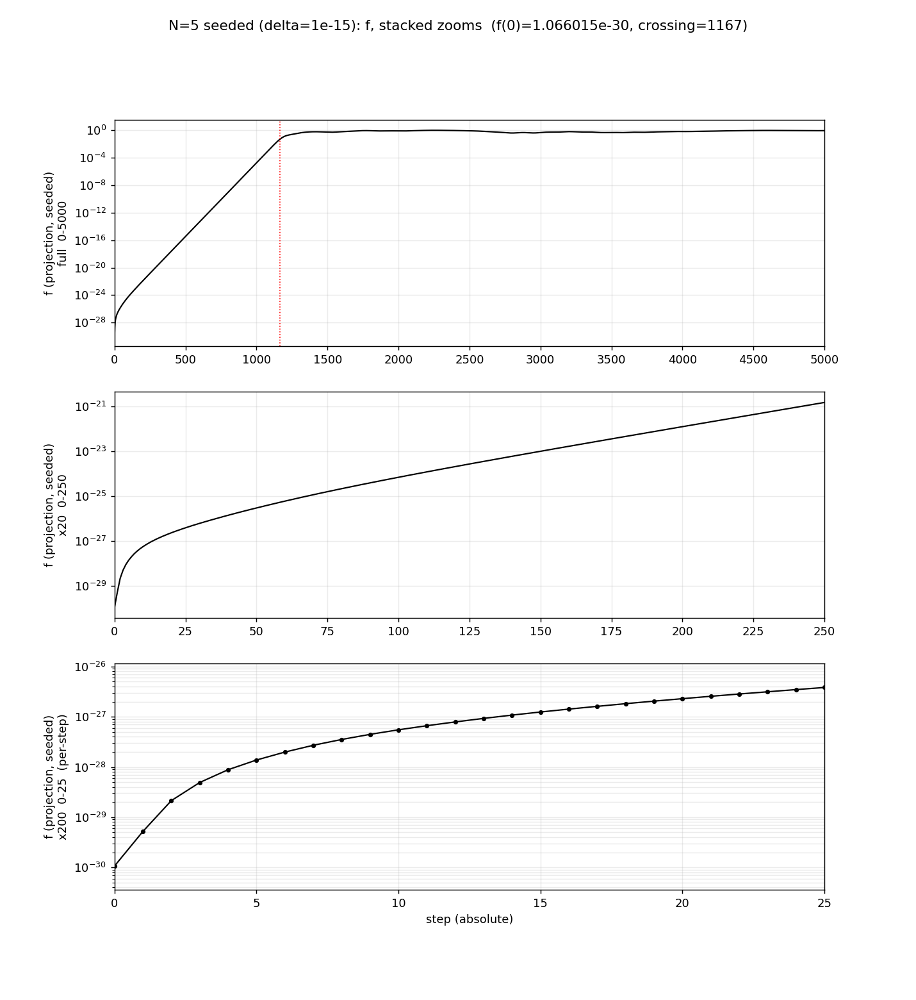
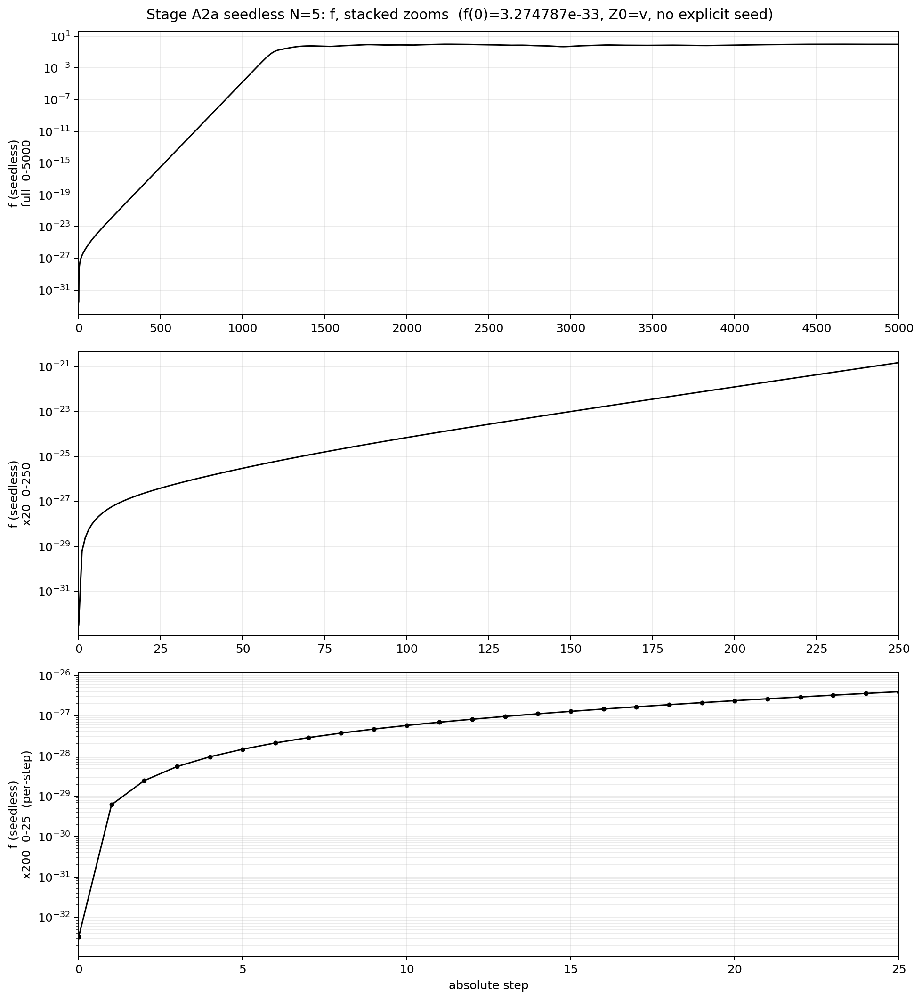
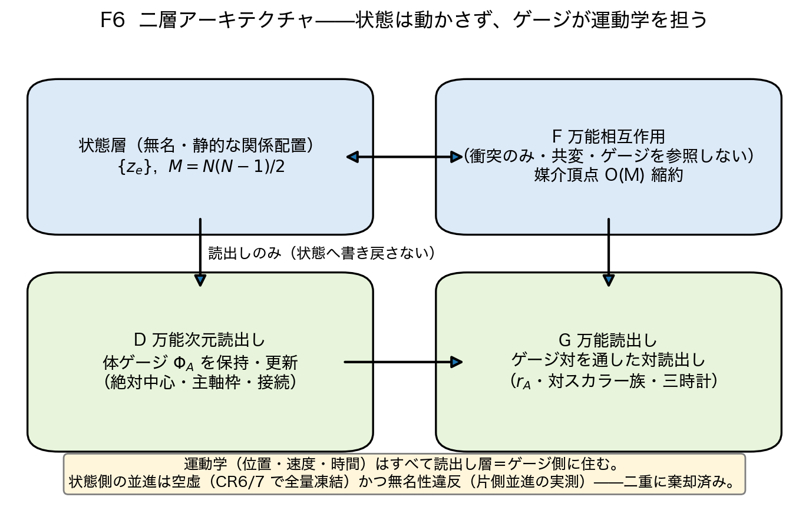
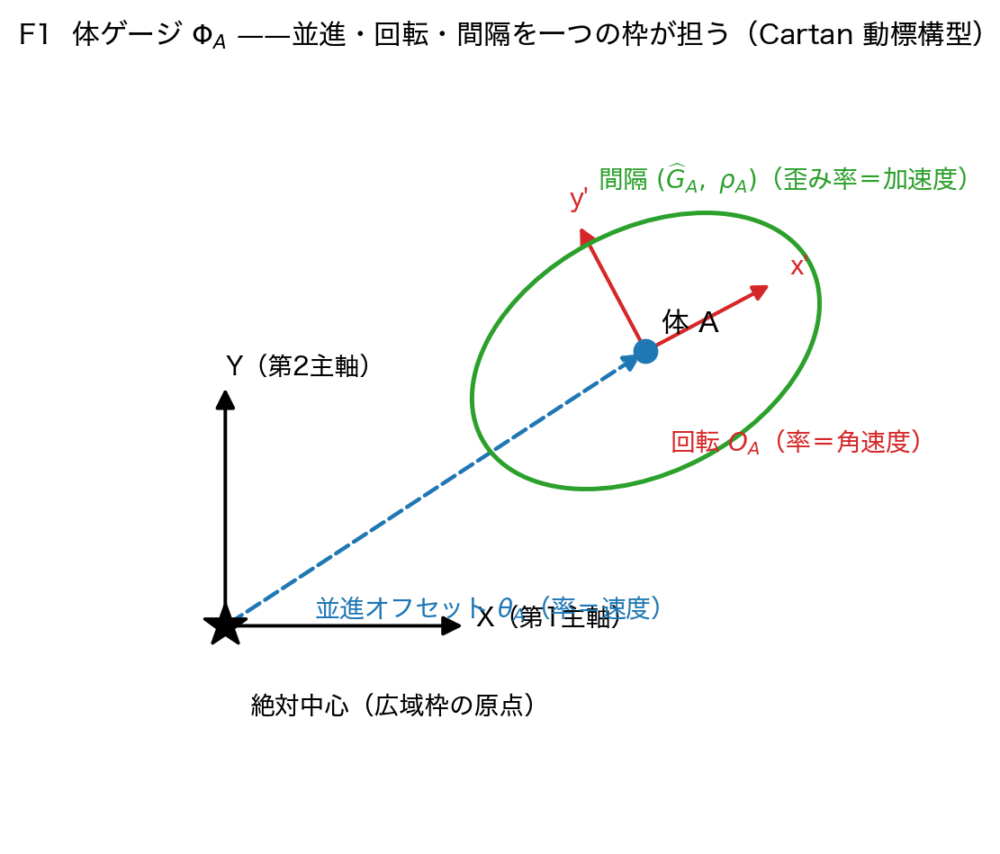
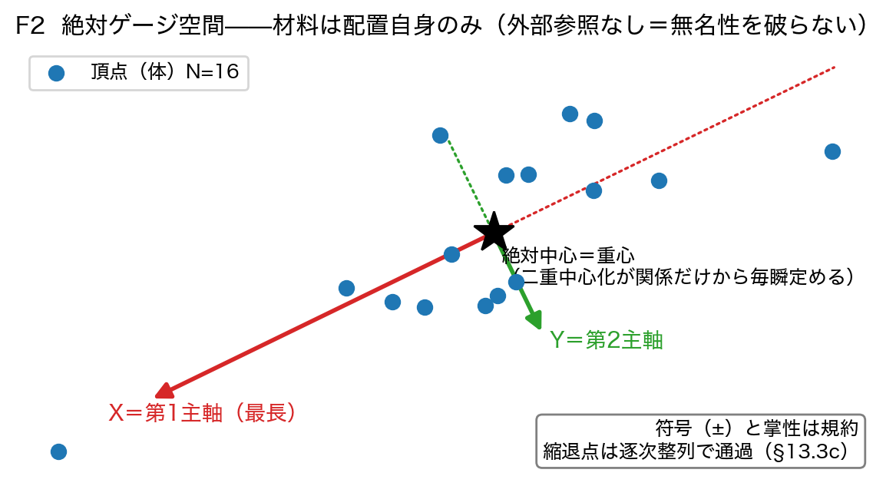
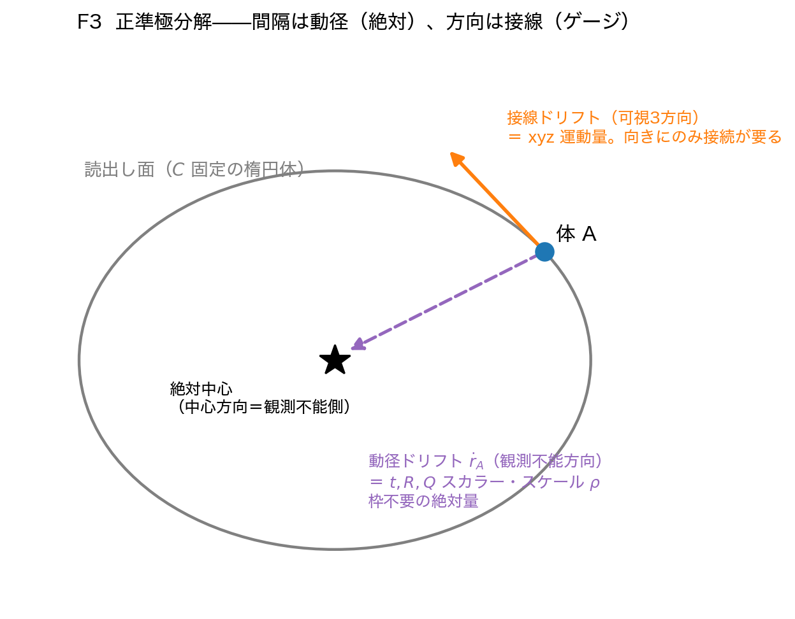
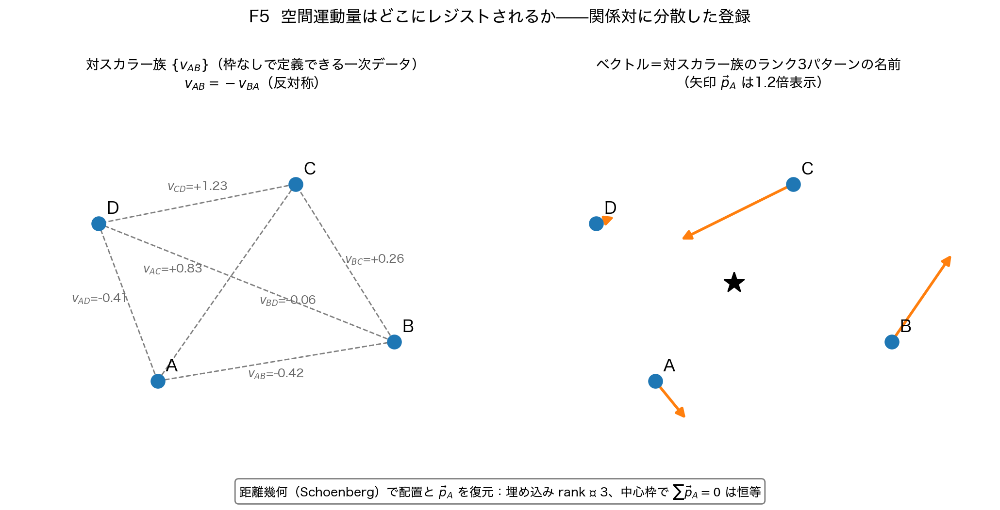
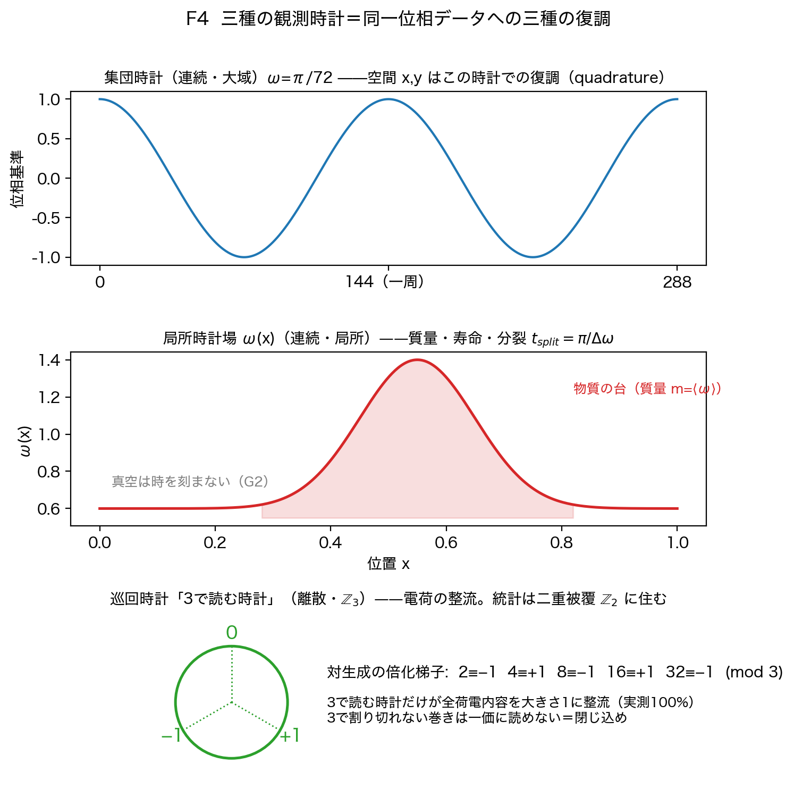

# 体ゲージと絶対ゲージ空間——関係だけの空間における運動学の定式化

木原範昭

状態: 草稿 v1.5（2026-08-19。DOI 取得前。設計図: `運動量レジスタの検討.md` §13〜§18。
v1→v1.1: 外部AI査読の指摘3件に対応——$\phi^t$ を体ゲージ成分から外し局所残差／大域 lapse の二形に確定、局所ゲージ場のずれを成分ごとに定義、best matching 距離関数の候補を重み付き Procrustes に固定、DL3 判定に掌性連続性を追加、仮説と走行の対応表を新設。
v1.1→v1.2: 査読2対応——DL4 判定に重み時間変化下の等速性を追記。他の指摘（反射率回転の作用面固定・局所残差の補助確認）は実装段階の固定事項として後続実装論文へ移送（本論文は前段の定義論文であり、実装時固定の境界宣言を維持する）。
v1.2→v1.3: 査読3（数式検算あり）対応——**定義3.1の数学的衝突を訂正**（距離ドリフトは対称 $s_{AB}=s_{BA}$。反対称は対位相差という別レジスタ。混同していた）、rank=3 主張を速度 Gram 行列 $K=UU^{\mathsf T}$ に付け替え、無重み運動学的恒等式と重み付き運動量保存（DL5対象）を分離、「宇宙の静止系」を解釈候補に格下げ、残余ゲージを初期枝 $\mathbb{Z}_2^3$ に精密化、縮退通過の履歴依存 $\Phi(n)=D(z(n),\Phi(n-1))$＝接続の出現を明示、関係状態/運動学的読出し状態の二層状態 $(z,\Phi)$ を明確化、時間変数三種（$n$/$T$/$s_A$）とドット規約を定義、$SE(3)$ 半直積と SPD 計量部の群構造を明示、質量の主定義を $\langle\omega_{\rm pred}\rangle$ に固定、DL4 判定を共変的等速性に修正、DL6 に三角閉路ホロノミーを追加、§8 に5項目追加。査読3の「ハミルトニアン拘束の構成が必要」は標準機構の再現要求として不採用（§8 に立場を明記）。
v1.3→v1.4: §8 を「主張しないこと」の否定形列挙から**「今後の課題と決着方法」の課題表**へ全面書き直し（各課題に決着の場を対応づけ）。本文中の否定形（「〜とは主張しない」「範囲外」「未証明」型）を前向きの課題文へ統一。木原指示：主張を曖昧にする言い訳型の限定はノイズであり、書くべきは課題そのものと決着方法である。
v1.4→v1.5: 防御文の残滓を数学的課題へ置換——§1.3 は「関係論的離散再構成を与える。対応写像は §5.2」と言い切り、§5.2 に Cartan 四対象（coframe/connection/curvature/torsion）の閉じている部分と課題を明記、§1.4 観測量は軌道分離定理による判定として記述、§8 の資格注釈・立場文・昇格語を課題文（対応則の構成・写像の構成・分離定理の証明）へ置換）

---

## 本論文の位置づけ（最初に明確にする）

本論文は**動力学を導く論文ではない**。また、**状態を変化させて動力学を実現する路線を採らない**。本枠組みが目指すのは、**読出し側の局所的ゲージ場への写像によって動力学を実現する**ことであり、本論文はその**前段**として、動力学（並進・回転・加速度）を表現可能な**ゲージ場の定義方法を提案する**論文である。運動方程式・逆自乗則・定量予言の導出は今後の課題であり、その決着方法は検証プログラム（§7）と課題表（§8）に登録してある。

## 要旨

背景空間を置かず、$\sum x_n^2=0$ と $U^n=I$ の公理から唯一のパラメータとして分解能 $N$ だけを置く関係波の系は、これまでに空間3軸・固有時間・質量・電荷の読出しと、粒子的な波62種の周期表、および系が3次元楕円体面への投影像として捉えられることまでを導出してきた。残された課題は動力学である。本論文は、動力学の導出に必要な**ゲージ場**を定義する。本論文のゲージ場は標準理論のゲージ場（内部対称性の位相接続）と異なり、局所的な並進・回転・加速度運動として読み出される計量を、進行波とその位相の変動として表現しない。状態は静的な関係配置のまま一切変更せず、**定常的な関係配置に対する局所的読出しのゲージ場の変化**として実装する。定義の中核は三つである。(1) **体ゲージ** $\Phi_A$——並進・回転・間隔を一個の枠が担う、体ごとの読出し枠。(2) **絶対中心と絶対ゲージ空間**——二重中心化が関係データだけから毎瞬一意に定める重心と、長さ順主軸による正準ゲージ固定。外部参照を持ち込まないため無名性を破らない。(3) **三種の観測時計**——空間読出しの集団時計・質量読出しの局所時計場・電荷読出しの巡回時計は、三本の時間軸ではなく、同一位相データに掛ける三種の復調である。この構成は Élie Cartan の動標構（1923–25）とほぼ同型であり、標準理論が GR 側（計量・枠・接続）と内部ゲージ側（位相）に分割した Cartan の動標構を、関係だけの空間で**分割前のまま離散再構成する**と、量子重力の三難問——時間の問題・背景独立性・観測量問題——が、**回避ではなく構成によって解ける**。本論文はその構成を定義し、検証プログラム（DL0〜DL6）として事前登録する。標準用語と異なる意味で用いる語はすべて末尾の用語一覧に明記した。

---

## 1. 導入

### 1.1 これまでの到達点

これまでの論文で、本系は背景空間を置かず、$\sum x_n^2=0$ と $U^n=I$ の公理から、唯一のパラメータとして分解能 $N$ だけを置き [S1][S9]、先行論文「波の周期表」[S18] および「ゼロ閉塞は4次元だった」[V4] までを導出した。空間の読出しと粒子的な孤立波は、合成曲率半径 $R'$（用語一覧参照）の閉曲面上の $N$ 個の頂点を結ぶ $M=N(N-1)/2$ 個の複素数の関係性から導出できた [S17][S18]。

この調査の過程で、空間と粒子的な孤立波を持つ系の創生には単一振動数のコヒーレントな波が必要であり [S14]、機械精度の揺らぎ（シード）からでも、幾何級数的発展（$10^{30}$ のオーダ、図1・図2）ののち準安定状態に達し [S8][S12]、3つの方向が生まれることを発見した [S10][S11]。一方、奇数倍音を含む比較的大きな揺らぎを与えない限り、3方向に異方性が現れず空間方向が区別できないこと、またフェルミオン的な波が生成されないことも発見した [S13][S20]。さらに「ゼロ閉塞は4次元だった」の検討により、この系を3次元楕円体面への投影像として捉えることが可能なことも導出できた [V4]（図3）。

**図1** インフレーション的な幾何級数的増幅（シードあり、$\delta=10^{-15}$、N=5）。射影形の記録により約30桁の増幅が可視化される。出所 [S11] 系列（`paper7_f_projection_v1/`、公開CSV・公開図と一致検証済みの復元）。

**図2** 同、明示シードなし（機械精度の組立誤差のみ、N=5）。増幅の発生に明示シードは必要でない。出所 [S12] 系列（`paper8_a2a_seedless_v1/`、公開データと全一致検証済みの復元）。

**図3** 関係（辺＋対角線）と楕円体の接続。4次元平行多面体（$N=16$, $M=120$）の3次元射影。楕円体は4次元で厳密であり、16頂点すべてで $|x^{\mathsf T}Qx-1|\le3.3\times10^{-16}$。出所 [V4] 図2。

### 1.2 残された課題——動力学の不在の正体

本論文の予備調査（対照実験 CR0〜CR7、再現物は本リポジトリ `電子の反跳実験/` の CR 系列）は、動力学が書けていない理由を一行まで特定した。

> **衝突（相互作用）は時間を進めるが位置を動かさない。並進は位置を動かすが時間を進めず、無名性を破る。両方を同時にやる演算が存在しない。**

具体的には次の三つの実測による。第一に、現行の相互作用関数はゲージ不変量をすべて保存する（**共変**、保存精度 $10^{-16}$）。第二に、状態への並進（位相ランプ）は、等速でも加速でも、保存量をビット単位で不変に保つ——運動エネルギーが状態に入らず、速度は外部パラメータのままである（CR6/CR7、全量 $0.000$）。第三に、非対称な並進は無名性を破る——片側並進は結合強度 $r$ を壊し、孤立二体の中心を動かす。大域並進（全員に同じ操作）だけが無害である。

すなわち、**状態側の並進は空虚（何も運ばない）かつ違法（無名性を破る）であり、二重に棄却される**。運動学は状態の層には住めない。

### 1.3 本論文の方針

§1.2 の二重の棄却が方針を一意に定める。動力学は状態の変化としては実装できない。したがって本枠組みは、**読出し側の局所的ゲージ場への写像**として動力学を実現する路線を採る。本論文はその前段であり、残された課題である動力学の導出そのものではなく、**動力学（並進・回転・加速度）を表現可能なゲージ場の定義**を行う。本論文のゲージ場は標準理論のゲージ場と異なり、局所的な並進・回転・加速度運動として読み出される計量を、進行波とその位相の変動として表現しない。状態は静的な関係配置のまま一切変更せず、**定常的な関係配置に対する局所的読出しのゲージ場の変化**としてこれらを実装することを試みる（図 F6）。

この取組は我々の発明ではない。先行研究調査により、**Élie Cartan の動標構（repère mobile, 1923–25）とアフィン接続** [C4]——各点に枠を立て、隣接点へ移る際に枠が並進・回転し、計量が間隔を与える構成——の**関係論的離散再構成**を与える構造であり（対応写像は §5.2 に示す）、その物理化である**ポアンカレゲージ理論**（Utiyama 1956 [C6]・Kibble 1961 [C7]・Sciama 1964 [C8]）および **Einstein の遠隔平行性**（1928 [C5]）と同じ構造に属することを発見した。同型の構造だが到達経路が異なる：これらが背景多様体の各点に枠を置くのに対し、本系の枠は関係の端点（体）に立ち、**枠の間の幾何そのものが関係から創発する**。なお「ゲージ」の語の原義（Weyl 1918 の Eichung [C2]）は目盛＝間隔の較正であり、本論文のゲージ場はこの原義に立ち戻る使い方である。

### 1.4 中核主張

標準理論が GR 側（計量・枠・接続）と内部ゲージ側（位相）に分割した Cartan の動標構を、関係だけの空間で**分割前のまま離散再構成する**と、量子重力の三難問——時間の問題 [C11]・背景独立性・観測量問題 [C10]——が、**回避ではなく構成によって解ける**。

- **時間の問題**：大域状態は静的であり、時間は読出しである。固有時間は体ごとの時計（＝質量）、座標時間は読めない量＝ゲージ選択である。Wheeler–DeWitt の「凍った動力学」は難問ではなく出発点になる
- **背景独立性**：捨てるべき背景が最初から無い。幾何（中心・枠・計量）は関係の族から毎瞬導出される
- **観測量問題**：ゲージ不変な観測量の族が構成的に与えられる——中心基準スカラー・対スカラー族・向きに依らない二次形式（後者2種の保存は実測済み [V4]）。完全性は軌道分離定理 $I(x)=I(y)\Leftrightarrow x\sim_{\rm gauge}y$ として判定する（§8）

本論文はその構成を定義し（§2〜§4）、先行理論との対応を明示し（§5）、実装可能性を示し（§6）、検証プログラムとして事前登録する（§7）。主張の限界は §8 に一括して列挙する。

---

## 2. 定義——体ゲージと絶対ゲージ空間

### 2.1 関係状態と運動学的読出し状態——二層の正確な区別

本枠組みには二種類の「状態」があり、これを峻別する（v1.3 で用語を精密化）。

- **関係状態** $\{z_e\}_{e=1}^{M}$（$M=N(N-1)/2$、完全グラフの辺）——無名（用語一覧参照）であり、**相互作用によってのみ**変化する
- **運動学的読出し状態** $\{\Phi_A\}$（体ゲージ、定義 2.1）——D が保持・更新する読出し層の対象であり、位置・速度・時間などの運動学的情報を担う

体ゲージは運動学的な情報を保持する以上、広義の状態変数である。本枠組みの主張は「状態が一切変化しない」ことではなく、次の一文である：

> **自由運動の運動量は関係状態 $z$ には書き込まれない。運動学的自由度は読出し状態 $\Phi$ に存在する。**

読出し層は関係状態から二次形式として量を取り出すが、関係状態へ書き戻さない（図 F6）。§1.2 の二重の棄却（状態側並進は空虚かつ違法）は、正確にはこの分離——全系は二層状態 $(z,\Phi)$ であり、自由運動が住めるのは $\Phi$ の層だけ——を強制する実測である。

**図F6** 二層アーキテクチャ。F（万能相互作用）は状態のみに作用し共変。D（万能次元読出し）が体ゲージを保持・更新し、G（万能読出し）がゲージ対を通した対読出しを行う。

### 2.2 体ゲージの定義

**定義 2.1（体ゲージ）**　各体 $A$ に、読出し層の対象として**体ゲージ**

$$\Phi_A \;=\; \big(\ \theta_A,\ \ O_A,\ \ (\widehat G_A,\ \rho_A),\ \ (\phi^R_A,\ \phi^Q_A)\ \big)$$

を与える（図 F1）。成分と役割は次のとおり。

| 成分 | 空間 | 役割 | 変化率の読み |
|---|---|---|---|
| $\theta_A$ | 創発3次元フレーム内のオフセット | 並進（位置） | $\dot\theta_A$＝速度ベクトル |
| $O_A$ | $SO(3)$ | 方向の回転（枠の向き） | $\dot O_AO_A^{-1}$＝角速度 |
| $\widehat G_A$（$\det=1$）・$\rho_A$ | 正定値対称／正スカラー | 間隔（局所計量の形・向きとスケール） | $\dot{\widehat G}_A$＝加速度・潮汐、$\dot\rho_A$＝スケール変化 |
| $\phi^{R}_A,\ \phi^{Q}_A$ | スカラー | 虚軸方向のドリフト（観測不能方向） | 率＝質量（固有時計）・電荷の読み（§4） |

**注意（$t$ は体ゲージの成分ではない）**　座標時間 $t$ に対応するレジスタ $\phi^t_A$ は**置かない**。$t$ の直接読出し器は存在せず [S17]、$t$ が現れる形はちょうど二つに限られる：(a) 体ごとの**局所残差** $t_A^2=R'^2_A-m_A^2-q_A^2$（導出量であって独立レジスタではない）、(b) **大域の lapse 規約**（§3.4 の普遍時計ゲージ。体ごとでなく系に一つの選択）。この二形の区別を混同しない。

**注意（群構造。v1.3 で明示）**　並進と回転は独立な直積ではなく半直積で合成される。$g_A=(O_A,\theta_A)\in SE(3)=\mathbb{R}^3\rtimes SO(3)$、間隔部は $H_A=\rho_A^2\widehat G_A$（正定値対称行列）とまとめ、体ゲージを $\Phi_A=(g_A,\ H_A,\ \phi^R_A,\ \phi^Q_A)$ と書く。局所−広域のずれは群の商 $g_Ag_G^{-1}$ で取る（広域枠は $\theta_G=0$、$O_G=I$ に正準固定されるため、実用上は成分表示と一致する。一般の二枠間では半直積の合成則に従う）。

**注意（時間変数の規約。v1.3 で明示）**　本論文のドット記号は無定義に使わない。三つの時間変数を区別する：(i) **更新指数 $n$**（アルゴリズムのステップラベル。時間ではない）——一次的定義はすべて差分 $\Delta_n\theta_A=\theta_A(n{+}1)-\theta_A(n)$ である。(ii) **大域時計位相 $T$**（§3.4 の lapse 規約、普遍時計 $\omega=\pi/72$）。(iii) **局所固有時計 $s_A$**（§4.2）。物理的な速度・加速度は $d/ds_A$ または $d/dT$ として定義され、ドット記号はこのいずれかを文脈で明示して用いる。

**図F1** 体ゲージの構成要素。並進・回転・間隔を一個の枠が担う（Cartan 動標構型）。

**体ゲージは関係状態 $z$ の一部ではない**（運動学的読出し状態である。§2.1 の区別）。D（万能次元読出し）が保持・更新する読出し層の対象であり、F（万能相互作用）はゲージを参照しない。

### 2.3 絶対中心——関係だけから決まる原点

**命題 2.2（絶対中心）**　二重中心化 $B=-\frac12 JD^{\circ2}J$（$D$ は対距離行列、$J$ は中心化行列）は、関係データだけから毎瞬、重心を一意に原点へ置く。重心座標では任意の配置について $\sum_i v_i=0$ が定義から恒等的に成立する [V4]。

中心は次のすべてに免疫である。(1) 主軸の向きの拡散（中心は回転不変な点）。(2) 符号の無意味さ（点対称の中心は鏡映でも動かない）。(3) $U^n=I$ に由来する長期の回転・振動（楕円体がどう回り、どう呼吸しても、中心二次曲面の中心は中心のまま）。

したがって合同変換群のうち、**並進の不定性は正準に消せる**——恣意的な選択ではなく、関係が一意に決める（**正準中心化**）。ただし「毎瞬一意」は非縮退区間についての言明であり、縮退通過は逐次整列（2.4 規約2）による連続輸送で扱う。この帰結は三つある。

1. **四次元恒等式の $r$ に操作的定義が付く。** $\sum r^2=t^2+R^2+Q^2$ の $r$ とは、絶対中心から各頂点への距離である。実際 $\mathrm{tr}(B)=\sum_i r_i^2$（ラグランジュ恒等式 [V4]）——恒等式は最初から中心基準で書かれていた。$r_A$ は完全にゲージ不変なスカラーで、向きの漂流と無関係に毎瞬読める
2. **無重みの運動学的恒等式。** 重心を原点に固定すれば $\sum_iv_i=0$ が恒等であり、その差分＝**無重み**速度和ゼロも恒等である（v1.3 で訂正：これは正準中心化による運動学的恒等式であって、重み付きの物理的運動量保存 $\sum m_Au_A=\mathrm{const}$ はここからは出ない。後者は DL5 の動力学的検定対象である）。**中心＝関係配置の並進ゲージを正準に固定する点**であり、これを「宇宙の静止系」（Mach 原理 [C13] の実装）と読めるかは、重み付き保存の成立（DL5）を要する解釈候補である
3. **全運動が動径／接線に正準分解される**（§3.1）

### 2.4 絶対ゲージ空間——正準ゲージ固定

**定義 2.3（絶対ゲージ空間）**　絶対中心を原点、慣性主軸を座標軸とする体枠を**絶対ゲージ空間**と呼ぶ（図 F2）。材料がすべて配置自身から来る（中心＝関係の重心、軸＝関係の慣性主軸）ため、外部参照を持ち込まず**無名性を破らない正準ゲージ固定**である。

**図F2** 絶対ゲージ空間。材料は配置自身のみ（外部参照なし＝無名性を破らない）。

構成規約は四つである。

| 規約 | 内容 |
|---|---|
| 1 存在条件 | 枠は非縮退スペクトルでのみ定義される。真空（固有値完全縮退 [V4]）では枠が立たない——「空間の軸は物質と共に生まれる」と厳密に整合する |
| 2 縮退点通過 | 固有値交差では順位が入れ替わるため、順位は初期命名のみに使い、以後は前ステップとの逐次整列で軸を追跡する |
| 3 符号 | 固有ベクトル $\pm v$ は等価（軸は直線）。$+X$ の向きは連続性で固定する規約とする |
| 4 掌性 | $Z=X\times Y$ の右手／左手は距離データから決まらない（鏡映 $\mathbb{Z}_2$ [C17]）。初期に一度規約で選び、連続性で運ぶ |

この枠は**系と共回転する体枠**である。主軸の向きの拡散 [V4] や $U^n=I$ に由来する長期回転は、枠が配置に追随するので枠内では消え、代わりに**枠の角速度が測定可能量**になる。この枠で速度を書くとコリオリ型の項（Littlejohn–Reinsch のゲージポテンシャル [C15]）が現れる——これは欠陥ではなく、接続が露わに計算可能になった形である。相互作用の履歴だけで系の実効的な向きが回る現象（ホロノミー。落ちる猫と同型）は、枠の角速度の積分として直接読める。

**残余のゲージ自由度（v1.3 で精密化）**：固有値が非縮退でも各固有ベクトルには $e_i\sim-e_i$ の符号自由度が残るため、初期時点の枠の枝は $\mathrm{diag}(\pm1,\pm1,\pm1)$ の $\mathbb{Z}_2^3$（8通り。右手系 $\det=+1$ に固定した後も4通り）から一つを**指定する必要がある**。正確な言明は：**非縮退区間では、初期フレーム枝を一度指定すれば、逐次整列によって一意に連続輸送される**。縮退通過では枠は瞬間配置だけの関数ではなく $\Phi(n)=D(z(n),\Phi(n-1))$ という履歴依存になる——これは欠陥ではなく、**理論の中に本物の接続が現れる場所**であり、本枠組みはこれを積極的に採用する。初期枝を関係だけから固定できるか（例：三次モーメント（歪度）など符号に敏感な関係スカラーの利用）は実装段階の検討事項である。

### 2.5 局所ゲージ場

**定義 2.4（局所ゲージ場）**　広域枠（定義 2.3）に対し、各体 $A$ の局所枠を $A$ の星（$\{z_e:e\ni A\}$）から同じ処方で組む。局所レジスタの第一候補は、毎ステップ計算済みの頂点モーメント

$$A_v=\sum_{e\ni v}\lvert z_e\rvert^2,\qquad B_v=\sum_{e\ni v}z_e^2=-\sum_{e\not\ni v}z_e^2\quad(\text{閉塞 }C=0\text{ の下})$$

である（§6）。**局所ゲージ場**とは、体ごとの局所枠と広域枠のずれの場 $\{\Phi_A\cdot\Phi_{\rm global}^{-1}\}_A$ である。ずれの各成分は成分ごとに定義する：

$$\Phi_A\cdot\Phi_{\rm global}^{-1}\;=\;\Big(\ \theta_A-\theta_G,\ \ O_AO_G^{-1},\ \ \widehat G_G^{-1/2}\widehat G_A\widehat G_G^{-1/2},\ \ \rho_A/\rho_G\ \Big)$$

（変位差・相対回転・相対計量・スケール比。広域枠では $\theta_G=0$、$O_G=I$ に正準固定されるので、実用上は $(\theta_A,\ O_A,\ \widehat G_A\widehat G_{\rm glob}^{-1}\text{型},\ \rho_A/\rho_{\rm glob})$ を読む。）

これは Cartan 構造の完成形にあたる：広域枠＝座標系、局所枠＝vierbein、ずれの場＝重力場・ゲージ場（の候補）。周囲の物質分布が体 $A$ の局所枠を広域枠に対して傾ける——**傾きの場が重力場**である、というのが本枠組みの重力の読みであり、その検定は §7 の DL6 に事前登録する。

---

## 3. 運動学——運動量・保存・3+1

### 3.1 正準極分解

主観空間（用語一覧参照）が観測できないのは中心方向である [S1][V4]。よって各体の運動は正準に二分される（図 F3）。

| 成分 | 方向 | 対応 | 枠の要不要 |
|---|---|---|---|
| **動径ドリフト** $\dot r_A$ | 中心方向＝観測不能側 | $(t,R,Q)$ スカラードリフト・スケール $\rho$ | 枠不要（絶対） |
| **接線ドリフト** | 可視3方向 | $xyz$ 運動量 | 向きにのみ接続が要る |

**図F3** 正準極分解。間隔は動径（絶対）、方向は接線（ゲージ）。

「中心投影」という基礎方程式の命名は、体ゲージの構造としてここで閉じる：**間隔＝動径（絶対）、方向＝接線（ゲージ）**。

### 3.2 運動量はどこにレジストされるか

一体が私有できるのは動径スカラー $r_A$ だけである。孤立した一体に「方向」は定義できない——方向は二体を要する関係概念だから。四次元恒等式が $r^2$ しか持たないのは欠陥ではなく、方向が一体の私有財産でないという帳簿の正直な表現である。

**定義 3.1（運動量レジスタ。v1.3 で訂正）**　枠なしで定義できる一次の対レジスタは二種類あり、対称性が異なる。

$$\text{距離ドリフト}\quad s_{AB}=s_{BA}=\dot d_{AB}=\hat n_{AB}\cdot(u_A-u_B)\qquad(\textbf{対称})$$

$$\text{対位相差ドリフト}\quad \Delta\dot\theta_{AB}=-\Delta\dot\theta_{BA}\qquad(\textbf{反対称。二体系列の }\chi=\Delta\theta\text{ の率})$$

体 $A$ の空間運動量は、対称な距離ドリフト族 $\{s_{AB}\}$ から**剛性（rigidity）型の再構成**で復元される：距離幾何学の古典定理 [C17] により、対距離 $\{d_{AB}\}$ とその変化率 $\{s_{AB}\}$ の族は、中心化された速度配置 $U=(u_1^{\mathsf T};\dots;u_N^{\mathsf T})$ を大域等長変換を除いて一意に決める。「大域等長変換を除いて」の剰余が無名性ゲージに過不足なく一致する。

> **【v1→v1.3 の訂正】** 初版は $v_{AB}=-v_{BA}$（反対称）と定義した直後に距離ドリフトの因数分解式を書いていたが、**この二式は同時に成立しない**（$\hat n_{BA}=-\hat n_{AB}$ と $(u_B-u_A)=-(u_A-u_B)$ の二重反転により距離ドリフトは対称である）。初版は距離ドリフト（対称）と対位相差（反対称）という別種の対レジスタを混同していた。定義を上のとおり分離して訂正する。

**ベクトルとは、関係スカラー族のランク3パターンの名前である**（図 F5）。正確には：再構成した中心化速度配置の Gram 行列 $K=UU^{\mathsf T}$ について $\mathrm{rank}\,K\le 3$ が成立し、ベクトルとはこの低ランクパターンの名前である。

**図F5** 空間運動量の登録。左：枠なしで定義できる対称な距離ドリフト族。右：距離幾何による配置と速度ベクトルの復元。

この読みは三つの結果を与える。

1. **運動学的恒等式と動力学的保存則の分離**。正準中心化（命題 2.2）は無重みの $\sum_Au_A=0$ を**運動学的恒等式**として与える。一方、重み付きの $\sum_Am_Au_A=\mathrm{const}$ は**動力学から導出すべき保存則**であり、その導出は DL5 が決着させる（成立すれば、中心化による見かけでない実質的結果になる——この分離が DL5 を実質的検定にする）
2. **空間3次元＝速度 Gram 行列の埋め込みランク**。対距離ドリフト族から復元される速度 Gram 行列 $K=UU^{\mathsf T}$ の埋め込みランクが 3 で飽和する。$N$ 体では最大 $N-1$ まで許されるのに、実測の空間方向は3で止まる [S11][V4]。「なぜ3次元か」が「なぜ $K$ のランクが3で飽和するか」という定量問題に変換される
3. **既存構造との整合**。符号付き面積 $M(i,j)=v_i\cdot v_j$ [S13系] も対ごとのスカラー積で幾何を登録する同じ文法である

### 3.3 接続——best matching と反射率

**平行移動（仮説・候補を固定）**：イベント間で $\Phi_A$ を、関係配置の読出し差を最小化するよう再整列する（**best matching**、Barbour–Bertotti [C14] と同型）。距離関数の候補を次の一つに固定する（DL4/DL5 実装で検定し、事後変更しない）：

$$d^2\big(\text{配置}^{(1)},\text{配置}^{(2)};O\big)\;=\;\sum_A w_A\,\big\lVert x_A^{(2)}-O\,x_A^{(1)}\big\rVert^2,\qquad w_A=A_v\ \text{（エルミート頂点モーメント）}$$

すなわち**重み付き Procrustes 整列**である。並進は正準中心化（命題 2.2）で既に固定されているため、最小化は回転 $O\in SO(3)$ のみについて行う。重み $w_A$ にゲージ監査で共変と確定した量（頂点モーメント）を用いることで、距離関数自体がゲージ整合的になる。相互作用がなければ再整列量は一定率＝測地線（慣性）。運動量はこの整合問題の共役量として**導出**され、整合操作が群作用であることから保存則は Noether 型で従う見込みである。

**曲率（仮説）**：他体の局所レジスタ（界面 $\sum z_e^2$、頂点モーメント $B_v$ が候補）が $\widehat G_A$ を歪ませる。歪んだ物差しで等速ドリフトを読むと加速度が現れる——「速度も加速度もゲージで表現する」の正確な意味である。相互作用イベントは対ゲージに反射率回転（$\sin^2\theta=1-r$）を掛ける——離散接続係数の候補である。

クラスタ投入の算術はレジスタで書ける：第二クラスタ $z'$ を投入すると

$$R'^2_{\rm tot}=R'^2+R''^2+\sum_{e\,\in\,\text{界面}}z_e^2$$

二つのクラスタが無関係（界面の関係辺なし）なら曲率は厳密に加法であり、**界面レジスタが相互作用＝結合エネルギー＝曲率の非加法分**である。

### 3.4 3+1 写像——座標時間はゲージである

第4軸は枠の空間軸ではない。[S17] の中心命題がすでに答えである：観測の全内容は**空間3軸＋固有時間 $\tau$＋質量 $m$＋電荷 $q$** であり、**唯一読めないのは座標時間 $t$** である。$t$ は算術残差 $t^2=R'^2-m^2-q^2$ として、または大きな系の空間振動群から広域の共有時間を想定する**選択**としてのみ現れる。

$$\text{体 }A\text{ の世界線}=\big(\theta_A(s_A),\ s_A\big),\qquad s_A=\text{体 }A\text{ の固有時計の累積}$$

大域 $t$ の自然なゲージは、実測済みの**普遍時計** $\omega=\pi/72$（一周144ステップ・$N$ 非依存 ±0.1% [S17]）である。各体の固有時計との比が時間の遅れとしてそのまま読める。

正準重力（ADM [C9]）との対応は次のとおり。

| ADM | 本系 |
|---|---|
| 3次元空間葉 | 創発3軸（広域枠、定義 2.3） |
| shift（空間ゲージ） | 枠の構成規約（2.4） |
| lapse（時間ゲージ） | 座標時間＝読めない＝規約 [S17] |
| 各観測者の固有時間 | 各体の固有時計（物理） |

ADM が公理として置く「座標時間はゲージ」を、本系は**読出しの不可能性として導出**している [S17]。Page–Wootters [C12]（時計部分系との相関としての時間）と同じ着地である。等速並進の4次元読出し（$xyz+\tau$）は実測済みである（図4）。

**図4** 物質パケットの運動の4次元読出し（$xyz+\tau$）。等速並進として可視化され、$\tau=0$〜$900$ の全10点で偏差 $0.000$。出所 [S17]。

---

## 4. 三種の観測時計

過去研究は時間の読出しを三種に分離している [S17][S18][S19]。三種は三本の時間軸ではなく、**同一位相データに掛ける三種の復調**——連続大域・連続局所・離散巡回——である（図 F4）。本節は後続論文が本論文のみの引用で閉じるよう、各読出しを再導出の形で与える（引用は出所表示であって導出の代用ではない [S17]）。

**図F4** 三種の観測時計＝同一位相データへの三種の復調。

### 4.1 集団時計と空間軸の復調（出所 [S17]）

三方向準安定凝縮体の実体は対等な3軸ではなく **2+1** である——独立な実体は複素固有対1つ（回転平面1枚）であり、第3方向は生成子の回転軸として従属する（外積との一致 $0.987\to0.9965$、$N$ とともに向上）。親平面の複素座標の偏角を $\varphi(n)$ とすると、全占有平面が剛体回転する単一の**集団時計**が存在する：

$$\omega_{\rm coll}=\frac{d\varphi}{dn}\approx\frac{\pi}{72}\ \text{/step}$$

**空間の $x,y$ 軸は、この時計での復調（quadrature）として定義される**——回転平面の複素座標を $e^{-i\varphi(n)}$ で復調した直交位相成分が $x,y$ である。直交性は実体の性質ではなく読出しの構成である（図5）。時計を持たないコヒーレント摂動は凝縮体の時計に**引き込まれて**静止し、運動は自前の時計を持つ内容——質量——の特権となる（図6）。

**図5** 空間 $x,y$ 軸＝集団時計での quadrature 復調。出所 [S17]。

**図6** 時計の引き込み。時計を持たない摂動は凝縮体の時計に同期させられ静止する。出所 [S17]。

### 4.2 局所時計場と質量（出所 [S19] G2/G3・[S17]）

位置 $x$ の奇数帯（フェルミオン型）パワーを $f(x)$、偶数帯（ボゾン型）パワーを $b(x)$ として

$$\theta(x)=\operatorname{atan2}\!\big(\sqrt{f(x)},\sqrt{b(x)}\big),\qquad r(x)=\sin^2\theta(x)=\frac{f(x)}{f(x)+b(x)}$$

**局所時計場と質量則**：

$$\omega_{\rm pred}(x)=\theta(x)+2\,r(x)\,\lvert a(x)\rvert^2,\qquad m_{\rm pred}=\langle\omega_{\rm pred}\rangle_{\text{台上}}$$

検証値：解析予言 $m_{\rm pred}$ 対実測、15点で平均比 $0.983$・CV $1.2\%$ [S19]。**時計を動かす源は物質だけであり、真空は時を刻まない**（G2）。

**質量の主定義（v1.3 で固定）**：本論文で運動学（§3.2 の $m_A$・局所残差 $t_A^2$）に用いる質量は $m_A\equiv\langle\omega_{\rm pred}\rangle_A$ を主定義とする。$\det\Gamma$（下記）は独立な質量指標の候補であり、両者の対応則は検証対象である。

質量の第二読出しは非コヒーレンスである。二チャネル $(a,b)$ の $2\times2$ Gram 行列 $\Gamma$ の Pauli 分解 $T=\Sigma(\lvert a\rvert^2{+}\lvert b\rvert^2)$、$X=\Sigma(\lvert a\rvert^2{-}\lvert b\rvert^2)$、$Y=2\,\mathrm{Re}\,\Sigma\bar a b$、$Z=2\,\mathrm{Im}\,\Sigma\bar a b$ に対し

$$\det\Gamma=T^2-X^2-Y^2-Z^2\;\ge\;0$$

が質量として読める（数学は偏光コヒーレンス行列理論として既知。寄与は物理的同定と実測）。検証値：光的固有モード $1.2\times10^{-7}$ 対 凝縮体 $3.1\times10^{-3}$ [S17]。分裂則は $t_{\rm split}=\pi/\Delta\omega$（実測オーダー1整合 [S18]）。

### 4.3 巡回時計と電荷（出所 [S18]）

対生成は巻き数を倍化する（梯子 $2,4,8,16,\dots$）。倍々の梯子を3で割った余りは $+1,-1$ を交互に踏む（$2\equiv-1,\ 4\equiv+1,\ 8\equiv-1\pmod3$）。したがって

1. **mod 3 の巡回時計だけが、散らばった全生成物を大きさ1の電荷に折り返して読む**。検証値：3で読むと荷電内容の $100\%$ が大きさ1に集中（どちらの宇宙でも）。4で読むと電荷が消え、5・6で読むと多値に散らばる [S18]
2. **3で割り切れない巻きを持つ波は、この時計の上で一価に読めない**——単独では観測可能な電荷として読み出せない（閉じ込めのクォーク的構造）
3. フェルミオン／ボゾンの区別はチャネル回転にも空間回転にも住まず（厳密対称性）、**時計の二重被覆 $\mathbb{Z}_2$ に住む**。帰結の幾何定理：統計の確定した純種は一点に局在できず、必ず対蹠（半周期ずれ）に対称／反対称の相棒を持つ [S18]

**本論文の接続**：mod 3 巡回時計は $Q$ 軸のコンパクト性の読出し版であり、電荷の $1/3$ 量子化と Kaluza–Klein 型「電荷＝コンパクト軸方向の運動量」[C22] が同一構造で出る。

### 4.4 実装が直接使う固定点読出し

| 読出し | 式 | 検証値 | 出所 |
|---|---|---|---|
| 位置の確度 | $\lvert z\rvert=1-1/M$（等振幅倍音 $M$ 本の一次円周モーメント） | $M{=}2{:}0.5$、$3{:}0.667$、$17{:}0.941$（厳密一致） | [S18] |
| 双線形レジスタ | $\sum_e x_e^2$（$x_e$＝倍音を先に和した関係振幅） | 真空で $2\times10^{-15}$（零）・シード後は固定複素値が転移貫通で保存（$10^{-7}$） | [V4] |
| エルミートレジスタ | $\sum_e\lvert x_e\rvert^2=N\,\mathrm{tr}(B)$ | 保存 $8.3\times10^{-9}$ | [V4] |
| 頂点モーメント | $A_v,\ B_v$（定義 2.4） | 閉塞保存の厳密因数分解（§6） | [S16] |
| 中心距離 | $r_A$：$\mathrm{tr}(B)=\sum_i r_i^2$ | 恒等式 | [V4] |
| 正規化慣性楕円体 | $c=k/N$（$k$＝読出しランク） | 平行多面体で $10^{-13}$ | [V4] |

---

## 5. 対応と系譜

### 5.1 格子ゲージ理論との辞書

| 標準格子ゲージ理論 | 本模型 |
|---|---|
| サイト（頂点） | 体 $N$ 個 |
| リンク変数 $U_e$ [C19] | 関係波 $z_e$（完全グラフ、$M=N(N-1)/2$） |
| 局所ゲージ変換 | 体ごとの読出しゲージ（無名性群） |
| U(1) ゲージ軌道 | $z\mapsto e^{i\theta}z$ が Stiefel 2フレームを面内回転：$V_2(\mathbb{R}^M)/SO(2)=\mathrm{Gr}_2^+(\mathbb{R}^M)$（[V4] 主張0-b で証明済み） |
| Wilson 線（ゲージ不変な対観測量） | 対スカラー $\Delta\theta_{AB}$・反射率 $r$（共変性は実測済み） |
| Gauss 拘束 [C20] | $B_v=-\sum_{e\not\ni v}z_e^2$（構造上の席の対応） |
| 閉空間で総電荷ゼロ | $\sum_vB_v=2C=0$ |
| リンク更新の staple 和 | 頂点モーメントによる媒介頂点集約（§6） |
| **背景格子（固定）** | **なし——幾何は関係から創発** |

最終行が唯一の相違点であり、予言の源泉である。標準構成では背景の上にリンクを載せるが、本系では頂点の位置そのものが関係から導出される（距離幾何 [C17]）。

### 5.2 動標構の系譜

「間隔を変え、並進し、方向も回転するゲージ」は、微分幾何では Cartan の動標構＋アフィン接続 [C4] として定式化済みの型である。系譜と本系の対応：

| 標準理論の概念 | 本模型の対応物 | 資格 |
|---|---|---|
| 計量 $g_{\mu\nu}$（Riemann [C1]） | 読出し二次形式 $G$（$X^{\mathsf T}GX=C$ [V4]）＝区間ゲージ | 条件付き定理 |
| Weyl のスケールゲージ（Eichung 1918 [C2]） | $\rho$。「ゲージ」の語の原義＝間隔の較正 | 対応関係 |
| 目盛→位相への読み替え（Weyl 1929 [C3]） | 分割の痕跡（本論文は分割前へ戻る） | 歴史的整理 |
| vierbein／tetrad | 体ゲージの $(\theta_A,O_A)$ | 定義 2.1 |
| Levi-Civita／スピン接続 | 衝突イベントの対ゲージ更新則（反射率回転） | 仮説 |
| 平行移動 | best matching によるイベント間再整列 | 仮説 |
| 測地線 | 相互作用なしのドリフト等速性 | DL4 で検定 |
| 曲率テンソル | $\dot{\widehat G}$（[V4] 0-c′ の三分離） | 対応候補 |
| 捩率＝並進ゲージ場 [C5][C7] | 並進ドリフトの非可換部 | 未検討 |
| ポアンカレゲージ理論 [C6][C7][C8] | 体ゲージ群の連続版 | 対応関係 |

同型の構造だが到達経路が異なる。相違点は一点に尽きる：**枠が背景多様体の点でなく体（関係の端点）に立ち、枠の間の幾何そのものが関係から創発する**。

Cartan 構造の四対象について、本論文で閉じている部分と、閉じるための課題は次のとおり。**coframe**（枠）：定義 2.1〜2.4 で構成済み。**connection**（接続）：候補を固定済み（重み付き Procrustes・反射率回転）、成立は DL4/DL5 で判定する。**curvature**（曲率）：三角閉路ホロノミー $U_{AB}U_{BC}U_{CA}$ を第一候補として DL6 で測る。**torsion**（捩率）：並進ドリフトの非可換部として構成する（§8）。

関係主義側の先行系譜としては、Penrose のスピンネットワーク [C16]、Regge 計算 [C21]、Barbour の best matching [C14]、Littlejohn–Reinsch の shape space [C15] が対応する。

---

## 6. 実装可能性——O(M) 厳密縮約

本枠組みは計算機で歩ける。中核は、$N$ 体問題が $(N-1)+1$ の2体問題として**厳密に**処理できることであり、これは近似や最適化ではなく閉塞保存が強制する因数分解である [S16]。

**定理 6.1（一意化 [S16]）**　閉塞 $C=\sum_ez_e^2$（レジスタ点ごと）が任意の状態で保存されるための必要十分条件は、三次頂点の係数について $g_2=-g_1$ かつ対強度の対対称性 $R_{ee'}=R_{e'e}$ である。

**系 6.2（O(M) 因数分解 [S16]）**　算術平均強度のとき、辺 $e$ の隣接対和（相手約 $2(N-2)$ 本）は頂点モーメント $A_v,B_v,A^R_v,B^R_v$ に厳密に畳まれる：

$$\delta z_e=\tfrac{ig_1}{2}\Big[R_e\big(\mathcal A_ez_e-\mathcal B_e\bar z_e\big)+\big(\mathcal A^R_ez_e-\mathcal B^R_e\bar z_e\big)\Big],\qquad
\mathcal A_e=A_{u(e)}+A_{v(e)}-2\lvert z_e\rvert^2\ \text{等}$$

素朴な隣接対和は $O(N^3)$／レジスタ点（辺対全部なら $O(N^4)$）だが、集約により $O(M)=O(N^2/2)$、スペクトル読出しは $O(M\cdot N\log N)$／step となる。**辺 $e$ が補集合を見る窓口は両端点の集約量だけ**であり、これが局所ゲージ場（定義 2.4）の実装基盤を与える。実装・数値検証は公開済みである [S16]。

---

## 7. 検証プログラム（事前登録）

実測は後続の実装論文に委ね、判定だけをここに登録する。分解能は $N=16=2^4$ を採る（[V4] の幾何と突き合わせ可能な系列）。力学は万能相互作用関数のみ、読出しは万能読出し関数系列を用い、状態への直接書込みを行わない。

| 走行 | 内容 | 事前登録判定 |
|---|---|---|
| DL0 真空 | ポンプのみ・シードなし | 固有値の縮退収束・占有率の等方値収束・虚方向0本・$\sum x_e^2\to$ 数値零。枠の存在条件（規約1）が不成立であることの確認 |
| DL1 真空読出し | スカラーレジスタ | $\mathrm{tr}(B)$・$\sum\lvert x_e\rvert^2$ の不変性、絶対中心の well-defined 性、方向読出しの無意味性の定量確認 |
| DL2 フェルミオン対投入 | 奇数倍音を含む局在波を $\mp30^\circ$ 配置・初期速度0 | $\sum x_e^2$ が非零へジャンプし以後保存、頂点モーメントの空間パターン出現、動径 $r_A$ の読出し |
| DL3 枠の誕生 | DL2 継続走行 | 異方性上昇・スペクトル非縮退化（規約1成立）・主軸枠の構成と逐次整列の連続性（固有値交差の通過を含む数値安定性）・**掌性の連続性**（符号付き体積の符号が逐次整列の下で保存されること＝規約4の1ビットが破れないことの定量確認）・対スカラー族からの距離幾何復元（rank$\le3$・$\sum\vec p=0$ 恒等・自己無撞着・楕円体検定） |
| DL4 並進 | D に体ゲージ、G に対読出しを追加 | 全ゲージ共通ドリフトで全観測量不変（無名性）。相互作用なし・相対ドリフトあり→等速相対運動、関係状態は凍結のまま（慣性）。**等速性の判定量は重み計量に対する共変的一定性（$D_su=0$ 型、または重み付きノルム $\lVert\dot q\rVert_w$ の一定性）として実装時に一意固定し、事後変更しない**（座標成分の素朴な一定性を重み時間変化下に要求する強すぎる判定は用いない） |
| DL5 衝突・運動量 | best matching によるドリフト導出、反射率回転 | **重み付き運動量和 $\sum_Am_Au_A$ の保存が動力学の帰結として成立するか**（正準中心化の無重み恒等式とは独立の実質的検定。§3.2）。弾性衝突の運動量収支 |
| DL6 加速度・逆自乗 | 局所ゲージ場、$\widehat G$ の歪み読出し、**三角閉路ホロノミー** | 局所−広域枠のずれの場と物質分布の相関。距離依存性から逆自乗の検定（引力型／反力型の判別）。**曲率の第一候補として三角閉路の輸送積 $U_{AB}U_{BC}U_{CA}$ の恒等からのずれ（離散ホロノミー）を測る**（輸送作用素 $U_{AB}$ の定義は DL6 実装時に一意固定し事後変更しない） |

**DL3 が本枠組みの中心主張の通し初検証である**：物質投入→枠の存在条件成立→絶対ゲージ空間の誕生→局所枠と広域枠のずれの初観測。

**仮説と走行の対応**（§3.3 の各仮説がどこで最初に検定されるか）：

| 仮説 | 最初の検定走行 |
|---|---|
| 絶対ゲージ空間の正準性（毎瞬一意・逐次整列の数値安定・掌性保存） | DL3 |
| 平行移動＝best matching（重み付き Procrustes、慣性の再現） | DL4 |
| 運動量＝整合の共役量、保存の Noether 型導出 | DL5 |
| 反射率回転＝離散接続係数 | DL5 |
| 曲率＝$\widehat G$ の歪み、局所−広域枠のずれ＝重力場 | DL6 |
| 曲率の第一候補＝三角閉路の離散ホロノミー | DL6 |
| 重み付き運動量保存 $\sum m_Au_A=\mathrm{const}$（動力学的） | DL5 |

---

## 8. 今後の課題と決着方法

本論文が確定させたのは定義（§2〜§4）・対応（§5）・実装基盤（§6）である。残る課題を、決着の方法・場とともに列挙する。

| 課題 | 決着方法・場 |
|---|---|
| 逆自乗則の導出 | DL6（$\widehat G$ の歪みと三角閉路ホロノミーの距離依存性） |
| 標準理論と割れる定量予言の提示 | DL 系列完了後に予言差を事前登録する（反証可能性の確立） |
| 模型内の質量・電荷・統計と、慣性質量・電気素量・スピン統計の**同定の導出** | 対応則 $m^{(1)}\leftrightarrow m^{(2)}$ を構成し検定する（後続論文） |
| $B_v$ と Gauss 拘束の**同型の導出** | $B_v$ と Gauss 構造の写像を構成し、DL6 のホロノミーで検定する |
| 数値模型が楕円体幾何へ到達する条件の特定 | [V4] の仮定（S）（$\Gamma$）（H）の決着と同一の問題。DL3 の楕円体検定が最初の材料を与える |
| 重み付き運動量保存 $\sum m_Au_A=\mathrm{const}$ の**導出** | DL5。正準中心化の無重み恒等式（§3.2）と独立の動力学的結果として検定する |
| best matching からの Noether 型保存の**導出** | 離散作用 $S=\sum_nL(q_n,g_n^{-1}q_{n+1})$ の変分構造を構成し、運動量拘束を導く（DL5 と並行） |
| 距離関数（重み付き Procrustes）と反射率回転の作用面の**成立検定** | DL4／DL5。候補は固定済み・実装時に一意化し事後変更しない |
| 速度上限 $c=1$ の起源の導出 | 候補2件（間隔拘束型／実効情報到達レート型）の比較検定。状態側分散による説明は §1.2 で棄却済み |
| 捩率（並進ドリフトの非可換部）対応の構成 | ポアンカレゲージ理論との対応辞書を完成させる今後の課題 |
| 観測量族の完全性の証明 | 軌道分離定理 $I(x)=I(y)\Leftrightarrow x\sim_{\rm gauge}y$ を証明する |
| 正準形式との同値写像の構成 | ハミルトニアン形式との同値写像を構成する。構成できれば ADM 対応辞書（§3.4）が完成する |
| 諸保存量の解析的保存則への昇格 | 更新則からの導出（定理 6.1 の適用範囲拡大）。数値精度内の保存 [V4] を定理化する |
| 主軸の向きの長時間挙動の決着 | 定常極限で拡散が止まるか残るかの掃引 [V4 18-f]。共回転枠のホロノミーの実証もここに含む |
| 模型内増幅と宇宙論のインフレーションの**接続の構成** | 対応検定の設計は周期表系列の課題として保持 |
| 現実空間の3次元性への**接続の構成** | 速度 Gram 行列のランク3飽和機構の導出（§3.2）と同一の問題 |

**事実の確認**：背景独立性の正確な意味は「外在的な距離・座標・計量の背景を置かない」であり、組合せ構造（完全グラフ $K_N$・分解能 $N$・更新則）は置いている。座標時間 $t$ の直接読出し器が存在しないことは [S17] の実測結果である（残差または広域選択としてのみ現れる）。本論文は新しい実験結果を含まず、引用した実測はすべて出所論文のものである。

---

## 用語一覧

### A. 標準用語の転用（標準の意味と異なる使い方）

| 用語 | 本論文での意味 | 標準との差 |
|---|---|---|
| ゲージ／ゲージ場 | 読出しの較正枠（並進・回転・間隔を担う体ごとの枠）とその場。Weyl 1918 の Eichung の原義 | Yang–Mills の内部位相接続ではない |
| 曲率 | 二次レジスタ $R'^2=\sum z^2$ とその局所版 | Riemann 曲率テンソルではない。対応候補は $\widehat G$ の歪み（仮説） |
| インフレーション | 模型内の幾何級数的増幅（約30桁）と準安定移行 | 宇宙論の理論の主張ではない |
| 真空 | ポンプのみでシードの無い状態 | QFT の真空ではない |
| 海 | 凝縮体の背景成分（最大非コヒーレンス） | Dirac の海ではない |
| 質量 | $m=\langle\omega\rangle$ または $\det\Gamma$（模型内読出し） | 慣性質量との同定は対応仮説 |
| 電荷 | 巻き数の mod 3 整流値（符号つき） | 電気素量との同定は対応仮説 |
| フェルミオン的／ボゾン的 | 奇数倍音帯／偶数倍音帯の内容 | スピン統計の粒子分類との同定は対応仮説 |
| Gauss 拘束 | 頂点モーメント恒等式の構造上の席 | 導出済み同定ではない |
| 絶対中心／絶対ゲージ空間 | 関係だけから一意に定まる重心と主軸枠 | Newton の絶対空間ではない。「絶対」＝「関係から一意・規約に依らない」 |
| 観測時計 | 読出しに用いる復調基準（三種） | 物理的時計装置ではない |
| 時計場 $\omega(x)$ | 場所ごとの位相の進む速さの場 | lapse と似た席だが同定しない |
| 凝縮体 | 三方向準安定構造 | BEC との対応の構成は今後の課題 |
| 反射率／透過率 | 状態から読む結合強度 $r=\sin^2\theta$ とその補 | フレネル係数そのものではない（構造は同型） |
| 捩率 | 並進ドリフトの非可換部の候補名 | PGT の torsion との対応は未検討 |
| 慣性楕円体 | 正規化 $c=k/N$ 付きの定義 [V4] | 古典力学の定義と正規化が異なる |

### B. 独自用語（本シリーズの造語）

| 用語 | 定義 |
|---|---|
| 運動量レジスタ | 運動量が登録される帳簿構造の総称。一体私有の動径スカラーと、関係対に分散した対スカラー族の二層からなる |
| レジスタ | 状態から読まれる二次量の帳簿 |
| 体ゲージ $\Phi_A$ | 定義 2.1。体ごとの**運動学的読出し状態**（§2.1 の二層区別。関係状態 $z$ の一部ではないが、運動学的情報を保持する広義の状態変数） |
| 無名性 | どの波も個体標識・特権方向を持たないこと。全体共通枠作用の下での観測量の不変性 |
| 関係波 $z_e$ | 2頂点対（関係）に割り当てる複素振幅 |
| 分解能 $N$ | 系の唯一のパラメータ。頂点（体）の個数 |
| 零閉鎖（ゼロ閉塞） | 条件 $\sum_nx_n^2=0$（非共役の二乗和） |
| 中心投影 | $\sum x_n^2=R^2$ を球面上の任意点の方程式と読み、多体問題を拘束1本へ縮約する定式化 |
| 合成曲率 $R'$ | $R'^2=t^2+R^2+Q^2$。観測できない中心方向の二次量の合成 |
| 主観空間 | 中心方向を座標に含まない局所座標系 |
| 読出し／状態層・読出し層 | 状態から二次形式として量を取り出す操作／その二層の区別 |
| 頂点モーメント $A_v,B_v$ | 定義 2.4。局所レジスタ |
| 媒介頂点 | 相互作用を頂点集約で厳密に因数分解するアーキテクチャ |
| 毛 | 軸方向の巻き（内部巻き数） |
| 集団時計／巡回時計 | §4.1／§4.3 |
| 固有時計 | 体ごとの局所時計場の刻み（＝質量読出し） |
| 対スカラー族 | 対ごとの相対量の集合。二種を区別する：距離ドリフト $s_{AB}=s_{BA}$（**対称**）と対位相差ドリフト $\Delta\dot\theta_{AB}=-\Delta\dot\theta_{BA}$（**反対称**）。定義 3.1 |
| 界面レジスタ | クラスタ間の関係辺の二次量。曲率加法からのずれ＝相互作用 |
| 動径／接線ドリフト | 体ゲージ変化率の中心方向成分／可視3方向成分 |
| 正準中心化 | 二重中心化により重心を原点に取ること |
| シード | 系に与える初期擾乱 |
| 自己無撞着閉包 | 固定点反復で解いたコヒーレントモード |

### C. 借用語（標準の意味のまま使用）

best matching（Barbour–Bertotti）、shape space（Littlejohn–Reinsch）、quadrature／復調（信号理論）、引き込み（同期理論）、ホロノミー・二重被覆・Stiefel／Grassmann 多様体（微分幾何）、二重中心化・Gram 行列（距離幾何／MDS）、lapse／shift（ADM）、vierbein／tetrad（重力のゲージ形式）

---

## 参考文献

### 自己引用（すべて木原範昭、Zenodo、Concept DOI）

| 記号 | タイトル | Concept DOI |
|---|---|---|
| [S1] | 無名等振幅複合波モデル 基本公理系 | 10.5281/zenodo.21315735 |
| [S8] | N体関係波閉鎖系における状態の自発的分裂の開始と帰結の三分類 | 10.5281/zenodo.21486233 |
| [S9] | 波の数は系の分解能である | 10.5281/zenodo.21486544 |
| [S10] | 自発的分裂の停止と新しい直交回転平面の創発（第6論文） | 10.5281/zenodo.21543070 |
| [S11] | 三方向空間の創発（第7論文） | 10.5281/zenodo.21578401 |
| [S12] | 三方向生成の時間構造の因果分離——二段階seed除去（第8論文） | 10.5281/zenodo.21614402 |
| [S13] | フェルミオンの生成構造（第9論文） | 10.5281/zenodo.21766706 |
| [S14] | 幾何級数的急拡大は不安定な自己無撞着閉包に固有である——開始様式の因果判別 | 10.5281/zenodo.21798854 |
| [S15] | フェルミオン的構造の生成は誘導・自己触媒・対相関で起こる——万能非弾性写像 | 10.5281/zenodo.21808091 |
| [S16] | インフレーションの終わり方が物質生成の始まり方である——万能相互作用のN体埋め込み | 10.5281/zenodo.21809814 |
| [S17] | 空間軸3軸と固有時間の創生——凝縮体からの読出しの再導出と、唯一読めない座標時間 | 10.5281/zenodo.21816651 |
| [S18] | 波の周期表——巻き数番地と観測時計による粒子分類の仮説（v2） | 10.5281/zenodo.21822358 |
| [S19] | 波と場の二層分離——場の読出し万能関数によるゲージ場と重力場の統合 | 10.5281/zenodo.21832256 |
| [S20] | 空間・物質・時計の生成条件は一致しない——シードが粒子を生む条件と分解能の下限 | 10.5281/zenodo.21874481 |
| [V4] | ゼロ閉塞は4次元だった | 10.5281/zenodo.21902806（ja）／21902805（en） |
| [AB] | AB二体閉鎖位相系における未来位相位置加速度写像と調和閉鎖による逆二乗則 | 10.5281/zenodo.21441081 |

### 外部引用

- [C1] B. Riemann, "Über die Hypothesen, welche der Geometrie zu Grunde liegen" (1854 講演, 1868 出版)
- [C2] H. Weyl, "Gravitation und Elektrizität", Sitzungsber. Preuss. Akad. Wiss. (1918)
- [C3] H. Weyl, "Elektron und Gravitation. I", Z. Phys. **56**, 330 (1929)
- [C4] É. Cartan, "Sur les variétés à connexion affine et la théorie de la relativité généralisée", Ann. Éc. Norm. Sup. **40**, 325 (1923); **41** (1924)
- [C5] A. Einstein, "Riemann-Geometrie mit Aufrechterhaltung des Begriffes des Fernparallelismus", Sitzungsber. Preuss. Akad. Wiss. (1928)
- [C6] R. Utiyama, Phys. Rev. **101**, 1597 (1956)
- [C7] T. W. B. Kibble, J. Math. Phys. **2**, 212 (1961)
- [C8] D. W. Sciama, Rev. Mod. Phys. **36**, 463 (1964)
- [C9] R. Arnowitt, S. Deser, C. W. Misner, in *Gravitation: An Introduction to Current Research*, ed. L. Witten (1962)
- [C10] P. A. M. Dirac, *Lectures on Quantum Mechanics* (Yeshiva Univ., 1964)
- [C11] B. S. DeWitt, Phys. Rev. **160**, 1113 (1967)
- [C12] D. N. Page, W. K. Wootters, Phys. Rev. D **27**, 2885 (1983)
- [C13] E. Mach, *Die Mechanik in ihrer Entwickelung* (1883)
- [C14] J. B. Barbour, B. Bertotti, Proc. R. Soc. Lond. A **382**, 295 (1982)
- [C15] R. G. Littlejohn, M. Reinsch, Rev. Mod. Phys. **69**, 213 (1997)
- [C16] R. Penrose, "Angular momentum: an approach to combinatorial space-time", in *Quantum Theory and Beyond*, ed. T. Bastin (1971)
- [C17] I. J. Schoenberg, Ann. Math. **36**, 724 (1935)
- [C18] C. Rovelli, Phys. Rev. D **65**, 124013 (2002)
- [C19] K. G. Wilson, Phys. Rev. D **10**, 2445 (1974)
- [C20] J. Kogut, L. Susskind, Phys. Rev. D **11**, 395 (1975)
- [C21] T. Regge, Nuovo Cimento **19**, 558 (1961)
- [C22] T. Kaluza, Sitzungsber. Preuss. Akad. Wiss., 966 (1921); O. Klein, Z. Phys. **37**, 895 (1926)

---

## 再現物

- 新規概念図 F1〜F6 の生成スクリプト：`foundation_fig_v1/make_foundation_figures_v1.py`（決定的・固定シード、PNG/SVG 両出力）
- 予備調査（CR0〜CR7・ゲージ不変量監査）の再現プログラム：本リポジトリ `電子の反跳実験/` の CR 系列
- 設計・導出の全過程：`電子の反跳実験/運動量レジスタの検討.md`（仮説→反証→修正の記録を含む）
