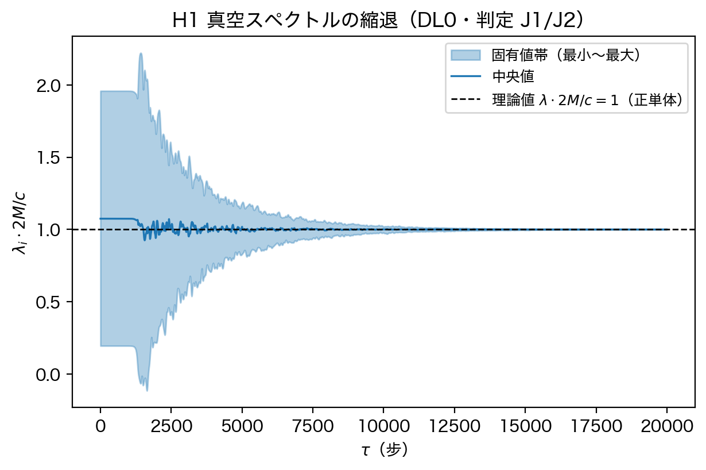
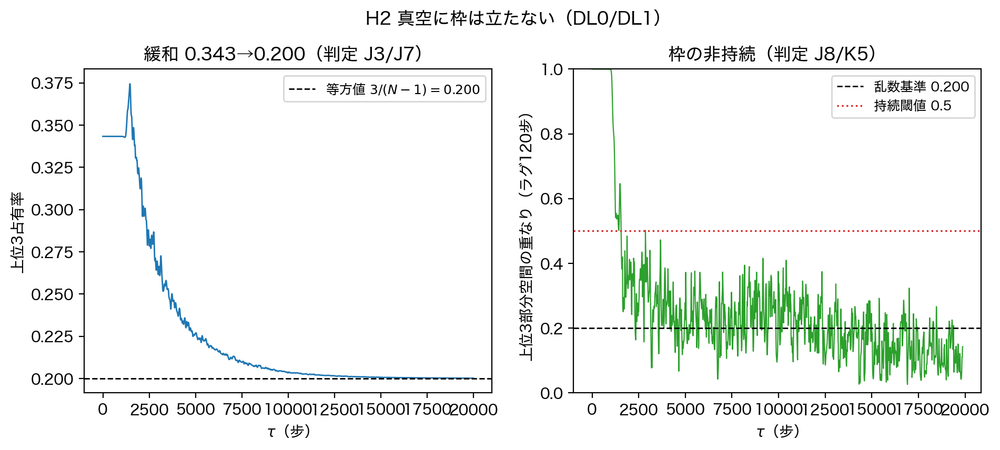
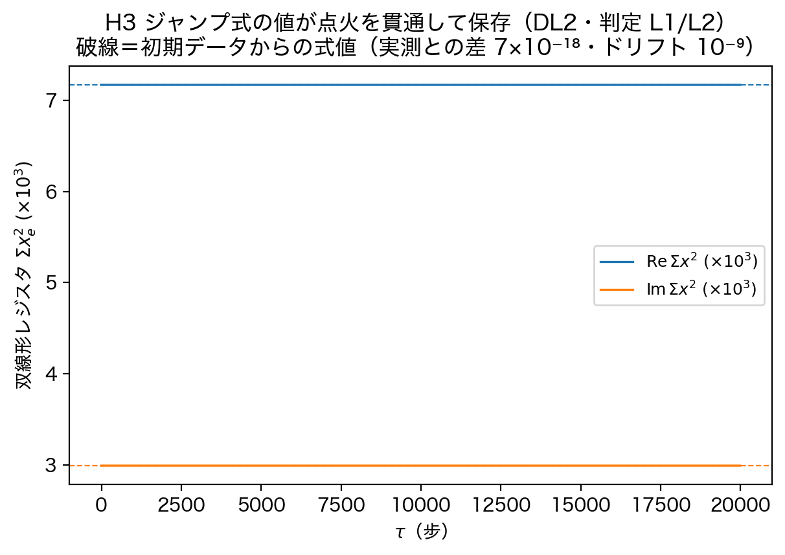
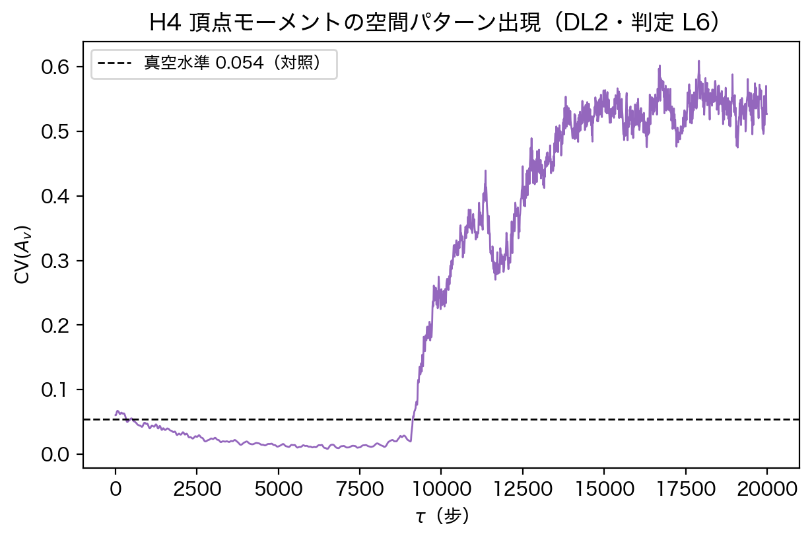
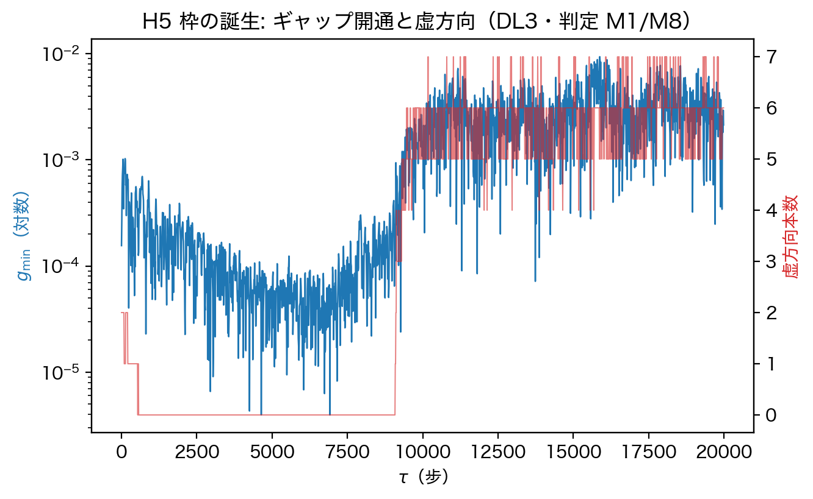
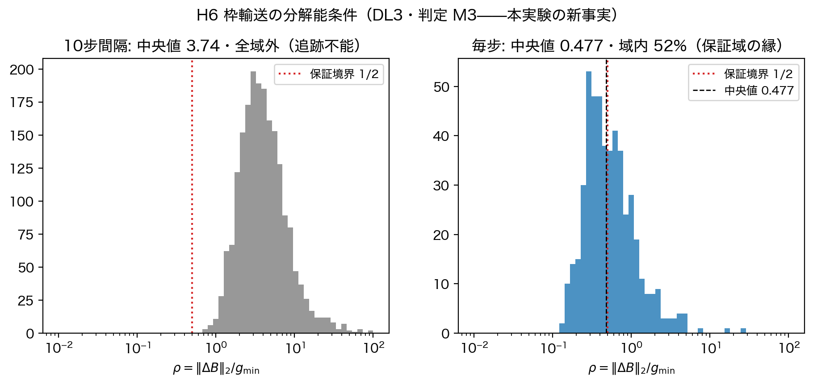
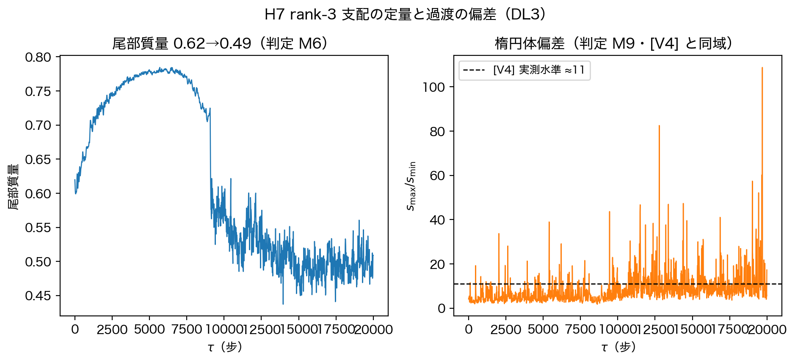
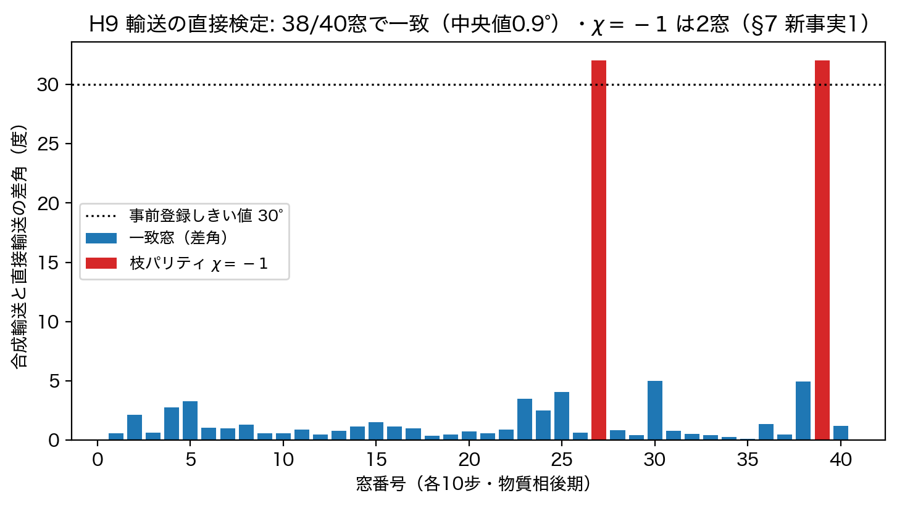
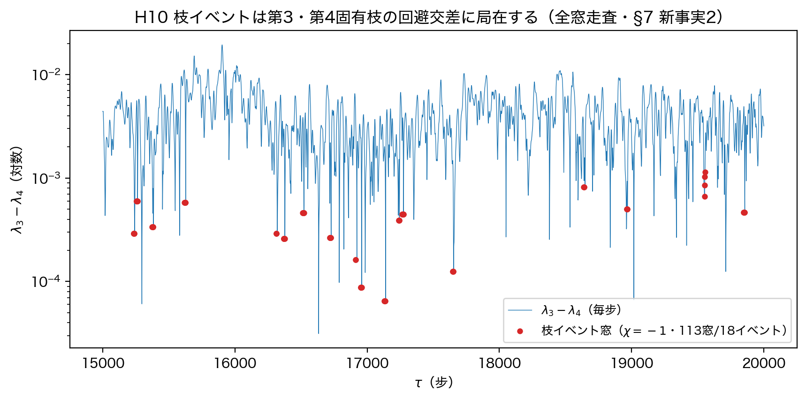
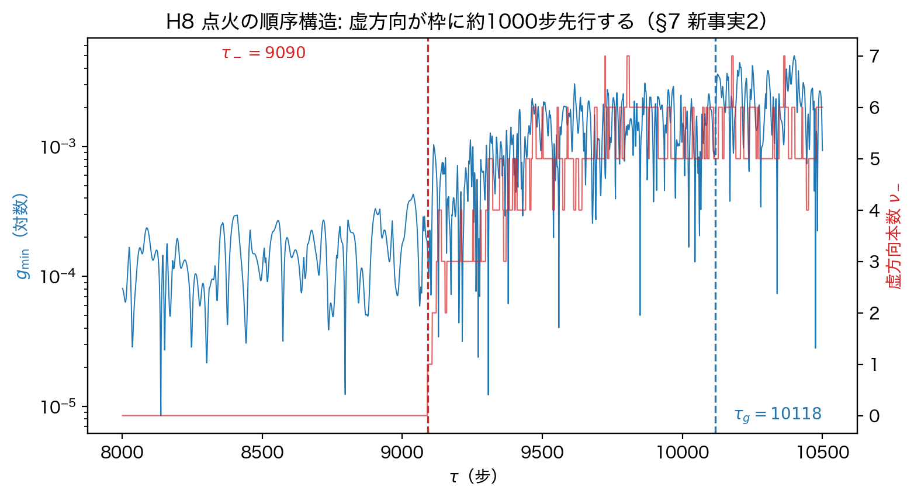

# 絶対ゲージ空間の誕生——真空正単体から枠の誕生までの読出し実験

木原範昭

状態: 草稿 v1（2026-08-19。DOI 取得前。導出ノート: `dynlab_v1/DL0〜DL3_導出ノート.md`、
実験プログラム: `dynlab_v1/`。タイトルは木原確認待ち）

---

## 本論文の位置づけ

本論文はシリーズ第3編の**実験論文**である。第1編「体ゲージと絶対ゲージ空間」[F1] が運動学の定義を、第2編「関係波動力学の導出」[F2] が動力学の導出を与えた。本論文は両編の定義と導出に従い、**読出しが関係状態へ書き戻さない**数値実験 DL0（真空基底状態）・DL1（真空の保存則）・DL2（物質投入のレジスタ）・DL3（枠の誕生と輸送）の4系列を実施した。関係状態を変えるのは統一相互作用 F と初期投入だけであり、以後の全量は読出しである（[F1] の二層構造そのまま）。

事前登録した合格基準つき判定26件のうち、適用可能な24件中22件が成立した。残る2件のうち J8 は判定対象の設計誤りであり（正しい判定対象は K5 で成立）、M3 は上界定理の適用限界が判明したため直接検定を追加して決着させた（§7）。あわせて新事実3件——枠の細分輸送と直接輸送の経路差はまれな離散イベント（非自明 $\mathbb{Z}_2$ 枝ホロノミー）として現れること、そのイベントは $\lambda_3-\lambda_4$ の**回避交差**（有限ギャップの深い接近）に局在し厳密縮退は一度も起こらないこと、点火は符号構造が枠に先行する順序遷移であること（しきい値36組合せで不変）——を記録した。

## 要旨

第1編 [F1] の体ゲージ・絶対ゲージ空間・二層状態の定義と、第2編 [F2] の真空正単体定理・保存則・運動方程式の導出に従い、統一相互作用エンジン（$N=16$・20000步・決定的）上で、関係状態へ書き戻さない読出し実験 DL0〜DL3 を実施した。結果は導出どおりだった：真空は正単体に緩和し（占有率 0.2003、固有値は $c/2M$ に縮退、[V4] の実測3値と一致）、枠は立たず（重なりは持続閾値を常に下回る）、両レジスタは点火を貫通して保存され（ドリフト $10^{-9}$）、物質投入の双線形ジャンプは初期データからの式値と $7\times10^{-18}$ で一致し（[V4] が実測していた複素値 $+7.168\times10^{-3}+2.991\times10^{-3}i$ はこの式の出力だと決着）、投入後にスペクトルギャップが開通して絶対ゲージ空間が誕生し、指定した掌性枝は全区間輸送された。恒等式判定（トレース和則・スペクトル切断恒等式・$\sum u_A=0$）はすべて機械精度で成立した。

新事実は三つである。**（1）枠輸送の実測構造**。10步間隔の読出しでは Davis–Kahan の輸送保証は得られない（輸送比中央値 3.74）が、保証の不在は輸送不能を意味しない：毎步合成輸送と10步直接輸送の直接比較で、両者は40窓中38窓で一致し（差角中央値 0.9°）、経路差は枝パリティ $\chi=-1$——ゲージ不変な**非自明 $\mathbb{Z}_2$ ホロノミー**——のまれな離散イベントとして現れる。**（2）枝イベント＝回避交差**。後期全域のスライド窓4991本の走査で枝イベントは18回起き、固有枝の系譜追跡により順位3・4の枝の**ラベル交換18回と一致**（枝交換は実在する）。有効2×2行列の解析により厳密縮退 $\lambda_3=\lambda_4$ は一度も起こらず（結合 $2|c^*|$ 中央値 $2.3\times10^{-4}$・厳密交差候補0件）、**枝ホロノミーは有限ギャップの回避交差で生じる**。発生率は窓統計で最下五分位 11.2%・第2五分位 0.1%・上位3五分位 0%、イベント統計で 18/18 が最下五分位。接続の履歴依存（[F1] の縮退通過規則）は常時機構ではなく、判別集合 $\lambda_3=\lambda_4$ への深い接近に局在した枝選択機構である。**（3）点火の順序構造**。毎步分解能の事前登録測定で、虚方向の出現（$\tau_-=9090$）はギャップの持続的開通（$\tau_g=10118$）に約1000步**先行**し、この順序はしきい値の全36組合せで不変だった。10步サンプルの図が示唆した同時性は成立せず、点火は「虚方向が先に立ち、枠が後から立つ」順序遷移である。あわせて負固有値重み比 $W_-$（後期平均 0.304）を記録した——スペクトル重みの約3割が虚方向にあり、rank-3 支配は正方向の中の主張である（$\lambda_3>0$ は全区間 100%）。

---

## 1. 検証対象

本実験が検証する命題は、第1編・第2編で導出済みのものに限る。

| 系列 | 検証する命題 | 出所 |
|---|---|---|
| DL0 | 真空正単体定理：基底状態は正 $(N-1)$ 単体、$\lambda=c/2M$ 完全縮退、上位3占有率 $3/(N-1)$、枠の不在 | [F2] §2 |
| DL1 | 保存則：$B\mathbf{1}=0$、エルミート・双線形両レジスタの厳密保存、真空の不変性（奇数帯湧きゼロ） | [F2] §3・[F1] §6 |
| DL2 | レジスタのジャンプ式（初期データから閉形式）、トレース和則 $\mathrm{tr}(B)=c/N$、頂点モーメントの空間パターン出現 | [F2] §2–3 |
| DL3 | 枠の存在条件（規約1）のギャップ開通、Davis–Kahan 輸送条件、掌性保存、スペクトル切断恒等式、$\sum u_A=0$ | [F1] §2.3–2.4・[F2] §4 |

判定はすべて実行前に導出ノート（`DL0〜DL3_導出ノート.md`）へ登録した：判定量・理論値・合格しきい値・不成立時の診断先。実行後にしきい値を動かして合格させることはしない（修正が必要になった件は §7 に修正・整理・撤回として明記する）。

**事前登録の時間順序**：初期の26判定は全走行の実行前に固定した。M3 の結果で Davis–Kahan の適用限界が判明した後の直接輸送検定（§7 新事実1）・点火時刻検定（新事実3）・全窓走査と順序不変性検定（新事実2/3b）・系譜追跡・有効2×2結合解析・選択則解析（新事実2の回避交差同定）は、いずれも**各追試の実行前に**判定基準（差角 30°・イベント率 10%・しきい値グリッド）を固定してから走らせた事後追加の検定である。事後解析としてしきい値を選んだものはない。

## 2. 実験構成

- **力学**：統一相互作用エンジン `unified_interaction_v1`（[F2] §8 の実装決定に従う。真空湧きゼロを厳密判定するため v1 を用い、v2 分岐は対照として奇数帯湧きを併記）。$N=16$（辺 $M=120$）、20000步、決定的（乱数規則は親構成の正本）。
- **読出し**：関係振幅 $x_e=\sum_{k,\eta}C_2[e,k,\eta]$。対スカラー $d_e=|x_e|$ から二重中心化 $B=-\tfrac12 J D^{\circ 2}J$、固有分解、長さ順主軸（[F1] §2 の読出し連鎖そのまま）。自明零固有値は固有ベクトルが定数ベクトル $1/\sqrt N$ に最も近いものとして同定する（§7 修正1参照）。
- **読出しは一方向**：読出しは関係状態へ書き戻さない。関係状態を変えるのは統一相互作用 F と、DL2/DL3 の初期投入（$\delta=0.1$・エンジン正本の標準宇宙構成）だけである。
- **規格化**：判定は $c=\sum_e|x_e|^2$ で正規化した量に適用する（各定理は規格化に対して同次）。
- **固有値の順序規約とギャップの定義**：固有値は自明零を除いた後、**値順**（絶対値順ではない）の降順 $\lambda_1\ge\cdots\ge\lambda_{N-1}$ に並べる。「上位3」は常にこの値順の上位3本を指す（M2 の $\sum|\lambda|$ は正規化の分母にのみ用いる）。ギャップは**軸ギャップ**

$$g_{\min}=\min\{\lambda_1-\lambda_2,\ \lambda_2-\lambda_3,\ \lambda_3-\lambda_4\}$$

を用いる。これは上位3軸を個々に一意化する条件であり、部分空間ギャップ $\lambda_3-\lambda_4$ より強い（$g_{\min}\le\lambda_3-\lambda_4$）。

## 3. DL0——真空は正単体に緩和し、枠は立たない

真空走行（$\delta=0$）の判定結果：

| 判定 | 量 | 理論値 | 実測 | 結果 |
|---|---|---|---|---|
| J1 | 固有値縮退 | 全 $N-1$ 本が $c/2M$ | 最大/最小$-1$＝0.45%、中央値の比誤差 $8.3\times10^{-5}$ | 成立 |
| J2 | $\mathrm{tr}(B)\cdot N/c$ | 1（恒等式） | 誤差 $6.7\times10^{-16}$ | 成立 |
| J3 | 上位3占有率 | $3/(N-1)=0.200$ | 0.2003 | 成立 |
| J4 | 虚方向（負固有値） | 0本 | 0本 | 成立 |
| J5 | 双線形レジスタ $\lvert\sum x^2\rvert/c$ | 0 | $3.4\times10^{-15}$ | 成立 |
| J6 | $r_{\rm rms}\cdot N/\sqrt c$ | 1（恒等式） | 誤差 $4.4\times10^{-16}$ | 成立 |
| J7 | 等方への緩和 | 初期異方→0.200 | 0.3433→0.2003 | 成立 |
| J8 | 枠の不在 | 重なりが乱数基準近傍 | ラグ120步で 0.129 | §7 整理2（判定対象の誤り） |

緩和の径路（0.3433→0.2003）は、[V4] が三系模型で実測した 0.343→0.200 と一致した（初期値まで一致するのは親構成の乱数規則正本を共有するため）。正単体の実測3値 $\sqrt\lambda=0.0645$・$\mathrm{tr}(B)/N$ 換算 0.0625・占有 0.200（[V4]）は本エンジンでも同値である。

**図H1** 真空スペクトルの縮退。固有値帯（最小〜最大、$\times 2M/c$）が理論値 1 へ収束する。

**図H2** 左：上位3占有率の緩和（0.343→0.200）。右：上位3部分空間の重なり（ラグ120步）は後期 $[0.026,\,0.324]$ に留まり、持続閾値 0.5 を一度も超えない——持続する選好軸は現れない（K5）。

## 4. DL1——保存則は機械精度で成立し、真空に物質は湧かない

同一真空走行の保存則判定：

| 判定 | 量 | 理論値 | 実測 | 結果 |
|---|---|---|---|---|
| K1 | $\lVert B\mathbf{1}\rVert_\infty$ | 0（恒等式） | $3.0\times10^{-18}$ | 成立 |
| K2 | エルミートレジスタのドリフト | 0（[F2] 保存則） | $2.2\times10^{-15}$ | 成立 |
| K3 | 双線形レジスタのドリフト | 0（同上） | $3.5\times10^{-15}$ | 成立 |
| K4 | 奇数帯パワー（物質の湧き） | 厳密 0（v1） | **厳密 0**（20000步） | 成立 |
| K5 | 枠の非持続 | 重なり $<0.5$ | 後期 $[0.026,\,0.324]$ | 成立 |
| K6 | $\mathrm{tr}(B)=c/N$ | 恒等式 | $4.4\times10^{-16}$ | 成立 |

対照：v2 分岐の奇数帯湧きは 2000步で最大 $1.3\times10^{-26}$（既知仕様）。v1 は厳密ゼロであり、「真空に物質は湧かない」は本実装で厳密に成立する。

## 5. DL2——レジスタのジャンプは式のとおりで、点火を貫通して保存される

物質投入走行（$\delta=0.1$、エンジン正本のスライス1シード）の判定：

| 判定 | 量 | 理論値 | 実測 | 結果 |
|---|---|---|---|---|
| L1 | 双線形ジャンプの値 | 初期データからの式値（[F2] §3） | 差 $7.1\times10^{-18}$ | 成立 |
| L2 | 両レジスタの保存 | 点火貫通で保存 | 双線形 $1.1\times10^{-9}$・エルミート $3.3\times10^{-9}$ | 成立 |
| L3 | $\mathrm{tr}(B)\cdot N/c$ | 1（全区間） | $1.8\times10^{-15}$ | 成立 |
| L4/L5 | パケット有理数 $r=15/34$・$\lvert z\rvert=16/17$ | — | **適用外**（§7 修正3） | — |
| L6 | $\mathrm{CV}(A_v)$ | 投入で分散が立つ | 真空 0.054→投入直後 0.061→後期 0.535 | 成立 |
| L7 | 動径 $r_A$ | 時系列記録 | 系列保存（npz） | 記録 |

L1 の決着は特記に値する。ジャンプの実測値 $+7.168\times10^{-3}+2.991\times10^{-3}i$ は、[V4] 18-c が「シードが $\tau=0$ に刻む複素値」として実測のみ報告していた値と同値である。本実験はこの値が初期データからの閉形式（真空恒等式 $\sum v^2=0$ を用いた式）の出力であることを $10^{-18}$ で確認した——実測値だったものが導出値になった。

L2 の保存幅 $10^{-9}$ は [V4] の実測 $10^{-7}$ より強い。これは実行前に導出ノートへ追記した資格（共有直交線形部は全スライスに同一変換を掛けるため多スライス占有でも両レジスタを保存し、媒介頂点はレジスタ点ごとに保存する）のとおりである。残るドリフトが頂点部（RK4）の積分器誤差であることは**収束試験で決着した**：頂点積分の刻み上限を $H_0=0.02,\ H_0/2,\ H_0/4$ と振ると、点火を含む窓のドリフトは $3.1\times10^{-11}\to4.5\times10^{-12}\to1.4\times10^{-13}$ と縮み（縮小比 6.9・32.3、推定次数 2.8・5.0——RK4 の4次と整合。刻み数の量子化 $n_{\rm sub}=\lceil L_{\max}/H_{\rm max}\rceil$ が比のばらつきを与える）、保存則の破れではなく数値積分誤差である。

**図H3** 双線形レジスタの実部・虚部（実線）と初期データからの式値（破線）。点火開始（$\tau_-=9090$）から枠成立（$\tau_g=10118$、図H8）までを貫通して重なったまま変わらない。

**図H4** 頂点モーメントの変動係数 $\mathrm{CV}(A_v)$。真空水準 0.054 から後期 0.54 へ——局所レジスタの空間パターンが出現する。

## 6. DL3——枠は誕生し、指定した掌性枝は輸送される

同一物質走行の枠判定：

| 判定 | 量 | 理論値 | 実測 | 結果 |
|---|---|---|---|---|
| M1 | ギャップ $g_{\min}$ | 投入後に開通が持続（規約1成立） | $1.6\times10^{-4}$→後期平均 $3.4\times10^{-3}$（後期最小も正） | 成立 |
| M2 | 上位3占有 | 真空値 0.200 を上回る | $\sum\lvert\lambda\rvert$ 正規化で後期 0.51 | 成立 |
| M3 | 輸送比 $\rho=\lVert\Delta B\rVert_2/g_{\min}$ | $\rho<1/2$ で輸送が定理保証 | 10步間隔：中央値 3.74（保証域外）。毎步：中央値 0.477・域内 52%。**直接検定は §7 新事実1** | 直接検定で決着 |
| M4 | 掌性枝の輸送 | $SO(3)$ 整列は構成により $\det=+1$ を保持——判定は接続実装が指定枝を正しく輸送したことの検証 | $\det$ 符号全区間 $+1$、枝不一致は §7 新事実1 の2窓のみ | 成立（実装検証） |
| M5a | スペクトル切断恒等式：値順上位3軸の切断 $B_3=\sum_{i\le3}\lambda_iv_iv_i^{\mathsf T}$ について $\lVert B-B_3\rVert_F^2=\sum_{i\ge4}\lambda_i^2$ | 恒等式（固有ベクトルの直交性） | 相対誤差 $5.0\times10^{-15}$ | 成立 |
| M5b | rank-3 最適性（Eckart–Young）：$\min_{i\le3}\lvert\lambda_i\rvert\ge\max_{j\ge4}\lvert\lambda_j\rvert$ | 成立すれば $B_3$ は最良 rank-3 近似 | 全区間 28.8%・**後期 1.1%**——後期はほぼ常に不成立 | 記録（§7 参照） |
| M6 | 尾部質量 | 時系列記録 | 0.62→0.49 | 記録 |
| M7 | $\sum_A x_A$・$\sum_A u_A$ | 0（恒等式） | $4.7\times10^{-16}$・$6.2\times10^{-16}$ | 成立 |
| M8 | 虚方向本数 | 記録（[V4] 主張14） | 後期最大 7本 | 記録 |
| M9 | 楕円体偏差 | 記録 | $s_{\max}/s_{\min}$ 後期平均 11.03 | 記録 |

**点火の順序構造**（§7 新事実3）。10步サンプルの図H5はギャップ開通と虚方向出現が同時に見えるが、毎步分解能の事前登録測定（基線の10倍を50步連続で超えた最初の步を $\tau_g$、負固有値が50步連続で立った最初の步を $\tau_-$）では $\tau_-=9090$、$\tau_g=10118$——**虚方向が約1000步先行**する。同時性は成立しない。

**模型間再現**。虚方向の本数（後期 5〜7 本）は [V4] 三系模型の実測 4〜7 本と同域、楕円体偏差（≈11）は [V4] の実測 ≈11 と同値である。実装の異なる二つの力学（統一エンジンの媒介頂点系と三系模型）が、物質相の読出し指標で一致した。

**図H5** 枠の誕生（10步サンプル）。ギャップ開通（青・対数）と虚方向の出現（赤）は同時に見えるが、毎步測定では虚方向が約1000步先行する（§7 新事実2）。

**図H6** 輸送比の分布。左：10步間隔では全フレームが保証境界 $1/2$ の右——定理の保証は得られない。右：毎步では中央値 0.477 で分布が境界をまたぐ。保証の不在が輸送不能を意味するかは直接検定（§7 新事実1）が決着させた。

**図H7** 左：尾部質量（rank-3 支配の定量）。右：楕円体偏差は [V4] 実測水準 ≈11 に高止まりする（過渡・準安定では面に乗らない——導出どおり）。

## 7. 判定設計の修正・整理と新事実

実験は仮説→実測→反証→修正の全過程を記録する。修正2件・整理1件・撤回1件・新事実3件である。

**修正1（実装バグ・恒等式判定が検出）**。初版の読出し実装は「固有値降順の末尾＝自明零」と仮定していたが、負固有値を持つ一般状態では末尾は最も負の固有値であり、自明零は固有ベクトルが定数ベクトル $1/\sqrt N$ に最も近いものとして同定しなければならない。このバグは恒等式判定 J2/J6（初版で 0.77% の見かけ違反）が検出した——恒等式を判定に含める設計が、そのとおりにバグ検出器として機能した。修正後は機械精度で成立。

**整理2（J8 は判定対象を誤っていた）**。J8 の実装判定「重なりの後期平均が $0.200\pm0.05$」は不成立だった（実測 0.129）。だが誤りは統計の細部でなく判定対象の選択にある。真空で枠が存在しない本質は正単体極限の完全縮退 $\lambda_1=\cdots=\lambda_{N-1}$——主軸が**代数的に**選べないこと——であり、これは J1 が検証している。重なり統計が測るのは**数値的に持続する選好軸が現れない**ことであり、これは K5（持続閾値 0.5 を常に下回る）が検証している。J8 は両者を混同した判定だった。この分離から、枠には**代数的存在**（ギャップ条件）と**輸送可能性**（追跡条件）の二段階があることが明確になる——DL3 の M1 と M3 はまさにこの二段階を別々に測っている。

**修正3（L4/L5 の適用範囲）**。パケットの厳密有理数判定（$r=15/34$・$\lvert z\rvert=16/17$）は CR 型パケット投入用であり、本走行のエンジン正本投入には適用できない。パケット投入変種は次編の走行として登録した。

**撤回1（草稿の「毎步必須・接続の常時作動」）**。本論文の草稿は、10步間隔で輸送比が保証域外（中央値 3.74）であることから「枠は追跡不能・毎步読出し必須・接続は常時作動」と結論していた。これは論理の向きを誤っている：Davis–Kahan は回転角の**上界**を与える定理であり、$\rho>1/2$ から輸送不能は導けない。決着には輸送誤差の直接測定が要る——それが新事実1である。

**新事実1（枠輸送の実測構造——直接検定）**。まず定義を分離する。**輸送作用素** $F$ は常に $SO(3)$ に取る（$\det=+1$——掌性は構成により保持）。これとは別に、生の固有枠 $Q$（列符号任意）に対する**枝パリティ**を

$$\chi(n,n+W)=\operatorname{sgn}\det\!\big(Q_n^{\mathsf T}Q_{n+W}\big)\cdot\prod_{k=n}^{n+W-1}\operatorname{sgn}\det\!\big(Q_k^{\mathsf T}Q_{k+1}\big)\ \in\{\pm1\}$$

と定義する（各中間 $Q_k$ は二つの因子に現れるため列符号の反転は相殺し、$\chi$ は符号規約に依らない）。$\chi=-1$ を**枝不一致イベント**と呼ぶ。二つの $SO(3)$ 輸送の差は反射になり得ないから、$\chi=-1$ は「輸送が反射した」ことではなく「毎步合成と一括直接で**枝の割当**が食い違った」ことを意味する。

この $\chi$ は**離散 $\mathbb{Z}_2$ ホロノミー**である。$\epsilon_{ab}=\operatorname{sgn}\det(Q_a^{\mathsf T}Q_b)$ と置くと、各時刻の列符号変更 $Q_a\to Q_aD_a$（$\eta_a=\det D_a\in\{\pm1\}$）に対して $\epsilon_{ab}\to\eta_a\epsilon_{ab}\eta_b$——これは離散 $\mathbb{Z}_2$ 接続のゲージ変換則そのものであり、閉路上の積では各 $\eta_a$ が2回現れて消える。$\chi$ は「細分経路 $n\to n{+}1\to\cdots\to n{+}W$」と「直接経路 $n\to n{+}W$」を合わせた閉路のゲージ不変な積、すなわち固有枠束の $\mathbb{Z}_2$ 枝ホロノミーである。$\lambda_3=\lambda_4$ は順序付き3枠の座標が特異になる判別集合であり、通常領域では局所枠が滑らかに選べるが、判別集合近傍を跨ぐ閉路では局所選択だけで一意につながらず履歴が要る——[F1] が抽象的に導入した履歴依存接続 $\Phi(n)=D(z(n),\Phi(n{-}1))$ が、ここで初めてゲージ不変な閉路量として実測されたことになる。

物質相後期の40窓（各10步）の事前登録検定（差角 $>30°$ または $\chi=-1$ の窓が 10% を超えれば「毎步必須」）：**38/40 窓で一致**（差角中央値 0.9°・最大 5.0°）、$\chi=-1$ は 2/40 窓——しきい値 10% 未満で「毎步必須」は成立しない。枠の輸送誤差は連続的には小さく、経路差（非自明ホロノミー）はまれな離散イベントとして起こる。付記：毎步整列の $O(3)$ 最適解の $\det$ 符号（−1 が 46.5%）は固有ベクトル列符号のアーティファクトであり物理量ではない（$\chi$ は上記のとおり不変）。隣接步の部分空間ジャンプ（重なり $<0.9$）は 0.7%。

**図H9** 輸送の直接検定（40窓標本）。38/40 窓で合成輸送と直接輸送は一致し（差角は最大でも 5°）、2窓で枝パリティ $\chi=-1$。

**新事実2（枝イベント＝第3・第4固有枝の回避交差——全窓走査と系譜・結合解析）**。40窓の標本を後期全域のスライド窓（$\tau\in[15000,19990]$、4991窓）に拡張した。結果：$\chi=-1$ は 113 窓（2.3%）、連続窓を併合して **18 イベント**。決定的なのはその位置である：**イベント窓 113 本すべてで、窓内の最小隣接ギャップは $\lambda_3-\lambda_4$ だった**（$\lambda_1-\lambda_2$・$\lambda_2-\lambda_3$ は一度も最小にならない）。イベント窓の窓内最小ギャップ中央値は $3.9\times10^{-4}$ で全窓中央値 $2.0\times10^{-3}$ の約 1/5——枝イベントは**第3空間軸と第4軸（枠外の最大軸）が深く接近する時刻に集中して起こる離散接続イベント**である。帰結：接続の履歴依存（[F1] §2.4 の縮退通過規則）は常時機構ではなく、$\lambda_3\approx\lambda_4$ の交差通過に局在した枝選択機構である。粗い読出しでも枠はほぼ正しく運べるが、この交差を見落とさないためには $\lambda_3-\lambda_4$ の監視（枝検出つき輸送）が要る——これが次編のプロトコル条件の正確な形である。

**交差の同定（系譜追跡）**。値順表示では常に $\lambda_3\ge\lambda_4$ なので、「最小ギャップ」と「交差」は同じでない（回避交差の可能性が残る）。そこで隣接步の全基底重なりの最大割当で15本の固有枝にラベルを付けて系譜を追跡した。結果：順位3の枝と順位4の枝の**ラベル交換は18回**——併合枝イベント数18と一致し、**枝交換は実在する**。窓単位でも「$\chi=-1$ ⟺ 窓内交換回数が奇数」の一致率は 96.7%（残差は縮退近傍で系譜割当自体が曖昧になる窓）。

**厳密交差か回避交差か（結合解析）**。系譜のラベル交換は枝交換の証明であって厳密縮退 $\lambda_3=\lambda_4$ の証明ではない——回避交差でも固有ベクトルの性格は入れ替わる。そこで各イベント近傍で、断熱2平面内を平行輸送した非固有基底 $P$ における有効2×2行列 $M=P^{\mathsf T}BP$（成分 $a,b$＝対角・$c$＝非対角）の軌跡 $(a-b,\ 2c)$ を測った。固有値差は $\sqrt{(a-b)^2+(2c)^2}$ だから、厳密交差 ⇔ 軌跡が原点を通る。結果：18イベント中17件で $a-b$ は符号反転する（対角成分は交差する）が、反転点での結合 $2|c^*|$ は**全イベントで有限に残る**（中央値 $2.3\times10^{-4}$、比 $2|c^*|/\min\Delta_{34}$ 中央値 0.98・最小 0.129、厳密交差候補〔比 $<0.1$〕は0件）——**枝ホロノミーは有限ギャップの回避交差で生じる**。厳密縮退は一度も起こらない。これは実対称1径数族の一般論（厳密縮退は余次元2——von Neumann–Wigner）と整合し、$\lambda_3=\lambda_4$ を強制する構造的対称性はこの系に存在しないことを意味する。判別集合は**接近されるが触れられない**——それでも枝は交換され、$\mathbb{Z}_2$ ホロノミーが立つ。

**選択性の定量**。基底率は高い——非イベント窓でも $\lambda_3-\lambda_4$ が最小ギャップである割合は 73.5% ある（イベント窓では 100%）。局在の強さを示すのは条件付き発生率である：$\lambda_3-\lambda_4$ の窓内最小値の五分位で切ると

$$P(\chi=-1\mid \Delta_{34}\text{五分位})=[\,11.2\%,\ 0.1\%,\ 0\%,\ 0\%,\ 0\%\,]\quad(\text{小さい方から})$$

——発生率は最下五分位で 11.2%、第2五分位で 0.1%、上位3五分位では 0% であり、ギャップ閉鎖へ向かって急増する。窓は同一イベントを重複して数えるため（113窓＝18イベント）、イベント単位の統計も併記する：**18イベント中18件**の最小ギャップが最下五分位に属する。$P_{\rm branch}=f(\lambda_3-\lambda_4)$ の関数形の同定は次編の課題である。

**数値健全性（符号マージン）**。$\chi$ を構成する行列式の絶対値は、隣接步で全区間最小 $7.1\times10^{-2}$（イベント窓内では最小 0.168）、直接経路でイベント窓内最小 $1.7\times10^{-3}$——いずれも機械零（$10^{-16}$）から桁違いに離れており、$\chi=-1$ は数値符号ノイズではない。

**図H10** 全窓走査。枝イベント（赤・$\chi=-1$）は $\lambda_3-\lambda_4$（青・毎步）の深い谷（回避交差）に例外なく張り付く。

**新事実3（点火の順序構造）**。ギャップ開通と虚方向出現の同時性を、毎步分解能・事前登録定義（基線 $g_b=$ 点火前窓の中央値、$\tau_g=g_{\min}>10g_b$ が50步連続の初出、$\tau_-=$ 負固有値が50步連続の初出）で検定した。結果：$\tau_-=9090$、$\tau_g=10118$、$\Delta\tau=1028$——**同時ではない**。虚方向（読出し幾何の非ユークリッド性）が先に立ち、約1000步おいて枠（軸の代数的一意性）が立つ。10步サンプルの図の同時の印象は誤りだった。点火は一撃の相転移ではなく、**虚方向の発生→ギャップの持続的開通**という順序を持つ遷移である。

**新事実3b（順序不変性）**。この順序がしきい値の取り方の産物でないことを、$\nu_-$ の負判定 $\varepsilon\in\{10^{-12},10^{-10},10^{-8},10^{-6}\}\times\mathrm{tr}(B)$、ギャップしきい $\{5,10,20\}\times g_b$、持続長 $\{20,50,100\}$ 步の全 **36 組合せ**で検定した。結果：**36/36 で $\tau_-<\tau_g$**——特定の「約1000步」という値以上に、**虚方向の出現は枠の成立に先行する**という順序そのものがしきい値に対して不変である。さらに $W_-$（負固有値の重み比）の立ち上がり時刻を同じ持続定義で測ると $\tau_W=9090=\tau_-$——**符号構造は重み（$W_-$）と本数（$\nu_-$）が同一步で立ち、揃って枠（$g_{\min}$）に先行する**。「$W_-\uparrow\to\nu_-\uparrow$」というさらに細かい段階分けは本分解能では解像されなかった（同時）。作業仮説（次編で検定）：関係距離から作った $B$ が正半定値から外れる——読出し幾何の符号構造が変わる——ことが、空間3軸の個体化に先行する。すなわち「物質点火→符号構造の破れ→縮退破れ→3軸の個体化」という因果系列の可能性がある。

**図H8** 点火の順序構造（毎步分解能・新事実3）。虚方向 $\nu_-$（赤）が $\tau_-=9090$ で立ち、ギャップ $g_{\min}$（青）の持続的開通 $\tau_g=10118$ が約1000步遅れて続く。順序はしきい値36組合せすべてで保存される。

**記録（M5b と虚方向の重み）**。値順上位3軸の切断 $B_3$ について $\lVert B-B_3\rVert_F^2=\sum_{i\ge4}\lambda_i^2$ は固有ベクトルの直交性による**スペクトル切断恒等式**であり機械精度で成立する（M5a）。一方、$B_3$ が Eckart–Young の意味で最良 rank-3 近似であるための条件 $\min_{i\le3}\lvert\lambda_i\rvert\ge\max_{j\ge4}\lvert\lambda_j\rvert$（M5b・事後追加）は**後期でほぼ常に不成立**（成立率 1.1%）。これは欠陥ではなく物理の記録である：負固有値の重み比 $W_-=\sum_{\lambda_i<0}\lvert\lambda_i\rvert/\sum_i\lvert\lambda_i\rvert$ は後期平均 **0.304**——スペクトル重みの約3割が虚方向にあり、絶対値順では虚方向が第3空間軸を上回る。「rank-3 支配」は**正方向の中で**成立する主張であり（$\lambda_3>0$ は全区間 100%）、正方向内部の3軸支配率 $\eta_{3+}=(\lambda_1+\lambda_2+\lambda_3)/\sum_{\lambda_i>0}\lambda_i$ は後期平均 **0.728**。二層量 $(W_-,\eta_{3+})=(0.304,\,0.728)$ が「内部虚方向の強さ」と「外部3空間の支配」を分離して数値化する——可視正方向では3軸が選択されるが、全関係幾何には大きな虚方向成分が残る。

**五量の記述**。以上から、枠の誕生は一個の量でなく五量
$$g_{\min}(n),\qquad \rho_n=\frac{\lVert\Delta B_n\rVert_2}{g_{\min}(n)},\qquad \nu_-(n),\qquad W_-(n),\qquad \eta_{3+}(n)$$
（軸の一意性・輸送難度・虚方向本数・虚方向強度・正方向3軸支配）で記述するのが正確である。真空：$g_{\min}=0$（縮退）・$\nu_-=0$・$W_-=0$。点火：$(W_-,\nu_-)$ が同一步で立ち、遅れて $g_{\min}>0$ が持続。物質相：$g_{\min}>0$・$\lambda_3>0$・$\nu_-=5\sim7$・$(W_-,\eta_{3+})\approx(0.30,\ 0.73)$・$\rho=O(1)$ だが実輸送誤差は小さく、枝イベントは $\lambda_3-\lambda_4$ の回避交差に局在して 18 回起こった。

## 8. 判定の分類総括

事前登録した合格基準つき判定26件の全一覧と、事後追加の記録。種別：**恒等**＝恒等式・実装監査（破れ＝バグ）、**力学**＝導出された定理・予言の検証、**輸送**＝幾何輸送の検証。

| # | 種別 | 内容 | 結果 |
|---|---|---|---|
| J1 | 力学 | 正単体縮退（枠の代数的不存在） | 成立 |
| J2 | 恒等 | $\mathrm{tr}(B)=c/N$ | 成立（$10^{-16}$） |
| J3 | 力学 | 占有率 $3/(N-1)$ | 成立 |
| J4 | 力学 | 真空の虚方向 0 本 | 成立 |
| J5 | 力学 | 真空双線形零（QR 恒等式） | 成立（$10^{-15}$） |
| J6 | 恒等 | $r_{\rm rms}$ 和則 | 成立（$10^{-16}$） |
| J7 | 力学 | 等方への緩和 | 成立 |
| J8 | — | 判定対象の誤り（§7 整理2。正しい対象は J1・K5） | 整理 |
| K1 | 恒等 | $B\mathbf{1}=0$ | 成立（$10^{-18}$） |
| K2 | 力学 | エルミートレジスタ保存 | 成立（$10^{-15}$） |
| K3 | 力学 | 双線形レジスタ保存 | 成立（$10^{-15}$） |
| K4 | 力学 | 真空の不変性（湧きゼロ） | 成立（厳密 0） |
| K5 | 力学 | 持続する選好軸の不在 | 成立 |
| K6 | 恒等 | $\mathrm{tr}(B)=c/N$（保存則側） | 成立 |
| L1 | 力学 | ジャンプ式の値 | 成立（$10^{-18}$） |
| L2 | 力学 | 点火貫通の保存 | 成立（$10^{-9}$） |
| L3 | 恒等 | トレース和則（物質側） | 成立 |
| L4/L5 | — | パケット有理数（適用外・次編） | 適用外 |
| L6 | 力学 | 頂点パターン出現 | 成立 |
| M1 | 力学 | ギャップ開通（枠の代数的誕生。$\lambda_3>0$ は全区間 100%） | 成立 |
| M2 | 力学 | 占有上昇 | 成立 |
| M3 | 輸送 | 輸送比と輸送可能性 | 直接検定で決着（§7 新事実1） |
| M4 | 輸送 | 掌性枝の輸送（実装検証） | 成立 |
| M5a | 恒等 | スペクトル切断恒等式 | 成立（$10^{-15}$） |
| M5b | 記録 | rank-3 最適性（事後追加・§7） | 後期はほぼ不成立＝$W_-$ の物理 |
| M7 | 恒等 | $\sum x_A=0$・$\sum u_A=0$ | 成立（$10^{-16}$） |

記録量（合格基準なし）：L7（動径）、M6（尾部質量）、M8（虚方向本数）、M9（楕円体偏差）、M5b（rank-3 最適性・事後追加）、$W_-$（負固有値重み比・事後追加）。

## 9. 結論

第1編・第2編の定義と導出に従い、読出しが関係状態へ書き戻さない実験 DL0〜DL3 を実施した。適用可能な事前登録判定24件中22件が成立した：真空は正単体に緩和して枠は立たず（代数的不存在＝J1、数値的非持続＝K5）、保存則と恒等式は機械精度で成立し、物質投入のレジスタジャンプは初期データからの式値と一致し、投入後にギャップが開通して絶対ゲージ空間が誕生し（$\lambda_3>0$ は全区間 100%）、指定した掌性枝は正しく輸送された。[V4] で実測のみだった複素ジャンプ値は導出値になり、実装の異なる二つの力学が物質相の読出し指標（虚方向本数・楕円体偏差）で一致した。

本実験の中心成果は、**真空の縮退→符号構造の破れ（虚方向）→3軸の選択（枠の誕生）→縮退境界近傍での非自明 $\mathbb{Z}_2$ 枝ホロノミー**という生成系列を、一つの数値系の時系列として観測し、五量 $(g_{\min},\rho,\nu_-,W_-,\eta_{3+})$ で定量化したことである。新事実は三つ：(1) 枠の細分輸送と直接輸送の経路差は連続誤差でなくまれな離散枝イベントであり（草稿の「毎步必須」は直接検定で撤回）、それを測る枝パリティ $\chi$ はゲージ不変な離散 $\mathbb{Z}_2$ ホロノミーである——$\chi=-1$ は輸送の失敗ではなく閉路の幾何学的情報であり、[F1] の履歴依存接続が初めて閉路量として実測された。(2) 枝イベントでは系譜交換（18回・イベント数と一致）が実在するが、有効2×2解析により厳密縮退は一度も起こらない——枝ホロノミーは**有限ギャップの回避交差**で生じ、発生率は窓統計で最下五分位 11.2%・第2五分位 0.1%・上位 0%（イベント統計 18/18 が最下五分位）。接続は「毎瞬大きく補正する連続装置」ではなく「通常はほぼ平滑に運び、判別集合 $\lambda_3=\lambda_4$ への深い接近で枝を選択する構造」である。(3) 点火はしきい値36組合せすべてで符号構造（$W_-$・$\nu_-$ 同時）が枠に先行する順序遷移である。

## 10. 今後の課題と決着方法

| 課題 | 決着方法 |
|---|---|
| 局所ゲージ場の読出し（DL4）・慣性レジスタと重み付き運動量（DL5）・体間ゲージ $U_{AB}$（DL6） | 導出ノートの追補（$U_{AB}$ の定義・並進整列の重み付け）を実行前固定した上で、枝イベント検出つき輸送プロトコル（§7 新事実1）による次編の実験 |
| 点火の順序機構——作業仮説「幾何の符号構造の変化が空間方向の選択に先行する」（§7 新事実3b）の検定 | 点火窓の毎步系列（保存済み）で $W_-$ の立ち上がりと固有値分裂の因果順序を分解する追実験。[F2] の摂動論（分裂はシードの一次）と突き合わせ、$W_-\uparrow\rightarrow\nu_-\uparrow\rightarrow g_{\min}\uparrow$ の細分化が成り立つか判定する |
| パケット投入変種の厳密有理数判定（L4/L5） | CR 型パケットをエンジンへ投入する変種走行として実施 |
| 電荷セクターの力観測量（復調読出しでの反発の実測） | [F2] §5.4 の復調観測量の設計ノートを作成の上、次編で実施 |

## 用語一覧

本論文の用語はすべて第1編 [F1]・第2編 [F2] の用語一覧を継承する。本論文の追加用語は次の7語のみ。

- **軸ギャップ $g_{\min}$**：値順降順の非自明固有値に対する $\min\{\lambda_1-\lambda_2,\lambda_2-\lambda_3,\lambda_3-\lambda_4\}$。上位3軸を個々に一意化する条件（部分空間ギャップ $\lambda_3-\lambda_4$ より強い）。
- **輸送比 $\rho$**：隣接読出しフレーム間の $\lVert\Delta B\rVert_2/g_{\min}$。$\rho<1/2$ で枠の連続輸送が Davis–Kahan の定理（[F2] [D2]）により**保証**される（上界定理であり、$\rho\ge1/2$ は輸送不能を意味しない——§7 撤回1）。
- **点火**：物質走行における順序遷移。虚方向の持続的出現（$\tau_-$）が先行し、ギャップの持続的開通（$\tau_g$）が後続する（本走行では $\tau_-=9090$・$\tau_g=10118$。順序はしきい値36組合せで不変——§7 新事実3b）。
- **枝パリティ $\chi$**：生の固有枠 $Q$ に対する $\operatorname{sgn}\det(Q_n^{\mathsf T}Q_{n+W})\cdot\prod_k\operatorname{sgn}\det(Q_k^{\mathsf T}Q_{k+1})$。列符号規約に不変で、細分経路と直接経路の閉路上の離散 $\mathbb{Z}_2$ ホロノミー。輸送作用素 $F\in SO(3)$（掌性）とは別の量。
- **枝不一致イベント**：$\chi=-1$ の窓。細分経路と直接経路が異なる枝類へ到達する非自明 $\mathbb{Z}_2$ ホロノミー（輸送の失敗ではない）。$\lambda_3-\lambda_4$ の回避交差に局在する（§7 新事実2）。
- **負固有値重み比 $W_-$**：$\sum_{\lambda_i<0}\lvert\lambda_i\rvert/\sum_i\lvert\lambda_i\rvert$。虚方向の本数（$\nu_-$）でなく強さを測る（後期平均 0.304）。
- **正方向3軸支配率 $\eta_{3+}$**：$(\lambda_1+\lambda_2+\lambda_3)/\sum_{\lambda_i>0}\lambda_i$。正方向内部での3軸支配（後期平均 0.728）。$(W_-,\eta_{3+})$ が内部虚方向と外部3空間の二層を分離する。

## 参考文献

### 自己引用

| 記号 | タイトル | DOI |
|---|---|---|
| [F1] | 体ゲージと絶対ゲージ空間——関係だけの空間における運動学の定式化 | **（公開後に記入）** |
| [F2] | 関係波動力学の導出——単一の力の法則と二つの復調セクター | **（公開後に記入）** |
| [V4] | ゼロ閉塞は4次元だった | 10.5281/zenodo.21902806（ja）／21902805（en） |

### 外部引用

なし。判定設計が依拠する古典定理（Davis–Kahan・Eckart–Young・Procrustes 整列）の書誌は第2編 [F2] の [D2][D3][D4] を参照。

## 再現物

すべて `dynlab_v1/` 配下。各プログラムは決定的で、単独実行で結果 JSON（と系列 npz）を再生する。

| 系列 | プログラム | 結果 |
|---|---|---|
| DL0 | `run_dl0_vacuum_v1.py` | `result_dl0_vacuum_v1.json`・`dl0_series_v1.npz` |
| DL1 | `run_dl1_readout_v1.py` | `result_dl1_readout_v1.json` |
| DL2/DL3 | `run_dl23_matter_v1.py` | `result_dl23_matter_v1.json`・`dl23_series_v1.npz` |
| M3 毎步 | `probe_dl3_transport_perstep_v1.py` | `result_dl3_transport_perstep_v1.json`・`dl3_perstep_series_v1.npz` |
| 新事実1（輸送直接検定） | `probe_dl3_transport_compose_v1.py` | `result_dl3_transport_compose_v1.json`・`dl3_transport_compose_v1.npz` |
| 新事実3（点火時刻） | `probe_dl3_ignition_timing_v1.py` | `result_dl3_ignition_timing_v1.json`・`dl3_ignition_series_v1.npz` |
| 新事実2/3b・M5b・$W_-$（全窓走査） | `probe_dl3_full_scan_v1.py` | `result_dl3_full_scan_v1.json`・`dl3_full_scan_v1.npz` |
| 交差同定・χマージン（系譜追跡） | `probe_dl3_branch_lineage_v1.py` | `result_dl3_branch_lineage_v1.json`・`dl3_branch_lineage_v1.npz` |
| 回避交差の決着（有効2×2結合） | `probe_dl3_avoided_crossing_v1.py` | `result_dl3_avoided_crossing_v1.json` |
| 選択則・$\eta_{3+}$・$W_-$先行（事後解析） | `analyze_dl3_branch_stats_v1.py` | `result_dl3_branch_stats_v1.json` |
| L2 収束試験 | `probe_dl2_convergence_v1.py` | `result_dl2_convergence_v1.json` |
| M7 | `probe_dl3_sumu_v1.py` | `result_dl3_sumu_v1.json` |
| 図 H1〜H10 | `make_paper3_figures_v1.py` | `fig_h1〜h10`（PNG/SVG） |
