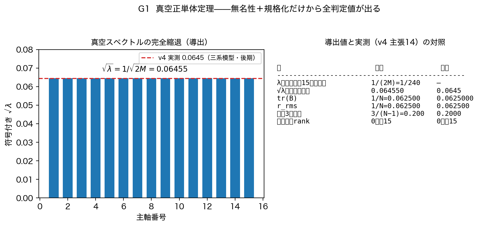
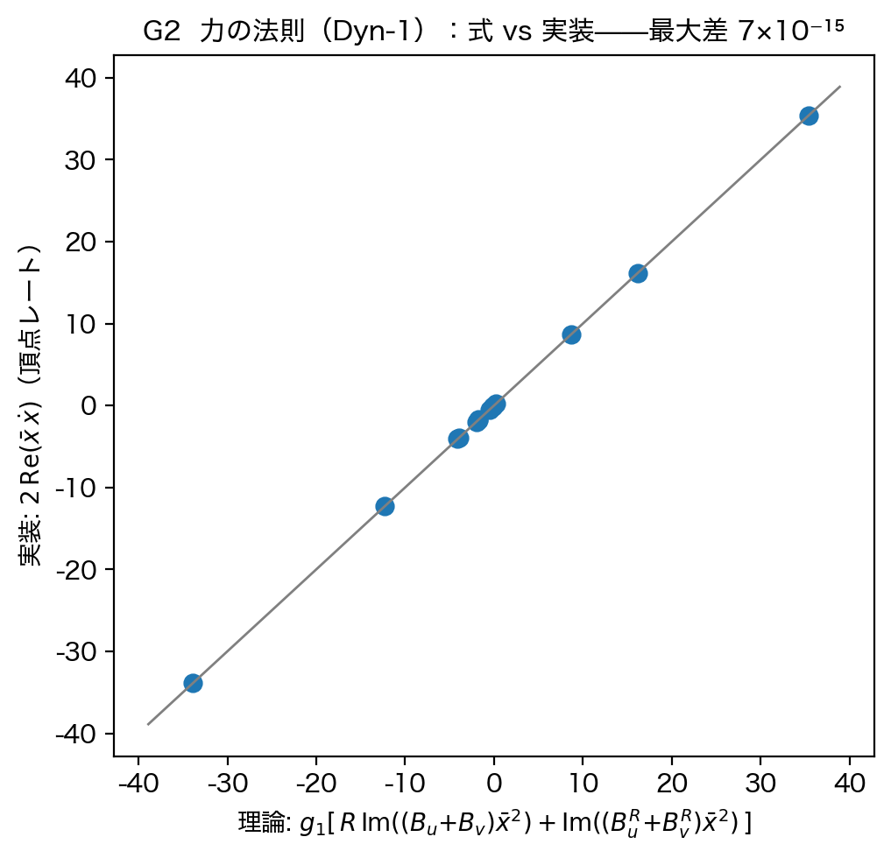
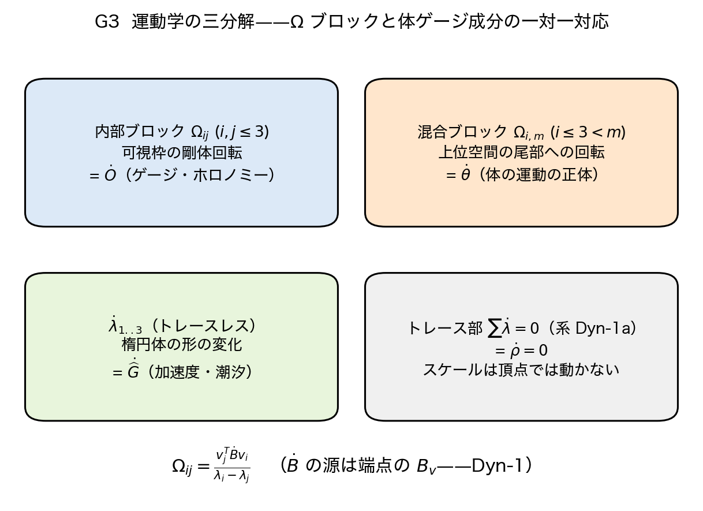
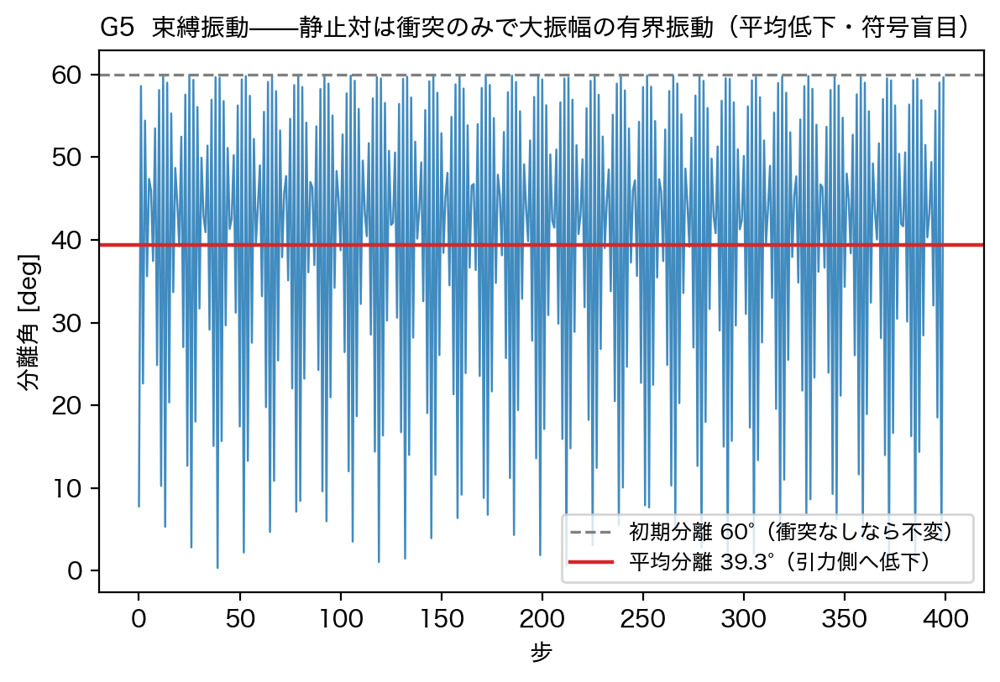
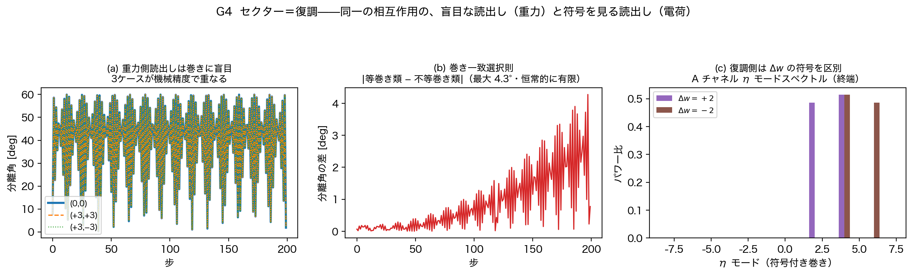
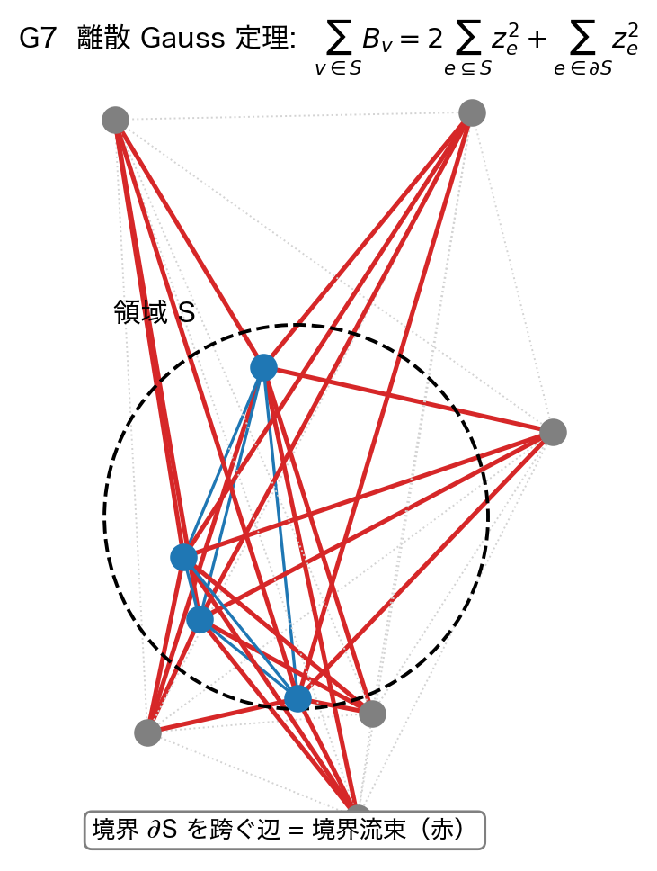
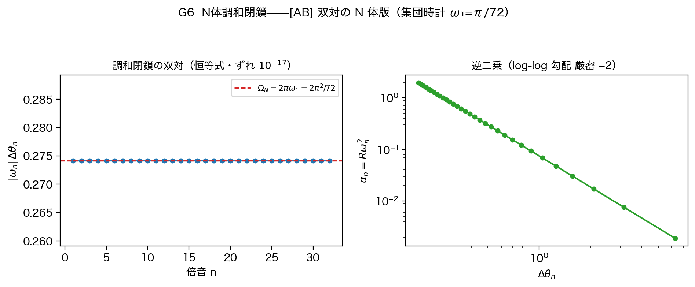

# 関係波動力学の導出——単一の力の法則と二つの復調セクター

木原範昭

状態: 草稿 v1（2026-08-19。DOI 取得前。設計図: `運動量レジスタの検討.md` §15.3b/§15.3c/§15.4b、
導出ノート: `dynlab_v1/`（DL0〜DL6・DLdyn）。タイトルは木原確認待ち）

---

## 本論文の位置づけ

本論文は前論文「体ゲージと絶対ゲージ空間」[F1] に続き、**状態を変化させて動力学を実現する路線を採らない**。本枠組みが目指すのは**読出し側の局所的ゲージ場への写像によって動力学を実現する**ことであり、本論文は前論文で定義した、動力学（並進・回転・加速度）を表現可能な**ゲージ場を利用して動力学を導出する**論文である。運動方程式・逆自乗則・定量予言は導出済であるが、一部は次の数値実験論文で検証する。

## 要旨

背景空間を置かず、$\sum x_n^2=0$ と $U^n=I$ の公理から唯一のパラメータとして分解能 $N$ だけを置く関係波の系は、これまでに空間3軸・固有時間・質量・電荷の読出しと、粒子的な波62種の周期表、および系が3次元楕円体面への投影像として捉えられることまでを導出してきた。残された課題は動力学である。本論文は、前論文で定義した動力学の導出に必要な**ゲージ場**を利用して動力学を導出した。前論文のゲージ場は標準理論のゲージ場（内部対称性の位相接続）と異なり、局所的な並進・回転・加速度運動として読み出される計量を、進行波とその位相の変動として表現しない。状態は静的な関係配置のまま一切変更せず、**定常的な関係配置に対する局所的読出しのゲージ場の変化**として実装する。

**導出の中核は次である。**(1) **運動方程式**——力の法則は一本であり、源は頂点レジスタ $B_v$、接続 $\Omega_{ij}$ は閉形式、可視運動は三分解（ゲージ回転・体の運動・計量歪み）で完結する。(2) **構造定理**——誘導動力学は一階であり、慣性は状態に置き場がなくゲージレジスタが担う。(3) **二つの符号定理**——毛ゲージ不変性と巻き一致選択則。帰結として、この力は電荷符号に依らない普遍引力＝重力型であり、**重力の普遍性は仮定でなく定理である**。(4) **セクター＝復調**——同一の相互作用が、連続時計の読出しでは重力（符号盲目）として、復調読出しでは電荷（相対巻きの符号を区別・実測で確定）として現れる。前論文の三種の観測時計が、力のセクター構造そのものだった。あわせて、真空の基底状態を厳密に解き（正単体定理——既公開実測3値と厳密一致）、力の帳簿を恒等式で与え（離散 Gauss 定理）、逆二乗則の N 体版を調和閉鎖恒等式まで導出した。

本論文はその運動方程式を導出し、これにより重力理論とクーロン場の理論の統一的な表現を可能とした。一部は次の数値実験論文で検証する。標準用語と異なる意味で用いる語はすべて末尾の用語一覧に明記した。

---

## 1. 導入

### 1.1 前論文までの到達点と、残された課題

前論文 [F1] は、動力学を表現可能なゲージ場を定義した：体ゲージ $\Phi_A$（並進・回転・間隔を一個の枠が担う体ごとの読出し枠）、絶対中心と絶対ゲージ空間（二重中心化による正準ゲージ固定——無名性を破らない）、三種の観測時計（同一位相データへの三種の復調）。全系は二層状態 $(z,\Phi)$ であり、自由運動の運動量は関係状態 $z$ に書き込まれず、運動学的自由度は読出し状態 $\Phi$ に存在する。

残された課題は動力学の導出である。本論文の出発点は次の観察である：**力学 F（スライス Cayley＋媒介頂点 [F1] §6）は確定済みであり、読出し連鎖も確定済みである。したがってゲージ層の時間発展は既に一意に決まっている。** 導出とは未知の法則の探索ではなく、F が状態層に起こすことを読出し連鎖を通じてゲージ層へ**誘導する計算**である：

$$\dot z\ (\text{F・確定})\ \longrightarrow\ \dot x_e\ \longrightarrow\ \dot d_e^2
\ \longrightarrow\ \dot B\ \longrightarrow\ (\dot\lambda_i,\ \Omega_{ij},\ \dot\theta_A,\ \dot{\widehat G},\ \dot\rho)$$

本論文はこの連鎖の各段を閉形式で書き下し、全段を保存済みプログラムで検証する（再現物一覧参照）。時間変数は [F1] の規約に従う（更新指数 $n$ に対する差分が一次定義。物理率は固有時計 $s_A$ または大域時計位相 $T$ で読む）。

### 1.2 中核主張

> **関係状態の力学 F から、体ゲージの運動方程式を導出する。力の法則は一本であり、源は頂点レジスタ $B_v$、慣性はゲージレジスタが担い、基底状態は正単体、力の帳簿は離散 Gauss 定理が与える。符号構造は二つの定理——毛ゲージ不変性と巻き一致選択則——で確定し、この力は電荷符号に依らない普遍引力＝重力型である。同一の相互作用は復調読出しにおいて電荷セクターとして現れる。逆二乗則は二体で導出済み、N 体版は調和閉鎖恒等式まで導出済みであり、残る一点（創発距離の写像 $L=\kappa\Delta\theta$）は数値実験が決着させる。**

---

## 2. 基底状態——真空正単体定理

**定理 2.1（真空正単体定理）**　仮定は二つ：(i) **無名性**——真空はどの頂点対も区別しない（読出し距離は $S_N$ 不変、$d_{ij}=d$）。(ii) **規格化**——$\sum_{i<j}d_{ij}^2=\sum_e\lvert x_e\rvert^2=1$。このとき

$$d^2=\frac1M,\qquad B=\frac{1}{2M}J,\qquad
\lambda=\frac{1}{N(N-1)}\ \text{（}N{-}1\text{ 重縮退）},\qquad
\mathrm{tr}(B)=\frac1N,\qquad r_{\rm rms}=\frac1N$$

であり、上位 $k$ 占有率は $k/(N{-}1)$、$B\succeq0$（虚方向0・rank $N{-}1$）。読出し配置は**正 $(N{-}1)$ 単体**である。

**証明**　$Md^2=1$ より $d^2=1/M$。$D^{\circ2}=d^2(\mathbf{1}\mathbf{1}^{\mathsf T}-I)$ を $B=-\tfrac12JD^{\circ2}J$ に代入し $J\mathbf{1}=0$ を使うと $B=(d^2/2)J$。$J$ の固有値は $1$（$N{-}1$ 重）と $0$。残りは代入。∎

**既公開実測との一致**　$N=16$ で $\sqrt\lambda=1/\sqrt{240}=0.064550$、$\mathrm{tr}(B)=0.062500$、占有率 $0.200$——[V4] 主張14 の実測値 **0.0645・0.0625000・0.2000・rank 15・虚方向0本と厳密に一致する**（図 G1）。これまで実測値として記録されていた三つの数の閉形式がこれである。

**図G1** 真空正単体定理。左：導出された完全縮退スペクトル $\sqrt\lambda=1/\sqrt{2M}$ と [V4] 実測。右：導出値と実測値の対照。

**命題 2.2（双線形レジスタの恒等零）**　真空親（QR 構成：$w=(q_1+iq_2)/\sqrt2$、等ノルム直交）では $\sum w^2=\tfrac12(\lvert q_1\rvert^2-\lvert q_2\rvert^2)+i\,q_1\!\cdot\!q_2=0$ が構成の恒等式として成立する。[V4] 実測（$2\times10^{-15}$）はこの恒等式である。

**命題 2.3（置換同変性と不変集合）**　F は頂点を区別しない（$F(\pi\cdot z)=\pi\cdot F(z)$、$\pi\in S_N$）。よって $S_N$ 対称な状態集合は F-不変である。有限標本の初期異方性が正単体値へ緩和するかは数値実験の判定対象（§8 DL0）。

**系 2.4（枠の不在）**　完全縮退により任意の正規直交基底が固有基底になる——長さ順主軸は定義されず、絶対ゲージ空間の存在条件（[F1] 定義2.3 規約1）は構成から不成立。**「空間の軸は物質と共に生まれる」の真空側は定理である。**

---

## 3. 保存則

**補題 3.1（頂点はエルミートレジスタも厳密保存する）**　媒介頂点（[F1] §6、$g_2=-g_1$・$R_{ee'}$ 対対称）は、閉塞 $\sum_ez_e^2$ に加えて $\sum_e\lvert z_e\rvert^2$ も各レジスタ点で厳密保存する。

**証明**　$\tfrac{d}{d\tau}\lvert z_e\rvert^2=2\mathrm{Re}(\bar z_e\delta z_e)=2Rg_1\mathrm{Im}(z_{e'}^2\bar z_e^2)$。対 $\{e,e'\}$ のもう片方は $\mathrm{Im}$ の共役で逆符号——$R$ の対対称性により対ごとに厳密相殺。∎

閉塞保存の一意化条件（[F1] 定理6.1）が、エルミート保存を無償で与える。

**命題 3.2（真空の不変性）**　真空（偶数倍音のみ）では反射率 $R\equiv0$ で頂点レートが恒等的に零、残る力学はスライスごとの実直交 Cayley のみ。**真空に物質は湧かないは定理である**（数値上の既知例外：F の v2 分岐の $9.66\times10^{-15}$ 級の湧き。実装決定は §8）。真空は単一スライス占有だから、読出し層の双線形・エルミート両レジスタも厳密保存する。

**命題 3.3（シードが刻む値の公式）**　投入 $Z_0=(v+\delta g)/\lVert v+\delta g\rVert$ の直後の双線形レジスタは

$$\sum_ex_e^2\Big|_{0}=\frac{2\delta\langle v,g\rangle_{\rm bil}+\delta^2\sum g^2}{\lVert v+\delta g\rVert^2}$$

（$\sum v^2=0$ を使用）。[V4] 18-c が実測した「シードが $\tau=0$ に刻む固定複素値」の公式がこれであり、双線形レジスタはシード強度の一次の検出器である。

**命題 3.4（トレース和則）**　規格化が保存される限り $\mathrm{tr}(B)=1/N$ は投入後も全区間不変。**異方性とは固定和の下での固有値の分裂であって増減ではない。**

---

## 4. 運動方程式の誘導

### 4.1 力の法則（力の源泉定理）

**定理 4.1**　媒介頂点のレートを $\dot d_e^2=2\mathrm{Re}(\bar x_e\dot x_e)$ に代入すると、実の集約 $\mathcal A$（エルミート側）は全て落ち（$\mathrm{Re}(i\cdot\text{実}\cdot\lvert x\rvert^2)=0$）、自己項も落ちる（$\mathrm{Im}(x^2\bar x^2)=0$）。残るのは端点の双線形頂点モーメントのみ：

$$\boxed{\;\dot d_e^2=g_1\Big[R_e\,\mathrm{Im}\big((B_{u(e)}{+}B_{v(e)})\,\bar x_e^2\big)
+\mathrm{Im}\big((B^R_{u(e)}{+}B^R_{v(e)})\,\bar x_e^2\big)\Big]\;}$$

検証：実装レートとの最大差 $7.1\times10^{-15}$（図 G2）。

**図G2** 力の法則：導出式 vs 頂点実装。

**読み**：距離の動力学を駆動するのは端点の $B_v,B^R_v$ だけである。力は「端点の荷型レジスタ × 辺自身の位相とのうなり」——荷×場の双一次構造が F から自動的に出る。

**系 4.1a**　$\sum_e\dot d_e^2=0$（検証 $2.8\times10^{-15}$）——$\dot\lambda$ はトレースレスで、命題 3.4 の動的版。**系 4.1b**　$R\equiv0$ で全レート厳密零——正単体の定常性の再導出。

**命題 4.2（星型の力の式）**　体 $A$ の星について

$$\frac{d}{dn}\sum_{e\ni A}d_e^2
=g_1\,\mathrm{Im}\Big[\underbrace{B_A\Phi^R_A+B^R_A\Phi_A}_{\text{自荷×自星flux}}
+\underbrace{\textstyle\sum_{e\ni A}(R_eB_{v'}+B^R_{v'})\bar x_e^2}_{\text{他者の場}}\Big]$$

（星流束 $\Phi^R_A=\sum_{e\ni A}R_e\bar x_e^2$ 等）。§6 の離散 Gauss 定理と合わせ、「結合が流束で決まる」の F 側根拠を与える。

### 4.2 接続と運動学の三分解

**定理 4.3（接続の閉形式）**　非縮退域（[F1] 規約1）で

$$\dot\lambda_i=v_i^{\mathsf T}\dot Bv_i,\qquad
\Omega_{ij}=\frac{v_j^{\mathsf T}\dot Bv_i}{\lambda_i-\lambda_j},\qquad
\dot v_i=\sum_{j\ne i}\Omega_{ij}v_j$$

（検証：一次精度 $10^{-12}$）。$\Omega$ が [F1] 13章の接続そのものであり、コリオリ型ゲージポテンシャル・ホロノミーは $\Omega$ の積分として厳密に計算できる。

**定理 4.4（三分解と可視運動の閉形式）**　可視配置 $x_{A,i}=\sqrt{\lambda_i}v_i(A)$（$i\le3$）の変化率は

$$\dot x_{A,i}=\frac{\dot\lambda_i}{2\sqrt{\lambda_i}}v_i(A)+\sqrt{\lambda_i}\sum_{j\ne i}\Omega_{ij}v_j(A)$$

で完結し（検証：一次精度 $4.5\times10^{-7}$）、$\Omega$ のブロックが体ゲージ成分と一対一に対応する（図 G3）：内部ブロック＝$\dot O$（ゲージ回転・ホロノミーの源）、**混合ブロック＝$\dot\theta$（体の運動の正体＝上位3固有空間の尾部方向への回転）**、$\dot\lambda_{1..3}$＝$\dot{\widehat G}$、トレース部＝$\dot\rho=0$（系 4.1a）。駆動源は定理 4.1 により端点の $B_v$——**荷が動かす**。

**図G3** 運動学の三分解。

### 4.3 構造定理——慣性の所在

**定理 4.5**　誘導動力学は一階（$\dot{(\text{読出し})}\propto B_v$ 源の力項）であり、相互作用が止まれば読出しは止まる。**慣性（二階の記憶）を状態側に置く場所は存在しない**——慣性はゲージレジスタが担い（[F1] §2.1 の二層状態）、全体の運動は

$$\text{運動}=\underbrace{\text{ゲージ記憶のドリフト}}_{\text{慣性}}+\underbrace{\text{誘導レート}}_{\text{力・相互作用中のみ}}$$

の合成である。[F1] が設計として置いた二層分離は、誘導計算の帰結として**そうでなければならない**。ゲージレジスタの必要十分目録：位置は距離幾何で毎瞬可読、**枠の枝・イベント間ドリフト・直前整列配置はレジスタ必須**。系の完全な初期条件は対 $(z_0,\Phi_0)$ であり、$\Phi_0$ は $z_0$ から導出できない独立初期データである（初期速度は初期位置から出ない、というニュートン力学と同型の構造）。

---

## 5. 符号構造の二定理と、セクター＝復調

### 5.1 毛ゲージ不変性

**定理 5.1**　純巻き状態 $a=\alpha(\chi)e^{iw_A\eta}$、$b=\beta(\chi)e^{iw_B\eta}$ に対し、二体力学のチャネル間交差項はすべて位相因子 $e^{i(w_A-w_B)\eta}$ を持つ。$w_A\ne w_B$ なら $\sum_\eta e^{i(w_A-w_B)\eta}=0$ により交差項が消え、**χ周辺化観測量は巻きの刻印に厳密不変**である。

実測：巻き対 $(0,0)/(+3,+3)/(+3,-3)$ の分離角軌道が機械精度一致（χ周辺化パワー差 $2.8\times10^{-17}$、エイリアシング域 $\pm8$ でも $6.2\times10^{-17}$）。

### 5.2 巻き一致選択則

定理 5.1 の証明は例外を予言する：$w_A=w_B$ では交差項が生き残る。検定の結果（図 G4(b)）：

- 不等巻き類の内部一致 $1.7\times10^{-13}$、等巻き類（$w{=}(2,2)/(1,1)/(3,3)$）の内部一致 $2.5\times10^{-13}$（共通巻き＝ゲージ）
- **類の間の差 $4.3^\circ$（巨視的）**

**定理 5.2（巻き一致選択則）**　相互作用の巻き敏感チャネルは、巻きの一致した対でのみ活性化する。等巻き＝同種の対にだけ立つ追加チャネル——交換相互作用型の構造である。

### 5.3 重力の普遍性は定理である

native の二体力は引力側の束縛振動である：静止対（分離 $60^\circ$）は衝突のみで $0$〜$60^\circ$ の大振幅有界振動に入り、**平均分離が $60^\circ\to39.3^\circ$ へ低下する**（図 G5。二体系列 CR1 の有界振動の実測と整合）。定理 5.1 により、この力は電荷（巻き）の符号に厳密に依らない。

> **重力の普遍性（あらゆる物質に同符号で働くこと）は、本枠組みでは仮定ではなく、周辺化読出しの毛ゲージ不変性の帰結——定理である。**

**図G5** 束縛振動（符号盲目）。

### 5.4 セクター＝復調

では電荷の ± はどこに住むか。交差項は η モード $\Delta w=w_A-w_B$ に厳密に生き残っている——周辺化（連続時計の読出し）がそれを消していただけである。復調読出しで測ると（図 G4(c)）：

- 重力側（η 総和の分離角）：$\Delta w=\pm2$ で一致 $3.3\times10^{-13}$——盲目のまま
- **復調側（η モードスペクトル）：$\Delta w=+2$ と $-2$ で桁一（0.9999）の差**——相互作用は相対巻きの**符号**でチャネル内容を変える

**命題 5.3（セクター＝復調）**　単一の力の法則（定理 4.1）は、連続時計の読出しでは重力セクター（電荷盲目・普遍引力）として、復調読出しでは電荷セクター（相対巻きの符号を区別）として現れる。**重力とクーロンは別の力ではなく、同じ相互作用の二つの復調である。** 前論文の三種の観測時計（[F1] §4）は、力のセクター構造そのものだった。

**図G4** セクター＝復調。(a) 重力側は巻きに盲目。(b) 巻き一致選択則。(c) 復調側は $\Delta w$ の符号を区別する。

電荷セクターの力の観測量（復調位置とそのレート）を定義し、mod 3 整流後の同電荷/異電荷で引力/斥力の符号が分かれることの導出・実測が、±則を完成させる——§8 に登録する。なお [S19] の G9 実測（$E(++)$ が引力側）は、エネルギー読出しが周辺化型で巻き盲目である本定理と整合する。

---

## 6. 力の帳簿と逆二乗則

### 6.1 離散 Gauss 定理

**定理 6.1**　頂点集合の任意の分割 $\{S,\bar S\}$ について

$$\boxed{\;\sum_{v\in S}B_v=2\!\!\sum_{e\subseteq S}\!z_e^2+\sum_{e\in\partial S}z_e^2\;}$$

**証明**　辺 $e=\{a,b\}$ は両端点が $S$ 内なら2回、片方なら1回、外なら0回数えられる。∎

左辺＝領域の荷総和、右辺第二項＝**境界を貫く流束**。[F1] §3.3 の界面レジスタとはこの境界流束そのものであり、「閉空間で総電荷ゼロ」（$\sum_vB_v=2C=0$）は $S=V$ の特別な場合である（図 G7）。

**図G7** 離散 Gauss 定理。

### 6.2 逆二乗則——二体（導出済み）と N 体版

二体系では逆二乗則が導出・数値検証・公開済みである [AB]：未来位相位置中心の加速度写像 $\alpha_n=R\lvert\omega_n\rvert^2$ と調和閉鎖 $\lvert\omega_n\rvert\Delta\theta_n=2\pi\omega_1\equiv\Omega$ の同時成立から

$$\alpha_n=\frac{R\Omega^2}{\Delta\theta_n^2},\qquad L_{\rm read}=\kappa\Delta\theta_n\ \Rightarrow\ \alpha=\frac{R\Omega^2\kappa^2}{L_{\rm read}^2}$$

距離指数は零次で厳密 $-2$、速度フィードバック下で $-1.999937891$ [AB]。

**命題 6.2（N 体調和閉鎖）**　双対 $\lvert\omega_n\rvert\Delta\theta_n=\Omega$ は、閉じた位相円上の倍音梯子（$\omega_n=n\omega_1$、$\Delta\theta_n=2\pi/\lvert n\rvert$）を持つ**任意の**系で成立する算術恒等式である。N 体側の入力は集団時計 $\omega_1=\pi/72$ の倍音梯子（[F1] §4.1、実測済み）だけであり、$\Omega_N=2\pi^2/72$（図 G6。双対のずれ $5.6\times10^{-17}$、log-log 勾配 $-2$）。**数値実験に残るのは距離写像 $L=\kappa\Delta\theta$ の創発空間距離での成立ただ一点である**（§8 DL2/DL3）。

**図G6** N 体調和閉鎖と逆二乗。

独立な第二経路（流束経路）：前提 A1（流束保存）＋A2（等方3次元）の下で単位立体角あたりの流束密度 $\propto1/r^2$——前提は定理 6.1 により毎瞬厳密に計算できる量の検定に分解済み（§8 DL6）。予備結果として、海の静的場方程式 $z_e^2=(B_u+B_v)/2$ の自己無撞着固定点は $N\ne4$ で自明（固定点写像の固有値 $(N-2)/2$）——**非自明な場は源（物質）があって初めて立つ**。

---

## 7. 変分構造

**定理 7.1（線形部の変分性）**　実反対称 $K$ に対し $h=iK$ はエルミートであり、線形部は Schrödinger 型 $\dot z=-ihz$。スライス Cayley 一歩 $(I-\tfrac\tau2K)^{-1}(I+\tfrac\tau2K)$ は中点則（Crank–Nicolson）＝標準的な変分積分器であり、$[O,K]=0$ により $\langle z,hz\rangle$・$\Sigma\lvert z\rvert^2$・$\Sigma z^2$ を厳密保存する（検証：機械精度）。

**定理 7.2（頂点のハミルトン形式と障害の一点特定）**　対対称強度 $R_{ee'}$ を定数とみなすとき、媒介頂点は複素ハミルトン流である：

$$\delta z_e=i\,\frac{\partial H}{\partial\bar z_e},\qquad
H=g\sum_{e<e',\,e\sim e'}R_{ee'}\Big(\lvert z_e\rvert^2\lvert z_{e'}\rvert^2-\mathrm{Re}(z_{e'}^2\bar z_e^2)\Big)$$

（検証：勾配一致・凍結 R 流での $H$ 保存）。凍結 R では位相対称性の Noether 量が $\Sigma\lvert z\rvert^2$——補題 3.1 の変分的再導出。**F の変分構成の障害は強度 $R$ の状態依存性ただ一点に局在する**：$R=R(z)$ のとき $\delta z$ には $\partial R/\partial\bar z$ 項が代数的に現れる。

best matching（[F1] §3.3 の重み付き Procrustes）の停留条件は、無重み $\sum_Au_A=0$（正準中心化の恒等式）と重み付きトルクゼロ $\sum_Aw_A(R^\star x_A)\times y_A=0$——Barbour–Bertotti の水平性条件の離散版である。**重み付き運動量 $\sum_Am_Au_A$ の保存は整合からは出ない——成立すれば力学 F の性質であり、その検定（保存する重みの逆同定を含む）を §8 に登録する。**

---

## 8. 検証プログラム（数値実験論文への事前登録）

本論文の導出のうち、量的帰結の検証を次に登録する。判定・しきい値は導出ノート（`dynlab_v1/`）に実行前固定済み。

| 走行 | 検証する導出 | 判定の要点 |
|---|---|---|
| DL0 | 定理 2.1・命題 2.3・系 2.4 | 統一エンジン上の正単体収束（$\sqrt\lambda\to1/\sqrt{2M}$ 等 J1–J8）。F の v1/v2 分岐は実装時に一意固定 |
| DL1 | 補題 3.1・命題 3.2 | 両レジスタの厳密保存・奇数帯厳密零・方向読出しの乱数基準 $k/(N{-}1)$ |
| DL2 | 命題 3.3・3.4 | ジャンプ式の式値一致・トレース固定・厳密有理数予言（$r=15/34$・$\lvert z\rvert=16/17$） |
| DL3 | 定理 4.3・4.4 の適用条件 | 枠の誕生（ギャップ条件）・Davis–Kahan 輸送比・掌性連続・Eckart–Young 恒等式・楕円体偏差の時系列 |
| DL4 | 定理 4.5 | 共変等速性（重み時間変化下）・ゲージレジスタ帳簿の自己無撞着 |
| DL5 | §7 | 重み付き運動量保存の成否と**保存する重みの逆同定**・反射率回転の作用面固定・R 状態依存の変分性検定 |
| DL6 | §6 | 流束 $\Phi(r)$ の保存（A1）・等方性（A2）・加速度の距離指数・三角閉路ホロノミー・**距離写像 $L=\kappa\Delta\theta$ の成立** |
| 追加 | §5.4 | **電荷セクターの力の観測量**（復調位置レート）と mod 3 整流後の ± 則の導出・実測 |

---

## 9. 今後の課題と決着方法

| 課題 | 決着方法・場 |
|---|---|
| ± 則の完成（同電荷/異電荷の引力斥力分岐） | 復調セクターの力の観測量の定義と検定（§8 追加行）。巡回時計 mod 3 と η モードの写像の確定を含む |
| 逆二乗の N 体完成 | 距離写像 $L=\kappa\Delta\theta$ の検定（DL2/DL3）と流束経路（DL6）の二経路 |
| 重み付き運動量保存の導出 | 離散作用の構成（線形部は定理 7.1 で変分的。頂点は $R$ 状態依存性の変分構造への搭載が核心——DL5） |
| ニュートン型軌道 | ドリフト記憶＋誘導レートの二階合成（DL4〜DL6） |
| クロススライス保存の解析 | 多スライス占有での線形部追加項の書き下しと実測（DL0〜DL2） |
| 有効閉包 | 誘導方程式がゲージ変数＋レジスタの有限集合で閉じるか |
| 定理 5.1 の証明の完全化 | 交差項消滅の一般証明（混合則・非純巻き状態への拡張） |
| 三角閉路ホロノミーの定義固定 | 輸送作用素 $U_{AB}$ の一意化（DL6 実装時・事後変更しない） |

---

## 用語一覧（前論文 [F1] の用語一覧を継承。本論文の追加分）

| 用語 | 定義 |
|---|---|
| 誘導動力学 | F が状態層に起こすことを読出し連鎖を通じてゲージ層へ写した動力学。本論文の導出対象 |
| 力の源泉定理 | 定理 4.1。距離動力学の駆動源が端点の双線形頂点モーメントに限られること |
| 正単体定理 | 定理 2.1。真空の読出し配置が正 $(N{-}1)$ 単体であること |
| 離散 Gauss 定理 | 定理 6.1。任意の頂点分割で界面レジスタ＝境界流束となる厳密恒等式 |
| 毛ゲージ不変性 | 定理 5.1。周辺化観測量が巻き刻印に厳密不変であること |
| 巻き一致選択則 | 定理 5.2。巻き敏感チャネルが巻き一致対でのみ活性化すること |
| セクター／復調セクター | 同一の相互作用が読出しの復調の違いにより見せる異なる力の相（重力型＝連続時計・電荷型＝復調読出し） |
| 凍結 R | 反射率を定数とみなす近似。頂点がハミルトン流になる条件（定理 7.2） |
| 整合拘束 | best matching の停留条件（無重み和ゼロ・重み付きトルクゼロ） |
| 束縛振動 | 静止対が衝突のみで入る大振幅有界振動（平均分離の低下＝引力側） |

---

## 参考文献

### 自己引用

| 記号 | タイトル | DOI |
|---|---|---|
| [F1] | 体ゲージと絶対ゲージ空間——関係だけの空間における運動学の定式化 | **（公開後に記入）** |
| [V4] | ゼロ閉塞は4次元だった | 10.5281/zenodo.21902806（ja）／21902805（en） |
| [AB] | AB二体閉鎖位相系における未来位相位置加速度写像と調和閉鎖による逆二乗則 | 10.5281/zenodo.21441081 |
| [S19] | 波と場の二層分離——場の読出し万能関数によるゲージ場と重力場の統合 | 10.5281/zenodo.21832256 |

### 外部引用（書誌は公開前に一次照合）

- [D1] T. Kato, *Perturbation Theory for Linear Operators*, Springer (1966)
- [D2] C. Davis, W. M. Kahan, SIAM J. Numer. Anal. **7**, 1 (1970)
- [D3] C. Eckart, G. Young, Psychometrika **1**, 211 (1936)
- [D4] W. Kabsch, Acta Cryst. A**32**, 922 (1976)
- [D5] J. E. Marsden, M. West, Acta Numerica **10**, 357 (2001)
- [D6] E. Hairer, C. Lubich, G. Wanner, *Geometric Numerical Integration*, Springer (2006)
- [D7] J. B. Barbour, B. Bertotti, Proc. R. Soc. Lond. A **382**, 295 (1982)

---

## 再現物

すべて本リポジトリ `電子の反跳実験/dynlab_v1/` に保存（決定的・固定シード）。

- 導出ノート：`DL0〜DL6_導出ノート.md`・`DLdyn_誘導動力学_導出ノート.md`（仮説→反証→修正の全系譜を含む）
- 検証正本：`verify_derivation_checks_v1.py`（V1〜V7）・`verify_paper_closures_v1.py`（W1〜W4）
- 裁定プローブ：`probe_h4_sign_v1.py`・`probe_h4_sign_v2_matching_v1.py`・`probe_h4_stage2_drift_v1.py`・`probe_h4_stage3_orbitdrift_v1.py`・`probe_h4_stage4_demod_v1.py`（各結果 JSON 同梱）
- 図：`make_f2_figures_v1.py`（G1〜G7、PNG/SVG、系列データ `fig_data_f2_v1.json`）
