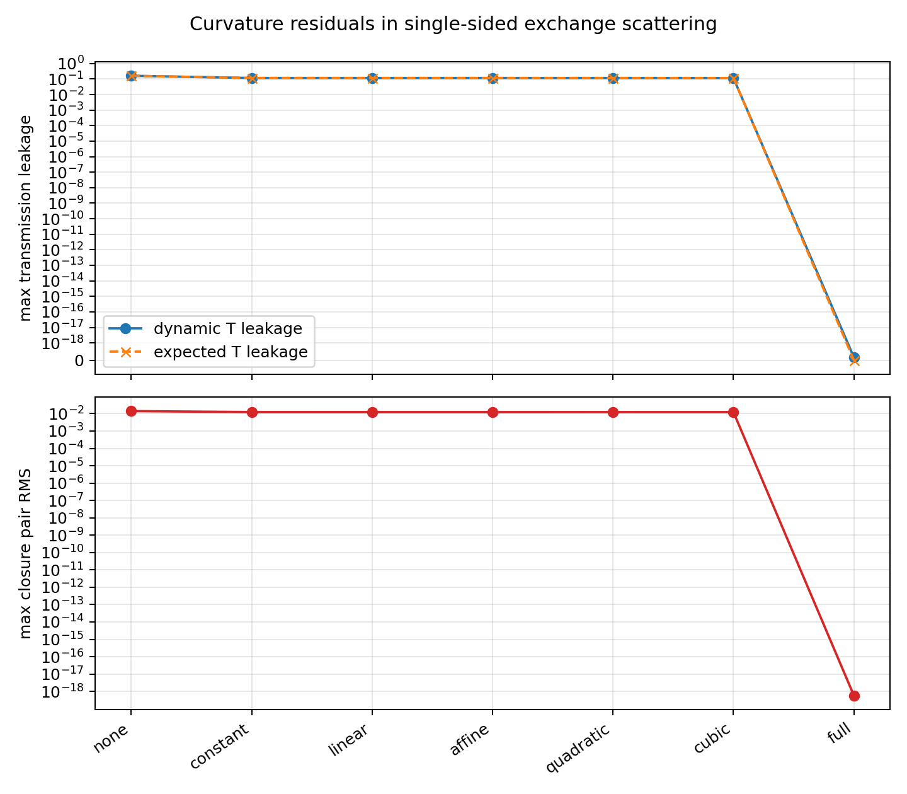

# 曲率付き閉鎖定常波 片側入射散乱統合検証 v1

## 目的

閉鎖定常波レベルで得た曲率相対位相の残差を、片側入射の局所交換干渉写像へ戻し、無補正では通過漏れが出ること、完全な内部位相再選別では完全反射が回復することを確認した。

## 判定

| 項目 | 結果 |
|---|---:|
| 無補正で動的通過漏れを検出 | `true` |
| full 補正で動的完全反射が回復 | `true` |
| 動的散乱が二チャンネル期待式と一致 | `true` |
| ノルム保存 | `true` |
| 統合検証の最小判定 | `true` |

## 補正別集計

| 補正 | 最大動的通過漏れ | 最大閉鎖ペア RMS | 最大期待式誤差 |
|---|---:|---:|---:|
| none | `1.6202719613622971e-01` | `1.3992789770439718e-02` | `5.5511151231257827e-17` |
| constant | `1.1632365832184560e-01` | `1.2323357129304359e-02` | `1.3877787807814457e-17` |
| linear | `1.1624067781252549e-01` | `1.2317721991993871e-02` | `1.3877787807814457e-17` |
| affine | `1.1619972192010980e-01` | `1.2315221532542749e-02` | `1.0408340855860843e-17` |
| quadratic | `1.1598359742226147e-01` | `1.2300337923101595e-02` | `2.7755575615628914e-17` |
| cubic | `1.1567739316276089e-01` | `1.2278927640523116e-02` | `2.7755575615628914e-17` |
| full | `1.6608667989341789e-19` | `7.8949412793793227e-19` | `1.6608667989341789e-19` |

## 読み

曲率相対位相の残留量を片側入射の交換干渉写像へ入れると、無補正および限定補正では通過漏れが残った。full 補正では残留位相が消え、動的散乱でも `R=1,T=0` が回復した。

したがって、閉鎖定常波の内部位相再選別は、閉鎖残差だけでなく、完全弾性反射の読出しも回復する。

## 図

## 出力

| 種類 | ファイル |
|---|---|
| JSON | [curved_closure_scattering_integration_result_v1.json](curved_closure_scattering_integration_result_v1.json) |
| CSV | [curved_closure_scattering_integration_v1.csv](curved_closure_scattering_integration_v1.csv) |
| 図 | [curved_closure_scattering_integration_v1.png](curved_closure_scattering_integration_v1.png) |
