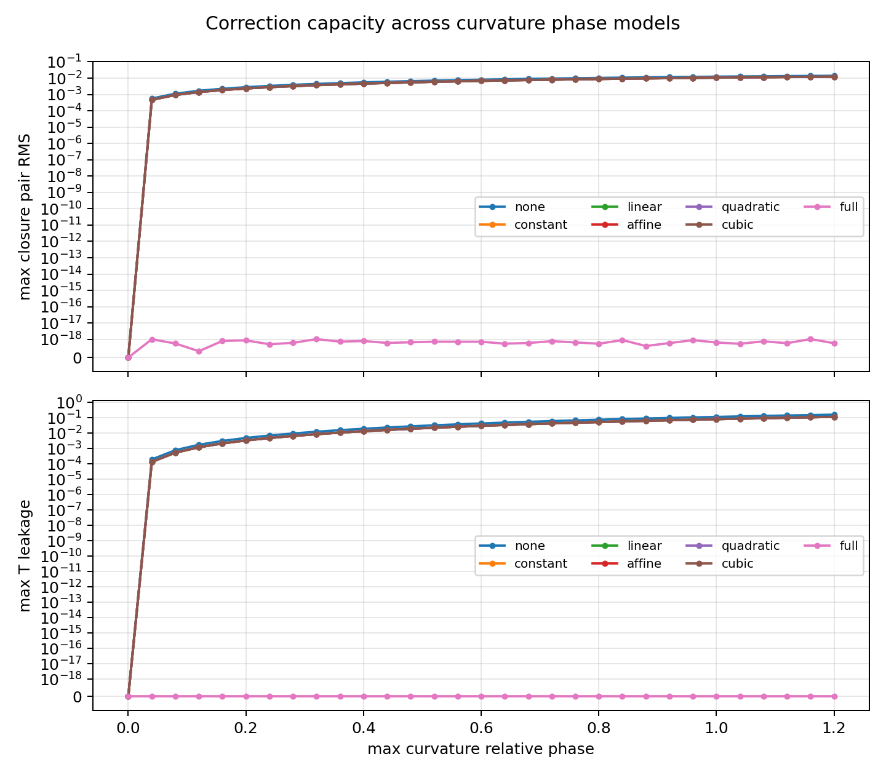
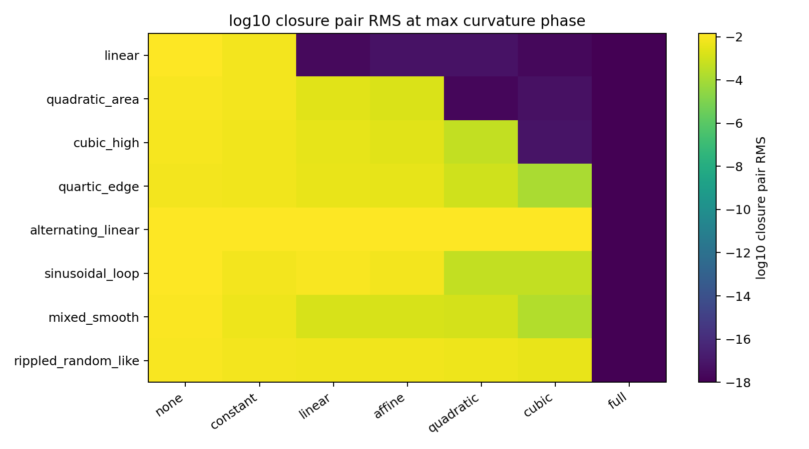
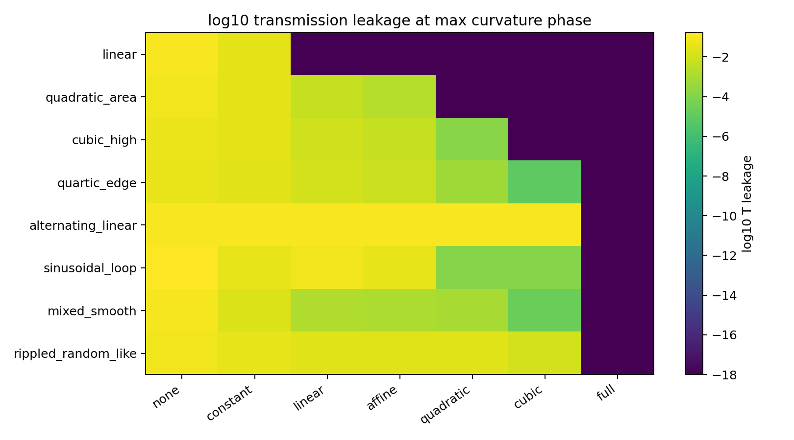

# 曲率付き閉鎖定常波 広範囲検証 v2

## 目的

最小実験 v2 では、曲率相対位相が固定波に入ると閉鎖残差と通過漏れが出ること、また完全な内部位相再選別でそれらが消えることを確認した。

本検証では、曲率相対位相モデルを複数に増やし、内部補正の自由度を `none`, `constant`, `linear`, `affine`, `quadratic`, `cubic`, `full` に制限して、どの範囲で閉鎖定常波が回復するかを調べた。

## 判定

| 項目 | 結果 |
|---|---:|
| 共通因子型曲率は全掃引で閉鎖保存 | `true` |
| 無補正では非自明な曲率漏れを検出 | `true` |
| 完全補正は全位相モデルで閉鎖回復 | `true` |
| 完全補正は全位相モデルで完全反射回復 | `true` |
| 限定補正はモデル依存の残差を残す | `true` |
| 広範囲検証の最小判定 | `true` |

## 最大曲率相対位相での補正別集計

| 補正 | 最大閉鎖ペア RMS | 最大通過漏れ | 最大残留位相 |
|---|---:|---:|---:|
| none | `1.3992789770439718e-02` | `1.6202719613622976e-01` | `1.2000000000000000e+00` |
| constant | `1.2323357129304359e-02` | `1.1632365832184562e-01` | `1.1885985027360557e+00` |
| linear | `1.2317721991993871e-02` | `1.1624067781252551e-01` | `1.2122605013795469e+00` |
| affine | `1.2315221532542749e-02` | `1.1619972192010980e-01` | `1.2235371932078578e+00` |
| quadratic | `1.2300337923101595e-02` | `1.1598359742226144e-01` | `1.2740926312051919e+00` |
| cubic | `1.2278927640523116e-02` | `1.1567739316276086e-01` | `1.3311608455010591e+00` |
| full | `7.8949412793793227e-19` | `0.0000000000000000e+00` | `0.0000000000000000e+00` |

## 読み

固定波に曲率相対位相を入れると、すべての位相モデルで閉鎖残差と通過漏れが出る。共通因子型の曲率作用は閉鎖を破らない。完全補正は全モデルで閉鎖と完全反射を回復する。一方、定数・線形・二次・三次の限定補正では、補正基底に含まれない位相モデルに残差が残る。

したがって、本検証の範囲では、曲率効果が観測読出しから消えるためには、曲率相対位相を閉鎖定常波の内部位相再選別として吸収するだけの自由度が必要である。

## 図

## 出力

| 種類 | ファイル |
|---|---|
| JSON | [curved_closure_stationary_wave_broad_sweep_result_v2.json](curved_closure_stationary_wave_broad_sweep_result_v2.json) |
| sweep CSV | [curved_closure_stationary_wave_broad_sweep_v2.csv](curved_closure_stationary_wave_broad_sweep_v2.csv) |
| conformal control CSV | [curved_closure_stationary_wave_broad_conformal_control_v2.csv](curved_closure_stationary_wave_broad_conformal_control_v2.csv) |
| aggregate 図 | [curved_closure_stationary_wave_broad_aggregate_v2.png](curved_closure_stationary_wave_broad_aggregate_v2.png) |
| closure heatmap | [curved_closure_stationary_wave_broad_closure_heatmap_v2.png](curved_closure_stationary_wave_broad_closure_heatmap_v2.png) |
| leakage heatmap | [curved_closure_stationary_wave_broad_leakage_heatmap_v2.png](curved_closure_stationary_wave_broad_leakage_heatmap_v2.png) |
