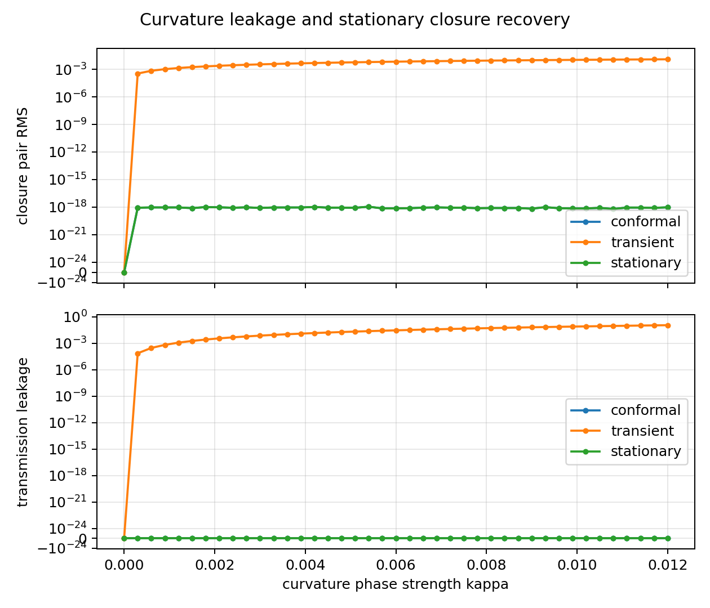
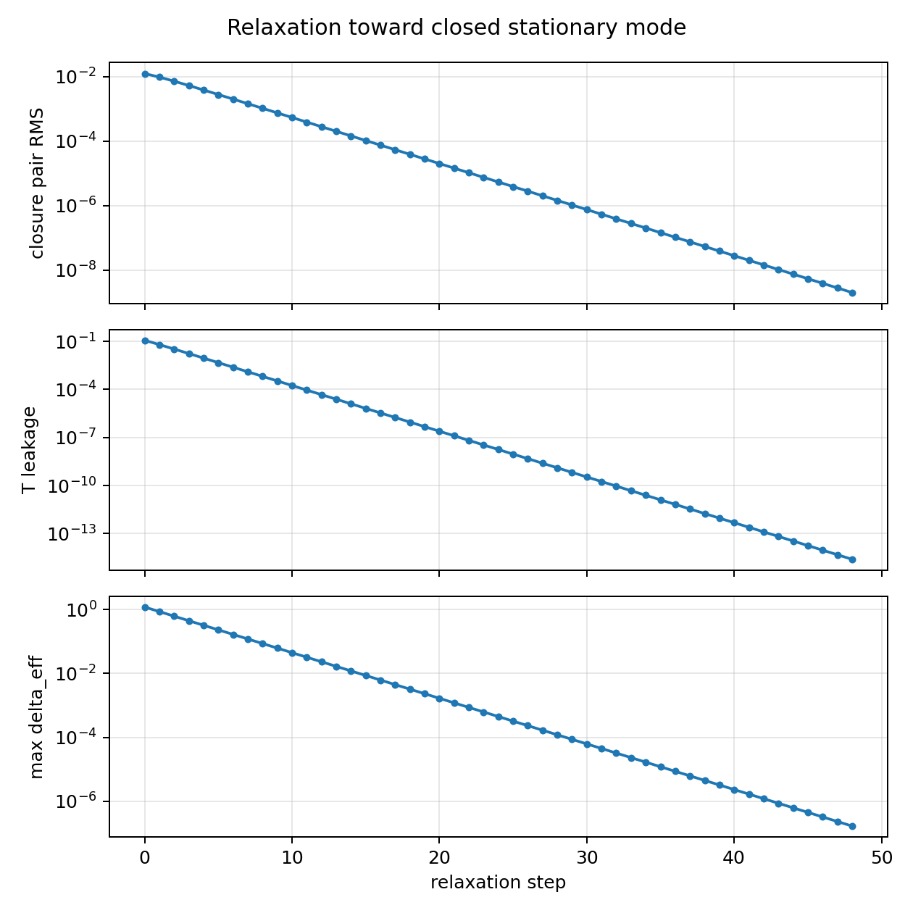

# 曲率付き閉鎖定常波 数値検証 v1

## 目的

曲率付き局所セルに置かれた奇数倍音複素波について、曲率が単に消えるのではなく、閉鎖定常波の再選別によって内部へ吸収されるかを最小写像で検証した。

## 定式化

閉鎖条件を、

```math
Q(x)=\sum_n x_n^2=0
```

とする。曲率付き局所セルで安定に残る波は、

```math
Q(x_K)=0,
\qquad
\mathcal U_Kx_K=e^{i\alpha_K}x_K
```

を満たす閉鎖定常波であるとする。

本実験では奇数倍音 `h_m=2m+1` に対し、曲率由来の相対位相漏れを

```math
\delta_{K,m}=\kappa h_m
```

として置いた。これは実在曲率の定量式ではなく、奇数倍音が相対位相漏れに対して高感度であることを調べるための局所モデルである。

## 判定

| 項目 | 結果 |
|---|---:|
| flat 閉鎖 | `true` |
| 共通因子型曲率は閉鎖を保存 | `true` |
| 相対位相型曲率は過渡残差を生成 | `true` |
| 定常再選別で閉鎖が回復 | `true` |
| 定常再選別で完全反射が回復 | `true` |
| 緩和で閉鎖残差が減少 | `true` |
| 緩和で通過漏れが減少 | `true` |
| 最小仮説検証 | `true` |

## 主要数値

| 量 | 値 |
|---|---:|
| 最大 `kappa` | `1.2000000000000000e-02` |
| 最大曲率位相 `max(delta_K)` | `1.1879999999999999e+00` |
| flat 閉鎖ペア RMS | `0.0000000000000000e+00` |
| conformal 閉鎖ペア RMS | `9.4283259783636047e-19` |
| transient 閉鎖ペア RMS | `1.2319416790092972e-02` |
| stationary 閉鎖ペア RMS | `9.4283259783636047e-19` |
| transient 通過漏れ | `1.1503183254481797e-01` |
| stationary 通過漏れ | `0.0000000000000000e+00` |
| relaxation 最終閉鎖ペア RMS | `2.0285753500943141e-09` |
| relaxation 最終通過漏れ | `2.4915322496409796e-15` |

## 読み

固定された平坦波へ曲率相対位相を加えると、閉鎖残差と通過漏れが出た。一方、曲率が共通重みとして入る場合、閉鎖条件は保たれた。また、曲率相対位相を内部位相再選別で吸収した定常状態では、閉鎖残差と通過漏れが消えた。

したがって、本実験の範囲では、曲率の影響は消えているのではなく、閉鎖定常波の存在条件へ繰り込まれる、という仮説と整合する。

## 図





## 出力

| 種類 | ファイル |
|---|---|
| JSON | [curved_closure_stationary_wave_result_v1.json](curved_closure_stationary_wave_result_v1.json) |
| sweep CSV | [curved_closure_stationary_wave_sweep_v1.csv](curved_closure_stationary_wave_sweep_v1.csv) |
| relaxation CSV | [curved_closure_stationary_wave_relaxation_v1.csv](curved_closure_stationary_wave_relaxation_v1.csv) |
| sweep 図 | [curved_closure_stationary_wave_sweep_v1.png](curved_closure_stationary_wave_sweep_v1.png) |
| relaxation 図 | [curved_closure_stationary_wave_relaxation_v1.png](curved_closure_stationary_wave_relaxation_v1.png) |
