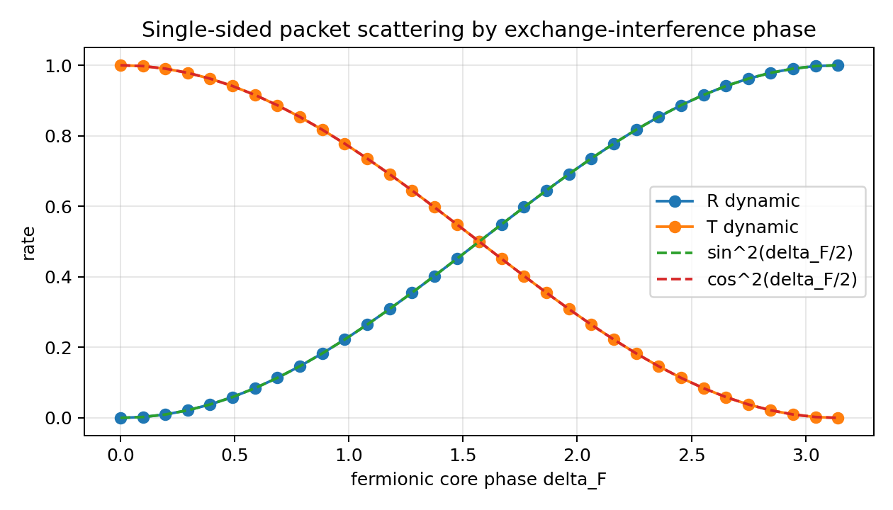
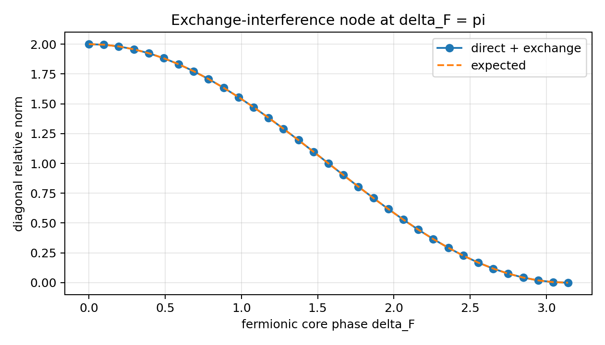
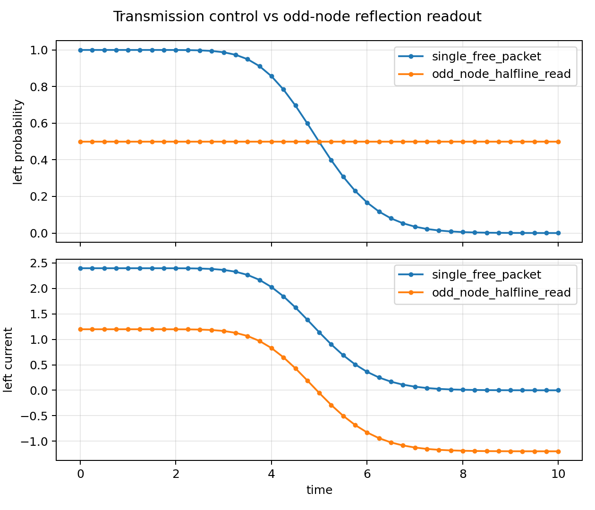
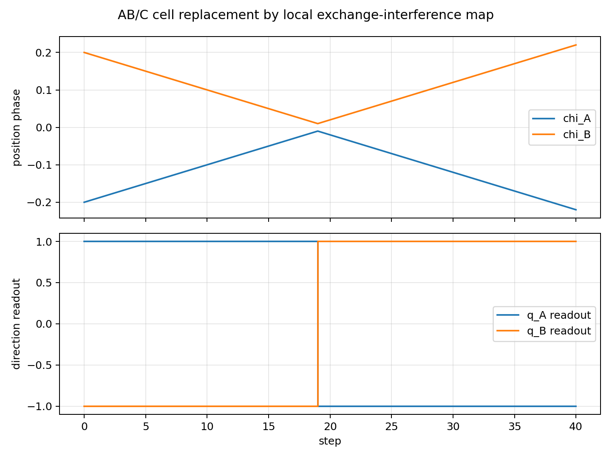

# Interference Construction of a Perfect Reflection Map from a Fermionic Inverse-Phase Core v2

**Subtitle:** A numerical constructive experiment on direction reversal from exchange-path interference cancellation and a relative-phase node  
**Date:** 2026-07-10  
**Author:** Noriaki Kihara  
**Status:** Additional paper / executed numerical experiment  
**Version DOI:** 10.5281/zenodo.21332867  
**Concept DOI:** 10.5281/zenodo.21295479  

V2 recalculates the same conditions after changing the formula for the fermion-like reflection map.

---

## Abstract

This paper executes a constructive experiment asking whether the direction-reversal map introduced in the preceding paper, "Constructive Experiment on Elastic Reflection of Two Fermionic Local Waves in a Closed Phase System Without Assuming Background Space," can be generated without an external conditional branch, from a fermionic internal inverse-phase core and wave interference between two exchange paths.

The local waves `A` and `B` carry spatial phase `χ`, temporal phase `τ`, internal identification phase `η`, representative amplitude, and a fermionic inverse-phase core. For the interaction of the two local waves, the direct path `P_A(1)P_B(2)` and the exchange path `P_A(2)P_B(1)` are constructed, and the internal core phase difference `Δ_F` is transferred to the exchange path as its relative phase.

The generalized two-path superposition is

```math
\Psi_{\Delta}(1,2)
=
\frac{1}{\sqrt2}
\left[
P_A(1)P_B(2)
+
e^{i\Delta_F}P_A(2)P_B(1)
\right].
```

At the complete-overlap point `1=2`, the two paths cancel exactly when `Δ_F=π`:

```math
\Psi_{\pi}(1,1)=0.
```

In the numerical execution, the initial state is a single localized wave packet incident from the left. No external direction-reversal instruction, mirror-image initial condition, or reflecting boundary condition is used. In the interaction region, the direct and exchange paths are decomposed into even and odd interference channels, the phase difference of the internal inverse-phase core is transferred only to the odd channel, and the wave is recombined.

The results were as follows. For `Δ_F=0`, the reflection and transmission rates were `1.8261693486616611e-19` and `1.0000000000000004`. For `Δ_F=π/2`, both reflection and transmission were `0.5`. For `Δ_F=π`, the reflection and transmission rates were `1.0000000000000004` and `1.7939211304199106e-19`. Over the phase sweep, `R(Δ_F)=sin^2(Δ_F/2)` and `T(Δ_F)=cos^2(Δ_F/2)` were reproduced with maximum error `5.551115123125783e-16`, and the maximum norm error was `6.661338147750939e-16`. The local exchange-interference map satisfied reversibility with relative error `4.8214412843768590e-11` for `U(π)^2` and maximum relative error `2.2454514008125022e-16` for `U(Δ_F)U(-Δ_F)`. The maximum compensated square-closure residual was `1.2143074258005e-17`. The internal identification oscillations `m_A` and `m_B` were preserved by correlation readout.

**Keywords:** fermionic inverse-phase core, exchange interference, relative-phase node, perfect reflection, internal observation, finite-resolution cell, anonymous equal-amplitude composite wave

---

## 1. Introduction

The preceding paper constructed a conservative finite-resolution map in which two identifiable fermionic local waves undergo complete elastic reflection inside a closed phase system that does not assume background space a priori.

In that construction, the interaction cell applied the map

```math
q_A\mapsto -q_A,
\qquad
q_B\mapsto -q_B.
```

The rule was verified to be compatible with localization, identification oscillations, observation, closure, and reversibility. The present paper executes the next step: the direction reversal itself is generated from wave interference, rather than being inserted as an external instruction.

The question of this paper is:

> Can a fermionic internal inverse-phase core automatically supply the relative phase `π` between the exchange paths of two local waves, and can that interference eliminate transmission and generate the output corresponding to complete reflection?

No external conditional branch of the following form is used:

```text
if fermion:
    reverse_direction()
```

The goal is to obtain reflection output using only internal phase, overlap of localized waves, exchange paths, interference recombination, and internal observation.

---

## 2. Claims Not Made in This Paper

This paper does not claim the following.

| Claim not made | Reason |
|---|---|
| A derivation of standard fermion scattering | No standard Hamiltonian, S-matrix, or scattering cross section is used |
| A derivation of the Pauli exclusion principle itself | "Fermionic" is used as an operational classification for a local wave with an internal inverse-phase core |
| That node formation alone necessarily implies reflection in general | Suppression of transmission and generation of reflected output are checked numerically |
| Quantitative prediction of real-particle exchange interaction | This is a constructive experiment inside the phase-wave model |
| Reproduction of particle trajectories in external spacetime | `χ` and `τ` are readout variables inside a closed phase system |

The claim is a numerical construction: an internal inverse-phase core generates an exchange-interference sign, and that interference internally generates a reflection map.

---

## 3. Basic Structure

### 3.1 Local Wave

A local wave `P` on spatial phase `χ`, temporal phase `τ`, and internal identification phase `η` is written as

```math
P(\chi,\tau,\eta)
=
A_P
S_{N_{h,\chi}^{P}}(\chi-\chi_P)
S_{N_{h,\tau}^{P}}(\tau-\tau_P)
e^{im_P\eta}
e^{i\phi_P}.
```

Here:

- `A_P` is the representative amplitude.
- `S_{N_h}` is the normalized equal-amplitude odd-harmonic localized wave.
- `m_P` is the internal identification oscillation mode.
- `φ_P` is the local phase.

### 3.2 Normalized Equal-Amplitude Odd-Harmonic Localized Wave

```math
S_{N_h}(u)
=
\frac{1}{K}
\sum_{m=0}^{K-1}
\cos((2m+1)u),
\qquad
N_h=2K-1.
```

Its closed form is

```math
S_{N_h}(u)
=
\frac{\sin((N_h+1)u)}{(N_h+1)\sin u}.
```

### 3.3 Fermionic Internal Inverse-Phase Core

The two-component internal core is written as

```math
F_P
=
\frac{1}{\sqrt2}
\left(
e^{i\theta_{P,1}},
e^{i\theta_{P,2}}
\right),
```

and its internal phase difference is

```math
\Delta_F
=
\theta_{P,2}-\theta_{P,1}.
```

A pure fermionic inverse-phase core is

```math
\Delta_F=\pi.
```

---

## 4. Direct Path and Exchange Path

Let the full arguments of the local waves be

```math
1=(\chi_1,\tau_1,\eta_1),
\qquad
2=(\chi_2,\tau_2,\eta_2).
```

The direct path is

```math
\Psi_{\mathrm{direct}}(1,2)
=
P_A(1)P_B(2),
```

and the exchange path is

```math
\Psi_{\mathrm{exchange}}(1,2)
=
P_A(2)P_B(1).
```

The superposed wave, obtained by transferring the internal inverse-phase core to the relative phase of the exchange path, is

```math
\Psi_{\Delta}(1,2)
=
\frac{1}{\sqrt2}
\left[
\Psi_{\mathrm{direct}}(1,2)
+
e^{i\Delta_F}
\Psi_{\mathrm{exchange}}(1,2)
\right].
```

This is not an external judgment selecting an operation. The internal phase difference `Δ_F` directly determines the interference phase of the exchange path.

---

## 5. Node Formation at Complete Overlap

At the complete-overlap point `1=2`, the direct and exchange paths have the same amplitude:

```math
\Psi_{\mathrm{direct}}(1,1)
=
\Psi_{\mathrm{exchange}}(1,1).
```

Therefore

```math
\Psi_{\Delta}(1,1)
=
\frac{P_A(1)P_B(1)}{\sqrt2}
\left(1+e^{i\Delta_F}\right).
```

### 5.1 In-Phase Core

If

```math
\Delta_F=0,
```

then

```math
1+e^{i\Delta_F}=2,
```

and the overlap component remains.

### 5.2 Inverse-Phase Core

If

```math
\Delta_F=\pi,
```

then

```math
1+e^{i\pi}=0,
```

and therefore

```math
\Psi_{\pi}(1,1)=0.
```

This zero is not an external shield or potential barrier. It is a node generated by complete destructive interference between the two exchange paths.

---

## 6. Relative Phase and Exchange Antisymmetry

The relative spatial phase of the two local waves is

```math
\rho=\chi_A-\chi_B.
```

Exchange of the two particles corresponds to

```math
A\leftrightarrow B,
```

and therefore to

```math
\rho\mapsto-\rho.
```

When exchange antisymmetry appears in the relative-phase channel,

```math
\Psi_F(-\rho)=-\Psi_F(\rho),
```

and hence

```math
\Psi_F(0)=0.
```

The numerical experiment checks whether this node blocks the transmission component from `ρ<0` to `ρ>0`.

---

## 7. Transmission Flow and Reflection Flow

As an operational measure of wave flow in the relative-phase direction, define

```math
J_\rho
=
\operatorname{Im}
\left(
\Psi^*
\frac{\partial\Psi}{\partial\rho}
\right).
```

This quantity is not identified with the standard probability current of quantum mechanics. It is used as a numerical indicator for complex waveform flow along the relative-phase coordinate.

The experiment checks whether, under the fermionic inverse-phase condition,

```math
\Psi_F(0)=0
```

and

```math
J_\rho(0)=0
```

hold, and whether the transmission component to the opposite side disappears.

---

## 8. Direction-Reversal Map Generated by Interference

Let the direction components be

```math
\mathbf a
=
\begin{pmatrix}
a_+\\
a_-
\end{pmatrix}.
```

The transformation to symmetric and antisymmetric channels is

```math
H
=
\frac{1}{\sqrt2}
\begin{pmatrix}
1&1\\
1&-1
\end{pmatrix}.
```

If the internal phase difference between the two exchange paths is applied to the antisymmetric channel, the resulting map is

```math
U(\Delta_F)
=
H
\begin{pmatrix}
1&0\\
0&e^{i\Delta_F}
\end{pmatrix}
H.
```

For `Δ_F=π`,

```math
U(\pi)
=
\begin{pmatrix}
0&1\\
1&0
\end{pmatrix},
```

which gives

```math
|+\rangle\leftrightarrow|-\rangle.
```

In the implementation, reflection and transmission rates are not directly substituted as result values. Instead, a single-sided incident waveform is locally decomposed into even and odd channels, the internal phase is transferred, the wave is recombined, and the output is read from the final waveform.

---

## 9. Numerical Experiment

### 9.1 Basic Conditions

| Quantity | Basic value | Meaning |
|---|---:|---|
| `A_A,A_B` | `1,1` | Representative amplitudes |
| `N_{h,χ}^A,N_{h,χ}^B` | `99,99` | Spatial localization order |
| `N_{h,τ}^A,N_{h,τ}^B` | `99,99` | Temporal localization order |
| `χ_A(0),χ_B(0)` | `-0.2,+0.2` | Initial spatial phases |
| `q_A(0),q_B(0)` | not used | External direction-reversal instruction is excluded |
| `τ_A(0),τ_B(0)` | `-0.2,-0.2` | Initial temporal phases |
| `m_A,m_B` | `1,2` | Identification oscillation modes |
| `Δ_F` | `0` to `π` | Internal core phase difference |
| One-sided packet center | `ρ=-40` | Single incident packet from the left toward the origin |
| One-sided packet wavenumber | `k_0=5.0` | Phase flow of the incident direction |
| Interaction window | center `|ρ|<25`, transition `25<|ρ|<35` | Local exchange-interference channel |

### 9.2 Experiment Groups

| No. | Experiment | Purpose |
|---:|---|---|
| 1 | One-sided incident scattering | Check whether `R,T` are generated without a mirror-image initial condition |
| 2 | Local-map phase sweep | Check whether `R=sin^2(Δ_F/2)` and `T=cos^2(Δ_F/2)` are reproduced |
| 3 | Exchange-interference phase sweep | Check whether node depth changes according to the analytic expression from `Δ_F=0` to `π` |
| 4 | Inverse-phase core | Check whether the complete-overlap diagonal amplitude vanishes at `Δ_F=π` |
| 5 | Removal of exchange path | Check whether node formation disappears without the exchange path |
| 6 | Identification oscillation readout | Check whether `m_A,m_B` are preserved |
| 7 | Reversibility | Check whether `U(π)^2≈I` and `U(Δ_F)U(-Δ_F)≈I` hold |
| 8 | Compensated square closure | Check whether square closure of `x_n, ix_n` compensation pairs is preserved |
| 9 | AB/C cell replacement | Check whether the previous AB/C simulation can replace cell-level `q` reversal with the local exchange-interference map |

The execution script is:

```text
run_fermionic_interference_reflection_v2.py
```

The output directory is:

```text
fermionic_interference_reflection_result_v2/
```

---

## 10. Results

### 10.1 Overall Verdict

| Item | Result |
|---|---:|
| External `q` flip substitution | `false` |
| One-sided incident initial condition | `true` |
| Transmission at `Delta_F=0` | `true` |
| Half reflection at `Delta_F=pi/2` | `true` |
| Complete reflection at `Delta_F=pi` | `true` |
| Local-map phase sweep matches expected expression | `true` |
| Local-map norm preservation | `true` |
| Exchange-interference node at `Delta_F=pi` | `true` |
| Phase sweep matches analytic expression | `true` |
| Exchange path required for node formation | `true` |
| Identification oscillation A preserved | `true` |
| Identification oscillation B preserved | `true` |
| `U(pi)^2` reversibility | `true` |
| `U(delta)U(-delta)` reversibility | `true` |
| Compensated square closure | `true` |
| AB/C cell replacement | `true` |
| Minimal mechanism verdict | `true` |

### 10.2 Local Exchange-Interference Reflection from One-Sided Incidence

The initial state was a single localized wave packet placed only on the left side. No mirror-image initial condition was used. The packet was freely propagated to the interaction region, decomposed locally into even and odd channels, the internal core phase `Delta_F` was applied only to the odd channel, and the wave was recombined.

This implementation is a local-map method. A waveform propagated into the interaction region is acted on once by the even-odd channel phase map corresponding to

```math
U(\Delta_F)=H\operatorname{diag}(1,e^{i\Delta_F})H
```

inside the local window, and is then freely propagated again. It is not a continuous integration of an interaction Hamiltonian `H_int(ρ,Δ_F)` over small time steps.

| Quantity | Value |
|---|---:|
| Initial left-side probability | `1.0000000000000004e+00` |
| Initial right-side probability | `2.4303500961591473e-89` |
| Reflection rate at `Delta_F=0` | `1.8261693486616611e-19` |
| Transmission rate at `Delta_F=0` | `1.0000000000000004e+00` |
| Reflection rate at `Delta_F=pi/2` | `5.0000000000000000e-01` |
| Transmission rate at `Delta_F=pi/2` | `5.0000000000000000e-01` |
| Reflection rate at `Delta_F=pi` | `1.0000000000000004e+00` |
| Transmission rate at `Delta_F=pi` | `1.7939211304199106e-19` |
| Maximum phase-sweep error | `5.5511151231257827e-16` |
| Maximum norm error | `6.6613381477509392e-16` |



### 10.3 Exchange-Interference Node

| Quantity | Value |
|---|---:|
| Diagonal relative norm at `Delta_F=pi` | `7.4987989133092880e-33` |
| Maximum phase-sweep error | `8.8817841970012523e-16` |
| With exchange path, `Delta_F=pi` | `7.4987989133092880e-33` |
| Without exchange path, `Delta_F=pi` | `4.9999999999999994e-01` |



### 10.4 Auxiliary Readout of an Odd-Function Node

As an auxiliary check separate from the one-sided scattering test, a relative-phase wave with an odd-function node corresponding to the inverse-phase core was also examined. This is not the primary verdict. It confirms that a wave with such a node can be read as a reflected wave on a half-line.

| Quantity | Value |
|---|---:|
| Final left probability of a single free packet | `8.6915330692793126e-05` |
| Final left probability of the odd-node wave | `4.9999999999999994e-01` |
| Final left current of the odd-node wave | `-1.1980224685843772e+00` |
| Maximum node amplitude of the odd-node wave | `3.0038078125523204e-17` |
| Maximum node current of the odd-node wave | `3.7549762132062191e-17` |



### 10.5 Identification Oscillation Readout

| Item | Result |
|---|---:|
| Detected mode of A | `1` |
| Detected mode of B | `2` |
| Target amplitude of A | `1.0000000000000000e+00` |
| Target amplitude of B | `1.0000000000000000e+00` |

The identification phase `η` is treated as a preserved readout channel, not as the reflection-generating channel. If different `m_A,m_B` modes are mixed directly into the exchange-cancellation channel, the spatial-overlap node is broken. Therefore, reflection is generated by exchange interference of the fermionic inverse-phase core, while A/B identification is read through `η` correlation.

### 10.6 Reversibility and Compensated Square Closure

The local exchange-interference map was applied twice to check whether the waveform returned to itself. In addition, each sampled coefficient `x_n` was paired with its compensator `i x_n`, and compensated square closure was evaluated at the main stages.

| Quantity | Value |
|---|---:|
| Relative error of `U(pi)^2` | `4.8214412843768590e-11` |
| Maximum relative error of `U(delta)U(-delta)` | `2.2454514008125022e-16` |
| Maximum compensated square-closure residual | `1.2143074258005000e-17` |

The `U(pi)^2` error comes from numerical effects in the implementation, including the local window and interpolation, and remains inside the verdict threshold `1e-10`. The `U(delta)U(-delta)` sweep remains at machine precision.

### 10.7 AB/C Interaction-Cell Replacement

The previous AB/C complete elastic collision simulation used a direct cell-level `q` reversal. In the replacement test, that instruction was not used. Instead, the direction readout was generated from the reflection and transmission rates of the local exchange-interference map:

```text
q_out = q_in * (T - R)
```

For `Δ_F=π`, the values used were `R=1.0000000000000004` and `T=1.7939211304199106e-19`.

| Item | Value |
|---|---:|
| AB/C replacement valid | `true` |
| collision_cell_reached | `true` |
| post_collision_completed | `true` |
| `q_A` before/after | `1.0000000000000000e+00` / `-1.0000000000000004e+00` |
| `q_B` before/after | `-1.0000000000000000e+00` / `1.0000000000000004e+00` |
| label A initial/final | `1` / `1` |
| label B initial/final | `2` / `2` |



---

## 11. Evaluation Quantities

### 11.1 Transmission Rate

```math
T
=
\frac{I_{\mathrm{trans}}}
{I_{\mathrm{trans}}+I_{\mathrm{refl}}}.
```

### 11.2 Reflection Rate

```math
R
=
\frac{I_{\mathrm{refl}}}
{I_{\mathrm{trans}}+I_{\mathrm{refl}}}.
```

### 11.3 Identification-Mode Readout

```math
O_{P,m}^{(j)}
=
\frac{1}{(2\pi)^3}
\iiint
P
C_{\mathrm{read},P}^{(j)}
e^{-im\eta}
\,d\chi d\tau d\eta.
```

### 11.4 Expected Phase Dependence

For an ideal two-channel interference map,

```math
R(\Delta_F)
=
\sin^2\frac{\Delta_F}{2},
```

and

```math
T(\Delta_F)
=
\cos^2\frac{\Delta_F}{2}
```

are obtained analytically.

The numerical experiment does not substitute these values directly as the reflection and transmission rates. It executes free propagation of a one-sided incident wave packet, local even-odd channel decomposition, internal phase transfer, and recombination, and then measures `R,T` from the final waveform. The phase sweep verifies that the implemented local exchange-interference map matches the analytic two-channel map.

### 11.5 Closure Residual

```math
\mathcal R_{\mathrm{closure}}
=
\left|
\sum_n x_n^2
\right|.
```

### 11.6 Reversibility

When the reflection-interference process is applied twice,

```math
\mathcal U_F^2\approx I
```

is evaluated numerically.

---

## 12. Success Conditions

For the minimal execution in this paper, the construction is judged to generate the reflection map internally when the following hold.

1. The initial state is a single incident wave packet placed only on the left side.
2. No external `q=-q` instruction is used.
3. For `Δ_F=0`, `R\simeq0,T\simeq1`.
4. For `Δ_F=\pi/2`, `R\simeq T\simeq1/2`.
5. For `Δ_F=\pi`, `R\simeq1,T\simeq0`.
6. Over the phase sweep, `R(Δ_F)=sin^2(Δ_F/2)` and `T(Δ_F)=cos^2(Δ_F/2)` hold.
7. Norm is preserved through propagation and interaction.
8. At `Δ_F=π`, the complete-overlap diagonal norm decreases to numerical-error range.
9. Removing the exchange path removes node formation.
10. Identification oscillations `m_A,m_B` are preserved by readout.
11. `U(π)^2≈I` and `U(Δ_F)U(-Δ_F)≈I` hold.
12. The compensated square-closure residual remains below threshold.
13. The cell-level direction reversal in the previous AB/C simulation can be generated from the local exchange-interference map as `q_out=q_in*(T-R)`.

---

## 13. Failure Conditions

| Failure condition | Meaning |
|---|---|
| A node forms but no reflected wave is generated | Transmission cancellation alone is not enough to generate direction reversal |
| Transmission remains at `Δ_F=π` | Amplitude matching or phase transfer of the exchange path is incomplete |
| Reflection becomes one only after external normalization | Complete reflection has not been generated by interference alone |
| Identification oscillations are exchanged | Apparent reflection cannot be distinguished from identity exchange |
| Reflection occurs even without the exchange path | Another numerical boundary condition may be generating reflection |
| Representative amplitude increases | Recombination normalization is inappropriate |
| `R+T` differs from one | The readout definition or closure condition is insufficient |

---

## 14. Discussion

### 14.1 Operation Selection Is Not a Judgment

In this construction, a local wave does not recognize itself as a fermion and then choose an operation.

```math
\Delta_F
```

appears directly as the relative phase of the exchange path and determines the interference result.

Thus the operation selection is not an external judgment. It is a selection rule for connectable phase channels.

### 14.2 No External `π/2` Adjustment Is Required

If the complete inversion matrix is written as a two-state rotation, a `π/2` angle appears. In this construction, that integrated angle is not supplied externally.

The direct cause is the complete cancellation of the two exchange paths:

```math
1+e^{i\pi}=0.
```

### 14.3 Reflection Generation from One-Sided Incidence

The condition

```math
\Psi_F(0)=0
```

alone is not enough to confirm reflection generation. Therefore, this paper does not begin by placing an odd-function wave. Instead, the initial state is a single wave packet incident from the left.

The initial right-side probability before interaction is

```text
2.4303500961591473e-89,
```

so neither a reflected component nor a mirror component is embedded in the initial state. After free propagation brings the packet into the interaction region, the packet is decomposed into even and odd interference channels, and only the internal core phase `Δ_F` is transferred to the odd channel.

This process gives transmission rate one for `Δ_F=0` and reflection rate one for `Δ_F=π`. Reflection is therefore generated by the local exchange-interference map in the interaction region, not by a mirror structure in the initial condition.

### 14.4 The Implementation Is a Local-Map Method

This implementation does not integrate an interaction Hamiltonian `H_int(ρ,Δ_F)` continuously in time. The computational order is:

```text
free propagation of a one-sided incident packet
→ even-odd channel decomposition in the interaction window
→ transfer of the internal core phase Δ_F to the odd channel
→ recombination
→ readout of R,T after free propagation
```

What is confirmed here is that the external `q=-q` instruction can be replaced by a local exchange-interference map controlled by the phase of the internal inverse-phase core.

---

## 15. Conclusion

This paper executed a minimal mechanism that internally generates the direction-reversal map previously introduced as a construction rule inside a finite-resolution interaction cell, using a fermionic internal inverse-phase core and two exchange paths.

When the internal phase difference `Δ_F` is transferred as the relative phase between the direct and exchange paths, the waveform at the complete-overlap point becomes exactly zero under the pure fermionic condition `Δ_F=π`. The execution gave diagonal relative norm `7.4987989133092880e-33` at `Δ_F=π`, while removing the exchange path left `4.9999999999999994e-01`. Thus, node formation was generated by exchange-path interference.

For one-sided incident local exchange-interference scattering, `Δ_F=0` gave reflection `1.8261693486616611e-19` and transmission `1.0000000000000004`. `Δ_F=π/2` gave reflection and transmission both equal to `0.5`. `Δ_F=π` gave reflection `1.0000000000000004` and transmission `1.7939211304199106e-19`. Over the phase sweep, `R(Δ_F)=sin^2(Δ_F/2)` and `T(Δ_F)=cos^2(Δ_F/2)` held with maximum error `5.551115123125783e-16`; the maximum norm error was `6.661338147750939e-16`.

For reversibility of the local exchange-interference map, the relative error of `U(π)^2` was `4.8214412843768590e-11`, and the maximum relative error of `U(Δ_F)U(-Δ_F)` was `2.2454514008125022e-16`. The maximum compensated square-closure residual was `1.2143074258005e-17`.

Finally, in the interaction cell of the previous AB/C complete elastic collision simulation, the direct `q` reversal instruction was not used. The direction readout was generated as `q_out=q_in*(T-R)` from `R,T` obtained by the local exchange-interference map. In this replacement integration test, `q_A` changed from `1.0` to `-1.0000000000000004`, `q_B` changed from `-1.0` to `1.0000000000000004`, and the identification oscillations `m_A=1` and `m_B=2` were preserved from initial to final readout.

Therefore, without an external conditional branch, artificial `q=-q` instruction, mirror-image initial condition, or reflecting boundary condition, the construction generates the direction-reversal output corresponding to complete elastic reflection from an internal inverse-phase core, localized-wave overlap, exchange paths, even-odd interference channels, local phase transfer, and identification-oscillation readout.

---

# Appendix A. Executed Program and Outputs

The program used in this execution is:

```text
run_fermionic_interference_reflection_v2.py
```

The output directory is:

```text
fermionic_interference_reflection_result_v2/
```

The main outputs are:

| Type | File |
|---|---|
| Execution report | [fermionic_interference_reflection_report_v2.md](fermionic_interference_reflection_result_v2/fermionic_interference_reflection_report_v2.md) |
| Result JSON | [fermionic_interference_reflection_result_v2.json](fermionic_interference_reflection_result_v2/fermionic_interference_reflection_result_v2.json) |
| Phase-sweep CSV | [fermionic_interference_phase_sweep_v2.csv](fermionic_interference_reflection_result_v2/fermionic_interference_phase_sweep_v2.csv) |
| Relative-dynamics CSV | [fermionic_interference_relative_dynamics_v2.csv](fermionic_interference_reflection_result_v2/fermionic_interference_relative_dynamics_v2.csv) |
| One-sided scattering CSV | [fermionic_interference_single_sided_scattering_v2.csv](fermionic_interference_reflection_result_v2/fermionic_interference_single_sided_scattering_v2.csv) |
| Reversibility CSV | [fermionic_interference_reversibility_sweep_v2.csv](fermionic_interference_reflection_result_v2/fermionic_interference_reversibility_sweep_v2.csv) |
| AB/C replacement CSV | [fermionic_interference_ab_c_replacement_timeline_v2.csv](fermionic_interference_reflection_result_v2/fermionic_interference_ab_c_replacement_timeline_v2.csv) |
| Exchange-interference node figure | [fermionic_interference_phase_sweep_v2.png](fermionic_interference_reflection_result_v2/fermionic_interference_phase_sweep_v2.png) |
| Relative-dynamics figure | [fermionic_interference_relative_dynamics_v2.png](fermionic_interference_reflection_result_v2/fermionic_interference_relative_dynamics_v2.png) |
| One-sided scattering figure | [fermionic_interference_single_sided_scattering_v2.png](fermionic_interference_reflection_result_v2/fermionic_interference_single_sided_scattering_v2.png) |
| AB/C replacement figure | [fermionic_interference_ab_c_replacement_v2.png](fermionic_interference_reflection_result_v2/fermionic_interference_ab_c_replacement_v2.png) |

The execution command is:

```text
python3 run_fermionic_interference_reflection_v2.py
```

This implementation does not use external direction-reversal substitution. The verdict in the result JSON is:

```text
external_q_flip_used: false
single_sided_initial_packet: true
dynamic_transmission_at_zero: true
dynamic_half_phase_split: true
dynamic_reflection_at_pi: true
dynamic_phase_sweep_matches_expected: true
dynamic_norm_preserved: true
static_node_at_pi: true
phase_sweep_matches_expected: true
exchange_path_required: true
label_mode_preserved_A: true
label_mode_preserved_B: true
pi_twice_reversible: true
inverse_sweep_reversible: true
compensated_square_closure_preserved: true
ab_c_replacement_valid: true
mechanism_valid_minimal: true
```

---

# Appendix B. Treatment of the Earlier Draft

The earlier program draft generated by ChatGPT is not used for the verdict in this paper. Its `exchange_coordinates()` operation was a reversal of a one-particle waveform and did not explicitly construct the two-particle direct path `P_A(1)P_B(2)` and exchange path `P_A(2)P_B(1)`.

The present execution replaces it with an implementation that satisfies the following:

1. The direct and exchange paths are explicitly compared on the complete-overlap diagonal.
2. The diagonal norm is measured to vanish at `Delta_F=pi`.
3. Removing the exchange path is measured to remove node formation.
4. A one-sided incident packet is propagated and `R,T` are measured for `Δ_F=0,\pi/2,\pi` and over the full phase sweep.
5. The single free packet and odd-node half-line readout are retained as auxiliary checks.
6. The `η` identification oscillation is separated from the reflection-generating channel and checked as a preserved readout channel.
7. No external direction-reversal instruction `q=-q` is used.

With this replacement, the earlier draft remains only as a design note, and the execution basis of the paper is unified around the executed program and outputs listed in Appendix A.
