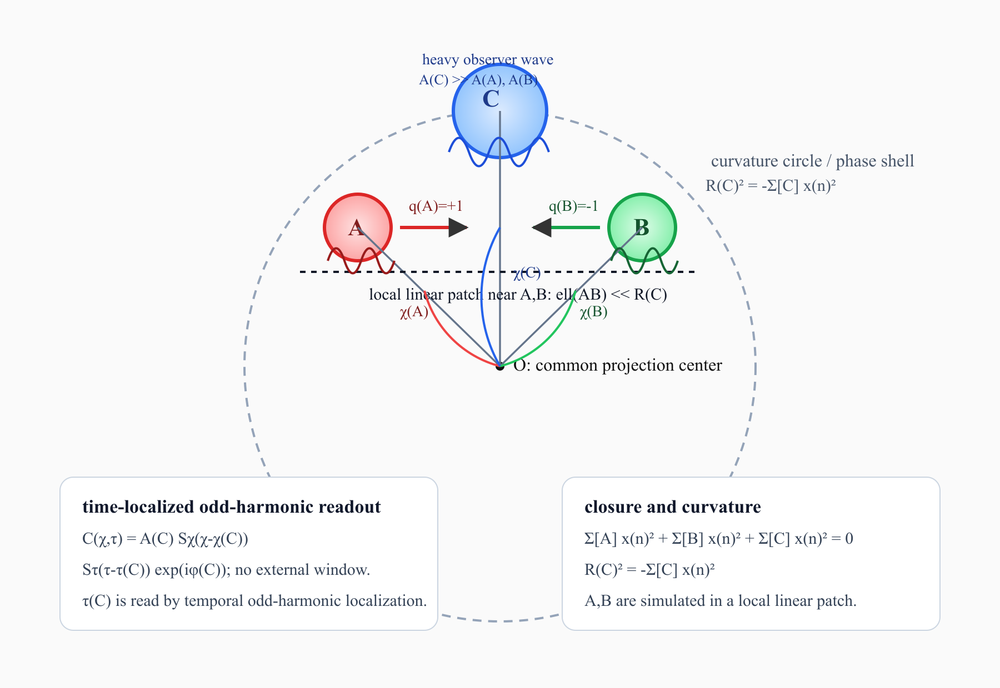

# フェルミオン的局所波 A,B と重い観測機 C による完全弾性衝突シミュレーション仕様書 v1

**日付:** 2026-07-10  
**著者:** 木原 範昭  
**位置づけ:** 無名等振幅複合波モデル 基本公理系 v3 に基づくシミュレーション仕様書  

---

## 0. 前提となる確定公理系

本仕様書は、以下の確定公理系を前提とする。

- 無名等振幅複合波モデル 基本公理系 v3
- 公理0：無名性
- 公理1：全正符号ゼロ閉鎖

```math
\sum_n x_n^2=0
```

- 公理2：非自明存在
- 公理3：無名等振幅複合波
- 第6章：正規化等振幅奇数倍音局在波

本仕様書では、標準理論の散乱理論、標準的な粒子衝突、標準量子測定の導出を主張しない。目的は、確定公理系 v3 の内部で、フェルミオン的核を持つ局所波の完全弾性衝突に相当する有限解像度写像を、数値シミュレーション可能な形式に落とすことである。

---

## 1. シミュレーション実験の目的

### 1.1 目的

本シミュレーションの目的は、フェルミオン的核を持つ二つの粒子様局所波 $A,B$ が、重い観測機 $C$ によって定義される中心投影的な局所近傍において、有限解像度セル前後で、以下の性質を満たすかを検査することである。

1. ラベル保存
2. 代表振幅保存
3. フェルミオン的核の保存
4. 進行方向読出し量の反転
5. 観測機 $C$ の準静的性
6. 全正符号ゼロ閉鎖に基づく曲率半径の安定性

ここでいう完全弾性衝突とは、点イベントではなく、有限解像度セル前後の可逆写像として定義される。

```math
(A(+;L_A),B(-;L_B))
\longmapsto
(A(-;L_A),B(+;L_B))
```

### 1.2 本仕様書で主張しないこと

本仕様書は、以下を主張しない。

- 標準理論におけるフェルミ粒子散乱の導出
- 標準量子力学の測定過程の導出
- 実在粒子の物理衝突断面積の計算
- 標準波動方程式における微分エネルギー保存
- 衝突瞬間という一点イベントの直接観測

本仕様書で扱うのは、確定公理系 v3 内部の有限解像度写像である。

---

## 2. 幾何学的モデル

### 2.1 中心投影モデル

全体系は、重い観測機 $C$ と、粒子様局所波 $A,B$ から成る閉鎖系として扱う。

```math
\sum_A x_n^2+\sum_B x_n^2+\sum_C x_n^2=0
```

観測機 $C$ は十分に重く、曲率半径生成器として読まれる。

```math
R_C^2=-\sum_C x_n^2
```

したがって、$A,B$ 近傍では、

```math
\sum_A x_n^2+\sum_B x_n^2=R_C^2
```

と読む。

$A,B$ の相互作用領域が $R_C$ に比べて十分小さいとき、局所線形近似を用いる。

```math
\ell_{AB}\ll R_C
```

### 2.2 位置位相と時間位相

各局所波は、空間位置位相 $\chi$ と時間位相 $\tau$ を持つ。

```math
A=(A_A,N_{h,\chi}^A,N_{h,\tau}^A,\chi_A,\tau_A,\phi_A,L_A,q_A)
```

```math
B=(A_B,N_{h,\chi}^B,N_{h,\tau}^B,\chi_B,\tau_B,\phi_B,L_B,q_B)
```

```math
C=(A_C,N_{h,\chi}^C,N_{h,\tau}^C,\chi_C,\tau_C,\phi_C)
```

ここで、

- $A_A,A_B,A_C$：代表振幅
- $N_{h,\chi}$：空間方向の最高奇数倍音次数
- $N_{h,\tau}$：時間方向の最高奇数倍音次数
- $\chi$：位置位相
- $\tau$：時間位相
- $\phi$：内部基準位相
- $L_A,L_B$：内部位相差ネットワークとしての読出しラベル
- $q_A,q_B$：進行方向読出し量

である。

### 2.3 中心投影概念図

以下は、重い観測機 $C$ が曲率半径 $R_C$ を生成し、その近傍に局所波 $A,B$ が配置される概念図である。



---

## 3. 使用する局所波形

### 3.1 正規化等振幅奇数倍音局在波

最高奇数倍音次数を

```math
N_h=2K-1
```

とする。

正規化等振幅奇数倍音局在波は、

```math
S_{N_h}(u)=\frac{1}{K}\sum_{m=0}^{K-1}\cos((2m+1)u)
```

または複素表示で、

```math
Z_{N_h}(u)=\frac{1}{K}\sum_{m=0}^{K-1}e^{i(2m+1)u}
```

とする。

代表振幅 $A$ を持つ局在波は、

```math
\Psi_{N_h}(u)=A S_{N_h}(u)
```

または、

```math
\Psi_{N_h}(u)=A Z_{N_h}(u)
```

である。

中央位相 $u=0$ で、

```math
S_{N_h}(0)=1
```

なので、

```math
\Psi_{N_h}(0)=A
```

である。

したがって、$N_h$ を増大させても、同相整列時の代表振幅は $A$ に保存される。

### 3.2 空間・時間局在波

空間位相を $\chi$、時間位相を $\tau$ とする。

局所波 $P\in\{A,B,C\}$ は、

```math
P(\chi,\tau)
=
A_P
S_{N_{h,\chi}^{P}}(\chi-\chi_P)
S_{N_{h,\tau}^{P}}(\tau-\tau_P)
e^{i\phi_P}
```

で与える。

これにより、空間方向と時間方向の双方の局在を、外部窓関数ではなく奇数倍音構造によって作る。

---

## 4. シミュレーション仮定

### 4.1 仮定1：C は十分重い

観測機 $C$ は、局所波 $A,B$ に比べて十分大きい代表振幅容量を持つ。

```math
A_C\gg A_A,A_B
```

これにより、観測機 $C$ は準静的な曲率半径生成器として扱える。

```math
R_C^2=-\sum_C x_n^2
```

### 4.2 仮定2：AB 近傍で局所線形近似できる

$A,B$ の距離を

```math
\ell_{AB}=R_C|\chi_A-\chi_B|
```

と読む。

```math
\ell_{AB}\ll R_C
```

が成り立つとき、AB 近傍では位相円弧を線形近似できる。

### 4.3 仮定3：C の位置位相は観測でほぼ動かない

観測による $C$ の位置位相変化は、$A,B$ の変化に比べて無視できる。

```math
|\delta\chi_C|\ll |\delta\chi_A|,|\delta\chi_B|
```

同様に、時間位相についても、

```math
|\delta\tau_C|\ll |\delta\tau_A|,|\delta\tau_B|
```

とする。

### 4.4 仮定4：正帰還発散は抑制される

観測波 $C$ と局所波 $A,B$ の相互読出しによる正帰還ループは、$C$ の十分大きな代表振幅容量により抑制される。

概念的に、

```math
G_{\rm loop}\sim\frac{A_A+A_B}{A_C}
```

と見て、

```math
G_{\rm loop}\ll1
```

を仮定する。

### 4.5 仮定5：観測は時間方向にも局在している

観測機 $C$ は、時間方向に連続した参照波ではなく、時間位相方向にも奇数倍音構造で局在した波である。

観測中心を $j$ とすると、

```math
C^{(j)}(\chi,\tau)
=
A_C
S_{N_{h,\chi}^{C}}(\chi-\chi_C)
S_{N_{h,\tau}^{C}}(\tau-\tau_C^{(j)})
e^{i\phi_C}
```

と書く。
したがって、どの時間位相で観測したかは、$\tau_C^{(j)}$ と $N_{h,\tau}^{C}$ によって有限解像度で定義される。

相対位相読出しでは、観測機本体 $C^{(j)}$ と、観測対象 $P\in\{A,B\}$ ごとの逆位相参照波 $C_{{\rm read},P}^{(j)}$ を区別する。

```math
C_{{\rm read},P}^{(j)}(\chi,\tau)
=
A_C
S_{N_{h,\chi}^{C}}(\chi-\chi_{C,P}^{(j)})
S_{N_{h,\tau}^{C}}(\tau-\tau_C^{(j)})
e^{-i\phi_C}
```

これは共役ノルムの導入ではなく、読出し基準として逆向き位相を持つ参照波を定義することである。
ここで $\chi_{C,P}^{(j)}$ は $C$ 本体の位置位相ではなく、対象 $P$ を読むための空間読出し中心である。
このとき、

```math
P(\chi,\tau)C_{{\rm read},P}^{(j)}(\chi,\tau)
\propto
e^{i(\phi_P-\phi_C)}
```

となり、外部基準との相対位相を読む。

---

## 5. 初期条件

### 5.1 代表値の設定

最小実装では、以下の値を推奨初期値とする。

| 量 | 推奨値 | 意味 |
|---|---:|---|
| $A_A$ | 1 | 局所波 A の代表振幅 |
| $A_B$ | 1 | 局所波 B の代表振幅 |
| $A_C$ | 1000 | 重い観測機 C の代表振幅 |
| $N_{h,\chi}^A$ | 99 | A の空間方向最高奇数倍音次数 |
| $N_{h,\chi}^B$ | 99 | B の空間方向最高奇数倍音次数 |
| $N_{h,\chi}^C$ | 999 | C の空間方向最高奇数倍音次数 |
| $N_{h,\tau}^A$ | 99 | A の時間方向最高奇数倍音次数 |
| $N_{h,\tau}^B$ | 99 | B の時間方向最高奇数倍音次数 |
| $N_{h,\tau}^C$ | 999 | C の時間方向最高奇数倍音次数 |
| $\chi_C$ | 0 | C の位置位相基準 |
| $\tau_C^{\rm ref}$ | 0 | C の時間位相基準 |
| $\phi_C$ | 0 | C の内部基準位相 |
| $\Delta s$ | 0.01 | 計算順序パラメータの刻み |
| $v_\chi$ | 1 | 位置位相の更新速度 |
| $\omega_A,\omega_B$ | 1 | A,B の時間位相更新率 |
| $s_{\max}$ | 10000 | 最大更新ステップ数 |

### 5.2 A,B の初期配置

局所線形近似上で、A と B を C の近傍に置く。

```math
\chi_A^{(0)}=-d_0
```

```math
\chi_B^{(0)}=+d_0
```

```math
q_A^{(0)}=+1
```

```math
q_B^{(0)}=-1
```

```math
L_A\neq L_B
```

ここで、$q_A=+1$ は A が B へ向かう向き、$q_B=-1$ は B が A へ向かう向きを表す。

推奨値は、

```math
d_0=0.2
```

とする。

### 5.3 時間位相の初期配置

衝突前観測の中心時間位相を、

```math
\tau^{(0)}=-\tau_0
```

衝突セル近傍を、

```math
\tau^{(1)}=0
```

衝突後観測の中心時間位相を、

```math
\tau^{(2)}=+\tau_0
```

とする。

推奨値は、

```math
\tau_0=0.2
```

である。

最小対称実験では、A,B の初期時間位相を

```math
\tau_A^{(0)}=\tau_B^{(0)}=-\tau_0
```

とする。
また、

```math
\omega_A=\omega_B
```

とし、A,B の時間位相差ゼロを保存する。

```math
\tau_A(s)-\tau_B(s)=0
```

したがって、最小対称実験では時間セル条件は常に満たされる。

観測機 $C$ は時間方向にも局在しているため、開始時観測と衝突後観測では、同じ $C$ の時間位相中心を切り替えて読む。

```math
\tau_C^{(0)}=-\tau_0
```

```math
\tau_C^{(2)}=+\tau_0
```

開始時観測波は、

```math
C^{(0)}(\chi,\tau)
=
A_C
S_{N_{h,\chi}^{C}}(\chi-\chi_C)
S_{N_{h,\tau}^{C}}(\tau-\tau_C^{(0)})
e^{i\phi_C}
```

衝突後観測波は、

```math
C^{(2)}(\chi,\tau)
=
A_C
S_{N_{h,\chi}^{C}}(\chi-\chi_C)
S_{N_{h,\tau}^{C}}(\tau-\tau_C^{(2)})
e^{i\phi_C}
```

である。
相対位相読出しに用いる逆位相参照波は、

```math
C_{{\rm read},P}^{(0)}(\chi,\tau)
=
A_C
S_{N_{h,\chi}^{C}}(\chi-\chi_{C,P}^{(0)})
S_{N_{h,\tau}^{C}}(\tau-\tau_C^{(0)})
e^{-i\phi_C}
```

および

```math
C_{{\rm read},P}^{(2)}(\chi,\tau)
=
A_C
S_{N_{h,\chi}^{C}}(\chi-\chi_{C,P}^{(2)})
S_{N_{h,\tau}^{C}}(\tau-\tau_C^{(2)})
e^{-i\phi_C}
```

である。
開始時の空間読出し中心は、

```math
\chi_{C,A}^{(0)}=\chi_A^{(0)},\qquad
\chi_{C,B}^{(0)}=\chi_B^{(0)}
```

とする。
衝突後の空間読出し中心は、衝突後更新から得られる予測位置に合わせる。

```math
\chi_{C,A}^{(2)}=\chi_A^{\rm pred,2},\qquad
\chi_{C,B}^{(2)}=\chi_B^{\rm pred,2}
```

これは $C$ 本体が移動するという意味ではない。
$C$ が持つ空間読出し位相中心を、対象ごとに走査するという意味である。
これは別の観測機を二台置くという意味ではない。
同一の重い観測機 $C$ を、観測ごとの時間位相中心で読出すという意味である。

### 5.4 曲率半径の初期値

観測機 $C$ の代表振幅容量から、概念的に、

```math
R_C^2=-\sum_C x_n^2
```

を定義する。

最小数値実装では、単位系を選び、

```math
R_C=A_C
```

と置く。

推奨初期値では、

```math
R_C=1000
```

である。

このとき、

```math
\ell_{AB}^{(0)}=R_C|\chi_A^{(0)}-\chi_B^{(0)}|
```

であるが、局所線形近似では、正規化位相座標上で

```math
|\chi_A^{(0)}-\chi_B^{(0)}|=2d_0=0.4
```

を用いる。

厳密な物理長への換算は、本仕様書では行わない。

### 5.5 計算順序パラメータと位置位相更新

数値実装では、計算順序パラメータ $s$ を導入する。
$s$ は計算ステップの順序であり、公理12の読出し時間位相 $\tau$ そのものではない。

```math
s\neq\tau
```

位置位相の最小更新則を、

```math
\chi_A(s+\Delta s)=\chi_A(s)+q_A(s)v_\chi\Delta s
```

```math
\chi_B(s+\Delta s)=\chi_B(s)+q_B(s)v_\chi\Delta s
```

とする。

時間位相も更新する場合は、

```math
\tau_A(s+\Delta s)=\tau_A(s)+\omega_A\Delta s
```

```math
\tau_B(s+\Delta s)=\tau_B(s)+\omega_B\Delta s
```

とする。

この更新により、$A,B$ は初期配置から有限解像度セルへ接近する。

---

## 6. 開始時の観測

### 6.1 観測の定式化

観測は、局所波 $A,B$ と観測機 $C$ の空間・時間相関として定義する。
積分領域は閉じた位相領域

```math
\chi,\tau\in[-\pi,\pi)
```

とし、観測値は $(2\pi)^2$ で規格化する。

```math
O_A^{(0)}
=
\frac{1}{(2\pi)^2}
\int_{-\pi}^{\pi}
\int_{-\pi}^{\pi}
A(\chi,\tau) C_{{\rm read},A}^{(0)}(\chi,\tau)
d\chi d\tau
```

```math
O_B^{(0)}
=
\frac{1}{(2\pi)^2}
\int_{-\pi}^{\pi}
\int_{-\pi}^{\pi}
B(\chi,\tau) C_{{\rm read},B}^{(0)}(\chi,\tau)
d\chi d\tau
```

この積は、共役ノルムではなく、公理1の二乗レジストリ側の読出しに合わせた相関読出しである。
相対位相読出しでは、

```math
A(\chi,\tau)C_{{\rm read},A}^{(0)}(\chi,\tau)
\propto
e^{i(\phi_A-\phi_C)}
```

として、外部基準との相対位相を読む。

必要に応じて、直交補償成分 $iC_{{\rm read},A}^{(0)}$ を併用し、I/Q 的に読出す。

```math
O_{A,\perp}^{(0)}
=
\frac{1}{(2\pi)^2}
\int_{-\pi}^{\pi}
\int_{-\pi}^{\pi}
A(\chi,\tau) iC_{{\rm read},A}^{(0)}(\chi,\tau)
d\chi d\tau
```

ただし、最小実装では、まず相対位相読出し相関 $O_A^{(0)},O_B^{(0)}$ を記録する。

### 6.2 観測結果として読出す量

開始時観測で読出す量は、

```math
(\chi_A^{\rm read,0},\tau_A^{\rm read,0},L_A,q_A^{\rm read,0})
```

```math
(\chi_B^{\rm read,0},\tau_B^{\rm read,0},L_B,q_B^{\rm read,0})
```

である。

期待される読出しは、

```math
\chi_A^{\rm read,0}<\chi_B^{\rm read,0}
```

```math
q_A^{\rm read,0}=+1
```

```math
q_B^{\rm read,0}=-1
```

```math
L_A^{\rm read,0}=L_A
```

```math
L_B^{\rm read,0}=L_B
```

である。

### 6.3 観測による更新

観測後の状態は、

```math
(A,B,C^{(0)})\mapsto(A',B',C')
```

である。

重い観測機仮定により、

```math
C'\simeq C^{(0)}
```

```math
\chi_C'\simeq\chi_C
```

```math
\tau_C'\simeq\tau_C^{(0)}
```

とする。

A,B には有限解像度の位相擾乱を許す。

```math
\chi_A'=\chi_A+\delta\chi_A^{\rm obs}
```

```math
\tau_A'=\tau_A+\delta\tau_A^{\rm obs}
```

```math
\chi_B'=\chi_B+\delta\chi_B^{\rm obs}
```

```math
\tau_B'=\tau_B+\delta\tau_B^{\rm obs}
```

擾乱幅は、観測波 C の局在幅により制限される。

```math
|\delta\chi_A^{\rm obs}|,|\delta\chi_B^{\rm obs}|
\lesssim
\epsilon_\chi^C
```

```math
|\delta\tau_A^{\rm obs}|,|\delta\tau_B^{\rm obs}|
\lesssim
\epsilon_\tau^C
```

ここで、

```math
\epsilon_\chi^C=\frac{\pi}{N_{h,\chi}^C+1}
```

```math
\epsilon_\tau^C=\frac{\pi}{N_{h,\tau}^C+1}
```

である。

---

## 7. 衝突時の相互作用計算

### 7.1 有限解像度セル

衝突は一点ではなく、有限解像度セルへの侵入として定義する。

空間セル条件：

```math
|\chi_A'-\chi_B'|<\epsilon_\chi^{AB}
```

時間セル条件：

```math
|\tau_A'-\tau_B'|<\epsilon_\tau^{AB}
```

ここで、

正規化等振幅奇数倍音局在波は、

```math
S_{N_h}(u)=\frac{\sin((N_h+1)u)}{(N_h+1)\sin u}
```

と書ける。
中央ピークから最初の零点までの位相幅は、

```math
u_0=\frac{\pi}{N_h+1}
```

である。
したがって、最小実装では有限解像度セル幅を

```math
\epsilon_\chi^{AB}
=
\frac{\pi}{\min(N_{h,\chi}^A,N_{h,\chi}^B)+1}
```

```math
\epsilon_\tau^{AB}
=
\frac{\pi}{\min(N_{h,\tau}^A,N_{h,\tau}^B)+1}
```

と固定する。

### 7.2 衝突判定

開始時観測後、5.5 の更新則を計算順序パラメータ $s$ に沿って反復する。
各ステップで以下の条件を同時に満たすとき、A,B は相互作用セル内に入ったと判定する。

```math
|\chi_A'-\chi_B'|<\epsilon_\chi^{AB}
```

```math
|\tau_A'-\tau_B'|<\epsilon_\tau^{AB}
```

このとき、完全弾性衝突写像を適用する。
最大更新ステップ数 $s_{\max}$ 以内に条件を満たさない場合は、衝突セル未到達として終了する。

```text
collision_cell_not_reached
```

### 7.3 完全弾性衝突写像

衝突写像 $\mathcal C$ は、

```math
\mathcal C:
(A',B',C')\mapsto(A'',B'',C'')
```

である。

この写像は以下を満たす。

#### 7.3.1 進行方向反転

```math
q_A''=-q_A'
```

```math
q_B''=-q_B'
```

#### 7.3.2 ラベル保存

```math
L_A''=L_A'
```

```math
L_B''=L_B'
```

#### 7.3.3 代表振幅保存

```math
A_A''=A_A'
```

```math
A_B''=A_B'
```

#### 7.3.4 フェルミオン的核保存

A,B の内部フェルミオン的核は保存される。

```math
C_F^A{}''=C_F^A{}'
```

```math
C_F^B{}''=C_F^B{}'
```

ここで $C_F$ は、内部位相差 $\Delta=\pi$ を持つフェルミオン的核を表す記号である。

#### 7.3.5 C の準静的保存

```math
C''\simeq C'
```

```math
\chi_C''\simeq\chi_C'
```

```math
\tau_C''\simeq\tau_C'
```

#### 7.3.6 可逆性

同じ写像を二度適用すれば元に戻る。

```math
\mathcal C^2={\rm id}
```

### 7.4 衝突後の移動継続

衝突写像の適用後も、同じ計算順序パラメータ $s$ による更新を続ける。
進行方向反転後の最小更新則は、

```math
\chi_A(s+\Delta s)=\chi_A(s)+q_A''v_\chi\Delta s
```

```math
\chi_B(s+\Delta s)=\chi_B(s)+q_B''v_\chi\Delta s
```

である。

時間位相も更新する場合は、

```math
\tau_A(s+\Delta s)=\tau_A(s)+\omega_A\Delta s
```

```math
\tau_B(s+\Delta s)=\tau_B(s)+\omega_B\Delta s
```

とする。
この更新を衝突後観測の時間位相中心 $\tau_C^{(2)}$ 近傍まで続ける。

これにより、完全弾性衝突の読出しは、進行方向量 $q$ の反転だけでなく、ラベルを保った局所波が反転方向へ移動したこととして確認される。

---

## 8. 衝突後の観測

### 8.1 観測の定式化

衝突後も、開始時と同じ規格化観測写像を用いる。
ただし相対位相読出しでは、衝突後観測の時間位相中心と対象別の空間読出し中心を持つ $C_{{\rm read},A}^{(2)},C_{{\rm read},B}^{(2)}$ を用いる。

```math
O_A^{(2)}
=
\frac{1}{(2\pi)^2}
\int_{-\pi}^{\pi}
\int_{-\pi}^{\pi}
A''(\chi,\tau) C_{{\rm read},A}^{(2)}(\chi,\tau)
d\chi d\tau
```

```math
O_B^{(2)}
=
\frac{1}{(2\pi)^2}
\int_{-\pi}^{\pi}
\int_{-\pi}^{\pi}
B''(\chi,\tau) C_{{\rm read},B}^{(2)}(\chi,\tau)
d\chi d\tau
```

### 8.2 衝突後に読出す量

```math
(\chi_A^{\rm read,2},\tau_A^{\rm read,2},L_A^{\rm read,2},q_A^{\rm read,2})
```

```math
(\chi_B^{\rm read,2},\tau_B^{\rm read,2},L_B^{\rm read,2},q_B^{\rm read,2})
```

を読出す。

期待される結果は、

```math
q_A^{\rm read,2}=-q_A^{\rm read,0}
```

```math
q_B^{\rm read,2}=-q_B^{\rm read,0}
```

```math
L_A^{\rm read,2}=L_A^{\rm read,0}
```

```math
L_B^{\rm read,2}=L_B^{\rm read,0}
```

```math
\chi_A^{\rm read,2}<\chi_B^{\rm read,2}
```

```math
|\chi_A^{\rm read,2}-\chi_B^{\rm read,2}|>\epsilon_\chi^{AB}
```

である。

---

## 9. 判定基準

### 9.1 完全弾性衝突成立条件

以下を満たすとき、有限解像度セル前後での完全弾性衝突写像が成立したと判定する。

#### 条件1：ラベル保存

```math
L_A^{\rm read,2}=L_A^{\rm read,0}
```

```math
L_B^{\rm read,2}=L_B^{\rm read,0}
```

#### 条件2：進行方向反転

```math
q_A^{\rm read,2}=-q_A^{\rm read,0}
```

```math
q_B^{\rm read,2}=-q_B^{\rm read,0}
```

#### 条件3：衝突後の離反

```math
\chi_A^{\rm read,2}<\chi_B^{\rm read,2}
```

```math
|\chi_A^{\rm read,2}-\chi_B^{\rm read,2}|>\epsilon_\chi^{AB}
```

#### 条件4：代表振幅保存

```math
A_A^{\rm read,2}\simeq A_A^{\rm read,0}
```

```math
A_B^{\rm read,2}\simeq A_B^{\rm read,0}
```

#### 条件5：C の準静的性

```math
\chi_C^{\rm read,2}\simeq \chi_C^{\rm read,0}
```

```math
A_C^{\rm read,2}\simeq A_C^{\rm read,0}
```

観測時の時間位相中心は、準静的保存ではなく指定値との一致で判定する。

```math
\tau_C^{\rm read,0}=-\tau_0
```

```math
\tau_C^{\rm read,2}=+\tau_0
```

#### 条件6：閉鎖条件の維持

```math
\sum_A x_n^2+\sum_B x_n^2+\sum_C x_n^2=0
```

が、数値誤差範囲で維持される。
ただし初回テストでは、各波に属する閉鎖成分 $x_n$ の具体的割当てをまだ定義しない。
したがって初回テストの判定ログでは、

```text
closure_preserved: not_evaluated
```

とする。
閉鎖条件の数値検証は、$x_n$ の割当てを定義した第二段階で実施する。

### 9.2 失敗条件

以下のいずれかが起きた場合、完全弾性衝突写像は成立しないと判定する。

1. $L_A,L_B$ が交換または消失する
2. $q_A,q_B$ が反転しない
3. 衝突後にラベルを保った A,B がセル外へ離反しない
4. 代表振幅が大きく変化する
5. $C$ の位置位相または代表振幅が大きく変化する
6. 観測ごとの時間位相中心が $\tau_C^{(0)}=-\tau_0,\tau_C^{(2)}=+\tau_0$ と一致しない
7. 正帰還により $A_C,A_A,A_B$ が発散する
8. 評価対象として定義済みの閉鎖条件 $\sum x_n^2=0$ が維持されない
9. 観測セルが広すぎて反射と通過を区別できない
10. 観測セルが狭すぎて巻数曖昧性が支配的になる
11. 最大更新ステップ数以内に衝突セルへ到達しない

---

## 10. 実装手順

### 10.1 実装ステップ

1. パラメータ $A_A,A_B,A_C,N_{h,\chi},N_{h,\tau},\chi,\tau,\phi,L,q,\Delta s,v_\chi,\omega,s_{\max}$ を設定する。
2. $S_{N_h}(u)$ を定義する。
3. 有限解像度セル幅 $\epsilon_\chi^{AB},\epsilon_\tau^{AB},\epsilon_\chi^C,\epsilon_\tau^C$ を計算する。
4. $A(\chi,\tau),B(\chi,\tau),C^{(0)}(\chi,\tau),C^{(2)}(\chi,\tau),C_{{\rm read},A}^{(0)}(\chi,\tau),C_{{\rm read},B}^{(0)}(\chi,\tau)$ を生成する。
5. 対象別の逆位相参照波による開始時観測 $O_A^{(0)},O_B^{(0)}$ を計算する。
6. 観測擾乱を入れて $A',B',C'$ を得る。
7. 計算順序パラメータ $s$ に沿って $A',B'$ を更新し、有限解像度セルに入るか判定する。
8. $s_{\max}$ 以内にセルへ到達しない場合、`collision_cell_not_reached` として終了する。
9. セルに入った場合、$\mathcal C$ を適用する。
10. 衝突後状態 $A'',B'',C''$ を得て、反転後の進行方向で移動を継続する。
11. 対象別の逆位相参照波による衝突後観測 $O_A^{(2)},O_B^{(2)}$ を計算する。
12. ラベル保存、進行方向反転、衝突後離反、代表振幅保存、C の準静的性を判定する。初回テストでは閉鎖条件を `not_evaluated` とする。

### 10.2 擬似コード

```text
Input parameters:
  A_A, A_B, A_C
  Nh_chi_A, Nh_tau_A
  Nh_chi_B, Nh_tau_B
  Nh_chi_C, Nh_tau_C
  chi_A, chi_B, chi_C
  tau_A, tau_B, tau_0
  phi_A, phi_B, phi_C
  L_A, L_B
  q_A = +1, q_B = -1
  delta_s, v_chi
  omega_A, omega_B
  s_max

Minimal symmetric time phase:
  tau_A = -tau_0
  tau_B = -tau_0
  omega_A = omega_B

Observer readout centers:
  tau_C0 = -tau_0
  tau_C2 = +tau_0
  chi_C_A0 = chi_A
  chi_C_B0 = chi_B

Define S_Nh(u):
  K = (Nh + 1) / 2
  S = (1/K) * sum_{m=0}^{K-1} cos((2m+1)u)

Define cell widths:
  epsilon_chi_AB = pi / (min(Nh_chi_A, Nh_chi_B) + 1)
  epsilon_tau_AB = pi / (min(Nh_tau_A, Nh_tau_B) + 1)
  epsilon_chi_C = pi / (Nh_chi_C + 1)
  epsilon_tau_C = pi / (Nh_tau_C + 1)

Define local waves:
  A(chi,tau) = A_A S_NhA_chi(chi-chi_A) S_NhA_tau(tau-tau_A) exp(i phi_A)
  B(chi,tau) = A_B S_NhB_chi(chi-chi_B) S_NhB_tau(tau-tau_B) exp(i phi_B)
  C0(chi,tau) = A_C S_NhC_chi(chi-chi_C) S_NhC_tau(tau-tau_C0) exp(i phi_C)
  C2(chi,tau) = A_C S_NhC_chi(chi-chi_C) S_NhC_tau(tau-tau_C2) exp(i phi_C)
  Cread(chi,tau,chi_center,tau_center)
    = A_C S_NhC_chi(chi-chi_center) S_NhC_tau(tau-tau_center) exp(-i phi_C)

Initial observation:
  O_A0 = (1/(2*pi)^2) * integral_{-pi}^{pi} integral_{-pi}^{pi}
         A(chi,tau) Cread(chi,tau,chi_C_A0,tau_C0) dchi dtau
  O_B0 = (1/(2*pi)^2) * integral_{-pi}^{pi} integral_{-pi}^{pi}
         B(chi,tau) Cread(chi,tau,chi_C_B0,tau_C0) dchi dtau

Observation update:
  chi_A' = chi_A + delta_chi_A_obs
  chi_B' = chi_B + delta_chi_B_obs
  tau_A' = tau_A + delta_tau_A_obs
  tau_B' = tau_B + delta_tau_B_obs
  q_A' = q_A
  q_B' = q_B
  L_A' = L_A
  L_B' = L_B
  A_A' = A_A
  A_B' = A_B
  C' ≈ C0

Propagate toward collision cell:
  step = 0
  while abs(chi_A' - chi_B') >= epsilon_chi_AB
        or abs(tau_A' - tau_B') >= epsilon_tau_AB:
      if step >= s_max:
          return collision_cell_not_reached
      chi_A' = chi_A' + q_A' * v_chi * delta_s
      chi_B' = chi_B' + q_B' * v_chi * delta_s
      tau_A' = tau_A' + omega_A * delta_s
      tau_B' = tau_B' + omega_B * delta_s
      step = step + 1

Collision map:
  chi_A'' = chi_A'
  chi_B'' = chi_B'
  tau_A'' = tau_A'
  tau_B'' = tau_B'
  q_A'' = -q_A'
  q_B'' = -q_B'
  L_A'' = L_A'
  L_B'' = L_B'
  A_A'' = A_A'
  A_B'' = A_B'
  C'' ≈ C'

Post-collision propagation:
  post_step = 0
  while abs(chi_A'' - chi_B'') <= epsilon_chi_AB
        or min(tau_A'', tau_B'') < tau_C2:
      if post_step >= s_max:
          return post_collision_propagation_not_completed
      chi_A'' = chi_A'' + q_A'' * v_chi * delta_s
      chi_B'' = chi_B'' + q_B'' * v_chi * delta_s
      tau_A'' = tau_A'' + omega_A * delta_s
      tau_B'' = tau_B'' + omega_B * delta_s
      post_step = post_step + 1

Post observation:
  chi_C_A2 = chi_A''
  chi_C_B2 = chi_B''
  O_A2 = (1/(2*pi)^2) * integral_{-pi}^{pi} integral_{-pi}^{pi}
         A''(chi,tau) Cread(chi,tau,chi_C_A2,tau_C2) dchi dtau
  O_B2 = (1/(2*pi)^2) * integral_{-pi}^{pi} integral_{-pi}^{pi}
         B''(chi,tau) Cread(chi,tau,chi_C_B2,tau_C2) dchi dtau

Judgement:
  label preserved?
  q reversed?
  A and B separated after collision?
  representative amplitude preserved?
  C position and amplitude quasi-static?
  observer readout centers matched?
  closure_preserved = not_evaluated in first test
```

---

## 11. 出力すべき結果

シミュレーションは、最低限、以下を出力する。

### 11.1 数値表

| 項目 | 開始時 | 観測後 | 衝突後 | 衝突後観測 |
|---|---:|---:|---:|---:|
| $\chi_A$ | | | | |
| $\chi_B$ | | | | |
| $\tau_A$ | | | | |
| $\tau_B$ | | | | |
| $q_A$ | | | | |
| $q_B$ | | | | |
| $L_A$ | | | | |
| $L_B$ | | | | |
| $A_A$ | | | | |
| $A_B$ | | | | |
| $\chi_C$ | | | | |
| $\tau_C$ | | | | |

### 11.2 図

1. 初期配置の中心投影図
2. $A,B,C$ の空間局在波形
3. $A,B,C$ の時間局在波形
4. 衝突前後の $\chi_A,\chi_B$ の推移
5. 衝突前後の $q_A,q_B$ の反転
6. 観測相関 $O_A,O_B$ の前後比較

### 11.3 判定ログ

```text
label_preserved_A: true/false
label_preserved_B: true/false
q_reversed_A: true/false
q_reversed_B: true/false
amplitude_preserved_A: true/false
amplitude_preserved_B: true/false
observer_C_quasi_static: true/false
observer_time_centers_valid: true/false
separated_after_collision: true/false
collision_cell_reached: true/false
collision_cell_not_reached: true/false
post_collision_propagation_completed: true/false
closure_preserved: true/false/not_evaluated
elastic_collision_map_valid: true/false
```

---

## 12. 本仕様書の核心

本仕様書の核心は、次の四点である。

### 12.1 衝突瞬間は直接観測しない

衝突は一点イベントではなく、有限解像度セル前後の写像として扱う。

```math
|\chi_A-\chi_B|<\epsilon_\chi^{AB}
```

```math
|\tau_A-\tau_B|<\epsilon_\tau^{AB}
```

### 12.2 観測機 C は時間方向にも局在する

観測機 $C$ は連続時計ではない。

観測中心を $j$ とすると、

```math
C^{(j)}(\chi,\tau)
=
A_C
S_{N_{h,\chi}^{C}}(\chi-\chi_C)
S_{N_{h,\tau}^{C}}(\tau-\tau_C^{(j)})
e^{i\phi_C}
```

である。
開始時観測と衝突後観測では、

```math
\tau_C^{(0)}=-\tau_0,\qquad \tau_C^{(2)}=+\tau_0
```

を用いる。
したがって、どの時間位相で観測したかは、$C$ の時間方向奇数倍音局在と観測中心 $\tau_C^{(j)}$ によって決まる。
相対位相読出しでは、観測機本体ではなく逆位相参照波

```math
C_{\rm read}^{(j)}(\chi,\tau)
=
A_C
S_{N_{h,\chi}^{C}}(\chi-\chi_C)
S_{N_{h,\tau}^{C}}(\tau-\tau_C^{(j)})
e^{-i\phi_C}
```

を用いる。
これにより、

```math
A(\chi,\tau)C_{\rm read}^{(j)}(\chi,\tau)
\propto
e^{i(\phi_A-\phi_C)}
```

として相対位相を読む。

### 12.3 高次奇数倍音は保存量を増やす操作ではない

最高奇数倍音次数 $N_h$ を増やす操作は、保存量を外部から増やす操作ではない。

```math
S_{N_h}(0)=1
```

したがって、

```math
\Psi_{N_h}(0)=A
```

である。

これは、公理1の閉鎖条件の内部で、同一代表振幅を持つ位相構造を細分化する操作である。

### 12.4 C は重い曲率半径生成器として吸収される

```math
A_C\gg A_A,A_B
```

であるとき、$C$ は動的な第三体ではなく、AB 近傍に有効曲率半径を与える準静的背景として扱える。

```math
R_C^2=-\sum_C x_n^2
```

```math
\ell_{AB}\ll R_C
```

この条件の下で、AB の相互作用は局所線形二体問題として近似できる。

---

## 13. 次工程

次工程では、本仕様書に基づき、以下を実装する。

1. $S_{N_h}(u)$ の生成関数
2. 空間・時間局在波 $A,B,C^{(0)},C^{(2)},C_{{\rm read},A}^{(0)},C_{{\rm read},B}^{(0)},C_{{\rm read},A}^{(2)},C_{{\rm read},B}^{(2)}$ の生成
3. 中心投影図の SVG 出力
4. 初期観測相関の計算
5. 観測擾乱の導入
6. 有限解像度セルによる衝突判定
7. 完全弾性衝突写像の適用
8. 衝突後の移動継続
9. 衝突後観測相関の計算
10. 判定ログの出力
11. PNG/SVG 図の生成

---
