# 完全弾性衝突シミュレーション実験結果 v1

**日付:** 2026-07-10  
**著者:** 木原 範昭  
**位置づけ:** 無名等振幅複合波モデル 基本公理系 v3 に基づく、完全弾性衝突シミュレーション結果の総括

---

## 0. 結論

本実験群では、フェルミオン的核を持つ局所波 `A,B` が、重い観測機 `C` のもとで有限解像度セル前後の可逆写像として完全弾性衝突を構成できるかを検査した。

最小実験、識別振動保存、観測機条件、セル解像度、反射/通過の対照実験、非対称条件、観測擾乱、複数回衝突、`η` 識別振動の読出し解像度を確認した結果、以下が得られた。

| 判定項目 | 結果 |
|---|---|
| 有限解像度セル到達 | 成立 |
| 進行方向読出し量 `q` の反転 | 成立 |
| 識別振動モード `m_A,m_B` の保存 | 成立 |
| ラベル交換・通過との区別 | 成立 |
| 代表振幅保存 | 成立 |
| 公理1に基づく補償付き二乗閉鎖 | 成立 |
| 複数回衝突での保存 | 成立 |
| 破綻条件 | 観測機不足、セル解像度不足、時間セル不一致、識別振動の読出しエイリアス |

したがって、本仕様書 v1 の範囲では、完全弾性衝突は「一点イベント」ではなく、有限解像度セル前後の保存写像として実装可能である。

---

## 1. 実験一覧

| No. | 実験 | 目的 | 主結果 |
|---:|---|---|---|
| 1 | 基本完全弾性衝突 | 最小条件で写像が成立するか | 成立 |
| 2 | 識別振動頑健性 | 識別モード混合に耐えるか | 漏れ率 `0.35` 以降で純度条件が破綻 |
| 3 | 観測機 C 条件 | C が十分重い条件を探る | `A_C >= 20` で成立 |
| 4 | セル解像度 | 刻み幅と有限セル幅の関係を見る | `delta_s <= epsilon_chi_AB` が安定条件 |
| 5 | 反射/通過 対照実験 | 反射と通過・ラベル交換を区別できるか | 反射写像のみ成立 |
| 6 | 非対称条件 | 振幅・倍音・時間ずれの影響を見る | 時間セル不一致で破綻 |
| 7 | 観測擾乱 | 観測擾乱の許容範囲を見る | C 幅超過はモデル条件破綻、AB セル超過で写像破綻 |
| 8 | 複数回衝突 | 保存が反復して保たれるか | 8回衝突すべて成立 |
| 9 | `η` 読出し解像度 | 識別振動の読出しエイリアスを見る | 無効ケースはすべてエイリアス |

---

## 2. 基本完全弾性衝突

### 2.1 実験条件

| 量 | 値 |
|---|---:|
| `A_A,A_B` | `1` |
| `A_C` | `1000` |
| `N_{h,chi}^A,N_{h,chi}^B` | `99` |
| `N_{h,chi}^C` | `999` |
| `chi_A^{(0)}, chi_B^{(0)}` | `-0.2, +0.2` |
| `q_A^{(0)}, q_B^{(0)}` | `+1, -1` |
| `m_A,m_B` | `1, 2` |
| 衝突セル到達ステップ | `19` |
| 最終ステップ | `40` |

### 2.2 判定

| 項目 | 結果 |
|---|---|
| `elastic_collision_map_valid` | `true` |
| `collision_cell_reached` | `true` |
| `q_reversed_A,q_reversed_B` | `true,true` |
| `label_mode_preserved_A,label_mode_preserved_B` | `true,true` |
| `label_mode_swapped` | `false` |
| `label_mode_cross_talk` | `false` |
| `closure_preserved` | `true` |
| `closure_residual_abs` | `0.0` |

### 2.3 図

| 軌道と方向反転 | 識別振動モード読出し |
|---|---|
|  | 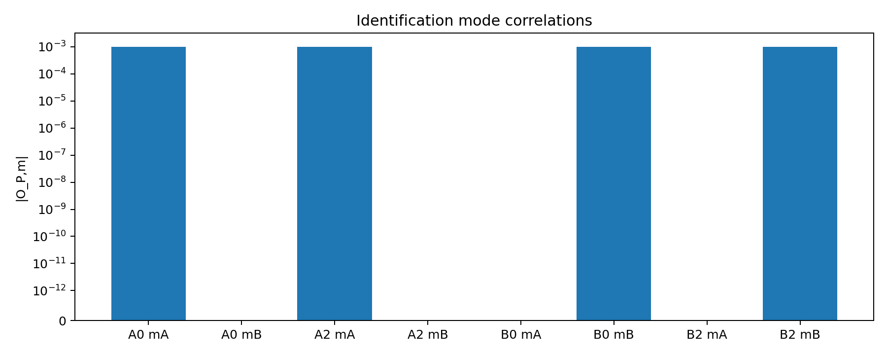 |

詳細:
[基本実験レポート](elastic_collision_simulation_result_v1/elastic_collision_report_v1.md) /
[JSON](elastic_collision_simulation_result_v1/elastic_collision_result_v1.json) /
[CSV](elastic_collision_simulation_result_v1/elastic_collision_timeline_v1.csv)

---

## 3. 識別振動保存と頑健性

識別ラベルを単なる変数コピーではなく、内部識別位相 `η` 上の振動モードとして実装した。

局所波 `P` は、空間・時間局在に加えて識別振動 `D_L(η)` を持つ。
読出し側では逆位相参照 `exp(-imη)` との相関を取り、最大相関モードを識別子として読む。

### 3.1 結果

| 項目 | 値 |
|---|---:|
| 総ケース数 | `36` |
| 有効ケース数 | `20` |
| 無効ケース数 | `16` |
| 最初の破綻漏れ率 | `0.35` |

漏れ率が小さい範囲では、識別振動モードは衝突前後で保存された。漏れ率が大きくなると、モード自体は読めても純度条件を満たさなくなる。

| 純度曲線 | 保存判定 |
|---|---|
| 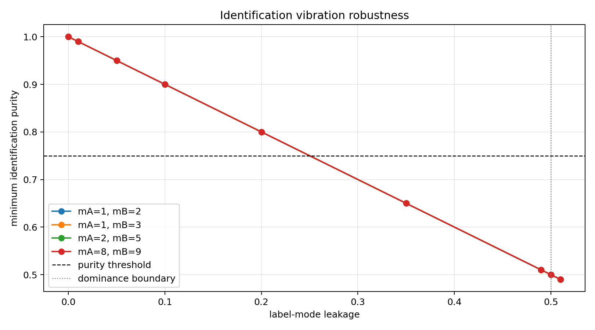 | 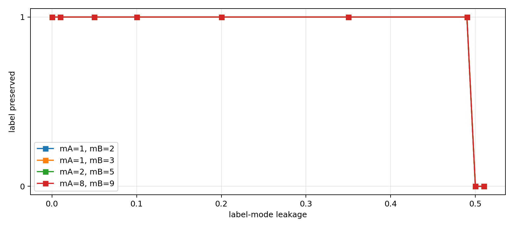 |

詳細:
[識別振動頑健性レポート](elastic_collision_label_robustness_result_v1/label_robustness_report_v1.md) /
[JSON](elastic_collision_label_robustness_result_v1/label_robustness_result_v1.json)

---

## 4. 観測機 C の重さ条件

観測機 `C` は、単なる第三体ではなく、AB 近傍に有効曲率半径を与える準静的背景として扱われる。

### 4.1 結果

| 項目 | 値 |
|---|---:|
| 総ケース数 | `13` |
| 有効ケース数 | `7` |
| 無効ケース数 | `6` |
| 最初に成立する `A_C` | `20` |

`G_loop=(A_A+A_B)/A_C` による観測機の揺らぎ見積りが、観測機自身の局在幅以下になるところから成立した。

| 条件量 | 有効性 |
|---|---|
| 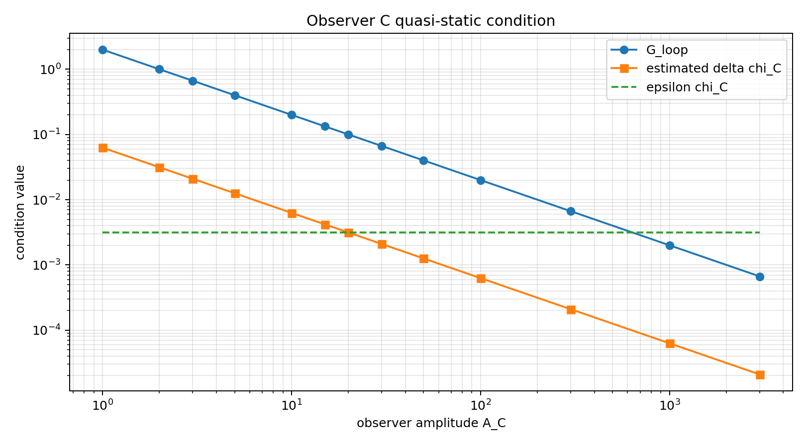 |  |

詳細:
[観測機条件レポート](elastic_collision_observer_sweep_result_v1/observer_sweep_report_v1.md) /
[JSON](elastic_collision_observer_sweep_result_v1/observer_sweep_result_v1.json)

---

## 5. セル解像度と時間刻み

有限解像度セルは、奇数倍音局在波の最初の零点幅から定義した。

実装上は、位置更新刻み `delta_s` がセル幅より粗いと、衝突セルを飛び越える可能性がある。

### 5.1 結果

| 項目 | 値 |
|---|---:|
| 総ケース数 | `60` |
| 有効ケース数 | `57` |
| 無効ケース数 | `3` |
| off-grid 有効ケース数 | `27` |
| off-grid 無効ケース数 | `3` |

無効ケースは、初期位置が刻み幅と整列しない `d0=0.203` かつ高解像度セルで、`delta_s` が粗い場合に集中した。

| サンプリング条件 | off-grid 判定 | grid 整列判定 |
|---|---|---|
| 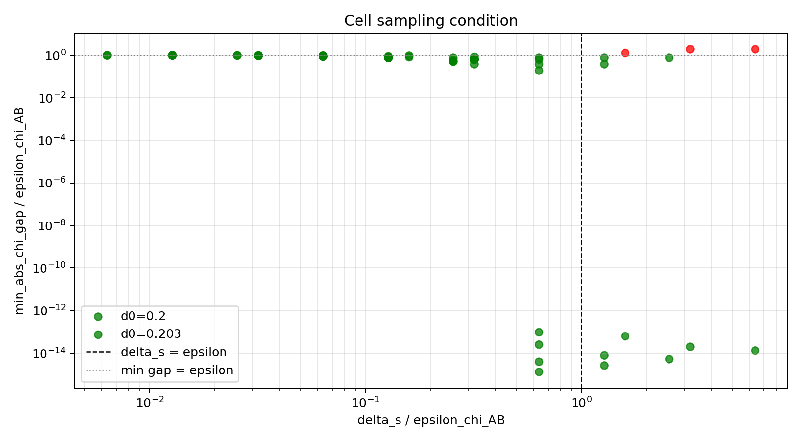 | 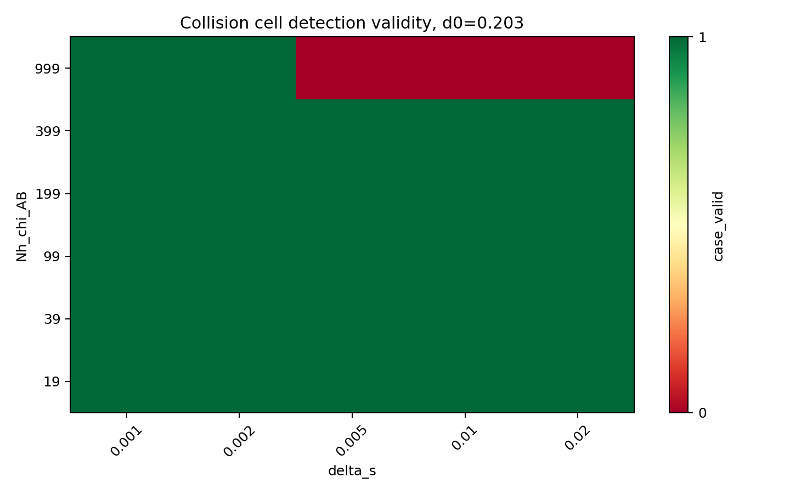 | 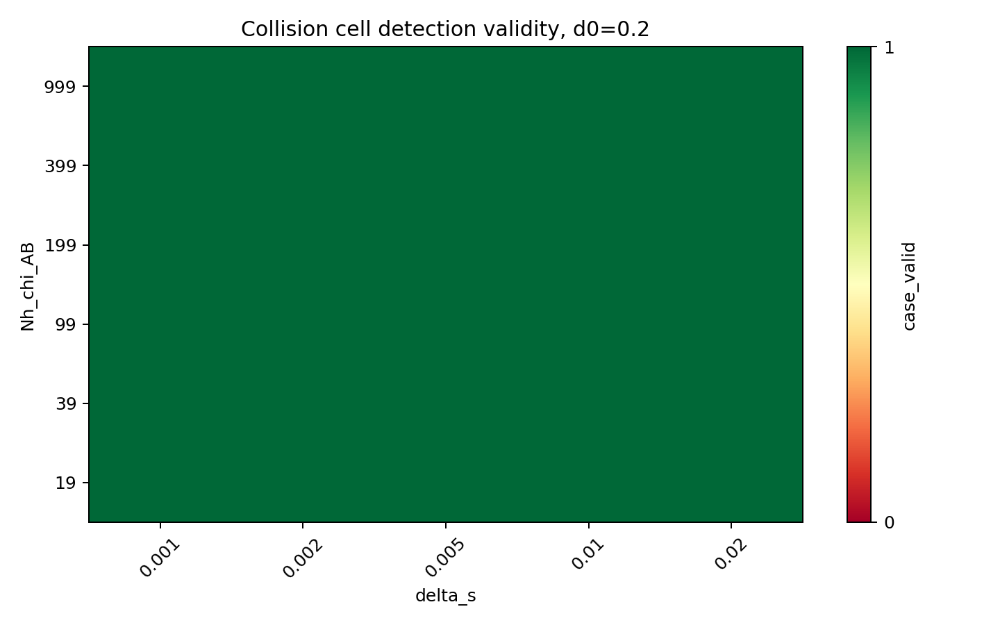 |

詳細:
[セル解像度レポート](elastic_collision_cell_resolution_sweep_result_v1/cell_resolution_sweep_report_v1.md) /
[JSON](elastic_collision_cell_resolution_sweep_result_v1/cell_resolution_sweep_result_v1.json)

---

## 6. 反射・通過・ラベル交換の対照実験

完全弾性衝突を、単なる「A と B がすれ違った」状態と区別するため、複数の写像を比較した。

### 6.1 結果

| 写像 | 成立判定 |
|---|---|
| reflection | 成立 |
| transmission | 不成立 |
| label_exchange_reflection | 不成立 |
| transmission_with_label_exchange | 不成立 |

`transmission_with_label_exchange` は空間位置だけを見ると反射に似せられるが、`q` の反転と識別振動保存で弾かれる。

| 軌道比較 | 判定 |
|---|---|
|  |  |

詳細:
[対照実験レポート](elastic_collision_control_maps_result_v1/control_maps_report_v1.md) /
[JSON](elastic_collision_control_maps_result_v1/control_maps_result_v1.json)

---

## 7. 非対称条件

振幅、最高奇数倍音次数、時間位相、時間位相更新率に非対称性を入れた。

### 7.1 結果

| 項目 | 値 |
|---|---:|
| 総ケース数 | `10` |
| 有効ケース数 | `7` |
| 無効ケース数 | `3` |

振幅差や倍音次数差だけでは破綻しない。破綻は、空間セル到達と時間セル到達が同時に満たされない場合に生じた。

| セルギャップ | 判定 |
|---|---|
|  | 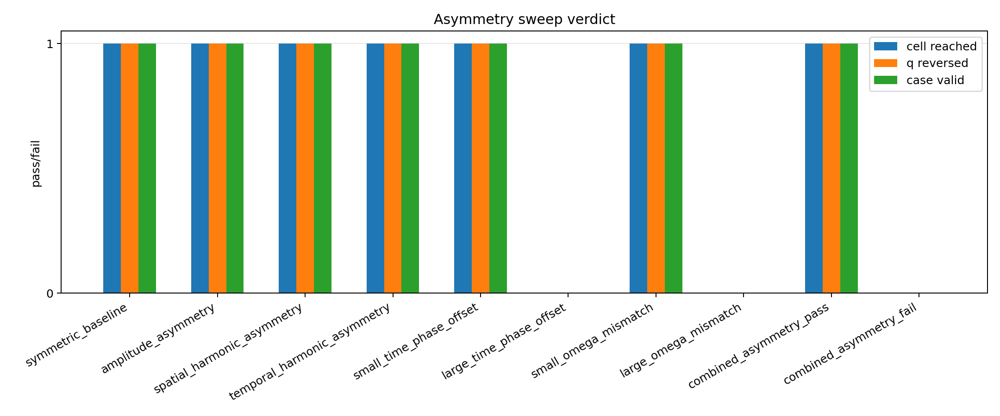 |

詳細:
[非対称条件レポート](elastic_collision_asymmetry_sweep_result_v1/asymmetry_sweep_report_v1.md) /
[JSON](elastic_collision_asymmetry_sweep_result_v1/asymmetry_sweep_result_v1.json)

---

## 8. 観測擾乱

観測により `A,B` の位置位相・時間位相に擾乱を入れた。

### 8.1 結果

| 項目 | 値 |
|---|---:|
| 総ケース数 | `8` |
| 観測モデル有効ケース数 | `5` |
| 衝突写像有効ケース数 | `7` |
| 無効ケース数 | `3` |

観測擾乱が `C` の局在幅を超えると、観測モデルとしては無効になる。ただし AB の相互作用セル条件を満たす限り、衝突写像自体はまだ成立する。AB セル条件も外れると、写像は成立しない。

| 閾値 | 判定 |
|---|---|
| 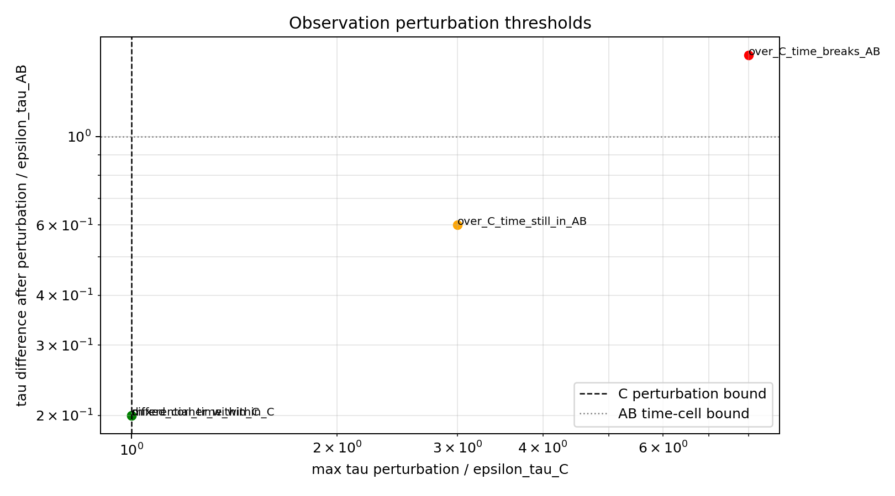 | 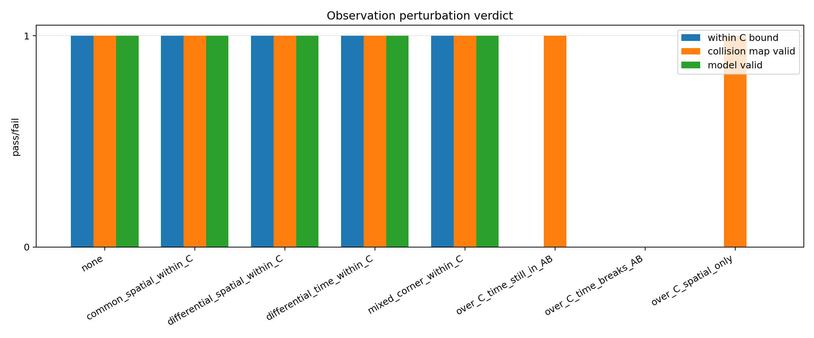 |

詳細:
[観測擾乱レポート](elastic_collision_observation_perturbation_result_v1/observation_perturbation_report_v1.md) /
[JSON](elastic_collision_observation_perturbation_result_v1/observation_perturbation_result_v1.json)

---

## 9. 複数回衝突

閉じた区間内で壁反射を許し、AB 衝突を複数回繰り返した。

### 9.1 結果

| 項目 | 値 |
|---|---:|
| 目標 AB 衝突数 | `8` |
| 実 AB 衝突数 | `8` |
| 壁反射数 | `14` |
| 識別モード全保存 | `true` |
| 各衝突での `q` 反転 | `true` |
| 代表振幅保存 | `true` |
| 閉鎖保存 | `true` |
| 全体判定 | `true` |

単発衝突だけでなく、反復衝突でも識別振動、方向反転、閉鎖残差が保たれた。

| 複数回軌道 | 閉鎖残差 |
|---|---|
| 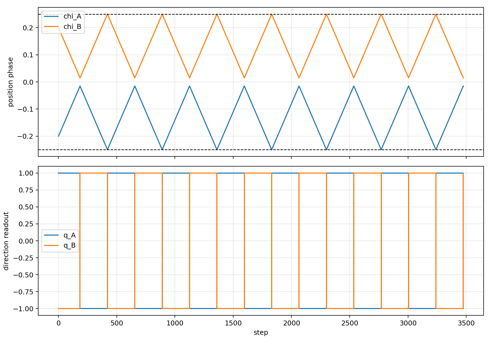 |  |

詳細:
[複数回衝突レポート](elastic_collision_multi_collision_result_v1/multi_collision_report_v1.md) /
[JSON](elastic_collision_multi_collision_result_v1/multi_collision_result_v1.json)

---

## 10. `η` 識別振動の読出し解像度

内部識別振動を `η` 方向の有限サンプリングで読む場合、識別モード差がサンプル数の倍数になるとエイリアスが起きる。

### 10.1 結果

| 項目 | 値 |
|---|---:|
| 総ケース数 | `88` |
| 有効ケース数 | `59` |
| 無効ケース数 | `29` |
| エイリアスケース数 | `29` |
| 非エイリアス失敗数 | `0` |
| 全モードペアが成立する最小 `η` サンプル数 | `64` |

無効ケースはすべて読出しエイリアスであり、衝突写像自体の破綻ではなかった。

| 有効性 | 識別純度 |
|---|---|
|  |  |

詳細:
[η 解像度レポート](elastic_collision_eta_resolution_sweep_result_v1/eta_resolution_sweep_report_v1.md) /
[JSON](elastic_collision_eta_resolution_sweep_result_v1/eta_resolution_sweep_result_v1.json)

---

## 11. 成立条件

本実験群から、v1 の完全弾性衝突写像が成立する条件は次のように整理できる。

| 条件 | 内容 |
|---|---|
| 有限セル到達 | `A,B` が空間セル・時間セルを同時に満たす |
| 更新刻み | 位置更新刻みがセル幅を飛び越えない |
| 観測機条件 | `C` が十分重く、準静的曲率半径生成器として扱える |
| 識別振動 | `m_A,m_B` が読出し解像度で分離可能 |
| 識別純度 | 漏れ率が支配モードを反転させない |
| 写像 | 衝突セル内で `q_A,q_B` が反転し、`m_A,m_B` と代表振幅は保存される |
| 閉鎖 | 各成分に補償位相 `i x_n` を持たせる二乗レジストリで残差がゼロになる |

---

## 12. 破綻条件

| 破綻条件 | 実験での現れ方 |
|---|---|
| 観測機が軽すぎる | `A_C < 20` で C の準静的条件が破綻 |
| 更新刻みが粗い | off-grid かつ高解像度セルで衝突セル未到達 |
| 時間セル不一致 | 空間的には接近しても相互作用セルに入らない |
| 観測擾乱が大きい | C 幅超過で観測モデル破綻、AB セル超過で衝突写像破綻 |
| 識別振動漏れ | 漏れ率上昇で純度条件が破綻 |
| `η` エイリアス | モード差がサンプル数の倍数になると識別不能 |
| 通過・ラベル交換 | `q` 反転または識別モード保存の条件で弾かれる |

---

## 13. 未評価・次工程

本 v1 実験では、標準理論における散乱断面積、実在粒子の運動方程式、標準量子測定の導出は扱わない。

次工程として自然なのは、個別実験の追加よりも、以下の整理である。

1. 仕様書 v1 へ、識別振動 `η` と読出し解像度条件を明示的に統合する。
2. 実験結果 v1 をもとに、成立条件・破綻条件を仕様書の判定基準へ反映する。
3. 必要なら、複数粒子または三体閉鎖へ拡張する前に、今回の二体有限セル写像を v1 確定版として固定する。

---

## 14. 参照ファイル

| 種別 | ファイル |
|---|---|
| 仕様書 | [完全弾性衝突シミュレーション仕様書 v1.md](完全弾性衝突シミュレーション仕様書%20v1.md) |
| 基本実験 | [elastic_collision_simulation_result_v1](elastic_collision_simulation_result_v1/) |
| 識別振動頑健性 | [elastic_collision_label_robustness_result_v1](elastic_collision_label_robustness_result_v1/) |
| 観測機条件 | [elastic_collision_observer_sweep_result_v1](elastic_collision_observer_sweep_result_v1/) |
| セル解像度 | [elastic_collision_cell_resolution_sweep_result_v1](elastic_collision_cell_resolution_sweep_result_v1/) |
| 対照写像 | [elastic_collision_control_maps_result_v1](elastic_collision_control_maps_result_v1/) |
| 非対称条件 | [elastic_collision_asymmetry_sweep_result_v1](elastic_collision_asymmetry_sweep_result_v1/) |
| 観測擾乱 | [elastic_collision_observation_perturbation_result_v1](elastic_collision_observation_perturbation_result_v1/) |
| 複数回衝突 | [elastic_collision_multi_collision_result_v1](elastic_collision_multi_collision_result_v1/) |
| `η` 解像度 | [elastic_collision_eta_resolution_sweep_result_v1](elastic_collision_eta_resolution_sweep_result_v1/) |

