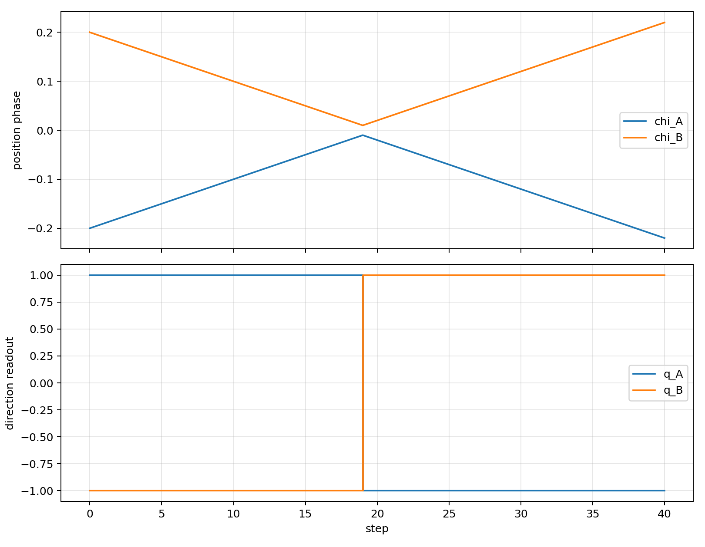
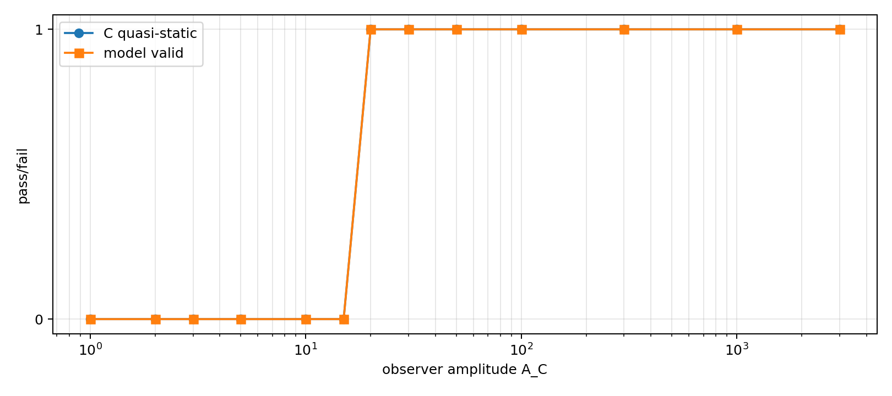
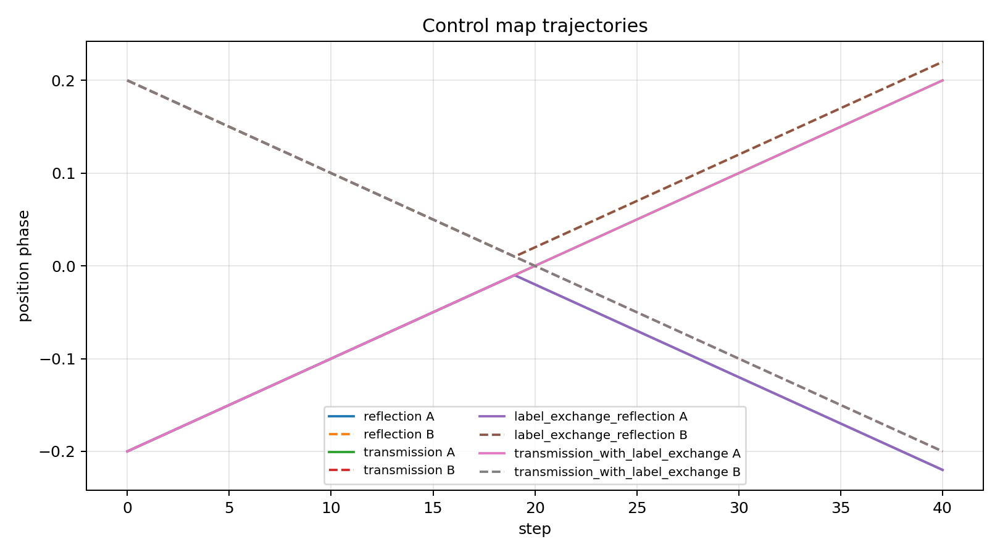
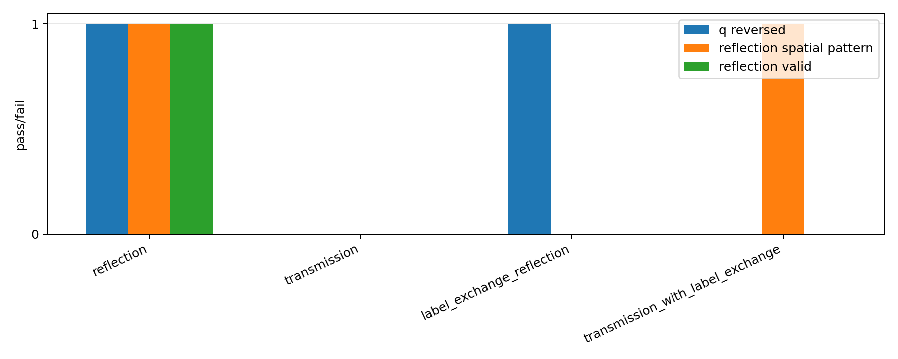
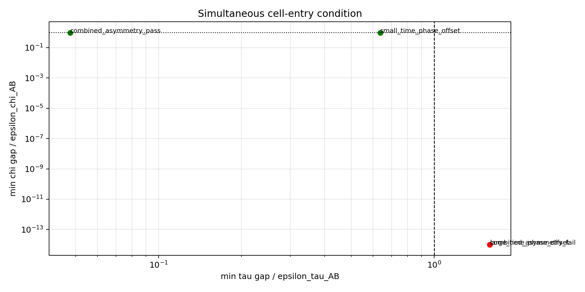
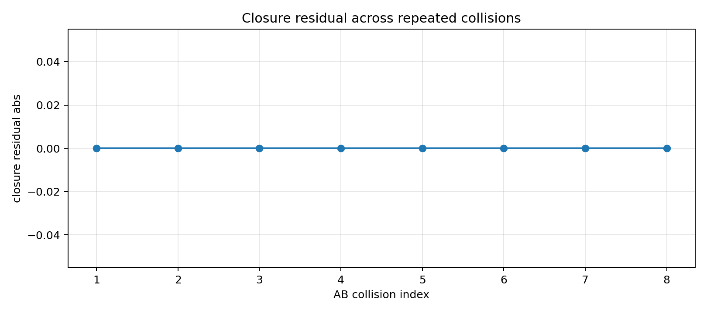
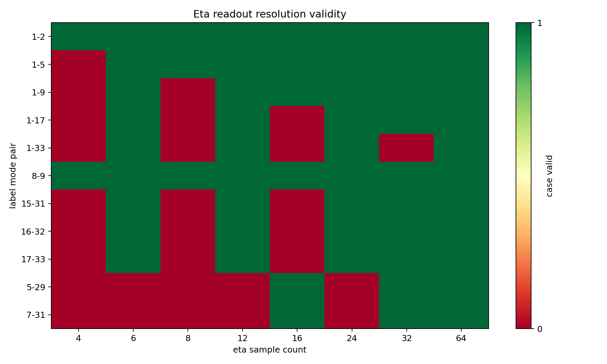
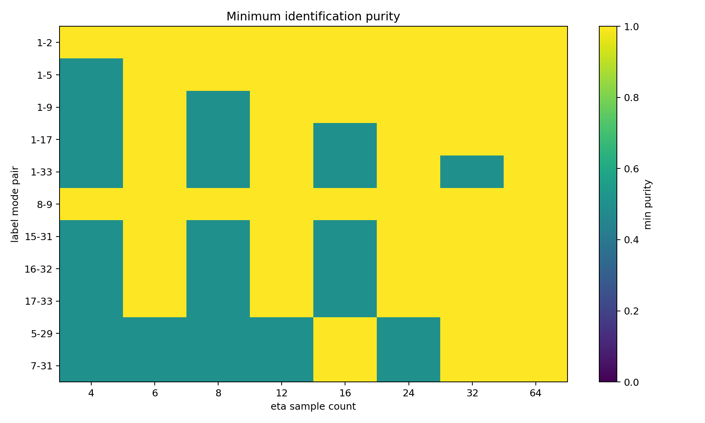

# 背景空間を仮定しない閉じた位相系におけるフェルミオン的二局所波の完全弾性反射の構成実験 v2

**副題:** 無名等振幅複合波モデルにおける有限解像度相互作用セルと内部観測  
**日付:** 2026-07-10  
**著者:** 木原 範昭  
**位置づけ:** 構成実験論文  
**Version DOI:** 未取得  
**Concept DOI:** 10.5281/zenodo.21291018  

フェルミオン様反射の計算式を変更したため、同一条件で再計算した V2 とする。

---

## 要旨

本稿では、無名性、全正符号ゼロ閉鎖、非自明存在、無名等振幅複合波、および正規化等振幅奇数倍音局在波を出発点として、背景空間を先験的に仮定しない閉じた位相系において、フェルミオン的核を持つ識別可能な二つの局所波の完全弾性反射に相当する有限解像度保存写像を構成し、数値的に検査した。

局所波 `A,B` は、空間位相、時間位相、進行方向読出し量、代表振幅、および内部識別位相 `η` 上の識別振動モードを持つ。観測機 `C` は十分大きな代表振幅容量を持つ重い局所波として扱い、`A,B` 近傍に有効曲率半径を与える準静的な読出し基準として実装した。衝突は一点イベントではなく、空間位相および時間位相の有限解像度セルへの侵入として定義した。相互作用セル内では、進行方向読出し量を反転させる一方、識別振動、代表振幅、フェルミオン的核、および補償付き二乗閉鎖を保存する写像を適用した。

最小実験、識別振動頑健性、観測機容量、セル解像度、反射/通過/ラベル交換の対照実験、非対称条件、観測擾乱、複数回衝突、および識別位相 `η` の読出し解像度を検査した。その結果、反射写像は通過写像およびラベル交換写像から区別され、8回の反復衝突においても方向反転、識別振動、代表振幅、閉鎖残差が保存された。また、観測機不足、セル飛越し、時間セル不一致、識別振動漏れ、`η` 読出しエイリアスが破綻条件として分離された。

本結果は、標準的なフェルミ粒子散乱、S行列散乱理論、または標準量子測定過程の導出を主張するものではない。一方で、閉じた位相関係、局在波、内部識別振動、および内部観測だけから、識別可能な二局所波の完全弾性反射に相当する反復可能な保存写像を構成できることを示す数値的構成実験である。

**キーワード:** 無名等振幅複合波、全正符号ゼロ閉鎖、有限解像度セル、フェルミオン的局所波、識別振動、完全弾性反射、内部観測

---

## 1. 序論

標準的な粒子散乱では、背景空間、漸近状態、相互作用ポテンシャル、散乱振幅などが理論構成の中心に置かれる。本稿では、この標準構成を採用しない。かわりに、閉じた位相系の内部において、局在波、識別振動、観測機、有限解像度セルを構成し、二つの局所波が互いに完全弾性反射したと読める保存写像が作れるかを調べる。

本稿の問いは次である。

> 背景空間を先験的に置かず、閉じた位相系の内部だけで、識別可能な二つのフェルミオン的局所波の完全弾性反射と、その観測前後での識別を構成できるか。

この問いに対して、本稿では次の構成を与える。

1. 無名性と全正符号ゼロ閉鎖を第一原理層に置く。
2. 無名等振幅複合波を局所波の基本構造とする。
3. 空間位相・時間位相の局在を、外部窓関数ではなく正規化等振幅奇数倍音によって構成する。
4. 二局所波 `A,B` に、内部識別位相 `η` 上の異なる識別振動を持たせる。
5. 重い観測機 `C` を、背景空間ではなく準静的な曲率半径生成器および読出し基準として扱う。
6. 衝突を一点イベントではなく、有限解像度セル前後の可逆写像として定義する。
7. 反射写像を、通過写像およびラベル交換写像から区別する。

外部文献は、本稿の導出根拠ではなく、標準的文脈との違いを明確にするための座標軸として最小限に用いる。フェルミオン・排他性の標準的背景については Pauli [Pauli1925] および Dirac [Dirac1926]、標準散乱理論の代表的定式化については Lippmann and Schwinger [LippmannSchwinger1950]、相関的・関係的な観測理解の近傍文脈として Rovelli [Rovelli1996]、有限サンプリングとエイリアスの文脈として Shannon [Shannon1949] を参照する。

---

## 2. 本稿で主張しないこと

本稿は、以下を主張しない。

| 主張しないこと | 理由 |
|---|---|
| 標準的なフェルミ粒子散乱の導出 | 本稿はポテンシャル散乱、S行列、漸近状態を用いない |
| 標準量子力学の測定過程の導出 | 観測は本公理系内の相関読出しとして定義する |
| 実在粒子の物理衝突断面積の計算 | 断面積、実験単位、標準ハミルトニアンを導入しない |
| 標準波動方程式における微分エネルギー保存 | 保存量は公理1に基づく補償付き二乗閉鎖である |
| 衝突瞬間という一点イベントの直接観測 | 衝突は有限解像度セル前後の写像として扱う |

本稿の主張は、少数公理から閉じた位相系内部の保存写像を構成できるか、という構成可能性に限定される。

---

## 3. 基本公理系

本稿の実験は、無名等振幅複合波モデル 基本公理系 v3 に基づく。

### 3.1 無名性

基本成分に、個別名、特権軸、特権符号、特権型を与えない。添字は便宜上のラベルであり、成分の固有名ではない。

### 3.2 全正符号ゼロ閉鎖

閉鎖条件を次で与える。

```math
\sum_{n=1}^{N}x_n^2=0
```

これは共役ノルム

```math
\sum_n |x_n|^2
```

ではない。閉鎖に用いるのは `x_n \bar{x}_n` ではなく、`x_n^2` 型の二乗レジストリである。

### 3.3 非自明存在

全成分ゼロ解だけを閉鎖系としない。

```math
\exists n,\quad x_n\neq 0
```

### 3.4 補償位相による閉鎖

実験実装では、各波係数 `x_n` に対して補償位相 `i x_n` を持たせる。

```math
x_n^2+(i x_n)^2=0
```

これにより、各成分対の二乗和はゼロとなる。

---

## 4. 局在波の構成

### 4.1 正規化等振幅奇数倍音局在波

最高奇数倍音次数を `N_h=2K-1` とする。正規化等振幅奇数倍音局在波を次で定義する。

```math
S_{N_h}(u)=\frac{1}{K}\sum_{m=0}^{K-1}\cos((2m+1)u)
```

これは次の閉形式でも書ける。

```math
S_{N_h}(u)=\frac{\sin((N_h+1)u)}{(N_h+1)\sin u}
```

中央位相 `u=0` では、

```math
S_{N_h}(0)=1
```

であるため、代表振幅 `A` を持つ波形

```math
\Psi_{N_h}(u)=A S_{N_h}(u)
```

は、

```math
\Psi_{N_h}(0)=A
```

を満たす。したがって、最高奇数倍音次数を増やしても、同相整列時の代表振幅は発散しない。

### 4.2 空間・時間局在波

空間位相を `χ`、時間位相を `τ` とする。局所波 `P` は次で与える。

```math
P(\chi,\tau)
=
A_P
S_{N_{h,\chi}^{P}}(\chi-\chi_P)
S_{N_{h,\tau}^{P}}(\tau-\tau_P)
e^{i\phi_P}
```

局在は外部窓関数ではなく、奇数倍音構造そのものによって作る。

---

## 5. 識別振動とフェルミオン的核

### 5.1 フェルミオン的核

二成分逆相構造をフェルミオン的核として読む。

```math
N=2,\qquad \Delta_{12}=\pi
```

```math
e^{i\theta_1}+e^{i\theta_2}=0
```

本稿では、この構造を標準的な反対称多粒子波動関数そのものとは同一視しない。フェルミオン的とは、内部に逆相核を持つ局所波の作業的分類である。

### 5.2 内部識別位相 `η`

局所波 `A,B` を単なる変数名で区別しないため、内部識別位相 `η` を導入する。

識別振動を次で表す。

```math
D_{m_P}(\eta)=e^{i m_P\eta}
```

`A` と `B` は異なる識別振動モードを持つ。

```math
m_A\neq m_B
```

最小実装では、

```math
m_A=1,\qquad m_B=2
```

とした。

### 5.3 識別振動を含む局所波

識別位相を含む局所波は次である。

```math
P(\chi,\tau,\eta)
=
A_P
S_{N_{h,\chi}^{P}}(\chi-\chi_P)
S_{N_{h,\tau}^{P}}(\tau-\tau_P)
D_{m_P}(\eta)
e^{i\phi_P}
```

この式により、識別子は外部から貼り付けた名前ではなく、波形に内蔵された内部振動モードとして扱われる。

### 5.4 識別振動の読出し

読出しモード `m` に対する参照波を次で与える。

```math
D_{\mathrm{read},m}(\eta)=e^{-im\eta}
```

識別読出し相関は次である。

```math
O_{P,m}^{(j)}
=
\frac{1}{(2\pi)^3}
\int_{-\pi}^{\pi}
\int_{-\pi}^{\pi}
\int_{-\pi}^{\pi}
P(\chi,\tau,\eta)
C_{\mathrm{read},P}^{(j)}(\chi,\tau)
D_{\mathrm{read},m}(\eta)
d\chi d\tau d\eta
```

識別モードは、`|O_{P,m}^{(j)}|` が最大となる `m` として読まれる。

---

## 6. 観測機 C と相対位相読出し

### 6.1 重い観測機

全体系は `A,B,C` から成る閉鎖系として扱う。

```math
\sum_A x_n^2+\sum_B x_n^2+\sum_C x_n^2=0
```

観測機 `C` は十分に重く、曲率半径生成器として読む。

```math
R_C^2=-\sum_C x_n^2
```

したがって、`A,B` 近傍では、

```math
\sum_A x_n^2+\sum_B x_n^2=R_C^2
```

と読む。

### 6.2 相対位相読出し用参照波

観測機本体 `C^{(j)}` と相対位相読出し用の逆位相参照波 `C_{\rm read}^{(j)}` を区別する。

```math
C_{\rm read}^{(j)}(\chi,\tau)
=
A_C
S_{N_{h,\chi}^{C}}(\chi-\chi_C^{(j)})
S_{N_{h,\tau}^{C}}(\tau-\tau_C^{(j)})
e^{-i\phi_C}
```

このとき、

```math
P(\chi,\tau)C_{\rm read}^{(j)}(\chi,\tau)
\propto e^{i(\phi_P-\phi_C)}
```

となり、外部基準との相対位相を読む。

---

## 7. 有限解像度相互作用セルと反射写像

### 7.1 有限解像度セル

衝突は一点イベントではなく、有限解像度セルへの侵入として定義する。

```math
|\chi_A-\chi_B|<\epsilon_\chi^{AB}
```

```math
|\tau_A-\tau_B|<\epsilon_\tau^{AB}
```

セル幅は、奇数倍音局在波の中央ピークから最初の零点までの幅で固定する。

```math
\epsilon_\chi^{AB}
=
\frac{\pi}
{\min(N_{h,\chi}^{A},N_{h,\chi}^{B})+1}
```

```math
\epsilon_\tau^{AB}
=
\frac{\pi}
{\min(N_{h,\tau}^{A},N_{h,\tau}^{B})+1}
```

### 7.2 計算順序パラメータ

数値実装では、計算順序パラメータ `s` を導入する。`s` は計算手続きの順序であり、読出し時間位相 `τ` そのものではない。

```math
s\neq \tau
```

位置位相更新は次である。

```math
\chi_A(s+\Delta s)=\chi_A(s)+q_A(s)v_\chi\Delta s
```

```math
\chi_B(s+\Delta s)=\chi_B(s)+q_B(s)v_\chi\Delta s
```

時間位相更新は次である。

```math
\tau_A(s+\Delta s)=\tau_A(s)+\omega_A\Delta s
```

```math
\tau_B(s+\Delta s)=\tau_B(s)+\omega_B\Delta s
```

### 7.3 完全弾性反射写像

有限解像度セル内で、次の写像を適用する。

```math
\mathcal C:
(A',B',C')\mapsto(A'',B'',C'')
```

フェルミオン様反射の散乱係数を次で与える。

```math
t=e^{i\Delta_F/2}\cos\frac{\Delta_F}{2}
```

```math
r=-i e^{i\Delta_F/2}\sin\frac{\Delta_F}{2}
```

完全反射では、

```math
\Delta_F=\pi,\qquad |r|^2=1,\qquad |t|^2=0
```

である。出力チャネルを次で与える。

```math
A_-''=rA_{\mathrm{ref}}'+tB_{\mathrm{trans}}'
```

```math
B_+''=tA_{\mathrm{trans}}'+rB_{\mathrm{ref}}'
```

一方で、識別振動、代表振幅、フェルミオン的核は保存する。

```math
m_A''=m_A',\qquad m_B''=m_B'
```

```math
A_A''=A_A',\qquad A_B''=A_B'
```

写像は二回適用で元に戻る。

```math
\mathcal C^2=\mathrm{id}
```

---

## 8. 数値実験の構成

### 8.1 基本パラメータ

| 量 | 値 | 意味 |
|---|---:|---|
| `A_A` | `1` | 局所波 A の代表振幅 |
| `A_B` | `1` | 局所波 B の代表振幅 |
| `A_C` | `1000` | 観測機 C の代表振幅 |
| `N_{h,chi}^A` | `99` | A の空間方向最高奇数倍音次数 |
| `N_{h,chi}^B` | `99` | B の空間方向最高奇数倍音次数 |
| `N_{h,chi}^C` | `999` | C の空間方向最高奇数倍音次数 |
| `N_{h,tau}^A` | `99` | A の時間方向最高奇数倍音次数 |
| `N_{h,tau}^B` | `99` | B の時間方向最高奇数倍音次数 |
| `N_{h,tau}^C` | `999` | C の時間方向最高奇数倍音次数 |
| `chi_A^{(0)}` | `-0.2` | A の初期位置位相 |
| `chi_B^{(0)}` | `+0.2` | B の初期位置位相 |
| `tau_A^{(0)},tau_B^{(0)}` | `-0.2,-0.2` | A,B の初期時間位相 |
| `q_A^{(0)},q_B^{(0)}` | `+1,-1` | 初期進行方向読出し量 |
| `m_A,m_B` | `1,2` | 内部識別振動モード |
| `delta_s` | `0.01` | 計算順序刻み |

### 8.2 実験群

| No. | 実験 | 目的 |
|---:|---|---|
| 1 | 基本完全弾性衝突 | 最小条件で写像が成立するか |
| 2 | 識別振動頑健性 | 識別モード混合への耐性 |
| 3 | 観測機 C 条件 | C の重さ条件 |
| 4 | セル解像度 | 刻み幅と有限セル幅の関係 |
| 5 | 反射/通過 対照実験 | 通過・ラベル交換との区別 |
| 6 | 非対称条件 | 振幅差・倍音差・時間差への耐性 |
| 7 | 観測擾乱 | 観測による位相擾乱の影響 |
| 8 | 複数回衝突 | 反復保存性 |
| 9 | `η` 読出し解像度 | 識別振動のエイリアス条件 |

---

## 9. 結果

### 9.1 基本完全弾性衝突

最小実験では、`A,B` は衝突セルに到達し、進行方向読出し量が反転し、識別振動と代表振幅が保存された。

| 項目 | 結果 |
|---|---|
| 衝突セル到達ステップ | `19` |
| 最終ステップ | `40` |
| `q_A,q_B` 反転 | `true,true` |
| `m_A,m_B` 保存 | `true,true` |
| ラベル交換 | `false` |
| クロストーク | `false` |
| 補償付き二乗閉鎖残差 | `0.0` |
| 全体判定 | `true` |

**図1. 基本衝突における軌道と進行方向読出し量**



**図2. 識別振動モードの読出し**


### 9.2 識別振動頑健性

識別振動に漏れを入れた場合、漏れ率が小さい範囲では識別モードは保存された。漏れ率が上昇すると、純度条件が破綻した。

| 項目 | 値 |
|---|---:|
| 総ケース数 | `36` |
| 有効ケース数 | `20` |
| 無効ケース数 | `16` |
| 最初の破綻漏れ率 | `0.35` |

**図3. 識別振動純度**


**図4. 識別振動保存判定**


### 9.3 観測機 C の重さ条件

観測機 `C` の代表振幅容量が小さい場合、準静的条件が破綻した。

| 項目 | 値 |
|---|---:|
| 総ケース数 | `13` |
| 有効ケース数 | `7` |
| 無効ケース数 | `6` |
| 最初に成立する `A_C` | `20` |

**図5. 観測機条件量**


**図6. 観測機容量による有効性**



### 9.4 セル解像度と時間刻み

更新刻みが有限セル幅より粗い場合、衝突セルを飛び越えることがある。

| 項目 | 値 |
|---|---:|
| 総ケース数 | `60` |
| 有効ケース数 | `57` |
| 無効ケース数 | `3` |
| off-grid 有効ケース数 | `27` |
| off-grid 無効ケース数 | `3` |

**図7. サンプリング条件**


**図8. off-grid 条件での有効性**


### 9.5 反射・通過・ラベル交換の対照実験

反射写像、通過写像、ラベル交換写像を比較した。

| 写像 | 成立判定 |
|---|---|
| reflection | 成立 |
| transmission | 不成立 |
| label_exchange_reflection | 不成立 |
| transmission_with_label_exchange | 不成立 |

反射写像だけが、進行方向反転と識別振動保存を同時に満たした。

**図9. 対照写像の軌道**



**図10. 対照写像の判定**



### 9.6 非対称条件

振幅差や倍音次数差だけでは写像は破綻しなかった。主な破綻要因は、空間セルと時間セルの同時成立が崩れることであった。

| 項目 | 値 |
|---|---:|
| 総ケース数 | `10` |
| 有効ケース数 | `7` |
| 無効ケース数 | `3` |

**図11. 非対称条件におけるセルギャップ**



**図12. 非対称条件の判定**


### 9.7 観測擾乱

観測擾乱が `C` の局在幅を超えると観測モデルとしては破綻する。ただし AB セル条件を満たす限り、衝突写像自体は成立しうる。

| 項目 | 値 |
|---|---:|
| 総ケース数 | `8` |
| 観測モデル有効ケース数 | `5` |
| 衝突写像有効ケース数 | `7` |
| 無効ケース数 | `3` |

**図13. 観測擾乱閾値**


**図14. 観測擾乱判定**


### 9.8 複数回衝突

閉じた区間内で壁反射を許し、AB 衝突を複数回繰り返した。

| 項目 | 値 |
|---|---:|
| 目標 AB 衝突数 | `8` |
| 実 AB 衝突数 | `8` |
| 壁反射数 | `14` |
| 識別モード全保存 | `true` |
| 各衝突での `q` 反転 | `true` |
| 代表振幅保存 | `true` |
| 閉鎖保存 | `true` |
| 全体判定 | `true` |

**図15. 複数回衝突の軌道**


**図16. 複数回衝突における閉鎖残差**



### 9.9 `η` 識別振動の読出し解像度

内部識別振動を有限サンプルで読む場合、モード差がサンプル数の倍数になるとエイリアスが起きる。

| 項目 | 値 |
|---|---:|
| 総ケース数 | `88` |
| 有効ケース数 | `59` |
| 無効ケース数 | `29` |
| エイリアスケース数 | `29` |
| 非エイリアス失敗数 | `0` |
| 全モードペアが成立する最小 `η` サンプル数 | `64` |

無効ケースはすべて `η` 読出しエイリアスであった。これは衝突写像自体の破綻ではなく、識別振動読出しの解像度不足である。

**図17. `η` 読出し解像度の有効性**



**図18. `η` 識別純度**



---

## 10. 考察

### 10.1 反射と通過の区別

位置軌道だけを見ると、反射と通過はしばしば区別しにくい。本稿では、識別振動 `m_A,m_B` と進行方向読出し量 `q_A,q_B` を同時に追跡した。

その結果、通過写像やラベル交換写像は、位置だけでは反射に似た読出しを作れても、進行方向反転または識別振動保存の条件で排除された。

したがって、本稿の反射判定は単なる軌道の見かけではなく、

```text
識別振動を持った局所波そのものが反転方向へ押し出される
```

という条件を含む。

### 10.2 背景空間なしの局所相互作用

本稿では、背景空間を先に置かない。位置は外部空間座標ではなく、観測機との相対位相読出しとして扱われる。

重い観測機 `C` は、第三体として完全に動的に解かれるのではなく、AB 近傍に有効曲率半径を与える準静的基準として吸収される。これにより、閉鎖系内部から局所線形近似を作る。

本稿で用いる `χ` および `τ` は、局所波が配置される先験的な物理時空座標ではない。これらは閉じた位相系における空間位相および時間位相の読出し変数であり、観測機との相対位相から位置的・時間的順序を表現するための計算領域である。したがって、本稿が背景空間を仮定しないと述べるとき、位相関係を記述するパラメータ領域まで否定するのではなく、粒子や観測機とは独立して存在する外在的な時空舞台を出発点に置かないことを意味する。

### 10.3 保存量の性質

本稿で保存される量は、標準波動方程式の微分エネルギーではない。保存の基礎は、全正符号ゼロ閉鎖に基づく補償付き二乗レジストリである。

```math
\sum_n x_n^2=0
```

各成分に `x_n` と `i x_n` を持たせることで、

```math
x_n^2+(i x_n)^2=0
```

が成り立つ。複数回衝突実験では、この閉鎖残差が反復衝突後もゼロに保たれた。

したがって、閉鎖残差ゼロは、数値シミュレーションによって閉鎖則が偶発的に発見されたことを意味しない。これは、定義された補償付き二乗閉鎖構造が、衝突写像および反復更新の下でも失われずに保存されたことの確認である。

### 10.4 破綻条件の意味

本モデルは、すべての条件で成功するわけではない。観測機が軽すぎる場合、セルを飛び越える場合、空間セルと時間セルが同時に成立しない場合、識別振動が混合しすぎる場合、または `η` 読出しでエイリアスが起きる場合、写像または観測は破綻する。

これは、本構成が任意に成功する恣意的模型ではなく、明確な成立条件と失敗条件を持つことを意味する。

### 10.5 反転写像の位置づけ

本稿で方向反転写像そのものは、有限解像度相互作用セルにおける構成規則として与えられており、第一原理のみからその形が一意に導出されたものではない。本実験が示すのは、この反転規則が、識別振動、代表振幅、フェルミオン的核、内部観測、および補償付き二乗閉鎖と両立し、通過写像やラベル交換写像から区別可能な反復保存写像を構成することである。

---

## 11. 成立条件と破綻条件

### 11.1 成立条件

| 条件 | 内容 |
|---|---|
| 有限セル到達 | `A,B` が空間セル・時間セルを同時に満たす |
| 更新刻み | `delta_s` がセル幅を飛び越えない |
| 観測機条件 | `C` が十分重く、準静的曲率半径生成器として扱える |
| 識別振動 | `m_A,m_B` が読出し解像度で分離可能 |
| 識別純度 | 漏れ率が支配モードを反転させない |
| 反射写像 | `q_A,q_B` が反転し、`m_A,m_B` と代表振幅が保存される |
| 閉鎖 | 補償付き二乗レジストリで残差がゼロになる |

### 11.2 破綻条件

| 破綻条件 | 実験での現れ方 |
|---|---|
| 観測機が軽すぎる | `A_C < 20` で準静的条件が破綻 |
| 更新刻みが粗い | off-grid かつ高解像度セルで衝突セル未到達 |
| 時間セル不一致 | 空間的には接近しても相互作用セルに入らない |
| 観測擾乱が大きい | C 幅超過で観測モデル破綻、AB セル超過で写像破綻 |
| 識別振動漏れ | 漏れ率上昇で純度条件が破綻 |
| `η` エイリアス | モード差がサンプル数の倍数になると識別不能 |
| 通過・ラベル交換 | `q` 反転または識別モード保存条件で排除 |

---

## 12. 結論

本稿では、無名性、全正符号ゼロ閉鎖、非自明存在、無名等振幅複合波、および正規化等振幅奇数倍音局在という少数の作業公理・定義から出発し、背景空間を先験的に仮定しない閉じた位相系において、識別可能な二つのフェルミオン的局所波の完全弾性反射に相当する有限解像度保存写像を構成した。

二局所波は、内部識別位相上の異なる振動モードを持ち、有限解像度相互作用セルへの侵入時に進行方向読出し量を反転させる一方、識別振動、代表振幅、およびフェルミオン的核を保存した。重い観測機による空間・時間・識別位相相関読出しを用いることで、反射写像を通過写像およびラベル交換写像から区別できた。

また、観測機の代表振幅容量、更新刻み、時間セル整合性、識別振動の純度、識別位相方向のサンプリング解像度に対して、成立条件および破綻条件が得られた。複数回衝突においても、方向反転、識別振動、代表振幅、および補償付き二乗閉鎖は保存された。

本結果は、標準的なフェルミ粒子散乱または量子測定過程の導出を意味しない。一方で、背景空間を外部舞台として置かず、閉じた位相関係、局在波、内部識別振動、および内部観測から、識別可能な二局所波の完全弾性反射に相当する反復可能な保存写像を構成できることを示す数値的構成実験である。

---

## 謝辞

本稿は、2026-07-10 に作成された無名等振幅複合波モデル 基本公理系 v3、完全弾性衝突シミュレーション仕様書 v1、および完全弾性衝突シミュレーション実験結果 v1 に基づく。

---

## 参考文献

### 内部文書

[KiharaAxioms2026] 木原範昭, [無名等振幅複合波モデル 基本公理系 v3](基本公理系.md), 2026-07-10.

[KiharaSpec2026] 木原範昭, [完全弾性衝突シミュレーション仕様書 v1](完全弾性衝突シミュレーション仕様書%20v1.md), 2026-07-10.

[KiharaResults2026] 木原範昭, [完全弾性衝突シミュレーション実験結果 v1](完全弾性衝突シミュレーション実験結果%20v1.md), 2026-07-10.

### 外部文献

[Pauli1925] W. Pauli, "Über den Zusammenhang des Abschlusses der Elektronengruppen im Atom mit der Komplexstruktur der Spektren," *Zeitschrift für Physik*, 31, 765-783, 1925.

[Dirac1926] P. A. M. Dirac, "On the Theory of Quantum Mechanics," *Proceedings of the Royal Society of London. Series A*, 112, 661-677, 1926.

[LippmannSchwinger1950] B. A. Lippmann and J. Schwinger, "Variational Principles for Scattering Processes. I," *Physical Review*, 79, 469-480, 1950.

[Rovelli1996] C. Rovelli, "Relational Quantum Mechanics," *International Journal of Theoretical Physics*, 35, 1637-1678, 1996. arXiv:quant-ph/9609002.

[Shannon1949] C. E. Shannon, "Communication in the Presence of Noise," *Proceedings of the IRE*, 37(1), 10-21, 1949.

[Noether1918] E. Noether, "Invariante Variationsprobleme," *Nachrichten von der Gesellschaft der Wissenschaften zu Göttingen, Mathematisch-Physikalische Klasse*, 235-257, 1918. English translation: "Invariant Variation Problems."

---

## 付録A. 実験結果ファイル一覧

| 実験 | レポート | 結果JSON |
|---|---|---|
| 基本完全弾性衝突 | [report](elastic_collision_simulation_result_v2/elastic_collision_report_v2.md) | [json](elastic_collision_simulation_result_v2/elastic_collision_result_v2.json) |
| 識別振動頑健性 | [report](elastic_collision_label_robustness_result_v2/label_robustness_report_v2.md) | [json](elastic_collision_label_robustness_result_v2/label_robustness_result_v2.json) |
| 観測機 C 条件 | [report](elastic_collision_observer_sweep_result_v2/observer_sweep_report_v2.md) | [json](elastic_collision_observer_sweep_result_v2/observer_sweep_result_v2.json) |
| セル解像度 | [report](elastic_collision_cell_resolution_sweep_result_v2/cell_resolution_sweep_report_v2.md) | [json](elastic_collision_cell_resolution_sweep_result_v2/cell_resolution_sweep_result_v2.json) |
| 対照写像 | [report](elastic_collision_control_maps_result_v2/control_maps_report_v2.md) | [json](elastic_collision_control_maps_result_v2/control_maps_result_v2.json) |
| 非対称条件 | [report](elastic_collision_asymmetry_sweep_result_v2/asymmetry_sweep_report_v2.md) | [json](elastic_collision_asymmetry_sweep_result_v2/asymmetry_sweep_result_v2.json) |
| 観測擾乱 | [report](elastic_collision_observation_perturbation_result_v2/observation_perturbation_report_v2.md) | [json](elastic_collision_observation_perturbation_result_v2/observation_perturbation_result_v2.json) |
| 複数回衝突 | [report](elastic_collision_multi_collision_result_v2/multi_collision_report_v2.md) | [json](elastic_collision_multi_collision_result_v2/multi_collision_result_v2.json) |
| `η` 解像度 | [report](elastic_collision_eta_resolution_sweep_result_v2/eta_resolution_sweep_report_v2.md) | [json](elastic_collision_eta_resolution_sweep_result_v2/eta_resolution_sweep_result_v2.json) |
