# ABC閉鎖位相系における独立計量Cと関係性補償分解距離指数予備実験総括 v1

**日付:** 2026-07-12  
**著者:** 木原 範昭  
**位置づけ:** 波の情報読出しシリーズ・ABC距離指数予備実験群の総括  

---

## 0. 結論

本総括は、AB二体系で距離指数を独立計量できなかったことを受け、第三波 `C` を導入したABC閉鎖位相系の予備実験群をまとめる。

対象は次である。

1. 独立計量CによるAB関係補償の距離指数読出し予備実験
2. 独立計量Cの配置対照距離指数予備実験
3. 関係性補償分解距離指数予備実験

結論は次である。

```text
AB二体問題で残された距離指数判定のために、
測定機Cを同じ閉鎖位相系の中に置いた。

このABC三体系でも、加速度様に見えるAB関係補償は読める。

しかし、その読出しが位置位相差に対して
逆比例または逆二乗比例で変化することは観測できなかった。
```

ゲージ有効ケースでは、主に

```text
alpha ≈ -1
```

が回収された。

本実験群では、

```text
I_AB(L) ∝ L^{-alpha}
```

として分類しているため、`alpha≈-1` は

```text
I_AB(L) ∝ L
```

すなわち比例型を意味する。

これは、本質的にこの実験が、局在した粒子を模倣した二つの局在波による一次元的な調和振動モデルであるためだと解釈する。

このモデルでは、相対距離の変動による影響を受けない、または受けたとしても観測できない。

特に、Cは独立計量ゲージとして導入されたが、C自身も閉鎖位相系の一部であるため、絶対外部ゲージにはならない。

したがって、Cを入れても、現在のモデルの範囲では比例型が保たれた。

これは逆二乗の一般否定ではない。

否定されたのは、より狭く、

```text
現在の一次元的AB調和モデルと C 計量ゲージだけで、
逆比例型または逆二乗型が native に現れる。
```

という主張である。

当初、三次元または四次元へ位置位相自由度を増やす実験も検討した。

しかし、同じ局在波二体調和モデルを用いる限り、任意の高次元配置も測地線断面または二次元断面へ投影すると、本実験と同じ構造に戻る。

したがって、この段階では、三次元・四次元拡張を実施しても距離指数読出しが変わる効果は見込みにくいと判断した。

---

## 1. 実験一覧

| No. | 実験 | 目的 | 主結果 |
|---:|---|---|---|
| 1 | Cゲージ有効窓検査 | `C` がAB距離指数を読む独立計量になれるか | 有効窓あり |
| 2 | C配置対照 | 対称・非対称・位相反転で指数が変わるか | 比例型が保たれた |
| 3 | 関係性補償分解 | `f_AB`, `f_AC`, `f_BC`, `f_ABC` を分ける | 分離規則を支持 |

---

## 2. 独立計量Cによる距離指数読出し

### 2.1 実験の意味

AB二体だけでは、

```text
相対距離が変化した
```

ことは読めても、その変化が比例型、逆比例型、逆二乗型のどれであるかを測る独立ゲージがなかった。

そこで第三波 `C` を置き、ABの位置変化量と時間位相変化量を読む計量ゲージとして機能するかを検査した。

ただし、次は実装していない。

```text
1/L_AB
1/L_AB^2
1/A_chi_tau
F = G m_A m_B / L_AB^2
```

したがって、逆比例型または逆二乗型が出る場合は、実装で作ったものではなく、Cゲージ読出しの結果でなければならない。

### 2.2 主結果

| 量 | 値 |
|---|---:|
| `config_count` | `160` |
| `gauge_valid_count` | `41` |
| `resolution_valid_count` | `60` |
| `clock_valid_count` | `100` |
| `disturbance_valid_count` | `101` |
| `inverse_like_alpha1_count` | `0` |
| `inverse_square_like_alpha2_count` | `0` |
| `proportional_like_alpha_minus1_count` | `41` |
| `alpha_min` | `-1.0000000000000002` |
| `alpha_max` | `-0.9569628567496087` |

関係性時間ごとの分類は次であった。

| 時間候補 | 分類 |
|---|---|
| `tau_ABC` | `proportional_like_alpha_minus1 = 41` |
| `tau_AB` | `other = 41` |
| `tau_AC` | `proportional_like_alpha_minus1 = 41` |
| `tau_BC` | `proportional_like_alpha_minus1 = 41` |

`tau_AB` は `tau_ABC` から最大で約 `0.659` ずれた。

したがって、距離指数を読むには、

```text
何を時間として読むか
```

を明示する必要がある。

### 2.3 Cゲージ有効窓

本実験では、`R_C` を C の計量セル密度にも対応させた。

すなわち、

```text
R_C が小さい
= C の振動数が低い
= C の波長が長い
= C のセル間隔が広い
```

として扱った。

このため、`R_C` が小さすぎると、C はABの位置変化量を複数セルで読めない。

一方、`R_C` が大きくなると分解能は上がるが、C由来の関係性 `f_AC`, `f_BC`, `f_ABC` がAB主読出しを汚染する。

したがって、Cには

```text
粗すぎず、強すぎない
```

有効窓がある。

### 2.4 図

| Cゲージ適格性 | alpha 候補 |
|---|---|
| 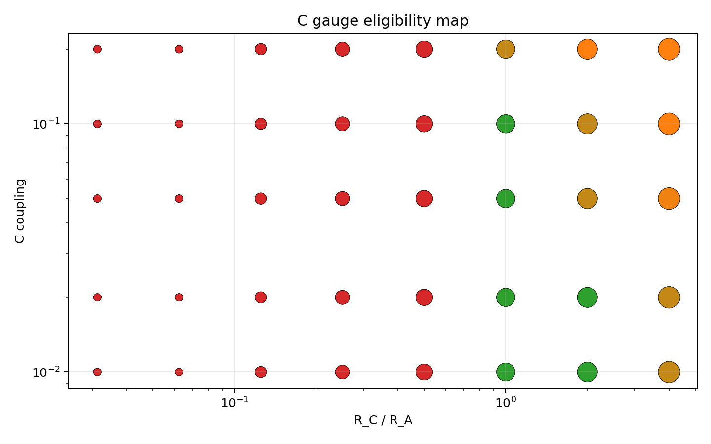 | 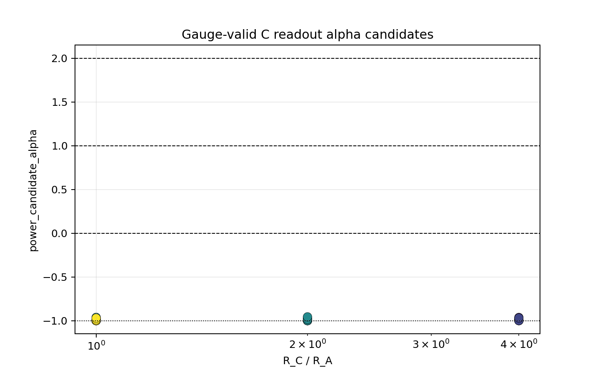 |

| 参照曲線 | フィルタ診断 |
|---|---|
| 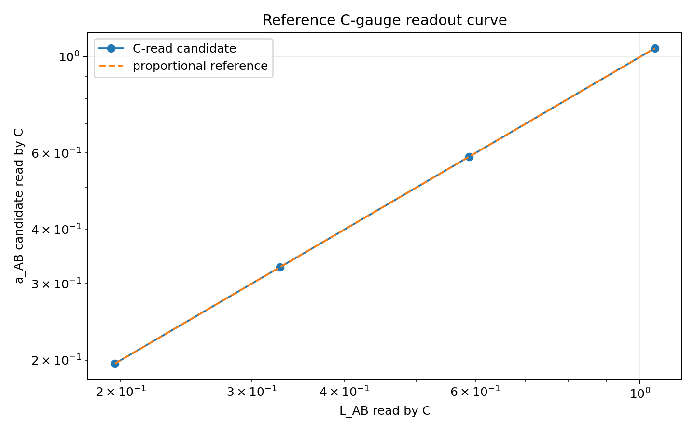 | 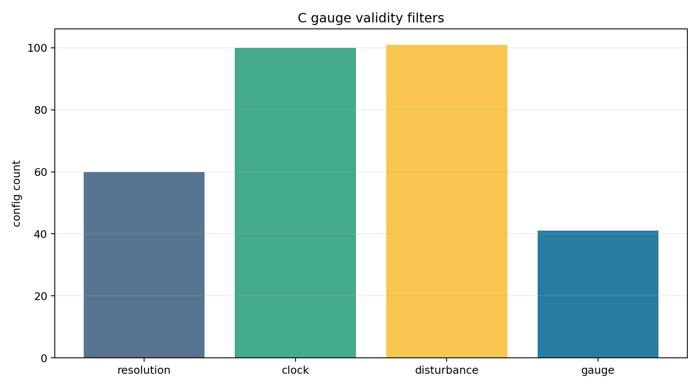 |

---

## 3. 独立計量Cの配置対照

### 3.1 実験の意味

第三波 `C` は外部観測器ではなく、閉鎖位相系の一部である。

したがって、Cを置くと同時に、

```text
f_AC
f_BC
f_ABC
```

が生成される。

そこでC配置を変え、

```text
距離指数が変わるのか
C由来の汚染としてゲージ有効窓が狭くなるだけなのか
```

を検査した。

### 3.2 C配置モード

比較した配置は次である。

```text
symmetric
symmetric_pi_flip
a_side_small
b_side_small
a_side_large
b_side_large
a_side_large_pi_flip
b_side_large_pi_flip
```

### 3.3 主結果

| 量 | 値 |
|---|---:|
| `config_count` | `160` |
| `gauge_valid_count` | `70` |
| `gauge_valid_position_pair_count` | `23` |
| `max_pair_abs_alpha_difference` | `0.11776992863447344` |
| `tau_ABC` の主分類 | `proportional_like_alpha_minus1 = 70` |

C配置ごとのゲージ有効数は次であった。

| C配置 | 有効数 |
|---|---:|
| `symmetric` | `12` |
| `symmetric_pi_flip` | `12` |
| `a_side_small` | `11` |
| `b_side_small` | `11` |
| `a_side_large` | `6` |
| `b_side_large` | `6` |
| `a_side_large_pi_flip` | `6` |
| `b_side_large_pi_flip` | `6` |

大きな非対称C配置では、有効数が減った。

これは、新しい安定な距離指数が出たというより、

```text
f_AC, f_BC の偏りが C ゲージの有効条件を狭めた
```

と読む方が安全である。

### 3.4 図

| C配置ごとの有効数 | C配置ごとの alpha |
|---|---|
| 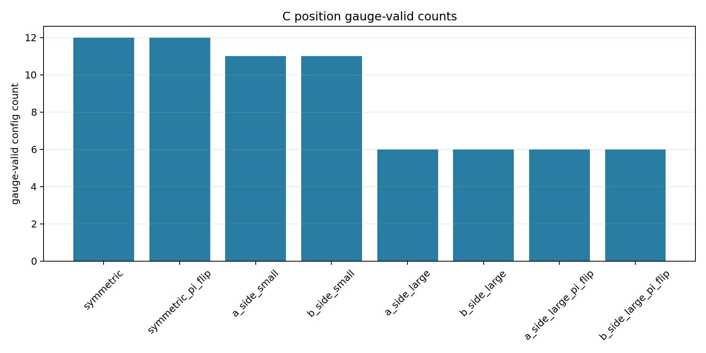 | 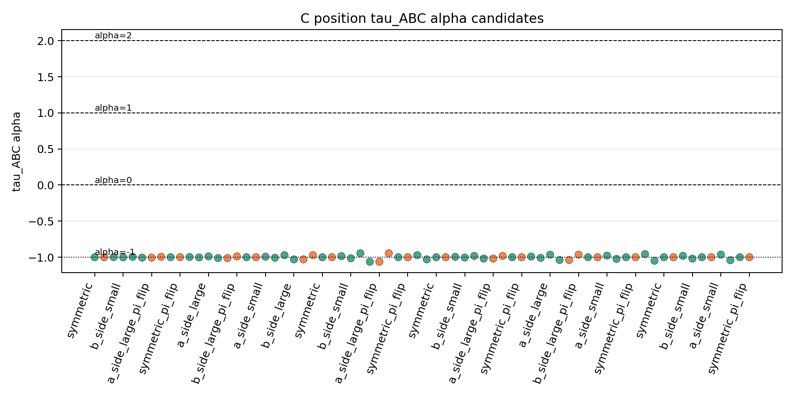 |

| A側/B側対称性 |
|---|
| 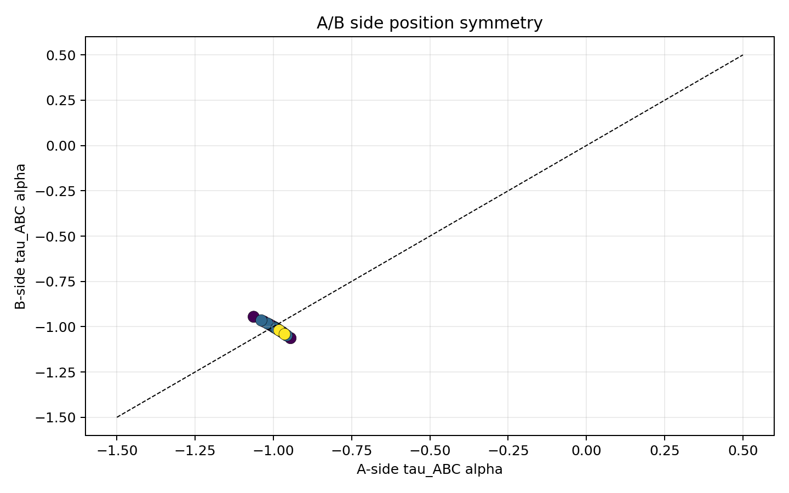 |

---

## 4. 関係性補償分解

### 4.1 実験の意味

ABC三体系では、関係性は少なくとも次の四つに分かれる。

```text
f_AB
f_AC
f_BC
f_ABC
```

このうち、主対象は `f_AB` である。

`f_AC`, `f_BC` はC由来の二体関係性である。

`f_ABC` はABC全体系の共通関係性である。

本実験では、次の分離を検査した。

```text
代表時間: tau_ABC
円周方向候補: f_AB, f_AC, f_BC
共通モード・中心方向候補: f_ABC
```

特に重要なのは、

```text
f_ABC を代表時間として使う。
f_ABC を AB 円周方向へ直接足さない。
```

という規律である。

### 4.2 主結果

| 量 | 値 |
|---|---:|
| `config_count` | `240` |
| `decomposition_valid_count` | `180` |
| `AB_dominant_valid_count` | `48` |
| `non_AB_dominant_count` | `132` |
| `inverse_or_inverse_square_in_AB_dominant_count` | `0` |

AB主導ケースでの `tau_ABC` 距離指数分類は次であった。

```text
proportional_like_alpha_minus1: 48
```

native な `f_AB` の分類は次であった。

```text
proportional_like_alpha_minus1: 180
```

Cバイアス項とC非対称項は、主に

```text
constant_like_alpha0
```

として読まれた。

これは、C由来の射影バイアスが、AB距離 `L_AB` に対して安定な逆数・逆二乗項として現れたわけではないことを示す。

### 4.3 f_ABC直足し対照

`f_ABC` をAB円周方向へ直接足した誤注入対照では、

```text
other: 63
proportional_like_alpha_minus1: 117
```

となった。

これは、`f_ABC` をAB円周方向の原因項として足すと、読出し分類が濁ることを示す。

したがって、現段階では、

```text
f_ABC は代表時間 tau_ABC として使う。
f_ABC は AB 円周方向へ直接足さない。
```

という分離が妥当である。

これは `f_ABC` を無視するという意味ではない。

`f_ABC` は全体系の共通モードまたは中心方向補償として記録する。

### 4.4 図

| 分解有効数 | ペア alpha |
|---|---|
| 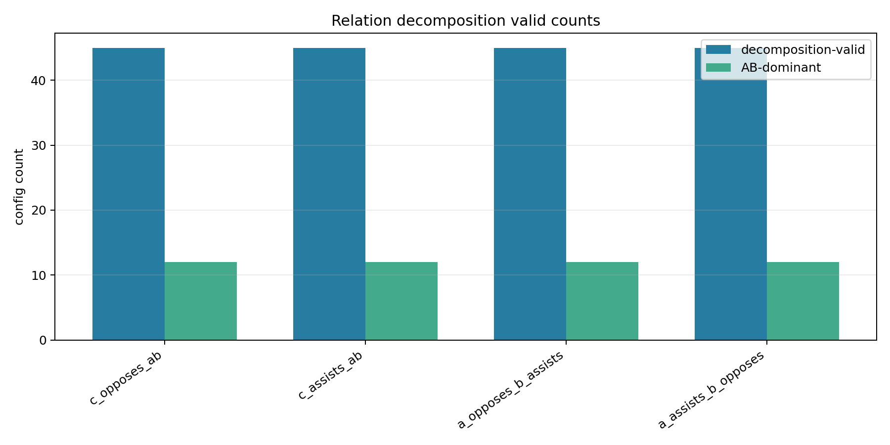 | 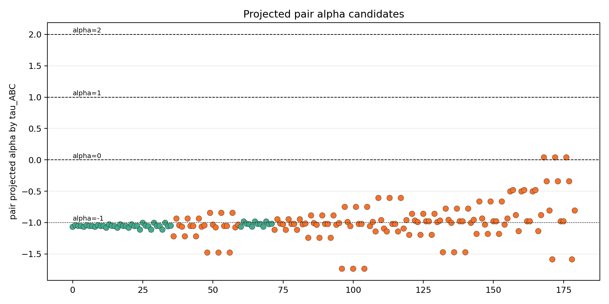 |

| native / pair 比較 | C汚染診断 |
|---|---|
| 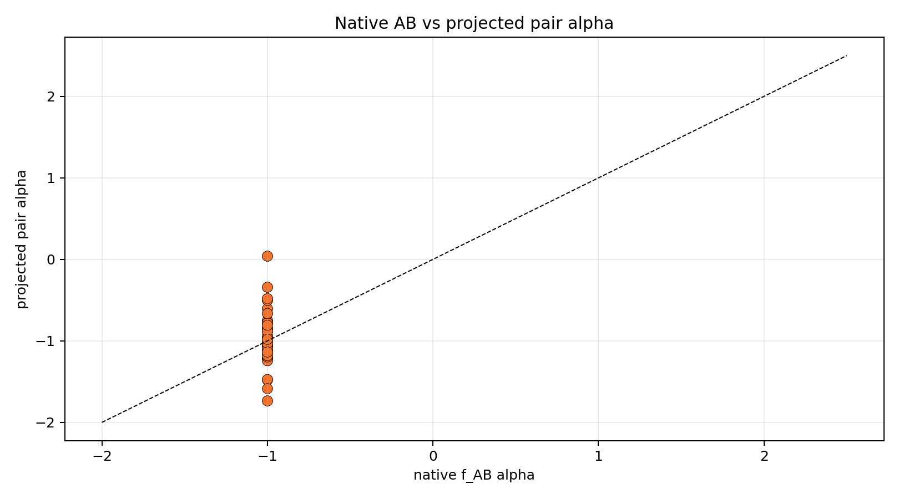 | 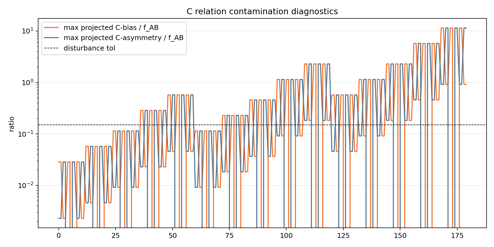 |

---

## 5. 総合判定

### 5.1 成立したこと

| 項目 | 判定 |
|---|---|
| Cゲージに有効窓がある | 成立 |
| 小さすぎる `R_C` ではセルが粗すぎる | 確認 |
| 強すぎる・偏ったCはゲージ汚染になる | 確認 |
| `tau_ABC` を代表時間として読む規律 | 支持 |
| `tau_AB`, `tau_AC`, `tau_BC` を補助診断として記録する必要 | 確認 |
| `f_AB`, `f_AC`, `f_BC`, `f_ABC` の分離 | 支持 |
| `f_ABC` を円周方向へ直足ししない規律 | 支持 |

### 5.2 成立していないこと

| 項目 | 判定 |
|---|---|
| Cゲージだけで逆比例型が出る | 未検出 |
| Cゲージだけで逆二乗型が出る | 未検出 |
| C配置変更だけで指数則が変わる | 未検出 |
| C由来項がAB距離に対する逆数・逆二乗項になる | 未検出 |
| 現在の最小AB調和モデルが標準重力型になる | 未成立 |

---

## 6. 解釈

本実験群の最も重要な帰結は、次である。

```text
ABC三体系へ戻しても、現在の最小モデルは比例型として読まれる。
```

これは消極的な失敗ではない。

AB二体系で得られた加速度様読出しを、独立計量Cで読み直しても、逆比例型または逆二乗型へは変換されなかったという境界条件である。

AB二体系では独立ゲージが足りなかった。

ABC三体系では独立計量Cを入れたが、C自身が閉鎖位相系の一部であるため、

```text
f_AC
f_BC
f_ABC
```

が発生する。

これらを分離しても、AB主導ケースでは比例型が保たれた。

したがって、現モデルは本質的に、

```text
一次元的な相対位相変位モデル
```

として振る舞っている。

その範囲では、逆比例型・逆二乗型は自然には出てこない。

この結果から、距離指数問題は、単にCを追加すれば解ける問題ではないことが分かる。

Cを強くすれば計量分解能は上がるが、`f_AC`, `f_BC`, `f_ABC` による汚染が増える。

Cを弱くすれば汚染は減るが、位置位相差の変化を読むセル分解能が不足する。

したがって、Cゲージには有効窓があるが、その有効窓は、現在の一次元的調和モデルを逆二乗型へ変換する機構ではなかった。

---

## 7. 保留された問題

### 7.1 逆二乗は一般否定されていない

本実験で否定されたのは、次の狭い主張である。

```text
現在の最小AB調和モデルに C ゲージと関係性分解を足せば、
native に逆比例または逆二乗が出る。
```

この主張は支持されなかった。

しかし、閉鎖位相系一般に逆二乗型が存在しないとは言えない。

### 7.2 三次元・四次元拡張を実施しなかった理由

逆二乗型を標準的に説明するには、面積スイープまたは球殻スイープのような構造が必要に見える。

そのため、三次元または四次元へ位置位相自由度を増やす実験も検討した。

しかし、現在の実験系は、局在した二つの波が相対位相方向に調和振動するモデルである。

この構造を高次元化しても、測地線断面または二次元断面へ投影すれば、結局は本実験と同じ二体調和読出しへ戻る。

したがって、このモデルのまま三次元・四次元へ拡張しても、逆比例型または逆二乗型が新たに出る効果は見込みにくい。

この判断により、本系列では高次元拡張実験を実施しなかった。

### 7.3 円形波・球面波の扱いと二重スリット論文からの限定的接続

しかし、本シリーズの観測原理では、観測できるのは局在波であり、観念的な広がった円形波をそのまま実在として置くことはできない。

円形波または球殻状に広がる波を仮定すれば、面積スイープや逆二乗型を作ることは容易に見える。

しかし、その波は空間方向にも時間方向にも大きく広がっており、位置位相と時間位相をどの局所読出しで測るのかが不明確になる。

したがって、現時点では、円形波・球殻波モデルは、実験できないから退けるのではなく、観測原理に対して過剰な実在仮定を含む可能性があるため保留する。

ここで二重スリット思考実験シリーズを参照する場合、引用できる範囲は限定する。

同系列の第一論文は、静止した単一波長点光源に位置揺らぎ `P(y)` を与えたとき、各試行の遠方場干渉縞は同形のまま幾何学的経路差だけシフトし、反復試行で読んだ縞シフト量分布が `P(y)` の押し出しになることを示した。

具体例として `P(y)=cos^2` を置いた場合、近軸の線形写像では `cos^2` 型が保存され、非近軸のずれは数パーセントの幾何非線形として現れる。

ただし、同論文が扱うのは、各試行で縞シフト量を読む観測モードであり、多数試行の強度を一枚に積算する可視度低下モードとは別である。

同系列の第二論文は、この押し出し読出しを局在奇数倍音光源へ拡張した。

そこでは、局在奇数倍音光源が形を保って二重スリット遠方場へ出るには整列条件が必要であり、位置揺らぎ下では off-axis 散乱により形の保存が脆くなる。

また、単一波長 `N=1` はこの脆さを持たず、第一論文の結果と機械精度で一致する特別な場合として確認された。

したがって、二重スリット論文から本稿へ正しく持ち込める示唆は、次に限られる。

この観点から見ると、広がった確率波または球面波を直接実在として置くよりも、

```text
局在波の多数回観測
初期位置または位相の揺らぎ
その揺らぎの観測側への押し出し
```

によって、広がった統計像または面積分布のように見える可能性を検討する方が、本系列の観測原理に近い、という研究方針である。

これは二重スリット論文で直接証明された命題ではない。

二重スリット論文が示したのは、あくまで、位置揺らぎ分布が縞シフト量分布へ押し出されること、および局在光源へ拡張すると形保存に整列条件と脆さが加わることである。

したがって、

```text
広がった波を仮定する
```

のではなく、

```text
局在波の多数回・多数初期条件読出しが、統計的に面積広がりとして見えるか
```

を別系列で検討する必要がある。

この問題は、本実験系列の範囲を超えるため、ここでは保留する。

---

## 8. 本系列の閉じ方

本系列は、次を成果として閉じるのが妥当である。

```text
AB二体では、調和読出しと chi-tau 面積は読める。
しかし、距離指数を独立計量するゲージが足りない。

ABC三体では、Cゲージと関係性分解を導入できる。
しかし、現在の最小モデルでは比例型が保たれ、
逆比例型・逆二乗型は native には現れない。

したがって、逆二乗問題は、
この一次元的閉鎖位相モデルの単純な延長ではなく、
観測統計、面積読出し、局在波集合、ならびに初期揺らぎの押し出し写像の問題として再設計する必要がある。
```

---

# 参考文献

## 自己引用

1. 木原範昭「無名等振幅複合波モデル基本公理系 v4」Version DOI: `10.5281/zenodo.21316620`, Concept DOI: `10.5281/zenodo.21315735`, 2026.
2. 木原範昭「ABC閉鎖位相系における多ゲージ干渉読出し保存量の構成実験」Version DOI: `10.5281/zenodo.21308050`, Concept DOI: `10.5281/zenodo.21308049`, 2026.
3. 木原範昭, [AB二体閉鎖位相系における調和読出しとc=1面積スイープ予備実験総括 v1.md](AB二体閉鎖位相系における調和読出しとc=1面積スイープ予備実験総括%20v1.md), 2026.
4. 木原範昭, [ABC閉鎖位相系における独立計量CによるAB関係補償の距離指数読出し実験仕様書 v1.md](ABC閉鎖位相系における独立計量CによるAB関係補償の距離指数読出し実験仕様書%20v1.md), 2026.
5. 木原範昭, [閉鎖複素位相波における自己項の内部閉鎖とN体外部読出し分離に関する定義補足.md](閉鎖複素位相波における自己項の内部閉鎖とN体外部読出し分離に関する定義補足.md), 2026.
6. 木原範昭「位置揺らぎを持つ光源による二重スリット干渉の思考実験 ― 光源位置分布の縞シフト量分布への押し出し（形の保存）」Version DOI: `10.5281/zenodo.21035809`, Concept DOI: `10.5281/zenodo.21035808`, 2026.
7. 木原範昭「局在奇数倍音光源による二重スリット干渉の思考実験 ― 形の保存は条件付きで脆く、単一波長 N=1 が頑健な特別な場合であること」Version DOI: `10.5281/zenodo.21035831`, Concept DOI: `10.5281/zenodo.21035830`, 2026.

## 外部参考文献

外部参考文献は、本稿の導出根拠ではなく、距離法則、相対論的時間、位相読出しに関する標準的背景を示すために最小限に用いる。

8. Isaac Newton, *Philosophiae Naturalis Principia Mathematica*, 1687.
9. Albert Einstein, "Die Grundlage der allgemeinen Relativitaetstheorie", *Annalen der Physik* 49, 769-822, 1916. DOI: `10.1002/andp.19163540702`.
10. Y. Aharonov and D. Bohm, "Significance of electromagnetic potentials in the quantum theory", *Physical Review* 115, 485-491, 1959. DOI: `10.1103/PhysRev.115.485`.
