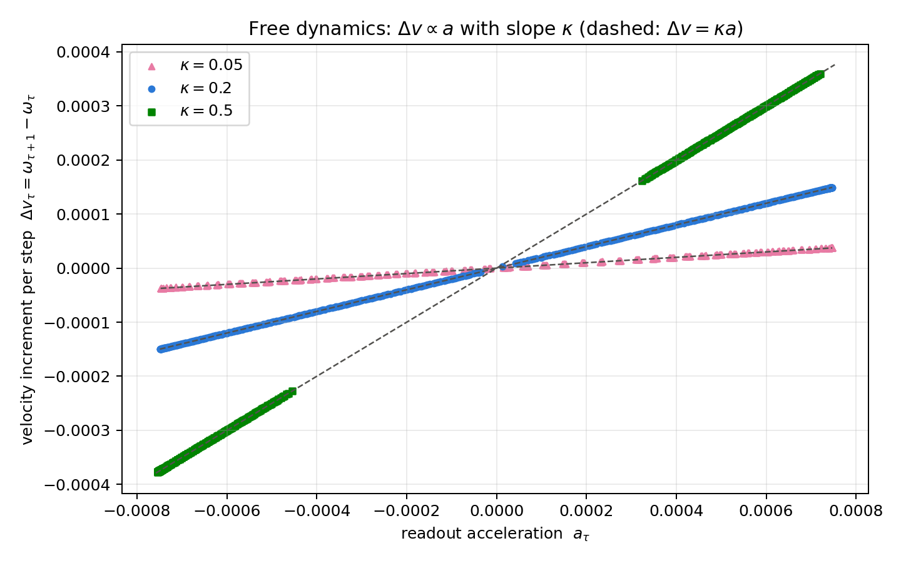
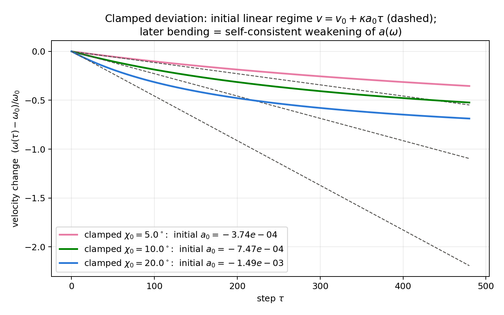
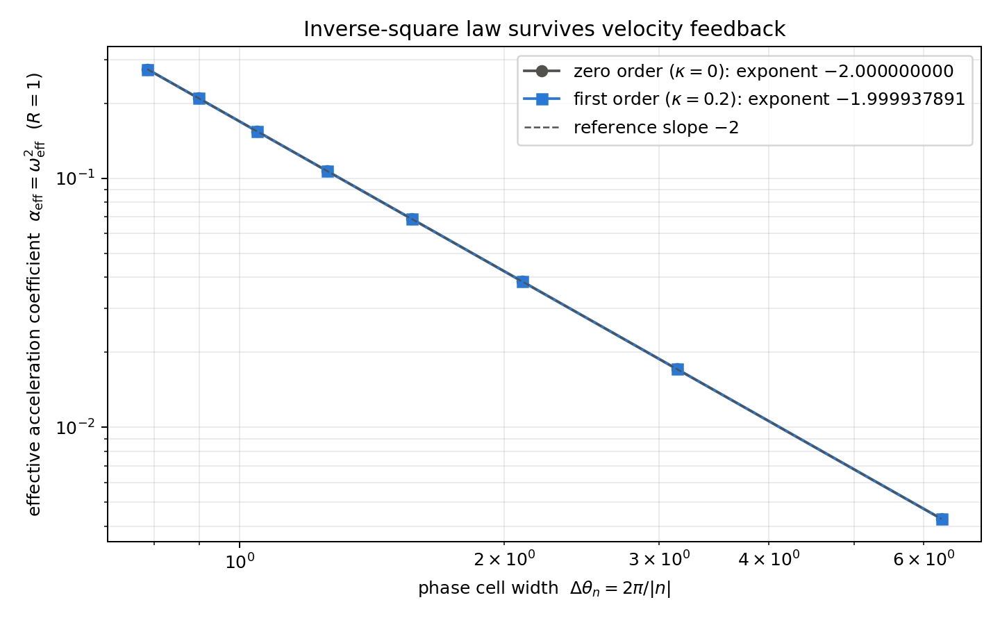

# Can acceleration be read without background coordinates?

I have published two new papers.

This time, the theme is acceleration.

In the Wave Information Readout series, I have been asking whether spatial quantities, temporal quantities, mass-like quantities, momentum-like quantities, and energy-like quantities can be read from interference inside a closed complex phase system, without placing a background space first.

This paper pair asks the next question.

Can acceleration also be represented without placing background coordinates first?

Can something acceleration-like be constructed only from complex interference?

I tested this question in an AB two-body closed phase system and in an ABC three-body closed phase system.

The formal papers, English versions, TeX/PDF files, scripts, figures, and metadata are available on Zenodo.

Japanese note version:
https://note.com/kiharanoriaki/n/nad8429959a8a

## Published papers

### 1. Preliminary Summary of Harmonic Readout and c=1 Area Sweep in an AB Two-Body Closed Phase System

Concept DOI, always pointing to the latest version:
https://doi.org/10.5281/zenodo.21318696

This version:
https://doi.org/10.5281/zenodo.21318697

Zenn article:
https://zenn.dev/noriaki_kihara/articles/ab-two-body-harmonic-readout

### 2. Preliminary Summary of Distance-Exponent Readout by Independent Metric C and Relational Compensation Decomposition in an ABC Closed Phase System

Concept DOI, always pointing to the latest version:
https://doi.org/10.5281/zenodo.21318700

This version:
https://doi.org/10.5281/zenodo.21318701

Zenn article:
https://zenn.dev/noriaki_kihara/articles/abc-c-gauge-distance-exponent

## Addendum (July 19, 2026): the mechanism that produces an inverse-square law

In the experiments above, acceleration-like harmonic readout was confirmed, but no inverse-square law appeared naturally.

We revisited this open point, identified the mechanism by which an inverse square arises, and confirmed that the inverse-square law holds under the specific conditions of the experiment.

The reason no inverse square appeared before is that the earlier experiments varied the positional phase deviation as an amplitude while keeping the harmonic period fixed. What they tested was whether an inverse square appears automatically when the amplitude or the readout distance is changed — not the relation between a closed phase-cell width and the harmonic angular speed that corresponds to that cell.

The starting point this time is to read the future phase position, seen from the current position moving along the circle, as a relational rotation center. With radius R and angular speed omega_n, the acceleration read along the direction of progression is

alpha_n = R |omega_n|^2

For a nonzero integer harmonic n, the phase-cell width and the harmonic angular speed are

Delta_theta_n = 2 pi / |n|
omega_n = n omega_1

so their product closes as

|omega_n| Delta_theta_n = 2 pi omega_1 = Omega

The angular speed and the phase-cell width are not independently chosen quantities. Connecting this harmonic closure to the acceleration relation gives

alpha_n = R Omega^2 / (Delta_theta_n)^2

an inverse-square law with respect to phase-cell width. This is not the result of adding 1/L^2 to an existing formula afterwards. What was confirmed is the inverse-square law under the specific conditions of this experiment; whether the mechanism generalizes, and whether this readout is identical to standard gravity, remain untested and unclaimed.

Paper:

Concept DOI (always latest):
https://doi.org/10.5281/zenodo.21441081

Version DOI (v1):
https://doi.org/10.5281/zenodo.21441082

## Addendum (July 21, 2026): does acceleration accumulate into velocity? The paper is updated to v2

We have updated the inverse-square paper above to v2.

Version DOI (v2):
https://doi.org/10.5281/zenodo.21466463

The trigger was an honest discomfort left in v1.

Acceleration could be read. The inverse-square law held. But the integral of that acceleration accumulated into no velocity at all.

a exists, yet v = integral of a d tau does not.

The center-directed closure compensation — the reaction force — cancels the velocity change exactly.

In v2 we first turned this into a theorem: within the class of update rules that freeze the angular speed, the readout acceleration can act neither on the angular speed nor on the closure quantity. That the closure quantity does not change even though acceleration exists was not a discovery but a necessity of this dynamics class.

We then introduced, as a working hypothesis, the velocity feedback in which the readout acceleration accumulates into the carrier angular speed:

d omega / d tau = kappa a

Together with the equation of motion this integrates exactly to omega = omega_0 + kappa (d chi / d tau). The speed is slaved to the deviation velocity, and is therefore automatically bounded.

In the numerical experiments, v = integral of a d tau held with a maximum error of order 10^-16 — machine precision.

Scattering the per-step velocity increment against the readout acceleration of that step, all points lie on straight lines through the origin with slope kappa. The relation that velocity changes in proportion to acceleration is directly visible. In the v1 dynamics, all points collapse onto the horizontal axis.

In the control where the deviation is clamped so that the acceleration is nearly constant, the speed grows along the line v = v_0 + kappa a tau — the textbook form of uniformly accelerated motion. The later bending away from the line is the self-regulating effect in which the acceleration itself weakens as the speed changes: the feedback does not run away.

Because the system is closed, unbounded growth of v = a tau is impossible in principle. What holds is instantaneous kinematic consistency with bounded velocity variation — the same relation by which acceleration and velocity change coexist in a bound orbit.

Crucially, the inverse-square law survived the feedback. The distance exponent is exactly -2 at zero order and -1.999937891 under feedback.

All eight harmonic points lie on the line of slope -2, with and without feedback.

There was one more instructive result. Under the strongest feedback, the oscillation envelope appeared to decrease by about 13% over 200 cycles — but re-integrating the same equations with refined step sizes made the decrease vanish completely. It was a discretization artifact. This became a worked example of the procedure: do not take what a numerical experiment shows at face value; discriminate against the continuum limit.

This feedback rule is a new working hypothesis, not contained in the zero-order readout defined by Axiom 17 of Basic Axiom System v6. If it becomes established, it will be incorporated in the next version of the axiom system. The next task is to apply this first-order readout to the rotation planes of N-body systems.

## Do not import acceleration from outside

The basic stance is the same as in the previous papers.

Do not place space first.

Do not place time first.

Do not place mass, momentum, or energy as substantial quantities in advance.

Instead, treat them as readouts from interference, phase differences, readout windows, and reference waves inside a closed complex phase system.

Then what about acceleration?

In standard physics, acceleration is normally written after space and time have already been placed.

There is position.

There is time.

There is velocity.

Acceleration is then defined as the change of velocity.

But if space and time themselves are treated as readouts from a closed phase system, acceleration cannot simply be imported from outside.

Acceleration must also be representable as an internal interference readout.

That is the question tested here.

## A structure close to classical centrifugal motion

The starting point was deliberately classical.

Centrifugal motion, or centripetal compensation.

If something moves along a circular path, a compensation toward the center is needed to maintain that motion.

In standard mechanics, this is written using radius, angular velocity, and centripetal acceleration.

In the present model, however, no radius, circle, or background space is placed first.

Instead, I read the closed phase relation of the AB two-body system itself.

The important point is not to separately place a force received by A and a force received by B.

I do not assume one force acting on A and another force acting on B.

I read the AB two-body relation itself.

That means the theory does not first decide which side is the subject and which side is the counterpart.

It reads the label-free two-body relation.

The experiment asks whether this two-body relation alone can produce an acceleration-like harmonic readout.

## The AB two-body system produced acceleration-like readout

In the AB two-body closed phase system, I confirmed a harmonic readout that looks acceleration-like.

This was not obtained by inserting the standard spring equation.

It was not obtained by inserting standard gravity.

It was not obtained by inserting the Coulomb law.

It was also not obtained by placing individual forces acting on A and B from outside.

Using only the label-free AB relation, harmonic displacement appeared as a closed complex-phase readout.

In this sense, acceleration-like readout can be represented without placing background coordinates first.

This is the first result of the paper pair.

A structure close to classical centrifugal or centripetal compensation was constructed not as an external force, but from complex phase interference and closure compensation.

From outside, this appears as a readout similar to acceleration toward a center.

This does not mean that standard gravity itself has been derived.

The claim is narrower:

inside a closed phase system, a harmonic centripetal-compensation readout can be constructed as a candidate for attraction-like acceleration.

In the AB readout, two unlabeled arcs oscillate periodically around the central relation, and the same readout appears as harmonic motion. The figure also shows that the envelope decays only when the readout is made stronger.

## Reflection and passing-through are not distinguishable under label-free readout

The AB experiment also showed another interesting point.

The reflection protocol and the passing-through protocol are different as internal descriptions.

However, under label-free readout, they collapse to the same observable structure.

In other words, from the label-free relative readout alone, one cannot decide whether A and B bounced at the center or passed through one another.

This is not a failure of unnamedness.

It is a natural consequence of unnamedness.

What can be read is the two-body relation.

The internal relative readout should not forcibly decide which one was A, which one was B, and which side reflected.

In this model, the same harmonic readout was obtained without building that distinction into the system.

## Readout affects the system

Another result was that the decay disappeared when the readout wave was turned off.

Conversely, stronger readout produced stronger envelope decay.

This is intuitively interesting.

Reading information from a closed phase system means that information is being taken outside the system, at least as a readout.

When the readout is stronger, the envelope of the system is affected.

There is no need to immediately jump to information thermodynamics or entropy.

The test here was simpler and more falsifiable:

Does the decay disappear when the readout wave is stopped?

Does the decay increase when the readout is strengthened?

The answer was yes.

## Time phase and area readout

Next, I added not only spatial phase but also temporal phase.

The purpose was not to treat the numerical experiment step itself as time.

The purpose was to test whether a time-phase-like readout can be obtained independently from inside the closed phase system.

I also introduced an internal calibration corresponding to setting the light-speed scale equal between spatial and temporal readouts, and checked whether a surface spanned by spatial phase and temporal phase appears.

When the temporal phase readout was independent, the spatial-temporal area was readable.

When the temporal phase was disabled or locked to the spatial phase, the area did not appear.

So, if temporal phase is read independently, an area readout formed by spatial and temporal phase becomes possible.

This is important.

To read acceleration, a position-phase difference alone is not enough.

A time-direction readout must stand as an independent degree of freedom.

## But an inverse-square law did not appear naturally

This is where the limit became clear.

If an area formed by spatial and temporal phase can be read, perhaps an inverse-area readout remains naturally.

That is an obvious question to test.

If one constructs the reciprocal of that area as post-processing, an inverse-square-like candidate can be produced.

But that is constructed.

It is not naturally read from the closed phase system.

In these experiments, no natural inverse-area readout corresponding to inverse-square distance dependence was detected.

This distinction is important.

The inverse-square candidate can be made.

But it has not yet been read natively.

If this distinction is blurred, the theory becomes weak very quickly.

## The AB two-body system cannot measure the distance exponent by itself

The largest limitation of the AB two-body experiment is that the measuring device is riding on the measured object.

In a system containing only A and B, one can read that the relative distance has changed.

However, there is no independent gauge for deciding whether that change follows proportional, inverse, or inverse-square dependence.

It is like trying to measure the stretching of a ruler using the same ruler while the ruler itself is stretching.

Therefore, in the second paper, I introduced a third wave C.

## C is not an external observer

In the ABC three-body experiment, C was introduced as an independent metric gauge.

However, C is not an external observer.

C is also part of the same closed phase system.

Therefore, once C is introduced, relations between A and C, between B and C, and the whole ABC relation also appear.

This is unavoidable.

So adding C does not immediately give an absolute ruler.

Rather, adding C creates both metric resolution and contamination.

If C is too weak, its wavelength becomes too long and its cell spacing too coarse, so the position change of AB cannot be read well.

If C is too strong, the relations involving A and C or B and C contaminate the main AB readout.

Therefore, C has a valid window.

It must be neither too coarse nor too strong.

The C gauge has regions where it is too weak to read and regions where it is too strong and contaminates the AB readout. The green region is the window that remained comparatively stable in this experiment.

## The ABC system still preserved proportional-type behavior

In the ABC experiment, I searched for the valid C-gauge window and classified the distance-exponent behavior inside that window.

The result was mainly proportional type.

It was not inverse type.

It was not inverse-square type.

Even after adding C, the present minimal model preserved proportional-type behavior.

This is not simply a failure.

It shows the boundary of the model.

The present system behaves as a one-dimensional harmonic model of two localized waves oscillating along a relative phase direction.

As a simple extension of that structure, inverse-square behavior does not appear naturally.

Even when the distance-exponent candidates are plotted, the points do not gather on the inverse or inverse-square side. They remain near proportional-type behavior. This suggests that the minimal model still behaves as a one-dimensional harmonic readout even after C is introduced.

## Do not directly add the whole-system relation

In the ABC three-body system, at least four relations must be separated.

The AB relation.

The relation between A and C.

The relation between B and C.

The whole ABC relation.

Among these, the main target is the AB relation.

The A-C and B-C relations are two-body relations involving the C gauge.

The whole ABC relation should be read as a candidate for a common mode or center-direction compensation of the whole system.

In these experiments, reading the whole ABC relation as the representative time was more stable.

On the other hand, directly adding the whole ABC relation into the AB circumferential direction muddied the classification.

Therefore, at the present stage, the better separation is:

use the whole-system relation as representative time,

but do not directly add it into the AB circumferential direction.

This does not mean that the whole-system relation is ignored.

It is recorded as a common mode of the total system.

But it should not be mixed conveniently as a cause term in the AB circumferential direction.

That discipline is important.

## What was learned?

The result of the two papers is fairly clear.

First, acceleration-like readout was constructed.

Even without placing background coordinates first, the AB two-body relation alone can represent harmonic centripetal compensation, or a readout similar to attraction-like acceleration.

This was not obtained by importing a classical force from outside.

It came from closure and interference of complex phase waves.

On the other hand, an inverse-square law like standard gravity did not appear naturally in this minimal model.

The AB two-body system lacks an independent gauge for measuring the distance exponent.

The ABC three-body system adds a C gauge, but C is still part of the same closed system, and the proportional type remains.

So the result can be summarized as follows.

Acceleration-like readout can be represented using only interference inside a closed phase system.

However, in the present one-dimensional localized-wave harmonic model, inverse or inverse-square distance dependence does not appear naturally.

## What this does not claim

To avoid misunderstanding, let me state the limits clearly.

These papers do not derive standard gravity.

They do not derive Newton's inverse-square law.

They do not explain the Coulomb force.

The confirmed result is one step before that.

Without placing background coordinates first, a harmonic readout that looks acceleration-like can be represented using closure and interference of complex phase waves.

But this minimal model alone does not produce inverse-square distance dependence.

Confirming that boundary is the result of this release.

## Next question

Then where does inverse-square behavior come from?

From the present results, simply extending the AB two-body model to three or four dimensions probably does not change the answer.

As long as the same localized-wave relative-phase harmonic model is used, projection onto a geodesic or two-dimensional section returns to essentially the same structure.

One could assume a circular wave or a spherical shell wave and produce inverse-square behavior.

But from the viewpoint of observation, that assumption is risky.

What is directly observed is basically a localized wave.

Instead of placing a widely spread wave as a real object, it may be better to examine repeated observations of localized waves, initial position or phase fluctuations, and the push-forward of those fluctuations into the observational side.

This may connect to the double-slit thought-experiment series.

But that remains untested.

For now, the acceleration-readout experiment series closes here.

Acceleration-like readout can be represented by complex phase interference alone.

But the inverse-square law does not appear from the simple extension of this minimal model.

The next step is to rethink distance laws as statistical readouts of localized waves, area readouts, and push-forward maps of initial fluctuations.

This is not a final answer to standard physics.

But I think it draws an important boundary.

---

#acceleration
#complex_numbers
#waves
#interference
#physics
#theoretical_physics
#numerical_experiment
#research_note
#Zenodo
