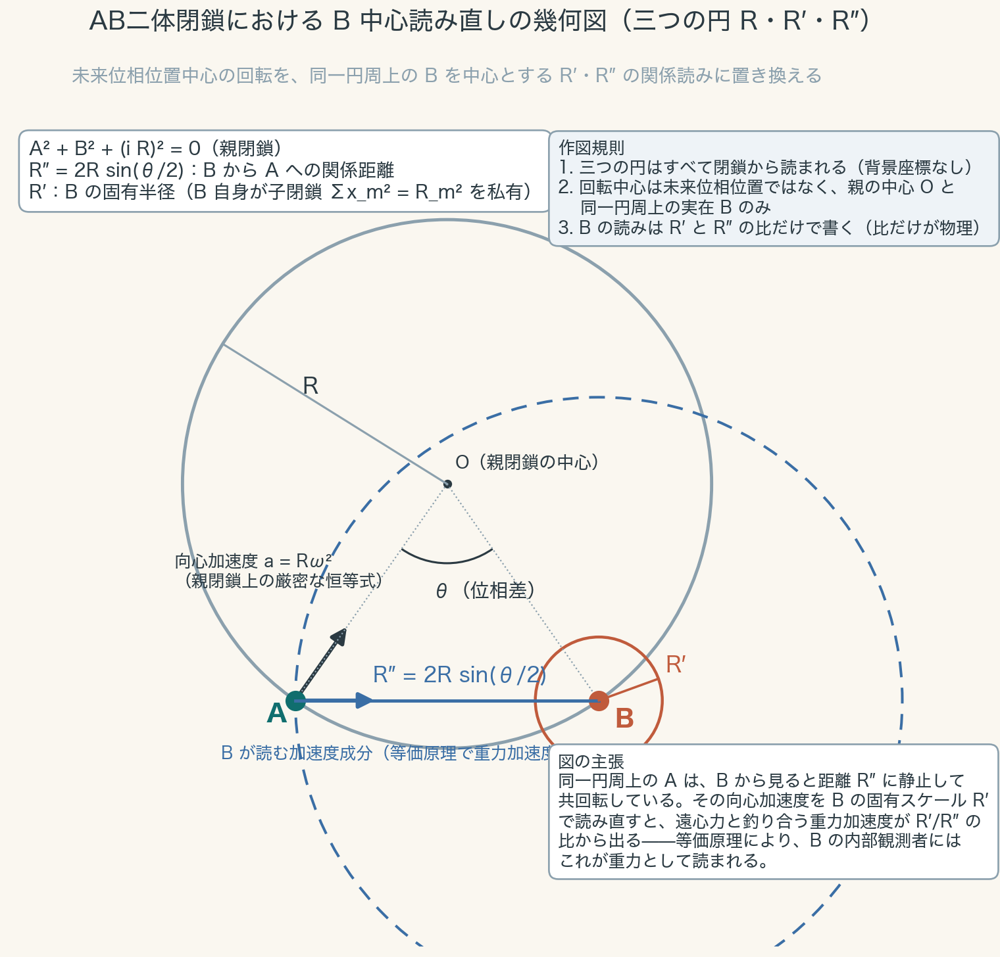

# Rederivation of the Acceleration Map by a Real-Center Reading in a Closed Two-Body AB Phase System
## The Three Circles R, R′, R″: A Gravity-Type Reading of the Centrifugal Balance, Removal of the Future-Phase-Position Center, and the Equivalence Principle as a Corollary of the Readout Classification Theorem

**Author:** Noriaki Kihara 
**ORCID:** 0009-0004-6753-4020 
**Date:** August 4, 2026 
**Version DOI:** `10.5281/zenodo.21765368` 
**Concept DOI:** `10.5281/zenodo.21765367` 
**Position:** Additional paper v1 of the "Wave Information Readout" series, AB two-body closed phase system (a derivation-replacement paper for the preceding paper [2]. **This paper is derivation only and contains no new numerical experiments.** All numerical support relies on the published reproduction packages of [2][3])

---

## Abstract

**(Realization of the center)** The acceleration map of the preceding paper [2] used a derivation that took a virtual point — the future phase position — as the rotation center. This paper removes that virtual point. By a re-reading centered on the partner B, which really exists on the same closure circumference, the same acceleration map is derived. The only centers appearing in the present construction are the center O of the parent closure and the real B on the circumference, both of which are read from the closure. Note that in this paper "the B-centered re-reading" does not mean that A revolves around B. A's acceleration always points toward O; the re-reading means reading its A→B directional component (the differential component) with the real B as reference (Section 3.2).

**(Three-circle completeness)** B's reading is completed by three closure quantities alone — the parent radius $R$, B's proper radius $R'$, and the relational distance $R''=2R\sin(\theta/2)$. No background coordinates, external distances, gravitational field, or mass source is introduced.

**(Identity of the derivation)** The acceleration that balances the centrifugal force in the B-centered re-reading, combined with harmonic closure ($|\omega_n|\,\Delta\theta_n=\Omega$), reproduces the inverse-square law of the preceding paper, $\alpha_n=R\Omega^2/\Delta\theta_n^2$, **as exactly the same equation**. What changes is not the equation but the derivation; the arbitrariness contained in the old derivation (the virtual center and the reaction-force narrative) is completely removed.

**(Identity of the pair)** The kinematics of the two bodies A and B co-rotating on the parent circumference is **exactly identical to that of a two-body closed orbit bound by a mutual attraction $g=\omega^2 R''/2$ and revolving about the common barycenter** (Proposition 2, an elementary-geometric identity as the kinematics of equal-response two bodies). That is, without introducing background coordinates or a gravitational field, merely by decomposing the common constrained motion toward the parent closure into the two-body relation, a differential acceleration of mutual-attraction type, directed at each other, necessarily appears — **gravity-type motion is not a new force but the local two-body differential representation of the global closure motion**.

**(Derivation of the equivalence principle)** The conserved readouts available to an internal observer of B are phase-blind (the conserved-readout classification theorem [3]). Hence, from inside B, constrained co-rotation on the parent circumference and being inside a gravitational field cannot be distinguished in principle — **in this system the equivalence principle is not an assumption but is derived as a corollary of the readout classification theorem**. What is derived is kinematic indistinguishability within the readout class of this system — a pre-geometric prototype of the equivalence principle — and its scope is made explicit in Section 3.4.

**(Identification of the scale ratio)** B's proper radius is derived from the construction of the child closure as $R'/R=m/M$ ($m$: harmonic index, $M$: resolution). The scale variable entering the square-type gravity grammar demonstrated by the trilogy [3] is identified with this resolution ratio $m/M$. Hence the scale ratio of the hierarchy is not a free parameter but a resolution ratio (the direct connection to a force law, together with the distance dictionary, is a task for the next paper).

**Keywords:** closed phase system, relational reading, centrifugal balance, equivalence principle, inverse-square law, Mach's principle, resolution, reproducible derivation

---

## 0. Conclusion

$$
\boxed{
\begin{aligned}
&\text{All rotation centers are real (the parent center O and B on the circumference). No virtual point is needed.}\\
&\text{B's reading is completed by the three circles } R,\ R',\ R''=2R\sin(\theta/2).\\
&\text{The pair's differential component } g=\omega^2 R''/2 \text{ is exactly identical to the balance of a two-body closed orbit about the common barycenter.}\\
&\text{Gravity-type motion = the local two-body differential representation of the global closure motion (no new force introduced).}\\
&\text{The inverse-square law } \alpha_n=R\Omega^2/\Delta\theta_n^2 \text{ is rederived as the same equation.}\\
&\text{The equivalence principle is a corollary of the classification theorem of phase-blind conserved readouts.}
\end{aligned}
}
$$

## Position of This Paper

The preceding paper [2] connected, in the AB two-body closed phase system, the acceleration map taking the future phase position as a relational rotation center with the harmonic closure in which integer harmonics simultaneously fix the phase-cell width and the angular velocity, and numerically established the inverse-square law $\alpha_n=R\Omega^2/\Delta\theta_n^2$ with respect to the phase-cell width. All of its equations and numerical results are correct. However, the prose of its derivation contained four defects (recorded in the Addendum). This paper replaces that derivation. No numerical experiments are added: every claim is a logical consequence of elementary-geometric identities and of the published theorem [3].

## 1. The Problem — Four Defects of the Old Derivation

The derivation of [2] used the narrative of "the reaction force to the centrifugal force arising from rotation about the future phase position." This narrative has the following defects.

1. **Borrowing of an inertial frame (violation of anonymity).** Centrifugal force is an apparent force of a rotating coordinate system, and its definition requires a non-rotating reference frame — a background inertial structure. This is a circularity in which the explanation presupposes in advance what was to be derived.
2. **Absence of an action pair for the reaction force.** A reaction force requires an action–reaction pair, but what rotates is a phase, not a body in space, and no carrier of the force can be defined.
3. **Teleology of the future center.** The picture in which the rotation center lies at a future position reads as if the future acted on the present.
4. **Divergence between narrative and computation.** All that the reproduction computations actually use is the second-difference identity of sinusoids $\Delta^2\chi=-\omega^2\chi$; centrifugal force and reaction force were ornaments with no counterpart in any verified computation.

The task of this paper is to derive the same equations from a construction that contains none of these defects.

## 2. Construction — The Three Circles

**Axiom system.** We follow the Anonymous Equal-Amplitude Composite-Wave Model: Basic Axiom System [1]. The parent closure carries the reading

$$
A^2+B^2+(iR)^2=0,\qquad\text{i.e.}\qquad A^2+B^2=R^2
$$

(the naming of the R axis of zero closure). The resolution axiom supplies the unique parameter $M$, and the minimum wavelength

$$
\lambda_0=\frac{2\pi R}{M}
$$

is uniquely determined.

**The three circles.** Two bodies A and B exist on the same circumference with phase difference $\theta$. We define the following three closure quantities (Figure 1).

- $R$: the radius of the parent closure.
- $R'$: B's proper radius. When B is a harmonic family (child closure) of fundamental wavelength $m\lambda_0$, the child's circumference is $2\pi R'=m\lambda_0$, hence

$$
R'=\frac{m\lambda_0}{2\pi}=\frac{m}{M}\,R
$$

This is a derivation, not a choice.

- $R''$: the relational distance from B to A. As the chord subtending the phase difference $\theta$ on the circumference,

$$
R''=2R\sin\frac{\theta}{2}
$$

All three circles are read from the closure. No background coordinates or external distances appear. Their roles are distinct: **the differential kinematics (Propositions 1 and 2) is built by the two circles $R$ and $R''$**, while $R'$ does not appear in the kinematic projection and **carries the hierarchy dictionary (Section 3.6)**.

Figure 1. The parent circle $R$ (gray), B's proper radius $R'$ (orange), and the relational distance $R''$ (blue, dashed). The rotation centers are only the parent center O and the real B. The plotting script `run_fig_b_centered_three_circles_v1.py` is bundled with this paper. (Figure labels are in Japanese; the geometry is fully specified in the text.)

## 3. Derivation

### 3.1 Centripetal Acceleration as an Identity

The positional component of a point on the parent circumference is a sinusoid of integer harmonics, and its second difference is proportional to itself:

$$
\Delta^2\chi=-\omega^2\chi\qquad(\text{in the continuum limit }a=R\omega^2,\ \text{directed toward O})
$$

This is an identity, not a force. All numerical results of [2] were verifications of this identity.

### 3.2 The B-Centered Decomposition (Proposition 1)

**Proposition 1 (differential component).** In the isosceles triangle OAB ($OA=OB=R$, apex angle $\theta$), the A→B directional component of A's centripetal acceleration vector (magnitude $R\omega^2$, direction A→O) is

$$
a_{AB}=R\omega^2\sin\frac{\theta}{2}=\frac{\omega^2 R''}{2}
$$

**Proof.** The base angles are $(\pi-\theta)/2$, so the angle between A→O and A→B is $(\pi-\theta)/2$. The component is $R\omega^2\cos\!\big(\tfrac{\pi-\theta}{2}\big)=R\omega^2\sin\tfrac{\theta}{2}$. Substituting $R''=2R\sin(\theta/2)$ yields the claim. ∎

We state again that A does not revolve around B. A's acceleration always points toward O, and "the B-centered re-reading" means reading that differential component with the real B as reference. By symmetry, the B side likewise has a component of the same magnitude directed toward A. Thus the centripetal acceleration decomposes uniquely into **the pair's common component** (the constraint of the pair as a whole toward the parent closure, along the perpendicular bisector) and **the pair's differential component** (the pair of components $\omega^2R''/2$ directed at each other).

### 3.3 Identity of the Pair (Proposition 2)

**Proposition 2 (exact identity with the two-body closed orbit).** The centripetal acceleration required for two bodies at separation $R''$ to revolve in a closed orbit about their common barycenter (the midpoint of segment AB) with angular velocity $\omega$ is $\omega^2(R''/2)$ for each body, directed toward the partner. This agrees exactly, in both magnitude and direction, with the differential component of Proposition 1. Hence **the kinematics of the co-rotating pair on the parent circumference is identically the same as the kinematics of a two-body closed orbit bound by a mutual attraction $g=\omega^2R''/2$**. Here, placing the common barycenter at the midpoint corresponds to the case in which the inertial responses of the two bodies are equal (equal-response two bodies). The generalization to unequal response — moving the barycenter to an internal dividing point, and a derivation reading the inertia ratio from closure quantities ($R'$, norms, resolution ratios) — is a task for the next paper.

**Proof.** The distance from the common barycenter is $R''/2$, the required centripetal acceleration is $\omega^2(R''/2)$, and the direction is toward the barycenter, i.e., toward the partner. This agrees with Proposition 1. ∎

No force has been introduced here. What is identical is the kinematics; "attraction" is not yet a name but another reading of the differential component. What confers the name is the equivalence principle of the next subsection.

### 3.4 Derivation of the Equivalence Principle (Theorem)

**Theorem (equivalence principle).** The conserved readouts available to an internal observer of B are restricted to functions of per-bin rotation invariants alone (the conserved-readout classification theorem [3]: a real rotation exactly conserves $|A_k|^2+|B_k|^2$ in each bin — the parallelogram identity — and conserved readouts are restricted to functions thereof. In the numerical classification, of 7 candidates only the diagonal sum is conserved, with maximum self-drift $2.2\times10^{-16}$. This classification is within the readout candidate class adopted in the present system — the per-bin power-ratio type). This readout contains no phase of the co-rotation. Hence inside B there **exists no** observable that distinguishes (i) constrained co-rotation on the parent circumference from (ii) a two-body closed orbit inside a field of mutual attraction $g=\omega^2R''/2$. Since by Proposition 2 the two are also kinematically identical, for the internal observer of B the differential component is read as a gravitational acceleration. ∎

In this system the equivalence principle is not an assumption. It is a consequence of the readout limitation called phase blindness.

**Scope.** What this theorem establishes is the **kinematic, readout-theoretic prototype** of the equivalence principle in the present closed system (local indistinguishability). The other stages contained in the equivalence principle of physics — the universality of free fall for test bodies of different internal structure, the equality of inertial and gravitational mass, and the special-relativistic form of the non-gravitational laws in local inertial frames — are outside the scope of this paper and are explicitly left as tasks for subsequent papers.

### 3.5 Rederivation of the Inverse-Square Law (the Same Equation)

By harmonic closure [2], the integer harmonic $n$ simultaneously fixes the phase-cell width $\Delta\theta_n=2\pi/|n|$ and the angular velocity $\omega_n=n\omega_1$, and $|\omega_n|\,\Delta\theta_n=\Omega$ holds. Hence the magnitude of the centripetal acceleration is

$$
\alpha_n=R\,\omega_n^2=\frac{R\,\Omega^2}{\Delta\theta_n^2}
$$

— exactly the same equation as in [2]. The future phase position appears nowhere.

**Distinction of distance variables (an honest limitation).** The present construction contains two distance-type variables: the cell width $\Delta\theta_n$ and the pair separation $R''$. The inverse square holds with respect to the cell width ($\alpha_n\propto\Delta\theta_n^{-2}$, the main result of [2]). On the other hand, at fixed $\omega$ the differential component is linear in the separation, $g\propto R''$, which is the dependence of the interior of a uniform-density sphere (harmonic type). The dictionary connecting the two distance variables ($\Delta\theta\leftrightarrow r$) remains unresolved, a problem shared with the sister series (Open Problem 2 of the two-channel trilogy [3]). This paper does not hide this distinction.

### 3.6 Corollary on the Scale Ratio

**Corollary (identification of the scale ratio).** $R'/R=m/M$ (Section 2, a derivation). The two-channel trilogy [3] demonstrated that the coupling of the gravity-type grammar is square-type in the scale ratio, $(R/R_0)^2$, and that the existence of the hierarchy follows from the definition of localization. The present system **identifies the scale variable entering that square-type grammar with the child-to-parent resolution ratio $m/M$**:

$$
\left(\frac{R'}{R}\right)^2=\left(\frac{m}{M}\right)^2
$$

If $M$ is the resolution of the parent closure (of cosmic scale), the extraordinary weakness of gravity can be read as the very magnitude of the resolution. However, what this section establishes is only the identification of the scale variable; the direct derivation connecting the differential component $g=\omega^2R''/2$ and $(m/M)^2$ in a single force law is, together with the distance dictionary, a task for the next paper.

## 4. Correspondence with the Old Derivation

The future phase position was a convenient virtual point arising from the fact that in the limit $\theta\to0$ the direction of the chord A→B coincides with the tangential direction of the circle. That is, the "tangential-direction center" of the old derivation is the shadow of the small-separation limit of the real center B of the present construction. The equations of the old derivation were correct because the identity $a=R\omega^2$ does not depend on the narrative of the center. Only the narrative was wrong; the equations were correct from the start — we record this asymmetry explicitly (Addendum).

## 5. Claims

**Claim 1 (realization of the center).** No virtual point is needed as a rotation center of the acceleration map. The only centers of the present construction are the center O of the parent closure and the real B on the circumference, both of which are read from the closure.

**Claim 2 (three-circle completeness).** B's reading is completed by the three closure quantities $R,\ R',\ R''=2R\sin(\theta/2)$ alone. No background coordinates, external distances, gravitational field, or mass source is introduced.

**Claim 3 (identity of the derivation).** The B-centered re-reading, combined with harmonic closure, reproduces $\alpha_n=R\Omega^2/\Delta\theta_n^2$ as exactly the same equation. Only the derivation changes, and the arbitrariness of the old derivation has been completely removed.

**Claim 4 (derivation of the equivalence principle).** In this system the equivalence principle is not an assumption but is derived as a corollary of the conserved-readout classification theorem (phase blindness) (Section 3.4, Theorem). What is derived is kinematic indistinguishability within the readout class of this system — a pre-geometric prototype of the equivalence principle — and its scope was made explicit in Section 3.4.

**Claim 5 (identification of the scale ratio).** $R'/R=m/M$ is a derivation, and the scale variable entering the square-type gravity grammar [3] is identified with the resolution ratio $m/M$. The scale ratio of the hierarchy is not a free parameter (the direct connection to a force law is left to the next paper).

## 6. Relation to Prior Work — Evidence of Convergence and Differences

The external literature is not the ground of this paper's derivation. It exhibits independent realizations of isomorphic structures and historical precedence.

**The lineage of the rotating disk.** The line of argument that proceeds from the internal reading of uniform rotation, via the equivalence principle, to non-Euclidean geometry passed through the Ehrenfest paradox [4] and led Einstein to general relativity (argued by Stachel [5] to be the "missing link"). This paper's "internal reading of constrained co-rotation = gravity" is the closed-phase-system version of this lineage. Difference: the rotating disk is a heuristic argument on a background spacetime, whereas this paper is a derivation without background.

**Equivalence of rotation and gravity (within GR).** Thirring [6] showed that centrifugal-type and Coriolis-type forces appear as gravitational effects inside a rotating mass shell (for the historical assessment see Pfister [7]) — the first quantitative realization of the equivalence of centrifugal force and gravity. Difference: it presupposes the Einstein equations. Manoff [8] discusses, in spaces with affine connections, the possibility of describing gravitational interaction as a consequence of centrifugal acceleration, and as an interpretation is the closest to this paper. Difference: it presupposes continuous geometry and possesses no closure, phase, or anonymity.

**The Machian lineage.** The program of attributing inertia and gravity to relations with distant matter goes back to Mach [9]; Sciama [10] took inertia to be an induction effect of distant matter and made **the weakness of G a consequence of the vastness of the universe**. Claim 5 (hierarchy exponent = resolution ratio) is an independent realization of intuition in the same direction. Difference: Sciama proceeds via the gravitational potential, whereas this paper proceeds via the resolution ratio; the mechanisms differ. The quantitative comparison is designated Open Problem 7.

**Relational dynamics.** Barbour–Bertotti [11] formulated a relational dynamics written solely in dimensionless, scale-invariant quantities. This paper's "only ratios are physical" (the construction rule) is its closed-phase-system version. Difference: it is a relational dynamics of particle configurations, possessing no waves, phases, or closure.

**Emergent gravity.** Jacobson [12] and Verlinde [13] derive gravity from thermodynamics and information. The type — not taking gravity as fundamental — is shared, but the mechanism (via thermodynamics) is entirely different.

**Observer frames and the equivalence principle.** The lineage of quantum reference frames (Giacomini–Castro-Ruiz–Brukner [14], Giacomini–Brukner [15]) treats the covariance of physical laws and the equivalence principle from the structure of observer frames. It is the nearest modern context of Claim 4 (equivalence principle = consequence of readout limitations). Difference: it is the context of quantum-superposed spacetimes, not a derivation from a conserved-readout classification theorem.

None of the above contains the two points: (i) rederivation of the inverse square by centrifugal balance in a construction in which all centers are real entities read from the closure, and (ii) derivation of the equivalence principle from a readout classification theorem.

## 7. Open Problems

1. **Kepler-type closure condition (the central task of the next paper)**: whether $\omega^2(R'')\,R''^3=\text{const.}$ can be derived from the closure condition. If it holds, then $g(R'')=\omega^2(R'')R''/2\propto1/R''^2$, and differential attraction-type motion, the inverse square of harmonic closure, the physical two-body distance, and the hierarchy of resolution ratios close in a single equation.
2. **Distance dictionary**: the dictionary connecting the two distance variables $\Delta\theta_n$ and $R''$ (the limitation of Section 3.5). Shared with Open Problem 2 of the trilogy [3].
3. **Generalization to unequal-response two bodies**: moving the common barycenter to an internal dividing point, and a derivation reading the inertia ratio $a_A/a_B$ from closure quantities (lifting the limitation of Proposition 2).
4. **Dynamical verification**: this paper is a kinematic derivation only. Numerical experiments on the balance of the differential component in the real-time evolution of the two bodies are deferred to the next stage (executable in the reproduction environments of [2][3]).
5. **Convention lemma for $R'$**: fixing the Nyquist factor of the minimum wavelength (whether $\lambda_0=2\pi R/M$ or $2\cdot2\pi R/M$). This affects the counting of $m$ in the Corollary (identification of the scale ratio).
6. **Isomorphism check of the common/differential decomposition**: checking whether the decomposition of this paper (the common component of the pair as a whole + the differential component of the two bodies) is isomorphic to the three-direction 2+1 decomposition and to the two-grammar (magnitude/overlap) decomposition.
7. **Quantitative comparison with Sciama**: making explicit the relation between the resolution ratio $(m/M)^2$ and Sciama's $G\propto1/\Phi$.

## 8. Reproducibility

This paper is derivation only and contains no new numerical experiments. All numerical facts relied upon are already published: the verification of the identity $\Delta^2\chi=-\omega^2\chi$ and of the 8 conditions of the inverse-square law is contained in the reproduction package of [2], and the conserved-readout classification theorem (only the diagonal sum conserved, drift $2.2\times10^{-16}$) is contained in the reproduction package of [3]. The plotting script for Figure 1, `run_fig_b_centered_three_circles_v1.py` (with a built-in numerical check of $R''=2R\sin(\theta/2)$), is bundled with this paper.

---

# References

## Self-citations

1. Noriaki Kihara, "Anonymous Equal-Amplitude Composite-Wave Model: Basic Axiom System", Concept DOI: `10.5281/zenodo.21315735` (always the latest version), 2026.
2. Noriaki Kihara, "Future Phase-Position Acceleration Map and the Inverse-Square Law via Harmonic Closure in an AB Two-Body Closed Phase System v4", Version DOI: `10.5281/zenodo.21468270`, Concept DOI: `10.5281/zenodo.21441081`, 2026.
3. Noriaki Kihara, "Two-Grammar Decomposition of Interaction in an Anonymous Two-Channel Closed Wave System" (Part I of the trilogy), Version DOI: `10.5281/zenodo.21763996`, Concept DOI: `10.5281/zenodo.21763995`, 2026. (Conserved-readout classification theorem; the scale ratio of the gravity-type grammar; the open problem of the distance dictionary.)

## External References

4. P. Ehrenfest, "Gleichförmige Rotation starrer Körper und Relativitätstheorie", *Phys. Z.* **10**, 918 (1909).
5. J. Stachel, "The Rigidly Rotating Disk as the 'Missing Link' in the History of General Relativity", in *Einstein and the History of General Relativity* (Einstein Studies Vol. 1), Birkhäuser (1989).
6. H. Thirring, "Über die Wirkung rotierender ferner Massen in der Einsteinschen Gravitationstheorie", *Phys. Z.* **19**, 33 (1918).
7. H. Pfister, "On the history of the so-called Lense–Thirring effect", *Gen. Relativ. Gravit.* **39**, 1735 (2007). DOI: `10.1007/s10714-007-0521-4`.
8. S. Manoff, "Centrifugal (centripetal) and Coriolis velocities and accelerations in spaces with affine connections and metrics as models of space-time", arXiv:`gr-qc/0309051` (2003).
9. E. Mach, *Die Mechanik in ihrer Entwicklung*, Brockhaus, Leipzig (1883).
10. D. W. Sciama, "On the Origin of Inertia", *Mon. Not. R. Astron. Soc.* **113**, 34–42 (1953).
11. J. B. Barbour and B. Bertotti, "Mach's principle and the structure of dynamical theories", *Proc. R. Soc. Lond. A* **382**, 295–306 (1982). DOI: `10.1098/rspa.1982.0102`.
12. T. Jacobson, "Thermodynamics of Spacetime: The Einstein Equation of State", *Phys. Rev. Lett.* **75**, 1260 (1995). DOI: `10.1103/PhysRevLett.75.1260`.
13. E. Verlinde, "On the Origin of Gravity and the Laws of Newton", *JHEP* **04**, 029 (2011). DOI: `10.1007/JHEP04(2011)029`.
14. F. Giacomini, E. Castro-Ruiz, and Č. Brukner, "Quantum mechanics and the covariance of physical laws in quantum reference frames", *Nat. Commun.* **10**, 494 (2019). DOI: `10.1038/s41467-018-08155-0`.
15. F. Giacomini and Č. Brukner, "Einstein's Equivalence principle for superpositions of gravitational fields and quantum reference frames", *AVS Quantum Sci.* **4**, 015601 (2022). arXiv:`2012.13754`.

---

**Addendum (record of corrections)** The derivation prose of the preceding paper [2] contained the following defects, corrected in this paper: (i) borrowing of an inertial frame through the phrase "reaction to the centrifugal force" (violation of anonymity); (ii) a reaction force possessing no action pair; (iii) the teleological virtual center called the future phase position; (iv) a dynamical narrative with no counterpart in the verified computation (the second-difference identity). All equations and numerical results of [2] are correct; only the derivation prose was corrected. The virtual center of the old derivation was the shadow of the small-separation limit of the real center B of the present construction (as $\theta\to0$ the chord direction coincides with the tangential direction).
