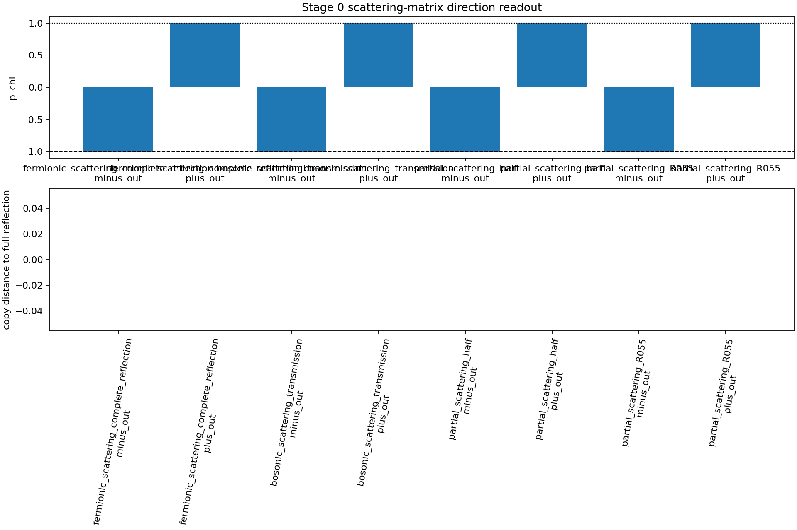
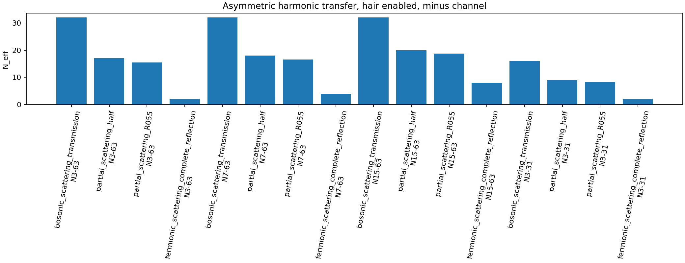

# 交換干渉散乱行列フェルミオン的衝突 予備実験検証メモ v1

## 目的

20260713 の準備論文を散乱行列版へ修正したため、予備実験を同じ方針で実行し直した。

本実験では、線形重ね合わせ `A+B` から直接 `A',B'` を復元するのではなく、交換干渉位相から反射振幅 `r` と透過振幅 `t` を計算し、分離された入射チャネルへ二チャネル散乱行列として作用させた。

## 判定

| 項目 | 結果 |
|---|---:|
| Stage 0 旧完全反射条件再現 | `true` |
| Stage 0 p 反転 | `true` |
| Stage 0 保存コピー距離 | `true` |
| Stage 0 ノルム | `true` |
| 低局在性底 hairあり | `1` |
| 低局在性底 hairなし | `1` |
| 非対称次数の部分移乗記録 | `true` |
| 観測停止対照 | `true` |
| 観測停止 L 最大差分 | `0.0` |
| Stage5 対照群比較 | `true` |

## Stage 0

| model | channel | delta_f | R | T | p_chi | p_target | copy_distance_d | P_m_A | P_m_B |
|---|---|---:|---:|---:|---:|---:|---:|---:|---:|
| fermionic_scattering_complete_reflection | minus_out | 3.14159 | 1 | 3.7494e-33 | -1 | -1.0 | 0.0 | 1 | 3.64078e-33 |
| fermionic_scattering_complete_reflection | plus_out | 3.14159 | 1 | 3.7494e-33 | 1 | 1.0 | 0.0 | 1.00001e-32 | 1 |
| bosonic_scattering_transmission | minus_out | 0 | 0 | 1 | -1 | nan | nan | 9.75594e-33 | 1 |
| bosonic_scattering_transmission | plus_out | 0 | 0 | 1 | 1 | nan | nan | 1 | 2.64382e-33 |
| partial_scattering_half | minus_out | 1.5708 | 0.5 | 0.5 | -1 | nan | nan | 0.5 | 0.5 |
| partial_scattering_half | plus_out | 1.5708 | 0.5 | 0.5 | 1 | nan | nan | 0.5 | 0.5 |
| partial_scattering_R055 | minus_out | 1.67096 | 0.55 | 0.45 | -1 | nan | nan | 0.55 | 0.45 |
| partial_scattering_R055 | plus_out | 1.67096 | 0.55 | 0.45 | 1 | nan | nan | 0.45 | 0.55 |



## 非対称次数の部分移乗例

| channel | N_A | N_B | R | T | N_eff | L | expected_origin_A | expected_origin_B |
|---|---:|---:|---:|---:|---:|---:|---:|---:|
| minus_out | 3 | 63 | 0.55 | 0.45 | 15.5 | 0.00163032 | 0.55 | 0.45 |
| plus_out | 3 | 63 | 0.55 | 0.45 | 18.5 | 0.00211765 | 0.45 | 0.55 |
| minus_out | 7 | 63 | 0.55 | 0.45 | 16.6 | 0.00218044 | 0.55 | 0.45 |
| plus_out | 7 | 63 | 0.55 | 0.45 | 19.4 | 0.00263572 | 0.45 | 0.55 |
| minus_out | 15 | 63 | 0.55 | 0.45 | 18.8 | 0.00322256 | 0.55 | 0.45 |
| plus_out | 15 | 63 | 0.55 | 0.45 | 21.2 | 0.00361299 | 0.45 | 0.55 |
| minus_out | 3 | 31 | 0.55 | 0.45 | 8.3 | 0.00109366 | 0.55 | 0.45 |
| plus_out | 3 | 31 | 0.55 | 0.45 | 9.7 | 0.00132064 | 0.45 | 0.55 |



## 観測停止対照

本スクリプトでは読出し波による減衰モデルを入れていない。

そのため、観測あり/なしは散乱行列出力を変えない診断対照として記録した。

| N | hair_enabled | readout_enabled | p_chi | L | copy_distance_d |
|---:|---|---|---:|---:|---:|
| 63 | True | True | -1 | 0.00520897 | 0 |
| 3 | True | True | -1 | 0.000335693 | 0 |
| 1 | True | True | -1 | 0.000183105 | 0 |
| 63 | True | False | -1 | 0.00520897 | 0 |
| 3 | True | False | -1 | 0.000335693 | 0 |
| 1 | True | False | -1 | 0.000183105 | 0 |
| 63 | False | True | -1 | 0.00520897 | 2.98023e-08 |
| 3 | False | True | -1 | 0.000335693 | 4.94216e-08 |
| 1 | False | True | -1 | 0.000183105 | 2.98023e-08 |
| 63 | False | False | -1 | 0.00520897 | 2.98023e-08 |
| 3 | False | False | -1 | 0.000335693 | 4.94216e-08 |
| 1 | False | False | -1 | 0.000183105 | 2.98023e-08 |

## Stage5 対照群比較

非対称次数条件で、散乱行列版と保存コピー型対照を比較した。

| model | N_A | N_B | channel | R | T | N_eff | L | expected_origin_A | expected_origin_B |
|---|---:|---:|---|---:|---:|---:|---:|---:|---:|
| fermionic_scattering_complete_reflection | 3 | 63 | minus_out | 1 | 3.7494e-33 | 2 | 0.000335693 | 1 | 3.7494e-33 |
| bosonic_scattering_transmission | 3 | 63 | minus_out | 0 | 1 | 32 | 0.00520897 | 0 | 1 |
| partial_scattering_R055 | 3 | 63 | minus_out | 0.55 | 0.45 | 15.5 | 0.00163032 | 0.55 | 0.45 |
| copy_reflection | 3 | 63 | minus_out | 1 | 0 | 2 | 0.000335693 | 1 | 0 |
| simple_reflection | 3 | 63 | minus_out | 1 | 0 | 2 | 0.000335693 | 1 | 0 |
| copy_transmission | 3 | 63 | minus_out | 0 | 1 | 32 | 0.00520897 | 0 | 1 |
| fermionic_scattering_complete_reflection | 7 | 63 | minus_out | 1 | 3.7494e-33 | 4 | 0.000656128 | 1 | 3.7494e-33 |
| bosonic_scattering_transmission | 7 | 63 | minus_out | 0 | 1 | 32 | 0.00520897 | 0 | 1 |
| partial_scattering_R055 | 7 | 63 | minus_out | 0.55 | 0.45 | 16.6 | 0.00218044 | 0.55 | 0.45 |
| copy_reflection | 7 | 63 | minus_out | 1 | 0 | 4 | 0.000656128 | 1 | 0 |
| simple_reflection | 7 | 63 | minus_out | 1 | 0 | 4 | 0.000656128 | 1 | 0 |
| copy_transmission | 7 | 63 | minus_out | 0 | 1 | 32 | 0.00520897 | 0 | 1 |

## 低局在性底

散乱行列版では、完全反射 `Delta_F=pi` の場合、低い `N` でも反射コピー条件は保たれた。


## 解釈

今回の結果は、前回の静的な縮約密度版とは異なる。

前回は `A+B` 型の交換合成から縮約密度を作ったため、二つの出射チャネルを復元できなかった。

今回の散乱行列版では、反射振幅 `r` と透過振幅 `t` を用いて、

```text
minus_out = r A_ref + t B_trans
plus_out  = t A_trans + r B_ref
```

を明示的に保持した。

このため、完全反射では旧保存コピー反射条件を再現し、部分反射では A 起因成分と B 起因成分の混合を出射チャネル上に残せた。

## 注意

本実験では、観測停止による減衰差はまだ扱っていない。

散乱行列写像は衝突セル内の局所写像であり、読出し波による包絡減衰モデルを別に入れていないためである。

## 出力

| 種別 | ファイル |
|---|---|
| JSON | `exchange_scattering_matrix_fermionic_localization_transfer_preliminary_result_v1.json` |
| CSV | `exchange_scattering_matrix_fermionic_localization_transfer_rows_v1.csv` |
| Stage0 図 | `exchange_scattering_matrix_stage0_diagnostics_v1.png` |
| 低N図 | `exchange_scattering_matrix_low_n_bottom_v1.png` |
| 非対称次数図 | `exchange_scattering_matrix_asymmetric_transfer_v1.png` |
| report | `exchange_scattering_matrix_fermionic_localization_transfer_report_v1.md` |
