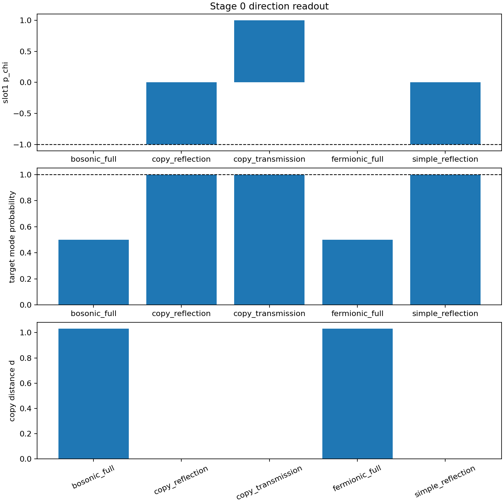

# 全情報交換干渉フェルミオン的衝突 予備実験検証メモ v1

## 目的

全情報交換干渉写像を用いた場合に、過去の完全弾性反射系列の旧条件を再現できるかを Stage 0 として検査した。

本実験では、保存コピー近似を主実験に使わず、識別振動、代表振幅、倍音構造、局在カーネルを含む一体波を交換干渉へ入れ、縮約密度から読出し量を再構成した。

## 判定

| 項目 | 結果 |
|---|---:|
| Stage 0 再現 | `false` |
| p 反転 | `false` |
| 識別保存 | `false` |
| 保存コピー近似との差が小さい | `false` |
| ノルム | `true` |
| 後続 Stage 実行 | `false` |

## Stage 0 結果

| model | slot | p_chi | p_target | target_mode_probability | kappa | L | copy_distance_d |
|---|---|---:|---:|---:|---:|---:|---:|
| fermionic_full | slot1 | 1.942890e-15 | -1.000000e+00 | 5.000000e-01 | 5.000000e-01 | 1.041794e-02 | 1.0305395279900709 |
| fermionic_full | slot2 | 1.942890e-15 | 1.000000e+00 | 5.000000e-01 | 5.000000e-01 | 1.041794e-02 | 1.0305395279900733 |
| bosonic_full | slot1 | 1.942890e-15 | -1.000000e+00 | 5.000000e-01 | 5.000000e-01 | 1.041794e-02 | 1.0305395279900706 |
| bosonic_full | slot2 | 1.942890e-15 | 1.000000e+00 | 5.000000e-01 | 5.000000e-01 | 1.041794e-02 | 1.030539527990073 |
| copy_reflection | slot1 | -1.000000e+00 | -1.000000e+00 | 1.000000e+00 | 1.000000e+00 | 1.041794e-02 | 0.0 |
| copy_reflection | slot2 | 1.000000e+00 | 1.000000e+00 | 1.000000e+00 | 1.000000e+00 | 1.041794e-02 | 0.0 |
| simple_reflection | slot1 | -1.000000e+00 | -1.000000e+00 | 1.000000e+00 | 1.000000e+00 | 1.041794e-02 | nan |
| simple_reflection | slot2 | 1.000000e+00 | 1.000000e+00 | 1.000000e+00 | 1.000000e+00 | 1.041794e-02 | nan |
| copy_transmission | slot1 | 1.000000e+00 | -1.000000e+00 | 1.000000e+00 | 1.000000e+00 | 1.041794e-02 | nan |
| copy_transmission | slot2 | -1.000000e+00 | 1.000000e+00 | 1.000000e+00 | 1.000000e+00 | 1.041794e-02 | nan |

## 解釈

全情報交換干渉をそのまま適用すると、旧モデルが保存コピーしていた識別振動および個体別出力は保存されなかった。

これは過去実験の否定ではない。

過去実験は、方向読出し反転、p/E/R 保存、多ゲージ読出しを検査する有効近似であった。

一方、本実験の目的である局在性および倍音移乗を調べるには、保存コピー近似を使えない。

今回の Stage 0 では、現在の静的な全情報交換干渉縮約だけでは、旧条件を再現できなかった。

仕様書に従い、Stage 1 以降の低局在性底探索、観測停止対照、名前の毛除去、非対称次数実験には進まない。

## 次の課題

次に必要なのは、静的な二体交換合成だけでなく、過去の反射実験で使われた片側入射、局所相互作用窓、偶奇チャンネル分解、自由伝播後読出しを、全情報状態に拡張した動的全情報交換干渉写像である。

これを作らない限り、局在性移乗実験は旧反射系列と比較可能な形にならない。

## 出力

| 種別 | ファイル |
|---|---|
| JSON | `full_information_fermionic_localization_transfer_preliminary_result_v1.json` |
| CSV | `full_information_stage0_old_condition_rows_v1.csv` |
| 図 | `full_information_stage0_old_condition_diagnostics_v1.png` |
| report | `full_information_fermionic_localization_transfer_preliminary_report_v1.md` |
