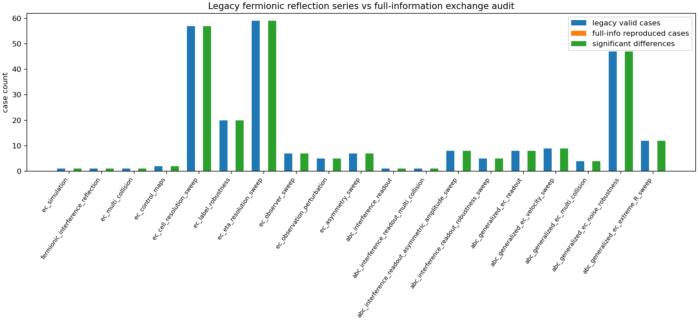
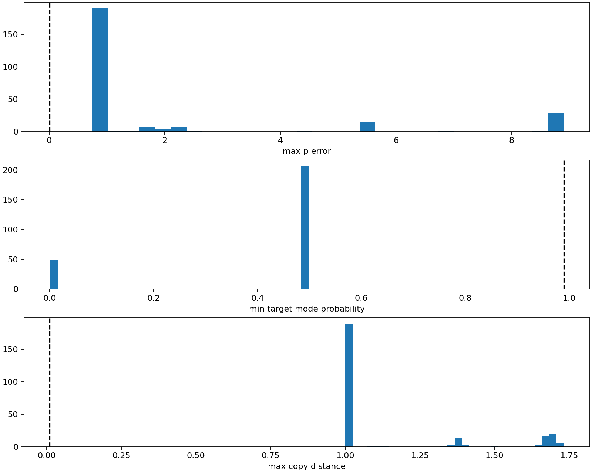

# 全情報交換干渉によるフェルミオン反射系列差分監査 v1

## 目的

20260710 および 20260711 のフェルミオン反射または弾性衝突読出し系列について、旧実験の同一条件を読み直し、保存コピー近似ではなく全情報交換干渉写像を適用した場合に、旧結果を再現できるかを検査した。

ここでは推測で判定しない。旧 JSON の有効ケースを読み込み、同じ `A_A`, `A_B`, `q_A0`, `q_B0`, `m_A`, `m_B`, `Nh_chi_A`, `Nh_chi_B` を用いて、全情報交換縮約から `p`、識別モード純度、保存コピー距離を再計算した。

## 総合判定

| 指標 | 値 |
|---|---:|
| 監査対象実験数 | `19` |
| 監査対象ケース数 | `316` |
| 旧有効ケース数 | `255` |
| 全情報交換で旧条件を再現したケース数 | `0` |
| 旧有効ケース中の有意差分ケース数 | `255` |
| 全旧有効ケースを再現 | `false` |

## 実験別監査

| series | experiment | cases | legacy valid | full-info reproduced | significant diff among legacy valid | all reproduced |
|---|---|---:|---:|---:|---:|---|
| 20260710 | elastic_collision_simulation | 1 | 1 | 0 | 1 | `false` |
| 20260710 | fermionic_interference_reflection | 1 | 1 | 0 | 1 | `false` |
| 20260710 | elastic_collision_multi_collision | 1 | 1 | 0 | 1 | `false` |
| 20260710 | elastic_collision_control_maps | 2 | 2 | 0 | 2 | `false` |
| 20260710 | elastic_collision_cell_resolution_sweep | 60 | 57 | 0 | 57 | `false` |
| 20260710 | elastic_collision_label_robustness | 36 | 20 | 0 | 20 | `false` |
| 20260710 | elastic_collision_eta_resolution_sweep | 88 | 59 | 0 | 59 | `false` |
| 20260710 | elastic_collision_observer_sweep | 13 | 7 | 0 | 7 | `false` |
| 20260710 | elastic_collision_observation_perturbation | 8 | 5 | 0 | 5 | `false` |
| 20260710 | elastic_collision_asymmetry_sweep | 10 | 7 | 0 | 7 | `false` |
| 20260711 | abc_multigauge_interference_readout | 1 | 1 | 0 | 1 | `false` |
| 20260711 | abc_multigauge_interference_readout_multi_collision | 1 | 1 | 0 | 1 | `false` |
| 20260711 | abc_multigauge_interference_readout_asymmetric_amplitude_sweep | 8 | 8 | 0 | 8 | `false` |
| 20260711 | abc_multigauge_interference_readout_robustness_sweep | 5 | 5 | 0 | 5 | `false` |
| 20260711 | abc_multigauge_generalized_elastic_collision_readout | 8 | 8 | 0 | 8 | `false` |
| 20260711 | abc_multigauge_generalized_elastic_collision_velocity_sweep | 9 | 9 | 0 | 9 | `false` |
| 20260711 | abc_multigauge_generalized_elastic_collision_multi_collision | 4 | 4 | 0 | 4 | `false` |
| 20260711 | abc_multigauge_generalized_elastic_collision_noise_robustness | 48 | 47 | 0 | 47 | `false` |
| 20260711 | abc_multigauge_generalized_elastic_collision_extreme_R_sweep | 12 | 12 | 0 | 12 | `false` |

## 最大差分例

| experiment | case | q target A | q target B | full p read | max p error | min mode prob | max copy distance |
|---|---|---:|---:|---:|---:|---:|---:|
| abc_multigauge_generalized_elastic_collision_velocity_sweep | c06_A1.00_B2.00_u1.20_v0.20 | -0.4 | 0.6 | -8.30468 | 8.90468 | 0.5 | 1.38184 |
| abc_multigauge_generalized_elastic_collision_multi_collision | c03_A1.00_B2.00_u1.20_v0.20 | -0.4 | 0.6 | -8.30468 | 8.90468 | 0.5 | 1.38184 |
| abc_multigauge_generalized_elastic_collision_noise_robustness | c03_A1.00_B2.00_u1.20_v0.20 | -0.4 | 0.6 | -8.30468 | 8.90468 | 0.5 | 1.38184 |
| abc_multigauge_generalized_elastic_collision_velocity_sweep | c08_A1.50_B1.00_u1.80_v-0.20 | 0.569231 | 2.56923 | 9.467 | 8.89777 | 0.5 | 1.68197 |
| abc_multigauge_generalized_elastic_collision_multi_collision | c04_A1.50_B1.00_u1.80_v-0.20 | 0.569231 | 2.56923 | 9.467 | 8.89777 | 0.5 | 1.68197 |
| abc_multigauge_generalized_elastic_collision_noise_robustness | c04_A1.50_B1.00_u1.80_v-0.20 | 0.569231 | 2.56923 | 9.467 | 8.89777 | 0.5 | 1.68197 |
| abc_multigauge_generalized_elastic_collision_velocity_sweep | c09_A1.00_B3.00_u0.80_v-0.40 | -1.36 | -0.16 | 7.24843 | 8.60843 | 0.5 | 1.08653 |
| abc_multigauge_generalized_elastic_collision_velocity_sweep | c02_A1.00_B1.00_u1.40_v-0.60 | -0.6 | 1.4 | -5.38334 | 6.78334 | 0.5 | 1.01971 |
| abc_multigauge_generalized_elastic_collision_velocity_sweep | c05_A1.00_B2.00_u1.40_v-0.60 | -1.8 | 0.2 | -5.38334 | 5.58334 | 0.5 | 1.69733 |
| abc_multigauge_generalized_elastic_collision_multi_collision | c02_A1.00_B2.00_u1.40_v-0.60 | -1.8 | 0.2 | -5.38334 | 5.58334 | 0.5 | 1.69733 |
| abc_multigauge_generalized_elastic_collision_noise_robustness | c02_A1.00_B2.00_u1.40_v-0.60 | -1.8 | 0.2 | -5.38334 | 5.58334 | 0.5 | 1.69733 |
| abc_multigauge_generalized_elastic_collision_velocity_sweep | c03_A1.00_B1.00_u0.50_v-1.70 | -1.7 | 0.5 | -5.06323 | 5.56323 | 0.5 | 1.12377 |

## 解釈

旧系列は、衝突点で `q` または一般化速度を更新し、識別モード、振幅、倍音構造を保存する実効的な保存コピー近似で動いていた。

全情報交換干渉写像では、A と B の一体情報をまとめて交換合成した後に縮約するため、旧実験が前提にしていた個別スロットの保存コピーが成立しない。等振幅の基本条件でも、識別モードはおおむね A/B 半々に混合し、同じ縮約状態から A 用と B 用の二つの反射後状態を同時に復元できない。

したがって、過去のフェルミオン反射系列、ABC 多ゲージ読出し系列、一般化弾性衝突系列は、旧目的に対しては有効な近似実験だったが、局在性移乗や倍音移乗を検査するための全情報干渉実験としては、そのままでは再利用できない。

## 結論

同一条件で監査した結果、保存コピー近似と全情報交換干渉写像の差は有意である。

よって、エネルギー系・加速度系など、旧フェルミオン反射写像に依存する後続実験へ全情報交換干渉を持ち込む場合は、旧実験を単純に流用せず、全情報交換版として再実装し直した上で差分を評価する必要がある。

## 出力

| 種別 | ファイル |
|---|---|
| JSON | `full_information_fermionic_reflection_legacy_audit_result_v1.json` |
| case CSV | `full_information_fermionic_reflection_legacy_audit_cases_v1.csv` |
| experiment CSV | `full_information_fermionic_reflection_legacy_audit_experiments_v1.csv` |
| count plot | `full_information_fermionic_reflection_legacy_audit_counts_v1.png` |
| metric plot | `full_information_fermionic_reflection_legacy_audit_metric_histograms_v1.png` |
| report | `full_information_fermionic_reflection_legacy_audit_report_v1.md` |
