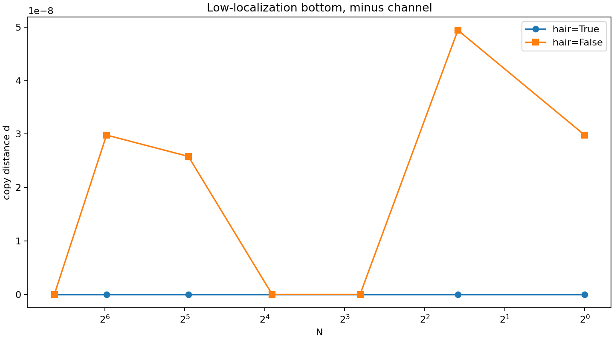
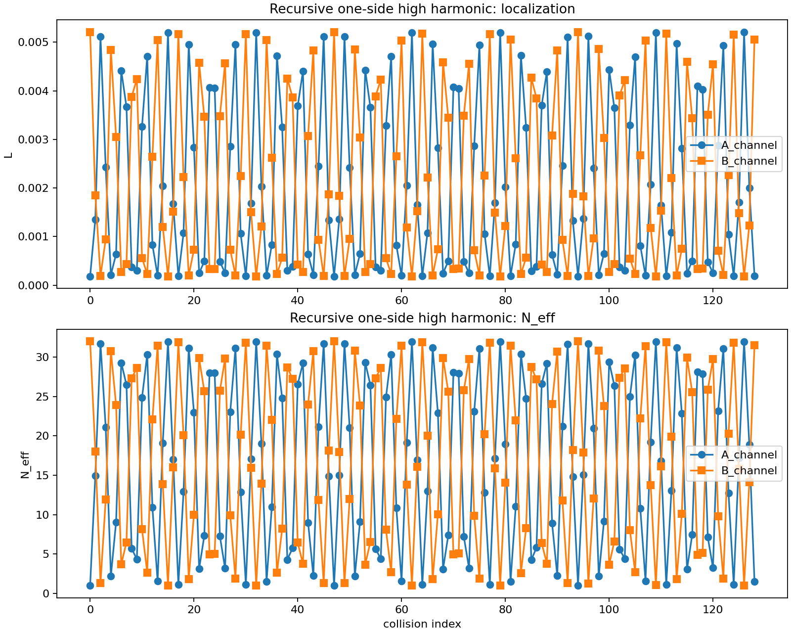
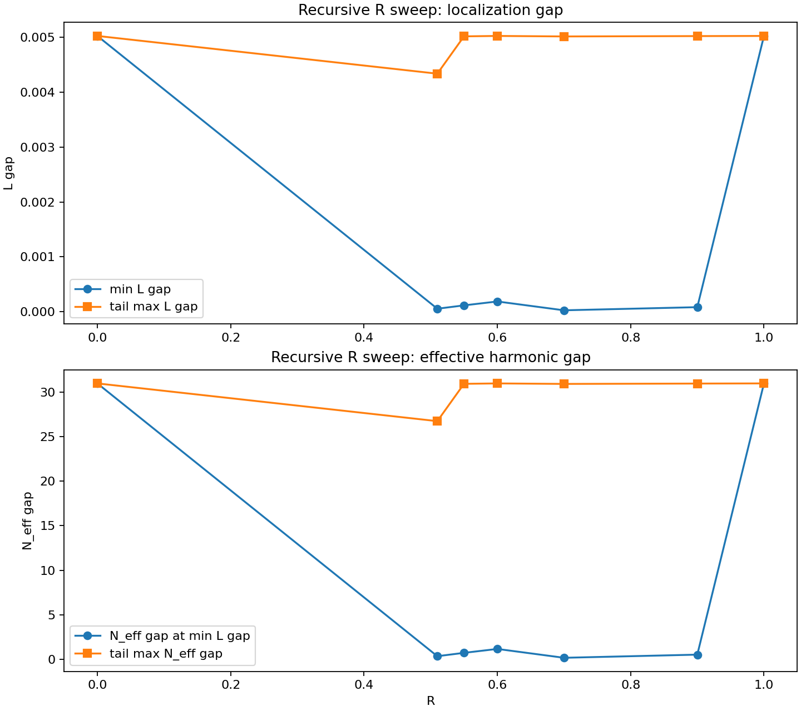
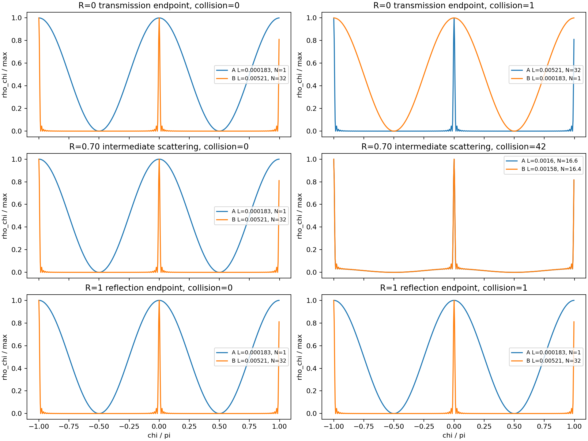
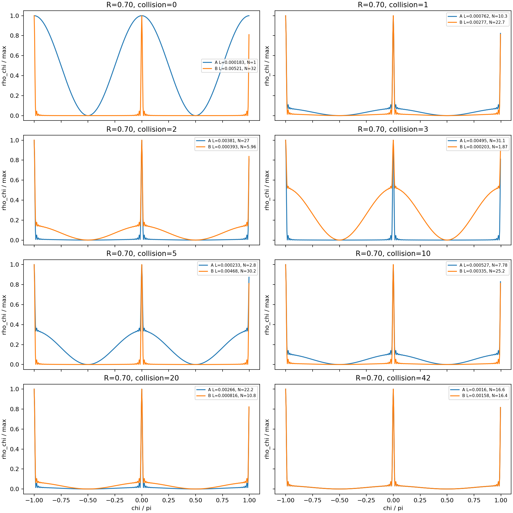

# 交換干渉散乱行列フェルミオン的衝突における加速度基底と局在性交換予備実験総括 v1

**副題:** 加速度様読出しを保持した片側高次倍音再帰散乱における局在性再配分  
**日付:** 2026-07-13  
**著者:** 木原 範昭  
**位置づけ:** 波の情報読出しシリーズ・予備実験総括  
**Version DOI:** pending  
**Concept DOI:** pending

---

## 要旨

本稿は、V2 系列で確立した交換干渉散乱行列版フェルミオン型反跳写像を、AB 二体加速度様読出しの基底上に置き、低奇数倍音底、観測停止、名前の毛除去、片側高次倍音条件、再帰散乱、反射率掃引を実施した予備実験を総括する。

加速度 V2 基底は成立した。奇数倍音底は、名前の毛あり・なしの双方で `N=1` であった。観測停止対照では、局在性指標 `L` の差分は `0.0` であった。

片側高次倍音条件 `N_A=1`, `N_B=63` を再帰散乱に投入した結果、完全透過端点 `R=0` と完全反射端点 `R=1` では、低次数波形と高次数波形の差が保存された。一方、中間散乱 `0<R<1` では、局在性 `L` と有効倍音次数 `N_eff` が周期的に交換された。

反射率掃引では、`R=0.70` において `L` 差最小 `2.48676e-05`、その時の `N_eff` 差 `0.153386` が得られた。これは、片側高次倍音条件で、両チャネルの局在性指標と有効倍音次数が近接する再帰点として記録される。

本実験の範囲では、定常収束は観測されなかった。観測されたのは、散逸を含まない二チャネル散乱行列による局在性の周期的交換である。

---

## 1. 実験の目的

本実験の目的は、次の一点である。

```text
加速度様読出しを壊さないフェルミオン型反跳写像の上で、
片側高次倍音が相手側チャネルの局在性読出しへ移るかを読む。
```

ここでいう局在性は、外部空間に置いた粒子位置ではない。閉鎖位相系内で構成した `chi` 方向密度、倍音分布、有効倍音次数、局在性指標から読む量である。

読出し対象は、散乱行列出射チャネル上の次の量である。

```text
L
N_eff
rho_chi
expected_origin_A
expected_origin_B
```

これらの量が、散乱行列の出射チャネル上でどう再配分されるかを記録する。

---

## 2. 基底写像

交換干渉位相 `Delta_F` から、透過振幅 `t` と反射振幅 `r` を定義する。

```math
t_\Delta
=
e^{i\Delta_F/2}
\cos\frac{\Delta_F}{2}
```

```math
r_\Delta
=
-i e^{i\Delta_F/2}
\sin\frac{\Delta_F}{2}
```

反射率と透過率は、

```math
R=|r_\Delta|^2
```

```math
T=|t_\Delta|^2
```

で読む。

本実験の二チャネル出力は次である。

```text
minus_out = r A_ref + t B_trans
plus_out  = t A_trans + r B_ref
```

再帰実験では、出射チャネルを次回入力へ渡す。

```math
A_{k+1}
=
\operatorname{norm}
\left(
r A_k + t B_k
\right)
```

```math
B_{k+1}
=
\operatorname{norm}
\left(
t A_k + r B_k
\right)
```

この再帰写像は、散逸項を含まない。

---

## 3. 加速度 V2 基底

本実験は、AB 二体加速度 V2 の結果を基底として読む。

| 量 | 値 |
|---|---:|
| fermionic_reflection_rate | `1.0` |
| fermionic_transmission_rate | `3.749399456654644e-33` |
| fermionic_q_out_factor | `-1.0` |
| max_Q_closed_abs | `0.0` |
| label_free_pass_vs_fermionic_match_all_cases | `true` |
| fermionic_regular_cell_harmonic_consistent_nonstrong_modes | `true` |
| fermionic_c1_area_sweep_detected_all_cases | `true` |

したがって、散乱行列版フェルミオン型反跳写像は、加速度様読出しの基底を保持する。

---

## 4. 低奇数倍音底

完全反射 `Delta_F=pi` で奇数倍音次数 `N` を下げた。

| 条件 | 底 |
|---|---:|
| 名前の毛あり | `N=1` |
| 名前の毛なし | `N=1` |

`N=1` でも、方向読出しと内在読出しは破綻しなかった。

代表値は次である。

| N | hair | p_chi | d_q | chi中心セル質量 | chi_peak_contrast | L | 名前毛総量 |
|---:|---|---:|---:|---:|---:|---:|---:|
| 1 | true | `-1` | `4.44089e-16` | `0.5` | `2` | `0.000183105` | `1` |
| 1 | false | `-1` | `8.88178e-16` | `0.5` | `2` | `0.000183105` | `0` |

この結果から、本実験条件での読出し底を `N=1` と読む。

本実験条件では、奇数倍音を増やす効果は、情報の有無ではなく、主に `chi` 方向密度の鋭さとして現れた。



---

## 5. 片側高次倍音条件

底 `N_A=1` を基準とし、片側だけ高次倍音を持つ条件を調べた。

代表条件は次である。

```text
N_A = 1
N_B = 63
```

`R=0.55`, `T=0.45` の一回散乱では、出射チャネルに A 起因成分と B 起因成分の配分が残った。

| channel | R | T | N_eff | L | origin_A | origin_B |
|---|---:|---:|---:|---:|---:|---:|
| minus_out | `0.55` | `0.45` | `14.95` | `0.00135002` | `0.55` | `0.45` |
| plus_out | `0.55` | `0.45` | `18.05` | `0.0018526` | `0.45` | `0.55` |

片側高次倍音は、一回散乱の段階で出射チャネルへ配分される。


---

## 6. 再帰片側高次倍音

出射チャネルを次回入力へ渡し、128 回まで再帰散乱を行った。

`R=0.55`, `T=0.45` の代表結果は次である。

| collision | A: L | A: N_eff | B: L | B: N_eff |
|---:|---:|---:|---:|---:|
| 0 | `0.000183105` | `1` | `0.00520897` | `32` |
| 16 | `0.00167148` | `16.9941` | `0.00151127` | `16.0059` |
| 32 | `0.00519937` | `31.9685` | `0.000183722` | `1.0315` |
| 64 | `0.000185626` | `1.12587` | `0.00517067` | `31.8741` |
| 128 | `0.000194012` | `1.50145` | `0.00505728` | `31.4985` |

局在性と有効倍音次数は、定常値へ収束しなかった。

再帰写像は、低次数側と高次数側を周期的に交換した。



---

## 7. 反射率掃引

`N_A=1`, `N_B=63` の条件で、反射率 `R` を掃引した。

| R | T | L差最小 | L差最小衝突回 | N_eff差 at L差最小 |
|---:|---:|---:|---:|---:|
| 0 | 1 | `0.00502586` | `1` | `31` |
| 0.51 | 0.49 | `5.37371e-05` | `78` | `0.331455` |
| 0.55 | 0.45 | `0.000114791` | `110` | `0.708042` |
| 0.6 | 0.4 | `0.000185909` | `125` | `1.1467` |
| 0.7 | 0.3 | `2.48676e-05` | `42` | `0.153386` |
| 0.9 | 0.1 | `8.21216e-05` | `61` | `0.506534` |
| 1 | `3.7494e-33` | `0.00502586` | `126` | `31` |

完全透過端点 `R=0` では、低次数波形と高次数波形の差は保存された。

完全反射端点 `R=1` でも、低次数波形と高次数波形の差は保存された。

中間散乱 `0<R<1` では、`L` と `N_eff` の差が小さくなる再帰点が現れた。

本掃引では、`R=0.70` が最小の `L` 差を与えた。



---

## 8. 波形局在スナップショット

`chi` 方向の縮約密度を、

```math
\rho_\chi
=
\sum_\eta |\psi(\chi,\eta)|^2
```

として読み、図示では各線を最大値 `1` に振幅正規化した。

図では、完全透過端点 `R=0`、中間散乱 `R=0.70`、完全反射端点 `R=1` を比較する。

`R=0` では、固定チャネル上では A/B が入れ替わる。ただし、低次数波形と高次数波形の差そのものは保存される。

`R=1` では、固定チャネル上でも低次数波形と高次数波形の差が保存される。

`R=0.70` では、衝突回 `42` で両チャネルの局在性指標が近接する。

| 条件 | collision | A: L | A: N_eff | B: L | B: N_eff |
|---|---:|---:|---:|---:|---:|
| R=0 | 0 | `0.000183105` | `1` | `0.00520897` | `32` |
| R=0 | 1 | `0.00520897` | `32` | `0.000183105` | `1` |
| R=0.70 | 0 | `0.000183105` | `1` | `0.00520897` | `32` |
| R=0.70 | 42 | `0.0016027127797281328` | `16.576692758470564` | `0.0015778452089655066` | `16.42330724152941` |
| R=1 | 0 | `0.000183105` | `1` | `0.00520897` | `32` |
| R=1 | 1 | `0.000183105` | `1` | `0.00520897` | `32` |

この図は、局在性再配分が端点では起こらず、中間散乱で現れることを、振幅正規化した密度波形として記録する。



### 8.1 R=0.70 における局在性交換過程

`R=0.70` について、衝突回 `0,1,2,3,5,10,20,42` の `rho_chi / max` を図化した。

`collision=42` では、A/B の `L` と `N_eff` が近接し、二つの波形の局在性指標が近づく。

図から読める過程は、単調な局在化ではなく、局在性の交換振動である。

| collision | 図から読める状態 |
|---:|---|
| 0 | A は低次ベース波形、B は高次局在波形で開始する。 |
| 1 | A 側に高次成分が入り、A の波形ピークが鋭くなる。 |
| 2,3 | A は高局在側へ寄り、B は低次ベース波形に近い鈍い形へ寄る。 |
| 5,10 | A は再び鈍り、B 側に高局在形が戻る。 |
| 42 | A/B の有効次数が `16.6` と `16.4` まで近接し、両者の局在性指標が近接する。 |

この図からは、片側に置いた高次局在形が一回で単純平均されるのではなく、中間散乱の再帰作用によって AB 間を往復する様子が読める。`collision=42` 近傍の有効次数は初期 B の `N_eff=32` より低いが、振幅正規化した波形表示では低次ベース波だけではない尖った形が残る。



---

## 9. 観測停止対照

観測あり/なしの対照では、

```text
observation_stop_max_L_delta = 0.0
```

であった。

観測あり/なしの条件で、局在性指標 `L` は同じ値として記録された。

本実験の再帰写像に、読出し波強度に依存する散逸項は入っていない。

---

## 10. 結論

本実験で得られた帰結は次である。

```text
1. 加速度 V2 基底は保持された。
2. 奇数倍音底は N=1 であった。
3. 名前の毛を除去しても、N=1 の底は変わらなかった。
4. 完全透過 R=0 では、局在性差は保存された。
5. 完全反射 R=1 でも、局在性差は保存された。
6. 中間散乱 0<R<1 では、局在性 L と有効倍音次数 N_eff が再帰的に交換された。
7. R=0.70 では、衝突回 42 において A/B の L と N_eff が近接した。
8. 本実験の範囲では、定常収束ではなく周期的交換が観測された。
```

したがって、フェルミオン型反跳写像における局在性再配分は、完全透過端点または完全反射端点ではなく、反射成分と透過成分の両方を持つ中間散乱で現れる。

これは、波形局在性の変化を交換干渉散乱行列の内部出射チャネルから検査するための実験基底である。

---

## 11. 出力

| 種別 | ファイル |
|---|---|
| 実行スクリプト | `run_exchange_scattering_matrix_fermionic_localization_transfer_preliminary_v1.py` |
| JSON | `exchange_scattering_matrix_fermionic_localization_transfer_preliminary_result_v1/exchange_scattering_matrix_fermionic_localization_transfer_preliminary_result_v1.json` |
| CSV | `exchange_scattering_matrix_fermionic_localization_transfer_preliminary_result_v1/exchange_scattering_matrix_fermionic_localization_transfer_rows_v1.csv` |
| 検証メモ | `交換干渉散乱行列フェルミオン的衝突における加速度基底・低奇数倍音底・片側高次倍音予備実験検証メモ_v1.md` |
| 低奇数倍音底図 | `exchange_scattering_matrix_fermionic_localization_transfer_preliminary_result_v1/exchange_scattering_matrix_low_n_bottom_v1.png` |
| 片側高次倍音図 | `exchange_scattering_matrix_fermionic_localization_transfer_preliminary_result_v1/exchange_scattering_matrix_one_side_high_harmonic_v1.png` |
| 波形局在スナップショット図 | `exchange_scattering_matrix_fermionic_localization_transfer_preliminary_result_v1/exchange_scattering_matrix_waveform_localization_snapshots_v1.png` |
| R=0.70 波形発展図 | `exchange_scattering_matrix_fermionic_localization_transfer_preliminary_result_v1/exchange_scattering_matrix_R070_waveform_evolution_v1.png` |
| 再帰Rスイープ図 | `exchange_scattering_matrix_fermionic_localization_transfer_preliminary_result_v1/exchange_scattering_matrix_recursive_R_sweep_v1.png` |
| 再帰局在性図 | `exchange_scattering_matrix_fermionic_localization_transfer_preliminary_result_v1/exchange_scattering_matrix_recursive_localization_transfer_v1.png` |

---

# 参考文献

## 自己引用

1. 木原範昭「無名等振幅複合波モデル基本公理系 v4」Version DOI: `10.5281/zenodo.21316620`, Concept DOI: `10.5281/zenodo.21315735`, 2026.
2. 木原範昭「背景空間を仮定しない閉じた位相系におけるフェルミオン的二局所波の完全弾性反射の構成実験」Version DOI: `10.5281/zenodo.21332866`, Concept DOI: `10.5281/zenodo.21291018`, 2026.
3. 木原範昭「フェルミオン的逆相核による完全反射写像の干渉構成」Version DOI: `10.5281/zenodo.21332867`, Concept DOI: `10.5281/zenodo.21295479`, 2026.
4. 木原範昭「曲率付き閉鎖定常波による曲率繰り込みと完全反射安定性」Version DOI: `10.5281/zenodo.21332874`, Concept DOI: `10.5281/zenodo.21304039`, 2026.
5. 木原範昭「ABC閉鎖位相系における多ゲージ干渉読出し保存量の構成実験」Version DOI: `10.5281/zenodo.21332875`, Concept DOI: `10.5281/zenodo.21308049`, 2026.
6. 木原範昭「AB二体閉鎖位相系における調和読出しとc=1面積スイープ予備実験総括」Version DOI: `10.5281/zenodo.21332876`, Concept DOI: `10.5281/zenodo.21318696`, 2026.

## 外部参考文献

7. Max Born, "Zur Quantenmechanik der Stossvorgaenge", *Zeitschrift fuer Physik* 37, 863-867, 1926. DOI: `10.1007/BF01397477`.
8. S. Pancharatnam, "Generalized theory of interference, and its applications", *Proceedings of the Indian Academy of Sciences A*, 44, 247-262, 1956.
9. B. A. Lippmann and J. Schwinger, "Variational Principles for Scattering Processes. I", *Physical Review*, 79, 469-480, 1950.
