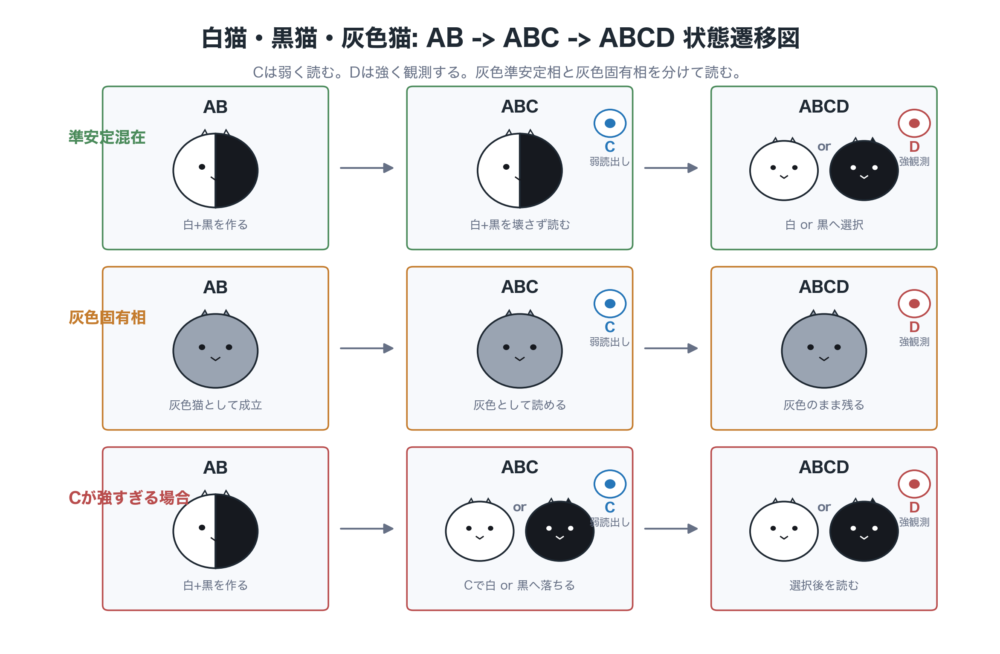
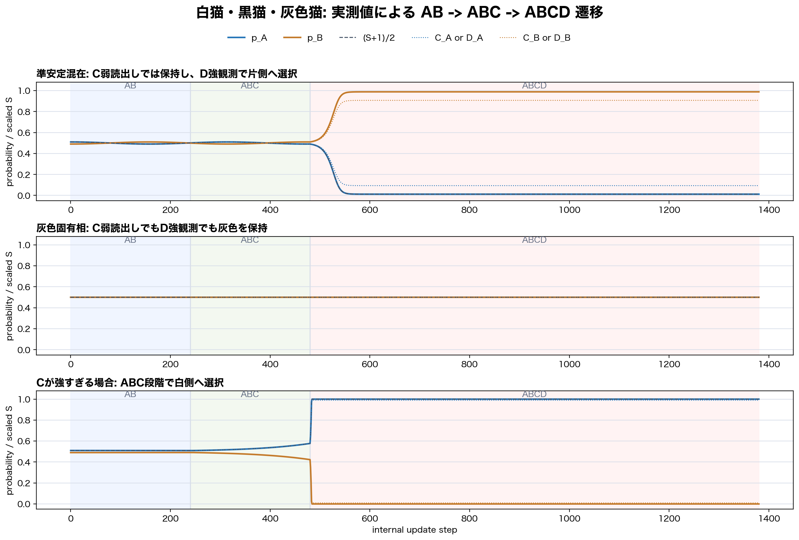

# Preliminary Numerical Study of Gray-Cat Metastable Interfaces, Weak C Readout, and Strong D Observation Selection in a Closed Phase System v1

**Date:** 2026-07-14  
**Author:** Noriaki Kihara  
**Series:** Wave Information Readout / preliminary numerical study of A/B allocation metastability and observation selection in a closed system  
**Version DOI:** 10.5281/zenodo.21353209  
**Concept DOI:** 10.5281/zenodo.21353208

---

## 0. Conclusion

This paper summarizes a preliminary numerical experiment in which the white-cat state `A` and the black-cat state `B` are represented by closed-system complex amplitudes

```math
a,\quad b
```

and read through

```math
p_A=|a|^2,\qquad p_B=|b|^2,
```

```math
Q=p_A+p_B,\qquad S=p_A-p_B.
```

The white-cat, black-cat, and gray-cat terminology is used here only as a metaphor for A/B allocation states. It is not a claim to reproduce the standard Schrodinger-cat thought experiment itself.

The experiment confirms the following points.

```text
1. In the AB two-body system alone, a gray eigen phase,
   a gray metastable phase, and a natural selection phase were separated.
2. Under weak C readout, a window existed in which the gray metastable
   phase could be read without selecting one side.
3. Under strong D observation, the gray metastable phase was selected
   into either the white-cat or black-cat allocation.
4. In the gray eigen phase, the gray allocation was kept even under
   strong D observation.
5. No-D controls did not show equivalent white/black selection, so the
   selection could be separated as D-induced in the tested cases.
```

Thus the observed classification is:

```text
gray metastable phase:
  weak readout reads it as gray;
  strong observation selects white or black.

gray eigen phase:
  weak readout reads it as gray;
  strong observation keeps it gray.
```

When the result is white-selected,

```math
S \simeq +1,\qquad p_A\simeq 1,\qquad p_B\simeq 0.
```

When the result is black-selected,

```math
S \simeq -1,\qquad p_A\simeq 0,\qquad p_B\simeq 1.
```

This should be read as an almost one-sided relocation of the A/B allocation, not as the appearance of two cats. The closed quantity

```math
Q=p_A+p_B
```

is preserved.

---

## 1. Background and Aim

The wave-information-readout series has studied whether position-like, momentum-like, energy-like, and acceleration-like quantities can be constructed from closed complex phase relations and interference readouts without assuming a background space in advance.

The preceding acceleration-basis and localization-exchange experiment studied how localization and effective harmonic order are redistributed by an AB interaction based on an exchange-interference scattering matrix.

This paper moves that line of work to the selection of an A/B allocation state.

The question is:

```text
Is a mixed white-cat A and black-cat B allocation merely an unselected state,
or can it be held as a gray-cat eigen state?

How does the state respond to weak C readout and strong D observation?
```

The experiment is divided into four stages.

```text
Stage 1:
  Search for gray eigen, gray metastable, and natural selection phases
  in the AB two-body system alone.

Stage 2:
  Test whether weak C readout can read the gray metastable phase without
  selecting one side.

Stage 3:
  Test whether strong D observation selects the gray metastable phase
  into white or black.

Stage 4:
  Sweep the D observation start step and D gain to read the selection boundary.
```

## 1.1 State Transition Diagram

The three representative paths are shown below along the AB, ABC, and ABCD stages.



The upper path shows a metastable white+black mixture prepared in AB, weakly read by C, and selected into white or black by strong D observation.

The middle path shows a gray eigen phase already formed at the AB stage and kept gray under both weak C readout and strong D observation.

The lower path shows the case in which C is too strong and selection into white or black already occurs at the ABC stage.

## 1.2 Observed-Value Transition Diagram

The same three paths are also shown using the computed values of `p_A`, `p_B`, and `S`.



The solid curves are the internal values `p_A` and `p_B`. The dashed curve is the selection order variable mapped to the same vertical axis as

```math
\frac{S+1}{2}.
```

The dotted curves represent the C readout in the ABC interval and the D readout in the ABCD interval.

---

## 2. Variables and Phase Classification

## 2.1 A/B Allocation

The A/B allocation is read as

```math
p_A=|a|^2,\qquad p_B=|b|^2.
```

The closed quantity is

```math
Q=p_A+p_B.
```

The A/B selection order variable is

```math
S=p_A-p_B.
```

Then

```math
p_A=\frac{1+S}{2},
\qquad
p_B=\frac{1-S}{2}.
```

## 2.2 White, Black, and Gray Cat Readouts

| State | Numerical guide | Readout |
|---|---|---|
| white cat | `S≈+1` | `p_A≈1`, `p_B≈0` |
| black cat | `S≈-1` | `p_A≈0`, `p_B≈1` |
| gray cat | `S≈0` | `p_A≈0.5`, `p_B≈0.5` |

## 2.3 Phase Classification

For the AB-only evolution, the phases are classified as follows.

```text
gray_eigen:
  S_mean ≈ 0
  S_amp ≈ 0
  S_drift ≈ 0

gray_metastable:
  S_mean ≈ 0
  0 < S_amp < S_gray_limit
  S_drift ≈ 0

natural_selection:
  S -> +1 or S -> -1 even without C or D.

large_oscillation:
  S oscillates strongly and a clear A/B bias appears.
```

The main targets of this paper are `gray_metastable` and `gray_eigen`.

---

## 3. Model

## 3.1 AB Exchange Interaction

The minimal AB exchange map is

```math
\begin{pmatrix}
a_{k+1}\\
b_{k+1}
\end{pmatrix}
=
U_\epsilon
\begin{pmatrix}
a_k\\
b_k
\end{pmatrix},
```

```math
U_\epsilon
=
\begin{pmatrix}
\cos\epsilon & i\sin\epsilon\\
i\sin\epsilon & \cos\epsilon
\end{pmatrix}.
```

A weak restoring term or a weak nonlinear term may be added to test closed-system stability. However, conditions that naturally select one side without C or D are not counted as observation-induced selection.

## 3.2 Weak C Readout

C is an internal readout wave that weakly reads the A/B allocation. The visibility is

```math
v_C=\frac{g_C}{g_C+\kappa_C}.
```

Then

```math
S_C=v_CS,
```

```math
C_A=\frac{1+S_C}{2},
\qquad
C_B=\frac{1-S_C}{2}.
```

C is used to search for a window where the A/B allocation can be read without selecting one side.

## 3.3 Strong D Observation

D is a strong observation map that amplifies the currently read direction of `S`. Its visibility is

```math
v_D=\frac{g_D}{g_D+\kappa_D},
```

and

```math
S_D=v_DS.
```

The D backaction is implemented as

```math
S_{k+1}
=
S_k
+
G_D S_D(1-S_k^2),
```

where `G_D` is the D gain.

For the same D start state, a no-D control is run in parallel. If the no-D control also falls into the same white-cat or black-cat selection, the result is not counted as D-induced selection.

---

## 4. Stage 1: AB Metastable Interface Search

## 4.1 Conditions

```text
C = off
D = off
steps = 4096
S_gray_limit = 0.05
selection_limit = 0.95
```

The main swept parameters were:

```text
epsilon_values = (0.0, 1e-05, 3e-05, 0.0001, 0.0003, 0.001, 0.003, 0.01)
stability_gain_values = (-0.01, -0.002, 0.0, 0.002, 0.01)
```

## 4.2 Results

| phase | count |
|---|---:|
| `gray_eigen` | `1248` |
| `gray_metastable` | `733` |
| `large_oscillation` | `470` |
| `natural_selection` | `1070` |
| `unstable_or_drifting` | `2079` |

In the AB system alone, the gray eigen phase, gray metastable phase, large-oscillation region, and natural selection phase were separated.

Representative gray-metastable candidates were:

| epsilon | phi/pi | s0 | gain | S_mean | S_amp | S_drift |
|---:|---:|---:|---:|---:|---:|---:|
| `0.01` | `0` | `0.01` | `0` | `0.000173315` | `0.02` | `0.00205793` |
| `0.01` | `1` | `0.01` | `0` | `0.000173315` | `0.02` | `0.00205793` |
| `0.003` | `0.0833333` | `0` | `-0.002` | `-0.00213507` | `0.020193` | `0.00227521` |

---

## 5. Stage 2: Weak C Readout Window

## 5.1 Conditions

```text
C = on
D = off
steps = 4096
readout_kappa = 0.02
g_C_values = (0.0, 0.002, 0.005, 0.01, 0.02, 0.05, 0.1, 0.2, 0.5, 1.0)
backaction_scale_values = (0.0, 1e-05, 5e-05, 0.0001, 0.0005, 0.001, 0.002, 0.005, 0.01)
```

## 5.2 Results

```text
total_cases = 1080
C_window_count = 247
C_informative_window_count = 144
C_nonzero_backaction_window_count = 114
```

The phase classification after C was:

| phase_after_C | count |
|---|---:|
| `gray_eigen` | `90` |
| `gray_metastable` | `786` |
| `large_oscillation` | `141` |
| `natural_selection` | `2` |
| `unstable_or_drifting` | `61` |

For gray-metastable candidates, windows were found in which C could read the A/B allocation without selecting one side.

Representative nonzero-backaction C windows were:

| epsilon | phi/pi | s0 | base_gain | g_C | c_gain | C_rel_err | C_bias_delta | phase_after_C |
|---:|---:|---:|---:|---:|---:|---:|---:|---|
| `0.003` | `0.0833333` | `0` | `-0.002` | `1` | `5e-05` | `0.0196078` | `0.00122196` | `gray_metastable` |
| `0.003` | `0.0833333` | `0` | `-0.002` | `1` | `1e-05` | `0.0196078` | `0.000220996` | `gray_metastable` |
| `0.003` | `0.0833333` | `0.001` | `-0.002` | `1` | `1e-05` | `0.0196078` | `0.000222243` | `gray_metastable` |

---

## 6. Stage 3: Strong D Observation Response

## 6.1 Conditions

```text
Stage 1: AB metastable interface already searched
Stage 2: C readout window already confirmed
Stage 3: D strong observation response
pre_steps_values = (0, 1, 2, 5, 10, 20, 50, 100, 250, 500, 1000, 2000)
d_steps = 2048
c_modes = (record_only, weak_C_window)
g_D_values = (0.0, 0.05, 0.1, 0.2, 0.5, 1.0)
d_backaction_scale_values = (0.0, 0.02, 0.05, 0.1, 0.2, 0.5, 1.0)
```

## 6.2 Overall Results

```text
total_cases = 7056
D_induced_selection_count = 2016
```

The D outcome classification was:

| D_outcome | count |
|---|---:|
| `white_selected` | `1244` |
| `black_selected` | `772` |
| `gray_kept_eigen` | `1062` |
| `unresolved` | `3978` |

The no-D control was:

| baseline_outcome | count |
|---|---:|
| `gray_kept_eigen` | `1176` |
| `unresolved` | `5880` |

The no-D control did not detect equivalent falling into white-cat or black-cat selection.

## 6.3 Gray Eigen Phase

In the gray eigen phase, the following was confirmed even under strong D conditions.

| pre | C_mode | S_start | outcome | S_mean_after_D | S_amp_after_D | Q_err |
|---:|---|---:|---|---:|---:|---:|
| `0` | `record_only` | `0` | `gray_kept_eigen` | `0` | `0` | `2.22e-16` |
| `0` | `weak_C_window` | `0` | `gray_kept_eigen` | `0` | `0` | `2.22e-16` |
| `20` | `record_only` | `0` | `gray_kept_eigen` | `0` | `0` | `2.22e-16` |
| `20` | `weak_C_window` | `0` | `gray_kept_eigen` | `0` | `0` | `2.22e-16` |

The gray eigen phase did not fall into white-cat or black-cat selection under strong D observation.

## 6.4 Gray Metastable Phase

In the gray metastable phase, strong D observation selected the state into white or black.

Representative cases were:

| epsilon | phi/pi | s0 | gain | pre | S_start | g_D | D_gain | outcome | baseline | S_mean_after_D |
|---:|---:|---:|---:|---:|---:|---:|---:|---|---|---:|
| `0.003` | `0.0833333` | `0` | `-0.002` | `0` | `0` | `1` | `1` | `black_selected` | `unresolved` | `-1` |
| `0.003` | `0.0833333` | `0` | `-0.002` | `0` | `0` | `0.5` | `0.25` | `black_selected` | `unresolved` | `-0.999878` |
| `0.01` | `0` | `0.01` | `0` | `0` | `0.02` | `1` | `0.2` | `white_selected` | `unresolved` | `0.997467` |

## 6.5 Large-Amplitude Separated Region

In the large-amplitude separated region, D outcomes agreed with the sign of the C readout.

| pre | S_start | C_sign | outcome | S_mean_after_D | agreement |
|---:|---:|---|---|---:|---|
| `0` | `0.06` | `A` | `white_selected` | `1` | `same_sign` |
| `1` | `0.0556528` | `A` | `white_selected` | `1` | `same_sign` |
| `2` | `0.0513121` | `A` | `white_selected` | `1` | `same_sign` |

In this region, D is interpreted as strongly reading an A/B bias already present in the system, rather than newly creating selection.

---

## 7. Stage 4: D Selection Boundary

## 7.1 Conditions

The targets were gray-metastable candidates for which D-induced selection was confirmed in Stage 3.

```text
target = gray_metastable candidates only
d_steps = 2048
pre_steps_values_count = 73
C_modes = (record_only, weak_C_window)
```

The D gain was scanned finely near the boundary.

```text
D_gain_values =
(0.0, 0.005, 0.01, 0.015, 0.02,
 0.0225, 0.025, 0.0275, 0.03,
 0.0325, 0.035, 0.0375, 0.04,
 0.045, 0.05, 0.055, 0.06,
 0.065, 0.07, 0.0725, 0.075,
 0.0775, 0.08, 0.0825, 0.085,
 0.0875, 0.09, 0.095, 0.1,
 0.12, 0.15, 0.2, 0.3,
 0.5, 0.75, 1.0)
```

## 7.2 Results

```text
total_rows = 15768
boundary_points = 438
selection_possible_boundary_points = 438
no_selection_boundary_points = 0
min_D_gain_overall = 0.0225
max_min_D_gain_overall = 0.065
```

The boundary by candidate was:

| case_id | boundary_points | selection_possible | no_selection | min_gain | max_min_gain | sign_counts |
|---|---:|---:|---:|---:|---:|---|
| `gray_metastable_0_eps0.01_phi0_s0.01_g0` | `146` | `146` | `0` | `0.065` | `0.065` | `A:90, B:56` |
| `gray_metastable_1_eps0.01_phi1_s0.01_g0` | `146` | `146` | `0` | `0.065` | `0.065` | `A:90, B:56` |
| `gray_metastable_4_eps0.003_phi0.0833333_s0_g-0.002` | `146` | `146` | `0` | `0.0225` | `0.0225` | `B:114, A:32` |

Within the swept range, D-induced selection was possible at all tested observation start steps for the selected metastable candidates.

The minimum D gain separated into two levels:

```text
weak threshold candidate:
  min_D_gain = 0.0225

strong threshold candidates:
  min_D_gain = 0.065
```

---

## 8. Discussion

The important point in this experiment is that the gray-cat state was not a single type of state.

The gray metastable phase can be read as gray by weak readout. Under strong D observation, it falls into either white or black.

If it becomes white,

```math
p_A\simeq 1,\qquad p_B\simeq 0.
```

If it becomes black,

```math
p_A\simeq 0,\qquad p_B\simeq 1.
```

This is not the simultaneous appearance of a white cat and a black cat. It is an A/B allocation moving almost entirely to one side, with the opposite component almost disappearing in the readout.

In contrast, the gray eigen phase kept

```math
p_A\simeq 0.5,\qquad p_B\simeq 0.5
```

even under strong D observation.

Thus the gray metastable phase and the gray eigen phase are distinguishable by their observation response.

Weak C readout also showed a window in which A/B allocation could be read without selection.

The experiment therefore separates:

```text
natural selection in AB alone;
gray metastability readable by weak C readout without selection;
white/black selection under strong D observation.
```

---

## 9. Conclusion

This experiment confirmed the following points for an A/B allocation state in a closed system.

```text
1. In AB alone, gray eigen, gray metastable, and natural selection phases
   can be classified.
2. Weak C readout has windows that read a gray metastable phase without
   selecting one side.
3. Strong D observation selects a gray metastable phase into white or black.
4. A gray eigen phase remains gray even under strong D observation.
5. In the D selection boundary sweep, all selected metastable candidates
   admitted D-induced selection within the tested range.
6. The minimum D gain separated into two levels, 0.0225 and 0.065,
   depending on the candidate.
```

The white-cat, black-cat, and gray-cat states are therefore not treated here as a single unselected state. They are separated by closed-system phase classification and observation strength.

In particular:

```text
gray metastable phase:
  gray under weak readout;
  white or black under strong observation.

gray eigen phase:
  gray even under strong observation.
```

