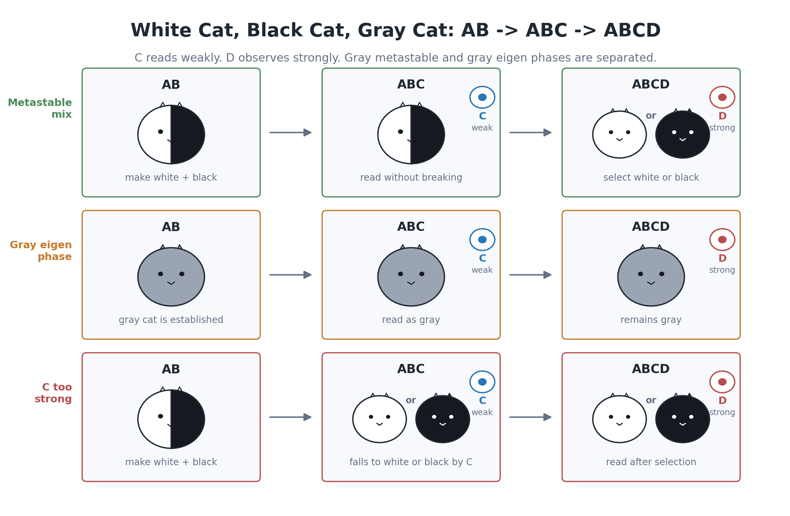
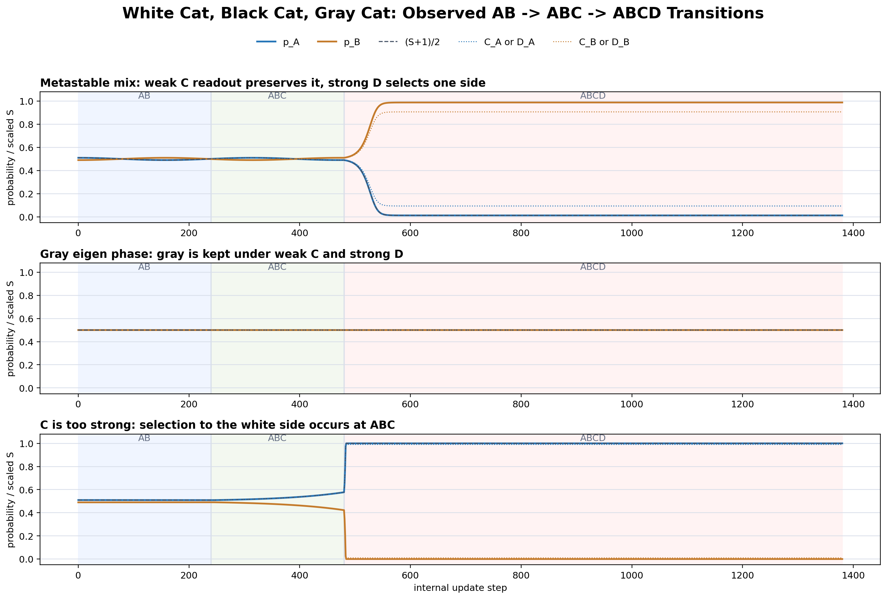

# Reading White Cats, Black Cats, and Gray Cats in a Closed Wave System

I have published a new paper.

The theme this time is white cats, black cats, and gray cats.

Of course, this is not an experiment with real cats.

In this article, a white cat and a black cat are names for two allocation states inside a closed wave system.

The white-cat state is A.

The black-cat state is B.

The intermediate-looking state is called a gray cat.

The question is close to a famous one.

Is the cat in the box white?

Is it black?

Or is it in a state that is not yet simply white or black before observation?

However, this experiment does not claim to reproduce Schrodinger's cat itself.

The question here is more limited.

I numerically tested whether a nearly half-white and half-black allocation state can be constructed inside a closed complex-phase system that does not assume even background spacetime first, and how that state changes under weak readout and strong observation.

The full paper, English translation, TeX/PDF files, execution scripts, figures, and result data are available on Zenodo.

Concept DOI:
https://doi.org/10.5281/zenodo.21353208

This version:
https://doi.org/10.5281/zenodo.21353209

Zenn article:
https://zenn.dev/noriaki_kihara/articles/gray-cat-metastable-observation

## What Was Tested

The model has two states, A and B.

If A dominates, I read it as a white cat.

If B dominates, I read it as a black cat.

If A and B are nearly balanced, I read it as a gray cat.

The important point is that A and B are not labels attached from the outside.

In this series, space and time are not assumed first. Instead, quantities that look like position, time, and acceleration are read from complex waves, phases, interference, and readout waves.

This experiment follows the same rule.

White cats, black cats, and gray cats are also read as internal allocation states of a closed wave system.

The experiment has three stages.

First, I construct the AB system.

Next, I add a weak readout wave C.

Finally, I add a strong observation wave D.

Here, C and D are not human observers outside the system.

They are waves placed inside the same closed system.

C is a weak readout wave.

D is a strong observation wave.

Using this difference, I tested whether a gray-cat state can be read without breaking it, or whether it falls into a white-cat or black-cat state.

## Three Representative Patterns

The experiment produced three representative patterns.

The first pattern is a gray metastable state.

At the AB stage, the system is prepared as a mixture-like state of white and black.

When C reads it weakly, the state is not broken and can still be read as a mixed white-plus-black state.

But when D observes it strongly, it falls into either white or black.

The second pattern is a gray eigen phase.

In this case, the state does not merely look intermediate. It remains gray even under strong observation.

So it is not true that every gray-looking state must become white or black when strongly observed.

The third pattern appears when C is too strong.

C is supposed to be a weak readout wave.

But if the coupling of C is too strong, the system already falls into white or black at the ABC stage, before D is introduced.

This means that C and D are not fundamentally different kinds of special devices.

The difference is whether the coupling reads weakly or acts strongly.

Depending on the strength, the same kind of internal wave can behave as readout or as selection.

## The Gray Cat Was Not a Single Kind of State

The most interesting result was that the gray cat was not a single kind of state.

Even when the state looked half-white and half-black, it separated into two types.

One type is the gray metastable phase.

With weak readout, it remains gray.

With strong observation, it falls into white or black.

The other type is the gray eigen phase.

With weak readout, it is gray.

With strong observation, it is still gray.

In this case, it is better to read gray itself as a state, rather than as something that must choose either white or black.

This distinction is not just a play on words.

The computed values separated these three patterns clearly.

In the upper panel, the intermediate state is preserved during weak C readout, and then falls to one side when D is introduced.

In the middle panel, the intermediate state remains even after D is introduced.

In the lower panel, C is too strong, so the state already falls to one side before D.

Seeing these three patterns in the same numerical readout is the main result of this experiment.

## Reading and Selecting Are Not the Same

In ordinary language, one often says that observation determines the state.

But this result suggests a more careful wording.

With weak readout, a gray metastable state can sometimes be read without being broken.

With strong observation, the same metastable state can fall into white or black.

So being able to read a state and causing a selection are not the same thing.

This does not mean that observation and interaction are completely separate physical processes.

In this model, observation is also a kind of interaction.

C and D are not outside observers. They are waves inside the system.

If the interaction is weak, it can sometimes read the state without breaking it.

If the interaction is strong, it can push the state toward white or black.

That is the natural reading of this experiment.

## If the State Becomes White, Does the Black Cat Disappear?

This point is also important.

When the system falls into the white-cat state, it does not mean that two cats, one white and one black, have split apart.

It means that the allocation has moved almost entirely to the white side, while the black-side allocation has become very small.

If the system falls into the black-cat state, the reverse happens.

However, because the system is closed, the total amount is conserved.

Nothing suddenly disappears or appears from outside.

The allocation between A and B shifts strongly to one side.

That one-sided allocation is read as a white cat or a black cat.

## What This Does Not Claim

To avoid misunderstanding, I want to be clear about the scope.

This paper does not solve the general measurement problem of quantum mechanics.

It does not claim that real cats are in a white-black superposition.

It also does not claim to construct a complete physical model of Schrodinger's cat.

The claim is much more limited.

In a closed complex-phase system, it is possible to construct an A/B allocation state that looks gray, and there are conditions under which weak readout preserves it while strong observation makes it fall into white or black.

Also, among gray-looking states, there are cases that remain gray even under strong observation.

That is the scope of this result.

## Summary

In this numerical experiment, I used the metaphor of white cats, black cats, and gray cats to study metastable states and observation response in a closed wave system.

The result was very interesting.

A gray-looking state was not just one thing.

There was a gray metastable phase that could be read as gray under weak readout but selected as white or black under strong observation.

There was also a gray eigen phase that remained gray even under strong observation.

In addition, when the readout wave C was too strong, the system fell into white or black before D was introduced.

So the result is not a story where an outside observer is special and therefore determines the state.

In this model, weak interaction can read, and strong interaction can select.

The boundary between these two behaviors was read through the white-cat, black-cat, and gray-cat states.

This is still a preliminary experiment.

But as an entry point for re-reading difficult questions such as wave-packet collapse and observation response as a phase diagram inside a closed system without assuming background spacetime first, I think it is a very interesting result.

----

The full paper, English translation, TeX/PDF files, execution scripts, figures, and result data are available on Zenodo.

Concept DOI:
https://doi.org/10.5281/zenodo.21353208

Version DOI:
https://doi.org/10.5281/zenodo.21353209

Zenn article:
https://zenn.dev/noriaki_kihara/articles/gray-cat-metastable-observation

<!-- pdf-links -->
The paper PDFs can be downloaded directly from the public repository.

- gray_cat_metastable_interface_ab_c_d_stage_experiment_spec_v1_en.pdf
  https://raw.githubusercontent.com/WurabeSeiji/ai-chat-logs-open/main/波の情報読出し/20260714/gray_cat_metastable_interface_ab_c_d_stage_experiment_spec_v1_en.pdf
- gray_cat_metastable_interface_ab_c_d_stage_experiment_spec_v1_ja.pdf
  https://raw.githubusercontent.com/WurabeSeiji/ai-chat-logs-open/main/波の情報読出し/20260714/gray_cat_metastable_interface_ab_c_d_stage_experiment_spec_v1_ja.pdf
- gray_cat_metastable_observation_preliminary_summary_en.pdf
  https://raw.githubusercontent.com/WurabeSeiji/ai-chat-logs-open/main/波の情報読出し/20260714/gray_cat_metastable_observation_preliminary_summary_en.pdf
- gray_cat_metastable_observation_preliminary_summary_ja.pdf
  https://raw.githubusercontent.com/WurabeSeiji/ai-chat-logs-open/main/波の情報読出し/20260714/gray_cat_metastable_observation_preliminary_summary_ja.pdf

Repository: https://github.com/WurabeSeiji/ai-chat-logs-open

#Physics #QuantumMechanics #SchrodingersCat #WavePacketCollapse #MeasurementProblem #ComplexNumbers #WaveInterference #ClosedSystem #Simulation #IndependentResearch #Zenodo #Science
