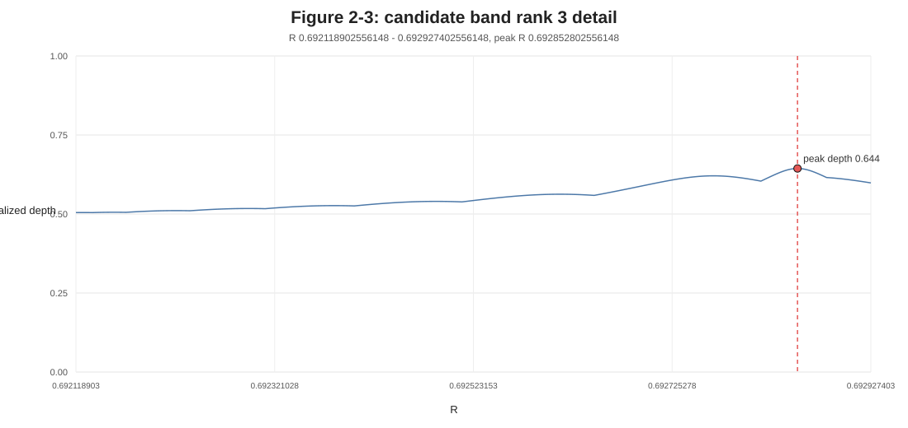
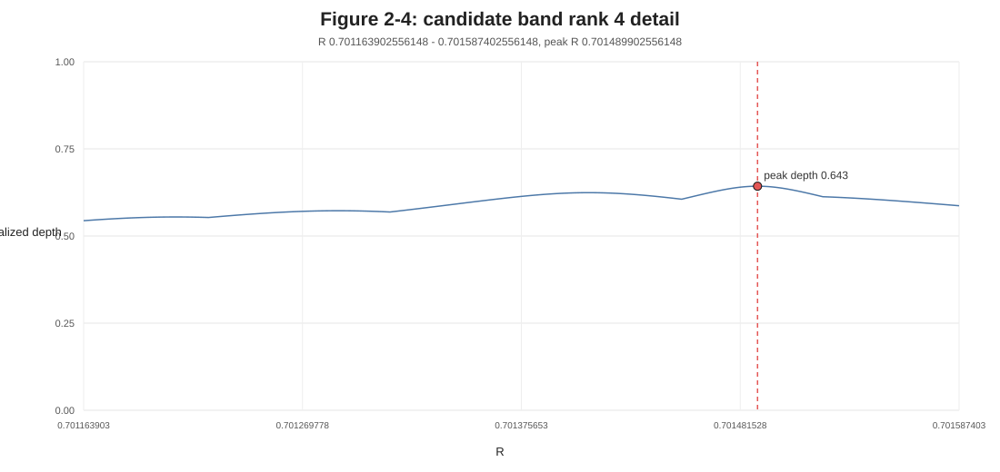
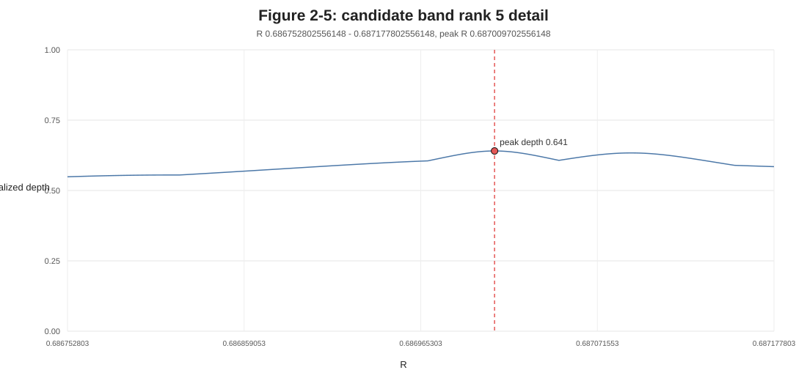
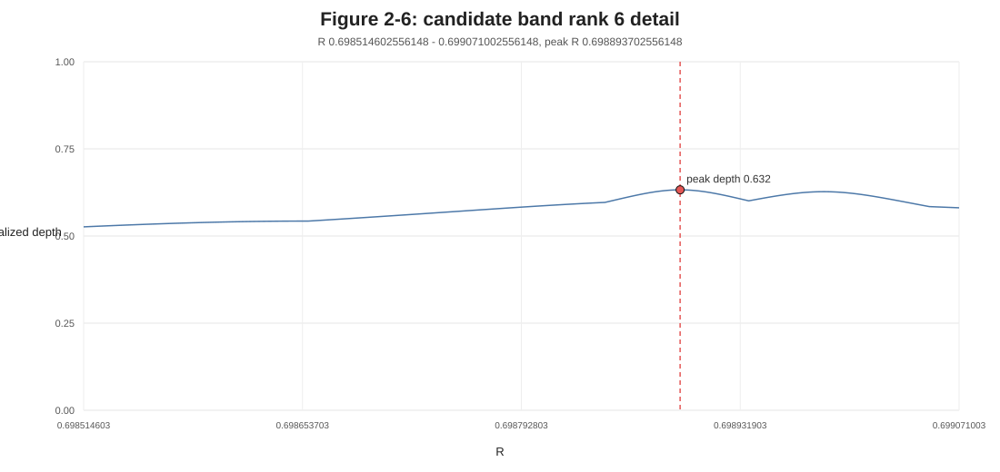
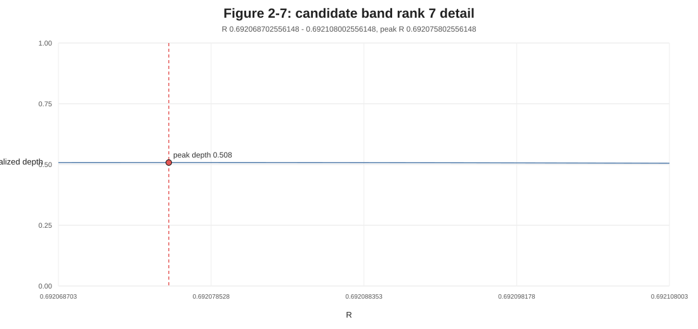

# System B 全域 R スイープ候補帯一覧

本稿は、System B の最小版直接指定実験 `v5` により、高エネルギー側から極低エネルギー側までを同じ刻み幅で掃引した結果を、候補帯単位で整理する。

全候補点は CSV に保持し、本文では連続する候補点を 1 つの候補帯として扱う。
順位は、候補帯内の最大 `best_prefix_gray_depth_no_phase` を基準に、深さの降順で付与する。

## 実験条件

| 項目 | 値 |
|---|---:|
| `min_R` | `0.68660290255614798` |
| `max_R` | `0.70246536756843059` |
| `delta_R` | `0.0000001` |
| `n_R` | `158625` |
| `n_candidates` | `32119` |
| `total_loop_count` | `41071212` |
| `elapsed_sec` | `37.203884583000004` |
| `average_msec_per_R` | `0.2345398555271868` |
| `phi_mode` | `zero` |
| `steps` | `1024` |
| `min_steps` | `256` |
| `early_stop_patience` | `20` |

## 表1 候補帯一覧

深さは `best_prefix_gray_depth_no_phase` であり、`normalized_depth` は全候補帯の最大深さを 1 として正規化した値である。

| 順位 | 元帯 | R_start | R_end | 点数 | peak_R | depth | normalized_depth | error | best_step | condition |
|---:|---:|---:|---:|---:|---:|---:|---:|---:|---:|---|
| 1 | 5 | 0.697060302556148 | 0.697625902556148 | 5657 | 0.697177902556148 | 9.08320492077 | 1.000000 | 8.2564827757e-10 | 247 | `phi0_s0.01_g0` |
| 2 | 2 | 0.688146602556148 | 0.688539502556148 | 3930 | 0.688363902556148 | 8.84756342227 | 0.974057 | 1.42048475699e-09 | 243 | `phi0_s0.01_g0` |
| 3 | 4 | 0.692118902556148 | 0.692927402556148 | 8086 | 0.692852802556148 | 5.84993869466 | 0.644039 | 1.41273695357e-06 | 245 | `phi0_s0.01_g0` |
| 4 | 7 | 0.701163902556148 | 0.701587402556148 | 4236 | 0.701489902556148 | 5.83931992499 | 0.642870 | 1.44770500223e-06 | 249 | `phi0_s0.01_g0` |
| 5 | 1 | 0.686752802556148 | 0.687177802556148 | 4251 | 0.687009702556148 | 5.81816843379 | 0.640541 | 1.51995792535e-06 | 253 | `phi0_s0.01_g0` |
| 6 | 6 | 0.698514602556148 | 0.699071002556148 | 5565 | 0.698893702556148 | 5.74438302514 | 0.632418 | 1.80142827401e-06 | 237 | `phi0_s0.01_g0` |
| 7 | 3 | 0.692068702556148 | 0.692108002556148 | 394 | 0.692075802556148 | 4.61388675601 | 0.507958 | 2.43283829852e-05 | 255 | `phi0_s0.01_g0` |

## 図1 候補帯順位

横軸は、全体最大を 1 とした正規化深さである。縦軸は深さの順位である。右端には各候補帯の `R` 範囲を示す。


## 図2 候補帯詳細

各図の横軸は `R`、縦軸は図1と同じ正規化深さである。

### 図2-1 順位 1

- `R_start`: `0.697060302556148`
- `R_end`: `0.697625902556148`
- `peak_R`: `0.697177902556148`
- `normalized_depth`: `1.000000`


### 図2-2 順位 2

- `R_start`: `0.688146602556148`
- `R_end`: `0.688539502556148`
- `peak_R`: `0.688363902556148`
- `normalized_depth`: `0.974057`


### 図2-3 順位 3

- `R_start`: `0.692118902556148`
- `R_end`: `0.692927402556148`
- `peak_R`: `0.692852802556148`
- `normalized_depth`: `0.644039`



### 図2-4 順位 4

- `R_start`: `0.701163902556148`
- `R_end`: `0.701587402556148`
- `peak_R`: `0.701489902556148`
- `normalized_depth`: `0.642870`



### 図2-5 順位 5

- `R_start`: `0.686752802556148`
- `R_end`: `0.687177802556148`
- `peak_R`: `0.687009702556148`
- `normalized_depth`: `0.640541`



### 図2-6 順位 6

- `R_start`: `0.698514602556148`
- `R_end`: `0.699071002556148`
- `peak_R`: `0.698893702556148`
- `normalized_depth`: `0.632418`



### 図2-7 順位 7

- `R_start`: `0.692068702556148`
- `R_end`: `0.692108002556148`
- `peak_R`: `0.692075802556148`
- `normalized_depth`: `0.507958`



## 図3 全域図

横軸は全スイープ範囲、縦軸は図1と同じ正規化深さである。詳細な形状は図2で確認する。


## 再現手順

入力 CSV は次である。

```text
波の情報読出し/20260715/minimal_system_B_gray_bugcheck_result_v1/direct_depth_probe_v5_sweep_control/high_to_ext_full_delta1e-7_candidates_v5.csv
波の情報読出し/20260715/minimal_system_B_gray_bugcheck_result_v1/direct_depth_probe_v5_sweep_control/high_to_ext_full_delta1e-7_stats_v5.csv
```

処理手順は以下である。

1. `high_to_ext_full_delta1e-7_candidates_v5.csv` を `csv.DictReader` で読む。
2. `R` の差が `1.5e-7` より大きい箇所で候補帯を分割する。
3. 各候補帯について `best_prefix_gray_depth_no_phase` が最大の行を代表点とする。
4. 候補帯代表点を `best_prefix_gray_depth_no_phase` の降順で並べ、順位を付ける。
5. 全候補帯の最大深さで割り、`normalized_depth` を求める。
6. 図1、図2-1 から 図2-7、図3を同じ正規化基準で描く。
