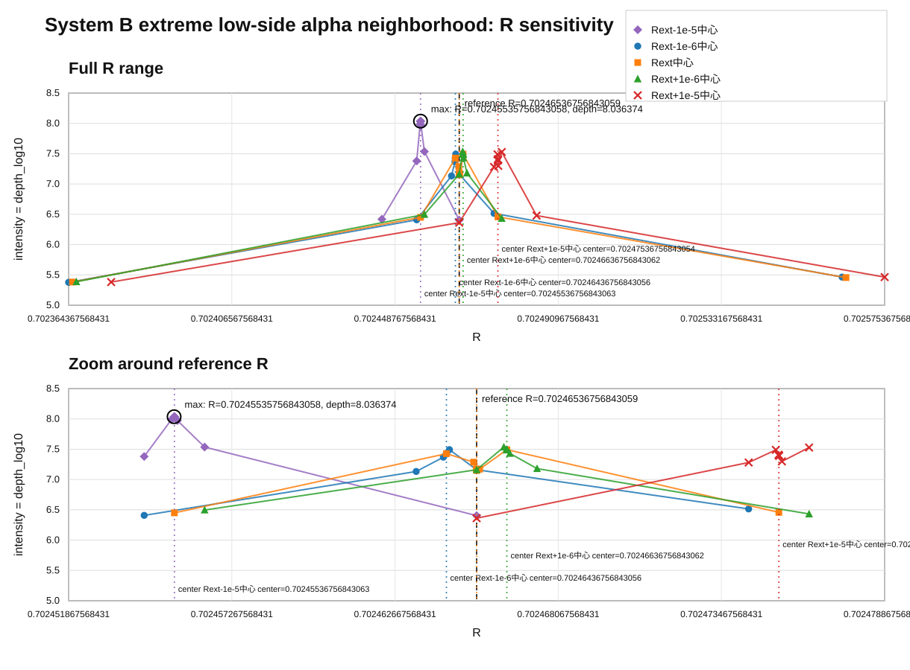

# System B 極低エネルギー標準α近傍 R 感度一覧

本表は、低エネルギー側 R を中間値 `Rm` から見て外側へ対称に延長した値 `Rext` 近傍で行った 5 つの実験結果を統合し、`R` の昇順に並べたものである。

- `Rext-1e-5中心`
- `Rext-1e-6中心`
- `Rext中心`
- `Rext+1e-6中心`
- `Rext+1e-5中心`

基準値は次である。

```text
R_high = 0.68660290255614798
Rm     = 0.69189039089357551
R_low  = 0.69717787923100305
Rext   = R_low + (R_low - Rm) = 0.702465367568430585
```

ここでは、各点の絶対的な深さとして `fixed_step_depth_log10` を用いる。
`fixed_step_error` が小さいほど深く、`fixed_step_depth_log10` が大きいほど深い。

## 図

横軸を `R`、縦軸を強度 `fixed_step_depth_log10` として図化した。
上段は全域、下段は中央近傍の拡大である。
黒破線は極低エネルギー側基準 R `R = 0.702465367568430585` を示す。
系列色の縦点線は、それぞれの実験で中心として指定した `center_R` を示す。



| 実験 | case | R | center_R | delta_R | fixed_step_error | depth_log10 | condition |
|---|---|---:|---:|---:|---:|---:|---|
| Rext-1e-6中心 | delta_m1em04 | 0.70236436756843057 | 0.70246436756843056 | -0.0001 | 4.192645e-06 | 5.377512 | phi0_s0.01_g0 |
| Rext中心 | delta_m1em04 | 0.7023653675684306 | 0.70246536756843059 | -0.0001 | 4.146662e-06 | 5.382301 | phi1_s0.01_g0 |
| Rext+1e-6中心 | delta_m1em04 | 0.70236636756843063 | 0.70246636756843062 | -0.0001 | 4.102605e-06 | 5.386940 | phi0_s0.01_g0 |
| Rext+1e-5中心 | delta_m1em04 | 0.70237536756843055 | 0.70247536756843054 | -0.0001 | 4.147419e-06 | 5.382222 | phi1_s0.01_g0 |
| Rext-1e-5中心 | delta_m1em05 | 0.70244536756843068 | 0.70245536756843063 | -1e-05 | 3.812350e-07 | 6.418807 | phi0_s0.01_g0 |
| Rext-1e-5中心 | delta_m1em06 | 0.7024543675684306 | 0.70245536756843063 | -1e-06 | 4.172489e-08 | 7.379605 | phi0_s0.01_g0 |
| Rext-1e-6中心 | delta_m1em05 | 0.7024543675684306 | 0.70246436756843056 | -1e-05 | 3.899976e-07 | 6.408938 | phi0_s0.01_g0 |
| Rext-1e-5中心 | delta_m1em07 | 0.70245526756843069 | 0.70245536756843063 | -1e-07 | 1.030569e-08 | 7.986923 | phi0_s0.01_g0 |
| Rext-1e-5中心 | delta_m1em08 | 0.70245535756843058 | 0.70245536756843063 | -1e-08 | 9.196582e-09 | 8.036374 | phi0_s0.01_g0 |
| Rext-1e-5中心 | delta_m1em09 | 0.70245536656843066 | 0.70245536756843063 | -1e-09 | 9.199172e-09 | 8.036251 | phi1_s0.01_g0 |
| Rext-1e-5中心 | center | 0.70245536756843063 | 0.70245536756843063 | 0 | 9.200726e-09 | 8.036178 | phi0_s0.01_g0 |
| Rext中心 | delta_m1em05 | 0.70245536756843063 | 0.70246536756843059 | -1e-05 | 3.547397e-07 | 6.450090 | phi0_s0.01_g0 |
| Rext-1e-5中心 | delta_p1em09 | 0.7024553685684306 | 0.70245536756843063 | 1e-09 | 9.202548e-09 | 8.036092 | phi1_s0.01_g0 |
| Rext-1e-5中心 | delta_p1em08 | 0.70245537756843068 | 0.70245536756843063 | 1e-08 | 9.230362e-09 | 8.034781 | phi1_s0.01_g0 |
| Rext-1e-5中心 | delta_p1em07 | 0.70245546756843058 | 0.70245536756843063 | 1e-07 | 1.064346e-08 | 7.972917 | phi1_s0.01_g0 |
| Rext-1e-5中心 | delta_p1em06 | 0.70245636756843066 | 0.70245536756843063 | 1e-06 | 2.914157e-08 | 7.535487 | phi0_s0.01_g0 |
| Rext+1e-6中心 | delta_m1em05 | 0.70245636756843066 | 0.70246636756843062 | -1e-05 | 3.182257e-07 | 6.497265 | phi0_s0.01_g0 |
| Rext-1e-6中心 | delta_m1em06 | 0.70246336756843053 | 0.70246436756843056 | -1e-06 | 7.366253e-08 | 7.132753 | phi0_s0.01_g0 |
| Rext-1e-6中心 | delta_m1em07 | 0.70246426756843061 | 0.70246436756843056 | -1e-07 | 4.277179e-08 | 7.368843 | phi1_s0.01_g0 |
| Rext-1e-6中心 | delta_m1em08 | 0.70246435756843051 | 0.70246436756843056 | -1e-08 | 3.806317e-08 | 7.419495 | phi0_s0.01_g0 |
| Rext-1e-6中心 | center | 0.70246436756843056 | 0.70246436756843056 | 0 | 3.742793e-08 | 7.426804 | phi1_s0.01_g0 |
| Rext中心 | delta_m1em06 | 0.70246436756843056 | 0.70246536756843059 | -1e-06 | 3.742793e-08 | 7.426804 | phi1_s0.01_g0 |
| Rext-1e-6中心 | delta_p1em08 | 0.70246437756843061 | 0.70246436756843056 | 1e-08 | 3.681208e-08 | 7.434010 | phi1_s0.01_g0 |
| Rext-1e-6中心 | delta_p1em07 | 0.70246446756843051 | 0.70246436756843056 | 1e-07 | 3.214240e-08 | 7.492922 | phi1_s0.01_g0 |
| Rext中心 | delta_m1em07 | 0.70246526756843064 | 0.70246536756843059 | -1e-07 | 5.162480e-08 | 7.287142 | phi0_s0.01_g0 |
| Rext中心 | delta_m1em08 | 0.70246535756843054 | 0.70246536756843059 | -1e-08 | 6.701617e-08 | 7.173820 | phi0_s0.01_g0 |
| Rext-1e-5中心 | delta_p1em05 | 0.70246536756843059 | 0.70245536756843063 | 1e-05 | 3.940147e-07 | 6.404488 | phi1_s0.01_g0 |
| Rext-1e-6中心 | delta_p1em06 | 0.70246536756843059 | 0.70246436756843056 | 1e-06 | 6.891497e-08 | 7.161686 | phi1_s0.01_g0 |
| Rext中心 | center | 0.70246536756843059 | 0.70246536756843059 | 0 | 6.891497e-08 | 7.161686 | phi1_s0.01_g0 |
| Rext+1e-6中心 | delta_m1em06 | 0.70246536756843059 | 0.70246636756843062 | -1e-06 | 6.891497e-08 | 7.161686 | phi1_s0.01_g0 |
| Rext+1e-5中心 | delta_m1em05 | 0.70246536756843059 | 0.70247536756843054 | -1e-05 | 4.341970e-07 | 6.362313 | phi1_s0.01_g0 |
| Rext中心 | delta_p1em08 | 0.70246537756843064 | 0.70246536756843059 | 1e-08 | 7.085150e-08 | 7.149651 | phi1_s0.01_g0 |
| Rext中心 | delta_p1em07 | 0.70246546756843053 | 0.70246536756843059 | 1e-07 | 6.750160e-08 | 7.170686 | phi0_s0.01_g0 |
| Rext+1e-6中心 | delta_m1em07 | 0.70246626756843067 | 0.70246636756843062 | -1e-07 | 2.911403e-08 | 7.535898 | phi1_s0.01_g0 |
| Rext+1e-6中心 | delta_m1em08 | 0.70246635756843057 | 0.70246636756843062 | -1e-08 | 3.178947e-08 | 7.497717 | phi0_s0.01_g0 |
| Rext中心 | delta_p1em06 | 0.70246636756843062 | 0.70246536756843059 | 1e-06 | 3.217893e-08 | 7.492428 | phi0_s0.01_g0 |
| Rext+1e-6中心 | center | 0.70246636756843062 | 0.70246636756843062 | 0 | 3.217893e-08 | 7.492428 | phi0_s0.01_g0 |
| Rext+1e-6中心 | delta_p1em09 | 0.70246636856843059 | 0.70246636756843062 | 1e-09 | 3.221888e-08 | 7.491890 | phi0_s0.01_g0 |
| Rext+1e-6中心 | delta_p1em08 | 0.70246637756843067 | 0.70246636756843062 | 1e-08 | 3.258682e-08 | 7.486958 | phi0_s0.01_g0 |
| Rext+1e-6中心 | delta_p1em07 | 0.70246646756843056 | 0.70246636756843062 | 1e-07 | 3.708749e-08 | 7.430773 | phi0_s0.01_g0 |
| Rext+1e-6中心 | delta_p1em06 | 0.70246736756843065 | 0.70246636756843062 | 1e-06 | 6.606147e-08 | 7.180052 | phi1_s0.01_g0 |
| Rext-1e-6中心 | delta_p1em05 | 0.70247436756843051 | 0.70246436756843056 | 1e-05 | 3.056252e-07 | 6.514811 | phi1_s0.01_g0 |
| Rext+1e-5中心 | delta_m1em06 | 0.70247436756843051 | 0.70247536756843054 | -1e-06 | 5.234943e-08 | 7.281088 | phi1_s0.01_g0 |
| Rext+1e-5中心 | delta_m1em07 | 0.70247526756843059 | 0.70247536756843054 | -1e-07 | 3.242172e-08 | 7.489164 | phi1_s0.01_g0 |
| Rext+1e-5中心 | delta_m1em08 | 0.70247535756843049 | 0.70247536756843054 | -1e-08 | 3.899852e-08 | 7.408952 | phi0_s0.01_g0 |
| Rext中心 | delta_p1em05 | 0.70247536756843054 | 0.70246536756843059 | 1e-05 | 3.482729e-07 | 6.458080 | phi0_s0.01_g0 |
| Rext+1e-5中心 | center | 0.70247536756843054 | 0.70247536756843054 | 0 | 3.987466e-08 | 7.399303 | phi0_s0.01_g0 |
| Rext+1e-5中心 | delta_p1em08 | 0.70247537756843059 | 0.70247536756843054 | 1e-08 | 4.077987e-08 | 7.389554 | phi1_s0.01_g0 |
| Rext+1e-5中心 | delta_p1em07 | 0.70247546756843049 | 0.70247536756843054 | 1e-07 | 5.023512e-08 | 7.298993 | phi1_s0.01_g0 |
| Rext+1e-6中心 | delta_p1em05 | 0.70247636756843057 | 0.70246636756843062 | 1e-05 | 3.696831e-07 | 6.432170 | phi0_s0.01_g0 |
| Rext+1e-5中心 | delta_p1em06 | 0.70247636756843057 | 0.70247536756843054 | 1e-06 | 2.964431e-08 | 7.528059 | phi0_s0.01_g0 |
| Rext+1e-5中心 | delta_p1em05 | 0.7024853675684305 | 0.70247536756843054 | 1e-05 | 3.319857e-07 | 6.478881 | phi0_s0.01_g0 |
| Rext-1e-6中心 | delta_p1em04 | 0.70256436756843055 | 0.70246436756843056 | 0.0001 | 3.433732e-06 | 5.464234 | phi0_s0.01_g0 |
| Rext中心 | delta_p1em04 | 0.70256536756843058 | 0.70246536756843059 | 0.0001 | 3.500217e-06 | 5.455905 | phi1_s0.01_g0 |
| Rext+1e-5中心 | delta_p1em04 | 0.70257536756843053 | 0.70247536756843054 | 0.0001 | 3.437615e-06 | 5.463743 | phi0_s0.01_g0 |

## 再現手順

次の 5 つの CSV を入力にする。

```text
波の情報読出し/20260715/minimal_system_B_gray_bugcheck_result_v1/log_sensitivity_alpha_low_standard_theory_outer_symmetric_minus1e-5_v4/minimal_system_B_gray_direct_R_log_sensitivity_summary_v4.csv
波の情報読出し/20260715/minimal_system_B_gray_bugcheck_result_v1/log_sensitivity_alpha_low_standard_theory_outer_symmetric_minus1e-6_v4/minimal_system_B_gray_direct_R_log_sensitivity_summary_v4.csv
波の情報読出し/20260715/minimal_system_B_gray_bugcheck_result_v1/log_sensitivity_alpha_low_standard_theory_outer_symmetric_v4/minimal_system_B_gray_direct_R_log_sensitivity_summary_v4.csv
波の情報読出し/20260715/minimal_system_B_gray_bugcheck_result_v1/log_sensitivity_alpha_low_standard_theory_outer_symmetric_plus1e-6_v4/minimal_system_B_gray_direct_R_log_sensitivity_summary_v4.csv
波の情報読出し/20260715/minimal_system_B_gray_bugcheck_result_v1/log_sensitivity_alpha_low_standard_theory_outer_symmetric_plus1e-5_v4/minimal_system_B_gray_direct_R_log_sensitivity_summary_v4.csv
```

処理手順は以下である。

1. 各 CSV を `csv.DictReader` で読む。
2. 実験ラベルを付与する。
3. `R` を数値として読み、全行を 1 つの配列へ結合する。
4. 結合した配列を `R` の昇順でソートする。
5. `fixed_step_error` と `fixed_step_depth_log10` を絶対深さの指標として表に出す。
