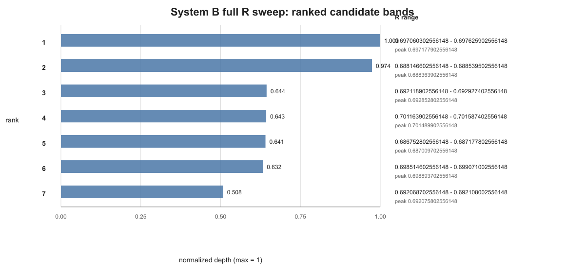
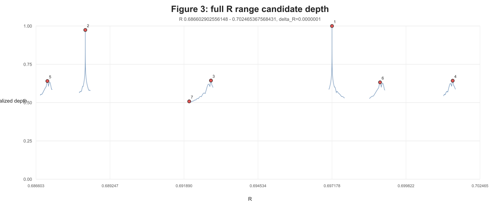

# 波束の収縮を調べていたら、なぜか137が出てきた

新しい論文を公開しました。

今回のテーマは、少し不思議です。

最初から微細構造定数アルファを調べようとしていたわけではありません。

もともとは、波束の収縮や、白猫・黒猫・灰色猫の実験で気になった点を、もう少し詳しく調べていました。

広がった波が、局在した波と相互作用すると、なぜ局在した状態へ近づくのか。

白猫と黒猫が混ざったような灰色猫状態は、どのくらいの相互作用で現れやすいのか。

そういう問いを、背景の時空すら先に置かない閉じた波の系で調べていました。

ところが、相互作用の強さを細かく変えていくと、理論物理学で有名な数字が、なぜか出てきました。

それが、微細構造定数アルファの逆数、およそ137です。

さらに、もう一つ面白いことに、高エネルギー領域で現れるアルファの逆数、およそ128に近い候補も見えてきました。

もちろん、今回の論文は「微細構造定数を完全に導出した」という主張ではありません。

ただ、かなり単純な閉じた交換写像の実験から、標準理論で非常に重要な二つの数値領域に近い候補が現れた。

これは、少なくとも詳しく調べる価値のある結果だと考えています。

正式版の論文、英訳、TeX/PDF、実行スクリプト、図、結果データは Zenodo に公開しています。

Concept DOI（常に最新版）:  
https://doi.org/10.5281/zenodo.21396760

この版:  
https://doi.org/10.5281/zenodo.21396761

Zenn 記事:  
https://zenn.dev/noriaki_kihara/articles/exchange-weight-alpha-correspondence

## そもそも137とは何か

物理では、電磁気の強さを表す重要な定数があります。

それが微細構造定数アルファです。

アルファは、およそ137分の1です。

つまり、アルファの逆数は、およそ137になります。

この137は、物理学の中でもかなり有名な数字です。

なぜこの値なのか。

なぜ136でも138でもなく、約137なのか。

これは、今でもとても深い問いです。

さらに、この値は完全に固定されたものではありません。

高エネルギー領域では、電磁相互作用の強さは少し変わり、アルファの逆数は128付近になります。

つまり、低エネルギーでは約137。

高エネルギーでは約128。

この二つの数字は、標準理論の中で非常に重要です。

## 今回調べていたのは、アルファそのものではない

今回の実験では、最初からアルファを入れたわけではありません。

調べていたのは、もっと素朴なことです。

AとBという二つの波がある。

この二つが相互作用するとき、どれくらい相手側へ状態が移るのか。

これを、ここでは「交換重み」と呼びました。

論文では、相互作用のつまみとしてRを使っています。

Rが大きければ、自分側に残る割合が大きい。

一マイナスRが大きければ、相手側へ状態が移る割合が大きい。

今回の主役は、Rそのものではありません。

相手側へ状態がどれだけ移るか。

つまり、交換の成立度です。

## きっかけは波束の集束だった

少し前の実験では、広がった波と局在した波を相互作用させました。

広くぼんやり広がった波A。

鋭く局在した波B。

この二つをフェルミオン的な中間散乱で繰り返し相互作用させると、Aの側にも局在性が移りました。

これは、波束の収縮や集束を考えるうえで、かなり面白い結果でした。

ただ、そこで経験的に効いていた値がありました。

それが、Rがおよそ0.70付近という値です。

なぜ、このあたりが効くのか。

ここが気になりました。

## もう一つのきっかけは、白猫・黒猫・灰色猫だった

次に、白猫・黒猫・灰色猫の実験を行いました。

ここでいう白猫と黒猫は、本物の猫ではありません。

閉じた波の系の中の二つの状態AとBを、分かりやすく呼んだものです。

Aが強ければ白猫。

Bが強ければ黒猫。

AとBが混ざった状態を灰色猫。

この実験では、灰色猫のような準安定状態が、どの相互作用の強さで現れやすいかを調べました。

ここでも、やはりRがおよそ0.70付近という値が気になりました。

つまり、波束の局在性交換でも、灰色猫の準安定界面でも、同じような値が出てきたのです。

では、これは偶然なのか。

それとも、閉じた交換写像そのものが、何か固有の重みを選んでいるのか。

今回の論文は、ここを調べたものです。

## 倍音が一つでもあると、値が立ち上がる

まず、局在性交換の実験で、倍音の条件を変えました。

ここでいう倍音は、波形を鋭くしたり、局在性を持たせたりするための追加の振動成分です。

結果は意外でした。

奇数倍音でなければならない、というわけではありませんでした。

偶数倍音でもよい。

奇数と偶数が混ざってもよい。

位相が少しずれてもよい。

波長が多少ずれてもよい。

振幅が非常に小さくてもよい。

しかし、倍音が完全にゼロになると、鋭い候補は消えました。

つまり、細かい形よりも、追加自由度が一つでもあるかどうかが効いているように見えました。

これはかなり重要です。

波の形を精密に合わせたから出た値ではなく、追加の振動自由度があること自体が、交換重みの選別に関係している可能性があるからです。

## 広く掃引すると、二つの深い候補が出た

次に、灰色猫の準安定界面を使って、Rを広い範囲で細かく掃引しました。

その結果、候補帯がいくつか現れました。

下の図は、その候補帯の深さを並べたものです。

一番深い候補は、低エネルギーの微細構造定数に対応する位置の近くに出ました。

これは、アルファの逆数がおよそ137になる領域です。

二番目に深い候補は、アルファの逆数がおよそ129.4になる領域に出ました。

これは、標準理論で高エネルギー領域に現れる128付近の値に近い領域です。

厳密に同じ値だとは言いません。

ただし、数値実験側の精度や、高エネルギー側の観測値の有効桁数を考えると、無視してよい偶然とも言い切れません。

全体の地形を見ると、二つの深い候補が目立ちます。

この図で一番深い候補が、低エネルギー側の137に対応する領域です。

二番目の候補が、高エネルギー側の128付近に近い領域です。

## これは「137を入れたら137が出た」ではない

ここは大事です。

今回の実験は、最初から137を入れて、その近くを探しただけではありません。

広い範囲を掃引しました。

その中で、交換が成立しやすい候補帯を探しました。

その結果として、一番深いところが、アルファの逆数137に対応する位置に現れました。

さらに、二番目に深いところが、高エネルギー側の128付近に近い領域に現れました。

もちろん、これだけで「微細構造定数を導出した」とは言えません。

しかし、閉じた交換写像が自分で選ぶ交換重みがあり、その値が現実の電磁結合と関係している可能性は出てきました。

## 今回の結果をどう読むか

私の現在の読み方は、こうです。

この論文の主役は、アルファそのものではありません。

主役は、状態交換です。

閉じた波の系の中で、状態が相手側へどれだけ移るのか。

その交換の重みが、なぜか特定の値へ集まる。

その値を、標準理論で使われる電磁結合の強さと比較すると、低エネルギー側の137と非常に近い。

さらに、高エネルギー側の128付近に近い候補も現れる。

こういう構造です。

つまり、「137を説明した」というより、「閉じた交換写像の中に、137に対応しそうな固有の交換重みが現れた」という方が正確です。

この違いは重要です。

前者は言いすぎです。

後者は、今回の数値実験で実際に見えたことです。

## 何を主張していないか

誤解を避けるために、ここははっきり書いておきます。

今回の論文は、微細構造定数を第一原理から完全に導出したものではありません。

標準理論を置き換えるものでもありません。

実在の電子散乱を直接計算したものでもありません。

また、高エネルギー側の候補が、Zボソン質量領域で測られるアルファと完全に同じだ、とも主張しません。

今回確認したのは、もっと限定されたことです。

閉じた複素位相系の交換写像で、状態交換の成立度を掃引すると、低エネルギーの微細構造定数に対応する候補帯が最深に現れた。

さらに、高エネルギー側の有効結合に近い候補帯も現れた。

この範囲の数値実験結果です。

## まとめ

波束の集束を調べていました。

白猫・黒猫・灰色猫の準安定状態を調べていました。

その過程で、相互作用の強さRがおよそ0.70付近で効くことが気になりました。

そこで、閉じた交換写像がどの交換重みを選ぶのかを詳しく調べました。

結果として、低エネルギーの微細構造定数、つまりアルファの逆数およそ137に対応する候補が、最も深い候補として現れました。

さらに、高エネルギー側のアルファの逆数およそ128に近い候補も現れました。

これはまだ最終結論ではありません。

しかし、閉じた波の系の中で、状態交換の重みが自発的に選ばれ、その値が現実の電磁結合とつながるかもしれない。

そう考えると、かなり面白い入口が開いたと思います。

――――

正式版の論文・英訳・TeX/PDF・実行スクリプト・図・結果データは Zenodo に公開しています。

Concept DOI:  
https://doi.org/10.5281/zenodo.21396760

Version DOI:  
https://doi.org/10.5281/zenodo.21396761

Zenn 記事:  
https://zenn.dev/noriaki_kihara/articles/exchange-weight-alpha-correspondence

#物理学 #量子力学 #微細構造定数 #137 #波束収縮 #波束集束 #複素数 #波動 #干渉 #フェルミオン #シミュレーション #独立研究 #Zenodo #サイエンス
