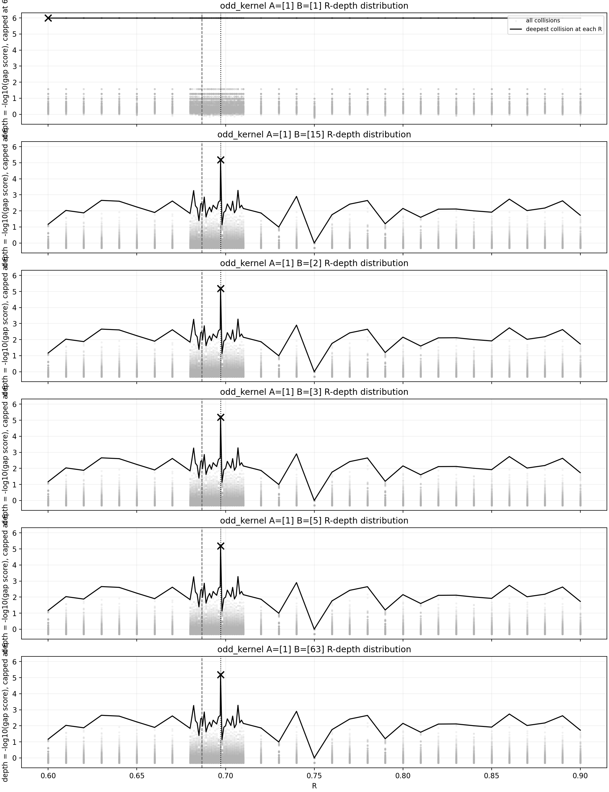
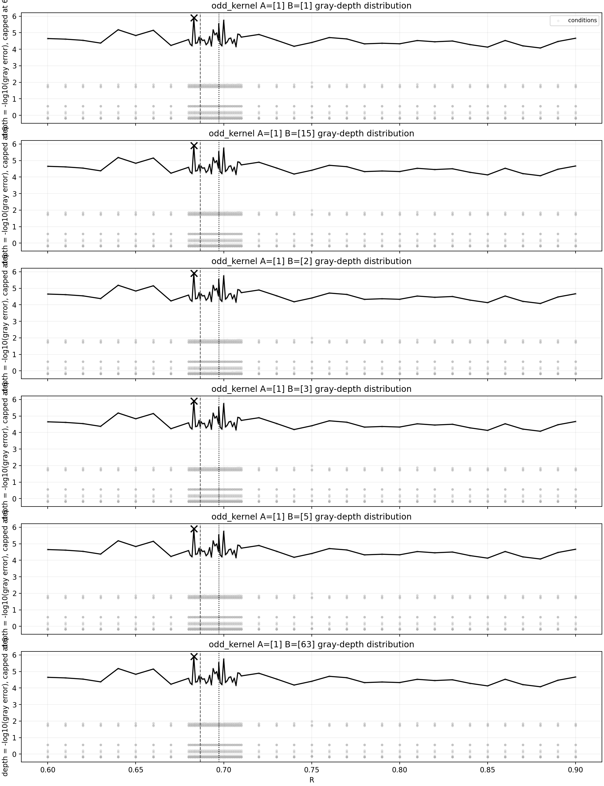
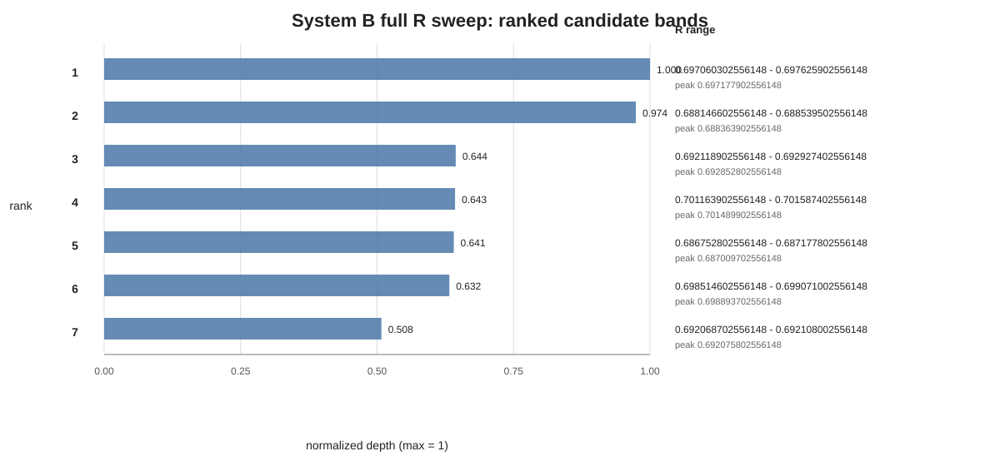
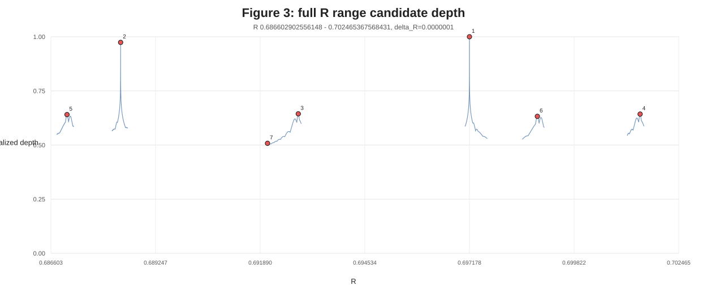
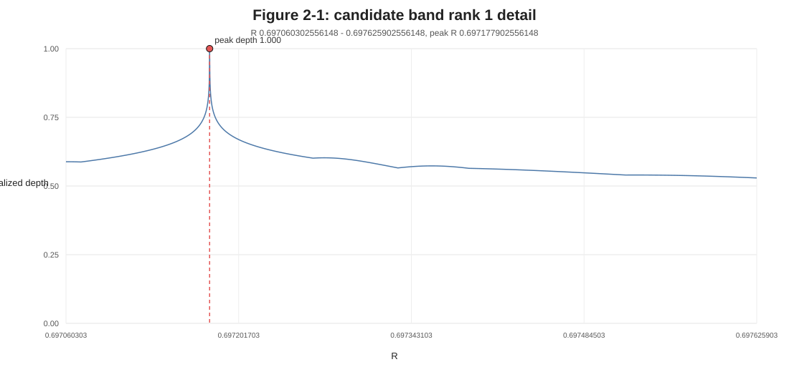
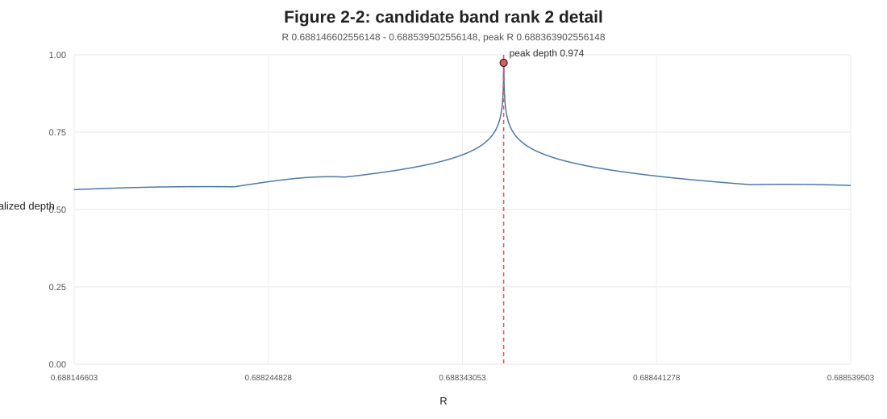
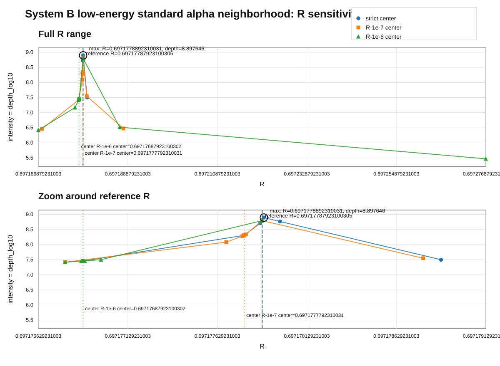
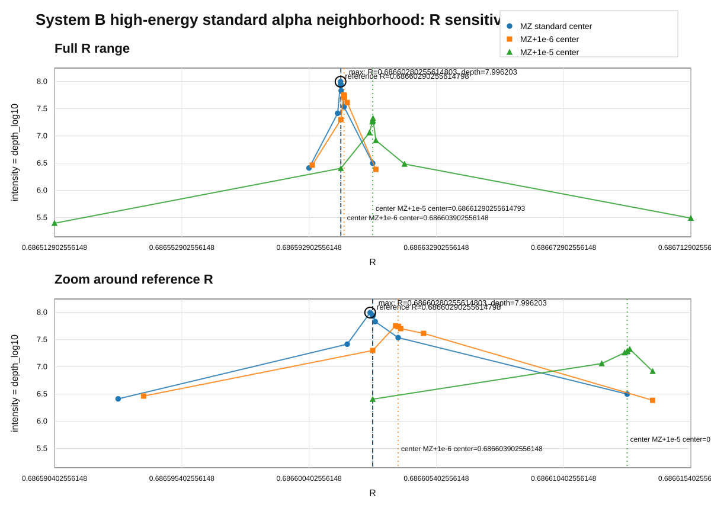
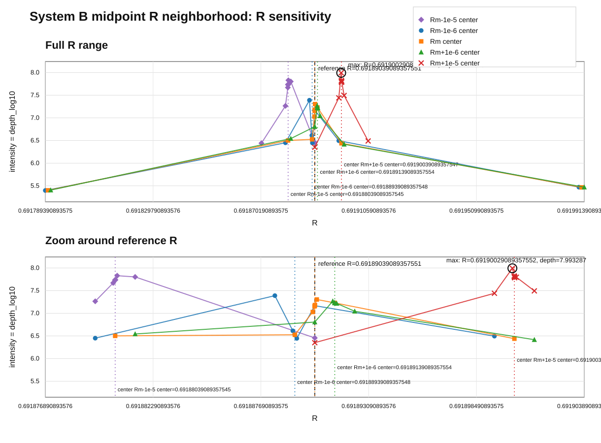

# 交換重みG_R=1-Rの選別と微細構造定数対応候補の数値実験 v1

**日付:** 2026-07-15  
**著者:** 木原 範昭  
**位置づけ:** 波の情報読出しシリーズ・交換重み選別実験総括  

---

## 概要

本稿では、背景空間を先に置かない閉鎖位相系において、フェルミオン的な交換散乱写像における状態交換の成立度を、代表量 `G_R=1-R` として読んだとき、どの条件で鋭く選別されるかを数値実験で調べる。ここで `R` は数値実験で掃引する反射係数であり、主に読む量は反射そのものではなく、状態が相手側へ移る交換量である。

本稿の主題は、微細構造定数との一致そのものではなく、少数の公理から構成した閉鎖交換写像が、状態交換の成立度を表す代表重みを自発的に選別するかどうかである。

出発点は二つである。

第一に、系統A、すなわち低局在性・倍音移乗読出し実験では、片側に高次倍音をもつ波と低局在波を交換散乱させると、倍音構造が相手側へ移り、低局在波が局在化する現象が観察された。この実験系は、自己引用 [3], [4] を母体とし、本稿向けの `R` スイープ仕様を自己引用 [7] として定めたものである。このとき、経験的に `R=0.70` 近傍が有効な散乱点として現れた。

第二に、系統B、すなわち白猫黒猫・灰色猫準安定界面実験では、AB二成分の配分状態が灰色準安定相へ入る条件を探索した。この実験系は、自己引用 [5] を母体とし、本稿向けの `R` スイープ仕様を自己引用 [8] として定めたものである。この系でも、`R` による交換散乱を導入すると、灰色準安定相の地形が `R` 軸上で鋭い構造を持つ可能性があった。

本稿では、系統Aとして局在性交換モデルを用い、倍音自由度が交換重みの選別に関わるかを調べた。次に、系統Bとして灰色猫準安定界面モデルを用い、`R` を広範囲に掃引し、そこから状態交換の代表量として `G_R=1-R` の候補帯を読んだ。

その結果、系統Aでは、単色基底のみでは鋭い交換重み集中が現れず、少なくとも一つの追加倍音自由度がある場合に `R=0.697177879...`、すなわち `G_R≈0.302822121` 近傍へ評価点が集中した。この集中は、奇数倍音に限らず、偶数倍音、奇偶混在、位相ずれ、波長ずれ、極小振幅条件に対しても強く保たれた。

系統Bでは、灰色準安定相の評価量を用いて `R=0.686602902...` から `R=0.702465367...` までを `Delta R=1.0e-7` で一様掃引した。候補帯は七つ検出され、最深候補帯は `R=0.697177902556148` に現れた。この値は、標準理論側の低エネルギー微細構造定数 `alpha(0)` を

```text
R = 1 - sqrt(4 pi alpha)
```

で換算した `R_low=0.697177879231003` と、v5 実験系の有効桁数内で一致した。この最深候補帯を `1/alpha` 換算すると `137.036020287643` であり、低エネルギー微細構造定数 `1/alpha(0)=137.035999177 +- 0.000000021` に対応する。また第二候補帯は `R=0.688363902556148` に現れ、`1/alpha` 換算で `129.394062925467` となり、Zボソン質量領域の有効結合 `1/alpha(M_Z^2)=128.946 +- 0.015` の近傍に位置した。

本稿は、微細構造定数を導出したとは主張しない。主張するのは、閉鎖位相系の交換散乱写像において、倍音自由度をもつ準安定界面を調べると、標準理論で参照される二つの電磁結合領域に対応する交換重み候補帯が、外部から `alpha` を入れずに現れる、という数値実験事実である。

---

## 1. 動機

### 1.1 系統A: 低局在性・倍音移乗読出し実験

系統Aは、自己引用 [3] の実験仕様と自己引用 [4] の予備実験総括で扱った低局在性・倍音移乗読出し実験を母体とする。本稿では、この母体を自己引用 [7] の `R` 近傍斉一スイープ仕様として再利用する。

この実験系では、交換干渉散乱行列を用いて、片側高次倍音をもつAB二体波の反復散乱を調べた。

この実験の中心は、単なる反射ではない。A側を低局在波、B側を高次倍音を含む局在波として置き、

```text
(A', B') = S_R (A, B)
```

を反復することで、B側の倍音分布がA側へ移り、A側の局在度が上がるかを読む。

ここで評価したのは、主に次である。

```text
L        : 局在度
N_eff    : 実効倍音次数
B_to_A   : B側初期倍音分布のA側への移乗度
```

この実験で、`R=0.70` 近傍、すなわち `G_R≈0.30` 近傍に局在性交換の有効点が現れた。したがって、第一の問いは次である。

```text
倍音自由度は、交換重みG_Rの選別条件に関係しているか。
```

### 1.2 系統B: 白猫黒猫・灰色猫準安定界面実験

系統Bは、自己引用 [5] の白猫黒猫・灰色猫準安定界面実験を母体とする。本稿では、この母体を自己引用 [8] の `R` 近傍スイープ仕様として再利用する。

この実験系では、白猫黒猫・灰色猫準安定界面を、AB二成分の閉鎖系として構成した。

AB配分を複素振幅

```math
a,\quad b
```

で表し、

```math
p_A=|a|^2,\qquad p_B=|b|^2
```

```math
S=p_A-p_B
```

を読む。

このとき、

```text
S ≈ 0
```

であり、かつ完全な固有灰色相ではなく、小さい振幅で揺らぐ状態を灰色準安定相として分類した。

この系へ交換散乱係数 `R` を導入すると、灰色準安定相がどの交換重み `G_R=1-R` で現れやすいかを調べられる。第二の問いは次である。

```text
R≈0.7、すなわち G_R≈0.3 は単なる調整値か。
それとも灰色準安定界面に固有の反応点か。
```

### 1.3 本稿の接続

系統Aは、自己引用 [3], [4], [7] に対応し、倍音自由度と局在性交換を読む。

系統Bは、自己引用 [5], [8] に対応し、灰色準安定界面と交換重み地形を読む。

本稿では、この二つを接続する。

```text
系統A [3,4,7]:
  倍音自由度があると、局在性交換の交換重み候補帯が現れる。

系統B [5,8]:
  灰色準安定界面で、Rを掃引し、交換重み候補帯を広範囲に読む。
```

この接続により、状態交換の代表重み `G_R=1-R` がどの閉鎖系条件で鋭く選別されるかを調べる。

---

## 2. 交換散乱係数Rとalpha換算

本シリーズでは、交換散乱行列の反射係数を `R` と書く。ただし、本稿の主題は `R` そのものではない。

本稿の数値実験で評価しているのは、反射振幅でも透過振幅でもなく、交換によって状態がどれだけ相手側へ移るかである。

系統Aでは、B側初期倍音分布がA側へどれだけ移るかを `B_to_A` として読む。系統Bでは、AB配分が交換散乱の反復によって灰色準安定界面へ入るかを `gray_error`, `gray_depth` として読む。

したがって、本稿で直接評価している量は、反射側に残る量ではなく、状態交換の成立度である。

そこで、`R` を掃引座標として用い、そこから

```math
G_R := 1 - R
```

を、その交換成立度を `R` 軸上で比較するための代表交換重みとして採用する。

標準理論側では、有理化自然単位系で電磁結合の無次元振幅を `e` と書くと、

```math
\alpha = \frac{e^2}{4\pi}
```

である。したがって、

```math
e = \sqrt{4\pi\alpha}
```

と読める。

本稿では、交換成立度を表す代表量 `G_R` を、標準理論側の無次元電磁結合振幅 `e` と比較する。

```math
G_R = e
```

この対応から、

```math
1 - R = \sqrt{4\pi\alpha}
```

となり、

```math
R = 1 - \sqrt{4\pi\alpha}.
```

この式は、任意に置いた単調写像ではない。実験で直接評価している状態交換の成立度を、`R` 軸上の代表量 `G_R=1-R` として読み、標準理論側の無次元結合振幅 `sqrt(4 pi alpha)` と比較する、という対応仮説に基づく。

ここで、実装上の散乱行列との階層を明確にしておく。

本稿の交換散乱行列の実装では、反射チャネルと交換チャネルの行列振幅を `r,t` とし、

```text
R = |r|^2
T = |t|^2 = 1 - R
```

として扱う。したがって、行列振幅そのものは `|r|=sqrt(R)`, `|t|=sqrt(1-R)` である。

本稿は、標準散乱理論の振幅 `|t|` を、そのまま標準理論側の電磁結合振幅 `e` と同一視しているわけではない。もし `|t|=e` と置くなら、

```math
\sqrt{1-R}=\sqrt{4\pi\alpha}
```

となり、

```math
R = 1 - 4\pi\alpha
```

が対応式になる。しかし、本稿で観察された地形は、この `|t|` 対応ではなく、状態交換の成立度を代表する `G_R=1-R` の側に鋭く現れる。

ただし、本稿はこの対応そのものを第一原理から導出したとは主張しない。未解決なのは、なぜ閉鎖位相系の交換散乱写像が、行列振幅 `|t|` ではなく、状態交換の代表重み `G_R=1-R` の側で標準理論側の電磁結合振幅に近い値を選び得るのかである。本稿で検証するのは、その対応が数値実験上どこまで鋭く現れるかである。

低エネルギー側の微細構造定数には CODATA 2022 推奨値を用いる。

```text
1/alpha(0) = 137.035999177 ± 0.000000021
R_low      = 0.697177879231003
```

Zボソン質量領域の有効結合には、ハドロン真空偏極を含む評価値を用いる。

```text
1/alpha(M_Z^2) = 128.946 ± 0.015
R_MZ           = 0.687822933884774
```

本稿で用いる数値実験 v5 は、`R` についておおむね7桁程度の有効精度を持つと見積もる。したがって、低エネルギー側では実験系の7桁を比較限界とし、高エネルギー側では標準理論側の4から5桁級の有効桁数を比較限界とする。

---

## 3. 系統A [3,4,7]: 倍音自由度と局在性交換

### 3.1 N系列

まず、片側倍音条件を直接調べた。

A側を基底波 `A=[1]` とし、B側を

```text
B=[1], [2], [3], [5], [15], [63]
```

と変えた。

この結果、`N=1` の同次数対照では、交換重みに対して鋭い判定点を持たなかった。一方、`N>=2` の片側倍音条件では、`R_star_L`, `R_star_N`, `R_star_transfer`, `R_star_joint` が `R=0.697177879128` 近傍へ集中した。これは交換重みとしては `G_R=1-R≈0.302822121` 近傍を意味する。



**図1.** 系統AのN系列。単色基底対照では `R` 軸上の地形が広がり、片側に追加倍音を置くと `R_137`、すなわち `G_R≈sqrt(4πalpha(0))` 近傍へ評価点が集中する。

代表値は次である。

| 条件 | `R_star_joint` | 読み |
|---|---:|---|
| `A=[1], B=[1]` | `0.6` | 同次数対照。鋭い交換重み集中なし |
| `A=[1], B=[2]` | `0.697177879128` | 追加倍音あり |
| `A=[1], B=[3]` | `0.697177879128` | 追加倍音あり |
| `A=[1], B=[5]` | `0.697177879128` | 追加倍音あり |
| `A=[1], B=[15]` | `0.697177879128` | 追加倍音あり |
| `A=[1], B=[63]` | `0.697177879128` | 追加倍音あり |

この結果から、重要なのは「奇数倍音」そのものではなく、少なくとも一つの追加倍音自由度が存在することだと読める。

### 3.2 奇数・偶数・混在パケット

次に、B側の倍音パケットを変えた。

```text
even packet:
  B=[1,2,4,6]

alternating packet 1:
  B=[1,2,3,4,5]

alternating packet 2:
  B=[1,3,4,5,6]
```

いずれも `R_star_joint=0.697177879128` へ集中した。

| 条件 | `R_star_joint` |
|---|---:|
| 偶数パケット `B=[1,2,4,6]` | `0.697177879128` |
| 混在パケット `B=[1,2,3,4,5]` | `0.697177879128` |
| 混在パケット `B=[1,3,4,5,6]` | `0.697177879128` |

したがって、この交換重みの集中は奇数倍音の特殊性ではない。

### 3.3 振幅・位相・波長への鈍感性

さらに、B側の追加倍音に対し、振幅、位相、波長を変えた。

振幅については、追加倍音の重みを大きく下げても、`R_star_joint` は維持された。

| 追加倍音重み | `R_star_joint` | 読み |
|---:|---:|---|
| `0.5` | `0.697177879128` | 維持 |
| `0.1` | `0.697177879128` | 維持 |
| `0.001` | `0.697177879128` | 維持 |
| `0.0001` | `0.697177879128` | 維持 |
| `0.000001` | `0.697177879128` | 一部指標は揺らぐがjointは維持 |
| `0` | `0.6` | 交換重み集中なし |

位相を10%および30%ずらした場合も、`R_star_joint=0.697177879128` を保った。

波長を3%、10%、30%ずらした場合も、同じ `R_star_joint` を保った。

この結果は、交換重みの集中が、倍音の振幅値、位相整列、厳密な波長一致だけで決まっているのではないことを示す。

本稿で採用する読みは次である。

```text
交換重みの集中に必要なのは、奇数性ではない。
厳密な振幅一致でもない。
厳密な位相一致でもない。
厳密な波長一致でもない。

少なくとも一つの追加倍音自由度が存在することが、
局在性交換の交換重み地形を立てる。
```

---

## 4. 系統B [5,8]: 灰色猫準安定界面の交換重み地形

系統Bでは、自己引用 [5] の白猫黒猫・灰色猫準安定界面を母体とし、自己引用 [8] の仕様に従って `R` を掃引し、交換重み地形を読む。

状態は `S=p_A-p_B` により分類する。

灰色準安定相の良さを、次で評価した。

```text
gray_error = |S_mean| + |S_amp - S_amp_target| + S_drift + phase_penalty
gray_depth = -log10(gray_error)
```

ここで、

```text
S_amp_target = 0.02
```

である。

初期の広域・局所スイープでは、`R=0.683`, `R=0.700`, `R=0.697177879128` など複数の候補点が現れた。これは、灰色準安定界面が単峰的ではなく、`R` 軸上に多峰的な交換重み地形を持つことを示す。



**図2.** 系統Bの初期交換重み地形。灰色準安定界面は単一の `R` だけではなく、複数の局所ピークを持つ。

ただし、この初期実験では `R` 範囲が粗く、候補点を過剰に拾う可能性がある。そこで、次に最小化した v5 実装で、広範囲を同じ刻みで掃引した。

---

## 5. v5最小実装による全域Rスイープ

### 5.1 実験条件

v5 実装では、調査目的の余分な出力を削り、`R` を指定したときに灰色準安定深さだけを読む構成へ整理した。

全域スイープ条件は次である。

| 項目 | 値 |
|---|---:|
| `min_R` | `0.68660290255614798` |
| `max_R` | `0.70246536756843059` |
| `delta_R` | `0.0000001` |
| `n_R` | `158625` |
| `steps` | `1024` |
| `min_steps` | `256` |
| `early_stop_patience` | `20` |
| `phi_mode` | `zero` |

この範囲は、高エネルギー側の `R_MZ` 近傍から、低エネルギー側の `R_low` を十分に含む。

### 5.2 候補帯

全域スイープでは、候補点を連続帯としてまとめ、七つの候補帯を得た。

| 順位 | R_start | R_end | peak_R | depth | normalized depth | `1/alpha`換算 |
|---:|---:|---:|---:|---:|---:|---:|
| 1 | `0.697060302556148` | `0.697625902556148` | `0.697177902556148` | `9.08320492077` | `1.000000` | `137.036020287643` |
| 2 | `0.688146602556148` | `0.688539502556148` | `0.688363902556148` | `8.84756342227` | `0.974057` | `129.394062925467` |
| 3 | `0.692118902556148` | `0.692927402556148` | `0.692852802556148` | `5.84993869466` | `0.644039` | `133.203841605880` |
| 4 | `0.701163902556148` | `0.701587402556148` | `0.701489902556148` | `5.83931992499` | `0.642870` | `141.023604736761` |
| 5 | `0.686752802556148` | `0.687177802556148` | `0.687009702556148` | `5.81816843379` | `0.640541` | `128.276799088738` |
| 6 | `0.698514602556148` | `0.699071002556148` | `0.698893702556148` | `5.74438302514` | `0.632418` | `138.602220120334` |
| 7 | `0.692068702556148` | `0.692108002556148` | `0.692075802556148` | `4.61388675601` | `0.507958` | `132.532450378510` |



**図3.** 全域スイープで検出された候補帯の順位。候補帯1と候補帯2が深く、他の候補帯は明確に浅い。

### 5.3 全域図

全域図では、候補帯1と候補帯2が鋭く立つ。



**図4.** 全域Rスイープ。候補帯1は低エネルギー `alpha(0)` 対応点近傍、候補帯2は高エネルギー有効結合の近傍に位置する。

### 5.4 候補帯1

候補帯1の代表点は、

```text
R_peak = 0.697177902556148
```

である。

標準理論側の低エネルギー値から得られる換算値は、

```text
R_low = 0.697177879231003
```

である。

差は、

```text
Delta R ≈ 2.33e-8
```

であり、v5 実験系の有効桁数7桁の範囲内で一致する。



**図5.** 候補帯1の詳細。`R_low` 近傍に鋭い深さが現れる。

### 5.5 候補帯2

候補帯2の代表点は、

```text
R_peak = 0.688363902556148
```

である。

これを `1/alpha` に換算すると、

```text
1/alpha = 129.394062925467
```

である。

標準理論側の Z ボソン質量領域の参照値は、

```text
1/alpha(M_Z^2) = 128.946 ± 0.015
R_MZ = 0.687822933884774
```

である。

候補帯2は、v5 実験系の7桁精度では標準値と一致しない。ただし、標準理論側の高エネルギー有効結合の有効桁数が4から5桁級であることを考えると、次の近傍関係にある。

```text
1/alpha での相対差 ≈ 0.35%
R での相対差       ≈ 0.08%
```

したがって候補帯2は、`alpha(M_Z^2)` と同一値とは扱わないが、高エネルギー側の接続候補として保持する。



**図6.** 候補帯2の詳細。低エネルギー側とは別の深い候補帯として現れる。

---

## 6. 低エネルギー近傍・高エネルギー近傍の感度

低エネルギー側では、標準値近傍の候補帯が安定して現れる。



**図7.** 低エネルギー `alpha(0)` 近傍のR感度。候補帯の中心が標準値近傍に留まる。

一方、高エネルギー側では、標準値そのものに固定された鋭い不動点というより、近傍に候補帯が現れる。



**図8.** 高エネルギー `alpha(M_Z^2)` 近傍のR感度。低エネルギー側ほど鋭い固定点ではないが、近傍候補帯が現れる。

中間領域では、標準値に対応する明確な固定点は確認されなかった。



**図9.** 低エネルギー側と高エネルギー側の中間付近。候補帯は中心に強く固定されず、標準的な対応点とは読みにくい。

この比較から、本稿では次のように読む。

```text
低エネルギー側:
  alpha(0) 対応Rに強い候補帯がある。

高エネルギー側:
  alpha(M_Z^2) 近傍に深い候補帯があるが、同一値とは断定しない。

中間領域:
  対応候補は弱い。
```

---

## 7. 考察

### 7.1 なぜ倍音が必要なのか

系統Aの結果では、追加倍音の振幅、位相、波長の詳細には鈍感であった。

しかし、追加倍音が完全にゼロになると `R_137`、すなわち `G_R≈sqrt(4πalpha(0))` 近傍への集中は消えた。

このことは、交換重みの集中が、倍音波形の詳細な形ではなく、追加自由度が存在することそのものに関係している可能性を示す。

言い換えると、閉鎖位相系の交換散乱では、基底波だけの二成分系と、少なくとも一つの追加倍音自由度を持つ系が、同じ反応空間を見ていない可能性がある。

### 7.2 交換重み地形は単一ピークではない

系統Bの全域スイープでは、候補帯は一つではなかった。

候補帯1は低エネルギー `alpha(0)` と強く対応する。

候補帯2は `1/alpha≈129.394` に対応し、Zボソン質量領域での有効結合 `1/alpha(M_Z^2)=128.946±0.015` の近傍にある。

残りの候補帯は浅く、現段階では標準理論側の既知値と強く接続しない。

この構造は、`R≈0.7`、すなわち `G_R≈0.3` が単なる単点調整値ではなく、閉鎖系の準安定界面における多峰的な交換反応地形の一部であることを示す。

### 7.3 alpha導出ではなく、alpha対応候補である

本稿の実験は、標準理論の微細構造定数を導出するものではない。

本稿の本質は、微細構造定数との一致そのものではなく、少数の公理から構成した閉鎖交換写像が、状態交換の代表重みを自発的に選別することを示した点にある。微細構造定数との対応は、その固有的に現れた交換重みが、現実の電磁結合と関係する可能性を示す観測結果として扱う。

しかし、外部から `alpha` を入れず、`R` を一様掃引した結果として、低エネルギー `alpha(0)` に対応する交換重み候補帯が最深に現れた。

これは、閉鎖位相系における交換散乱・倍音自由度・準安定界面の組み合わせが、標準理論で観測される電磁結合定数と無関係ではない可能性を示す。

したがって、本稿の結論は次に留める。

```text
閉鎖位相系の交換散乱における交換重み地形には、
標準理論の低エネルギーalphaおよび高エネルギー有効alphaに
対応し得る候補帯が現れる。
```

---

## 8. 本稿で主張しないこと

本稿では、次を主張しない。

```text
微細構造定数 alpha を導出した。
標準理論を置き換えた。
候補帯2が alpha(M_Z^2) と厳密に同一である。
すべてのフェルミオン散乱係数が同じ交換重みへ集中する。
倍音自由度の幾何学的起源を完全に説明した。
```

本稿で示したのは、閉鎖位相系の交換散乱実験において、`alpha` 対応候補が数値的に現れるという事実である。

---

## 9. 結論

本稿では、交換散乱係数 `R` を掃引座標として用い、状態交換の代表重み `G_R=1-R` の選別を、局在性交換モデルと灰色猫準安定界面モデルの二系統から調べた。

系統Aでは、単色基底だけでは鋭い交換重み集中が出ず、少なくとも一つの追加倍音自由度があると、局在性交換の評価点が `R=0.697177879...`、すなわち `G_R=1-R≈0.302822121` 近傍へ集中した。この集中は、奇数倍音、偶数倍音、奇偶混在、振幅低下、位相ずれ、波長ずれに対して強く保たれた。

系統Bでは、灰色猫準安定界面の最小実装 v5 により、`R=0.686602902...` から `R=0.702465367...` までを `Delta R=1.0e-7` で掃引した。その結果、七つの候補帯が現れ、最深候補帯は

```text
R = 0.697177902556148
```

であった。

これは、CODATA 2022 の低エネルギー微細構造定数を

```text
R = 1 - sqrt(4 pi alpha)
```

で換算した

```text
R_low = 0.697177879231003
```

と、v5 実験系の有効桁数7桁の範囲内で一致する。

第二候補帯は

```text
R = 0.688363902556148
```

であり、`1/alpha=129.394062925467` に対応する。これは `alpha(M_Z^2)` の標準参照値とは厳密一致しないが、高エネルギー有効結合の近傍候補として保持する。

以上より、閉鎖位相系の交換散乱写像において、倍音自由度をもつ準安定界面を読むと、微細構造定数に対応する状態交換の代表重み候補帯が自発的に現れることが確認された。

---

## 参照文献

### 自己引用

1. 木原範昭, [基本公理系 v4](../20260710/基本公理系%20v4.md), 2026.
2. 木原範昭, [フェルミオン的逆相核による完全反射写像の干渉構成 v2](../20260710/フェルミオン的逆相核による完全反射写像の干渉構成%20v2.md), 2026.
3. 木原範昭, [交換干渉散乱行列フェルミオン的衝突における低局在性・倍音移乗読出し実験仕様書 v1](../20260713/交換干渉散乱行列フェルミオン的衝突における低局在性・倍音移乗読出し実験仕様書%20v1.md), 2026.
4. 木原範昭, [交換干渉散乱行列フェルミオン的衝突における低局在性・倍音移乗予備実験総括 v1](../20260713/交換干渉散乱行列フェルミオン的衝突における低局在性・倍音移乗予備実験総括%20v1.md), 2026.
5. 木原範昭, [白猫黒猫灰色猫準安定界面におけるC弱読出しとD強観測選択予備実験総括 v1](../20260714/白猫黒猫灰色猫準安定界面におけるC弱読出しとD強観測選択予備実験総括%20v1.md), 2026.
6. 木原範昭, [交換散乱係数R集中実験群 全体計画と評価方法 v1](交換散乱係数R集中実験群_全体計画と評価方法_v1.md), 2026.
7. 木原範昭, [系統A 局在性交換R近傍斉一スイープ実験仕様書 v1](系統A_局在性交換R近傍斉一スイープ実験仕様書_v1.md), 2026.
8. 木原範昭, [系統B 灰色猫準安定界面R近傍スイープ実験仕様書 v1](系統B_灰色猫準安定界面R近傍スイープ実験仕様書_v1.md), 2026.
9. 木原範昭, [標準理論でのalpha](標準理論でのα.md), 2026.

### 外部引用

10. Peter J. Mohr, David B. Newell, Barry N. Taylor, Eite Tiesinga, "CODATA Recommended Values of the Fundamental Physical Constants: 2022", arXiv:2409.03787, 2024. https://arxiv.org/abs/2409.03787
11. National Institute of Standards and Technology, "Fundamental Physical Constants", https://physics.nist.gov/constants
12. Alexander Keshavarzi, Daisuke Nomura, Thomas Teubner, "The muon g-2 and alpha(M_Z^2): a new data-based analysis", arXiv:1802.02995, 2018. https://arxiv.org/abs/1802.02995

---

## 付録A. 再現に用いた主要出力

| 種類 | ファイル |
|---|---|
| 系統A N系列 | `system_A_localization_exchange_R_sweep_result_v1/odd_kernel_N_1_2_3_5_15_63_report_v1.md` |
| 系統A 偶数パケット | `system_A_localization_exchange_R_sweep_result_v1/even_packet_A1_B1_2_4_6_report_v1.md` |
| 系統A 混在パケット1 | `system_A_localization_exchange_R_sweep_result_v1/alternating_packet_1_A1_B1_2_3_4_5_report_v1.md` |
| 系統A 混在パケット2 | `system_A_localization_exchange_R_sweep_result_v1/alternating_packet_2_A1_B1_3_4_5_6_report_v1.md` |
| 系統A 振幅ゼロ対照 | `system_A_localization_exchange_R_sweep_result_v1/amp000_B12/system_A_amp000_B12_custom_packet_A1_B1-2-w-1-0_Rdefault_C256_report_v1.md` |
| 系統B 全域候補帯 | `System B 全域Rスイープ候補帯一覧.md` |
| 系統B 低エネルギー近傍 | `System B 低エネルギー標準α近傍R感度一覧.md` |
| 系統B 高エネルギー近傍 | `System B 高エネルギー標準α近傍R感度一覧.md` |
| 系統B 中間領域 | `System B 中間R近傍R感度一覧.md` |
