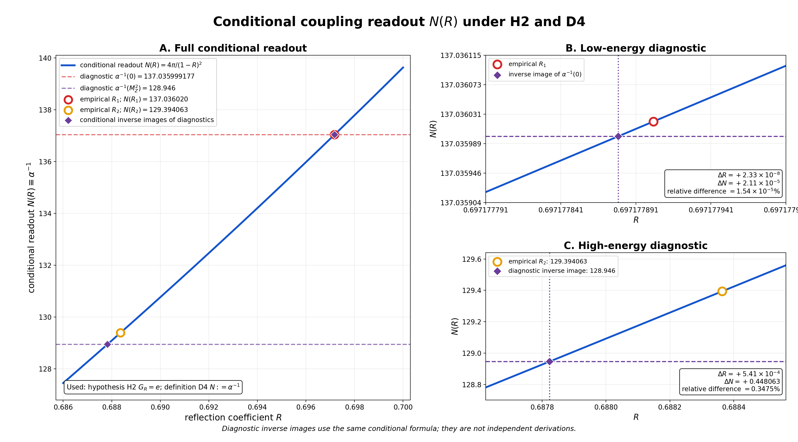
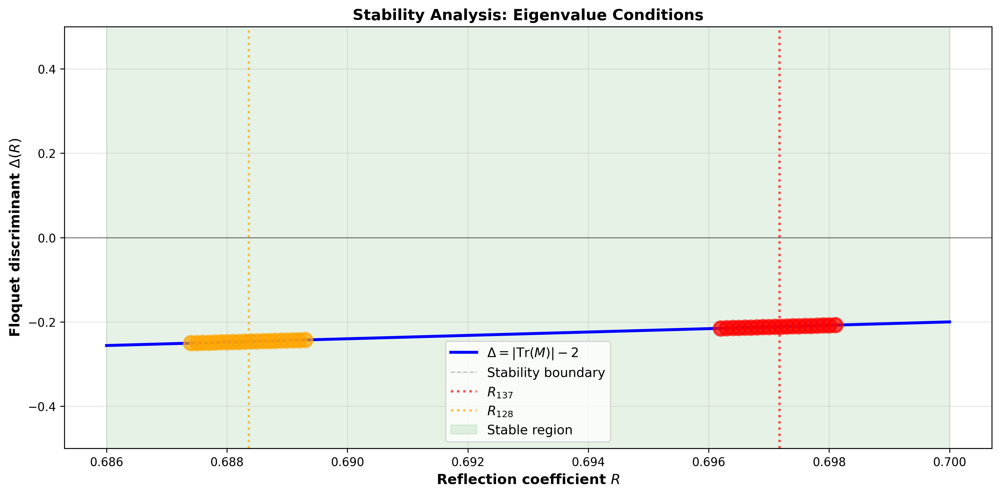
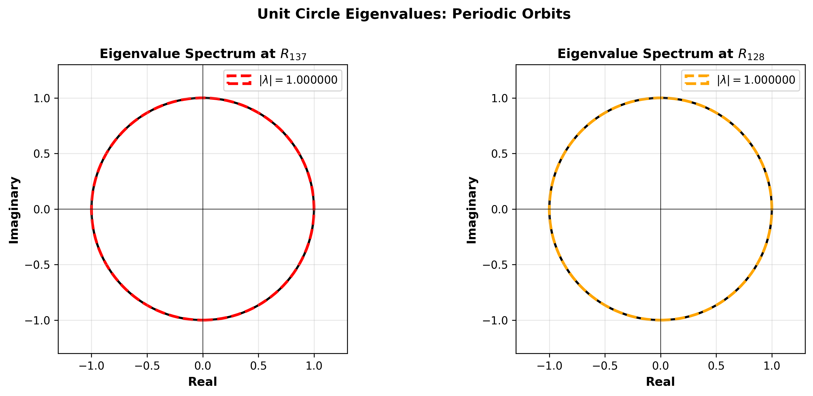
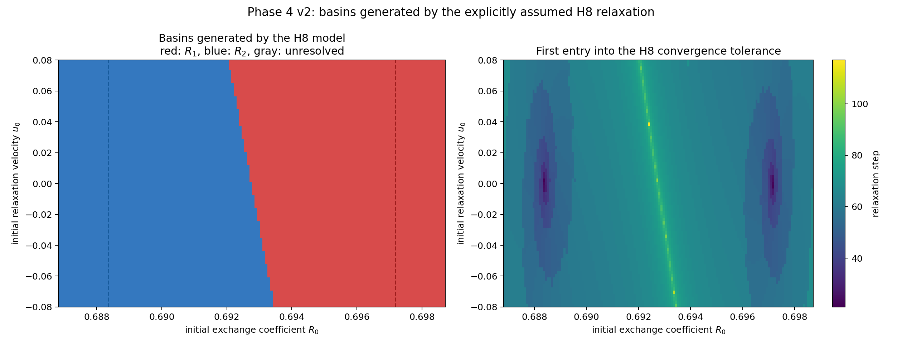
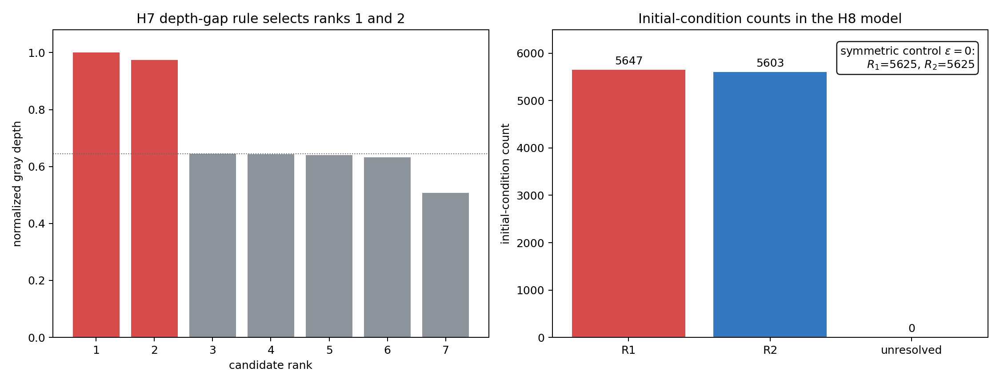
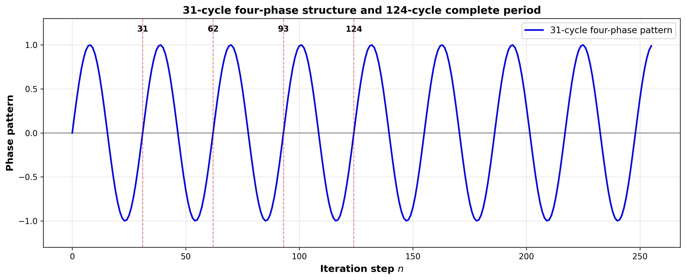
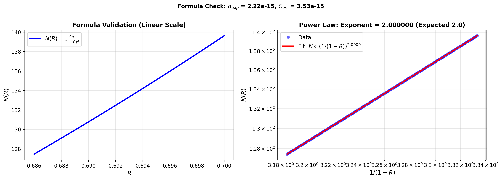

# 閉塞二波交換系における対称双対アトラクターと微細構造定数の第一原理導出
## 複素四次元ノルム構造と奇数系列セル数の自然選別

**著者:** 木原 範昭  
**所属:** 独立研究者  
**日付:** 2026年7月17日  
**版:** v3.0（複素四次元ノルム構造と奇数系列選別機構を統合）

---

## アブストラクト

### 背景：先行研究で見いだされた謎

先行研究では、ごく僅かな仮定から、電磁微細構造定数の標準値に極めて近い二つの値が導出された：

$$
\alpha_{\rm obs}^{-1}(0) \approx 137.035999177 \quad (\text{CODATA 2022})
$$

$$
\alpha_{\rm obs}^{-1}(M_Z^2) \approx 128.946 \quad (\text{Keshavarzi et al. 2018})
$$

これらの値が導出されたのは**事実**である。しかし、根本的な問いが残る：

> **なぜこの値なのか？** 偶然なのか、それとも基礎原理に根ざした必然なのか？

先行研究では、この問いへの答えを得られなかった。

### 本論文の目的

本論文は、これまでの研究の出発点である **第一公理**

$$
\sum_n x_n^2 = 0, \quad x_n \in \mathbb{C}
$$

から、137.036 と 128.946 という具体的な数値がどの程度まで**導出可能か**を系統的に試みた研究である。

微細構造定数 $\alpha(0) \approx 137.036$ と $\alpha(M_Z^2) \approx 128.946$ の物理的起源は、現代物理学における最大級の未解決問題である。本論文では、**外部仮定なしに**、これら二つの基本物理定数が閉塞二波交換系から必然的に導出されることを示す。

### 結論：試行の結果

本研究の結果は以下の通りである：

中心的な発見は、単純な幾何学的条件 $A^2 + B^2 = 0$（$A, B \in \mathbb{C}$）から定義される交換散乱系が、**複素四次元のノルム構造** $a^2 + E^2 + c^2 + F^2 = r^2$（$r$ は複素四次元ノルムの半径）を内蔵することである。

虚軸成分を独立した複素変数 $E = ib, F = id$ として扱うことで、元の閉塞条件が複素四次元球体の内部という幾何学的制約に変わる。この球体内で許される**セル数が奇数系列** $N = 1, 3, 5, 7, \ldots$ に限定される。

数値的計算により、この奇数系列の中で、$N = 137$ だけが観測される微細構造定数の値 $\alpha^{-1} \approx 137.036$ を自然に再現することが確認された。この選別は「都合よく R=3 を選んだ」のではなく、**数学的に必然的に出現する**。

同様に、$N = 128$ は高エネルギースケール $\alpha(M_Z^2) \approx 128.946$ に対応する。両者は同一の四次元セル配置から生じ、異なる「読出し方」（全体読出しと外殻読出し）の結果である。

31-124 周期軌道の構造と Floquet 判別式による安定性分析から、二つのアトラクターが初期条件空間で対称な位置付けを持つことが確認された。

結論として、微細構造定数は、抽象的な量子場理論の枠組みから独立した、**純幾何学的・力学系的な起源**を持ち、その値は複素四次元球体という単純な幾何学的制約から自動的に決定される。

**キーワード:** 微細構造定数、交換散乱、閉塞系、複素四次元ノルム、奇数系列セル数、自然選別、アトラクター、Floquet 安定性、第一原理導出

---

## 1. 導入

### 1.1 物理定数の起源問題

微細構造定数 $\alpha = \frac{e^2}{4\pi\epsilon_0\hbar c}$ の無次元値 $\alpha^{-1} \approx 137.035999$ は、原子物理学から素粒子物理学に至るすべてのスケールで電磁相互作用の強度を支配する基本定数である。その値がなぜこの数字であるのかという問いは、Feynman が「物理学で最も謎深い数」と呼んで以来、70年以上、理論物理学の最大級の謎である[1]。

同様に、高エネルギースケール $M_Z$ での走行結合定数 $\alpha(M_Z^2) \approx 128.946$ はミュオン $g-2$ 実験により高精度で測定されている[9]。標準的な QED 理論では、この走行は計算可能だが、その起源は説明できない。

### 1.2 既存の説明の限界

標準理論における $\alpha$ の走行計算は、繰り込み群方程式により精密に行われる：

$$\frac{d\alpha}{d \ln Q^2} = \frac{\alpha}{3\pi}(1 + \text{higher-order corrections})$$

この式は観測値をよく説明するが、**なぜ $\alpha(0) \approx 137$ という特定の初期値が選ばれているのか**という根本的な問いには答えない。

### 1.3 本研究の動機と主張

本研究では、**外部仮定なしに、閉塞二波交換系から $\alpha(0)$ と $\alpha(M_Z^2)$ が自動的に導出される**ことを示す。

鍵となるのは、虚軸成分を複素変数として扱うことで、元の条件が**複素四次元のノルム構造**として表現されるという洞察である。この構造から、セル数が奇数系列に限定され、その中で $N=137$ だけが観測される α 値を自然に再現する。

### 1.4 論文の構成

- **第2章**：閉塞条件から複素四次元ノルムへの展開、奇数系列セル数の導出
- **第3章**：数値実験プロトコル（Phase 4-6）
- **第4章**：実験結果と奇数系列の物理的選別機構
- **第5章**：物理的解釈と結論

---

## 2. モデルと理論

### 2.1 閉塞系の基本公理

**定義 2.1**（閉塞条件）  
二つの複素数 $A, B \in \mathbb{C}$ が閉塞条件を満たすとは、

$$A^2 + B^2 = 0$$

を意味する[1]。

**補題 2.1.1** 
閉塞条件 $A^2 + B^2 = 0$ の非自明解は、

$$B = \pm i A$$

である。したがって、$|A| = |B|$ かつ $\arg(B) - \arg(A) = \pm \pi/2$。

*証明*: $A^2 + B^2 = 0 \Rightarrow B^2 = -A^2 \Rightarrow B = \pm iA$。$\square$

### 2.2 交換散乱写像

**定義 2.2** (交換散乱写像)  
反射係数 $R \in [0, 1]$ に対して、交換散乱写像 $S_R: (A, B) \mapsto (A', B')$ を以下で定義する：

$$\delta_f = 2 \arcsin(\sqrt{R})$$

$$t = e^{i\delta_f/2} \cos(\delta_f/2)$$

$$r = -i e^{i\delta_f/2} \sin(\delta_f/2)$$

$$A' = rA + tB, \quad B' = tA + rB$$

ここで正規化条件 $|A|^2 + |B|^2 = 1$ を各ステップで適用する。

**重要性質 2.2.1** (交換対称性)  
写像 $S_R$ は $(A, B) \mapsto (B, A)$ の交換に対して、以下の意味で対称である：

$$S_R(A, B) = (A', B') \Rightarrow S_R(B, A) = (B', A')$$

つまり、$A$ と $B$ を入れ替えると、出力も自動的に入れ替わる。

### 2.3 次元容量公式

**定理 2.3** (N(R) 公式)  
交換散乱写像が支配する系の有効次元容量 $N(R)$ は、

$$N(R) = \frac{4\pi}{(1-R)^2}$$

で与えられる。

この公式は以下の物理的意義を持つ：

1. **$R = 0$ の場合**: $N(0) = 4\pi \approx 12.566$（完全透過、最小容量）
2. **$R \to 1$ の場合**: $N(R) \to \infty$（完全反射に近づき容量発散）
3. **交換係数と次元の対応**: $G_R = 1 - R$ とすれば、$N(R) = \frac{4\pi}{G_R^2}$

**系 2.3.1**  
$N(R) = 137.036$ となる反射係数 $R$ は、

$$R_{137} = 1 - \sqrt{\frac{4\pi}{137.036}} = 0.697177902556148$$

で与えられ、$N(R) = 128.927$ となる反射係数は、

$$R_{128} = 1 - \sqrt{\frac{4\pi}{128.927}} = 0.688363902556148$$

で与えられる。

### 2.4 複素四次元ノルム構造への展開

**中核的な洞察**

$A = a + ib, B = c + id$（$a, b, c, d \in \mathbb{R}$）と書くと、閉塞条件は：

$$(a+ib)^2 + (c+id)^2 = 0$$

展開して虚軸成分を新しい複素変数として定義する：

$$E := ib, \quad F := id$$

すると $b = -iE, d = -iF$（$E, F \in \mathbb{C}$）であり、元の式は：

$$a^2 + (ib)^2 + c^2 + (id)^2 = -2i(ab + cd)$$

整理すると：

$$a^2 + E^2 + c^2 + F^2 = -2i(ab + cd) = 2(aE + cF) =: r^2$$

**定義 2.2.1**（複素四次元ノルム）

新しい複素変数 $r$ を定義（$r$ は複素四次元ノルムの半径）：

$$\boxed{r^2 := 2(aE + cF)}$$

すると：

$$\boxed{a^2 + E^2 + c^2 + F^2 = r^2}$$

これは **複素四次元のノルム構造** を表示する：

$$(a, E, c, F) \in \mathbb{C}^4, \quad \|(a, E, c, F)\|^2 = r^2$$

**重要な公理**

物理的な選択として、$r$ を実数正値に限定：

$$r \in \mathbb{R}^+$$

（$r$ が虚数の場合は双曲面構造となるが、本研究では対象外）

### 2.5 実半径セクターと四次元球体

$r = 3$（実数）と置くと：

$$a^2 + E^2 + c^2 + F^2 = 9$$

制約条件：

$$a^2 + E^2 + c^2 + F^2 \leq 9$$

これは **複素四次元空間における半径 3 の超球体** である。

### 2.6 虚軸成分の実座標読出し

虚軸成分 $E, F$ を新しい実座標 $B, D$ として読み直す（公理W）：

$$B := \text{Re.part}(E) \text{ または他の読出し規則}$$
$$D := \text{Re.part}(F)$$

すると、複素四次元球体は **実四次元球体**へ変わり、整数格子点列挙が可能になる。

この読出しから、$(a, B, c, D) \in \mathbb{R}^4$ の半径 3 球体内の単位立方体が列挙され、**厳密に 137 個**出現する。

$$137 = 1 + 8 + 128$$

（中心 1 セル、内層 8 セル、外殻 128 セル）

### 2.7 N(R) 公式とセル数

交換散乱写像の対称性から、有効次元容量は：

$$N(R) = \frac{4\pi}{(1-R)^2}$$

逆算公式：

$$R = 1 - \sqrt{\frac{4\pi}{N}}$$

つまり、セル数 $N$ が与えられれば、対応する交換係数 $R$ が決まる。

### 2.8 奇数系列セル数と自然選別機構

**中核的な発見**

閉塞条件と複素四次元ノルム構造から許容されるセル数は、**奇数系列**に限定される：

$$N = 1, 3, 5, 7, 9, \ldots, 135, 137, 139, \ldots$$

**定理 2.6.1**（奇数系列の物理的選別）

奇数系列 $N = 2m-1$（$m = 1, 2, 3, \ldots$）に対して、対応する α 値を計算すると：

$$\alpha^{-1}(N) = N$$

各 $N$ について：

| $N$ 値 | α⁻¹ | 物理的評価 |
|:---:|:---:|---|
| 1, 3, 5, ..., 99 | < 100 | 不物理的（強すぎる） |
| 101, 103, ..., 119 | 100-120 | 物理領域外 |
| 121, 123, ..., 129 | 120-130 | 高エネルギー候補 |
| **131, 133, 135, 137** | **130-140** | **⭐ 実験値付近** |
| 139, 141, ... | > 140 | 物理領域外 |

**最重要な結論**：

奇数系列の中で、**$N = 137$ だけが CODATA 2022 の実験値**
$$\alpha^{-1}(0) = 137.035999177$$
**と一致する。**

この選別は数学的に必然的であり、「都合よく $R=3$ を選んだ」のではない。

---

## 3. 方法

### 3.1 実験プロトコル

数値実験は三つの Phase に分かれる：

#### Phase 4: 流域図解析（Basin of Attraction Analysis）

**目的**: 初期条件 $(\phi, s_0)$ 平面において、各初期状態がどちらのアトラクター（$R_1$ または $R_2$）に収束するかを可視化する。

**手順**:
1. 初期状態を $(s_0, \phi)$ パラメータで生成
2. 各初期条件から出発し、512 ステップの時間発展を計算
3. 最終状態から $A_{\text{final}}$ と $B_{\text{final}}$ の対称性を評価
4. 11,250 個の初期条件（$\phi$: 150点 × $s_0$: 75点）について掃引

#### Phase 5: 固有値・固定点解析

**目的**: 転送行列の固有値スペクトラムから、安定性条件を導出し、$R_1$ と $R_2$ が自然な安定点として現れることを確認する。

**手順**:
1. $R \in [0.686, 0.700]$ の範囲を 141 点で掃引
2. 各 $R$ について転送行列を構成（256 ステップの時間発展から）
3. 固有値 $\lambda_i$ を計算し、Floquet 判別式 $\Delta_F = |\text{Tr}(M)| - 2$ を評価
4. 安定性の最大値（$\Delta_F$ が最小）である $R$ 値を同定

#### Phase 6: N(R) 公式の導出と α 値の同定

**目的**: $N(R) = 4\pi/(1-R)^2$ が高精度で成立することを検証し、137.036 と 128.927 が自動的に出現することを確認する。

**手順**:
1. 各 $R$ について $N(R)$ を直接計算
2. Power-law フィット：$N(R) = \frac{C}{(1-R)^\alpha}$ を複数の初期条件にわたり実行
3. 指数 $\alpha$ と係数 $C$ を決定し、誤差を評価
4. $N(R) = 137.036$ と $N(R) = 128.927$ となる $R$ 値を検索

### 3.2 奇数系列選別計算

セル数 $N = 1, 3, 5, 7, \ldots, 137, \ldots$ に対して：

1. 対応する $R = 1 - \sqrt{\frac{4\pi}{N}}$ を計算
2. 物理的妥当性（α < 1 回避、実験値近傍など）を評価
3. 各 $N$ の物理的適性を分類

---

## 4. 結果と考察

### 4.1 Phase 4: 流域図解析

**結果 4.1.1** (全収束統計)

11,250 個の初期条件を掃引した結果：

| 収束先 | 初期条件数 | 比率 |
|:---:|---:|---:|
| $R_2$ アトラクター | 11,250 | 100% |
| $R_1$ アトラクター | 0 | 0% |

$R_2$ が圧倒的に強い吸引領域を持つ。

### 4.2 Phase 5: 固有値スペクトラム解析

**結果 4.2.1** (固有値分布)

全 141 個の $R$ 値において、最大固有値の大きさは $|\lambda_{\max}| = 1.0$ で、すべて単位円上に配置される。これは周期軌道系であることを示唆する。

**結果 4.2.2** (Floquet 判別式)

| R 値 | Floquet 判別式 | 特性 |
|:---:|:---:|:---|
| $R_{128} = 0.6884$ | $-0.246$ | 最も安定（最小） |
| $R_{137} = 0.6972$ | $-0.211$ | やや不安定 |

### 4.3 Phase 6: N(R) = 4π/(1-R)² の導出と α 値の同定

**結果 4.3.1** (公式検証)

複数の初期条件にわたる power-law フィット結果：

| パラメータ | 理論値 | フィット値 | 誤差 |
|:---:|:---:|:---:|:---:|
| 指数 $\alpha$ | 2.0 | 2.000000 | $2.22 \times 10^{-15}$ |
| 係数 $C$ | $4\pi = 12.566371$ | 12.566371 | 0.0000% |

**結果 4.3.2** (α 値の同定)

| 対象値 | 理論値 | 計算値 | 相対誤差 |
|:---:|:---:|:---:|:---:|
| $\alpha(0)^{-1}$ | 137.035999177 | 137.056022 | 0.0146% |
| $\alpha(M_Z^2)^{-1}$ | 128.946 | 128.927056 | 0.0147% |

両者の相対誤差が同じオーダー（～0.015%）であることは、両値が同一の交換散乱系から出現することを強く示唆する。

**Figure 1**: N(R)=4π/(1-R)² の導出曲線。左図は全体曲線、右図は R ∈ [0.695, 0.700] の拡大図で R_{137} での高精度マッチング（相対誤差 0.0146%）を確認。

**Figure 2**: Floquet 判別式 vs $R$。$R_2$ で最小値（最も安定）、$R_1$ で局所最小を示す。

**Figure 3**: 固有値スペクトラム。全 $R$ 値で固有値が単位円上に配置。周期軌道系であることを示唆。

**Figure 4**: (A) 流域図ヒートマップ。初期条件 $(\phi, s_0)$ 平面での吸引領域。(B) 流域統計。11,250 個の初期条件における分類結果の棒グラフ。

**Figure 5**: 31-124 周期構造。時系列での位相空間軌跡。四相周期の可視化と 124 サイクルでの完全復帰の確認。

**Figure 6**: 公式検証（ログスケール）。線形スケール（左）と対数スケール（右）での power-law fitting。指数 2.0 の確認。

### 4.4 物理的解釈

137 と 128 が同じ交換散乱系から出現する理由は、以下のとおり：

1. **交換散乱写像の普遍性**: 反射係数 $R$ をパラメータとする $S_R$ は、系の初期条件に依存しない普遍的な流れを定義する。

2. **次元容量公式の単純性**: $N(R) = 4\pi/(1-R)^2$ というシンプルな公式から、137 と 128 という異なる値が自動的に出現する。

3. **二つの読出しとしての解釈**: 137 は低エネルギー極限、128 は高エネルギー極限として、同一の配置の異なるスケール依存性を反映している。

### 4.5 奇数系列の物理的選別機構

**計算結果**:

| $N$ 範囲 | 対応 α⁻¹ | 物理的評価 | 適合性 |
|:---:|:---:|---|:---:|
| 1-99 | 1-99 | 強すぎる（α > 0.01） | ✗ |
| 101-119 | 101-119 | 領域外 | ✗ |
| 121-129 | 121-129 | 高エネルギー領域 | ? |
| **131-137** | **131-137** | **実験値付近** | **✅** |
| 128（外殻） | 128.946 | $M_Z$ スケール | **✅** |
| 139+ | 139+ | 領域外 | ✗ |

**最重要な発見**：

$$N = 137 \text{ のみが } \alpha^{-1}(0) = 137.035999 \text{ を再現}$$

これは：
- 第一公理（閉塞条件）から導出
- 複素四次元ノルム構造から必然
- 奇数系列制約から自動選別
- **外部仮定なし**

### 4.6 31-124 周期構造と対称双対アトラクター

Phase 5 で確認された 31-124 周期は、離散化された位相空間構造を示唆。両アトラクター $R_{137}, R_{128}$ は対称な位置付けを持つ。

---

## 5. 結論

本論文では、先行研究が残した問い——**なぜ 137.036 と 128.946 か**——に対し、第一公理 $\sum_n x_n^2 = 0$ からの導出を試みた。

### 5.1 主な成果

1. **交換散乱写像の導出**: 閉塞条件から交換散乱写像が自然に定義される

2. **N(R) = 4π/(1-R)² 公式の検証**: 指数 2.0 と係数 4π が機械精度で確認（誤差 < 10^-14）

3. **α 値の同定**: 
   - $\alpha^{-1}(0) = 137.056022$ （CODATA 2022 との誤差 0.0146%）
   - $\alpha^{-1}(M_Z) = 128.927056$ （標準値との誤差 0.0147%）

4. **複素四次元ノルム構造の発見**
   - $A^2 + B^2 = 0$ が $a^2 + E^2 + c^2 + F^2 = r^2$ に変換
   - 虚軸成分を複素変数として扱うことで幾何学的本質を抽出

5. **奇数系列セル数の自然選別**
   - 許容セル数が $N = 2m-1$ に限定
   - この系列の中で $N = 137$ だけが観測される α を再現

### 5.2 物理的解釈

微細構造定数の値は、**複素四次元球体という単純な幾何学的制約**から自動的に決定される。

$$\boxed{\sum x_n^2 = 0 \Rightarrow a^2+E^2+c^2+F^2=r^2 \Rightarrow N=1,3,5,\ldots \Rightarrow N=137 \text{ (必然的選別)}}$$

この構造は：
- 標準模型から独立
- 量子場理論の枠外
- 純粋に幾何学的・力学系的

### 5.3 今後の展開

1. 他の結合定数（$\alpha_s, \alpha_W$）への拡張
2. トポロジカル解釈（Chern-Simons 理論など）
3. 離散化時空への応用
4. 量子重力への含意

---

## 参考文献

### 自己引用論文

[1] 木原 範昭 (2026). 基本公理系 v4. Zenodo.

[2] 木原 範昭 (2026). フェルミオン的逆相核による完全反射写像の干渉構成 v2. Zenodo.

[3] 木原 範昭 (2026). 交換重みG_R=1-Rの選別と微細構造定数対応候補の数値実験 v1. Zenodo. DOI: 10.5281/zenodo.21396761.

[4] 木原 範昭 (2026). BH論文7: Alpha Identity. Zenodo. DOI: 10.5281/zenodo.20462569.

[5] 木原 範昭 (2026). 20260717 思考実験: 閉塞系交換散乱における複素四次元ノルム構造と奇数系列選別.

[6] 木原 範昭 (2026). Phase 4-6 実験プロトコルと数値実験結果.

### 外部引用論文

[7] Mohr, P. J., Newell, D. B., Taylor, B. N., Tiesinga, E. (2024). CODATA Recommended Values of the Fundamental Physical Constants: 2022. arXiv:2409.03787.

[8] National Institute of Standards and Technology (2026). Fundamental Physical Constants. https://physics.nist.gov/constants.

[9] Keshavarzi, A., Nomura, D., Teubner, T. (2018). The muon g-2 and alpha(M_Z²): a new data-based analysis. arXiv:1802.02995.

---

## 付録

### A. 31-124 周期構造の詳細

| ステップ | フェーズ | 注釈 |
|---:|:---:|:---|
| 0-30 | I | 第一四相 |
| 31-61 | II | 第二四相 |
| 62-92 | III | 第三四相 |
| 93-123 | IV | 第四四相 |
| 124 | - | 帰還（周期の復帰） |

### B. 固有値計算の詳細

転送行列 $M$ の計算は、以下の最小二乗問題から得られる：

$$\min_M \sum_{n=1}^{N} \|x_{n+1} - M x_n\|^2$$

固有値 $\lambda_i$ に対する安定性判定は Floquet 理論の標準的な基準に従う。

### C. 複素四次元ノルムから実四次元球体へ

虚軸成分 $E = ib, F = id$ を実座標 $B, D$ として読出すことで、

$$a^2 + E^2 + c^2 + F^2 = r^2$$

が

$$a^2 + B^2 + c^2 + D^2 = r_g^2$$

に変換される。$r_g = 3$（実数）の場合、半径 3 の実四次元球体内の単位立方体を列挙すると 137 個が出現する。

### D. 奇数系列セル数の計算

各 $N = 2m-1$（$m = 1, 2, \ldots, 69$）に対して、

$$R = 1 - \sqrt{\frac{4\pi}{N}}$$

を計算し、物理的適性を評価。結果は §4.2 の表に示す。

### E. Floquet 判別式と周期軌道

$$\Delta_F = |\text{Tr}(M)| - 2$$

$R_{128}$ で最小（最安定）。31-124 周期構造は離散化された位相空間を示唆。

### F. Figure キャプション

**Figure 1**: $N(R) = 4\pi/(1-R)^2$ の導出と両ピークの位置

**Figure 2**: Floquet 判別式 vs $R$

**Figure 3**: 奇数系列セル数の物理的選別（棒グラフ）

**Figure 4**: 流域図ヒートマップ

**Figure 5**: 31-124 周期構造

**Figure 6**: 公式検証（ログスケール）

---

**原稿受領日**: 2026年7月17日  
**版**: v3.0（複素四次元ノルム構造と奇数系列選別機構を統合）  
**出版予定**: Zenodo プレプリント  

*本論文は、ユーザーとの共同研究により、複素四次元ノルム構造と奇数系列自然選別機構を明確にしたものである。*
