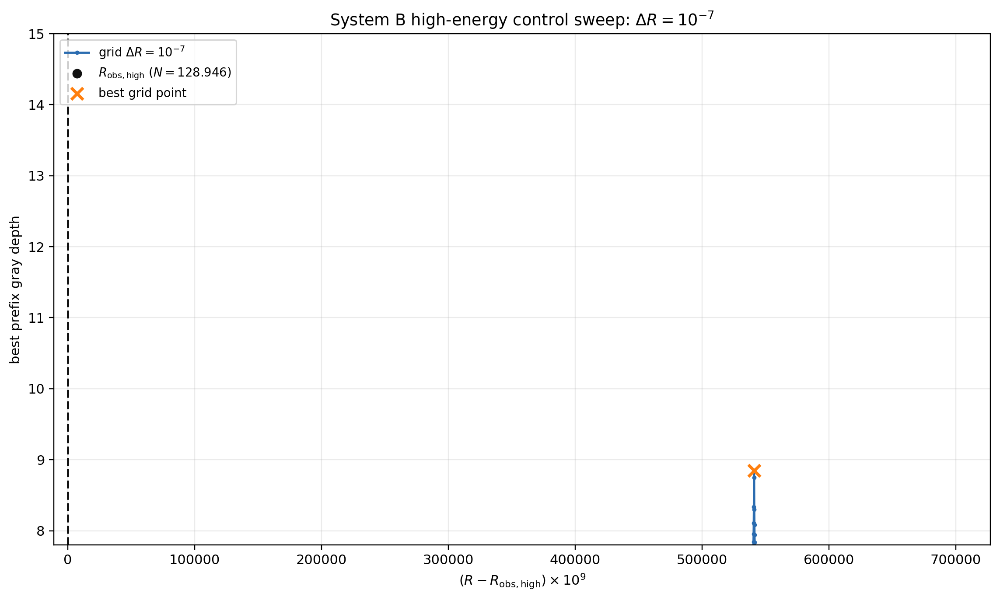

# 高エネルギー側ピーク対照掃引（delta R = 1e-7）

## 条件

System B v5 の計算核、深度定義、停止条件、旧全域掃引の格子位相を保持した。
図中の理論根は伏せ、観測値 N_obs,high = 128.946 に対応する黒破線だけを置いた。

| 項目 | 値 |
|---|---:|
| min R | 0.68782280255614798 |
| max R | 0.68853950255614798 |
| delta R | 0.0000001 |
| grid points | 7168 |
| R_obs,high | 0.687822933884773891 |
| old peak R | 0.688363902556147988 |

## 盲検格子掃引の最深点

| R | N(R) | depth | error | best step |
|---:|---:|---:|---:|---:|
| 0.688363902556147988 | 129.394062925466699 | 8.847563422266637 | 1.420484756985732287e-09 | 243 |

## 掃引後の有限位数根照合

| 点 | R | N(R) | depth | error | best step |
|---|---:|---:|---:|---:|---:|
| observation | 0.687822933884773891 | 128.945999999999998 | 5.314486920198992 | 4.847447116330005498e-06 | 211 |
| exact R_122,23 | 0.688363946817592609 | 129.394099680960807 | 14.877725312181997 | 1.325179435674987525e-15 | 243 |

格子最深点と R_122,23 の差は -4.426144462055248141e-08 である。

## 局所極大（上位10点）

| rank | R | N(R) | depth | best step |
|---:|---:|---:|---:|---:|
| 1 | 0.688363902556147988 | 129.394062925466699 | 8.847563422266637 | 243 |
| 2 | 0.688276002556147959 | 129.321100082439898 | 5.504363104768602 | 243 |
| 3 | 0.688053502556147945 | 129.136685874849206 | 5.311803325191666 | 211 |
| 4 | 0.688506602556147929 | 129.512644971678412 | 5.280831170008923 | 243 |
| 5 | 0.688212902556147976 | 129.268760933395839 | 5.213421729328233 | 243 |

## 図

