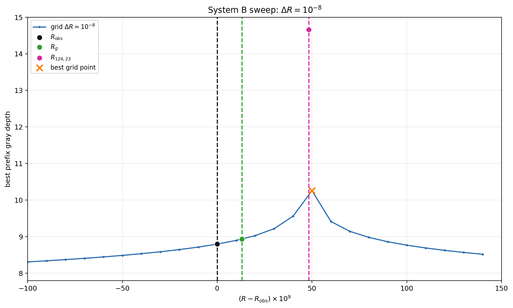
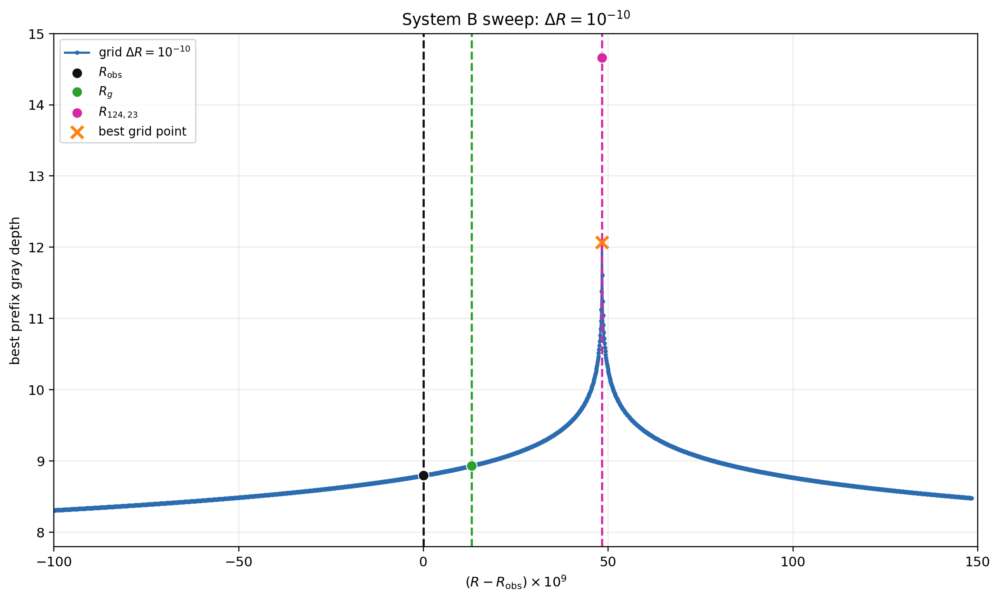
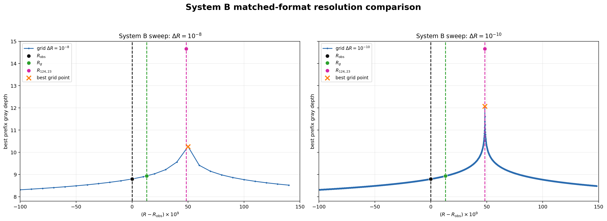

# 低エネルギー3点：同一形式による解像度比較

両図は横軸、縦軸、軸範囲、基準線、凡例を完全に共通化している。

| 刻み | 点数 | grid best R | rootとの差 | depth | error |
|---|---:|---:|---:|---:|---:|
| 1e-8 | 25 | 0.697177929231003080 | +1.674343774737963031e-09 | 10.257340713503856 | 5.529161642145990183e-11 |
| 1e-10 | 2484 | 0.697177927531003050 | -2.565625489836520501e-11 | 12.071809317702247 | 8.475994813611140717e-13 |
| exact root | 1 | 0.697177927556659305 | 0 | 14.658593398194066 | 2.194858877979655176e-15 |

## 1e-8

## 1e-10

## 左右比較

