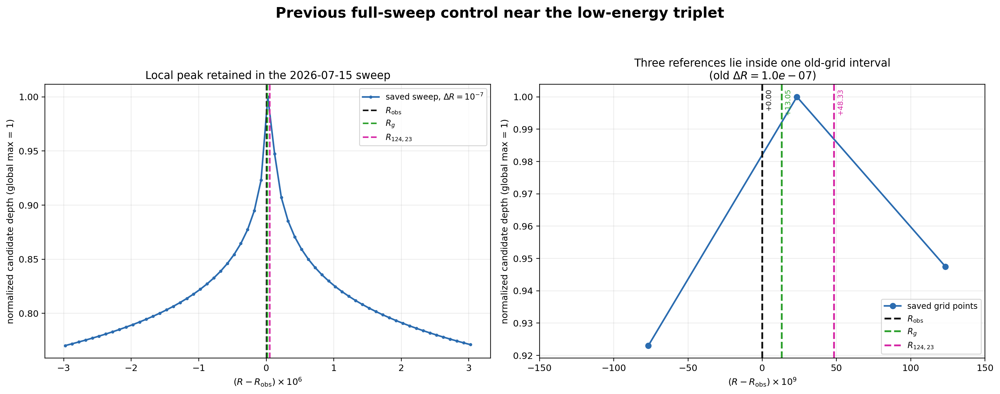

# 低エネルギー3基準点：前回全域スイープ対照データ

## 1. 対象

\[
R_{\mathrm{obs}}=R(137.035999177),\qquad
R_g=R\!\left(\frac{137+\sqrt{137^2+2\pi^2}}{2}\right),\qquad
R_{124,23}=\cos^2\!\left(\frac{23\pi}{124}\right).
\]

入力CSV:

波の情報読出し/20260715/minimal_system_B_gray_bugcheck_result_v1/direct_depth_probe_v5_sweep_control/high_to_ext_full_delta1e-7_candidates_v5.csv

前回全域スイープの刻みは \(\Delta R_{\rm old}=1.0e-07\)。
局所抽出行数は 61 行。

## 2. 3基準点と前回CSVの最寄り点

| 基準点 | target R | target N | R−R_obs | 前回CSV最寄りR | CSV−target | depth | error | step |
|---|---:|---:|---:|---:|---:|---:|---:|---:|
| R_obs | 0.697177879231003050 | 137.035999177 | +0.000000000000000000e+00 | 0.69717790255614798 | +2.332514492664472527e-08 | 9.083204920768843 | 8.256482775696157e-10 | 247 |
| R_g | 0.697177892281404255 | 137.036010988388739 | +1.305040120413991644e-08 | 0.69717790255614798 | +1.027474372250480883e-08 | 9.083204920768843 | 8.256482775696157e-10 | 247 |
| R_124_23 | 0.697177927556659305 | 137.036042914598568 | +4.832565625445539581e-08 | 0.69717790255614798 | -2.500051132781067054e-08 | 9.083204920768843 | 8.256482775696157e-10 | 247 |

## 3. 対照データの判定

3基準点は、前回CSVでは**すべて同一の格子点**へ写る。

\[
R_{124,23}-R_{\rm obs}=4.832565625445539581e-08<\Delta R_{\rm old}.
\]

前回全域スイープは低エネルギー候補帯と局所最大の存在を示すが、
3点間の順位、谷、分裂を判別する解像度を持たない。
これは \(10^{-10}\) スイープの必要性を直接示す対照結果である。

## 4. 拡大図

左図は保存済み候補帯の局所形状、右図は3基準点と旧格子点の位置関係を示す。

## 5. 次段階の精密スイープ案

| 項目 | 値 |
|---|---:|
| min_R | 0.697177779231003050 |
| max_R | 0.697178027556659305 |
| delta_R | 1.0e-10 |
| 予定点数 | 2484 |
| 直接評価 | 3基準点をグリッドとは別に厳密値で評価 |

一つの連続区間で3点全体を覆い、全評価点をCSVへ保存する。
これにより候補選別規則による欠落を避け、ピーク位置と非対称性を比較する。
