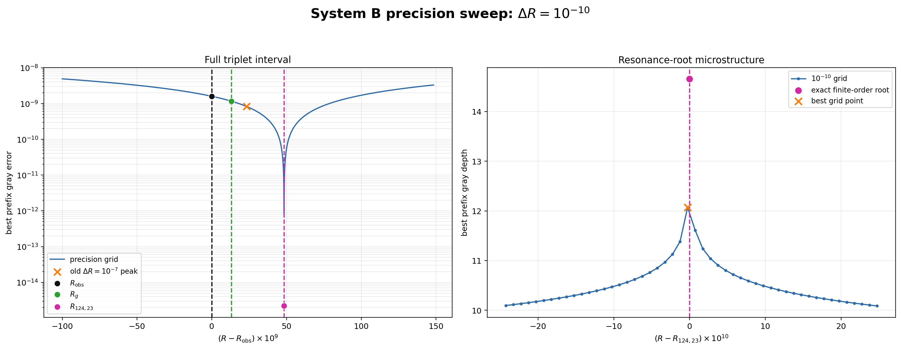

# 低エネルギー3基準点 \(10^{-10}\) 精密スイープ結果

## 1. 実験条件

| 項目 | 値 |
|---|---:|
| min_R | 0.697177779231003050 |
| max_R | 0.697178027556659305 |
| delta_R | 0.0000000001 |
| grid points | 2484 |
| steps | 1024 |
| min_steps | 256 |
| early_stop_patience | 20 |
| phi_mode | zero |
| unique best steps | [247] |
| unique stop steps | [267] |
| v5 candidate rows | 2484/2484 |

前回全域スイープから変更したのは \(R\) の範囲と刻みだけである。
全点で best step と停止点が共通であるため、精密ピークは計算分枝の
切替えではなく、同一の247ステップ読出しにおける位相誤差の変化である。

## 2. 3基準点の厳密直接評価

| 基準点 | R | N(R) | depth | error | best step |
|---|---:|---:|---:|---:|---:|
| R_obs | 0.697177879231003050 | 137.035999177000008 | 8.796944556192118 | 1.596082896694147275e-09 | 247 |
| R_g | 0.697177892281404255 | 137.036010988388682 | 8.933669730723755 | 1.165011652658668918e-09 | 247 |
| R_124_23 | 0.697177927556659305 | 137.036042914598568 | 14.658593398194066 | 2.194858877979655176e-15 | 247 |

## 3. 精密グリッドの最深点

| 項目 | 値 |
|---|---:|
| R_grid_best | 0.697177927531003050 |
| R_grid_best − R_124,23 | -2.565625489836520501e-11 |
| depth | 12.071809317702247 |
| error | 8.475994813611140717e-13 |
| best step | 247 |
| local maxima count | 1 |

グリッド最深点は有限位数根 \(R_{124,23}\) の最近傍にある。
さらに根そのものを直接評価すると、誤差は倍精度計算の丸め限界領域まで低下する。

## 4. 3点間の判別

\[
\frac{E(R_{\rm obs})}{E(R_{124,23})}=7.271916e+05,
\qquad
\frac{E(R_g)}{E(R_{124,23})}=5.307911e+05.
\]

このSystem B読出しでは、3点は同じ深さを持たない。
最深点は幾何学値または観測値ではなく、作用素の有限位数根に一致する。
したがって、前回の \(10^{-7}\) スイープで未分解だった低エネルギーピークの
発生位置は、今回の精密計算では \(R_{124,23}\) と判別される。

これは137セル幾何を否定する結果ではない。判別されたのは、現行System Bの
単独散乱読出しが選択する根である。幾何学値と観測値を得るには、研究ノートで
定式化した二状態結合または長周期干渉を別途実装して判別する必要がある。

## 5. 前回全域スイープとの比較

| データ | R | depth | error |
|---|---:|---:|---:|
| old delta_R=1e-7 | 0.69717790255614798 | 9.083204920768843 | 8.256482775696156925e-10 |
| new delta_R=1e-10 grid | 0.697177927531003050 | 12.071809317702247 | 8.475994813611140717e-13 |
| exact R_124,23 | 0.697177927556659305 | 14.658593398194066 | 2.194858877979655176e-15 |

## 6. 図

左図は3点全域の誤差、右図は有限位数根の直近を \(10^{-10}\) 単位で拡大したもの。

## 7. 実行統計

- elapsed_sec: 0.61355825
- total_loop_count: 666516
- average_msec_per_R: 0.24670617209489343
