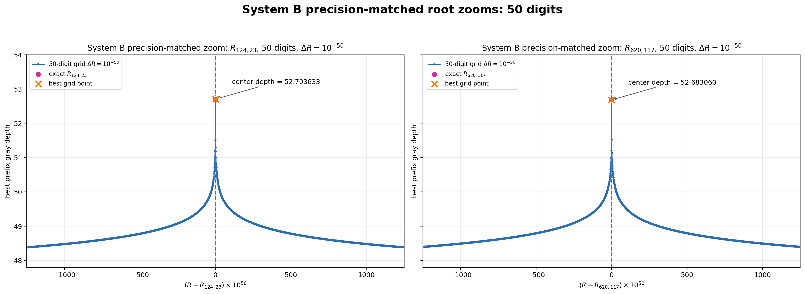
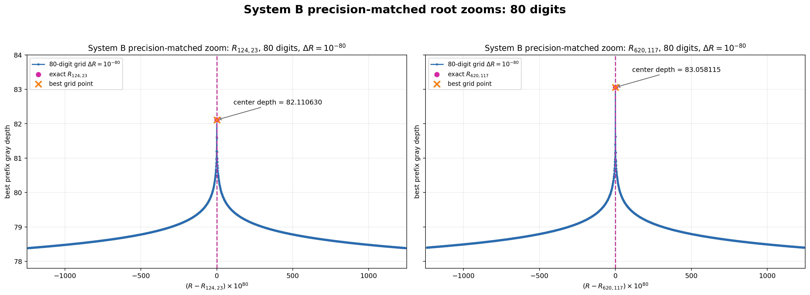

# 二つの観測対応根：精度適合局所掃引

50桁では delta R=1e-50、80桁では delta R=1e-80 とし、両方とも2,485点に統一した。

| root | precision | delta R | full width | points | edge depth left | center depth | edge depth right |
|---|---:|---:|---:|---:|---:|---:|---:|
| R124_23 | 50 | 1e-50 | 2484e-50 | 2485 | 48.3869204638819518676301 | 52.7036330597511891585117 | 48.3869674357631838745801 |
| R620_117 | 50 | 1e-50 | 2484e-50 | 2485 | 48.4001144009681128074073 | 52.6830602185305375801811 | 48.4002657272318778403900 |
| R124_23 | 80 | 1e-80 | 2484e-80 | 2485 | 78.3869444722734593504862 | 82.1106296323756747755461 | 78.3870608539161378055679 |
| R620_117 | 80 | 1e-80 | 2484e-80 | 2485 | 78.3999185091028670714919 | 83.0581147134592611411573 | 78.4002921837571773813424 |

## 50桁・delta R=1e-50

## 80桁・delta R=1e-80

