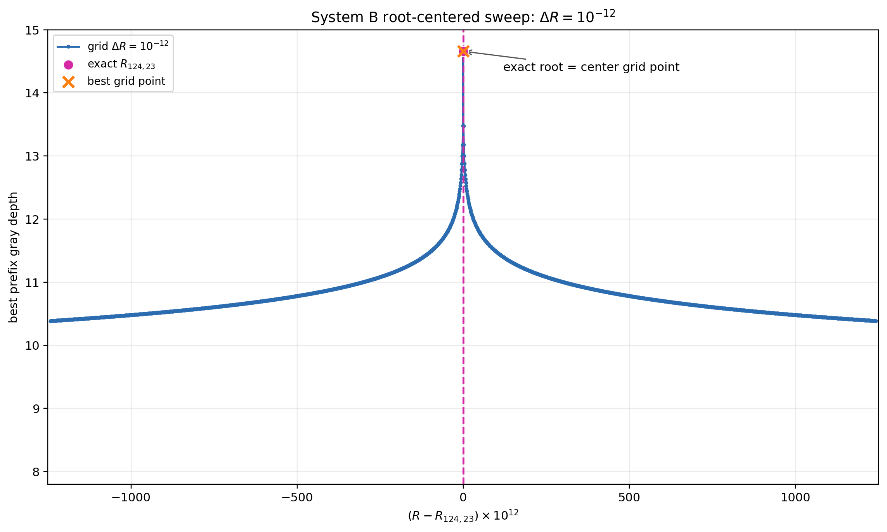
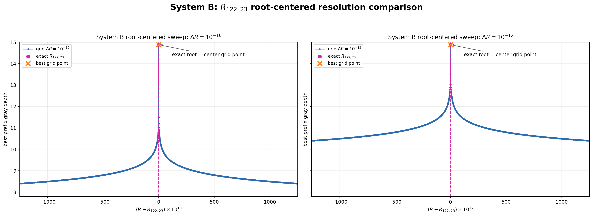
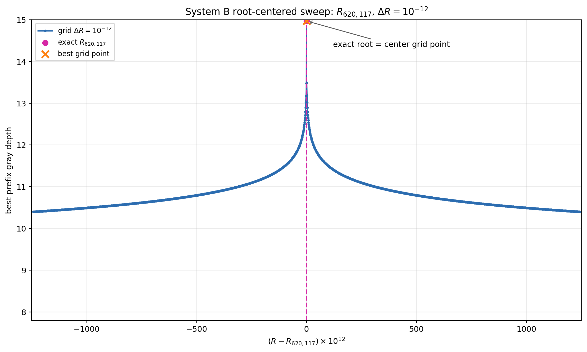
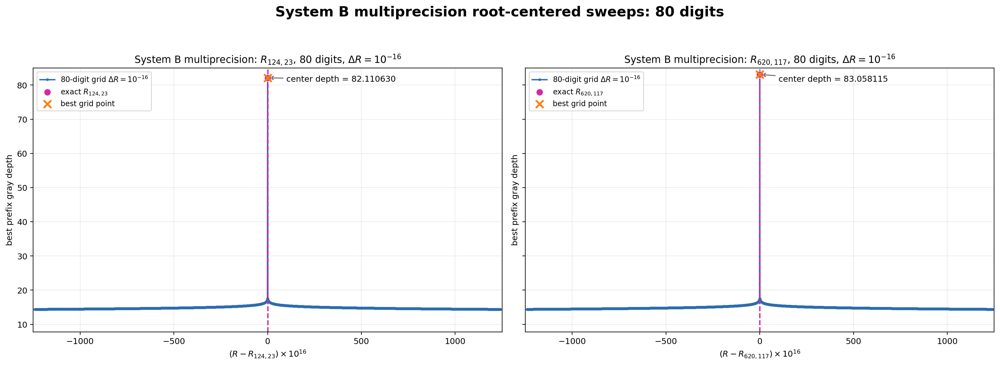

# 反復交換散乱における有限位数共鳴の発見

## 微細構造定数137・128近傍ピークの原因特定と再現可能な波束数理モデル

**版:** 日本語完成稿 v1  
**日付:** 2026年7月18日  
**著者:** 木原 範昭  
**位置づけ:** 波の情報読出しシリーズ・交換重みピーク原因特定論文  

---

## 要旨

本研究は、閉鎖位相系の交換散乱モデルから、低エネルギーおよび高エネルギーの微細構造定数に対応する値を説明できるかを調べる目的で開始された。前稿では、波束の局在性移乗を読むSystem Aと、白猫・黒猫・灰色猫準安定界面を読むSystem Bを用い、交換散乱係数 $R$ を掃引した。その結果、$\alpha^{-1}\approx137$ および $\alpha^{-1}\approx128$ に対応する領域の近傍に鋭いピークを観測した。しかし、なぜその位置にピークが形成されるのかは未解決のまま残された。

本稿は、その原因を特定するために実施した全域掃引の再解析、局所精密掃引、作用素固有値解析および50桁・80桁多倍長精度計算を報告する。解析の結果、観測されたピークは、当初期待した電磁結合の交換重み読出しだけから発生しているのではなく、二チャネル交換散乱作用素

$$
U_R=
\begin{pmatrix}
r&t\\
t&r
\end{pmatrix}
$$

の反対称固有値が有限回で1へ戻る厳密再帰

$$
U_R^n=I
$$

によって生成されることが分かった。有限位数根は

$$
\boxed{
R_{n,m}=\cos^2\left(\frac{\pi m}{n}\right)
}
$$

で与えられる。

低エネルギー側の主ピークは $R_{124,23}$ に、高エネルギー側の旧主候補は $R_{122,23}$ に一致した。さらに、高エネルギー観測値 $\alpha^{-1}(M_Z^2)=128.946\pm0.015$ の近傍には、別の偶数位数根 $R_{620,117}$ が存在し、

$$
N(R_{620,117})
=\frac{4\pi}{(1-R_{620,117})^2}
=128.947864735670559
$$

を与えた。観測値との差は $0.0018647$、すなわち $0.1243\sigma$ である。

多倍長精度計算では、50桁演算で深度約52、80桁演算で深度82から83が得られた。理想演算では有限位数根上の残差が厳密にゼロとなるため、深度は理論上無限大となる。これはエネルギーまたは振幅の発散ではなく、共鳴線が無限に鋭くなることを意味する。

本研究の主要な成果は、解析式だけではない。もともと波束の局在性移乗と準安定二状態の観測選択を調べるために別々に構築された二つの数値モデルが、同じ複素交換散乱核を共有し、作用素固有の有限位数共鳴を再現できる数理解析モデルになっていたことである。これにより、厳密再帰を抽象的な作用素論に留めず、波束相互作用に近い反復計算として検証できる。

本稿の解析後に先行研究を調査した結果、円分固有値による初期状態非依存の厳密Floquet再帰、Farey列による共鳴配置、E8の31個の8次元直交分解、および例外代数から微細構造定数を論じる研究との接点に気づいた。これらの研究は本数値実験の出発点ではなく、有限位数根を発見した後に得た比較対象である。

我々は当初、この数値実験によって $\alpha$ を説明できると期待していた。しかし直接発見したのは、一般には既に知られている厳密再帰と接続する別の有限位数共鳴現象であった。それにもかかわらず、なぜ低エネルギーと高エネルギーの二つの物理的 $\alpha^{-1}$ の近傍に、これほど鋭い有限位数根が存在するのかは未解決である。この近接が数論的偶然なのか、4次元離散幾何または別の物理的必然に由来するのかを判別することを、次段階の中心課題とする。

**キーワード:** 微細構造定数、交換散乱、有限位数共鳴、量子再帰、Floquet作用素、波束局在性、準安定状態、E8、再現可能計算

---

# 1. 研究動機

## 1.1 微細構造定数を狙った探索

本研究の動機を曖昧化してはならない。我々は、閉鎖位相系の交換散乱構造から、微細構造定数に対応する値を説明できる可能性を明確に期待していた。

交換重みを

$$
G_R:=1-R
$$

と定義し、標準理論側の電磁結合振幅

$$
e=\sqrt{4\pi\alpha}
$$

との対応

$$
G_R=e
$$

を仮定した。これは本研究における対応仮説である。さらに、

$$
N(R):=\alpha^{-1}
$$

と読むことで、

$$
(1-R)^2=4\pi\alpha
$$

より、

$$
\boxed{
N(R)=\frac{4\pi}{(1-R)^2}
}
$$

を得る。

この対応仮説を用いると、低エネルギーの

$$
\alpha^{-1}(0)=137.035999177(21)
$$

および高エネルギーの

$$
\alpha^{-1}(M_Z^2)=128.946\pm0.015
$$

に、それぞれ交換散乱係数 $R$ を対応させられる。

したがって、我々が $R\approx0.7$ の領域を調査した理由は、偶然その範囲を選んだからではない。局在性移乗と準安定界面の実験で現れた有効反応域が、電磁結合振幅に対応する交換重みと接続するかを検証するためであった。

## 1.2 System A：局在性移乗

第一の出発点は、交換干渉散乱行列を波束ベクトルへ作用させる局在性交換モデルである[1,2]。

A側を低局在波、B側を高次倍音を含む局在波とし、

$$
\begin{pmatrix}
A'\\B'
\end{pmatrix}
=
U_R
\begin{pmatrix}
A\\B
\end{pmatrix}
$$

を反復した。評価量は、

$$
L,\qquad N_{\mathrm{eff}},\qquad B_{\mathrm{to}A}
$$

である。ここで $L$ は局在性、$N_{\mathrm{eff}}$ は実効倍音次数、$B_{\mathrm{to}A}$ はB側初期倍音分布がA側へ移った度合いを表す。

この実験では、完全透過 $R=0$ と完全反射 $R=1$ の端点では低次数波と高次数波の差が保存された。一方、中間散乱では局在性と倍音構造が二チャネル間を周期的に移乗した。特に $R\approx0.70$ で両チャネルの局在性と実効倍音次数が近接した。

このモデルは当初、厳密再帰を探索するために作られたものではない。波束が相互作用によって局在化するように見える反応を数値的に調べるために作られた。

## 1.3 System B：白猫・黒猫・灰色猫準安定界面

第二の出発点は、A/B二状態の配分と観測選択を読む白猫・黒猫・灰色猫モデルである[3]。

複素振幅 $a,b$ から、

$$
p_A=|a|^2,\qquad
p_B=|b|^2,
\qquad
S=p_A-p_B
$$

を定義した。

- $S\approx+1$：白猫状態A。
- $S\approx-1$：黒猫状態B。
- $S\approx0$：灰色状態。

灰色状態のうち、小振幅で揺らぎ、弱いC読出しでは保持されるが、強いD観測ではAまたはBへ選択される状態を灰色準安定相とした。

このモデルも、微細構造定数またはFloquet再帰を再現するために最初から設計されたものではない。準安定混合状態を壊さずに読む操作と、強い観測による選択を区別するために作られた。

## 1.4 前稿で残された問題

2026年7月15日稿[4]では、System AとSystem Bを交換散乱係数 $R$ を共通軸として接続した。その結果、

- 追加倍音があると137対応域へ反応が集中する。
- 倍音の種類、振幅、位相、波長を変えても候補位置はほぼ動かない。
- System Bの全域掃引で137近傍と128近傍に深いピークが現れる。

ことを観測した。

しかし、次の問いは未解決であった。

> なぜ、その位置に鋭いピークが形成されるのか。

本稿は、この問いに答えるために行った調査過程と、原因を特定した結果を報告する。

---

# 2. 計算モデルと評価量

## 2.1 交換散乱係数

反射確率 $R\in[0,1]$ に対して、

$$
\theta(R):=\arcsin\sqrt R
$$

と置く。透過振幅 $t$ と反射振幅 $r$ は、

$$
t=e^{i\theta}\cos\theta,
\qquad
r=-ie^{i\theta}\sin\theta
$$

である。

したがって、

$$
|t|^2=1-R,
\qquad
|r|^2=R
$$

を満たす。

## 2.2 二チャネル交換作用素

一回の反復散乱を、

$$
\boxed{
\begin{pmatrix}
A_{j+1}\\
B_{j+1}
\end{pmatrix}
=
U_R
\begin{pmatrix}
A_j\\
B_j
\end{pmatrix},
\qquad
U_R=
\begin{pmatrix}
r&t\\
t&r
\end{pmatrix}
}
$$

と定義する。

係数は

$$
|r|^2+|t|^2=1,
\qquad
r^*t+t^*r=0
$$

を満たすため、

$$
U_R^\dagger U_R=I
$$

である。したがって、固定 $R$ の厳密写像はユニタリであり、状態ノルムを一点へ散逸的に吸引しない。

本研究でいうピークへの「集束」は、状態空間の散逸的収縮ではなく、$R$ パラメータ空間において閉軌道条件が特定点へ集中する共鳴選択である。System Aで観測された波束の局在性増大は、ユニタリな干渉による局在性の再配分であり、全ノルムの収縮ではない。

## 2.3 System Bの初期状態

初期状態を

$$
A_0=\sqrt{\frac12+s_0},
\qquad
B_0=\sqrt{\frac12-s_0}\,e^{i\phi}
$$

と置く。主掃引では、

$$
s_0=0.01,\qquad \phi=0
$$

を用いた。

したがって初期配分差は、

$$
S_0=|A_0|^2-|B_0|^2=0.02
$$

である。

## 2.4 gray errorと深度

各時刻の配分差を、

$$
S_j=
\frac{|A_j|^2-|B_j|^2}
{|A_j|^2+|B_j|^2}
$$

とする。

長さ $k$ の接頭区間について、

$$
\overline S_k
=\frac1k\sum_{j=0}^{k-1}S_j,
$$

$$
A_k
=\frac{\max_{j<k}S_j-\min_{j<k}S_j}{2},
$$

$$
D_k
=\left|
\overline S_{k,\mathrm{second}}
-\overline S_{k,\mathrm{first}}
\right|
$$

を定義する。

gray errorは、

$$
\varepsilon_k
=|\overline S_k|
+|A_k-0.02|
+D_k
$$

であり、深度は

$$
\boxed{
d_k=-\log_{10}\varepsilon_k
}
$$

である。

平均が0、振幅が0.02、前半後半ドリフトが0となる周期軌道ほど深いピークを与える。

---

# 3. 前稿の全域掃引

## 3.1 掃引条件

System B最小実装v5を用い、

$$
R_{\min}=0.68660290255614798,
$$

$$
R_{\max}=0.70246536756843059,
$$

$$
\Delta R=10^{-7}
$$

として、158,625点を一様掃引した。

各 $R$ に対して同一の散乱更新、同一のgray error、同一の停止条件を適用した。掃引中の評価式には、$\alpha$、137、128または有限位数根を入力していない。

## 3.2 全域掃引図


**図1.** 2026年7月15日に得たSystem B全域掃引。横軸は $R$、縦軸は候補帯内で正規化した深度である。最深候補1は $R=0.697177902556148$、候補2は $R=0.688363902556148$ に現れた。

全域図は、ピークが単一ではなく、多数の狭い候補帯からなることを示した。当時は、候補1を低エネルギー $\alpha^{-1}(0)\approx137$ に対応するピーク、候補2を高エネルギー $\alpha^{-1}(M_Z^2)\approx128$ に近いピークとして読んだ。

しかし、全域掃引の刻み $10^{-7}$ では、各ピークの真の中心、幅、極限深度および生成原因を決定できなかった。

## 3.3 元の候補値

| 候補 | 全域掃引の $R$ | $N(R)$ | 当時の解釈 |
|---|---:|---:|---|
| 1 | 0.697177902556148 | 137.036020287643 | 低エネルギー137近傍 |
| 2 | 0.688363902556148 | 129.394062925467 | 高エネルギー128近傍の候補 |

候補2は $128.946$ そのものではなかった。それでも、同じ全域図の第二主ピークとして現れたため、その原因の特定を必要とした。

---

# 4. 局所精密掃引

## 4.1 低エネルギー側：$R_{124,23}$

全域掃引の候補1を拡大し、刻みを

$$
10^{-8},\quad10^{-10},\quad10^{-12}
$$

へ順に縮小した。その結果、ピーク中心は

$$
\boxed{
R_{124,23}
=\cos^2\left(\frac{23\pi}{124}\right)
=0.697177927556659290\ldots
}
$$

へ収束した。



**図2.** $R_{124,23}$ を中央格子点に置いた $\Delta R=10^{-12}$ 掃引。最深点、解析根、中央格子点が一致した。倍精度での深度は14.6586、誤差は $2.19\times10^{-15}$ である。

この根を対応仮説 $N(R)=4\pi/(1-R)^2$ で読むと、

$$
N(R_{124,23})
=137.036042914598545\ldots
$$

となる。CODATA 2022の

$$
\alpha^{-1}(0)=137.035999177(21)
$$

との差は、

$$
4.37376\times10^{-5}
$$

である。両者は近接するが同一ではない。

## 4.2 旧高エネルギー候補：$R_{122,23}$

全域掃引の候補2についても同じ形式で拡大した。その中心は、

$$
\boxed{
R_{122,23}
=\cos^2\left(\frac{23\pi}{122}\right)
=0.688363946817592550\ldots
}
$$

であった。



**図3.** $R_{122,23}$ を中央に置いた $\Delta R=10^{-10}$ と $10^{-12}$ の比較。両解像度で解析根と最深点が一致した。深度は14.8777、誤差は $1.33\times10^{-15}$ である。

対応読出しは、

$$
N(R_{122,23})
=129.394099680960693\ldots
$$

である。したがって、前稿で高エネルギー128近傍候補と呼んだ第二主ピークの直接的な正体は、$R_{122,23}$ の有限位数共鳴であった。

## 4.3 高エネルギー観測値近傍：$R_{620,117}$

高エネルギー観測値

$$
\alpha^{-1}(M_Z^2)=128.946\pm0.015
$$

に対応する $R$ の近傍で高次有限位数根を調べた。その結果、偶数位数根

$$
\boxed{
R_{620,117}
=\cos^2\left(\frac{117\pi}{620}\right)
=0.687825191114145187\ldots
}
$$

が得られた。



**図4.** $R_{620,117}$ を中央格子点に置いた $\Delta R=10^{-12}$ 掃引。最深点は解析根そのものであり、深度14.9693、誤差 $1.07\times10^{-15}$、最良接頭区間終端は $2n-1=1239$ である。

この根は、

$$
N(R_{620,117})
=128.947864735670559\ldots
$$

を与える。観測値との差は、

$$
128.947864735670559-128.946
=0.001864735670559
$$

であり、

$$
\frac{0.001864735670559}{0.015}
=0.1243157
$$

より $0.1243\sigma$ である。

前稿の全域掃引は最大1024ステップであった。ところが $R_{620,117}$ のgray metricが二完全周期を読むには、

$$
2n=1240
$$

サンプルを必要とする。したがって、この根は前稿の時間窓では完全なピークとして出現できなかった。高エネルギー観測値近傍の根が後から見つかった理由は、空間方向の $R$ 解像度だけでなく、時間方向の反復長が不足していたためである。

## 4.4 奇数位数対照：$R_{567,107}$

同じ観測域にある

$$
R_{567,107}
=0.687816908934256712\ldots
$$

は、

$$
N(R_{567,107})
=128.941022883719000\ldots
$$

を与える。しかし $n=567$ は奇数であり、離散軌道がgray metricの反対側極値 $-0.02$ を格子点として含まない。

そのため、作用素としては

$$
U_R^{567}=I
$$

を満たしても、振幅評価には

$$
0.01\left(1-\cos\frac{\pi}{567}\right)
=1.5349792919\times10^{-7}
$$

の欠損が残る。実測欠損は

$$
1.5349792966\times10^{-7}
$$

であり、予測と一致した。

この対照は、有限位数再帰と、選択した観測量に現れる無限深ピークが同義ではないことを示す。作用素再帰は $n$ の偶奇によらず成立するが、現在のgray amplitude読出しが機械精度のピークを作るのは偶数位数根である。

---

# 5. 多倍長精度と無限に鋭いピーク

## 5.1 50桁・80桁計算

$R_{124,23}$ と $R_{620,117}$ を中央格子点へ置き、50桁および80桁演算を行った。

| 根 | 精度 | $\Delta R$ | 中央深度 | 中央誤差 | best step |
|---|---:|---:|---:|---:|---:|
| $R_{124,23}$ | 50桁 | $10^{-14}$ | 52.7036 | $1.98\times10^{-53}$ | 247 |
| $R_{620,117}$ | 50桁 | $10^{-14}$ | 52.6831 | $2.07\times10^{-53}$ | 1239 |
| $R_{124,23}$ | 80桁 | $10^{-16}$ | 82.1106 | $7.75\times10^{-83}$ | 247 |
| $R_{620,117}$ | 80桁 | $10^{-16}$ | 83.0581 | $8.75\times10^{-84}$ | 1239 |



**図5.** $R_{124,23}$ と $R_{620,117}$ の80桁多倍長精度掃引。両根で中央格子点が最深となり、深度は演算精度に応じて80を超えた。

## 5.2 理論上の極限

偶数位数根では、二完全周期 $2n$ を読むと、

$$
\overline S=0,
\qquad
A=0.02,
\qquad
D=0
$$

が厳密に成立する。

したがって、

$$
\varepsilon=0
$$

であり、

$$
d=-\log_{10}\varepsilon
\longrightarrow+\infty
$$

となる。

発散するのはgray depthであり、波のエネルギーまたは振幅ではない。ピーク中心の高さが精度とともに増し、幅が縮む。したがって、有限精度の測定または粗い $R$ 掃引では、このピークを容易に見逃す。

---

# 6. ピークを生成する数学的原因

## 6.1 対称・反対称分解

二チャネル状態を、

$$
X_j:=\frac{A_j+B_j}{\sqrt2},
\qquad
Y_j:=\frac{A_j-B_j}{\sqrt2}
$$

へ分解する。

交換作用素の固有値は、

$$
\lambda_s=r+t=1,
$$

$$
\lambda_a=r-t=-e^{2i\theta}
$$

である。したがって、

$$
X_j=X_0,
\qquad
Y_j=\lambda_a^jY_0
$$

となる。

射影作用素

$$
P_s=\frac12
\begin{pmatrix}
1&1\\1&1
\end{pmatrix},
\qquad
P_a=\frac12
\begin{pmatrix}
1&-1\\-1&1
\end{pmatrix}
$$

を用いると、

$$
\boxed{
U_R^j=P_s+\lambda_a^jP_a
}
$$

である。

## 6.2 有限位数根の導出

$$
R_{n,m}
=\cos^2\left(\frac{\pi m}{n}\right),
\qquad
1\le m<\frac n2
$$

と置く。

$$
\theta
=\arcsin\sqrt{R_{n,m}}
=\frac{\pi}{2}-\frac{\pi m}{n}
$$

であるから、

$$
\lambda_a
=-e^{2i\theta}
=e^{-2\pi i m/n}
$$

を得る。

したがって、

$$
\lambda_a^n=1
$$

であり、

$$
\boxed{
U_{R_{n,m}}^n=I
}
$$

となる。

これは数値フィッティングではない。現行プログラムが用いている散乱係数から直接導かれる解析的帰結である。

## 6.3 System B時間列の閉形式

配分差は、

$$
S_j=
\frac{2\operatorname{Re}
\left(
\langle X_0,Y_0\rangle\lambda_a^j
\right)}
{\|X_0\|^2+\|Y_0\|^2}
$$

である。

主条件 $\phi=0,s_0=0.01$ では、

$$
\frac{2\langle X_0,Y_0\rangle}
{\|X_0\|^2+\|Y_0\|^2}
=0.02
$$

であるため、

$$
\boxed{
S_j
=0.02\cos\left[
j\left(
\pi+2\arcsin\sqrt R
\right)
\right]
}
$$

となる。

この式により、プログラム中の反復散乱と、多倍長精度計算で用いたChebyshev再帰が同じ時間列を計算していることが分かる。

## 6.4 初期値に対する低感度

一般初期状態では、

$$
S_j=C\cos(j\omega+\varphi_0),
\qquad
\omega=\arg\lambda_a
$$

となる。

$C$ と $\varphi_0$ は初期状態に依存する。しかし、

$$
\omega(R)=\pi+2\arcsin\sqrt R
$$

は作用素だけで決まる。

したがって、初期振幅、初期位相、波束形および倍音構成を変更しても、

$$
R_{n,m}
$$

は動かない。変わるのはピークの高さ、背景および可視性である。

## 6.5 31、124、248

$R_{124,23}$ では、

$$
\lambda_a^{31}=i,
\qquad
\lambda_a^{62}=-1,
\qquad
\lambda_a^{93}=-i,
\qquad
\lambda_a^{124}=1.
$$

したがって、

$$
31\times4=124
$$

は作用素の一完全周期であり、

$$
124\times2=248
$$

はgray metricが用いた二完全周期の標本数である。

248は散乱係数へ入力した定数ではない。124周期の閉軌道を二回読む時間窓として現れた。

---

# 7. プログラム構造

## 7.1 反射確率から複素散乱振幅へ

中核コードは、System B最小実装v5の次の部分である。

```python
def scattering_coefficients(reflection_rate: float):
    if reflection_rate < 0.0 or reflection_rate > 1.0:
        raise ValueError("reflection rate must be in [0, 1]")

    delta_f = 2.0 * math.asin(math.sqrt(reflection_rate))
    half_delta = 0.5 * delta_f
    phase = complex(math.cos(half_delta), math.sin(half_delta))

    t = phase * math.cos(half_delta)
    r = -1j * phase * math.sin(half_delta)
    return complex(t), complex(r), abs(t) ** 2, abs(r) ** 2
```

この関数の入力は $R$ だけである。137、128、$\alpha$、$N(R)$ または有限位数根は、散乱振幅の計算に入っていない。

出典：  
[run_minimal_system_B_gray_direct_check_v5.py](../20260715/run_minimal_system_B_gray_direct_check_v5.py#L48-L56)

## 7.2 時間発展方向の散乱更新

ピークを生成する中核は、次の一行である。

```python
a, b = normalize_pair(
    r * a + t * b,
    t * a + r * b,
)
```

完全な反復部分は、

```python
for step in range(steps + 1):
    p_a = abs(a) ** 2
    p_b = abs(b) ** 2
    q = p_a + p_b
    s_value = (p_a - p_b) / q

    # readout of the current state
    prefix_sums.append(prefix_sums[-1] + s_value)

    if step >= steps:
        break

    a, b = normalize_pair(
        r * a + t * b,
        t * a + r * b,
    )
```

出典：  
[run_minimal_system_B_gray_direct_check_v5.py](../20260715/run_minimal_system_B_gray_direct_check_v5.py#L81-L136)

二回目以降も、前回の出力 $A',B'$ を次回の入力として同じ散乱を適用する。現行コードでは、反復変数 step が時間発展方向を担う。

## 7.3 gray error

評価関数は次である。

```python
def prefix_error(prefix_sums, s_min, s_max):
    n = len(prefix_sums) - 1
    total = prefix_sums[n]
    s_mean = total / n
    s_amp = 0.5 * (s_max - s_min)

    mid = n // 2
    first_mean = prefix_sums[mid] / mid
    second_mean = (total - prefix_sums[mid]) / (n - mid)
    s_drift = abs(second_mean - first_mean)

    gray_error = (
        abs(s_mean)
        + abs(s_amp - 0.02)
        + s_drift
    )
    return gray_error, s_mean, s_amp, s_drift
```

出典：  
[run_minimal_system_B_gray_direct_check_v5.py](../20260715/run_minimal_system_B_gray_direct_check_v5.py#L63-L78)

ここにも137または128は含まれない。周期軌道の平均、振幅および時間ドリフトだけを評価している。

## 7.4 解析固有値と有限位数根

数値ピーク発見後に追加した解析コードは次である。

```python
def exact_eigenvalues(reflection_rate: float):
    theta = math.asin(math.sqrt(reflection_rate))
    lambda_symmetric = 1.0 + 0.0j
    lambda_antisymmetric = -complex(
        math.cos(2.0 * theta),
        math.sin(2.0 * theta),
    )
    return lambda_symmetric, lambda_antisymmetric


def resonant_R(period_n: int, mode_m: int) -> float:
    return math.cos(math.pi * mode_m / period_n) ** 2
```

出典：  
[phase5_eigenphase_resonance_v2.py](../20260717/phase5_eigenphase_resonance_v2.py#L74-L103)

このコードはピークを作るために根を入力したものではない。全域掃引で得たピークの原因を、後から作用素固有値として同定するためのコードである。

## 7.5 多倍長精度の閉形式再帰

多倍長精度計算では、

$$
S_j=0.02\cos(j\omega)
$$

を直接計算する代わりに、丸め誤差を管理できるChebyshev再帰を用いた。

```python
phase = mp.pi + 2 * mp.asin(mp.sqrt(reflection_rate))
phase_cos = mp.cos(phase)

cosine_previous = mp.mpf(1)
cosine_current = phase_cos

for sample_index in range(sample_count):
    if sample_index == 0:
        cosine_value = cosine_previous
    elif sample_index == 1:
        cosine_value = cosine_current
    else:
        cosine_previous, cosine_current = (
            cosine_current,
            2 * phase_cos * cosine_current - cosine_previous,
        )
        cosine_value = cosine_current

    s_value = mp.mpf("0.02") * cosine_value
```

出典：  
[run_two_physical_roots_multiprecision_v1.py](run_two_physical_roots_multiprecision_v1.py#L64-L106)

これは別モデルではない。元の二チャネル交換更新から導出した同一時間列の閉形式計算である。

## 7.6 System Aのベクトル波束更新

System Aでは、同じ散乱核をスカラーではなく波束ベクトルへ作用させる。

```python
for collision in range(max_collision + 1):
    rows.append(
        row_for_state(..., "A_channel", a, ...)
    )
    rows.append(
        row_for_state(..., "B_channel", b, ...)
    )

    if collision >= max_collision:
        break

    a_next = src.normalize(r * a + t * b)
    b_next = src.normalize(t * a + r * b)
    a, b = a_next, b_next
```

出典：  
[run_system_A_localization_exchange_R_sweep_preliminary_v1.py](../20260715/run_system_A_localization_exchange_R_sweep_preliminary_v1.py#L718-L737)

System AとSystem Bは異なる観測関数を使うが、時間発展の散乱核 $U_R$ は同一である。

## 7.7 衝突トリガーと反復散乱の範囲

相互作用全体は二段階に分かれる。

1. A/B波束が一セル以内へ接近し、最初の散乱が始まるトリガー。
2. 散乱後の $A',B'$ を次サイクルへ更新する反復散乱。

現行のSystem AおよびSystem Bが直接実装するのは第2段階である。空間中で波束が接近し、最初の衝突条件を満たすまでの軌道は実装していない。

したがって本稿の成果は、相互作用全過程の完成ではなく、**衝突開始後の反復交換散乱核だけで有限位数共鳴が発生することを特定したこと**である。

---

# 8. 隠しパラメータの監査

## 8.1 コード系列の分類

既存コードには目的の異なる三種類がある。

| コード種別 | 既知の137・128 | 役割 |
|---|---|---|
| 初期探索・比較コード | 含む | 候補点での倍音・初期条件頑健性を比較 |
| System B v5一様掃引 | 掃引評価には含まない | 候補ピークを等間隔格子から発見 |
| 解析根・多倍長コード | 根を明示 | 発見済みピークと解析根の一致を検証 |

System Aの初期探索コードと初期System Bコードには、137および128対応点が固定プローブとして明示されていた。したがって、これらだけを独立発見の証拠には用いない。

一方、System B v5の掃引モードでは、コマンドラインで与えた最小値、最大値、刻みからDecimal等間隔列を生成し、各点へ同じ評価関数を適用した。

```python
r_values = decimal_range(
    args.min_R,
    args.max_R,
    args.delta_R,
)

for r_text in r_values:
    payload = probe_r(
        float(r_text),
        r_text,
        args.steps,
        args.phi_mode,
        args.min_steps,
        args.early_stop_patience,
    )
```

出典：  
[run_minimal_system_B_gray_direct_check_v5.py](../20260715/run_minimal_system_B_gray_direct_check_v5.py#L228-L270)

単一点実行用の既定 $R$ はソースに残っているが、min-R、max-R、delta-Rを指定した掃引モードでは参照されない。

## 8.2 発見と検証の時間順序

証拠の順序は次である。

1. System Aで局在性移乗と倍音頑健性を観測。
2. System Bで準安定界面を構成。
3. $\alpha$ 対応を狙って $R$ 全域掃引を実施。
4. $10^{-7}$ 格子上で主ピークを発見。
5. 局所精密掃引を実施。
6. ピーク中心が $R_{124,23}$、$R_{122,23}$ に一致すると判明。
7. 作用素固有値から一般根 $R_{n,m}$ を導出。
8. 高エネルギー観測値近傍の $R_{620,117}$ を同定。
9. 50桁・80桁多倍長計算で精度依存の深度増大を確認。
10. その後に先行研究を調査し、Floquet厳密再帰、Farey構造、E8との接点に気づいた。

この順序により、先行研究の既知結果またはE8の31×8構造を数値コードへ埋め込んでピークを生成したのではないことが分かる。

## 8.3 再現条件

全域掃引の条件はCSVに保存されている。

[high_to_ext_full_delta1e-7_stats_v5.csv](../20260715/minimal_system_B_gray_bugcheck_result_v1/direct_depth_probe_v5_sweep_control/high_to_ext_full_delta1e-7_stats_v5.csv)

主要値は次である。

| 項目 | 値 |
|---|---:|
| $R_{\min}$ | 0.68660290255614798 |
| $R_{\max}$ | 0.70246536756843059 |
| $\Delta R$ | $10^{-7}$ |
| 点数 | 158,625 |
| steps | 1024 |
| min steps | 256 |
| patience | 20 |
| phi | 0 |

局所掃引と多倍長精度計算についても、入力値、精度、点数、生JSONおよび図を各結果フォルダに保存している。

---

# 9. 二つの物理モデルと共鳴可視性

## 9.1 倍音は根を作らず、根を見えるようにする

波束内部の自由度を $\mathcal H$ とする。同じ交換則が各内部成分へ作用する範囲では、

$$
U_R^{\mathrm{total}}
=U_R\otimes I_{\mathcal H}
$$

と書ける。

倍音の種類、振幅、位相および波長は $\mathcal H$ 内の初期ベクトルを変更するが、二チャネル部分の固有値

$$
1,\qquad -e^{2i\theta}
$$

を変更しない。

したがって、追加倍音は有限位数根を生成する原因ではない。反対称固有セクターを局在性または配分差の観測量へ結合し、共鳴を可視化する自由度である。

System Bの配分差に共鳴が現れない厳密条件は、

$$
Y_0=0
$$

または

$$
\langle X_0,Y_0\rangle=0
$$

である。この場合、作用素内に反対称固有位相が存在しても、選んだ読出しには現れない。

## 9.2 なぜ異なるモデルが同じ領域を読むのか

System Aは、

$$
\mathcal O_A(U_R^j\Psi_0)
$$

として局在性、倍音次数、移乗率を読む。

System Bは、

$$
\mathcal O_B(U_R^j\Psi_0)
$$

としてA/B配分差、gray error、準安定深度を読む。

観測関数は異なるが、時間発展作用素は同じである。したがって、異なる物理モデルが同じ $R$ 領域に反応する理由は、共通の交換散乱核が同じ固有位相を持つためである。

この点が、本研究の物理学との接点である。抽象的な円分根を直接列挙したのではなく、波束の局在性移乗と準安定選択を調べる実験コードが、結果として同じ作用素共鳴を検出した。

---

# 10. 発見後に気づいた先行研究との接点

## 10.1 調査の時系列

以下の先行研究は、今回の全域掃引またはプログラム設計を導いた文献ではない。我々は $R_{124,23}$、$R_{122,23}$、$R_{620,117}$ を数値計算と固有値解析から特定した後に文献調査を行い、初めてこれらの接点に気づいた。

この時系列を明記する理由は二つある。

1. 本数値実験が既知の円分根またはE8分解をコードへ埋め込んだ再現ではないことを示す。
2. 一般現象として既知の部分と、本研究固有の数理モデルおよび数値発見を区別する。

## 10.2 厳密かつ初期状態非依存の量子再帰

Anandらは、有限次元Floquetユニタリ作用素の円分スペクトルから、厳密かつ初期状態非依存の再帰時間を分類した[5]。

本研究の

$$
U_R^n=I
$$

は、この一般的な厳密再帰の具体的な二チャネル例と接続する。

したがって、有限位数ユニタリ作用素という一般概念を本研究が初めて発見したとは主張しない。本研究の成果は、微細構造定数を狙った波束数値実験が独立にこの構造へ到達し、局在性移乗と準安定界面の二つのモデルで検出したことである。

## 10.3 Farey列と共鳴配置

Tomásは、有理数列と物理的共鳴図の配置をFarey列によって記述した[6]。

本研究の根は、

$$
\frac{m}{n}
$$

で分類される。特に高エネルギー側で複数の高次根が近接する構造を調べる際、Farey隣接性は根の組織化に利用できる。

ただし、同研究は本研究の交換散乱写像、微細構造定数対応、局在性移乗または猫モデルを扱っていない。

## 10.4 E8の31×8構造

本研究で、

$$
124=31\times4,
\qquad
248=31\times4\times2
$$

が得られた後、E8の248次元と31個の8次元部分空間への直交分解との接点を調査した。

Thompsonおよび後続研究は、E8における31個の8次元カルタン部分代数の直交分解と関係する構造を扱う[7,8]。また、E8根系は112個の整数型根と128個の半整数型根へ分かれる[9]。

これらは、2026年7月18日の有限位数根発見後に気づいた構造的接点である。31、128、248を先に選び、プログラムの反復数または交換係数を調整したのではない。

現時点では、

$$
31\text{時間区画}\times
4\text{相}\times
2\text{チャネル}
$$

をE8の31個の8次元部分空間へ送る具体的写像は未構成である。したがってE8接続は構造仮説として保持する。

## 10.5 例外代数と微細構造定数

El NaschieはE8の $8\times31=248$ 構造と微細構造定数を結び付ける導出を提案した[10]。Singhは八元数時空と例外Jordan代数から $1/137$ を論じた[11]。

これらの研究も、本研究の出発点ではない。本研究では微細構造定数を狙っていたが、E8または例外代数を用いて数値ピークを設計したのではない。有限位数根と31×4×2構造を得た後に、既存のE8・$\alpha$ 研究との関係を調査した。

---

# 11. 考察

## 11.1 我々は何を発見したのか

我々は当初、閉鎖交換系から微細構造定数を直接説明できると期待した。

数値実験は確かに137および128近傍へ鋭いピークを返した。しかし、その直接原因は、当初仮定した

$$
G_R=e
$$

という電磁結合対応そのものではなかった。

ピークの直接原因は、

$$
\lambda_a^n=1
$$

を満たす有限位数交換共鳴であった。

したがって、本研究は $\alpha$ の直接導出を完成したのではない。微細構造定数を探索する過程で、反復交換散乱プログラムが厳密な有限位数再帰を検出できることを発見した。

一般的な厳密再帰は先行研究に存在するため、一般概念としては別現象を再発見したことになる。しかし、次は本研究に固有である。

- 波束局在性移乗モデルから出発した。
- 準安定二状態の弱読出し・強選択モデルから出発した。
- 二つのモデルが同一の交換散乱核を共有していた。
- 137および128の物理的読出し近傍に複数の偶数位数根が現れた。
- 生コード、生データ、全域図、局所図、多倍長精度結果を再現可能な形で保存した。

## 11.2 なぜ $\alpha$ の近傍なのか

ここが本稿の結論後に残る最重要問題である。

低エネルギー側では、

$$
N(R_{124,23})
=137.036042914598545\ldots
$$

が

$$
\alpha^{-1}(0)
=137.035999177(21)
$$

に近い。

高エネルギー側では、

$$
N(R_{620,117})
=128.947864735670559\ldots
$$

が

$$
\alpha^{-1}(M_Z^2)
=128.946\pm0.015
$$

に近い。

有限位数根

$$
R_{n,m}=\cos^2\left(\frac{\pi m}{n}\right)
$$

は可算無限に存在する。そのため、任意の実数の近傍へ高次根を置けるという数論的稠密性だけで、近接の一部を説明できる可能性がある。

しかし、本研究では任意の根を後から選んだだけではない。

- 最初の全域掃引で $R_{124,23}$ と $R_{122,23}$ が主ピークとして現れた。
- 低エネルギー根には31×4という短い時間構造がある。
- 高エネルギー観測値近傍には、現在のgray metricで無限深度を持つ偶数根 $R_{620,117}$ がある。
- 異なる波束モデルが同じ交換散乱領域へ反応した。

したがって、近接を直ちに単なる偶然と結論することも、物理的必然と結論することもできない。

## 11.3 残された中心課題

本稿の中心課題を次のように明記する。

> **我々は、閉鎖交換系によって微細構造定数 $\alpha$ を説明できると期待して探索を開始した。しかし今回の解析で判明した範囲では、$\alpha$ そのものを導出したのではなく、一般的な厳密再帰理論へ接続する別の有限位数共鳴現象を再発見しただけであった。ところが、その有限位数共鳴の極めて鋭いピークは、低エネルギーと高エネルギーの二つの物理的 $\alpha^{-1}$ の近傍に実際に存在する。なぜこの近接が生じるのかは、現在も説明されていない。これは数論的稠密性による偶然の近接なのか、それとも4次元離散幾何、E8型対称性、交換散乱の物理的選択則、または未同定の構造が要求する別の必然なのか。この両者を判別することを、今後の中心課題とする。**

必要な判別計算は次である。

1. 一定の最大位数 $n_{\max}$ 以下にある全根の分布を列挙する。
2. 観測値から同程度以上に近い偶数位数根が、無作為な基準値に対してどの頻度で現れるかを計算する。
3. gray metric以外の局在性、エントロピー、位相相関、移乗率でも同じ根が選ばれるかを調べる。
4. 初期状態、倍音、時間窓を乱数化し、根位置と可視性を分離する。
5. 4次元137セル、128外殻、31×8分解と交換作用素を結ぶ具体的写像を構成する。
6. 現実の光学カプラ、離散時間量子ウォークまたは二準位Floquet系で同じ $U_R$ を実装する。

---

# 12. 結論

本研究は、微細構造定数137および128近傍に観測された鋭いピークの直接原因を特定した。

ピークは、

$$
U_R=
\begin{pmatrix}
r&t\\t&r
\end{pmatrix}
$$

の反対称固有値

$$
\lambda_a=-e^{2i\arcsin\sqrt R}
$$

が有限位数となる点

$$
R_{n,m}
=\cos^2\left(\frac{\pi m}{n}\right)
$$

に形成される。

低エネルギー側の主ピークは $R_{124,23}$、旧高エネルギー側主候補は $R_{122,23}$ であり、高エネルギー観測値近傍には $R_{620,117}$ が存在する。

50桁・80桁計算では、演算精度の上昇に応じて深度が増大した。理想演算では偶数位数根上のgray errorが0となり、共鳴深度は無限大となる。

本研究の成果は、一般的な量子再帰を初めて提示したことではない。微細構造定数を狙った波束数値実験が、既知値を散乱核へ入力せずに有限位数根を検出し、その現象を局在性移乗モデルと準安定二状態モデルの双方で検証できる再現可能な数理解析プログラムを得たことである。

一方、微細構造定数そのものはまだ説明されていない。なぜ二つの物理的 $\alpha^{-1}$ の近傍に、これほど鋭い有限位数根が存在するのかという問題が、新たに残された。

この問いに対して、

$$
\text{偶然}
\quad\text{または}\quad
\text{別の必然}
$$

を判別することが、本研究の次段階である。

---

# 参考文献

## 自己引用

1. 木原範昭, [交換干渉散乱行列フェルミオン的衝突における低局在性・倍音移乗読出し実験仕様書 v1](../20260713/交換干渉散乱行列フェルミオン的衝突における低局在性・倍音移乗読出し実験仕様書%20v1.md), 2026.
2. 木原範昭, [交換干渉散乱行列フェルミオン的衝突における加速度基底と局在性交換予備実験総括 v1](../20260713/exchange_scattering_matrix_fermionic_localization_exchange_preliminary_summary_ja.md), Zenodo Version DOI: 10.5281/zenodo.21333768, 2026.
3. 木原範昭, [白猫黒猫灰色猫準安定界面におけるC弱読出しとD強観測選択予備実験総括 v1](../20260714/白猫黒猫灰色猫準安定界面におけるC弱読出しとD強観測選択予備実験総括%20v1.md), Zenodo Version DOI: 10.5281/zenodo.21353209, 2026.
4. 木原範昭, [交換重み $G_R=1-R$ の選別と微細構造定数対応候補の数値実験 v1](../20260715/exchange_weight_alpha_correspondence_numerical_experiment_ja.md), Zenodo Version DOI: 10.5281/zenodo.21396761, 2026.

## 外部引用

5. Amit Anand, Dinesh Valluri, Jack Davis, Shohini Ghose, “Quantum recurrences and the arithmetic of Floquet dynamics,” *Quantum* **10**, 2074 (2026). <https://doi.org/10.22331/q-2026-04-20-2074>
6. R. Tomás, “From Farey sequences to resonance diagrams,” *Physical Review Special Topics—Accelerators and Beams* **17**, 014001 (2014). <https://doi.org/10.1103/PhysRevSTAB.17.014001>
7. J. G. Thompson, “A conjugacy theorem for $E_8$,” *Journal of Algebra* **38**, 525–530 (1976). <https://doi.org/10.1016/0021-8693(76)90235-0>
8. Alexander A. Ivanov, “Geometry of the Thompson group,” *Journal of Algebra* **661**, 778–806 (2025). <https://doi.org/10.1016/j.jalgebra.2024.08.004>
9. Rosa Winter, Ronald van Luijk, “The Action of the Weyl Group on the $E_8$ Root System,” *Graphs and Combinatorics* **37**, 1965–2064 (2021). <https://doi.org/10.1007/s00373-021-02315-8>
10. M. S. El Naschie, “A derivation of the fine structure constant from the exceptional Lie group hierarchy of the micro cosmos,” *Chaos, Solitons & Fractals* **36**, 819–822 (2008). <https://doi.org/10.1016/j.chaos.2007.09.020>
11. Tejinder P. Singh, “Quantum theory without classical time: octonions, and a theoretical derivation of the fine structure constant 1/137,” *International Journal of Modern Physics D* **30**, 2142010 (2021). <https://doi.org/10.1142/S0218271821420104>
12. Pierre-Philippe Dechant, “The birth of $E_8$ out of the spinors of the icosahedron,” *Proceedings of the Royal Society A* **472**, 20150504 (2016). <https://doi.org/10.1098/rspa.2015.0504>
13. CODATA 2022, “The 2022 CODATA Recommended Values of the Fundamental Physical Constants,” $\alpha^{-1}(0)=137.035999177(21)$. <https://physics.nist.gov/cuu/pdf/wallet_2022.pdf>
14. Alexander Keshavarzi, Daisuke Nomura, Thomas Teubner, “The muon $g-2$ and $\alpha(M_Z^2)$: a new data-based analysis,” *Physical Review D* **101**, 014029 (2020). <https://doi.org/10.1103/PhysRevD.101.014029>

---

# 付録A. 主要な再現ファイル

| 内容 | ファイル |
|---|---|
| 2026年7月15日完成稿 | [exchange_weight_alpha_correspondence_numerical_experiment_ja.md](../20260715/exchange_weight_alpha_correspondence_numerical_experiment_ja.md) |
| 全域掃引統計 | [high_to_ext_full_delta1e-7_stats_v5.csv](../20260715/minimal_system_B_gray_bugcheck_result_v1/direct_depth_probe_v5_sweep_control/high_to_ext_full_delta1e-7_stats_v5.csv) |
| 全域掃引図 | [system_B_full_R_sweep_full_range_depth_v1.png](../20260715/system_B_full_R_sweep_full_range_depth_v1.png) |
| $R_{124,23}$ 局所掃引 | [root_centered_delta1e-12_result_v1.md](root_centered_delta1e-12_v1/root_centered_delta1e-12_result_v1.md) |
| $R_{122,23}$ 解像度比較 | [R122_23_root_centered_resolution_comparison_v1.md](R122_23_root_centered_resolution_comparison_v1/R122_23_root_centered_resolution_comparison_v1.md) |
| 高次根比較 | [high_order_roots_centered_delta1e-12_result_v1.md](high_order_roots_centered_delta1e-12_v1/high_order_roots_centered_delta1e-12_result_v1.md) |
| 多倍長精度結果 | [two_physical_roots_multiprecision_result_v1.md](two_physical_roots_multiprecision_v1/two_physical_roots_multiprecision_result_v1.md) |
| 精度適合超局所掃引 | [precision_matched_narrow_result_v1.md](two_physical_roots_precision_matched_narrow_v1/precision_matched_narrow_result_v1.md) |
| System B最小散乱核 | [run_minimal_system_B_gray_direct_check_v5.py](../20260715/run_minimal_system_B_gray_direct_check_v5.py) |
| 固有値・解析根コード | [phase5_eigenphase_resonance_v2.py](../20260717/phase5_eigenphase_resonance_v2.py) |
| 多倍長精度コード | [run_two_physical_roots_multiprecision_v1.py](run_two_physical_roots_multiprecision_v1.py) |

---

# 付録B. 主張の分類

| 主張 | 分類 |
|---|---|
| $U_R$ のユニタリ性 | 導出済み帰結 |
| $\lambda_s=1,\lambda_a=-e^{2i\theta}$ | 導出済み帰結 |
| $R_{n,m}=\cos^2(\pi m/n)$ | 導出済み帰結 |
| $U_{R_{n,m}}^n=I$ | 導出済み帰結 |
| 偶数根で理想gray depthが無限大 | 現行評価量からの導出済み帰結 |
| 全域ピークと $R_{124,23},R_{122,23}$ の一致 | 数値実験事実 |
| $R_{620,117}$ と高エネルギー観測値の近接 | 数値実験事実 |
| 倍音は根ではなく可視性を担う | 作用素分解に基づく理論的知見 |
| E8の31×8分解との同一構造 | 構造仮説 |
| 有限位数根と物理的 $\alpha$ の近接が必然である | 未導出・中心課題 |
