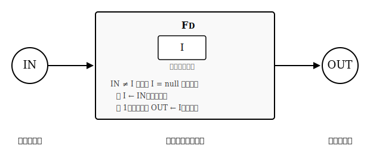
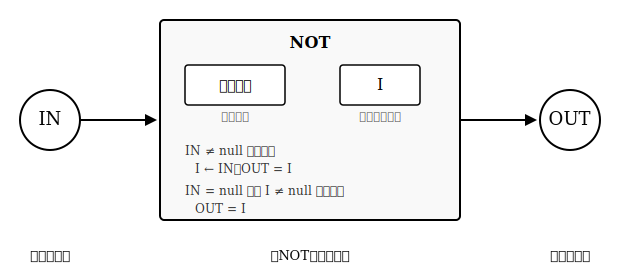
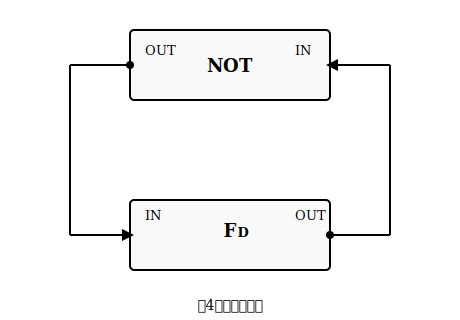
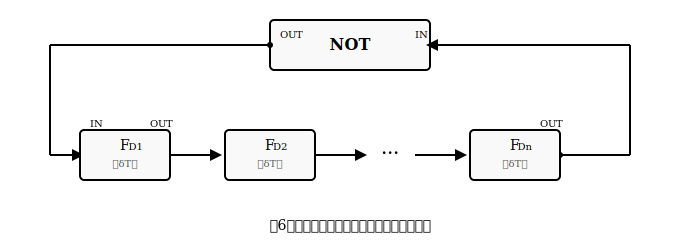

# An Information-Theoretic Framework for Information Transmission

**Author:** Noriaki Kihara
**Affiliation:** WF System Co., Ltd. (Osaka University, School of Engineering Science, graduated)
**Date:** April 2026
**Category:** Research Note
**DOI:** [10.5281/zenodo.19534345](https://doi.org/10.5281/zenodo.19534345)

---

## Abstract

Three properties are defined for information $I$: the null state, equivalence judgment, and inversion. Two types of operational elements are defined: the delay circuit $F_D$ and the NOT operation circuit. By combining these elements, discrete oscillation patterns and propagation patterns are constructed, and it is shown that the formulation of each takes mathematically identical forms to the formulas for simple harmonic oscillation, uniform propagation, and the fundamental vibration of a string. This paper contains no physical claims and deals solely with the consistency of the model as a computational framework.

---

## 1. Introduction

This paper formulates information transmission as an abstract computational process and organizes the discrete patterns derived from its operational rules.

Specifically, two operational elements are defined: a delay circuit that transmits information from input to output, and a NOT operation circuit that inverts information. Three configurations are considered: a single element with feedback connection, a series connection, and a series connection with feedback added. The expressions obtained from each configuration are compared with known physical formulas.

---

## 2. Preliminaries: Definitions and Basic Concepts

### 2.1 Scope and Limitations of This Paper

This paper does **not** claim or prove the following:

- **Proof of theories concerning physical entities**: The delay circuit treated in this paper is an abstract model of information computation, and does not claim the validity of any particular physical system or physical law.
- **Proof of rigor in information theory**: "Information" in this paper differs from the information quantity $I$ in Shannon information theory, and does not aim for rigorous argument based on the axioms of information theory.

What this paper shows is that when information transmission from input to output is formulated as an abstract computational process, the **operational consistency** of that process is maintained.

### 2.2 Definition of the Delay Circuit

**Information $I$** means any information that can be represented numerically. Its form may be arbitrary: scalar values, complex values, matrices, tensors, etc. However, information $I$ is assumed to satisfy the following properties:

1. **Existence of the null state**: A state in which information does not exist, $I = \mathrm{null}$, can be defined.
2. **Possibility of null judgment**: For any information $I$, it can be determined whether $I = \mathrm{null}$ or not. The comparison $\mathrm{null} = \mathrm{null}$ is taken to be true.
3. **Definition of class**: Information belongs to a class (type). For any two pieces of information $I_a,\, I_b$, it can be determined whether they belong to the same class or not. For example, a real number and an array belong to different classes. $\mathrm{null}$ is assumed to belong to any class (i.e., for any information $I$, the class judgment between $\mathrm{null}$ and $I$ always yields the same class).
4. **Possibility of equivalence judgment**: For any two pieces of information $I_a,\, I_b$ belonging to the same class, it can be determined whether $I_a = I_b$ (whether they are the same information).
5. **Definition of inversion**: For any information $I$, its inversion $\overline{I}$ can be defined. Inversion is an operation within the same class and satisfies $\overline{\overline{I}} = I$ (double inversion returns to the original). Also, $\overline{\mathrm{null}} = \mathrm{null}$.

**Information transmission** is defined as the transmission of information $I$ from an input point $\mathrm{IN}$ to an output point $\mathrm{OUT}$.

The operation

$$
\mathrm{OUT} = F_D(\mathrm{IN})
$$

that performs information transmission defines $F_D$ as a **delay circuit**. The delay circuit requires that the input information and output information belong to the same class.

**Figure 1: Delay circuit**

### 2.3 The Role of Delay in Information Transmission

**Figure 2: Internal structure of the delay circuit**

#### Internal Structure of the Delay Circuit

The information observable from inside the delay circuit $F_D$ consists of the following two elements:

- **Input information $\mathrm{IN}$**: Information supplied from outside. It can only be referenced and cannot be modified from within $F_D$.
- **Internal information $I$**: Information held internally by $F_D$. It is observable from outside as $\mathrm{OUT}$, but cannot be modified from outside.

#### Initial State

The initial state of the delay circuit $F_D$ is $I = \mathrm{null}$, $\mathrm{OUT} = \mathrm{null}$.

#### Operational Rules

The delay circuit $F_D$ operates according to the following rules:

1. If $\mathrm{IN} \neq I$, or if $I = \mathrm{null}$:
   - Copy the input information $\mathrm{IN}$ to the internal information $I$ ($I \leftarrow \mathrm{IN}$)
   - After a delay of one step, output the internal information $I$ to the output $\mathrm{OUT}$
2. If $\mathrm{IN} = I$:
   - Do nothing ($\mathrm{OUT}$ does not change)

#### Observable Quantities from Outside

The operation of the delay circuit $F_D$ proceeds in discrete steps. The only quantity observable from outside is the number of times the delay operation has been executed (the delay count $n$). Since the NOT operation circuit operates without delay, it is not included in the delay count $n$.

### 2.4 NOT Operation Circuit

The NOT operation circuit is a circuit that holds internal information $I$, inverts the input information $\mathrm{IN}$, and outputs it immediately (without delay). The input information $\mathrm{IN}$, internal information $I$, and output information $\mathrm{OUT}$ all belong to the same class.

- **Internal information $I$**: Holds the inversion of $\mathrm{IN}$. Observable from outside as $\mathrm{OUT}$.

#### Operational Rules

1. If $\mathrm{IN} \neq \mathrm{null}$:
   - $I \leftarrow \overline{\mathrm{IN}}$, $\mathrm{OUT} = I$
2. If $\mathrm{IN} = \mathrm{null}$ and $I \neq \mathrm{null}$:
   - $\mathrm{OUT} = I$ (output the internal information as is)
3. If $\mathrm{IN} = \mathrm{null}$ and $I = \mathrm{null}$:
   - $\mathrm{OUT} = \mathrm{null}$

**Figure 3: NOT operation circuit**

---

## 3. Simple Oscillation Circuit

The delay circuit $F_D$ and the NOT operation circuit are connected to form the following feedback structure. The output of $F_D$ is connected to the input of NOT, and the output of NOT is connected to the input of $F_D$.

**Figure 4: Simple oscillation circuit**

### 3.1 Oscillation Sequence

The following shows the output transitions of the simple oscillation circuit at each step.

| Delay count $n$ |  $F_D$ OUT   |   NOT OUT    |
| :----------: | :-------------: | :-------------: |
|      0       | $\mathrm{null}$ | $\mathrm{null}$ |
|      1       |       $I$       | $\overline{I}$  |
|      2       | $\overline{I}$  |       $I$       |
|      3       |       $I$       | $\overline{I}$  |
|      4       | $\overline{I}$  |       $I$       |
|   $\vdots$   |    $\vdots$     |    $\vdots$     |

For $n \geq 1$, the output of $F_D$ alternates between $I$ and $\overline{I}$. This is a discrete oscillation.

### 3.2 Formulation

Let information $I$ be a scalar value and define the inversion as $\overline{I} = -I$. The output of $F_D$ in the simple oscillation circuit is expressed as follows:

$$
x(n) = I \cdot (-1)^{n+1} \quad (n = 1, 2, 3, \ldots)
$$

That is, the output alternates between $I$ and $-I$ with respect to the delay count $n$.

---

## 4. Open String Information Transmission Model

Consider a structure in which $n$ delay circuits $F_{D1}, F_{D2}, \ldots, F_{Dn}$ are connected in series, with an input point $\mathrm{IN}_1$ at the left end and an output point $\mathrm{OUT}_n$ at the right end. This corresponds to a model of a string with free ends.

**Figure 5: Open string information transmission model**

### 4.1 Propagation Sequence

The following shows the output transitions when information $I$ is given to $\mathrm{IN}_1$ at delay count $n = 0$.

| Delay count $n$ | $\mathrm{IN}_1$ | $\mathrm{OUT}_1$ | $\mathrm{OUT}_2$ | $\mathrm{OUT}_3$ | $\cdots$ | $\mathrm{OUT}_n$ |
| :----------: | :-------------: | :--------------: | :--------------: | :--------------: | :------: | :--------------: |
|      0       |       $I$       | $\mathrm{null}$  | $\mathrm{null}$  | $\mathrm{null}$  | $\cdots$ | $\mathrm{null}$  |
|      1       |       $I$       |       $I$        | $\mathrm{null}$  | $\mathrm{null}$  | $\cdots$ | $\mathrm{null}$  |
|      2       |       $I$       |       $I$        |       $I$        | $\mathrm{null}$  | $\cdots$ | $\mathrm{null}$  |
|      3       |       $I$       |       $I$        |       $I$        |       $I$        | $\cdots$ | $\mathrm{null}$  |
|   $\vdots$   |    $\vdots$     |     $\vdots$     |     $\vdots$     |     $\vdots$     | $\ddots$ |     $\vdots$     |
|     $n$      |       $I$       |       $I$        |       $I$        |       $I$        | $\cdots$ |       $I$        |

Information $I$ propagates one $F_D$ element at a time per delay operation.

### 4.2 Formulation

Let $k$ denote the arrival position of information after $n$ delay operations (the index number of the leading $F_D$):

$$
k = n
$$

That is, the arrival position of information is linear with respect to the delay count.

---

## 5. Closed String Information Transmission Model

In the open string structure of Chapter 4, the output $\mathrm{OUT}_n$ of $F_{Dn}$ is connected to the input $\mathrm{IN}_1$ of $F_{D1}$ via a NOT operation circuit, forming a negative feedback loop.

**Figure 6: Closed string information transmission model (negative feedback)**

### 5.1 Propagation Sequence

The following shows the propagation sequence for the case of three $F_D$ elements ($F_{D1}, F_{D2}, F_{D3}$). As the initial condition, information $I$ is given to $F_{D1}$.

| Loop $m$ | Delay count $n$ | $\mathrm{IN}_1$ | $\mathrm{OUT}_1$ | $\mathrm{OUT}_2$ | $\mathrm{OUT}_3$ |   NOT OUT    |
| :--------: | :----------: | :-------------: | :--------------: | :--------------: | :--------------: | :-------------: |
|     0      |      0       |       $I$       | $\mathrm{null}$  | $\mathrm{null}$  | $\mathrm{null}$  | $\mathrm{null}$ |
|     0      |      1       |       $I$       |       $I$        | $\mathrm{null}$  | $\mathrm{null}$  | $\mathrm{null}$ |
|     0      |      2       |       $I$       |       $I$        |       $I$        | $\mathrm{null}$  | $\mathrm{null}$ |
|     0      |      3       |       $I$       |       $I$        |       $I$        |       $I$        | $\overline{I}$  |
|     1      |      4       | $\overline{I}$  |  $\overline{I}$  |       $I$        |       $I$        | $\overline{I}$  |
|     1      |      5       | $\overline{I}$  |  $\overline{I}$  |  $\overline{I}$  |       $I$        | $\overline{I}$  |
|     1      |      6       | $\overline{I}$  |  $\overline{I}$  |  $\overline{I}$  |  $\overline{I}$  |       $I$       |
|     2      |      7       |       $I$       |       $I$        |  $\overline{I}$  |  $\overline{I}$  |       $I$       |
|     2      |      8       |       $I$       |       $I$        |       $I$        |  $\overline{I}$  |       $I$       |
|     2      |      9       |       $I$       |       $I$        |       $I$        |       $I$        | $\overline{I}$  |
|     3      |      10      | $\overline{I}$  |  $\overline{I}$  |       $I$        |       $I$        | $\overline{I}$  |
|     3      |      11      | $\overline{I}$  |  $\overline{I}$  |  $\overline{I}$  |       $I$        | $\overline{I}$  |
|     3      |      12      | $\overline{I}$  |  $\overline{I}$  |  $\overline{I}$  |  $\overline{I}$  |       $I$       |

For each loop $m$, a wave of $I$ and $\overline{I}$ propagates from $F_{D1}$ to $F_{Dn}$, is inverted by NOT at the right end, and the next loop begins. One loop consists of $n$ operations, and one complete oscillation of $I$ and $\overline{I}$ (2 loops: $I \to \overline{I} \to I$) consists of $2n$ operations.

### 5.2 Formulation

In a closed string consisting of $n$ $F_D$ elements, $n$ delay operations are required for information to pass through all elements. Since one oscillation including inversion at NOT ($I \to \overline{I} \to I$) comprises 2 loops, the number of delay operations required for one oscillation is $2n$.

$$
N_{\text{oscillation}} = 2n
$$

Meanwhile, for the fundamental vibration (mode 1) of a string fixed at both ends, one oscillation is completed while the wave makes one round trip along the full length of the string. If the string is divided into $n$ discrete elements and one step is required to pass through one element, the number of steps per oscillation is likewise $2n$.

The structure of both is identical.

---

## 6. Discussion

In this paper, using only the minimal definitions of two types of operational elements (the delay circuit $F_D$ and the NOT operation circuit) and information $I$, the following three correspondences were obtained.

| Configuration | Result of this model | Analogous physical structure |
|:---|:---|:---|
| $F_D$ + NOT (single loop) | $x(n) = I \cdot (-1)^{n+1}$ | Simple harmonic oscillation |
| Series connection of $F_D$ (open string) | Arrival position $k = n$ (linear propagation) | Uniform propagation |
| Series $F_D$ + NOT (closed string) | 1 oscillation $= 2n$ operations | Fundamental vibration of a string (mode 1) |

In each case, the patterns derived from the operational rules of this model share structural commonality with analogous physical structures. This commonality is a consequence of the operational consistency of this model and does not constitute a physical claim.

---

## 7. Conclusion

Three properties were defined for information $I$: the null state, equivalence judgment, and inversion. Two operational elements were defined: the delay circuit $F_D$ and the NOT operation circuit. By combining these elements, discrete oscillation and propagation patterns corresponding to simple harmonic oscillation, linear propagation, and the fundamental vibration of a string were constructed, and it was shown that each yields the same pattern as the corresponding known physical structure.

---

## References

[1] Yasuo Hara, *Fundamentals of Physics*, Gakujutsu Tosho Shuppansha.  
[2] Morikazu Toda, *Theory of Oscillations*, Iwanami Shoten.
