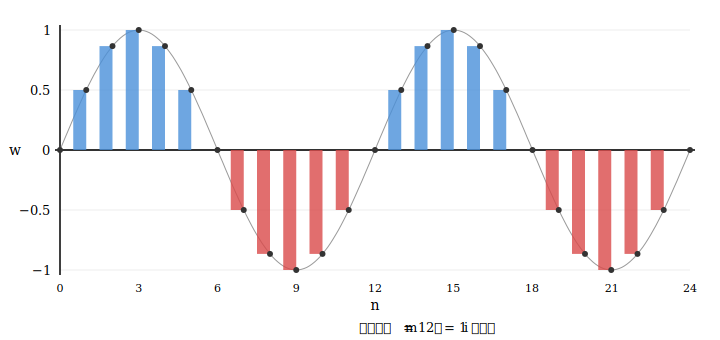
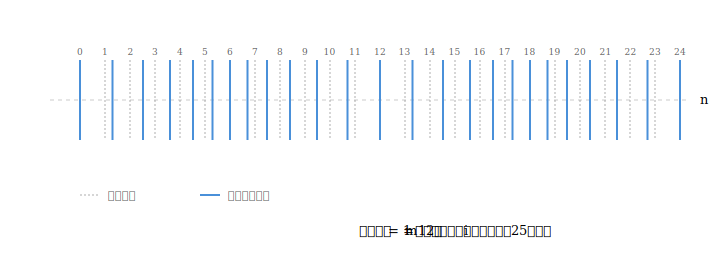

# ディレイ回路モデルでの単振動・正弦波モデルの実現方法

**著者：** Noriaki Kihara（木原 範昭）  
**所属：** WF System Co., Ltd.（大阪大学 基礎工学部 卒業）  
**作成日：** 2026年4月  
**種別：** 研究ノート  
**DOI：** [10.5281/zenodo.19534349](https://doi.org/10.5281/zenodo.19534349)

---

## 概要

前稿 [1] で構成したディレイ回路モデルは，クラス $A = \{I, \overline{I}\}$ と反転（NOT）演算のみを用いたため，矩形波の振動しか表現できなかった．本稿では，前稿 [2] で導入したスーパークラス，メタ情報，演算ファンクション $*$ の枠組みを用いて，クラスの情報と $*$ 演算を具体的に定義することにより，正弦波（横波），縦波，旋回波を実現する．いずれの場合も，ディレイ回路 $F_D$ および NOT演算回路の定義は変更せず，クラスの定義と演算ファンクション $*$ の選択のみで異なる波動パターンが得られることを示す．

---

## 1. はじめに

前稿 [1] では，クラス $A = \{I, \overline{I}\}$ と反転（NOT）演算のみを用いて，離散的な矩形波振動を構成した．前稿 [2] では，スーパークラス，メタ情報（カウンタ $n$，演算ファンクション $*$），および $F_D$ の拡張定義を導入した．

本稿では，[2] の枠組みを用いて，クラス $A$ の情報，メタ情報，および演算ファンクション $*$ を具体的に定義することにより，正弦波（縦波・横波・旋回波）を実現するモデルを構成する．

---

## 2. 準備：前稿の定義の要約

本稿は，前稿 [1] で定義したディレイ回路 $F_D$，NOT演算回路，および情報 $I$ の性質（null 状態，等価判定，反転）を前提とする．また，前稿 [2] で導入した以下の概念を用いる：

- **スーパークラス**：異なるクラスに属する情報の組 $(A, B, C_1, \ldots, C_m)$（[2] §3.2）
- **メタ情報**：カウンタ $n$（ディレイ回数）および演算ファンクション $*$（[2] §3.2）
- **$F_D$ の拡張定義**：$F_D$ 通過時にカウンタ $n$ をインクリメントし，$*$ が $\mathrm{null}$ でなければ実行する（[2] §3.3）

これらの定義の詳細は各前稿を参照されたい．

---

## 3. 単振動クラス $A$ の定義

### 3.1 前稿における単振動回路

前稿 [1] §3 において，ディレイ回路 $F_D$ とNOT演算回路を接続し，以下の帰還構造を構成した．$F_D$ の出力を NOT の入力に，NOT の出力を $F_D$ の入力に接続する．

**図1：単振動回路（[1] 図4 再掲）**

単振動回路の各回における出力の遷移を以下に示す．

| ディレイ回数 $n$ |  $F_D$ の OUT   |   NOT の OUT    |
| :----------: | :-------------: | :-------------: |
|      0       | $\mathrm{null}$ | $\mathrm{null}$ |
|      1       |       $I$       | $\overline{I}$  |
|      2       | $\overline{I}$  |       $I$       |
|      3       |       $I$       | $\overline{I}$  |
|      4       | $\overline{I}$  |       $I$       |
|   $\vdots$   |    $\vdots$     |    $\vdots$     |

$n \geq 1$ において，$F_D$ の出力は $I$ と $\overline{I}$ を交互に繰り返す．これは離散的な振動である．

情報 $I$ をスカラー値とし，反転を $\overline{I} = -I$ と定めると，単振動回路の $F_D$ の出力は次のように表される：

$$
x(n) = I \cdot (-1)^{n+1} \quad (n = 1, 2, 3, \ldots)
$$

すなわち，出力はディレイ回数 $n$ に対して $I$ と $-I$ を交互に繰り返す．これは矩形波である．

### 3.2 矩形波のクラス $A$ の定義

前稿 [2] の枠組みにおいて，§3.1 の矩形波振動を再定義する．

- **クラス $A$ の情報**：スカラー値 $i$
- **メタ情報**：$\mathrm{null}$（カウンタ $n$，演算ファンクション $*$ ともに不要）

反転は NOT演算回路により $\overline{i} = -i$ として与えられる．メタ情報が $\mathrm{null}$ であるため，$F_D$ 通過時に追加の演算は実行されず，§3.1 の単振動回路と同一の結果を与える．

$$
x(n) = i \cdot (-1)^{n+1} \quad (n = 1, 2, 3, \ldots)
$$

### 3.3 矩形波のクラス $A$ による伝播と振動

§3.2 で定義した矩形波のクラス $A$（スカラー値 $i$，メタ情報 $\mathrm{null}$）を，前稿 [1] §4 の開いた縄モデルおよび §5 の閉じた縄モデルに適用する．

メタ情報が $\mathrm{null}$ であるため，$F_D$ 通過時に追加の演算は実行されない．$F_D$ の基本演算規則（入力情報を内部にコピーし，1ステップの遅延の後に出力する）のみが動作する．

したがって，開いた縄モデルでは情報 $i$ が各 $F_D$ を1ステップずつそのまま通過し，[1] §4 と同一の伝播シーケンス（到達位置 $k = n$）を与える．閉じた縄モデルでは，NOT演算回路による反転を含め，[1] §5 と同一の振動シーケンス（1振動 $= 2n$ 回の演算）を与える．

すなわち，矩形波のクラス $A$ は，前稿 [1] の全構成（単振動回路，開いた縄，閉じた縄）の結果をそのまま再現する．

### 3.4 横波のクラス $B$ の定義

横波を実現するクラス $B$ を以下のように定義する．

**クラス $B$ の情報：**

- $i$：スカラー値（入力値．クラス $A$ と同一）
- $w$：実数値（振幅．出力用）

**メタ情報：**

- $n$：カウンタ（ディレイ回数．[2] §3.3 の定義による）
- $m$：波長に相当するディレイ回数（$1, 2, 3, \ldots$ の正の整数）

**演算ファンクション $*$：**

$$
w = i \cdot \sin\!\left(\frac{n}{m} \cdot 360°\right)
$$

$F_D$ を通過するたびに $n$ がインクリメントされ，演算ファンクション $*$ が実行されて $w$ が更新される．出力 $w$ を観測すれば，ディレイ回数 $n$ の進行に伴い正弦波的な振動を得る．

### 3.5 クラス $B$ の振動シーケンス

$i = 1$，$m = 12$ の場合，単振動回路における $F_D$ の出力 $w$ の遷移を以下に示す．

| ディレイ回数 $n$ | $n/m \cdot 360°$ | $w = \sin(n/m \cdot 360°)$ |
| :----------: | :---------------: | :------------------------: |
|      0       |        0°         |           0.000            |
|      1       |        30°        |           0.500            |
|      2       |        60°        |           0.866            |
|      3       |        90°        |           1.000            |
|      4       |       120°        |           0.866            |
|      5       |       150°        |           0.500            |
|      6       |       180°        |           0.000            |
|      7       |       210°        |          −0.500            |
|      8       |       240°        |          −0.866            |
|      9       |       270°        |          −1.000            |
|      10      |       300°        |          −0.866            |
|      11      |       330°        |          −0.500            |
|      12      |       360°        |           0.000            |

$n = 12$ で1周期が完了し，以降は同じパターンを繰り返す．

**図7：クラス $B$ の振動シーケンス（メタ情報 $m = 12$，$i = 1$ の場合）**

棒グラフは各ディレイ回数 $n$ における離散的な出力 $w$ を示し，細線は連続的な正弦波を示す．

## 4. 縦波の実現

### 4.1 縦波のクラス $C$ の定義

縦波を実現するクラス $C$ を定義する．クラス $C$ の情報，メタ情報，演算ファンクション $*$ の構造は，クラス $B$（§3.4）と全く同一である．

- **クラス $C$ の情報**：スカラー値 $i$，実数値 $w$
- **メタ情報**：カウンタ $n$，波長に相当するディレイ回数 $m$
- **演算ファンクション $*$**：$w = i \cdot \sin(n / m \cdot 360°)$

クラス $B$ との違いは，出力 $w$ の解釈のみである．クラス $B$ では $w$ を伝播方向に垂直な変位（横波）として扱ったが，クラス $C$ では $w$ を**伝播方向の変位**として扱う．すなわち，各 $F_D$ の基準位置からの横軸方向のずれとして $w$ を解釈する．

### 4.2 縦波の可視化

開いた縄モデルにクラス $C$ を適用した場合，各 $F_D$ は基準位置から $w$ だけ伝播方向にずれる．これにより，棒が密集する領域（密）と疎になる領域（疎）が交互に現れ，縦波の疎密パターンが得られる．

**図8：クラス $C$ による縦波の疎密パターン（メタ情報 $m = 12$，$i = 1$ の場合）**

破線は各 $F_D$ の基準位置，実線は $w$ による変位後の位置を示す．

---

## 5. 旋回波の実現

### 5.1 旋回波のクラス $D$ の定義

旋回波を実現するクラス $D$ を定義する．クラス $D$ の情報およびメタ情報の構造は，クラス $B$（§3.4）と全く同一である．

- **クラス $D$ の情報**：スカラー値 $i$，実数値 $w$
- **メタ情報**：カウンタ $n$，波長に相当するディレイ回数 $m$

クラス $B$ との違いは，演算ファンクション $*$ と出力 $w$ の解釈のみである．

**演算ファンクション $*$：**

$$
w = \frac{n}{m} \cdot 360° \mod 360°
$$

出力 $w$ を**角度**として解釈する．$F_D$ を通過するたびに $n$ がインクリメントされ，$w$ が更新される．$w$ は $0°$ から $360°$ まで一定の増分で進行し，$360°$ に達すると $0°$ に戻る．

### 5.2 クラス $D$ の振動シーケンス

$i = 1$，$m = 12$ の場合，単振動回路における $F_D$ の出力 $w$（角度）の遷移を以下に示す．

| ディレイ回数 $n$ | $w = (n/m \cdot 360°) \mod 360°$ |
| :----------: | :------------------------------: |
|      0       |               0°                 |
|      1       |              30°                 |
|      2       |              60°                 |
|      3       |              90°                 |
|      4       |             120°                 |
|      5       |             150°                 |
|      6       |             180°                 |
|      7       |             210°                 |
|      8       |             240°                 |
|      9       |             270°                 |
|      10      |             300°                 |
|      11      |             330°                 |
|      12      |               0°                 |
|      13      |              30°                 |
|      14      |              60°                 |
|   $\vdots$   |            $\vdots$              |

$n = 12$ で1周（$360°$）が完了し，以降は同じパターンを繰り返す．出力 $w$ を角度として解釈すれば，これは一定の角速度で旋回する運動である．

---

## 6. 結論

前稿 [2] で導入したスーパークラス，メタ情報，演算ファンクション $*$ の枠組みを用いて，横波（正弦波），縦波，旋回波を実現するクラス $B$, $C$, $D$ を定義した．以下に各クラスの対応を整理する．

| クラス | 情報 | メタ情報 | 演算 $*$ | 出力 $w$ の解釈 | 実現する波動 |
|:---:|:---|:---|:---|:---|:---|
| $A$ | $i$ | $\mathrm{null}$ | $\mathrm{null}$ | — | 矩形波 |
| $B$ | $i$, $w$ | $n$, $m$ | $w = i \cdot \sin(n/m \cdot 360°)$ | 伝播方向に垂直な変位 | 横波（正弦波） |
| $C$ | $i$, $w$ | $n$, $m$ | $w = i \cdot \sin(n/m \cdot 360°)$ | 伝播方向の変位 | 縦波 |
| $D$ | $i$, $w$ | $n$, $m$ | $w = (n/m \cdot 360°) \mod 360°$ | 角度 | 旋回波 |

いずれの場合も，ディレイ回路 $F_D$ およびNOT演算回路の定義（[1] §2.2〜§2.4）は一切変更していない．クラスの情報と演算ファンクション $*$ の選択のみで，矩形波を含む4種類の波動パターンが構成できることを示した．

---

## 参考文献

[1] 木原範昭「情報伝達の情報論的整理」研究ノート，2026年4月．  
[2] 木原範昭「ディレイ回路モデルに内在する対称性の整理」研究ノート，2026年4月．
