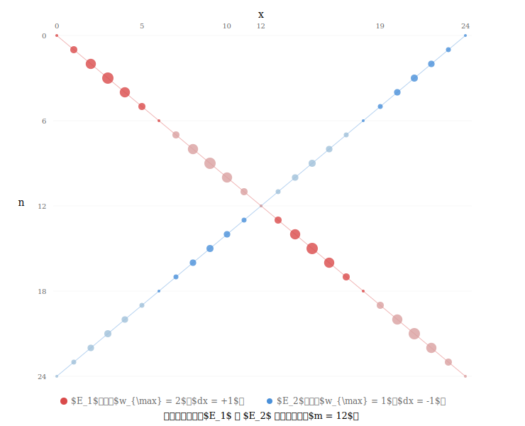
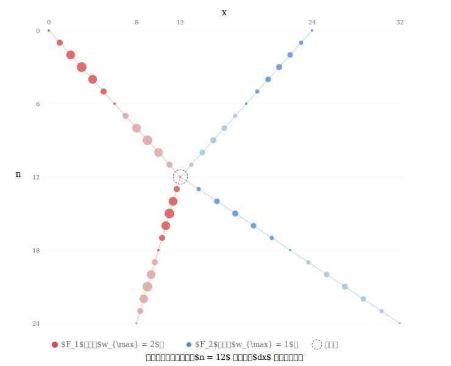

# ディレイ回路モデルでの完全弾性衝突の実現

**著者：** Noriaki Kihara（木原 範昭）  
**所属：** WF System Co., Ltd.（大阪大学 基礎工学部 卒業）  
**作成日：** 2026年4月  
**種別：** 研究ノート  

---

## 概要

前稿 [3] で定義したクラス $B$（横波）を拡張し，位置情報と変位量を持つクラス $E$ を定義する．クラス $E$ の2つのインスタンスが逆方向に伝播する非干渉モデルを構成した後，各インスタンスごとの衝突半径 $r$ と完全弾性衝突の公式を演算ファンクション $*$ に追加したクラス $F$ を定義する．$w_{\max}$ を質量の類似物として扱うことで，運動量とエネルギーの保存を満たす完全弾性衝突が実現される．ディレイ回路 $F_D$ およびNOT演算回路の定義は変更しない．

---

## 1. はじめに

前稿 [1] ではディレイ回路 $F_D$ とNOT演算回路により振動・伝播パターンを構成した．前稿 [2] ではスーパークラス，メタ情報，演算ファンクション $*$ の枠組みを導入した．前稿 [3] ではクラス $B$ により正弦波（横波）を実現した．

本稿では，クラス $B$ を拡張したクラス $E$ を定義し，2つのインスタンスが同一の開いた縄モデル上を逆方向に伝播する場合を扱う．まず相互作用のないモデル（すれ違い）を構成し，次に完全弾性衝突を実現するモデルを構成する．

---

## 2. 準備：前稿の定義の要約

本稿は，前稿 [1] のディレイ回路 $F_D$，NOT演算回路，前稿 [2] のスーパークラス・メタ情報・演算ファンクション $*$，および前稿 [3] のクラス $B$（横波）を前提とする．これらの定義の詳細は各前稿を参照されたい．

---

## 3. クラス $E$ の定義

### 3.1 クラス $E$ の情報とメタ情報

クラス $B$（[3] §3.4）を拡張し，位置情報を持つクラス $E$ を以下のように定義する．

**クラス $E$ の情報：**

- $i$：スカラー値（入力値．クラス $B$ と同一）
- $w$：実数値（振幅．出力用．クラス $B$ と同一）
- $x_0$：初期位置（整数値）
- $x$：現在位置（実数値）
- $dx$：変位量（整数値．1ステップあたりの位置変化）

**メタ情報：**

- $n$：カウンタ（ディレイ回数）
- $m$：波長に相当するディレイ回数
- $w_{\max}$：最大振幅（正の実数値）
- 色：識別用の属性

### 3.2 演算ファンクション $*$

$$
x = n \cdot dx + x_0
$$

$$
w = w_{\max} \cdot \sin\!\left(\frac{n}{m} \cdot 360°\right)
$$

$F_D$ を通過するたびに $n$ がインクリメントされ，位置 $x$ と振幅 $w$ が更新される．

---

## 4. 相互作用のないモデル（すれ違い）

### 4.1 2つのインスタンスの定義

クラス $E$ のインスタンスを2つ定義する．

**$E_1$（赤）：**

| 情報/メタ情報 | 値   |
| :------------ | :--- |
| $x_0$         | 0    |
| $x$           | 0    |
| $dx$          | $+1$ |
| $m$           | 12   |
| $w_{\max}$    | 2    |
| 色            | 赤   |

**$E_2$（青）：**

| 情報/メタ情報 | 値   |
| :------------ | :--- |
| $x_0$         | 24   |
| $x$           | 24   |
| $dx$          | $-1$ |
| $m$           | 12   |
| $w_{\max}$    | 1    |
| 色            | 青   |

### 4.2 すれ違いのシーケンス

$E_1$ と $E_2$ は独立に演算 $*$ を実行し，互いに影響を与えない．各ステップにおける位置を以下に示す．

|   $n$    | $E_1$ の $x$ | $E_2$ の $x$ |
| :------: | :----------: | :----------: |
|    0     |      0       |      24      |
|    1     |      1       |      23      |
|    2     |      2       |      22      |
| $\vdots$ |   $\vdots$   |   $\vdots$   |
|    12    |      12      |      12      |
| $\vdots$ |   $\vdots$   |   $\vdots$   |
|    24    |      24      |      0       |

$n = 12$ で $E_1$ と $E_2$ は同一位置 $x = 12$ に到達するが，相互作用がないためそのまますれ違い，$n = 24$ で互いの初期位置に到達する．

### 4.3 すれ違いの可視化

以下の時空間ダイアグラムに，$E_1$（赤）と $E_2$（青）の軌跡を示す．横軸は位置 $x$，縦軸はディレイ回数 $n$（上から下へ進行）である．各点の大きさは振幅 $|w|$ に対応し，濃色は $w > 0$，淡色は $w < 0$ を表す．

**図9：非干渉モデル — $E_1$ と $E_2$ のすれ違い（$m = 12$）**

$n = 12$ で両者は同一位置 $x = 12$ を通過するが，相互作用がないためそのまますれ違い，それぞれ直進を続ける．

---

## 5. 完全弾性衝突のモデル

### 5.1 クラス $F$ の定義

クラス $E$（§3）を拡張し，衝突機能を持つクラス $F$ を定義する．クラス $F$ の情報およびメタ情報はクラス $E$ と同一であり，以下のメタ情報を追加する：

- $r$：衝突半径（$r > 0$ の実数．各インスタンスごとに異なる値を持つことができる）

#### 衝突判定

2つのインスタンス $F_1$（衝突半径 $r_1$），$F_2$（衝突半径 $r_2$）について，以下の条件を満たすとき衝突と判定する：

$$
(x_1 - x_2)^2 < \max(r_1^2,\; r_2^2)
$$

#### 衝突時の $dx$ の更新

衝突が発生した場合，$w_{\max}$ を質量の類似物として，1次元完全弾性衝突の公式により $dx$ を更新する：

$$
dx_1^{\text{new}} = \frac{(w_{\max,1} - w_{\max,2}) \cdot dx_1 + 2\, w_{\max,2} \cdot dx_2}{w_{\max,1} + w_{\max,2}}
$$

$$
dx_2^{\text{new}} = \frac{(w_{\max,2} - w_{\max,1}) \cdot dx_2 + 2\, w_{\max,1} \cdot dx_1}{w_{\max,1} + w_{\max,2}}
$$

この更新は，以下の2つの保存量を維持する：

- **運動量の類似物**：$Q = w_{\max,1} \cdot dx_1 + w_{\max,2} \cdot dx_2$
- **エネルギーの類似物**：$K = w_{\max,1} \cdot dx_1^2 + w_{\max,2} \cdot dx_2^2$

### 5.2 衝突のシーケンス

§4.1 と同一の初期条件で，簡単のため $r_1 = r_2 = 1$ とする．

**衝突前（$n < 12$）：**

$E_1$, $E_2$ と同一の軌跡をたどる（§4.2 参照）．

**$n = 12$ で衝突：**

$(x_1 - x_2)^2 < \max(r_1^2, r_2^2)$ より衝突と判定される．$dx$ を更新する：

$$
dx_1^{\text{new}} = \frac{(2-1)(1) + 2(1)(-1)}{2+1} = \frac{-1}{3} = -\frac{1}{3}
$$

$$
dx_2^{\text{new}} = \frac{(1-2)(-1) + 2(2)(1)}{2+1} = \frac{5}{3}
$$

**検証：**

$$
Q^{\text{new}} = 2 \cdot (-1/3) + 1 \cdot (5/3) = -2/3 + 5/3 = 1 = Q \quad \checkmark
$$

$$
K^{\text{new}} = 2 \cdot (1/9) + 1 \cdot (25/9) = 27/9 = 3 = K \quad \checkmark
$$

**衝突後（$n > 12$）：**

| $n$ | $F_1$ の $x$ | $F_2$ の $x$ |
| :---: | :---: | :---: |
| 12 | 12.00 | 12.00 |
| 13 | 11.67 | 13.67 |
| 14 | 11.33 | 15.33 |
| 15 | 11.00 | 17.00 |
| 18 | 10.00 | 22.00 |
| 21 | 9.00 | 27.00 |
| 24 | 8.00 | 32.00 |

$w_{\max} = 2$ の重い $F_1$ はゆっくり逆方向に戻り（$dx = -1/3$），$w_{\max} = 1$ の軽い $F_2$ は大きな速度で弾き飛ばされる（$dx = 5/3$）．

### 5.3 衝突の可視化

以下の時空間ダイアグラムに，$F_1$（赤）と $F_2$（青）の軌跡を示す．$n = 12$ の衝突点（破線円）で両者の軌跡が折れ曲がる．重い $F_1$ は衝突後ゆっくり左へ戻り，軽い $F_2$ は大きな速度で右へ弾き飛ばされる．

**図10：完全弾性衝突モデル — $n = 12$ で衝突，$dx$ が更新される**

図9（非干渉モデル）と比較すると，衝突前（$n < 12$）の軌跡は同一であるが，衝突後（$n > 12$）の軌跡の傾きが質量比（$w_{\max}$ の比）を反映して変化している．

---

## 6. 結論

クラス $E$（§3）を拡張し，位置情報と変位量を持つインスタンスを定義した．2つのインスタンスが同一の空間上を逆方向に伝播する場合について，まず相互作用のないモデル（§4，すれ違い）を構成し，次にクラス $F$（§5）により衝突半径 $r$ と完全弾性衝突の公式を演算ファンクション $*$ に追加することで，完全弾性衝突を実現した．

いずれの場合も，ディレイ回路 $F_D$ およびNOT演算回路の定義は変更していない．相互作用の有無は，演算ファンクション $*$ の定義の差異としてのみ表現される．

---

## 参考文献

[1] 木原範昭「情報伝達の情報論的整理」研究ノート，2026年4月．  
[2] 木原範昭「ディレイ回路モデルに内在する対称性の整理」研究ノート，2026年4月．  
[3] 木原範昭「ディレイ回路モデルでの単振動・正弦波モデルの実現方法」研究ノート，2026年4月．
