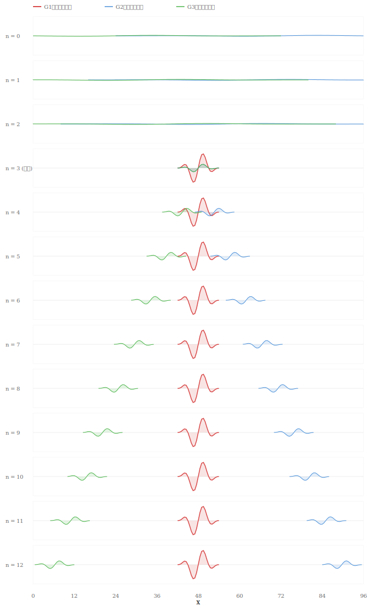

# ディレイ回路モデルでの波束の収縮モデルの実現

**著者：** Noriaki Kihara（木原 範昭）  
**所属：** WF System Co., Ltd.（大阪大学 基礎工学部 卒業）  
**作成日：** 2026年4月  
**種別：** 研究ノート  
**DOI：** [10.5281/zenodo.19534355](https://doi.org/10.5281/zenodo.19534355)

---

## 概要

本稿は，波束の収縮の物理的メカニズムを証明するものではない．前稿 [4] で定義した完全弾性衝突の枠組みを拡張し，波束の収縮に類似した挙動をディレイ回路モデル上で実現する．波束半径 $r$ と最大波高 $w_{\max}$ を情報として扱い，衝突時に $r$ が収縮し $w_{\max}$ が増大する演算ファンクション $*$ を定義することで，広がった波が相互作用により局在化する過程を構成する．

---

## 1. はじめに

前稿 [4] では，クラス $F$ により完全弾性衝突を実現した．本稿では，前稿 [4] のクラス $F$ を拡張し，波束半径 $r$ と最大波高 $w_{\max}$ を情報に昇格させたクラス $G$ を定義する．

本稿が示すのは，衝突時に $r$ が収縮し $w_{\max}$ が増大する演算規則を $*$ に追加することで，波束の収縮に類似した挙動が構成できるという事実である．本稿は実際の波束の収縮を理論的に証明するものでも，量子力学的な主張を含むものでもない．

---

## 2. クラス $G$ の定義

### 2.1 情報とメタ情報

前稿 [4] のクラス $F$ において，メタ情報であった $r$（衝突半径）と $w_{\max}$（最大波高）を情報に昇格させ，クラス $G$ を定義する．

**クラス $G$ の情報：**

- $i$：スカラー値（入力値）
- $w$：実数値（振幅）
- $x_0$：初期位置
- $x$：現在位置
- $dx$：変位量
- $r$：波束半径（$r > 0$ の実数）
- $w_{\max}$：最大波高（正の実数）

**メタ情報：**

- $n$：カウンタ（ディレイ回数）
- $m$：波長（$m = r$ として $r$ で定義する）
- $F$：種別（電子，光子，等）
- 色：識別用の属性

### 2.2 質量の類似物

質量の類似物を $M = w_{\max} \cdot r$ と定義する．衝突の前後で $M$ は保存される．

### 2.3 演算ファンクション $*$

位置と振幅の更新は前稿 [4] と同一である：

$$
x = n \cdot dx + x_0
$$

$$
w = w_{\max} \cdot \sin\!\left(\frac{n}{m} \cdot 360°\right)
$$

### 2.4 衝突時の演算

#### 相互作用の規則

- 光子と光子：相互作用しない（すれ違い）
- 光子と電子：相互作用する

#### 波束の収縮

衝突が発生した場合，光子の $r$ は以下のように更新される：

$$
r^{\text{new}} = \min(r_1, r_2)
$$

$M = w_{\max} \cdot r$ が保存されるため，$r$ の収縮に伴い $w_{\max}$ が増大する：

$$
w_{\max}^{\text{new}} = \frac{M}{r^{\text{new}}} = \frac{w_{\max} \cdot r}{r^{\text{new}}}
$$

波長も更新される：$m^{\text{new}} = r^{\text{new}}$

#### $dx$ の更新

$dx$ の更新は前稿 [4] §5.1 の完全弾性衝突の公式に従う．質量の類似物 $M = w_{\max} \cdot r$ を用いる：

$$
dx_1^{\text{new}} = \frac{(M_1 - M_2) \cdot dx_1 + 2\, M_2 \cdot dx_2}{M_1 + M_2}
$$

$$
dx_2^{\text{new}} = \frac{(M_2 - M_1) \cdot dx_2 + 2\, M_1 \cdot dx_1}{M_1 + M_2}
$$

---

## 3. 波束の収縮のシーケンス

### 3.1 インスタンスの定義

3つのインスタンスを定義する．

**$G_1$（電子，赤）：**

| 情報/メタ情報 | 値 |
|:---|:---|
| $x_0$ | 48 |
| $dx$ | 0（静止） |
| $r$ | 6 |
| $w_{\max}$ | 30 |
| $M = w_{\max} \cdot r$ | 180 |
| $F$ | 電子 |

**$G_2$（光子，青）：**

| 情報/メタ情報 | 値 |
|:---|:---|
| $x_0$ | 72 |
| $dx$ | $-8$ |
| $r$ | 48 |
| $w_{\max}$ | 1 |
| $M = w_{\max} \cdot r$ | 48 |
| $F$ | 光子 |

**$G_3$（光子，緑）：**

| 情報/メタ情報 | 値 |
|:---|:---|
| $x_0$ | 24 |
| $dx$ | $+8$ |
| $r$ | 48 |
| $w_{\max}$ | 1 |
| $M = w_{\max} \cdot r$ | 48 |
| $F$ | 光子 |

$G_2$ と $G_3$ は広い波束半径（$r = 48$）を持つ光子であり，$G_1$ は狭い波束半径（$r = 6$）を持つ電子である．$G_1$ は初期状態では存在せず，$n = 3$ で外部介入（[2] §3.5）により出現するものとする．

### 3.2 衝突前（$n = 0, 1, 2$）

$G_2$ と $G_3$ は独立に伝播する．$G_1$ はまだ存在しない．

| $n$ | $G_2$ の $x$ | $G_3$ の $x$ |
| :---: | :---: | :---: |
| 0 | 72 | 24 |
| 1 | 64 | 32 |
| 2 | 56 | 40 |

$G_2$ と $G_3$ はともに光子であるため，相互作用せずすれ違う．

### 3.3 $n = 3$：外部介入と衝突

$n = 3$ で外部介入により $G_1$（電子）が $x = 48$ に出現する．

$G_2$ の位置は $x = 48$，$G_3$ の位置は $x = 48$ であり，3者が同一位置 $x = 48$ に到達する．$(x_1 - x_2)^2 < \max(r_1^2, r_2^2)$ より衝突と判定される．

**波束の収縮：**

$$
r^{\text{new}} = \min(48, 6) = 6
$$

$$
w_{\max}^{\text{new}} = \frac{48}{6} = 8
$$

$$
m^{\text{new}} = 6
$$

**$dx$ の更新（対称性による）：**

$G_2$ と $G_3$ は $G_1$ に対して対称な位置・対称な速度で衝突するため，$G_1$ に加わる力積は相殺され，$G_1$ は静止を維持する（$dx_1 = 0$）．

$$
dx_2^{\text{new}} = \frac{(48 - 180)(-8) + 2 \cdot 180 \cdot 0}{48 + 180} = \frac{1056}{228} \approx +4.632
$$

$$
dx_3^{\text{new}} = \frac{(48 - 180)(+8) + 2 \cdot 180 \cdot 0}{48 + 180} = \frac{-1056}{228} \approx -4.632
$$

### 3.4 衝突後（$n > 3$）

| $n$ | $G_1$ の $x$ | $G_2$ の $x$ | $G_3$ の $x$ |
| :---: | :---: | :---: | :---: |
| 3 | 48.00 | 48.00 | 48.00 |
| 4 | 48.00 | 52.63 | 43.37 |
| 5 | 48.00 | 57.26 | 38.74 |
| 6 | 48.00 | 61.89 | 34.11 |
| 9 | 48.00 | 75.79 | 20.21 |
| 12 | 48.00 | 89.68 | 6.32 |

$G_1$（電子）は静止を維持し，$G_2$, $G_3$（光子）は収縮した波束（$r = 6$，$w_{\max} = 8$，$m = 6$）として反対方向に離れていく．

### 3.5 波束の収縮の可視化

以下に，各ディレイ回数 $n$ における波束の形状を示す．横軸は位置 $x$，縦軸は振幅 $w$ である．

$n = 0, 1, 2$：$G_2$（青）と $G_3$（緑）は広い波束（$r = 48$，$w_{\max} = 1$）として空間全体に広がっている．

$n = 3$：外部介入により $G_1$（電子，赤）が出現し，衝突が発生する．$G_2$, $G_3$ の波束が $r = 6$，$w_{\max} = 8$ に収縮する．

$n = 4, 5, \ldots, 12$：収縮した $G_2$, $G_3$ が狭く高い波束として反対方向に離れていく．

**図11：波束の収縮 — $n = 0$ から $n = 12$ における波束の形状変化**

---

## 4. 結論

前稿 [4] のクラス $F$（完全弾性衝突）を拡張し，波束半径 $r$ と最大波高 $w_{\max}$ を情報に昇格させたクラス $G$ を定義した．質量の類似物 $M = w_{\max} \cdot r$ の保存のもとで，衝突時に $r$ が収縮し $w_{\max}$ が増大する演算規則を構成した．

広い波束（$r = 48$，$w_{\max} = 1$）を持つ光子が，狭い波束（$r = 6$）を持つ電子と衝突することで，波束が収縮（$r = 6$，$w_{\max} = 8$）し，波長が短縮（$m = 6$）する過程を実現した．これは波束の収縮に類似した挙動であるが，量子力学的な主張を含むものではない．

---

## 参考文献

[1] 木原範昭「情報伝達の情報論的整理」研究ノート，2026年4月．  
[2] 木原範昭「ディレイ回路モデルに内在する対称性の整理」研究ノート，2026年4月．  
[3] 木原範昭「ディレイ回路モデルでの単振動・正弦波モデルの実現方法」研究ノート，2026年4月．  
[4] 木原範昭「ディレイ回路モデルでの完全弾性衝突の実現」研究ノート，2026年4月．
