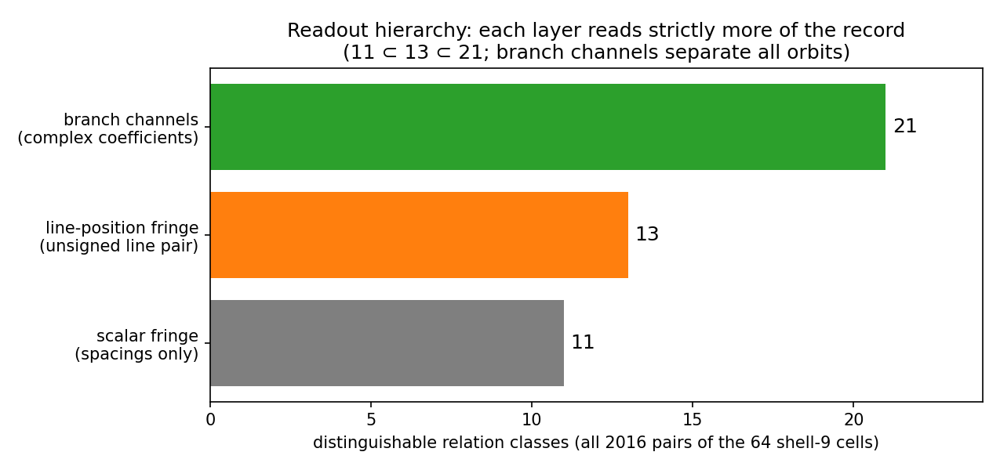
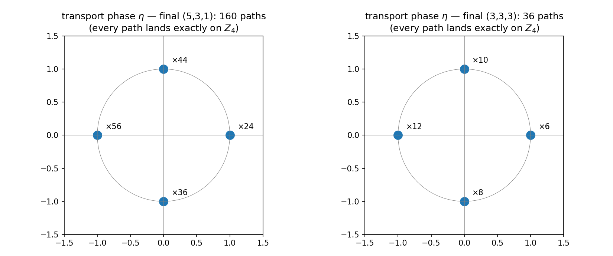
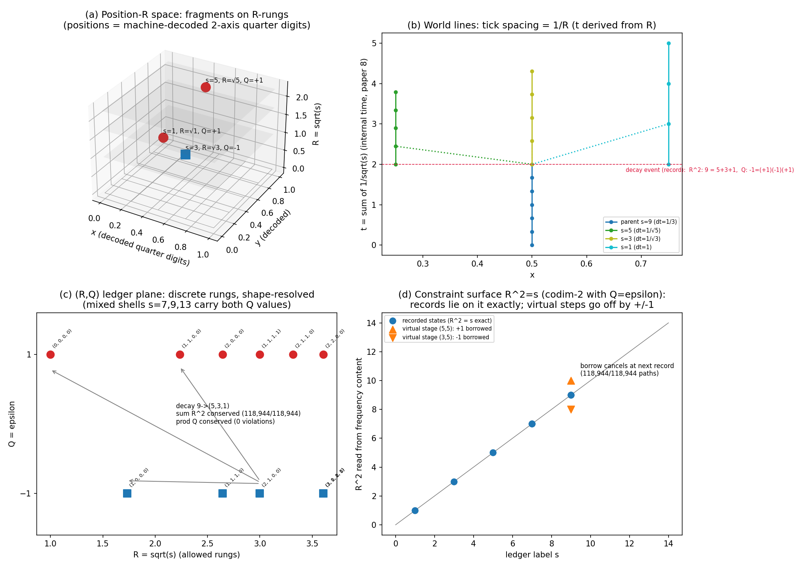
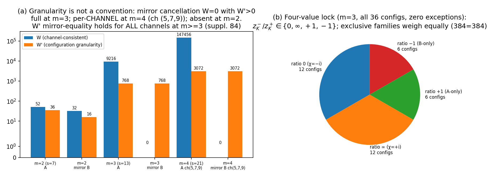

# Handout: Dual Geometry of Wavelength Space and Frequency Space — All 16 Papers + Survey (v2, fully published 2026-06-12)

**Noriaki Kihara (WF System Co., Ltd. / ORCID: 0009-0004-6753-4020) · CC BY 4.0**

## In one page

Three assumptions — **$\nu\lambda=1$ (one relation), the zero point ½ (one constant), one asymmetric bit** — plus two operating principles (configuration reading; the record principle). From this inventory alone, the series tests how far quantum-looking and spacetime-looking structures follow **as theorems**, in a discrete system that is machine-checkable at every step. Sixteen papers plus a survey, bilingual Japanese/English, published on Zenodo. **No physical identification is made** (the central thesis: a different map with the same results).

## Series map

| Part | Papers | Content |
|---|---|---|
| Foundations | 1–4 | Lattice and counting: $N_0$(R)=1, 9, 137, … (pure enumeration); splitting; the hierarchical vacuum |
| Theorems | 5–12 | Dictionary theorem; freezing theorem (time's condition = the one bit); exclusion as theorem; area law; half-wavelength censorship; emergent gauge; **necessity of dimension 4**; measurement = appending a record |
| Sequel | 13–16 | **Resolution of position and time**; time direction = complex structure; constructed & verified coordinate map; **reduction of the measure problem** |
| Survey | — | The dictionary to standard theory and the **axiom exchange balance** |

## Main results of the sequel (published 2026-06-12)

**Paper 13 — Position Had Never Been Read**: discrete position = the wave's sign sector (zero additions to the state space). Space = the Pontryagin dual of the conserved-quantity lattice (its three symmetries are theorems of duality). Three readout strata **$11\subset13\subset21$** (intensity-only fringes lose about half the information in principle). Clock targets = **all odd integers — proven via Gauss's triangular-number theorem**. t is a derived quantity (no independent inverse map).

**Paper 14 — Time Direction and the Stage of Amplitudes**: choosing a time direction = choosing a complex structure (exactly 16 lattice-compatible structures, a single $B_4$ orbit). The transport phase is derived and lands in **$Z_4$ without exception**. Symmetrization postulate → **canonical-convention theorem** (a consequence of set structure).

**Paper 15 — Projection onto xyztRQ**: explicit forward and inverse maps, state → (x,y,z,t,R,Q), built as a five-stage operation; **round trip 500/500; commutes with the conservation laws** (charge-like parity = a theorem of support arithmetic: 39.2% of raw combinations are violation candidates, yet zero violations among contributing paths). Velocity exists only in the sequence of records.

**Paper 16 — The Rigorous Reduction of the Measure Problem**: **no aggregation rule is selected.** The historical proximity 0.0007 = an artifact of two-outcome compression (with three outcomes the divergence jumps three orders). Interference granularity is not a convention: the mirror parent yields **$W=0$ (exact) $\wedge$ $W'=768$ (exact)**. The remaining freedom reduces to **granularity × one event bit × conditioning**, with a table of adjudication experiments installed inside the model. The Born rule = "an effective law to merge with in the appropriate limit" (triple criterion: convergence, suppression, prediction).

**Top to bottom**: the readout hierarchy (intensity 11 $\subset$ line-position 13 $\subset$ branch channels 21 = complete separation; Paper 13) / transport phases landing exactly on $Z_4$ (all 196 paths, zero exceptions; Paper 14) / **the xyztRQ space at a glance** (3D arrangement, world lines with tick $1/R$, the $(R,Q)$ ledger plane, the constraint surface $R^2=s$ with virtual $\pm1$; Paper 15) / the mirror cancellation $W=0\wedge W'>0$ and the four-value lock (Paper 16). All figures are exact computations.

## The survey: the axiom exchange balance

| Axiom in standard theory | In this system | Source |
|---|---|---|
| Symmetrization postulate | **Theorem** (canonical convention) | Paper 14 |
| Time = external parameter | **Theorem** (derived quantity) | Papers 13, 15 |
| Measurement postulate | **Theorem** (appending + record) | Paper 12 |
| Spacetime dimension = input | **Theorem** (necessity) | Paper 11 |
| Charge conservation | **Theorem** (support parity arithmetic) | Paper 15 |

Payment: one relation + one constant + one bit + two operating principles. **Only two entries remain blank: measure and action.** Thesis: a completely filled dictionary = re-notation = zero empirical content. **The incomplete points of the connection are the only places where observation can adjudicate** — the remainder is at once a deficiency and a map of decidability.

## Verification regime

Every claim is supported by exhaustive verification, exact identities, and machine-precision numerics; all figures are exact computations (no schematics). Papers 13–16 passed a **two-party AI independent-verification protocol** (local machine verification × independent re-computation and review): **two rounds each, eight reviews in total**, with seven mutual corrections (including refuted predictions and retractions) — **the history is published undeleted**.

## Access

- **Papers 1–16**: Zenodo Concept DOIs 10.5281/zenodo.20588036 – 20665699 (full list in the paper index, Ronbun-Ichiran.md, in the series folder)
- **Survey**: 10.5281/zenodo.20666132
- **Repository snapshot** (permanent archive of everything): 10.5281/zenodo.20666114
- **Repository** (84 supplements, all scripts, review records, indexes): https://github.com/WurabeSeiji/ai-chat-logs-open (series folder: "Dual Geometry of Wavelength and Frequency Spaces" — Japanese folder name; identifiable as the only series folder)

## Standing (restated)

Not an attempt at a new or unified theory. **"Structures close to standard quantum theory may be derivable from a different set of simple assumptions"** — that is the prescribed reading. $N_0$(3)=137 is not identified with the fine-structure constant. No measure has been selected. Numerical conversion to physical units would require an independent dimensionless observable (stated as unresolved).
