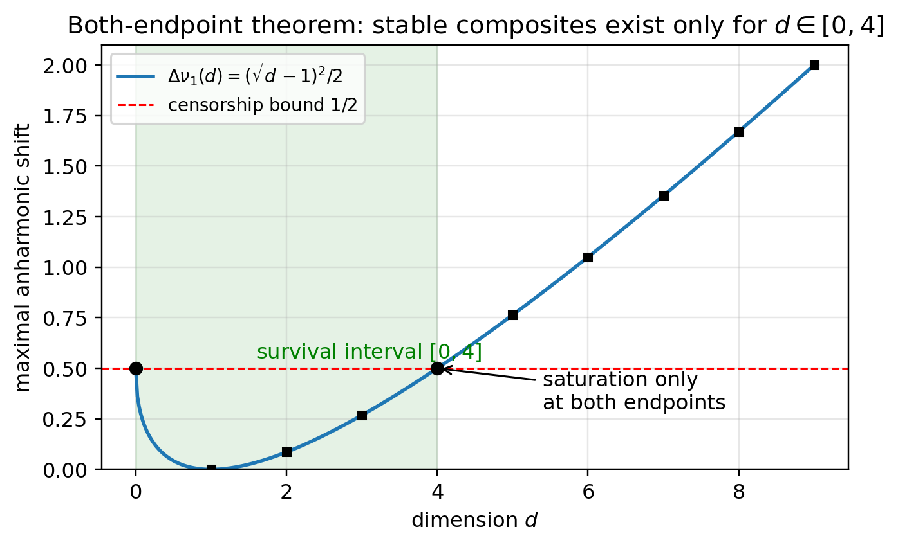

# The Dual Geometry Series Is Complete — From Three Assumptions, How Much of What Looks Quantum and Spacetime-like Follows as Theorems? (Papers 1–12)

Place the simplest reciprocal duality νλ = 1 between wavelength components and frequency components — the observational series that started there is now complete with twelve papers. The eight new papers (Papers 5–12, each bilingual JA/EN, CC BY 4.0) have just been released on Zenodo.

Throughout, this series is an observational model. It does not derive physical entities such as spacetime, mass, energy, or momentum, and it does not identify model quantities with physical ones. Every relation to standard theory is stated as a structural correspondence, and every paper carries an explicit section on what it claims and what it does not claim. Evaluation and interpretation are left to the reader.

---

## The Whole Picture — the Entire Inventory Is Three Items

The assumptions used across the whole series are exactly these three:

- Assumption 1: reciprocal duality, νλ = 1
- Assumption 2: the zero point ½ (the minimal conjugate width)
- Assumption 3: an asymmetric single bit (the conservation law Σν² rides only one side of the duality)

Continuous spacetime, amplitudes, wave functions, and collapse are not assumed. The question is single:

　From this inventory alone, how much of what looks quantum and spacetime-like follows as theorems?

Every claim is supported by exhaustive computer enumeration, exact identities, or machine-precision numerics. All verification scripts and the research notes (Supplements 1–41) are public.

## Foundations (Papers 1–4, previously published)

- Paper 1: reciprocal duality and the log representation. The hyperbola νλ = 1 becomes the straight line p = −q (sign-flip symmetry) in log variables
- Paper 2: exact tables of the 4D lattice count N₀(R): N₀(1) = 1, N₀(2) = 9, N₀(3) = 137, …
- Paper 3: a supplement connecting to radial projection
- Paper 4: the splitting of high-radius states into finitely many state groups, the volume gap, duality breaking, and a self-similar hierarchy

The core sequence of the series comes from the condition that a unit cell (half-width ½ per axis) is fully inscribed in the 4-dimensional ball of radius R:

　Σ (|kᵢ| + ½)² ≤ R²

which yields N₀(R) = 1, 9, 137, 473, 1545, … The value 137 was not introduced by assuming any correspondence with physical constants; it is a pure counting result (and this stance never changes across the series).

## The Development (Papers 5–12, released now) — a Chain of Theorems

Paper 5: The Cell–Standing-Wave Dictionary and the Quantization of the Radius
　Lattice counting agrees exactly with counting real standing waves carrying the zero point ½ (the dictionary theorem). From this identification a chain follows: the identity of the minimal conjugate width (a zero-point quantum), the identity of the volume gap (an effective Weyl boundary deficit, 16π/3), an exception-free splitting theorem, and a classification theorem that quantizes R² to odd integers. The long-standing 137-versus-105 boundary question dissolves intrinsically — it was never an arbitrary normalization, but the difference between a continuous and a discrete reading of R.

Paper 6: Conservation Laws, Records, and Time-like Structure
　If both sides of the duality were conserved simultaneously, no splitting could ever occur and the system would freeze (the freezing theorem). The asymmetric bit of Assumption 3 is therefore the very condition for time-like structure to exist. That measurement records can only accumulate on the wavelength side (the record theorem), and that uncertainty is built in as a boost-invariant minimal area in the log-conjugate plane, also become theorems here.

Paper 7: Configuration Statistics and Relational Readout
　Reading post-split fragments as occupied cells of a shared lattice, indistinguishability and the exclusion principle follow as theorems rather than assumptions. Consequently, the only stable species are {1, 3, 5}, the decay threshold is s = 7, and the branching ratio of s = 9 is uniquely 77.4% : 22.6%. The angles between fragments — the first relational geometry — can be read out completely from interference intensities alone.

Paper 8: Two Accountings — Condensation, Internal Expansion, and the Area Law
　Whether the container (curvature) belongs to each fragment or is shared by all — that single accounting choice inverts dispersion into condensation. Reading the internal subdivision of a closed system through an internal observer's ratios, the apparent scale factor follows a ∝ √t (radiation-era type). The vacuum-like gap is not an empty blank but a reservoir of area that makes evolution possible.

Paper 9: Logic Waves and Half-Wavelength Censorship
　The lattice is a ladder of odd harmonics built on the zero point ½ — the fingerprint of binary logic waves. The curvature-induced distortion of the ladder is at most exactly ½, never exceeding half the resolution, so continuous decay channels close kinematically (the stability of composites is a quantization of the deformation space). An interference-closure test further shows that large clumps cannot exist as single entities: hierarchization is not a choice but a compulsion.

Paper 10: Emergent Gauge Structure
　Without ever assuming a gauge principle, the connection is fixed uniquely by kinematics alone, the first holonomy (a π/2 rotation) agrees exactly with the area of a geodesic triangle, and the continuous group SO(4) is forced by the crystallographic restriction. The raw material of spin structure and the default coupling value β = 0 appear as by-products.

Paper 11: The Necessity of Dimension
　The censorship that protects composites holds only for d ∈ [0, 4], saturated exactly at both endpoints (the both-endpoint theorem). An integer record ledger exists only at d = 4, by mod 8 arithmetic. And the minimal cell sits on the fixed point of the duality only at d = 4 — three independent mechanisms, from above, unconditionally, and from below, pincer the same value.

Paper 12: The Twin Minimal Space Model (the final paper)
　An even initial value cannot exist as a single state, by parity: birth as a pair is forced. The separations available to the twins are quantized into a discrete catalogue with a mod 4 forbidden band. Measurement is the appending of a record (absence → presence); collapse is the appearance of a record, and its irreversibility reduces to the same single bit as the arrow of time. The instantaneous correlation of entanglement is a statement about layers, not about speed, and no-signaling follows from the record structure. Finally, two ledger deficits of exactly one unit each point to two invisible directions, R and Q.

▲ Figure 1: the exact 3D section of the post-split twin configuration (Paper 12). Inside the shared container (radius √18) the twins occupy actual lattice cells. The minimal allowed separation is √2, and each cell interior shows the 57-cube central section of the next-level 137-cell composite at true scale 1/6 — every position, separation, and scale is a computed value; nothing is schematic.

## Highlights

- Two-tier agreement: the stable species {1, 3, 5} and the threshold s = 7 are reached by independent computations — counting (Paper 7) and waves (Paper 9)
- Fewer postulates: exclusion, collapse, the arrow of time, and the integer lattice descend from assumptions to theorems (or to resolution structure)
- A pincer on dimension: d = 4 is selected by three independent mechanisms
- Falsifiability: in this model amplitudes cannot couple to curvature, so BMV-type gravitationally mediated entanglement experiments are a live referee
- Not re-deriving is not a defect: theorems of standard theory transport whenever their premises have verified counterparts (the transport principle). The difference lies in candidate answers to questions standard theory leaves as postulates — collapse, the position of the cut, time, dimension

▲ Figure 2: the three bands of existence (Paper 9). The margin by which a composite can certify its own occupancy with its own waves splits into a certified band {1, 3, 5}, a critical band, and a forbidden band (s ≥ 25). For s ≥ 49 the whole odd sector closes (right panel). Admitting even harmonics reopens it — the closure is specific to logic waves.

▲ Figure 3: the both-endpoint theorem (Paper 11). The maximal curvature distortion of the ladder, (√d − 1)²/2, stays within the censorship bound ½ only for d ∈ [0, 4], with equality exactly at the endpoints. d = 4 is critical at the ceiling.

## Release Information (Papers 5–12, Concept DOIs)

- Paper 5: The Cell–Standing-Wave Dictionary and the Quantization of the Radius　https://doi.org/10.5281/zenodo.20640454
- Paper 6: Conservation Laws, Records, and Time-like Structure　https://doi.org/10.5281/zenodo.20640456
- Paper 7: Configuration Statistics and Relational Readout　https://doi.org/10.5281/zenodo.20640458
- Paper 8: Two Accountings　https://doi.org/10.5281/zenodo.20640460
- Paper 9: Logic Waves and Half-Wavelength Censorship　https://doi.org/10.5281/zenodo.20640462
- Paper 10: Emergent Gauge Structure　https://doi.org/10.5281/zenodo.20640464
- Paper 11: The Necessity of Dimension　https://doi.org/10.5281/zenodo.20640466
- Paper 12: The Twin Minimal Space Model　https://doi.org/10.5281/zenodo.20640468

Foundations (Papers 1–4):

- Paper 1　https://doi.org/10.5281/zenodo.20588036
- Paper 2　https://doi.org/10.5281/zenodo.20588038
- Paper 3　https://doi.org/10.5281/zenodo.20589261
- Paper 4　https://doi.org/10.5281/zenodo.20638962

Research notes (Supplements 1–41), all verification scripts, and the figure-generation code:
https://github.com/WurabeSeiji/ai-chat-logs-open (folder: Dual Geometry of Wavelength Space and Frequency Space)

## Standpoint

- This series is an observational model; it does not claim to derive or modify physical theory
- N₀(3) = 137 is not identified with the fine-structure constant. The quantization of R², the selection of d = 4, and the expansion law are theorems inside the model; no physical identification is made
- All 24 figures across the series are drawn from exact numerics, exhaustive enumeration, or exact geometry — no schematic diagrams
- Numerical conversion (connection to physical units) requires an independent dimensionless observable and is stated explicitly as an open problem

---

Author: Noriaki Kihara
WF System Co., Ltd. / ORCID: 0009-0004-6753-4020

The first note article of the series (covering Papers 1–3): https://note.com/kiharanoriaki/n/nf2b3e4392ea1

---

#WavelengthSpace #FrequencySpace #ReciprocalDuality #4DLattice #LatticePointProblem #GeometryOfNumbers #QuantumMechanics #Spacetime #Emergence #GaugeStructure #Dimension #MeasurementProblem #Entanglement #Geometry #MathematicalPhysics #TheoreticalPhysics #ObservationalPaper #ThoughtExperiment #Preprint #Zenodo
