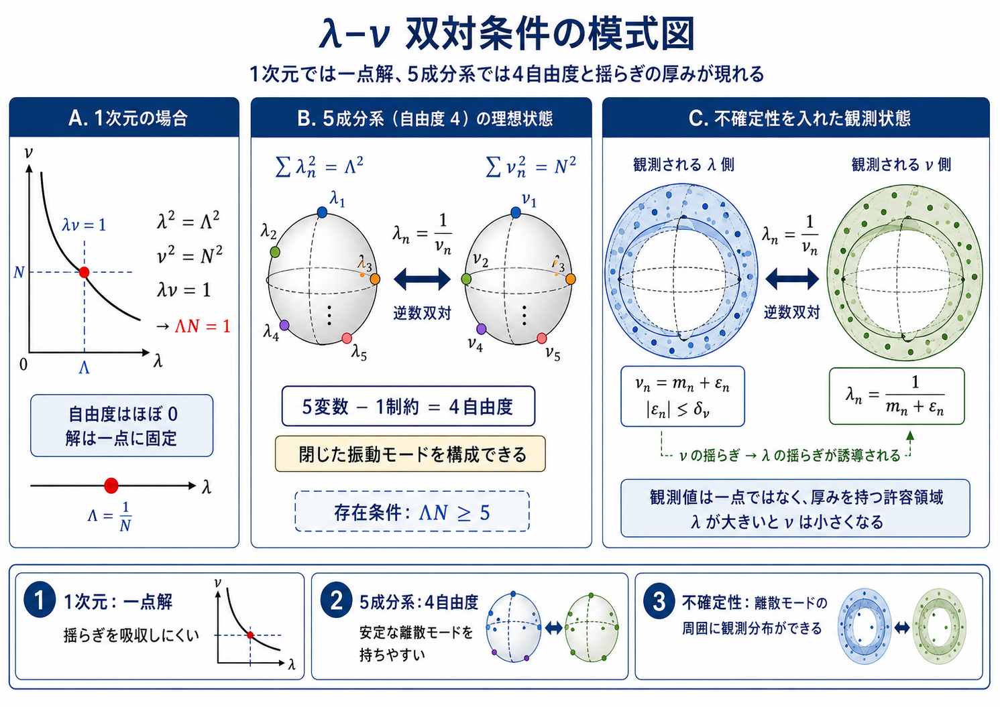
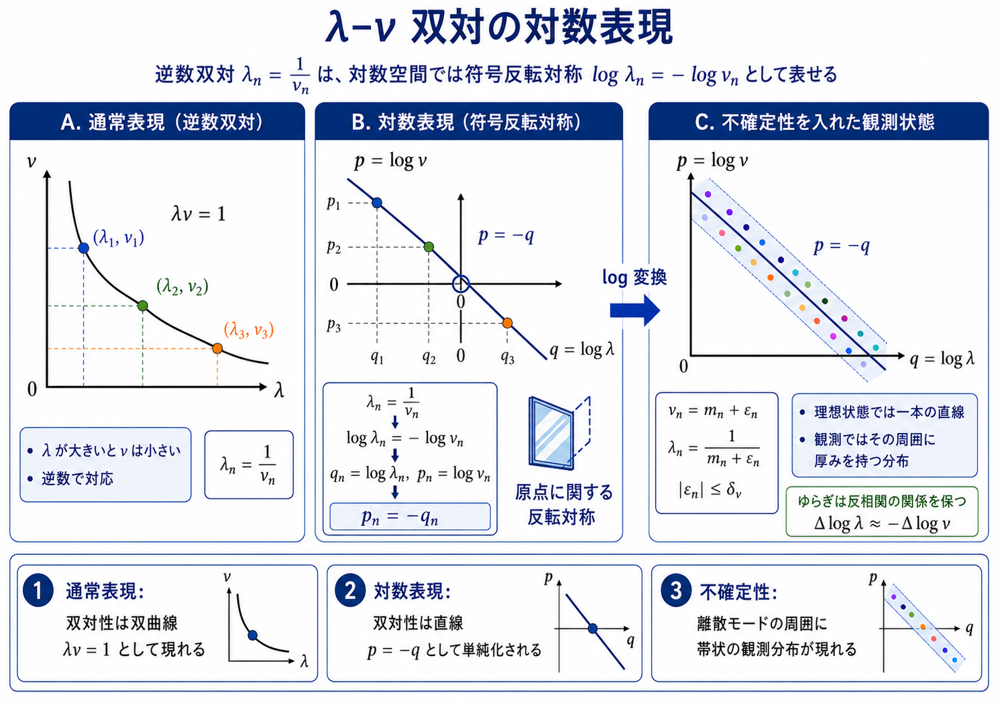

# 波長空間と周波数空間の双対幾何を、逆数双対と4次元格子の数え上げから観察してみました

波長成分 λₙ と周波数成分 νₙ の間に、最も単純な逆数双対 λₙ = 1/νₙ を置き、さらに波長空間・周波数空間のそれぞれに二乗和一定（ノルム保存）条件を課したとき、どのような自由度・対称性・数え上げ構造が自然に現れるか——を初等的に追った観察論文を2本、新しいシリーズとしてZenodoに公開しました。

本稿は時空・質量・エネルギー・運動量などの物理的実体を導出するものではありません。ここでの λₙ・νₙ は双対幾何を記述するためのモデル変数であり、νₙ を標準物理の時間周波数・エネルギー・運動量と同一視しません。新しい予言も定理も提出せず、すべて幾何学的・位相的な構造の観察に留めます。評価・解釈は読者に委ねます。

公開情報：

- 論文1：波長空間と周波数空間の双対幾何（v0.3）
- Zenodoページ：https://zenodo.org/records/20588037
- Concept DOI：https://doi.org/10.5281/zenodo.20588036
- Version DOI：https://doi.org/10.5281/zenodo.20588037

- 論文2：4次元格子における単位セル完全内接数の半径スイープ（v0.1）
- Zenodoページ：https://zenodo.org/records/20588039
- Concept DOI：https://doi.org/10.5281/zenodo.20588038
- Version DOI：https://doi.org/10.5281/zenodo.20588039

- ライセンス：CC BY 4.0
- 形式：md / tex / pdf × 日英 ＋ 図（日英）／CSV

---

## 1. 設定 ── 逆数双対とノルム保存

波長成分と周波数成分の間に、成分ごとの逆数双対を置きます。

　λₙ = 1 / νₙ

さらに、それぞれの空間に二乗和一定条件を課します。

　Σ λₙ² = Λ²　（波長側のノルム半径 Λ）
　Σ νₙ² = N²　（周波数側のノルム半径 N）

一方の成分が大きいとき、対応する他方の成分は小さくなります。これは同一形の対称性ではなく、反転を含む双対的な対称性です。

次の図は、この双対条件の模式図です。

▲ 図1：λ–ν 双対条件の模式図。1次元では解がほぼ一点に固定され、5成分1制約の系では4自由度が残ります。不確定性を導入すると、理想的な制約の周囲に厚みを持つ観測領域として表せます（その厚みの大きさは本稿では導出しません）。

## 2. 1次元はほぼ一点、5成分1制約で4自由度

1次元では、正値解が

　λ = Λ,　ν = 1/Λ　（かつ ΛN = 1）

に固定され、成分間で再配分する余地がほとんどありません。

一方、5つの成分に二乗和1制約を課すと、

　5 − 1 = 4

の自由度が残ります。この4自由度は重要な観察対象ですが、物理的な時空の4次元性とただちに同一視はしません（あくまで双対幾何の上に現れる自由度です）。

存在条件は、コーシー・シュワルツ型の不等式から

　ΛN ≥ 5　（一般の d 成分では ΛN ≥ d）

となり、等号はすべての成分が等しいときに成立します。

## 3. 対数表現 ── 双曲線が符号反転対称になる

逆数双対は、通常表現では双曲線 λν = 1 です。しかし対数変数

　qₙ = log λₙ,　pₙ = log νₙ

を導入すると、log λₙ = −log νₙ から

　pₙ = −qₙ

という、傾き −1 の直線、すなわち符号反転対称に単純化されます。

▲ 図2：λ–ν 双対の対数表現。通常表現の双曲線 λν = 1 は、対数変数 q = log λ・p = log ν を用いると直線 p = −q として表されます。不確定性を導入した観測状態では、理想直線の周囲に厚みを持つ帯状分布として表せます（その厚みは本稿では決定しません）。

## 4. 4次元格子の数え上げ ── N₀(3) = 137

周波数空間または波長空間を、実際に4次元整数格子 ℤ⁴ に選ぶと、二乗和条件は単位セルの数え上げ問題に変換できます。

一辺1の単位セル（各方向の半幅 ½）が、半径 R の4次元超球体に完全に内接する条件は

　Σ (|kᵢ| + ½)² ≤ R²

この完全内接セル数を N₀(R) と定義すると、整数半径で

　N₀(1) = 1,　N₀(2) = 9,　N₀(3) = 137

論文2では、R = 0.5 から 10.0 まで 0.5 刻みでスイープし、外接直径 2R・積み上げ対角線長 2ρ(R)・半径余白 R − ρ(R) とともに数え上げました（再現用の擬似コードとCSVを同梱しています）。

### R = 3 の 137 の中身

両辺を4倍した Σ (2|kᵢ| + 1)² ≤ 36 の、殻ごとの個数は次のとおりです。

- 殻 4：1個
- 殻 12：8個
- 殻 20：24個
- 殻 28：40個
- 殻 36：64個

合計：1 + 8 + 24 + 40 + 64 = 137

この 137 は、物理定数との対応を仮定して導入したものではありません。4次元整数格子・単位セル・完全内接条件から得られる純粋な数え上げの結果です。

## 5. 不確定性は「形式」だけ置く

周波数側に整数格子と小数揺らぎ νₙ = mₙ + εₙ を置くと、波長側には逆数双対から逆符号の揺らぎ

　Δλₙ ≈ − εₙ / mₙ²

が現れます。また、完全内接の指示関数を、境界近傍に厚みを持つ重み関数 Wδ に置き換えると、有効セル数 Nδ(R) は δ → 0 の極限で N₀(R) に一致します。

ただし本稿は、不確定性幅 δ の値も、重み関数 Wδ の具体形も導出しません。数え上げの形式を定義するところまでに留めます。

## 6. 立ち位置

- 周波数空間と波長空間を同時に格子化し、逆数双対を満たす整合的な数え上げは後続課題です（論文では単独空間の数え上げのみ定義）。
- 4自由度・p = −q・N₀(3) = 137 は観察であって、物理量・物理定数への同定は主張しません。
- 関連研究は物理的根拠ではなく数理的背景としてのみ参照します：時間と周波数の対称的扱い（Gabor 1946）、通信理論（Shannon 1948）、数の幾何（Aliev–Henk 2023）、四平方和（Hirschhorn 1987）。

---

著者：木原 範昭（Noriaki Kihara）
WF System Co., Ltd. / ORCID: 0009-0004-6753-4020

Zenn 記事（より技術的な解説、数式表示あり）：https://zenn.dev/noriaki_kihara/articles/wavelength-frequency-dual-geometry

---

#波長空間 #周波数空間 #逆数双対 #フーリエ解析 #対数表現 #符号反転対称 #4次元格子 #格子点問題 #数の幾何 #単位セル数え上げ #四平方和 #幾何学 #数理物理学 #理論物理学 #観察論文 #思考実験 #プレプリント #Zenodo
