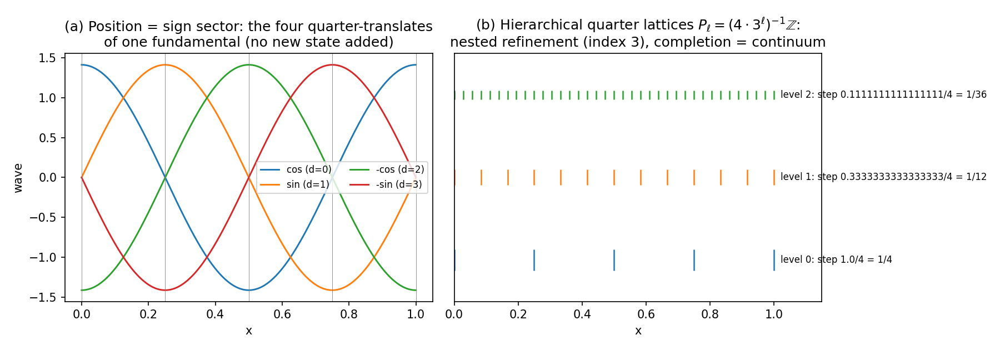
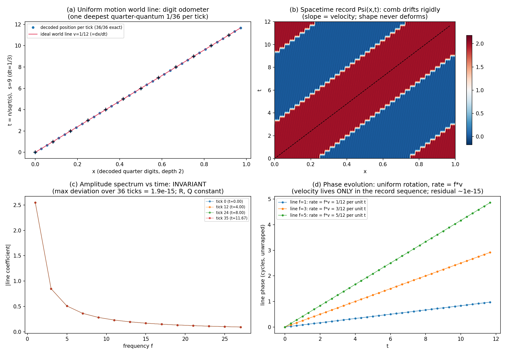

# 「位置は読まれていなかった」── 双対幾何シリーズ続報:論文13〜16と総説を一斉公開(50年の問いの解決から、測度問題の厳密な縮約まで)

νλ = 1 から始めた観察シリーズの続報です。論文13〜16の4本と総説1本(各 日英バイリンガル、CC BY 4.0)を Zenodo で一斉公開しました。前回(論文1〜12)で「三つの仮定から何が定理として従うか」を積み上げました。今回はその在庫だけで、**位置・時間・座標**という最古の問いに答え、残った**測度問題**を判定可能な形に縮約し、最後に**標準理論との接続収支**を総説として初めて正面から勘定します。

本シリーズは一貫して観察モデルです。物理的実体の導出を主張せず、モデル内の量を物理量と同一視しません。標準理論との関係はすべて構造対応として記述し、評価・解釈は読者に委ねます。

---

## 在庫の再掲 ── 仮定は三つだけ

- 仮定1:逆数双対 νλ = 1
- 仮定2:零点 ½(最小の共役幅)
- 仮定3:非対称1ビット

これに状態の読み方を定める二つの運用原理(配置読み:状態=占有セルの集合/記録原理:記録は無→有の追記)が付きます。連続時空・振幅・波動関数・複素数・Born 則は、今回も仮定しません。

## 論文13:位置は読まれていなかった

「離散状態は位置と時間に往復写像できるのか」── この問いに、**公理在庫の追加ゼロ**で答えます。

答えの核心:位置は新しい自由度ではなく、**辞書の未読部分**でした。離散位置=波の符号セクター(¼周期オフセット:cos→sin→−cos→−sin)。論文5 の辞書が最初から持っていたデータの、読み出し方を変えるだけ。空間そのものも導出されます:位置空間=保存量格子の Pontryagin 双対であり、並進・回転・反転の三対称性は仮定でなく双対性の定理です。

読み出しには三層あります:強度縞だけでは関係クラスを11種までしか分離できず、線位置で13種、**枝チャネル(複素線係数)で初めて全21軌道が完全分離**します(11⊂13⊂21、全数計数)。従来の縞は情報の約半分を原理的に読み落としていた──表題はその定量的実証です。

時間側には今回の白眉があります。時計周波数の二乗 s の値域が**全ての奇数**を間隔2で走ること──これが**ガウスの三角数定理による範囲無制限の証明付き定理**になりました((s−1)/2 が三角数4つの和になることに帰着)。一方で t には独立な逆写像が存在しない:**t は基本自由度ではなく、観測の結果選ばれたように見えるだけ**。この原則が定理の形を得ました。

▲ 図1：位置＝符号セクター（論文13）。左：基本波の¼周期並進は cos→sin→−cos→−sin を巡回するだけ——この4状態こそが離散位置で、新しい自由度は一つも要りません。右：¼格子の階層（各レベルで3分割）の完備化が連続位置になります。図中表記は英語、実計算からの描画です。

## 論文14:時間方向と振幅の舞台

ではなぜ特定の軸が「時間」に見えるのか。複素数 i はどこから来たのか。答えは一つの選択の二つの顔です:**時間方向の選択=複素構造の選択**。格子と両立する複素構造はちょうど16個で、対称群 B₄ の単一軌道をなし(16×24=384)、実軸は4軸のすべてを走れます。全マーキングが共有する読みはノルム(R)と中心指標(Q)だけ──どの軸が時間かはゲージです。

輸送位相は導出されます:親線と娘線の係数比は三角恒等式だけから決まり、**例外なく Z₄={1, i, −1, −i} に着地**(3シェル全数)。位相の割当規則は不要になりました。そして標準理論が対称化公準として置くもの(同種粒子は数え分けない)が、ここでは**集合構造の定理**として出ます(正準規約定理)。

▲ 図2：輸送位相の導出（論文14）。崩壊の前後で親線から娘線へ渡る位相 η を、s=9 の全196経路で計算した複素平面図。すべてが例外なく {1, i, −1, −i} の4点ちょうどに着地します——位相の割当規則は不要で、三角恒等式だけから導出されることの全数実証です。

## 論文15:xyztRQ への射影

「できるはず」と「定式化して検算した」の間の距離を埋める論文です。状態データから時空座標 (x,y,z,t) と帳簿座標 (R,Q) への**明示的な射影・逆射影**を5段の演算として構成し、全段を機械検証しました:合成往復は乱数500点で**桁の完全一致 500/500**、写像は保存則と可換(電荷様パリティ保存は台の算術の定理──生の組合せの39.2%が違反候補なのに、振幅を運ぶ経路の違反はゼロ)。

等速運動も写像されます。スペクトルの絶対値は時間発展せず、動くのは位相だけ──**速度は単一の記録のどこにも存在せず、記録の列にのみ存在します。**

▲ 図3：xyztRQ 空間（論文15）。左上：機械復号した位置が (x, y, R) の3D配置に乗る（赤丸 Q=+1、青角 Q=−1）。右上：世界線——時計の刻みは 1/R で、崩壊イベントで3本に分岐し各自のレートで進む。左下：(R, Q) の台帳面（許される段は離散で、崩壊は ΣR² と ΠQ を厳密に保存）。右下：全状態が拘束面 R²=s の上に正確に乗り、仮想段だけが ±1 だけ面の外に出て次の記録で戻る。6つの座標のうち自由なのは位置だけ——R と t は導出量であることの一枚絵です。

▲ 図4：等速運動（論文15）。左上：復号した位置が厳密な直線の世界線に乗る。右上：時空記録のなかをコムが形を変えずに流れる。左下：振幅スペクトルは時間発展しない（4時刻が完全に重なる、偏差10⁻¹⁵）。右下：動くのは位相だけで、回転率が速度そのもの——速度は単一の記録のどこにもなく、記録の列にのみ存在します。

## 論文16:測度問題の厳密な縮約

残った最大の空欄が測度(確率の規則)です。本体系は経路振幅を自由パラメータなしで与える──素材は揃っているのに、束ね方(集計規則)が決まらない。標準理論はここを Born 則という公理で済ませます。本論文は**集計規則を選定しません**。選定問題そのものを厳密に縮約します。

発見の一部:歴史的に「測度候補に近い」とされた一致(0.98195 vs 0.98263)は、2結果空間への圧縮による見かけでした──3結果が開く隣のシェルで乖離は**3桁跳躍**します。さらに「どの代替をコヒーレントに足すか」(干渉粒度)は規約ではありません:鏡像の親は、チャネル一貫の集計では**厳密に消え(W=0)**、配置粒度では**完全に正常(W′=768)**──同じ振幅、同じ状態、束ね方だけで生死が分かれる厳密例です。この相殺の発生条件は「四値ロック」という証明対象の代数に固定されました。

結論:集計規則の残る自由度は**干渉粒度 × イベント構造1ビット × 条件付け**の有限な決定構造に縮約され、候補間の判定は**モデル内部で計算可能な実験の表**として立っています。Born 則は「然るべき極限で合流すべき有効則」の地位に置かれ、合格基準は収束・抑制・予言の三つ組です。

▲ 図5：干渉粒度の非規約性（論文16）。左：鏡像の親はチャネル一貫の集計では厳密に消える（W=0）のに、配置粒度では完全に正常（W′=768）——同じ振幅でも束ね方だけで生死が分かれる厳密例。m=2 では起きず、m=4 ではチャネル単位で起きる。右：その発生条件を固定する「四値ロック」（36配置・例外ゼロ）。

## 総説:関係ひとつ・定数ひとつ・1ビットから

シリーズはこれまで、誤読と否認を避けるために標準理論との接続をあえて語りませんでした。16本が公開された今、総説で初めて収支を勘定します。

主結果は三つ。(1) 運動学的な対応辞書は埋まり、全項が機械検証済み・全出典公開済み。(2) **標準理論が公理として置く五項──対称化・時間・測定・次元・電荷保存──を、本体系は定理として持つ**。(3) 未記入は測度と作用の二項のみ。

そして総説の中心テーゼ:完全に埋まった辞書は単なる再記法であり、経験的内容を持ちません。**接続が不完全な点こそ、両理論が異なる主張をし、観測が裁ける唯一の場所**──残額は欠陥であると同時に、判定可能性の地図です。総説はこの不完全接続点を一つずつ解剖し、構造的原因を特定します。

追記として、予想される批判「これは単なる複素数の言い換えではないか」への回答も収載しました。核心だけ:その指摘の厳密版を述べようとすると、本シリーズが次に証明しようとしている同型定理そのものになります。**この批判は敵ではなく工程表です。**

## 今回のハイライト

- **証明の昇格**:時計標的=全奇数が、機械検証からガウスの三角数定理による証明付き定理へ
- **公理の交換収支**:標準理論の公準五項が定理側に移動。支払いは関係1・定数1・1ビット+運用原理2
- **決着前に出版する形式**:論文16 は「どれが正しいか」を宣言せず、判定実験の表を内部に立てる縮約論文として書かれています
- **検証文化**:今回の4本は二者の AI 検算プロトコル(ローカル機械検証×独立検算・査読)の下、各2ラウンド計8査読を経ました。探究の過程では**予言の反証・説明の撤回を含む相互訂正が7回**──その履歴は消さずに全て公開されています。失敗を含む過程こそが、結果の信頼性の根拠です
- **恒久アーカイブ**:リポジトリ全体(論文16本・補遺84本・全スクリプト・査読記録)のスナップショットに DOI を取得しました

## 公開情報

続報編(各 Concept DOI):

- 論文13:位置は読まれていなかった　https://doi.org/10.5281/zenodo.20665633
- 論文14:時間方向と振幅の舞台　https://doi.org/10.5281/zenodo.20665661
- 論文15:xyztRQ への射影　https://doi.org/10.5281/zenodo.20665688
- 論文16:測度問題の厳密な縮約　https://doi.org/10.5281/zenodo.20665699
- 総説:関係ひとつ・定数ひとつ・1ビットから ── 標準理論への辞書と公理の交換収支　https://doi.org/10.5281/zenodo.20666132

リポジトリ・スナップショット(全篇の恒久アーカイブ):https://doi.org/10.5281/zenodo.20666114

研究ノート(補遺1〜84)・全検証スクリプト・査読記録・索引(論文一覧/補遺一覧):
https://github.com/WurabeSeiji/ai-chat-logs-open (波長空間と周波数空間の双対幾何 フォルダ)

論文1〜12 の DOI と解説は前回記事をご覧ください:
https://note.com/kiharanoriaki/n/nd6a788866947

## 立ち位置

- 本シリーズは観察モデルであり、物理理論の導出・修正を主張しません。新理論・統一理論の試みでは決してなく、「別のシンプルな仮定からでも標準量子理論に近い構造が導出できるかもしれない」というモデルとして読んでください
- モデル内の「位置」「時間」「電荷様」等は読み出し量の名であり、物理量との同一視は行いません
- 測度(確率規則)は選定していません──選定問題の縮約と判定実験の設置までです
- 全篇の図は厳密な数値計算・全数列挙からの描画で、模式図は使っていません

---

著者:木原 範昭(Noriaki Kihara)
WF System Co., Ltd. / ORCID: 0009-0004-6753-4020

---

#波長空間 #周波数空間 #逆数双対 #4次元格子 #量子力学 #時空 #位置と時間 #測定問題 #Born則 #干渉 #創発 #幾何学 #数理物理学 #理論物理学 #観察論文 #思考実験 #AI協働研究 #プレプリント #Zenodo
