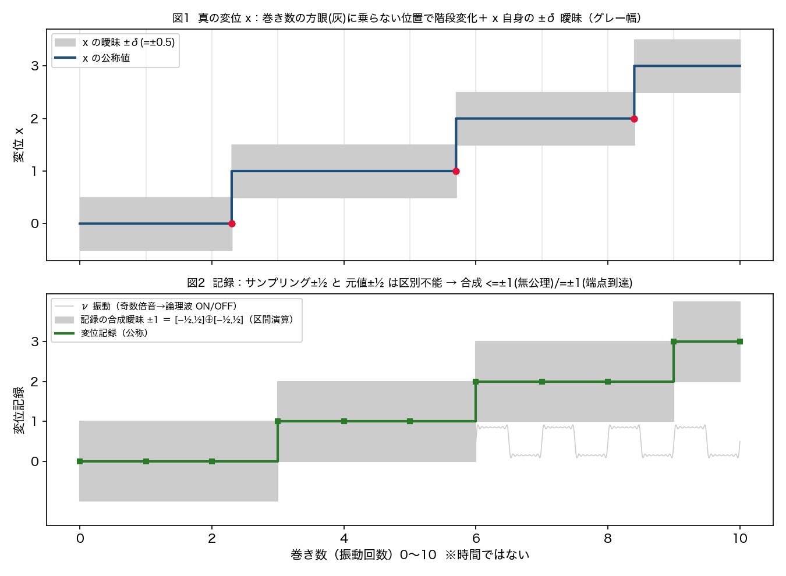

# 論文0.5：変位記録の仕組みの考察 — ν 振動と複素平面の干渉による変位の記録と、二つの ±1/2 の合成（±1）

**著者**: 木原範昭 (Noriaki Kihara)
**所属**: WF System Co., Ltd. / ORCID: 0009-0004-6753-4020
**版**: v0.1（定義論文・初稿。査読1反映＝合成を区間演算化[分布仮定を撤去]・時間の矢の表現を弱化・表記 t→φ・区別不能性を情報射影で再表現。査読2反映＝φ を巻き数の進行読みに一義化[反射縮退を明示・符号セクターと整合]・合成を「≤±1 は無公理／＝±1 は端点到達性の下」と書き分け・§2位相子→§3矩形波の橋とエッジ更新則を明示・§3 を導出と検算1に分離[境界例追加]・干渉の非測定免責・Hartle 類縁を標語共有に限定。査読3反映＝同周波の前提を明示[反射縮退が真に残る条件＝論文13リンクの荷重点]・等号条件を「独立性」から「端点到達性」に正確化[反相関のみが壊す]・「追加公理ゼロ」の射程を ±1 区間結果に限定[離散サンプリングはエッジ更新則に依るモデル化]・εx/εs の δ 単位通約を明示。査読4（提出可判定）の任意一文＝x が一定オフセット θ−φ として担われ φ が二役を兼ねる旨／反射縮退は §2 基本波位相子の継承で矩形波で再導出しない旨を追記。二者検算プロトコル）
**種別**: **定義論文**（観察論文ではない）。新しい公理を導入せず、基本仮定 2.5 とその暗黙の定義から「変位記録」という内部用語を定義し、その性質を検算で確かめる。
**シリーズ**: 波長空間と周波数空間の双対幾何（基礎篇・論文0.5）
**検算スクリプト**: `paper0_5_displacement_record.py`

---

## 0. 本稿の性格 — 何を定義し、何を主張しないか

本稿は、本シリーズが用いてきた「記録」「帳簿」「台帳」という語の中身を、**追加公理ゼロ**で明確に定義する**定義論文**である。

重要な区別を先に置く。

- **「観測」とは呼ばない。** 標準理論は観測を測定装置との相互作用として扱う。本稿の機構を「観測」と呼ぶと「系に影響を与えずに観測できる」という標準理論否定の誤読を招く。本稿はその主張を一切しない。本稿が定義するのは **変位記録（displacement record）** という内部用語であり、標準理論の観測論には踏み込まない。
- **新しい公理を置かない。** 公理は基本仮定 2.5（νλ=1・零点 δ=±1/2・非対称1ビット）のままである。本稿が用いるのは、その**暗黙の定義**——ν は振動として観察される側の計量である（νλ=1 における ν＝振動数の意味そのもの）——だけである。
- **「時計」「単調時計」「エントロピー」「時間の矢」を使わない。** 時間は本シリーズでは導出量であり、それらの語は時間を前提するため循環になる。本稿は時間を前提せず、変位記録が**区別可能性（順序の可能性条件）**を定めるところまでを述べる。**向き（時間の矢）は本稿では導出しない**——方向づけには非対称1ビット A3 を要するが、それは本稿の射程外である。

物理的同一視は行わない。

---

## 1. 基本仮定と暗黙の定義

**基本仮定（2.5、本シリーズ共通）**

| # | 仮定 |
|---|---|
| A1 | 相反双対 νλ=1 |
| A2 | 零点 δ=±1/2 |
| A3 | 非対称1ビット（保存はどちらの双対側に乗るか） |

**暗黙の定義（νλ=1 の意味に含まれるもの・新公理ではない）**

- **ν ＝ 振動として観察される側の計量**（振動数）。複素平面（Argand 面）上の位相 $e^{i\varphi}$ として表される。$\varphi$ は ν 振動の位相であって、外部時間ではない。
- 観測量（状態）も同じ複素平面上の位相 $z=e^{i\theta}$ として表される（振幅は 1 に正準化、論文14 の複素構造 $C\subset H$）。$\theta$ がその観測量の位相である。なお論文14 の援用は「振幅 1・位相のみ」を正当化する軽い役割にとどまり、§2 の核（$|e^{i\theta}+e^{i\varphi}|^2$）は初等平面三角だけで閉じる。
- **観測量 $x$ 自体が ±δ の曖昧さを含む**：本シリーズでは零点 $\delta=\pm 1/2$（A2）が最小分解能であり、いかなる値も ±δ の幅を持つ。本稿では $\delta=1/2$ とする（A2 そのもの）。

---

## 2. 変位記録の定義

観測量の位相 $\theta$ を、ν 振動 $e^{i\varphi}$ を参照として干渉させると、干渉強度は

$$
I(\theta,\varphi)=\bigl|e^{i\theta}+e^{i\varphi}\bigr|^2=2\bigl[1+\cos(\theta-\varphi)\bigr]
$$

であり、$I$ は相対位相 $\theta-\varphi$ のみで決まる。

**φ の読みを一義に固定する。** 本シリーズの $\varphi$ は**巻き数（振動回数）＝進行位相**であり、一つの巻き数では一つの強度値しか取らない（スクリーン座標を走る空間パターンではない）。したがって本稿では「干渉縞の位置」という空間パターンの語ではなく、**一つの巻き数での強度値**を扱う。このとき $\cos$ は偶関数だから、ひとつの強度値 $2[1+\cos(\theta-\varphi)]$ から確定できるのは $|\theta-\varphi|\bmod 2\pi$ のみであり、$\theta-\varphi$ と $-(\theta-\varphi)$ は区別できない（**反射縮退**）。$\varphi$ を既知・安定な参照とするとき、強度値が与えるのは「$\varphi$ に対する $\theta$」を参照について反射した曖昧さまでである。

**同周波の前提（反射縮退が真に残る条件）。** 反射縮退が per-configuration に真であるためには、**参照 $\varphi$ と観測量 $\theta$ が同周波（各配置で $\theta-\varphi$ が一定）である**ことを要する。これを置く理由を明示する：$\theta$ を固定したまま $\varphi$ が一周掃引すれば強度 $2[1+\cos(\theta-\varphi)]$ の極大は $\varphi=\theta$ に立ち、$\theta$ は mod $2\pi$ で一意に読めて縮退は消える（既知参照値が二つあれば二式で $\theta$ が確定するのも同じ）。同周波を置けば、各配置は**単一の定常強度値**を与え、§3 で巻き数を跨いで掃引しても新情報は出ない——ゆえに per-winding 読み出し＝全情報、で反射縮退は per-configuration に真のまま保たれる。$x$ が階段変化すれば $\theta$ が $\Delta\theta$ 跳んで新しい定常値になる（レベル差は区別可能、各レベルは反射縮退）。**この反射縮退は本シリーズの符号セクター（論文13：位置＝符号セクター）と同じ縮退**であって、本稿の枠内で整合する。掃引で消える縮退では符号セクターとの同一視が成り立たないので、同周波の明示はこのリンクの荷重点でもある。

別言すれば、同周波のもとで $\theta$ は $\varphi$ と**共回転**し、観測量 $x$ は両者の**一定オフセット $\theta-\varphi$ として担われる**（$x$ は「静的な値」ではなく、進行する $\varphi$ に対する固定差として乗る）。この一文で、§2 の locked 干渉参照（$\theta-\varphi$ 一定）と §3 の進行サンプリング時計（エッジが格子を定義）が**同じ $\varphi$ の二役**であることが明示される。

> **干渉について（免責）**：本稿の「干渉」は区別可能性を定める**形式的構成**であって、装置による測定を含意しない（§5(i)）。「強度」も装置の読み値ではなく、$|e^{i\theta}+e^{i\varphi}|^2$ という形式量である。

- **変化がない配置**（$\theta=$ 一定）：強度値は変わらない。変位は記録されない。
- **変化がある配置**（$\theta$ と $\theta+\Delta\theta$ の二配置）：参照 $\varphi$ に対する強度値は $2[1+\cos(\theta-\varphi)]$ と $2[1+\cos(\theta+\Delta\theta-\varphi)]$ となり、$\Delta\theta\neq0$ なら（反射縮退の例外点を除き）一般に異なる。**二配置が異なる強度値を与えること自体が、両者を区別可能にする**（「移動」という走らせる語は用いない——静的に、二配置が区別可能であると言い切る）。

> **定義（変位記録）**：**変位記録**とは、ν 振動 $\varphi$ を参照とする干渉強度値の差として、観測量の位相差 $\Delta\theta$ が構造に残ることをいう。$\Delta\theta=0$ なら強度値は一致し、変位記録は生じない。**振動（ν）は変位記録を可能にする参照であり、変化（$\Delta\theta$）は変位記録の内容である。**

**変位記録は順序の可能性条件（distinguishability）を与える**：$\Delta\theta\neq0$ のとき配置 $\theta$ と配置 $\theta+\Delta\theta$ が区別可能になる。ただし集合 $\{\theta,\theta+\Delta\theta\}$ 自体には内在的な**向き**がない。どちらを「前／原因」とするかの**方向（時間の矢）は本稿では導出しない**（Page–Wootters でも見かけの相関は出るが矢は出ないのと同じ）。方向づけには非対称1ビット A3 を要するが、それは本稿の射程外とする。本稿が示すのは、変化が**区別可能な形で記録される**こと（順序の可能性条件）までで、時間・時計は前提しない。

---

## 3. 導出：二つの ±1/2 と、合成 ±1（区間演算）

**§2 と §3 で参照が異なることを先に明示する。** §2 の参照は基本波の位相子 $e^{i\varphi}$（一周波数・複素・連続像）であり、$I=2[1+\cos]$ を与えた。本節の参照はその**全奇数倍音をとった極限＝論理波（矩形波）**

$$
\nu(\varphi)=\frac{4}{\pi}\sum_{k\ \text{odd}}\frac{\sin(2\pi k \varphi)}{k}
$$

で、これは実数値（±1 に収束、$e^{i\varphi}$ ではない）であり ON/OFF を与える（論文9 の論理波と同型：振幅なし・位相のみ）。ここで $\varphi$ は巻き数（振動回数）であって時間ではない。なお §2 で確立した**反射縮退は基本波位相子の結果であり、本節はそれを継承する**——矩形波参照で改めて再導出するものではない（参照を位相子から矩形波へ切り替えても、同周波ゆえ縮退は保持される）。

**離散サンプリングが出る縁起動則を一文で明示する。** 矩形波自体は $\varphi$ の連続関数であって、それだけでは離散化しない。離散サンプリング（セル幅＝1巻き）が生じるのは、**論理波の ON/OFF エッジ（ゼロ交差）でのみ記録が更新される**という更新則を置くときである。このとき記録更新点は巻き数格子をなし、変位記録は**振動回数ごとの離散サンプリング**になる。すなわち §2（基本波を位相子として扱う連続像）→ §3（全奇数倍音の論理波極限、そのエッジが巻き数格子を定義）が橋である。

> **「追加公理ゼロ」の射程（限定）**：本稿の「追加公理ゼロ」は、後述の **±1 の区間結果**（A2→区間和、§3.1）についての主張である。一方、**離散サンプリング構造**は「ON/OFF エッジでのみ更新」という上記の**posited な更新則**に乗っており、これは A1–A3 にも暗黙の定義にも含まれない追加のモデル化選択である（だから本稿は「という更新則を置くとき」と hedge する）。定理（公理ゼロ）と、モデル化に依る構造との境界をここで明示しておく。

ここには **±1/2 の曖昧さが二つ**ある。

1. **元値の曖昧 $\varepsilon_x$**：観測量 $x$ 自体が ±δ(=±1/2) の幅を持つ（§1、A2 の零点）。これは**値軸**（何の曖昧）の量である。
2. **サンプリングの曖昧 $\varepsilon_s$**：$x$ が振動回数の方眼に乗らない位置で階段変化するとき、離散サンプリングは変化を「次の振動回数」に丸める＝区間幅 1＝±1/2（検算1）。これは**巻き数軸**（いつの曖昧）の量である。

**通約について（別軸量をなぜ足せるか）。** $\varepsilon_x$（値軸）と $\varepsilon_s$（巻き数軸）は概念的に別軸の量である。両者を足して単一の ±1 にできるのは、A2 が $\delta$ を**普遍的な最小分解能として全軸に課す**（「いかなる値も ±δ」）からで、両軸が $\delta$ 単位で通約されているためである。ゆえに区間和 $[-\tfrac12,\tfrac12]+[-\tfrac12,\tfrac12]$ が定義可能になる（これは §3.3 の「ν 自身も ±1/2」が暗に用いる通約と同一である）。

**検算1（サンプリングの ±1/2、`paper0_5_displacement_record.py`）**

| 真の変化位置 | 記録区間 (n−1,n] | 記録位置推定 n−1/2 | 曖昧さ | 誤差（推定−真） | \|誤差\|≤1/2 |
|---:|:--:|---:|:--:|---:|:--:|
| 2.300 | (2,3] | 2.50 | ±0.5 | +0.200 | ✓ |
| 5.700 | (5,6] | 5.50 | ±0.5 | −0.200 | ✓ |
| 8.400 | (8,9] | 8.50 | ±0.5 | +0.100 | ✓ |
| 2.999（境界） | (2,3] | 2.50 | ±0.5 | −0.499 | ✓ |
| 3.001（境界） | (3,4] | 3.50 | ±0.5 | +0.499 | ✓ |

最初の三例はセル中央寄り（$|$誤差$|\le0.2$）で、上界には触れていない。**$\pm1/2$ はセル幅 1 の定義そのもの**であって、表が試して得た上限ではない。最後の二行（境界 2.999／3.001）は、誤差が定義上の上界 $\pm1/2$ に漸近すること（$|{-}0.499|,|{+}0.499|<1/2$）を示す確認である。

### 3.1 合成は ≤±1（無公理）、＝±1（端点到達性の下）

記録誤差は $\varepsilon=\varepsilon_x+\varepsilon_s$。ここで二段に分けて、本稿自身のリゴール基準を徹底する。

**(a) 上界 $\le\pm1$ は追加公理ゼロ。** A2 は「いかなる値も ±δ(=±1/2) の幅を持つ」と言うから $|\varepsilon_x|\le\tfrac12$, $|\varepsilon_s|\le\tfrac12$。劣加法性より無仮定で

$$
|\varepsilon_x+\varepsilon_s|\le 1,\qquad\text{すなわち}\quad \mathrm{supp}(\varepsilon)\subseteq[-1,+1].
$$

これは A2 だけからの厳密な帰結で、分布形も独立性も一切仮定しない。

**(b) 等号 $=\pm1$ には端点到達性が要る（独立性ではない）。** 周辺支持がともに $[-\tfrac12,\tfrac12]$ のとき、和の支持は $\mathrm{supp}(\varepsilon_x+\varepsilon_s)=\overline{\{a+b:(a,b)\in\mathrm{supp(joint)}\}}$ である。これが $[-1,+1]$ **全体に達する**ための条件は、結合支持が端点 $(\tfrac12,\tfrac12)$ と $(-\tfrac12,-\tfrac12)$ に届くこと（＝両源が同符号方向に同時に $\pm\tfrac12$ を取りうること、**端点到達性**）だけであって、矩形全体は要らない。実際：

- **独立**（結合支持＝全矩形）→ $[-1,1]$ ✓（十分だが必要ではない）
- **完全正相関**（$\varepsilon_x=\varepsilon_s$、結合支持＝対角線）→ $a+b=2a\in[-1,1]$、全値到達 ✓（独立でなくても成立）
- **完全反相関**（$\varepsilon_x=-\varepsilon_s$）→ $a+b\equiv0$、支持 $=\{0\}$ ✗（これが壊す唯一の型）

すなわち支持を縮めるのは**反相関（端点回避）だけ**で、正相関は縮めない。だから等号条件は「独立性」ではなく**端点到達性**である（独立性より弱く、本稿に有利）。端点到達性は本設定で**もっともらしい**——$\varepsilon_x$ は値の分解能、$\varepsilon_s$ は変化位置のグリッドに対する位相で、両源が反相関に拘束される理由がないからである。よって結論（合成 ±1）は壊れない。「独立性」という語は分布層から支持層へ退避した本稿の方針に確率的含意を再び持ち込むので、語としても端点到達性に置き換える。

> **無公理で $\mathrm{supp}(\varepsilon)\subseteq[-1,1]$（≤±1）。等号 $\mathrm{supp}(\varepsilon)=[-1,1]$（＝±1）は端点到達性の下で成り立つ。** これは分布層で行った退避（三角分布には独立＋一様が要る→支持に退避）と同型の操作を、支持の等号にもう一段適用したものである。

> **注（分布形は本稿の主張ではない）**：$\varepsilon_x,\varepsilon_s$ を**独立かつ一様**と仮定すれば、畳み込みは支持 $[-1,1]$ の三角分布 $f(\varepsilon)=1-|\varepsilon|$（標準偏差 $1/\sqrt6$）になる。しかし「独立」「一様」は A1–A3 にも暗黙の定義にも含まれない**追加の確率仮定**であり、本稿はこれを用いない。本稿の主張は**支持**（≤±1 は無公理、＝±1 は端点到達性の下）にとどめ、分布形には踏み込まない。

### 3.2 区別不能性（情報・射影）

記録に残るのは合成 $\varepsilon=\varepsilon_x+\varepsilon_s$（1自由度）であり、$(\varepsilon_x,\varepsilon_s)$（2自由度）はこの 1 自由度へ**射影**される。射影の核は1次元（$\varepsilon_x-\varepsilon_s$ 方向）で、記録から $(\varepsilon_x,\varepsilon_s)$ は復元できない。**したがって、記録された曖昧さが「サンプリング誤差」か「元値の曖昧」かは区別できない**——これは分布形に依らず、**2自由度→1自由度の射影（情報損失）**という構造だけで言える。

### 3.3 ν の扱いと、三者の場合（区間・正直な明示）

- **本図・本節では ν 自身は厳密（±1/2 の揺らぎなし）とし、ν の曖昧は省略した。** 図の ±1 は、元値とサンプリングの**二つ**の ±1/2 の合成（端点到達性の下での区間の和）である。
- 参考：仮に ν 自身も ±1/2 を持つなら、区間の和 $3\times[-\tfrac12,+\tfrac12]=[-\tfrac32,+\tfrac32]$ ＝ **±3/2**（±1 ではない）。「すべてに ±1/2 → 合計 ±1」は**二者（元値＋サンプリング）の場合**であって、三独立なら ±3/2 である。

**図. 変位記録の仕組み（すべて厳密な区間演算・模式図なし、ν の曖昧は省略）。**
**図1（上）**：真の変位 $x$ は巻き数の方眼（灰線）に乗らない位置（2.3・5.7・8.4）で階段変化し、かつ **$x$ 自体が ±δ(=±0.5) の曖昧（グレー幅）**を持つ。
**図2（下）**：ν 論理波（奇数倍音→ON/OFF、灰）でサンプリングした変位記録（緑）。**元値±1/2 とサンプリング±1/2 は区別不能で、合成は無公理で ≤±1、端点到達性の下で ＝±1（グレー幅）**。横軸は巻き数（振動回数）であって時間ではない。

## 4. 既存論文への接続（呼称の整理）

本稿の定義により、既存論文の語を次のように整理する（内容・結果は変更しない、呼称の整理）。

- **「帳簿」「台帳」を、記録の実体（変化を保持する側）の意味で用いていた箇所** → **変位記録**（本稿の定義語）。
- 保存量（$\sum\nu^2$）の意味だった箇所 → **保存量**（変位記録ではない＝記録できない側）。
- 不変量座標 $(R,Q)$ の意味だった箇所 → **不変量（座標）**。
- 自由度の勘定の意味だった箇所 → **自由度の勘定／保存則の本数**。

これにより、従来あいまいだった「帳簿/台帳」は、**定義された変位記録**か、**素の数学語（保存量・不変量）**のいずれかに整理され、誤読源が除かれる。

---

## 5. 主張しないこと

(i) 観測（測定装置との相互作用）— 本稿は論じない。変位記録は内部用語であり観測理論ではない。
(ii) 新しい公理 — 置かない（基本仮定 2.5 のまま、暗黙の定義のみ）。
(iii) 時計・単調量・エントロピー・時間の矢 — 用いない（時間を前提する循環を避ける）。
(iv) ν 自身の揺らぎ — 本稿では厳密として省略した（§3.3）。図の ±1 は元値とサンプリングの二つの ±1/2 の合成である。
(v) 物理的同一視。

時間・順序・因果は、変位記録（$\Delta\theta$ の検出）からの**導出物**である。

---

## 先行研究との関係（外部・最小、照合済み）

本シリーズは外部文献を引用しない方針だが、本稿は「記録」「時間は基本でない」という隣接概念との関係を誠実に明示する性格上、最小限の外部参照を持つ（概念的背景であり、本稿の定義の根拠ではない）。**変位記録は本稿の定義語であって確立用語ではない**。隣接概念との関係は次のとおり、標語の共有と実装の有無を区別して述べる。

- 時間が基本自由度でなく相関/参照から現れること：D. N. Page, W. K. Wootters, "Evolution without evolution: Dynamics described by stationary observables," *Phys. Rev. D* **27**, 2885 (1983), DOI 10.1103/PhysRevD.27.2885。本稿の「参照との相関から順序の可能性条件は出るが、向き（矢）は出ない」という性格は Page–Wootters と正確に同型である。
- 記録を出発点に置く定式化：J. B. Hartle, "Decoherent Histories Quantum Mechanics Starting with Records of What Happens," arXiv:1608.04145 (2016)。本稿は Hartle の標語「記録を出発点に」を**共有する**が、デコヒーレント・ヒストリーズを**実装するものではない**——本稿にはデコヒーレンス汎関数も整合性条件も環境も準古典領域もない。標語の共有であって内容の実装ではない、と限定する。
- 論理波（奇数倍音の矩形波）：本シリーズ論文9。

---

**謝辞・手続き**：本稿の定義・検算は Claude Code（ローカル機械検証）と claude.ai（独立検算・査読）の二者検算プロトコルによる。検算スクリプト `paper0_5_displacement_record.py` 同梱。物理的同一視は行わない。
