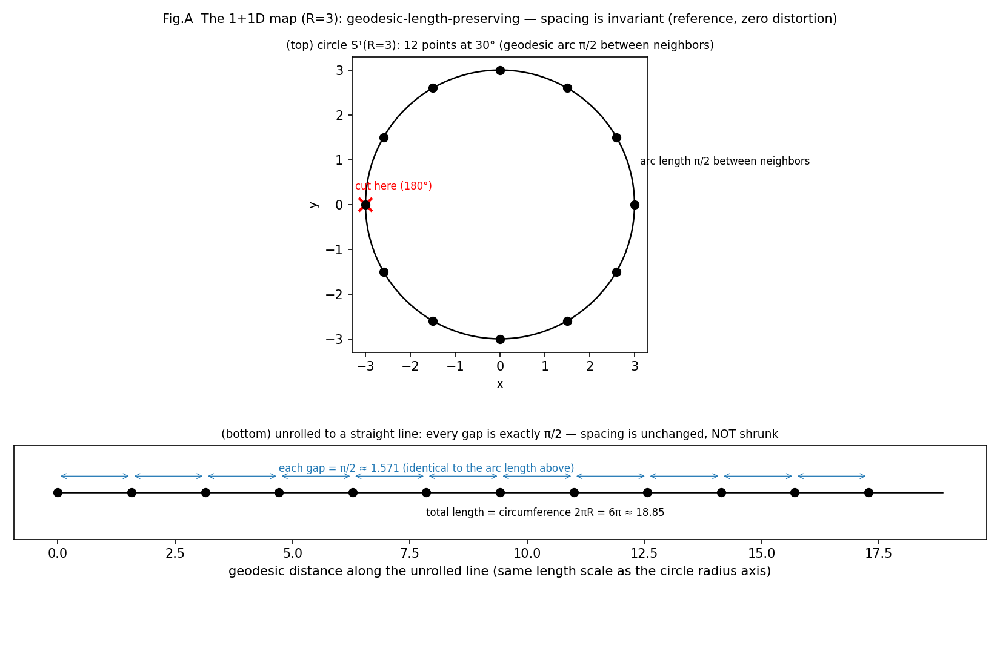
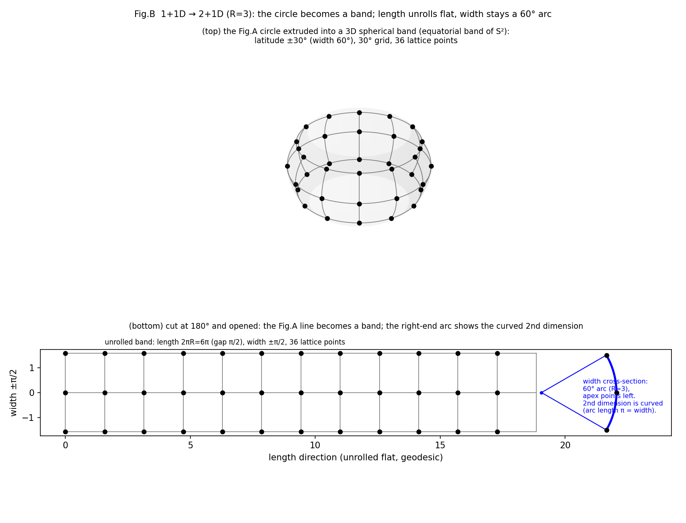
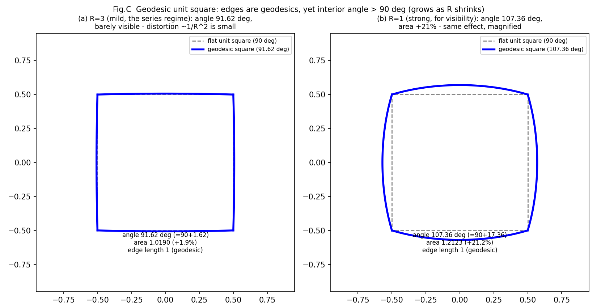
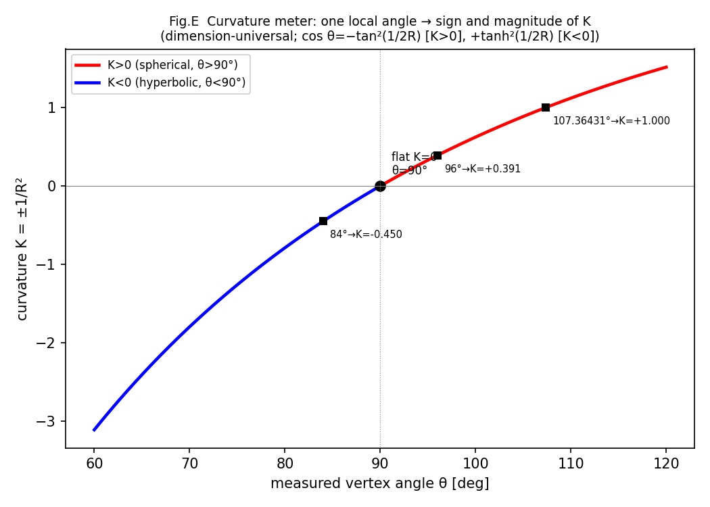
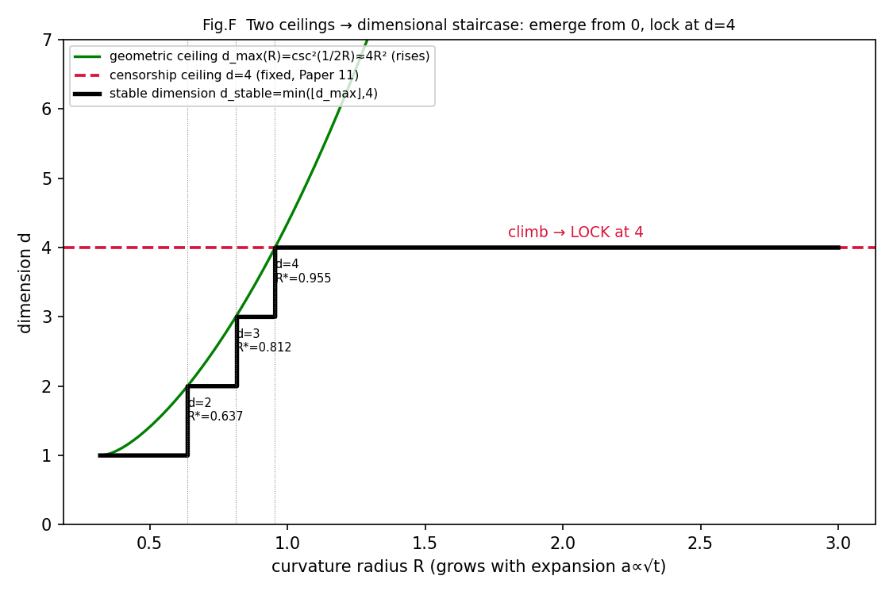

# Paper 0: Distortion of the Geodesic Unit Cell in Positively-Curved Constant-Curvature Space — Exact Evaluation of Edge, Angle, Area, and Volume

**Author**: Noriaki Kihara
**Affiliation**: WF System Co., Ltd. / ORCID: 0009-0004-6753-4020
**Version**: v1.3 (v1.2 with five exact-computation figures inserted [A: circle→segment / B: circle→3D band→unfold / C: angle excess / E: curvature meter / F: dimensional staircase]. All figures are exact computations, no schematics. Two-party verification protocol.)
**Position**: This is the Foundations volume, **Paper 0**; its correction target is the flat counting of Papers 1–2 (§5). Adding the Paper 0 row to 論文一覧.md / the survey references, and the cross-link with Paper 1, are handled separately as publication management (after this paper is finalized).
**Seven viewpoints**: edge (1), vertex angle (2), area (3), volume (4), inverse curvature (4.5), dimensional ambiguity and conjugate quantity (4.6), dimensional emergence and the d=4 lock (4.7). All numbers are reproducible with the bundled script; all 6 verification items pass.
**Series**: The dual geometry of wavelength space and frequency space (Foundations volume, Paper 0)
**Verification script**: `paper0_geodesic_cell_distortion.py`

---

## 0. Position of this paper — a precise definition of the distortion problem

Up to now this series has used, as its base map, the spherical projection σ_R(x)=(R/‖x‖)x (Spherical-projection note "Central-projection series: the base map radial projection σ_R," Concept DOI 10.5281/zenodo.20462569 — an external reference in a series separate from this one (Papers 1–16); treated as out-of-series literature not listed in 論文一覧.md), together with the central projection Φ_R, its restriction to the tangent hyperplane Π_R (Central-projection note). σ_R preserves direction and angle but not distance, and its distortion "does not appear at a single point; it becomes manifest only as a relation between points (relative configuration, spacing)" (Spherical-projection note, Observation 2.7). **However, writing this distortion down quantitatively as edge, vertex angle, area, and volume has never been clearly formalized in any paper** — §4.3 of the Spherical-projection note explicitly deferred the formulation in terms of induced metric and curvature to a separate paper, and the counting from Paper 1 onward proceeded with the flat norm, without incorporating the intrinsic curvature of the surface S^d(R) defined by the constraint Σν²=𝒩² into the 4-degree-of-freedom count.

**The aim of this paper is to define this deferred "distortion problem" — the geometric distortion of a unit cell placed in a positively-curved constant-curvature space of curvature radius R — clearly, as an elementary calculation in differential geometry.** But an important refinement comes first: the flat treatment of Papers 1–2 is **not a deficiency; for 1-dimensional-wave content it is curvature-exact** (§2: d=1 is intrinsically flat with zero distortion; §4.8). Distortion (§3–4, d≥2) appears only in true geodesic cells that couple several axes, and that is precisely the regime the series handles with amplitude-free logic waves (Paper 9 §2.3 "curvature consistency"). The correct reading of this paper is "demarcation of the boundary within which the flat treatment is exactly valid"; the correction in §5 is limited to a mean-field estimate for the reinterpretation into multi-dimensional geodesic cells. No probability, measure, or amplitude appears. The single question is:

> Under canonicalization (discrete unit = 1, spread ±½, curvature radius R), when a flat unit cell is placed in a positively-curved constant-curvature space of curvature radius R **preserving geodesic length**, how do the edge, vertex angle, area, and volume change?

The base map has been called "central projection" or "spherical projection" up to now, but in either case it is σ_R (or its restriction Φ_R to Π_R, Spherical-projection note Lemma 3.2), and the map is the same. To avoid confusion, this paper makes the codomain explicit and calls it **σ_R (radial projection onto the norm sphere Σx²=R²)**. **This naming cleanup is merely for clarity; it changes neither the map nor the content of past papers (it is not a request to revise past papers).**

**Achievements (FIX)**: (i) the §3 vertex angle is fixed in closed form (resolving the formula inconsistency in v0.1); (ii) the volumes for d=2–5 are machine-computed with a unified exact integral; (iii) the small-angle volume coefficient is fixed at **c_d = d(d−1)/12**; (iv) an **existence threshold** for each dimension is discovered; (v) **angle and area are dimension-independent** (2-dimensional intrinsic quantities), and the theorem that dimension acts not on value but only on **the domain of existence** is established; (vi) reorganized into four viewpoint tables. No physical identification is made.

---

## 1. Basic functions and the unified construction

Embed S^d(R) of radius R (constant curvature K=1/R²) standardly into (d+1)-dimensional Euclidean space. At geodesic distance χ from the pole, the radius of the latitudinal (d−1)-sphere is ρ(χ)=R sin(χ/R). All curvature effects arise from this sin.

**Canonical construction of the regular geodesic hypercube**: place the center at the north pole and arrange symmetrically the 2^d vertices of a regular geodesic d-cube of edge length a=1. Vertex v_σ=(t σ₁,…,t σ_d, w) (σ∈{±1}^d, |v_σ|=R gives d t²+w²=R²). From the condition that the geodesic distance between adjacent vertices be 1, R·arccos(1−2t²/R²)=1,

  **t = R sin(1/2R) (d-independent),  w = R√(1 − d sin²(1/2R)) (d-dependent)**.    (1)

**The edge length is exactly 1 by construction** (invariant for all d, all R).

**Existence threshold**: w² ≥ 0, i.e. d sin²(1/2R) ≤ 1.

  **R ≥ R*_d = 1/(2 arcsin(1/√d))**:  R*₂=2/π≈0.6366, R*₃≈0.8124, R*₄=3/π≈0.9549, R*₅≈1.0784.    (2)

Below R*_d, a regular geodesic cell of edge length 1 **does not exist** (in the canonical construction) (at R=0.5 all of d≥2 vanish; at R=1.0, d=5 vanishes).

**Fig. A. The 1+1-dimensional map (R=3, reference image)**. Twelve points at 30° spacing on the circle of radius 3 (geodesic distance π/2 between neighbors). Cutting at 180° and unrolling to a segment, the spacing stays π/2 — a geodesic-length-preserving map does not distort one dimension. All later distortion is read as deviation from this equal-spacing reference.

## 2. The unified volume formula and the two dimension-independent quantities

**Volume (d-content)**: mapping the flat box of the vertex convex hull by σ_R, the Jacobian closes (§A),

  **V_d(R) = ∫_{[−t,t]^d} R^d w / (|y|² + w²)^{(d+1)/2} dy**.    (3)

As R→∞, V_d→1. For d=2 this matches the Gauss–Bonnet area to machine precision (difference ≤ 4×10⁻¹⁴).

**Vertex angle (distortion of the right angle) — dimension-independent**: applying Napier's rule to the spherical right triangle of center, edge midpoint, and vertex and putting it in closed form, the angle θ between the two edges meeting at a vertex is

  **cos θ(R) = −tan²(1/2R)**,  i.e. θ(R) = arccos(−tan²(1/2R)).    (4)

d does not appear in this formula. Numerical computation from tangent vectors also confirms exact agreement for d=2–5. Flat limit θ→90° ✓; positive curvature gives θ>90° ✓. (Equivalent form sin(θ/2)=1/(√2 cos(1/2R)). Consistent with Gauss–Bonnet.)

**Area of the 2-face (2-content) — dimension-independent**: the 2-face is a geodesic square of edge length 1, and by the **homogeneity** of the sphere (congruent geodesic squares at any position have the same area), its area is the same inside a hypercube of any dimension:

  **A(R) = V₂(R) = R²(4θ_rad − 2π)**  (equal for all d, machine-confirmed).    (5)

> **Organizing the viewpoints (the focus of this version)**: the edge (1-content), the vertex angle, and the area of the 2-face (2-content) are all **intrinsic quantities of dimension ≤2 and do not depend on dimension**. Dimension d acts only on (i) the **domain of existence** (R*_d rises with d) and (ii) the **volume (d-content)**.

**Fig. B. The 1+1→2+1-dimensional map (R=3, unfolded)**. The circle of Fig. A extended to a spherical band of latitude ±30° (width 60°) (top, 30° grid, 36 lattice points). Cutting it open at 180°, the length direction unrolls into a flat ribbon (bottom), but the width direction retains curvature as the cross-section of a 60° arc (the fan at the right end, apex pointing left). Length unrolls flat while width stays curved — this asymmetry is the seed of the "1D→2D" distortion. The bulge of this band (height h≈0.102) is the same regardless of dimension d (§2 dimension-independence).

## 3. The small-angle coefficient of the volume (the only quantity dimension acts on)

Expanding (3) in 1/R, for all dimensions

  **V_d(R) = 1 + c_d/R² + O(1/R⁴),  c_d = d(d−1)/12 = C(d,2)/6**.    (6)

Machine verification (R=10⁴): for d=2–6, 1/6, 1/2, 1, 5/3, 5/2 — all in exact agreement with d(d−1)/12. **Interpretation**: the volume excess of a d-cube is the **sum of the area excesses of each of its C(d,2) coordinate 2-planes (each 1/6=c₂)**. The area excess 1/6 is the "atom"; the volume is a linear combination of them (the trace of the curvature 2-form). This is the quantitative form of §2's "area is dimension-independent, volume alone is dimension-dependent."

**Fig. C. Angle excess of the geodesic square**. A geodesic square of edge length 1 (each edge a geodesic = a straight line of that space) yet its interior angle exceeds 90°. Left: R=3 (the regime of the series, 91.62°, nearly flat, distortion ∝1/R² is small); right: R=1 (for visibility, 107.36°, area +21%, the same effect magnified). The distortion appears not in edge length but in angle and area, and is larger the smaller R is.

## 4. Viewpoint tables (machine-computed, fixed values)

n/a = below existence threshold (2). "—" = the quantity is not defined for that dimension.

### Table 1: Edge length (1-content)

| | d=1 | d=2 | d=3 | d=4 | d=5 |
|---|---|---|---|---|---|
| all R (within domain) | 1.000000 | 1.000000 | 1.000000 | 1.000000 | 1.000000 |

By geodesic-length preservation, the edge is exactly 1 for all dimensions, all R (no distortion).

### Table 2: Vertex angle θ [deg] (distortion from the right angle 90°) — equal for d=2–5

| R | d=1 | d=2 | d=3 | d=4 | d=5 |
|---|---|---|---|---|---|
| 0.5 | — | n/a | n/a | n/a | n/a |
| 1.0 | — | 107.36431 | 107.36431 | 107.36431 | n/a |
| 1.5 | — | 96.88584 | 96.88584 | 96.88584 | 96.88584 |
| 2.0 | — | 93.73831 | 93.73831 | 93.73831 | 93.73831 |
| 2.5 | — | 92.35502 | 92.35502 | 92.35502 | 92.35502 |
| 3.0 | — | 91.62171 | 91.62171 | 91.62171 | 91.62171 |
| 3.5 | — | 91.18548 | 91.18548 | 91.18548 | 91.18548 |
| 4.0 | — | 90.90469 | 90.90469 | 90.90469 | 90.90469 |
| 5.0 | — | 90.57681 | 90.57681 | 90.57681 | 90.57681 |
| 6.0 | — | 90.39974 | 90.39974 | 90.39974 | 90.39974 |
| 7.0 | — | 90.29332 | 90.29332 | 90.29332 | 90.29332 |
| 8.0 | — | 90.22440 | 90.22440 | 90.22440 | 90.22440 |
| 9.0 | — | 90.17720 | 90.17720 | 90.17720 | 90.17720 |
| 10.0 | — | 90.14348 | 90.14348 | 90.14348 | 90.14348 |
| 100 | — | 90.00143 | 90.00143 | 90.00143 | 90.00143 |
| 1000 | — | 90.00001 | 90.00001 | 90.00001 | 90.00001 |
| 10000 | — | 90.00000 | 90.00000 | 90.00000 | 90.00000 |

The excess over the right angle Δθ=θ−90° (deg, d-independent): 17.36° at R=1.0, 6.89° at R=1.5, 3.74° at R=2, 1.62° at R=3, 0.577° at R=5, 0.143° at R=10, 0.00143° at R=100. Decays as 1/R².

### Table 3: Area of the 2-face A (2-content) — equal for d=2–5 (homogeneity)

| R | d=1 | d=2 | d=3 | d=4 | d=5 |
|---|---|---|---|---|---|
| 0.5 | — | n/a | n/a | n/a | n/a |
| 1.0 | — | 1.2122579 | 1.2122579 | 1.2122579 | n/a |
| 1.5 | — | 1.0816255 | 1.0816255 | 1.0816255 | 1.0816255 |
| 2.0 | — | 1.0439325 | 1.0439325 | 1.0439325 | 1.0439325 |
| 2.5 | — | 1.0275733 | 1.0275733 | 1.0275733 | 1.0275733 |
| 3.0 | — | 1.0189503 | 1.0189503 | 1.0189503 | 1.0189503 |
| 4.0 | — | 1.0105516 | 1.0105516 | 1.0105516 | 1.0105516 |
| 5.0 | — | 1.0067216 | 1.0067216 | 1.0067216 | 1.0067216 |
| 6.0 | — | 1.0046561 | 1.0046561 | 1.0046561 | 1.0046561 |
| 7.0 | — | 1.0034156 | 1.0034156 | 1.0034156 | 1.0034156 |
| 8.0 | — | 1.0026125 | 1.0026125 | 1.0026125 | 1.0026125 |
| 9.0 | — | 1.0020628 | 1.0020628 | 1.0020628 | 1.0020628 |
| 10.0 | — | 1.0016701 | 1.0016701 | 1.0016701 | 1.0016701 |
| 100 | — | 1.0000167 | 1.0000167 | 1.0000167 | 1.0000167 |
| 1000 | — | 1.0000002 | 1.0000002 | 1.0000002 | 1.0000002 |
| 10000 | — | 1.0000000 | 1.0000000 | 1.0000000 | 1.0000000 |

The excess over the flat unit square (area 1) is A−1 ≈ 1/(6R²). About +1.9% at R=3.

### Table 4: Volume V_d (d-content) — the only quantity that genuinely differs by dimension

| R | d=1 | d=2 | d=3 | d=4 | d=5 |
|---|---|---|---|---|---|
| 0.5 | 1.000000 | n/a | n/a | n/a | n/a |
| 1.0 | 1.000000 | 1.2122579 | 1.9499111 | 5.4161376 | n/a |
| 1.5 | 1.000000 | 1.0816255 | 1.2801348 | 1.6834544 | 2.5128373 |
| 2.0 | 1.000000 | 1.0439325 | 1.1413925 | 1.3119759 | 1.5924206 |
| 2.5 | 1.000000 | 1.0275733 | 1.0864041 | 1.1834234 | 1.3302164 |
| 3.0 | 1.000000 | 1.0189503 | 1.0585685 | 1.1219513 | 1.2139814 |
| 3.5 | 1.000000 | 1.0138368 | 1.0424191 | 1.0873448 | 1.1510492 |
| 4.0 | 1.000000 | 1.0105516 | 1.0321808 | 1.0657975 | 1.1127589 |
| 4.5 | 1.000000 | 1.0083144 | 1.0252687 | 1.0514201 | 1.0875871 |
| 5.0 | 1.000000 | 1.0067216 | 1.0203771 | 1.0413269 | 1.0700953 |
| 6.0 | 1.000000 | 1.0046561 | 1.0140697 | 1.0284116 | 1.0479269 |
| 7.0 | 1.000000 | 1.0034156 | 1.0103013 | 1.0207484 | 1.0348864 |
| 8.0 | 1.000000 | 1.0026125 | 1.0078694 | 1.0158237 | 1.0265506 |
| 9.0 | 1.000000 | 1.0020628 | 1.0062083 | 1.0124694 | 1.0208927 |
| 10.0 | 1.000000 | 1.0016701 | 1.0050232 | 1.0100810 | 1.0168738 |
| 100 | 1.000000 | 1.0000167 | 1.0000500 | 1.0001000 | 1.0001667 |
| 1000 | 1.000000 | 1.0000002 | 1.0000005 | 1.0000010 | 1.0000017 |
| 10000 | 1.000000 | 1.0000000 | 1.0000000 | 1.0000000 | 1.0000000 |

(d=1 is a segment = locally flat, V₁=1. For d≥2 the excess is c_d/R², c_d=1/6, 1/2, 1, 5/3.)

**Limit verification (passes)**: at R=100/1000/10000 all quantities decay to the flat value as 1/R² (factor 100² each step). For all R, V_d>1, θ>90° (monotone positive-curvature excess).

## 4.5 Inverting curvature from the angle — the internal observer's curvature meter

In §2 the vertex angle is the dimension-independent quantity cos θ=−tan²(1/2R), and as Table 2 (§4) shows it is equal for d=2–5. An important consequence follows: **if d≥2, the angle can be measured, and from it the curvature radius R (more essentially the curvature K=1/R²) can be inverted**. This means that for an internal observer (one who cannot see the embedding), the **"direction" of curvature is unknowable but its "value" is knowable**.

### Extension to negative curvature

As the analytic continuation of the sphere (positive curvature K=+1/R²), in hyperbolic space (negative curvature K=−1/R²) sin→sinh, and from a tangent-vector computation in the hyperboloid model (Minkowski metric)

  **cos θ(R) = +tanh²(1/2R)** (negative curvature, θ < 90°, dimension-independent for all d, machine-confirmed).    (8)

**Positive–negative asymmetry (remark A)**: in hyperbolic space t=R sinh(1/2R), w=R√(1+d sinh²(1/2R)), and the radicand is always positive — **a cell of edge length 1 has no existence threshold and is constructible for all R, all d** (machine-confirmed). This contrasts with positive curvature, where at R*_d=1/(2 arcsin(1/√d)) the cell reaches the equator and vanishes (§1 (2)). The negative-curvature table (θ=84°→R=1.49 etc.) is defined everywhere under this thresholdlessness.

Placed alongside positive curvature (4), **the sign of the vertex angle determines the sign of curvature**:

| Vertex angle | Curvature | Space | Relation |
|---|---|---|---|
| θ > 90° (excess over right angle) | K > 0 | spherical | cos θ = −tan²(1/2R) |
| θ = 90° (right angle) | K = 0 | flat | — |
| θ < 90° (deficit from right angle) | K < 0 | hyperbolic | cos θ = +tanh²(1/2R) |

That is, **if the angle is less than 90°, the curvature is negative**. The sign of the deviation Δθ=θ−90° from the right angle is exactly the sign of curvature.

### Inversion formula (curvature meter)

Normalizing the edge to unit a=1, from the measured vertex angle θ the curvature and radius are uniquely recovered:

  **θ > 90°:  R = 1/(2 arctan√(−cos θ)),  K = +1/R²**
  **θ < 90°:  R = 1/(2 artanh√(+cos θ)),  K = −1/R²**    (9)

The round-trip check (R→θ→inverted R) agrees to machine precision for both positive and negative curvature, R=1.5–100. Numerical examples of the inversion:

| measured θ [deg] | curvature K | radius R | type |
|---|---|---|---|
| 84.0 | −0.449805 | 1.49103 | negative (hyperbolic) |
| 88.0 | −0.142935 | 2.64503 | negative (hyperbolic) |
| 89.5 | −0.035111 | 5.33680 | negative (hyperbolic) |
| 90.0 | 0 | ∞ | flat |
| 90.5 | +0.034704 | 5.36794 | positive (spherical) |
| 92.0 | +0.136435 | 2.70731 | positive (spherical) |
| 96.0 | +0.391129 | 1.59897 | positive (spherical) |
| 107.36431 | +1.000000 | 1.00000 | positive (spherical) |

### Meaning (connection to the theme of the series)

(i) **Dimensional universality**: the inversion formula (9) contains no d. A 2-dimensional observer and a 4-dimensional observer obtain **the same K** by measuring the local vertex angle — the curvature meter does not care about dimension.

(ii) **Direction invisible, value knowable**: the internal observer cannot know the "orientation" of curvature (which way it bends in the embedding, the pole position = marking). That is a gauge (an invisible direction). But the curvature scalar K (sign and magnitude) is fully determined from **a single local angle measurement**. This is isomorphic to the schema in the main series where R and Q are invariants shared by all markings while which axis is time (the orientation) is gauge (Paper 14 marking theorem).

(iii) **It cannot be measured at d=1**: one dimension has no vertex angle (only edges), and the curvature meter requires d≥2. This is the observational side of "distortion first arises at d≥2" (its first basis is §1–2: d=1 is intrinsically flat with zero distortion; the summary is in §7).

## 4.6 Dimensional ambiguity and the conjugate quantity of dimension (observation)

Solving §1's existence condition d·sin²(1/2R) ≤ 1 **for dimension** gives the **maximum dimension** in which a regular geodesic cell of edge length 1 fits at a given curvature radius R:

  **d_max(R) = ⌊1/sin²(1/2R)⌋ = ⌊csc²(1/2R)⌋ ≈ 4R²** (large-R asymptotics), R ≥ 1/π.    (10)

That is, **dimension is bounded from above by curvature**. The allowed dimensions lie in the range {1, 2, …, d_max(R)} and are not uniquely determined — **for a given R, dimension has ambiguity**.

### Dimensional ambiguity (relatively) increases at small R

Propagating the uncertainty ±½ in R (§6), the ceiling d_max itself acquires a width:

| R | κ=sin²(1/2R) | d_max(R−½) | d_max(R) | d_max(R+½) | relative width Δd/d |
|---|---|---|---|---|---|
| 0.5 | 0.708073 | 0 | 1 | 4 | 3.000 |
| 0.7 | 0.429127 | 0 | 2 | 6 | 2.500 |
| 1.0 | 0.229849 | 1 | 4 | 9 | 2.000 |
| 1.5 | 0.107056 | 4 | 9 | 16 | 1.333 |
| 2.0 | 0.061209 | 9 | 16 | 25 | 1.000 |
| 3.0 | 0.027522 | 25 | 36 | 49 | 0.667 |
| 5.0 | 0.009967 | 81 | 100 | 121 | 0.400 |
| 10.0 | 0.002498 | 361 | 400 | 441 | 0.200 |

(d_max=0 for R<1/π≈0.318 is the pre-geometric region = a point with no structure, unified with §4.7.)

**The relative dimensional ambiguity Δd/d is larger the smaller R is** (at R=1, d_max swings 1–9). In the small-R region ±½ is relatively huge, so dimension is not sharply determined. Conversely at large R (near flat) the ceiling is high (d_max≈4R²) but the relative width shrinks as 1/R and dimension stabilizes. Two readings coexist: **strong curvature lowers the absolute ceiling (restricting dimension to low values) and at the same time raises the relative ambiguity under the ±½ fluctuation**.

### Candidate for the conjugate quantity of dimension

(10) can be written as the capacity relation **d·κ ≤ 1** (κ ≡ sin²(1/2R), budget 1). Saturation d·κ=1 is exactly the ceiling R*_d (10-digit agreement confirmed for d=2–5). The remaining capacity is geometrically

  **1 − d·κ = (w/R)²** (the cosine² of the polar colatitude of the cell center; 0 when the vertices reach the equator).

That is, **each spatial dimension consumes κ from the unit curvature budget, and reaches the dimensional ceiling when the budget is exhausted**. In the large-R asymptotics κ ≈ 1/(4R²) = K/4 (K=1/R² is curvature), and

  **d × (K/4) ≲ 1,  i.e.  dimension ≲ 4/curvature**.

(Bridge: K=1/R² so 4/K=4R². Thus "d_max≈4R² (large R, top of §4.6)" and "d·(K/4)≲1" are two notations for the same relation.)

> **Observation (a problem statement, not a claim of this paper)**: the geometric candidate for the designer's question "what is the conjugate quantity of dimension" is **the per-axis curvature load κ=sin²(1/2R) (≈ curvature/4)**. Dimension d and κ form a capacity conjugate pair (d·κ≤1), in the same "saturation of a conserved budget" relation as νλ=1 and Σν²=𝒩² (Paper 1). This is an exact geometric fact (a restatement of the existence condition), but its **interpretation as conjugacy is an observation, not a theorem**. No physical identification is made.

### Implication for the series (explicit scope)

The R at which this series operates is small (R=1–3 or so). There, by (10), d_max=4–36, and **dimension 4 is just one value geometrically allowed; geometry alone does not fix d=4**. The fixing to d=4 is due to the arithmetic mechanism of Paper 11 ({1,2,4,8}∩squares), which is a separate axis from the geometric ambiguity here. What this paper shows is the fact, complementary to Paper 11, that "geometry gives dimension a ceiling and an ambiguity, but does not select a particular dimension." **A full connection to the discrete system (a formulation of a dimensional uncertainty relation) is outside the scope of this paper and is left as an observation.**

## 4.7 Emergence of dimension from zero and stabilization at d=4 (observation)

The geometric ceiling d_max(R)≈4R² of §4.6 **rises with R** (as curvature weakens, higher dimensions fit). Overlaying Paper 11's **censorship ceiling**, the emergence of dimension and its stabilization at d=4 become a single picture.

### The two ceilings

- **Geometric ceiling (this paper)**: d_max(R)=⌊csc²(1/2R)⌋≈4R². Lower the smaller R (stronger curvature), rising with R.
- **Censorship ceiling (Paper 11 both-endpoints theorem; Appendix 25–26)**: the ladder curvature distortion (√d−1)²/2 (**this formula is derived in Paper 11; this paper uses it as given** — the ladder comes from the diagonal √d of the dressed frequency, the half-wavelength censorship bound ½ is Paper 9) is ≤ ½ only for d ≤ 4. **d=4 is exactly the equality (√4−1)²/2=½ (critical)**; at d=5 it is 0.764>½, censored and unstable. This ceiling is **fixed at 4**, independent of R.

The dimension that can exist stably is the smaller of the two ceilings, **d_stable(R)=min(d_max(R), 4)**.

### The dimensional staircase (machine-computed)

| range of R | geometric ceiling d_max | stable dimension d_stable | state |
|---|---|---|---|
| R < 1/π≈0.318 | 0 | 0 | pre-geometric (point) |
| [1/π, 2/π) | 1 | 1 | d=1 |
| [2/π, R*₃)≈[0.637, 0.812) | 2 | 2 | d=2 |
| [R*₃, 3/π)≈[0.812, 0.955) | 3 | 3 | d=3 |
| **R ≥ 3/π≈0.955** | 4, 9, 16, … (rising) | **4 (lock)** | **censorship caps at 4** |

The emergence threshold of each dimension is exactly the R*_d=1/(2 arcsin(1/√d)) of §1 (2): d=k emerges geometrically at R≥R*_k.

### The narrative: climb, then lock at 4

(i) **From zero dimension**: at strongest curvature (smallest R) the geometric ceiling is low and dimension is held to 0–1 (starting from a structureless point/segment).

(ii) **Emergence of dimension (climbing the staircase)**: as R increases (curvature weakens = can correspond to the internal expansion a∝√t of Paper 8) the geometric ceiling d_max rises. **But what emerges (is realized) is the stable dimension d_stable=min(d_max, 4); d_max itself is merely the monotonically rising upper bound on "the maximum dimension that could fit"** (d_max(3)=36, yet realization is 4 at the censorship ceiling). That d_stable climbs d=1→2→3→4 one step at a time is the emergence, and the ±½ makes it not a sharp jump but a fuzzy step (§4.6).

(iii) **Why it stops at 4**: at R=3/π the rising geometric ceiling reaches exactly the fixed censorship ceiling 4. If R increases further, geometrically d=5,6,… would also fit (d_max→∞), but they are **unstable** with censorship distortion (√d−1)²/2>½ (Paper 11). Thus the stable dimension is locked at 4 and stays 4 no matter how much it expands afterward.

> **Observation (a synthesis, not a claim of this paper)**: **d=4 is the unique dimension where the rising geometric ceiling and the fixed censorship ceiling cross — the last step that is both reachable and stable**. Moreover d=4 is the **critical** point where the censorship distortion is exactly ½ (equality), and is selected as "the maximal yet marginally stable" dimension. The picture in which dimension emerges with expansion from zero and stabilizes at 4 is obtained as the **composition of two independent mechanisms** — the geometric ceiling of this paper (§4.6) and the censorship ceiling of Paper 11. This is a synthesis of two exact facts, not a claim about the emergence as a physical process. No physical identification is made.

### Explicit scope

What this paper newly provides is the single fact "the geometric ceiling rises with R"; the privilege of d=4 and the ladder-distortion formula (√d−1)²/2 are borne by Paper 11 (both-endpoints theorem, Appendix 25–26), which this paper composes as given. The two are independent (one the geometry of curvature radius, the other the integrality and censorship of the ladder), and their coincidence lends the picture its force. Formulating the dynamics of the expansion R(t) and the time evolution of dimensional emergence is outside the scope of this paper and left as an observation.

## 4.8 Curvature-exactness of the 1-dimensional logic wave and the connection to Paper 9 (observation)

The first result of this paper (§2) was that **the d=1 geodesic cell is intrinsically flat — edge, angle, area, and volume all have zero distortion, independent of R (including R=3)**. We make explicit how this bears on the foundation of the main series.

### The waves of the series are 1-dimensional per axis

The dictionary theorem of Paper 5 identified the wave nature of the count N₀(R) as a **product of real Fourier bases** with a zero shift +½ added to each axis's frequency mᵢ (the per-axis multiplicity pattern {1,2,2,…} is exactly the real Fourier basis). That is, **the content of the wave is a product of per-axis 1-dimensional standing waves**. The count of Paper 2 is the integer lattice count of flat 4-cells of edge 1 (each volume 1⁴=1), not a measure on a curved surface. The logic wave of Paper 9 §2.1 (the odd-harmonic series of the zero-shift ½ basis, square wave, position=phase, translation=linear phase multiplication) is also a per-axis 1-dimensional, longitudinal-type structure.

### Two independent grounds reach the same conclusion

The designer's claim "even with R small (e.g. R=3), if a 1-dimensional wave can neglect amplitude (handle amplitude canonically = longitudinally, as a square wave / logic wave), it is exact" is supported by **two independent routes**:

- **Geometry (this paper §2)**: a per-axis 1-dimensional wave lives at d=1. The curvature distortion at d=1 is **exactly zero** (any R). Hence the flat treatment of a 1-dimensional wave is exact, not approximate.
- **Energy (Paper 9 §2.3 "curvature consistency")**: Paper 9 §2.3 states "amplitude is displacement out of the propagation direction, and its square's local energy density couples with local curvature to self-interact. A phase-only wave (±1 values) has uniform local energy density, and the linear phase computation survives exactly" (the quotation is the gist of Paper 9 §2.3; this paper places it as given alongside the geometric side d=1=0).

Geometry (d=1 = zero distortion) and energy (no amplitude = no curvature coupling) are different reasonings, but **the curvature-exactness of the same object (an amplitude-free 1-dimensional logic wave) is confirmed consistently from two sides** (two sides of the same object, not a coincidental agreement of two independent propositions). Paper 0 gives this convergence the **quantitative, geometric ground** for what Paper 9 stated qualitatively as "curvature consistency" (c_d=0 at d=1; first c_d=d(d−1)/12>0 at d≥2).

### The non-uniqueness of reading is another expression of the §4.6 dimensional ambiguity

Note that **the same N₀(R) cell can be read in two ways**: the per-axis 1-dimensional reading (c₁=0, no correction), and the d-dimensional coupled reading (c_d>0, e.g. 12% excess at d=4). Which reading is correct is not settled by Paper 0 alone — this is not a defect but **another expression of the "dimensional ambiguity" of §4.6**: the per-axis 1-dimensional reading and the d-dimensional coupled reading of the same cell are two compatible projections, and which one is taken corresponds to the dimensional ambiguity. The series adopts the former (flat lattice + per-axis 1-dimensional, Papers 2/5/9) by construction. This paper does not justify the choice; it makes explicit that the two readings coexist and which one the series takes.

### Implication: the seat of distortion is d≥2, and the logic wave avoids it

The distortion of §3–4 (c_d>0) appears only in **true geodesic cells at d≥2 (coupled geometry with vertex angles)**. By treating the count with a flat lattice (Paper 2), the wave per-axis 1-dimensionally (Paper 5), and the amplitude canonically (Paper 9), the series **avoids the seat of distortion (coupled geometry at d≥2) by construction and stays in the curvature-exact region**. This is the geometric backing of the designer's claim, and at the same time the precise statement of "what Paper 0 means for the series": **Paper 0 does not supplement a deficiency of the flat treatment; it demarcates the range in which the flat treatment is exactly valid, and shows that it coincides with the range where the logic wave lives**. No physical identification is made.

**Fig. E. The curvature meter (§4.5)**. A single curve that inverts the curvature K from the measured vertex angle θ. θ<90° gives K<0 (hyperbolic), θ=90° gives K=0 (flat), θ>90° gives K>0 (spherical). The inversion examples (84°→K=−0.45, etc.) lie on the curve. The formula contains no d and is dimension-universal — the internal observer cannot know the direction of curvature (the marking), but can read the sign and magnitude of K from a single local angle.

**Fig. F. The dimensional staircase (§4.7)**. The smaller of the rising geometric ceiling d_max(R)≈4R² (green) and the fixed censorship ceiling d=4 (red dashed, Paper 11) is the stable dimension (thick line). With increasing R (expansion) it climbs 1→2→3→4 and locks at 4 for R≥3/π.

## 5. Connection to Papers 1–2

The flat count of Paper 2 assigned hypervolume 1 to each cell. Estimating the leading term of the curvature correction in a **mean-field approximation** (the approximation that assigns a uniform factor V₄(R) to all cells),

  **ΔN(R) ≈ N₀(R)·(V₄(R) − 1) = N₀(R)/R² + O(1/R⁴)** (mean field).    (11)

The smaller R, the larger the 1/R² effect; it vanishes as R→∞. At R=3, V₄=1.1220 (about 12% excess).

> **Explicit statement that this is a mean-field approximation (answer to the reviewer's check on design intent)**: (11) treats each cell as a "pole-centered geodesic unit hypercube" and applies a uniform factor V₄(R). By the homogeneity of the sphere, **the volume of a pole-centered geodesic cell is V₄(R) regardless of position**, but the actual lattice cells of Papers 1–2 sit on the constraint surface Σν²=R² at various orientations and positions (geodesic distance χ from the pole), and the orientation-dependent excess rate can differ cell by cell. Hence (11) is a **leading-order, mean-field estimate**, and **an exact version resolving shell-position and orientation dependence is future work**. Refining the correspondence between the dimension of the constraint surface (in 4D frequency space Σ_{i=1}^4 ν²=R² is S³) and the S^d(R) of this paper is future work of the same kind. What this paper has fixed is "the curvature excess of a unit geodesic cell is exactly 1+c_d/R²"; the uniform factor used to carry it into the count is an approximation. **Note that (11) is an estimate for "the case where the cell is reinterpreted as a multi-dimensional geodesic cell"; the per-axis 1-dimensional logic wave + flat lattice count that the series actually handles (§4.8) needs no correction because d=1 (c₁=0).** Thus §5 is future work for a hypothetical interpretation, and does not imply that the current content of Papers 1–2 is curvature-deficient.

## 6. The spread ±½ in R

Each quantity is evaluated over [R−½, R+½]. Example for d=4 (V₄): at R=2, 1.6835/1.3120/1.1834; at R=5, 1.0514/1.0413/1.0340; at R=10, 1.0112/1.0101/1.0091. Wide at small R (nonlinear), symmetric and tiny at large R.

## 7. Scope of claims

We claim: (1) distortion does not arise at d=1 and arises at d≥2 with 1/R² as the leading coefficient; (2) the geodesic edge length is invariant (1) for all dimensions, all R; (3) **the vertex angle and the 2-face area are dimension-independent** (intrinsic 2-dimensional quantities, cos θ=−tan²(1/2R), A=V₂); (4) **the volume alone is dimension-dependent**, with closed-form coefficient c_d=d(d−1)/12 (= the sum of the area excesses of C(d,2) 2-planes); (5) dimension d acts not on value but also on the domain of existence (R*_d); (6) the excess (11) is the leading term of the curvature correction of the flat count for the reinterpretation into multi-dimensional geodesic cells (mean field, §5); (7) **the per-axis 1-dimensional logic wave (Papers 5/9) is curvature-exact because d=1 (zero distortion, any R)** — the geometric ground (§4.8) for Paper 9 §2.3 "curvature consistency." The series avoids the seat of distortion d≥2 by construction; (7′) **the sign and magnitude of curvature can be inverted from the angle dimension-universally** (curvature meter, §4.5): θ>90°⟹K>0, θ<90°⟹K<0. The direction (marking) is unknowable but the value K is knowable from a local angle; (8) **dimension has a ceiling d_max(R)=⌊csc²(1/2R)⌋≈4R² and an ambiguity**, and the relative ambiguity under ±½ grows at small R (§4.6). The candidate conjugate quantity of dimension is the per-axis curvature load κ=sin²(1/2R)≈K/4 (d·κ≤1, an observation); (9) **the composition of the two ceilings (geometric d_max(R)↑ and censorship fixed 4)** yields a staircase in which dimension emerges from zero and locks at d=4 (§4.7, an observation).

We do not claim: any physical identification / measure, probability, amplitude (none exist in this paper).

## Appendix A: Derivation of the Jacobian (volume formula (3))

f(y)=R(y,w)/√(|y|²+w²), r=√(|y|²+w²). ∂f/∂y_j=(R/r)[e_j^{(d+1)} − (y,w)y_j/r²]. Gram matrix G=J^TJ: G_ij=(R/r)²[δ_ij − y_i y_j/r²], det G=R^{2d}w²/r^{2d+2}. √det G=R^d w/(|y|²+w²)^{(d+1)/2} is the integrand of (3). The area of the 2-face is of the same type, √det = R²m/(y₁²+y₂²+m²)^{3/2} (m²=R²−2t², d-independent) → §2 (5). ∎

## Appendix B: Verification items (all pass)

1. d=2: Gauss–Bonnet area = volume integral (difference ≤ 4×10⁻¹⁴).
2. Volume coefficient: c_d=d(d−1)/12 (machine-precision agreement for d=2–6).
3. Angle dimension-independence: cos θ=−tan²(1/2R), tangent-vector numerics agree exactly for d=2–5.
4. Area dimension-independence: 2-face area=V₂ (agreement for d=2–5).
5. Limit: agreement with the flat value to 10⁻⁸ at R=10⁴. Existence threshold R*_d=1/(2 arcsin(1/√d)).
6. ±½ spread: evaluated and listed for all quantities.
7. Angle→curvature inversion (curvature meter): negative curvature cos θ=+tanh²(1/2R) confirmed in the hyperboloid model; the round-trip check agrees to machine precision for both positive and negative curvature. Hyperbolic has no existence threshold (w²=R²+d t²>0 always, machine-confirmed).

**Acknowledgments / procedure**: v0.1 was drafted as a formulation skeleton by claude.ai. The fixing of the analytic formulas, the four tables, the closed form of the coefficient c_d, the dimension-independence of angle/area, and the existence threshold are due to independent computation by Claude Code (two-party verification protocol). The script `paper0_geodesic_cell_distortion.py` is bundled. No physical identification is made.
