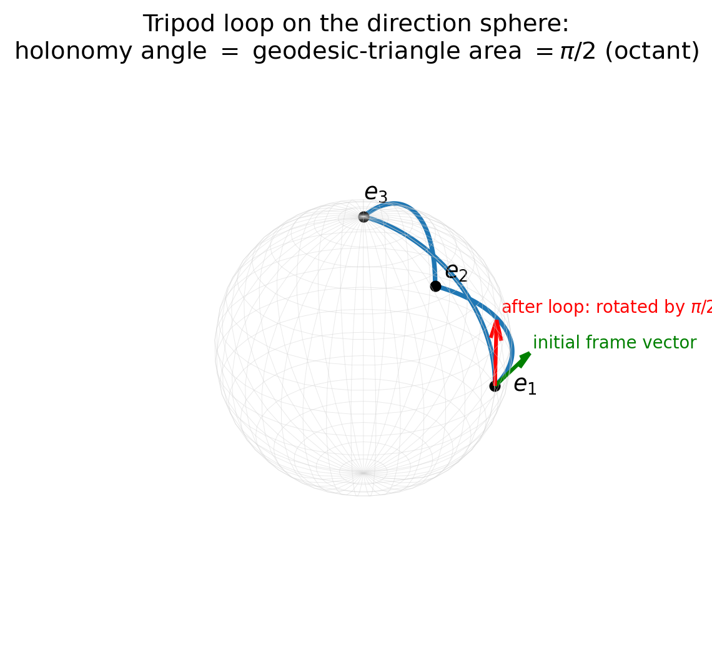
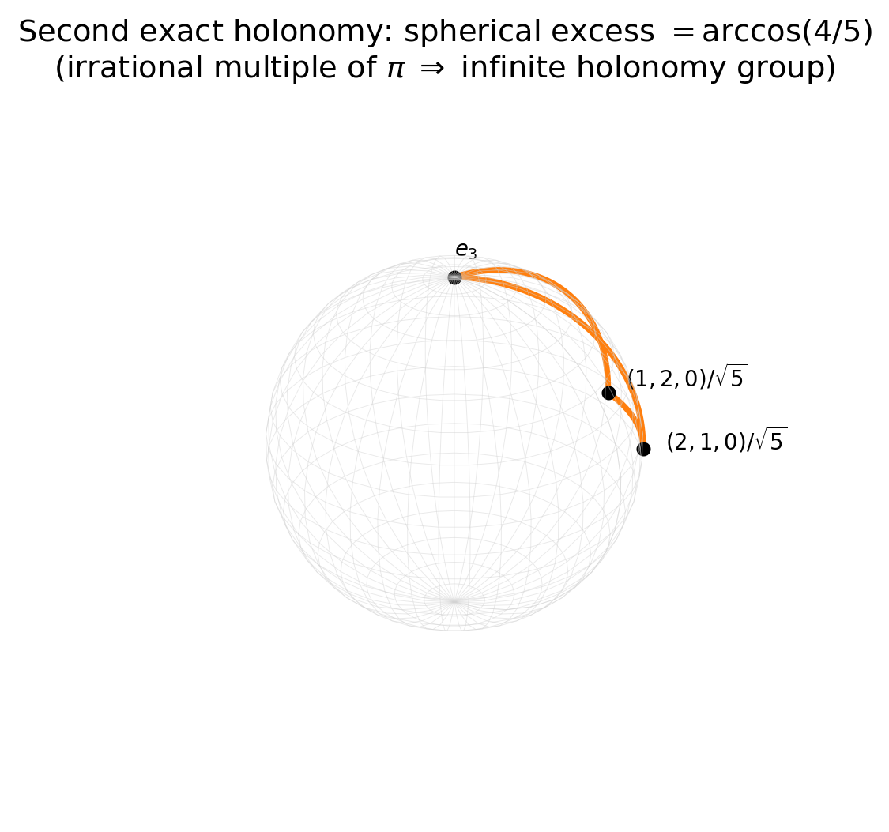
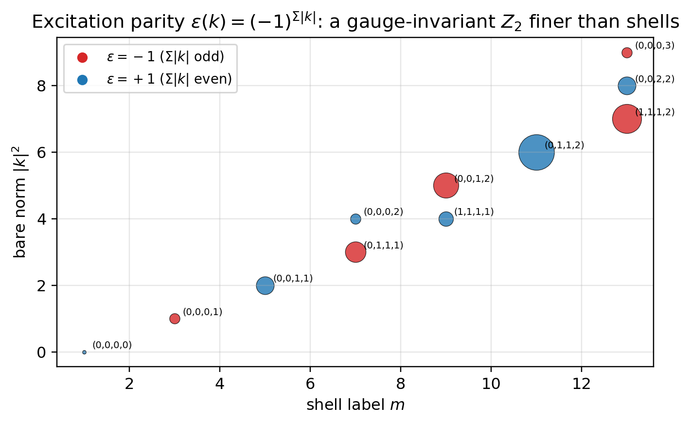

# Paper 10: Emergent Gauge Structure

## Kinematic Uniqueness of the Connection, the First Holonomy, the Forcing of the Structure Group SO(4), the Spin Lift, and the Kinematic Default of the Coupling Constant

Author: Noriaki Kihara  
Affiliation: WF System Co., Ltd.  
ORCID: 0009-0004-6753-4020  
Version: v0.4 (PDF glyph typesetting fix only; md content and results unchanged — subscripts/superscripts, floor/ceil, calligraphic N, QED square, double arrows, ballot marks mapped to LaTeX to remove tofu) (content and results unchanged from v0.2; nomenclature unified to the displacement-record definition of Paper 0.5 — ledger/register sorted into displacement record / conserved quantity / invariant / accounting)  
Date: June 2026  
DOI (this version): 10.5281/zenodo.20690236  
Concept DOI: 10.5281/zenodo.20640464  
License: CC BY 4.0  

* * *

## Abstract

This paper shows that the kinematic skeleton of gauge theory appears inside the reciprocal dual model (Papers 1–9) **without ever assuming the gauge principle**. The direction of approach is the reverse of the usual one: each time we pressed on different questions — the inventory of conserved quantities, stability, and observability — components of gauge theory appeared as by-products.

The main results are as follows. (1) **Kinematic uniqueness of the connection**: the radial direction of each fragment is the indicator of its local timelike axis (Paper 6), and the connection must transport it. The two conditions of time-axis transport and twist-free minimality uniquely select the minimal-rotation connection of the position-adapted frame — no dynamical input was required. (2) **The first holonomy**: the sibling-triangle holonomy of a mutually orthogonal three-fragment configuration (tripod) is a $90^\circ$ rotation, and its rotation angle **coincides exactly** with the area of the geodesic triangle on the direction sphere (an octant, $\pi/2$) — discrete transport reproduces continuous curvature exactly. The curvature quantum $\pi/2$ is universal, independent of shell and hierarchy. The second exact holonomy $\arccos(4/5)$ has infinite order by Niven's theorem, so the holonomy group is infinite. (3) **Continuization theorem for the structure group**: the closure of the group generated by adjoining to $B_4$ the $45^\circ$ rotation required by transport between fragments of different shapes is all of SO(4) (proved via the 3-dimensional crystallographic restriction). **The continuous gauge group is a consequence, not an assumption.** (4) **The locus of curvature**: curvature on genealogical links and static transverse twist are unrecordable and hence gauge (a derivation from the record theorem). Curvature concentrates on sibling triangles, and the place where internal gauge structure can be physical is localized at transition events (vertices). (5) **Spin lift**: the half-angle lift is consistent; the tripod holonomy has order 8 in the spin representation, and the all-axes planar ring configuration carries the first loop that is trivial in the vector representation and $-1$ in the spin representation. The screw lift (coupling rotation with translation) is unique with pitch $1/2$ and identifies a new gauge-invariant $Z_2$, the excitation parity $(-1)^{\Sigma|k|}$. (6) **Kinematic default of the coupling constant**: for the parameter $\beta$ of Wilson-type weights, we show that pure counting ($\beta=0$) is forced under the current axiom system — a finite $\beta$ would signify genuinely new dynamical input.

Finally, we identify the gauge structure that has emerged as being not of Yang–Mills type but of the type of **first-order gravity (vierbein plus spin connection)**. The claim of this paper extends only to "gauge structure plus computed holonomies"; we do not claim a "gauge theory."

* * *

## Keywords

lattice gauge theory, connection, holonomy, parallel transport, hyperoctahedral group, crystallographic restriction, spin structure, double cover, Wilson action, vierbein

* * *

## 1. Introduction

Gauge theory on a lattice has been established since Wilson [5] as a construction that places continuous gauge groups on a discrete spacetime (see Kogut [6] for a review). The construction of this paper runs in the opposite direction: **the discrete structure (a $B_4$-symmetric lattice and configuration statistics) comes first, and the continuous group is forced**. Moreover, whereas ordinary gauge theory [7] starts from localizing an internal symmetry, what emerges in this paper is the transport rule for the orthonormal frame of each fragment — an object close to the first-order formulation of gravity (Cartan's frame formalism). The tradition of treating curvature in discrete geometry goes back to Regge [8].

The question of this paper is modest: when the multi-fragment configurations constructed in Paper 7 are endowed with the structure of frame alignment **by minimal choices**, what becomes determined and what remains free?

* * *

## 2. Setup: Graph, Frames, and Links

Following the splitting representation of Paper 4 [1], for a single splitting event $9\to(s_A,s_B,s_C)$ we take: nodes = the parent and the children (each carrying the orthonormal 4-frame of its own internal lattice), links = genealogical links and sibling links, minimal cycles = sibling triangles. A child $X$ occupies cell $k_X$ of the parent lattice (configuration reading, Paper 7 [3]).

There are two candidate frame conventions: (L) all children inherit the parent's lattice frame (all links identity, all holonomies trivial); (A) the first frame vector of each child = its own cell direction $\hat k_X$ (position-adapted).

* * *

## 3. Kinematic Uniqueness of the Connection

### 3.1 Time-axis transport condition

By Paper 6 [2], the manifestation of the asymmetric bit within a hierarchy concentrates in the radial direction — the radial direction $\hat k_X$ of each fragment is the indicator of that fragment's **local timelike axis**. A necessary condition for the connection to be compatible with this structure is that the link variable map radial direction to radial direction: $U_{AB}(\hat k_A)=\hat k_B$. The lattice convention (L) maps A's timelike axis to a spacelike direction of B whenever $\hat k_A\ne\hat k_B$, which is incompatible with the hierarchical universality of the $1{+}3$ decomposition. **Hence (L) is excluded.**

### 3.2 Uniqueness theorem

If, on the transverse freedom remaining under the time-axis transport condition, we impose the **twist-free condition** (identity on the orthogonal complement of the plane spanned by the two directions = minimal rotation), then:

> **Theorem**: A connection satisfying time-axis transport and twist-freeness coincides uniquely with the minimal-rotation connection of the position-adapted convention. No dynamical input is required.

For a non-antipodal pair of axis-type directions the minimal rotation is a unique $90^\circ$ rotation, an element of $B_4$.

* * *

## 4. Holonomy

### 4.1 The first holonomy: the tripod carries a quarter turn

The holonomy of the sibling triangle $e_1\to e_2\to e_3\to e_1$ of a mutually orthogonal configuration $\{e_1,e_2,e_3\}$ (the tripod class of Paper 7) is

$$
H=\text{a }90^\circ\text{ rotation in the }(e_2,e_3)\text{ plane (nontrivial, order 4, }\det=+1\text{)}
$$

(the matrix computation is in the Appendix). The geodesic triangle $(e_1,e_2,e_3)$ on the direction sphere has three right angles and area $=\tfrac{3\pi}2-\pi=\tfrac\pi2$. **Holonomy angle = area**: discrete transport (the minimal rotations of $B_4$) reproduces continuous curvature (Gauss–Bonnet) exactly. The curvature quantum $\pi/2$ of the orthogonal tripod is independent of shell, hierarchy, and shape, so long as the directions are mutually orthogonal — a scale-invariant curvature quantum.

**Figure 1. Tripod-loop holonomy: the geodesic triangle on the direction sphere (an octant, three right angles). The transported frame vector rotates by $\pi/2$ around one circuit = the triangle area (an exact discrete reproduction of Gauss–Bonnet).**

### 4.2 Relational resolution of the antipodal ambiguity

In the antipodal-pair class the transport $e_1\to-e_1$ requires a choice of plane for the $180^\circ$ rotation and is not unique. If it is defined by geodesic composition via the remaining sibling (the relational rule: no reference imported from outside), the holonomy in the vector representation trivializes canonically. The difference between area $0$ and area $2\pi$ is invisible in the vector representation and becomes visible only with the spin lift (§6).

### 4.3 The second exact holonomy and infiniteness

For the configuration $(2,1,0,0)/\sqrt5,\ (1,2,0,0)/\sqrt5,\ e_3$, the holonomy angle of the geodesic triangle is, by spherical excess, $\arccos(4/5)\approx36.87^\circ$. By Niven's theorem [9] (if $\cos\theta\in\mathbb{Q}$ and $\theta/\pi\in\mathbb{Q}$, then $\cos\theta\in\{0,\pm\tfrac12,\pm1\}$), $\arccos(4/5)/\pi$ is irrational, so this holonomy has **infinite order**. The holonomy group is infinite, and the continuization of the structure group (§5) manifests at the level of observables.

**Figure 2. The second exact holonomy: the spherical excess of a configuration of type $((2,1,0,0),(1,2,0,0),e_3)/\sqrt5$ is $\arccos(4/5)$ — an irrational multiple of $\pi$ (Niven's theorem), so the holonomy group is infinite.**

### 4.4 The locus of curvature (a derivation from the record theorem)

Even if curvature is placed on a genealogical link, no record exists at any hierarchy level that reads the relative frames of the cousins where its effect would have to appear (half-wavelength censorship, Paper 9 [4]). Since a difference that is not recorded has no fact (the record theorem, Paper 6):

> **Theorem**: Genealogical curvature and static transverse twist are gauge. The physical locus of curvature is restricted to sibling triangles (star-flatness is not a convention but a canonical gauge), and the holonomy of any genealogical cycle decomposes into an ordered product of sibling-triangle holonomies (a discrete non-abelian Stokes). The place where internal gauge structure can be physical is localized not at links but at **transition events (vertices)**.

* * *

## 5. Continuization Theorem for the Structure Group

### 5.1 The obstruction

Position adaptation requires $U_{AB}(\hat k_A)=\hat k_B$, but $B_4$ (components $\{0,\pm1\}$) maps axis-type directions only to axis-type directions. Since the cell directions of shell 5 are of diagonal type ($(\pm e_i\pm e_j)/\sqrt2$), **no $B_4$-valued link variable exists on links between fragments of different shapes** (the required $45^\circ$ rotation contains components $\pm1/\sqrt2$).

### 5.2 Theorem

> **Theorem (continuization)**: The closure of the group generated by adjoining to $B_4$ the $45^\circ$ rotation in a coordinate plane required by hetero-shape links is all of SO(4).

**Sketch of proof**: There is no finite 3-dimensional point group containing order-8 rotations about two distinct axes (the crystallographic restriction). Hence the generated group is infinite, and its closure reaches SO(4) through a family of SO(3) subgroups. Finite extensions (e.g., $W(F_4)$) have also been checked to be insufficient, by the lengthwise conservation of orbits. $\blacksquare$

> **The continuous gauge group is a consequence, not an assumption.** The target picture is "a structure on a discrete lattice carrying an SO(4)-valued connection, whose finite remnant is $B_4$," which is isomorphic to the standard picture of lattice gauge theory [5,6].

* * *

## 6. Spin Lift

### 6.1 Construction and consistency

Each minimal rotation (of angle $\theta$) is lifted to $\mathrm{Spin}(4)$ by the half-angle lift $\exp(\tfrac\theta2 B)$. Since antipodal transport lifts as the composition prescribed by the relational rule (§4.2), its sign is fixed and the lift is consistent. A quaternion computation shows that the lift of the tripod holonomy is $H_{\mathrm{spin}}=(1+i)/\sqrt2$, with $H_{\mathrm{spin}}^4=-1$: **a spinor carried four times around the tripod triangle reverses sign** (invisible in the vector representation).

### 6.2 The first $-1$

The great-circle 4-cycle of the all-axes planar ring configuration $\{e_1,e_2,-e_1,-e_2\}$ is the identity in the vector representation and $-1$ in the spin representation — **the first loop that is vectorially trivial and spinorially nontrivial**. The enclosed area is a hemisphere, $2\pi$; the sign is $(-1)^{\text{area}/2\pi}$, and a $Z_2$ degree of loops is born. Moreover, the lift of the exchange of like fragments gives exchange$^2=-1$ (raw material for spin statistics; the spinorial matter that would bridge them is not constructed in this paper).

### 6.3 The screw lift and excitation parity

The current real standing-wave dictionary transforms by whole angles (vectorially) under rotational transport and contains no matter that detects $-1$ (by the general lemma that amplitude-free matter is a permutation representation, hence single-valued). The half-angle structure lies on the translation side: the only translation that acts as a scalar ($\pm1$) on each cell of the real dictionary is the half-period translation (**the pitch-$1/2$ uniqueness theorem**), and the **screw lift**, which couples a translation to each rotation, can be defined uniquely in the lattice-plane sector. The structure group is the direct product $\mathrm{SO}(4)\times T^4$ (because under the Euclidean composition the translations would cancel around closed cycles), and the translation components behave as internal $U(1)^4$ charges subordinate to the rotations. The screw outcome of a $2\pi$ planar rotation acts on cell $k$ as $(-1)^{|k_i|+|k_j|}$, identifying a new gauge-invariant parity

$$
\varepsilon(k)=(-1)^{\sum_i|k_i|}
$$

(finer than shells: both parities can coexist within the same shell). We also place on record that the combination of two-valued logical states, $Z_2$ structure, and protection by censorship is structurally adjacent to the correspondence between error-correcting codes and $Z_2$ lattice gauge theory (Kitaev's toric code [10]). The **necessity of introducing** the screw lift is explicitly left undecided in this paper.

**Figure 3. Excitation parity $\varepsilon(k)=(-1)^{\Sigma|k_i|}$ (exhaustive for $m\le13$): point size = number of cells in the orbit, color = parity. Both parities coexist within the same shell — a gauge-invariant $Z_2$ finer than shells.**

* * *

## 7. Kinematic Default of the Coupling Constant

Consider a Wilson-type action [5] with $s(H)=1-\tfrac14\mathrm{Tr}\,H$ per sibling triangle and weight $\propto e^{-\beta s}$; then only tripods carry $s=\tfrac12$, and the branching ratios (Paper 7) are deformed into a one-parameter family. However:

1. Frame frustration (the unsatisfiability of global alignment at tripods) does not separate the configuration pair (tripod and antipodal pair) that is exactly degenerate in capacity, energy, and fragment content — **it posts no debit in the area accounting** (kinematically free).
2. The counting of vertex variables (the initialization of child frames at splitting events) yields only the two values $\beta=0$ for relaxed alignment and $\beta=\infty$ for exact alignment.

> **Theorem (kinematic default)**: Under the current axiom system (the three assumptions + configuration reading + the record principle), the weight of the branching ratios is forced to be pure counting ($\beta=0$). A finite $\beta$ would signify the existence of genuinely new dynamical input, and a branching-ratio measurement (12.9% / 0% / intermediate values) becomes a three-way discriminator. The difference that the choice of measure (batch / sequential / path) makes to the branching statistics is treated in Paper 12 §5.3.

* * *

## 8. Identification and the Discipline of Naming

The precise counterpart of the structure that has emerged is not the Yang–Mills theory of internal symmetries [7]: the position-adapted frames = a discrete frame field (vierbein), the connection = a spin connection, the structure group SO(4) = the rotation group of the tangent space. That is, it is close to **the gauge structure of first-order gravity** (a structural correspondence, not an identification).

The claim of this paper extends only to "gauge structure plus computed holonomies." What is missing for claiming a "gauge theory" — propagating gauge degrees of freedom, dynamics of an action, spinorial matter, internal symmetries — is explicitly placed outside the scope of claims.

* * *

## 9. Scope of Claims of This Paper

What we claim: (1) Kinematic uniqueness of the connection (theorem). (2) Holonomy $\pi/2$ = geodesic area (exact), the infinite order of $\arccos(4/5)$ (Niven), the infiniteness of the holonomy group. (3) The continuization theorem (the forcing of SO(4)). (4) The gauge nature of genealogical curvature and static twist, and the concentration of curvature on sibling triangles (a derivation from the record theorem). (5) The consistency of the spin lift, order 8, the first $-1$, the uniqueness of pitch $1/2$, the excitation parity $\varepsilon$. (6) The kinematic forcing of $\beta=0$.

What we do not claim: (1) Correspondence with the gauge groups, representations, or generation structure of the Standard Model. (2) Dynamics of gauge fields (propagation, scattering). (3) The existence of fermions (exchange$^2=-1$ is raw material; spinorial matter is not constructed). (4) The necessity of the screw lift. (5) The title of "gauge theory."

* * *

## 10. Conclusion

Without placing the gauge principle among the axioms, the connection, curvature, a continuous structure group, spin structure, and even the default value of the coupling constant have emerged as by-products of questions about stability and observability. In particular, the three points — (i) the connection is fixed uniquely by kinematics without waiting for dynamics, (ii) the holonomy of discrete transport reproduces continuous curvature exactly, and (iii) the continuous group is **forced** by the crystallographic restriction — provide an independent instance of the picture of continuous gauge structure on top of a discrete foundation. The remaining open items — internal gauge fields localized at vertices, spinorial matter, finite coupling — all converge on a single object: the structure of transition events (the vertex map).

* * *

## Appendix: Matrices and Verifications

This appendix contains the explicit matrices of the $90^\circ$ rotations $U_{12},U_{23},U_{31}$ and the verification of the holonomy $H=U_{31}U_{23}U_{12}$ ($e_1\to e_1$, $e_2\to e_3$, $e_3\to-e_2$, $H^4=\mathbf{1}$), the spin lift by quaternions ($q_3q_2q_1=(1+i)/\sqrt2$), the one-line proof of the obstruction theorem (the contradiction between the $B_4$ components $\{0,\pm1\}$ and $1/\sqrt2$), and the proof of pitch uniqueness ($2\pi t\in\{0,\pi\}\bmod 2\pi$). All of these are exact algebra by hand; the scripts and research notes are provided in the public repository (https://github.com/WurabeSeiji/ai-chat-logs-open).

* * *

## References

[1] Noriaki Kihara, Paper 4, v1.0, 2026. Concept DOI: 10.5281/zenodo.20638962.

[2] Noriaki Kihara, Paper 6, v0.2, 2026. Concept DOI: 10.5281/zenodo.20640456.

[3] Noriaki Kihara, Paper 7, v0.2, 2026. Concept DOI: 10.5281/zenodo.20640458.

[4] Noriaki Kihara, Paper 9, v0.2, 2026. Concept DOI: 10.5281/zenodo.20640462.

[5] K. G. Wilson, "Confinement of quarks," Physical Review D 10 (1974), 2445–2459.

[6] J. B. Kogut, "An introduction to lattice gauge theory and spin systems," Reviews of Modern Physics 51 (1979), 659–713.

[7] C. N. Yang and R. L. Mills, "Conservation of isotopic spin and isotopic gauge invariance," Physical Review 96 (1954), 191–195.

[8] T. Regge, "General relativity without coordinates," Il Nuovo Cimento 19 (1961), 558–571.

[9] I. Niven, *Irrational Numbers*, Mathematical Association of America, 1956.

[10] A. Kitaev, "Fault-tolerant quantum computation by anyons," Annals of Physics 303 (2003), 2–30.

* * *

## License

This paper is published under CC BY 4.0.  
Reuse, adaptation, translation, and citation are permitted, provided that the author name, version, publication date, and source are clearly indicated.
