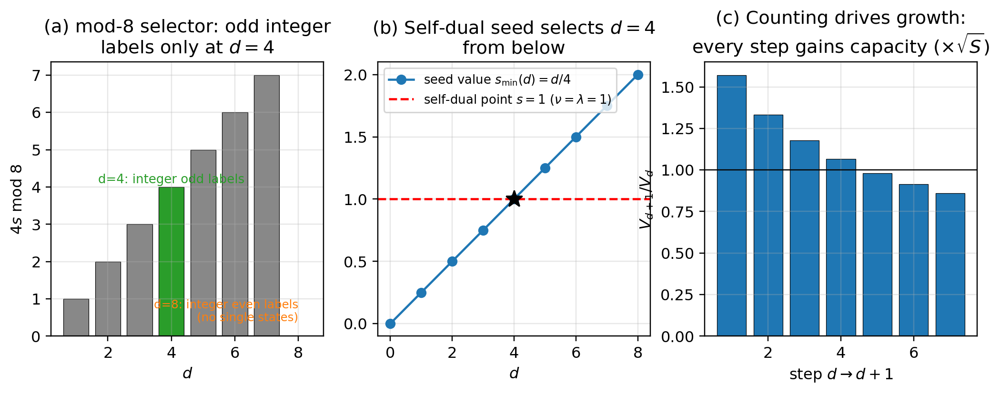

# 論文11：次元の必然性

## 両端点定理・生存区間 $[0,4]$・mod 8 選択定理・発展的選択・四脚定理

著者: 木原 範昭 (Noriaki Kihara)
所属: WF System Co., Ltd.
ORCID: 0009-0004-6753-4020
版: v0.2（草稿・査読反映）
日付: 2026 年 6 月
DOI（本版）: 未付与
Concept DOI: 未付与
ライセンス: CC BY 4.0

* * *

## 要旨

逆数双対モデルの先行論文では、空間次元 $d=4$（格子 $\mathbb{Z}^4$）は入力であった。本稿は、$d=4$ が三仮定（$\nu\lambda=1$・零点 $1/2$・非対称1ビット）の下でどこまで**必然**かを、互いに独立な複数の選択機構として整理する。

第一に、**両端点定理**：複合体を保護する半波長検閲（論文9）の成立条件は、容器スペクトルの最大非調和シフトの閉形式 $\Delta\nu_1(d)=(\sqrt d-1)^2/2$ により

$$
\Delta\nu_1(d)\le\tfrac12\iff d\in[0,4]
$$

と同値であり、**飽和（等号）はちょうど両端 $d\in\{0,4\}$ のみ**である。$d\ge5$ では最下モードのシフトが半量子を超えて連続崩壊チャネルが開き、安定複合体は存在できない。内部（$0<d<4$）は真に余裕を持って安定であり、これは「ゼロから成長して4を天井とする」発展的経路の存在条件である。

第二に、**mod 8 選択定理**：$d$ 軸格子のドレッシング込みラベルは $4s=\sum(2|k_i|+1)^2\equiv d\pmod 8$ を満たすから、ラベルが整数になるのは $d\equiv0\pmod4$ のみ、**奇数整数（単一状態の分類定理の土台、論文5）になるのは $d=4$ が唯一**である（$d=8$ は偶数ラベルとなり単一状態が消滅する）。記録（整数帳簿）を持てるセクターは4軸に限る — 検閲天井と独立な第二の選択機構である。

第三に、**規格化の固定**：検閲の判定単位はレベル局所（各複合体自身の梯子単位）であることが階層相対性から強制され、比較梯子 $\ell+\tfrac{d-1}2$ は球面スペクトルの厳密恒等式 $\omega_\ell^2=L^2-(\tfrac{d-1}2)^2$ により唯一の正準等間隔梯子である。残る規格化自由度は波動作用素の曲率結合 $\xi$ の一条件に縮約され、最小結合 $\xi=0$ をデフォルトとする（共形結合では次元選択が消滅することも明示する）。

第四に、**四脚定理（条件付き必然）**：安定な複合体が存在するならば、その状態空間は離散（コンパクト容器の離散スペクトル）・有界無境界・正曲率・$d\le4$ でなければならない。平坦無限と負曲率は連続スペクトルゆえ検閲に守るべき離散梯子が存在せず、安定複合体を持てない。

第五に、**発展的選択と下からの選択子**：固定予算 $S$ の容量は $N^{(d)}(S)\approx V_d S^{d/2}$ と次元に伴い急増するため、次元成長は分裂と同一の数え上げ原理で駆動される。一方、軸の実在化は零点費用を伴い予算限界 $d\le4S$ を与え、最小セル（純零点）が双対固定点 $s=1$ に一致する次元は $d=4$ のみである（自己双対種子）。上からの天井（検閲）と下からの選択子（自己双対性）は $d=4$ で一致する。

これらは独立した複数の選択機構の**収束**であり、本稿は各機構の前提条件を明示した上で、次元を公理在庫から消すための残課題を特定する。

* * *

## キーワード

時空次元、次元選択、Weyl 漸近、非調和性、mod 8、発展的選択、曲率符号、自己双対、規格化、創発

* * *

## 1. はじめに

「なぜ空間は3次元（時空は4次元）か」という問いには長い歴史がある。Ehrenfest [5] は逆二乗則と安定軌道の関係から、Whitrow [6] は生命の可能性から、Tegmark [7] は予言可能性の観点から $3{+}1$ の特殊性を論じた。力学的なアプローチでは、因果的動的単体分割（CDT）が4次元的なマクロ構造の創発を数値的に示している（Ambjørn, Jurkiewicz & Loll [8]）。代数的には、結合的可除代数の次元が $1,2,4$ に限られるという Hurwitz の定理 [9,10] が $d=4$ 固有の例外構造の代表である。

本稿のアプローチはこれらと独立であり、**複合状態の安定性（検閲）と記録の算術（mod 8）という二つの内部要求**から次元が拘束されることを示す。先行アプローチとの関係（特に CDT の4次元創発、可除代数の次元列との交わり）は、構造対応として §8 で論じる。

* * *

## 2. 両端点定理

### 2.1 閉形式

$S^d$ 容器のスペクトル $\ell(\ell+d-1)$ と正準梯子 $\ell+\tfrac{d-1}2$（§4 で正準性を示す）の最大偏差は、$t=\sqrt d$ と置く簡約により

$$
\Delta\nu_1(d)=\frac{\bigl(\tfrac{d-1}2\bigr)^2}{\tfrac{d+1}2+\sqrt d}=\boxed{\ \frac{(\sqrt d-1)^2}{2}\ }
$$

である（$d=1:0$、$d=2:0.086$、$d=3:0.268$、$d=4:\tfrac12$、$d=5:0.764$、$d=9:2$）。

### 2.2 定理

検閲条件（歪みシフト ≤ 分解能の半分 $=\tfrac12$）：

$$
\frac{(\sqrt d-1)^2}{2}\le\frac12\iff|\sqrt d-1|\le1\iff d\in[0,4]
$$

> **両端点定理**: 生存区間は閉区間 $[0,4]$ であり、飽和（等号）はちょうど両端 $d=0$ と $d=4$ のみ。整数に限定しない一意性であり、「完全平方の偶然」ではない。$d\ge5$ では連続崩壊チャネルが開き、安定複合体・持続する記録・階層は立たない。

$d=1$（円）は曲率ゼロでシフト厳密ゼロ — 成長の第一歩はコスト無料である。以後単調増加し、天井 $d=4$ でちょうど使い切る。**低次元の余裕は淘汰理由ではなく通過可能性であり、臨界性は選択基準ではなく天井到達の帰結である。**

![Figure 1. Both-endpoint theorem: survival interval [0,4]](figure_paper11_1_survival_interval.png)

**図1. 両端点定理：$\Delta\nu_1(d)=(\sqrt d-1)^2/2$ と検閲限界 $1/2$。生存区間は $[0,4]$、飽和は両端のみ。**

* * *

## 3. mod 8 選択定理

奇数平方は $\equiv1\pmod 8$ であるから、$d$ 軸格子のドレッシング込みラベルは

$$
4s=\sum_{i=1}^d(2|k_i|+1)^2\equiv d\pmod 8
$$

を満たす。したがって：

| $d$ | 1 | 2 | 3 | **4** | 5 | 6 | 7 | 8 |
|---|---|---|---|---|---|---|---|---|
| ラベル整数 | ✗ | ✗ | ✗ | **✓** | ✗ | ✗ | ✗ | ✓ |
| 整数時の偶奇 | — | — | — | **奇数** | — | — | — | 偶数 |

> **定理**: 整数ラベルは $d\equiv0\pmod4$ のみ。奇数整数ラベル — 分類定理・分裂定理・$Z_2$・タイル化・系譜の全土台（論文5–7） — は **$d=4$ が唯一**である（$d=8$ は偶数ラベルとなり単一状態が消滅する）。

検閲天井（§2）が「安定性」から、mod 8 定理が「記録の算術」から、**互いに独立に** $d=4$ を選ぶ。

* * *

## 4. 規格化の固定

次元選択の主張は三つの規格化自由度に依存しうる。本稿はこれを分解して二つを決着させ、一つを命名された条件に縮約する。

**(A) 単位の選択**：検閲が保護するのは複合体の内部コヒーレンスであり、判定基準はレベル局所（各複合体自身の梯子単位）でなければならない（階層相対性、論文6 §5）。これにより限界飽和（$\ell=1$ で厳密 $1/2$）は全階層普遍となる。

**(B) 梯子の正準性**：球面スペクトルは厳密恒等式 $\omega_\ell^2=L^2-a^2$（$L=\ell+a$、$a=\tfrac{d-1}2$）を満たし、漸近偏差が消える等間隔梯子は $c=a$ のみである。比較梯子は近似でも便宜でもなく**正準**である。

**(C) 曲率結合**：容器上の波動作用素 $-\Delta+\xi R_{\mathrm{scal}}$ の一径数族のうち、最小結合（$\xi=0$）では欠損 $a^2$ が次元依存となり §2 の全連鎖が成立する。共形結合（$\xi_c$）では欠損が全次元で普遍的に $\tfrac14$ となり、**次元選択は蒸発する**（この対比自体が判定材料である：曲率結合の文脈は Birrell & Davies [11]）。節約原理（曲率項の追加＝構造の追加）によりデフォルトは $\xi=0$ とし、$d\in[0,4]$ の定理群の条件を「$\xi=0$ の下で」と明示する。$\xi$ のモデル内導出（論理波のゼロ交差集合の曲率応答）は残課題である。

* * *

## 5. 四脚定理：曲率符号の三分法

安定性の機構（検閲）は「保護すべき離散梯子」の存在を前提とする。三つの曲率符号を検査すると：

- **平坦無限 $E^d$**：スペクトルは連続。あらゆる崩壊チャネルが連続であり、検閲には守るべき離散構造が存在しない。さらに非調和性が恒等的にゼロとなり、次元天井の選択機構ごと消える。
- **負曲率 $H^d$**：非コンパクトでスペクトルは連続帯。同様に安定複合体なし。
- **正曲率 $S^d$**：コンパクト ⟹ 離散スペクトル ⟹ 検閲の保護対象が存在し、非調和性が天井を実現し、共有曲率による凝縮（論文8）が可能。

> **四脚定理（条件付き必然）**: 安定な複合体が存在するならば、その状態空間は**離散・有界無境界・正曲率・$d\le4$（天井で臨界飽和）**でなければならない。正曲率は美的選択ではなく、「半波長検閲に守るべきものがある唯一の曲率符号」である。

有限性は自己無撞着条件 $R_c^2=S$ により（有限の内容は有限の正曲率半径を強制する）、無境界性は階層相対性と関係主義により（境界＝絶対的標識の排除）従う。

* * *

## 6. 発展的選択：押し上げと天井の分業

### 6.1 数え上げ駆動

シフト格子 $(\mathbb{Z}+\tfrac12)^d$ の予算 $S$ の容量は大 $S$ で $N^{(d)}(S)\approx V_d S^{d/2}$（$V_d$ は単位球体積）であり、1ステップの利得 $N^{(d+1)}/N^{(d)}\approx(V_{d+1}/V_d)\sqrt S>1$。**次元成長は分裂・分岐比と同一のミクロカノニカル数え上げ原理で駆動され、新しい重み原理は不要である。** ただし数え上げ単独の最適次元は $d^\ast\sim2\pi S\gg4$ であり、4で止めるのは駆動ではなく**ブレーキ（検閲）**である — 押し上げ＝数え上げ、天井＝安定性、という分業が確定する。

### 6.2 次元イベントの還元と予算限界

$\mathbb{Z}^d$ は $\mathbb{Z}^{d+1}$ の非励起スライスであり、「次元追加」は新しい移動型ではなく**新軸の最初の励起＝通常の配置遷移**に還元される。実在化した軸は零点費用 $\tfrac14$ を払うため、予算 $S$ の対象が実在化できる軸数は $d\le4S$ — **次元の有限性そのものが零点の帰結**である。

### 6.3 自己双対種子（下からの選択子）

最小セル（全軸非励起＝純零点）の代表値は $s_{\min}(d)=d/4$ である。$\nu\lambda=1$ の自己双対点は $s=1$ であるから

$$
s_{\min}(d)=1\iff d=4
$$

**最小セルがちょうど双対の固定点に座る次元は4のみ**である。「未分化の種子は双対変換の固定点に座るべきである」（非対称ビットは記録なしには側を選べない）を原理に採れば、$d=4$ は下から厳密一意に出る — 上からの天井（§2）と**挟み撃ちで一致**する。一致は要請されていない：二つの独立な計算の合流である。なお下側の選択子は $\xi$ に依存しない（§4(C) の条件から自由である点が重要である）。

**図2. 三つの独立な次元選択子：(a) mod 8 算術（奇数整数ラベルは $d=4$ のみ）、(b) 自己双対種子 $s_{\min}(d)=d/4=1\iff d=4$（下から）、(c) 数え上げ駆動（全段で容量利得、押し上げ）。**

* * *

## 7. 創発系列（総合）

以上を合成すると、高周波の未分化単一状態からの創発は次の系列として読める（個々のリンクは定理、連結部の未証明は §9 で明示）：

$$
\text{種子}(d=0)
\;\xrightarrow{\text{数え上げ駆動}}\;
\text{次元成長}\ d\le4
\;\xrightarrow{\text{天井で臨界}}\;
d=4
\;\xrightarrow{\text{安定限界超過}}\;
\text{分裂カスケード}
\;\xrightarrow{\text{終端}}\;
\text{安定種}\{1,3,5\}
$$

断片数 $n$ がゲージ不変量の出現順序を刻む：$n=1$ で無（雲）、$n=2$ で長さ、$n=3$ で角度・曲率・スピン（ゲージ構造の誕生点、論文10）、終端で恒久ラベル。**剛体の1次元帳簿（時計）は分裂前から存在し、空間様の関係量（2次元以上）は分裂と共にしか生まれない — この系列では時間様構造が空間様構造に先行する。**

* * *

## 8. 考察：独立な選択子の収束

本稿の選択機構（検閲天井・mod 8・自己双対種子）は、いずれも格子の例外構造を直接使っていない。一方、$d=4$ には独立な例外構造の系列 — 結合的可除代数の最大次元 [9,10]、$\mathbb{Z}^4$/24胞体の自己双対性、SO(4) の非単純性 — が存在し、CDT は力学的に4次元的マクロ構造の創発を示す [8]。複数の独立な経路が同じ値に収束することは、いずれか単独の論証より強い種類の状況証拠である。ただし共通起源（これらすべてを生む単一の構造）の証明は未着手であり、収束は予想として記録する。

* * *

## 9. 本稿の主張範囲

主張すること：(1) 両端点定理（$\xi=0$ の下で厳密）。(2) mod 8 選択定理（無条件）。(3) 規格化の三分解と (A)(B) の決着。(4) 四脚定理（条件付き必然：安定複合体の存在 ⟹ 離散・有界無境界・正曲率・$d\le4$）。(5) 数え上げ駆動・予算限界・自己双対種子の算術。

主張しないこと：(1) 物理的時空次元の説明（「次元」はモデルの可視セクターの軸数である）。(2) $\xi=0$ のモデル内導出（残課題）。(3) 自己双対種子の「原理」への昇格（候補に留める）。(4) 次元成長の駆動と分裂の交錯順序の決定。(5) Hurwitz 系・CDT との共通起源（予想）。

* * *

## 10. 結論

$d=4$ は本モデルにおいて、(i) 安定性（検閲天井、上から）、(ii) 記録の算術（mod 8、無条件）、(iii) 双対性（自己双対種子、下から）という三つの独立な機構によって選ばれる。さらに曲率符号と有限性まで含めれば、「安定な複合体が存在する」という一つの条件から、状態空間が離散・有界無境界・正曲率・4次元（臨界）であることが必要条件として従う。次元を公理在庫から完全に消すために残るのは、$\xi$ の内部導出と自己双対原理の昇格の二点である。

* * *

## 付録：検算の要点

簡約 $(\sqrt d-1)^2/2$ の代数（$t=\sqrt d$ 置換）、mod 8 表（$d=1$–$8$）、$d=1$ の厳密平坦性、$d=0$ の形式的飽和、容量利得 $V_{d+1}/V_d$ の数表、$s_{\min}(d)=d/4$ の算術。スクリプトおよび研究ノートは公開リポジトリ（https://github.com/WurabeSeiji/ai-chat-logs-open）で提供する。

* * *

## 参考文献

[1] 木原 範昭, 論文4, v1.0, 2026. Concept DOI: 10.5281/zenodo.20638962.

[2] 木原 範昭, 論文5, v0.2, 2026.

[3] 木原 範昭, 論文6, v0.2, 2026.

[4] 木原 範昭, 論文9, v0.2, 2026.

[5] P. Ehrenfest, "In what way does it become manifest in the fundamental laws of physics that space has three dimensions?," Proceedings of the Amsterdam Academy 20 (1917), 200–209.

[6] G. J. Whitrow, "Why physical space has three dimensions," British Journal for the Philosophy of Science 6 (1955), 13–31.

[7] M. Tegmark, "On the dimensionality of spacetime," Classical and Quantum Gravity 14 (1997), L69–L75.

[8] J. Ambjørn, J. Jurkiewicz, and R. Loll, "Emergence of a 4D world from causal quantum gravity," Physical Review Letters 93 (2004), 131301.

[9] A. Hurwitz, "Über die Composition der quadratischen Formen von beliebig vielen Variablen," Nachr. Königl. Ges. Wiss. Göttingen (1898), 309–316.

[10] J. C. Baez, "The octonions," Bulletin of the American Mathematical Society 39 (2002), 145–205.

[11] N. D. Birrell and P. C. W. Davies, *Quantum Fields in Curved Space*, Cambridge University Press, 1982.

* * *

## ライセンス

本稿は CC BY 4.0 に基づき公開する。再利用、翻案、翻訳、引用を許可する。ただし、著者名、版、公開日、出典を明示すること。
