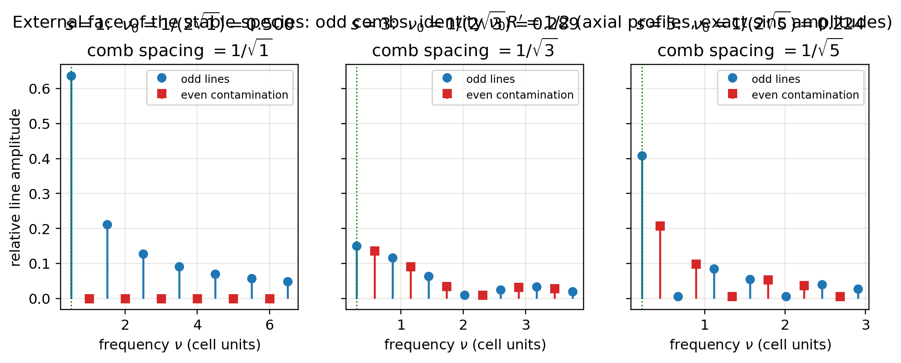
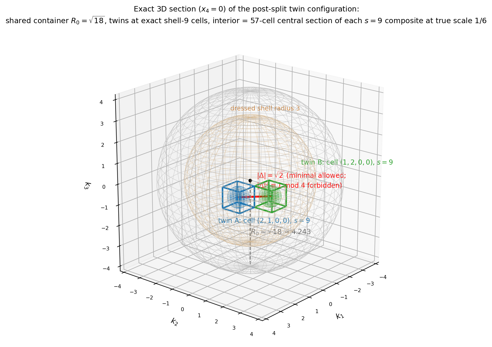
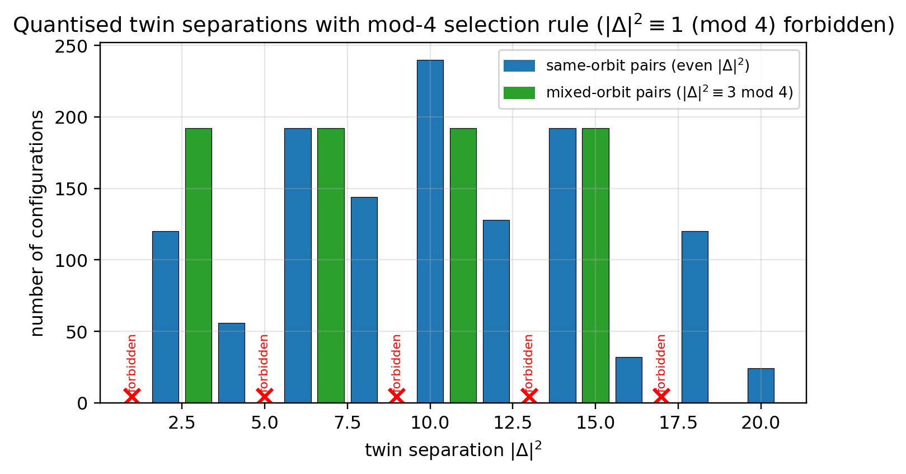
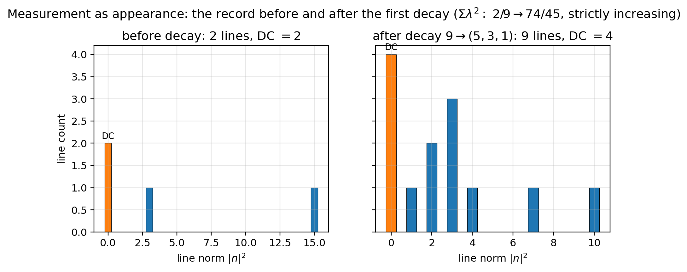

# Paper 12: The Twin Minimal Space Model

## External Face of the Stable Species, the Exact Form of Measurement, Layer Resolution of Entanglement, and Vertex Deficits with Two Hidden Axes — Interface Emergence of Quantum-Like Behavior

Author: Noriaki Kihara  
Affiliation: WF System Co., Ltd.  
ORCID: 0009-0004-6753-4020  
Version: v0.2  
Date: June 2026  
DOI (this version): 10.5281/zenodo.20640469  
Concept DOI: 10.5281/zenodo.20640468  
License: CC BY 4.0  

* * *

## Abstract

As the final paper of the series, this paper constructs the minimal system in which two composites coexist — the **twin minimal space model** — and examines how much of the behavior that looks quantum mechanical is derived as a **reading of hierarchy interfaces** in a discrete relational model that assumes neither amplitudes nor continuous time.

**External face of the stable species**: The handles (hairs) by which a composite is observed from outside divide into three ledgers: the face fundamental wave $\nu_0=1/(2\sqrt s)$ (the dominant line of the self-container spectrum), the parent-record line $\nu_{\mathrm{obs}}=|k|$, and the energy-like norm $R'=\sqrt s$. The exact identity $\nu_0 R'=1/2$ (the zero point) links the first two, and $R'$ never appears as a line — it is readable from outside **as the spacing $1/R'$ of the odd comb** (the particle-level realization of the record theorem). The external face is a **minimal-uncertainty quasi-rectangular wave packet** that carries a built-in odd comb of spacing $1/R'$ and is localized within an extent $2R'$ (half-width × fundamental wave = $1/2$).

**Construction of the twin system**: The initial value $\Omega_0^2=2\nu_1^2=18$ is an even label and, by the classification theorem (Paper 5), cannot exist as a single state — **being born as a pair is forced by parity** (the first event requires no dynamics). The allowed lattice separations of the twins (each $s=9$) are quantized to $|\Delta|^2\in\{2,\ldots,20\}$, and $|\Delta|^2\equiv1\pmod4$ is entirely forbidden. The 18 relational classes are completely separated by fringe data alone — **the scale marks of space are born as chord sets of equal-frequency shells**.

**The exact form of measurement**: Inspecting the two conditions for measurement (affecting the system; detecting the change), the detection of change requires knowledge of the prior state and regresses infinitely; in this model, however, the record of the prior state is absent by censorship, and the $\lambda$ ledger is append-only (the monotonic increase theorem, Paper 6), so the regress is structurally cut. **Measurement = an append to the record (absence → presence)**; "collapse" is the appearance of a record, and its irreversibility reduces to the same single bit as the arrow of time. Computing the first decay of the twins explicitly, the appearance of the reference wave ($s=1$) promotes the information class of the record from interferometric to holographic — **the measuring apparatus is generated by the event itself**. We also show that the final-state statistics depend on the choice of measure (one-shot equal weight over configurations $60/61$ versus sequential conditional counting $396/403$) — **measure bifurcation**, with an exact difference of $+0.00098$.

**Layer resolution of entanglement**: The self-spectrum of a single fragment lies on all-components-even vectors and is therefore identically invisible in the logical-wave (odd) sector — **only counts and relations can be read** (the relational-only readout theorem). The decay of one twin instantaneously rewrites the branching statistics of the other (total variation 0.774), but this shift **does not depend on the twin separation at all**, and the influence does not propagate through the space of the child layer — instantaneity is not a speed but a mismatch of levels. Since order and attribution do not exist in the final record, operational no-signalling follows. An entangled pair, being an even label, cannot become a single particle at the layer above (parity protection). The same map applies to two-path interference of a single wave packet.

**Vertex deficits and the two hidden axes**: An exhaustive inspection of the record continuity rule across an event (that the parent's identity line persists in the cross spectrum of the daughter system) **derives, as the persistence condition, a conservation law of position vectors $v_5\pm v_3=\pm v_9$ (a momentum analogue)**, which holds for parents in the $(2,1,0,0)$ orbit but fails for parents in the $(1,1,1,1)$ orbit by **exactly one unit** (one axis / one quantum). Furthermore, in the bookkeeping of the excitation degree $\varepsilon=(-1)^{\Sigma|k|}$ there exists a second one-bit deficit **independent** of this one (specific orbits at $s=7,9$). The visible four-axis ledgers demand two invisible directions — R on the curvature side and Q on the bare-parity side — and intermediate displacements along the invisible directions, being unrecorded, are permitted (**the licensing principle for virtual displacements**). This licence virtually unlocks two-body splittings that are forbidden in the visible ledgers, and **decomposes every decay into sequences of cubic vertices** (multiple paths to the same final state).

Finally, we organize the correspondence between the obtained structure and standard theory as a **transport principle** (a theorem is transported whenever the counterparts of its premises are verified), and state explicitly the candidate answers this model gives to questions that remain postulates on the standard-theory side (the measurement problem, the location of the cut, the problem of time, dimensionality, the measure), together with falsifiability (gravitationally mediated entanglement experiments, etc.).

* * *

## Keywords

composite particle, wave packet, relational observables, measurement problem, no-signalling, entanglement, Bell inequalities, virtual states, hidden dimensions, Kaluza–Klein, structural correspondence

* * *

## 1. Introduction

The point of arrival of the series (Papers 5–11 [2]), built upon the reciprocal dual model (introduced up to Paper 4 [1]), was that a discrete, timeless, amplitude-free relational model possesses discrete spectra, an uncertainty floor, exclusion statistics, gauge structure, and dimensional selection as theorems. The question of this paper is the final step:

> Of the behaviors held to be peculiar to quantum mechanics — wave packets, the irreversibility of measurement, the nonlocal correlations of entanglement, virtual states — how much is derived as a **reading of hierarchy interfaces** of this model, and from where on is essentially new input required?

There are two methodological keys. First, to use **the minimal two-body system**: twins with equal representative frequencies remove the unresolved clock problem from the setting and leave only purely relational observables. Second, to take **the record** as the consistent arbiter: an observable is a recordable quantity (Paper 6).

Related context: the measurement problem and the measurement chain (von Neumann [5]), the emergence of classicality via decoherence (Zurek [6]), Bell's theorem and the CHSH inequality [7,8], the gravity-induced state reduction hypothesis (Penrose [9]) and experimental proposals for gravitationally mediated entanglement (Bose et al. [10], Marletto & Vedral [11]), virtual intermediate states in the path integral (Feynman [12]), charge from extra dimensions (Kaluza [13], Klein [14]), and information-based viewpoints (Wheeler [4]). This paper is not an extension of these theories; it is an inspection of how far the exhaustive computation of a finite model reproduces their **structure**.

* * *

## 2. External Face of the Stable Species: Three Ledgers and the Wave Packet

### 2.1 Three representative frequencies and the identity

There are three handles by which the stable species $s=1,3,5$ (Paper 7) are observed from outside (by exact computation of the self-container spectrum):

| Quantity | $s=1$ | $s=3$ | $s=5$ | Status |
|---|---:|---:|---:|---|
| Face fundamental wave $\nu_0=1/(2\sqrt s)$ | 0.5000 | 0.2887 | 0.2236 | Dominant line of the self-container spectrum |
| Parent-record line $\nu_{\mathrm{obs}}=\lvert k\rvert$ | 0 (DC) | 1 | $\sqrt2$ | Line appearing in the parent's unit record |
| Norm $R'=\sqrt s$ | 1 | 1.732 | 2.236 | Conservation ledger. **Never appears as a line** |

The exact identity $\nu_0R'=1/2$ (the zero point) links the face ledger and the norm ledger. $\nu=\sqrt s$ falls on the even rungs of the face ladder and does not exist in the odd spectrum — the energy-like quantity is read not as the position of a line but as **the spacing $1/R'$ of the odd comb** (that is, as an extension quantity on the $\lambda$ side). This is the particle-level realization of the record theorem (Paper 6: $\nu$ is recorded only as a $\lambda$ configuration). Note that a pure odd comb occurs only for $s=1$; a composite **signs its compositeness to the outside** as the parity contamination rate of the comb (49% for $s=3$, 21% for $s=5$).

### 2.2 The external face as a wave packet

The external face is a quasi-rectangular solitary wave packet that (i) is localized within a finite extent $2R'$, (ii) self-restores exactly with period $2R'$ thanks to the commensurate odd comb, and (iii) saturates the **minimal uncertainty** half-width × fundamental wave = $1/2$. The mechanism that preserves the shape is not nonlinearity but censorship (Paper 9). The energy label is estimated from the lines of the parent record via the zero-point dressing formula $s=\nu_{\mathrm{obs}}^2+\|k\|_1+1$.

**Figure 1. External face of the stable species (exact sinc amplitudes of an axis section): the odd-comb spacing $1/\sqrt s$ conveys $R'$, and the contamination rate of even lines conveys compositeness, to the outside. Green dotted line = face fundamental wave $\nu_0=1/(2\sqrt s)$.**

* * *

## 3. The Twin Minimal Space Model

### 3.1 Pair creation forced by parity

Consider a system that initially possesses only a single oscillation frequency $\Omega_0$, and set up the situation in which it splits into two $s=9$ composites under the conservation law $\Omega_0^2=2\nu_1^2=18$. $S=18$ is even and, by the classification theorem (Paper 5), **has no single-state slot**. On the d=4 lattice, therefore, the option of remaining single does not kinematically exist for this system — it does not "break apart" but is **born as a pair**. The first event requires no dynamics.

**Figure 2. Exact 3-dimensional section ($x_4=0$) of the post-split twin configuration.** Inside the shared container $R_0=\sqrt{18}\approx4.243$ (self-consistently $R_0^2=S=18$; the outer sphere), the twins occupy the shell-9 cells $(2,1,0,0)$ and $(1,2,0,0)$. The separation is the minimal allowed value $|\Delta|=\sqrt2$ ($|\Delta|^2=1$ is forbidden by the mod 4 selection rule). Inside the unit cell of each twin, the central 3-dimensional section (57 cubes) of the one-layer-down $s=9$ composite (137 cells) and its internal container (diameter 1, i.e. $2R_1=6$ in internal units) are drawn exactly at scale $1/6$. The inner sphere is the dressed shell radius 3. All positions, separations, and scales are exact computed values; this figure is the concretization, in the present model, of the hierarchical state spaces of Paper 4, Figure 3.

### 3.2 The separation spectrum and the mod 4 selection rule

Both twins sit on shell-9 (64 cells). Exhaustive classification of the $\binom{64}{2}=2016$ possible pairs yields:

- Allowed separations $|\Delta|^2\in\{2,3,4,6,7,8,10,11,12,14,15,16,18,20\}$.
- **$|\Delta|^2\equiv1\pmod4$ (including adjacency $1$) is entirely forbidden** (by the parity structure of the two shell-9 orbits: same-orbit pairs have even difference, mixed-orbit pairs $\equiv3\pmod4$).
- The pairs decompose under $B_4$ × swap into 18 relational classes, which are **completely separated** by the fringe data $(|\Delta|^2,|\Sigma|^2)$ alone (the inner product $=(|\Sigma|^2-|\Delta|^2)/4$, so angles too can be read directly from the fringes).

> The relative positions available to two entities with equal representative frequencies are quantized as chord sets of equal-frequency shells, with forbidden bands. **In this twin system, this discrete catalogue is everything that is real (= appears in the record) as "distance."**

**Figure 3. Twin separation spectrum (exhaustive over 2016 configurations): $|\Delta|^2\equiv1\ (\mathrm{mod}\ 4)$ is entirely forbidden. Same-orbit pairs (even $|\Delta|^2$) and mixed-orbit pairs ($\equiv3$ mod 4).**

Note that since the twin system contains no $s=1$ (DC reference), the record is of the interferometric type (relations only), and DC = 2 directly reads off "that there are two" — a minimal two-path interferometer without a reference.

* * *

## 4. The Clock Ledgers and the Status of the Schrödinger Equation

### 4.1 Ratios of relational clocks

This model has no continuous time; time is event counting (Paper 6). Hence "phase evolution" is meaningful not as a function of background time but only as **the rate at which the phase of one subsystem advances relative to another subsystem (the clock)** (a minimal implementation of Page–Wootters relational time [3]). There are three candidate clocks: (i) the norm clock ($\nu=\sqrt s$: the heavier runs faster), (ii) the face clock ($\nu=1/(2\sqrt s)$: the lighter runs faster), and (iii) the bare-line clock ($\nu=|k|$: depends on the orbit type). Inspection yields:

- **The face clock is eliminated**: reading the cascade (Paper 8) with the face clock makes time saturate at a finite value; the only global clock satisfying radiation-law consistency ($a\propto t^{1/2}$) is the norm clock.
- **The norm/face choice is a gauge**: the two are zero-point conjugate via $\nu_{\mathrm{norm}}\nu_{\mathrm{face}}=1/2$, and the global flip is merely a relabeling that reciprocates all ratios. The non-gauge content is the single bit "which side is additive" — the arithmetic of conservation selects the norm side, and the continuum-limit phase rotation law becomes $\omega\propto\sqrt s$ (energy-like).
- **The bare-line clock predicts a real difference**: at equal energy, different orbit types have different $|k|$ (2 versus $\sqrt5$ on shell-9), so **equal-energy twins beat**. The discriminator is precisely the mod 4 structure of §3.2 (only odd-$|\Delta|^2$ classes = mixed-orbit pairs can drift), and discrimination requires a phase connection rule between events (§7).

### 4.2 The Schrödinger equation is an effective interpolation under three conditions

In the limit where (i) the relational-clock subsystem has many states ($N\gg1$), (ii) under censorship a single representative $\nu$ can represent the composite, and (iii) the discrete graining is relatively small ($\varepsilon\sim1/(2\sqrt s)$), the phase ledger of event counting becomes interpolable as a continuous-time wave equation. The corrections are not only small, $O(\varepsilon)$, but **unrecordable by censorship**; at the level of records the equation appears to hold exactly (double protection). What emerges is the wave sector only (the analogue of a one-particle wave equation); linear superposition across configurations (histories) does not come out of this limit. Predicted breakdowns: few-state systems interacting with each other, processes crossing hierarchy layers, the vicinity of forbidden bands (Paper 9).

* * *

## 5. The Exact Form of Measurement: Absence → Presence

### 5.1 The two conditions and the cutting of the regress

Measurement requires two conditions: (1) interacting with the system; (2) knowing that the state has changed. Condition (2) requires knowledge of the prior state, which is itself a measurement, hence an infinite regress — the only possible detection is **absence becoming presence**. In this model, this analysis becomes a theorem as it stands:

1. Before an event the interior of a composite is a cloud by censorship, and a record of the prior state is **absent in principle** (there is no ledger to compare against).
2. The $\lambda$ ledger is **append-only** (exact monotonic increase of $\Sigma\lambda^2$, Paper 6). Only one kind of transaction exists in the ledger — the append: absence → presence.

> **Exact form of measurement**: a measurement is an append event to the $\lambda$ ledger. "Collapse" is the appearance of a record, and its irreversibility reduces to the same single bit as the arrow of time (one postulate fewer). The arbitrariness of the location of the Heisenberg cut corresponds to the boundary of hierarchical jurisdiction (defined by censorship). This is consistent with the fact that all real measurements terminate in counts of appearances (clicks, grains on a plate) [5].

### 5.2 Explicit computation of the first measurement

Across the decay of twin A, $9\to(5,3,1)$: DC (fragment count) $2\to4$; record lines $2\to9$ (9 appear, 2 disappear); $\Sigma\lambda^2=2/9\to74/45$ (exact increase); $\Sigma\nu^2=18$ (conserved). Decisive is the promotion of the information class: with the appearance of $s=1$ = the reference wave, the record changes from the interferometric type to the **holographic type** (full configuration recoverable, Paper 7 §6.5; reconstruction by a reference wave is a structural correspondence with Gabor's holography [15]). **In this system the first decay and the first measurement are the same event, and the measuring apparatus (the reference wave) is generated by the event itself.** Note that the disappeared lines "leave nothing to read" — an existing record can be read now, but the detection of a disappearance requires the earlier record and regresses. This is why only appearances are readable, asymmetrically.

**Figure 4. Measurement = appearance: the record lines before and after the first decay $9\to(5,3,1)$. DC (fragment count) goes $2\to4$, the lines $2\to9$, and $\Sigma\lambda^2$ increases exactly from $2/9$ to $74/45$.**

Note that the representative configuration of this section ($v_3=e_3$) is one example under equal weighting; if the record continuity rule of §7.1 is adopted as the vertex rule, it is redrawn with licensed configurations ($v_3=\pm e_1$ etc. for parents of type $(2,1,0,0)$). The conclusions of this section — the DC increment, the exact increase of $\Sigma\lambda^2$, and the holographic promotion — are robust against the choice of configuration.

### 5.3 Measure bifurcation

Comparing the final-state statistics of the two-stage twin decay in exact rationals: one-shot (equal weight over final configurations) gives $P=60/61=0.98361$, sequential (conditional counting) gives $396/403=0.98263$, equal weight over paths gives $0.96000$ — **they do not agree** (one-shot versus sequential difference $+0.00098$). The timeless counting principle alone does not fix the measure uniquely; the "factual structure of the event" (one-shot or sequential) produces an observable difference. Standard theory possesses no derived answer to this question (the operational rule — sequential if the intermediate is recorded, path sum if not — has an underived boundary, namely the cut [5,6]); in this model, "the presence or absence of a record selects the composition rule" is a candidate answer with the prospect of being derivable (because the record is a theorem-level concept).

* * *

## 6. Layer Resolution of Entanglement

### 6.1 The relational-only readout theorem

The self-spectrum of a single fragment (the self-term of the intensity) lies on **all-components-even** vectors with components $\{0,\pm2k_i\}$. A nonzero even component does not belong to the logical-wave alphabet $\{0,\mathrm{odd}\}$, so **self lines are identically invisible in the odd (logical-wave) sector**. As a corollary, what a logical-wave decoder can read from the twin system is only the DC (counts) and the odd-visible cross lines (relations) — individuals cannot be read. Moreover, same-orbit pairs have even cross lines as well; the relations readable in the odd sector are limited to mixed-orbit pairs ($|\Delta|^2\equiv3\bmod4$).

### 6.2 The distance-independent conditional shift and no-signalling

B's branching statistics after A's decay (exact rationals): $(0.774,0.226)$ with A undecayed, $(0,1)$ after A$=(5,3,1)$, $(0.923,0.077)$ after A$=(3,3,3)$ (total variation 0.774). This shift is due to the **global constraint** that the origin slot $c(1)=1$, and **does not depend on the lattice separation of the twins at all**. The influence does not propagate through the space of the child layer — the event is a single append at "the level where the two are not separated," and **instantaneity is not a claim about speed but a statement about category**.

No-signalling: under the sequential measure B's marginal statistics depend on the order, but the order and the attribution (which came first; which produced what) do not exist in the final record. **Order-dependent quantities are ledger quantities that cannot be read out, and operational no-signalling is a consequence of the record structure (attribution censorship).**

### 6.3 Parity protection and the isomorphism to two-path interference

Since $S=18$ is even and has no single-state slot, **an entangled pair cannot become "one particle" no matter how coarsely it is viewed from layers above** — pair and particle are arithmetically distinguished, different kinds of objects (parity protection).

The same map applies to two-path interference of a single wave packet: interference is a phase beat of a real wave (§2.2) and requires no superposition of histories; detection is an append event one layer up; and the "instantaneous vanishing of the distant lobe" is not a process in the child layer. The EPR two-particle case and the double-slit one-particle case are two appearances of the same structure: "one object at the layer above is spread over two places in its own layer."

Note that this mechanism is a global (nonlocal) hidden structure, lying outside the local-hidden-variable premises forbidden by Bell's theorem [7]. The correlations verified so far (channel anticorrelation) are those of a single observable; a CHSH-type test [8] would require constructing an analogue of the choice of measurement settings (not constructed; not claimed).

* * *

## 7. Vertex Deficits and the Two Hidden Axes

### 7.1 Derivation of the vector conservation law and the one-unit deficit

We exhaustively inspected whether the event rule (the vertex map) closes with the existing inventory alone, in the minimal form of the record continuity rule — that the parent's identity line vector $v_9$ persists in the intensity spectrum (cross lines) of the daughter system. Results:

- The persistence condition is $v_5\pm v_3=\pm v_9$, that is, **conservation of the vector sum of cell positions (a momentum analogue)** is derived without postulate. For parents of type $(2,1,0,0)$ (48 cells) solutions exist, 4 per cell (residual $Z_2\times Z_2$).
- The $(3,3,3)$ channel has zero persistence solutions on every cell (identity-erasing type) — aligning with the holographic/interferometric dichotomy (§5.2).
- **Parents of type $(1,1,1,1)$ (16 cells) cannot preserve the line in any allowed channel.** The deficit is exactly one unit in two equivalent accountings: the support of the daughter pair is at most 3 axes $<$ 4 axes (one axis short), and the minimal line-preserving splitting $(5,5)$ has $s=10=9+1$ (one zero-point quantum short).

### 7.2 A second, independent deficit

Inspecting the endpoint bookkeeping of the excitation degree $\varepsilon(k)=(-1)^{\Sigma|k|}$ (Paper 10) over all parent orbits × all channels × all daughter orbits for $s=7$–$13$: the $(1,1,1,0)$ type at $s=7$ and the $(1,1,1,1)$ type at $s=9$ **cannot conserve $\varepsilon$ under any assignment**. $\varepsilon$ conservation is equivalent to conservation of bare norm² parity $\Sigma|k_d|^2\equiv|k_p|^2\pmod2$, and it is a ledger **independent** of line closure (§7.1) — all four combinations are realized.

### 7.3 The licensing principle for virtual displacements and cubic vertices

That the visible four-axis ledgers carry two independent one-unit deficits indicates the existence of **two invisible directions**: R on the curvature/energy side (deficit unit = one s quantum) and Q on the bare-parity side (deficit unit = one $Z_2$ bit). The mod 8 theorem (Paper 11) requires only that the visible (integer-ledger) sector have 4 axes and does not restrict the number of background axes — consistent with the reading of a subjective 4 dimensions over a 6-axis background ($xyzt$ + $R$ + $Q$).

Invisible directions are not recorded. Since there is no fact about an unrecorded difference (the record theorem), **intermediate displacements along the invisible directions (virtual states) violate no visible ledger** — the licensing of virtual states becomes a consequence of the record theorem rather than an ad hoc rule. At the endpoints (recorded configurations) all visible ledgers hold (the displacement is repaid to net zero). Under this licence, two-body splittings forbidden by parity violation in the visible ledgers become virtually unlocked, and **every decay decomposes into sequences of cubic vertices** (12 paths for $9\to(5,3,1)$, 2 paths for $9\to(3,3,3)$, virtual intermediate states $\{(1,7),(1,9),(3,5),(3,7),(5,5)\}$). The skeleton of a path sum — multiple paths to the same final state — appears at the level of amplitude-free counting [12]. The picture in which hidden dimensions carry charge-like structure corresponds structurally to Kaluza–Klein [13,14] (no identification is made).

An exhaustive inspection of the chain of custody (at each step the splitter's line passes into the daughters' cross lines) shows that parents of type $(2,1,0,0)$ possess 68 fully continuous paths while parents of type $(1,1,1,1)$ possess zero — their identity can only pass through the invisible sector. Decays divide into two classes: the **reconstructible type** (the parent can be reconstructed from the daughters' cross lines: the structural correspondence of invariant-mass peaks) and the **missing-information type** (full reconstruction from the visible final state is impossible in principle: the structural correspondence of decays with missing energy).

* * *

## 8. Discussion: The Transport Principle and Candidate Answers

### 8.1 The transport principle

A theorem of standard theory holds in this model as well whenever all of its premises have counterparts among the axioms of this model ($\nu\lambda=1$ = invariant speed and null structure, the zero point, the asymmetric bit) or its verified structures (lattice gauge kinematics, quantum statics, the grammar of perturbation theory, measurement theory, the skeleton of probability). Theorems whose premises touch the differences (continuous spacetime, amplitude linearity, unitary evolution — each of which is a censored approximation in this model) hold only within the validity domain of the approximation. For the structures that standard theory settled by **postulate** (the $(1,3)$ signature, the choice of gauge group, the existence of matter fields), the connection is complete provided the qualification to adopt corresponding axioms, theorems, or equivalent inputs is in place; their **derivation** is a research direction in which this model could go beyond standard theory (not re-deriving them is not a defect).

### 8.2 Status of answers to questions standard theory leaves unanswered

Questions to which the computations of this model give answers (or candidate answers): the measurement problem (collapse = append), the location of the cut (the boundary of hierarchical jurisdiction), the problem of time (event counting and one bit), the coexistence of unitarity and collapse (two phases of one structure), the selection of dimension (censorship ceiling + mod 8 + self-duality), the compatibility of a discrete foundation with unbroken Lorentz symmetry (the breaking is censored), the boundary of composition rules (the presence or absence of a record selects — candidate), the origin of the Born rule (record = intensity + counting — candidate).

### 8.3 Falsifiability

(i) **Gravitationally mediated entanglement**: in this model amplitudes cannot couple to curvature (Paper 9), so BMV-type experiments [10,11] are a live arbiter. (ii) **Measure bifurcation** ($\sim10^{-3}$): the difference of event structure is in principle observable as a difference of branching statistics. (iii) The stable-species structure, the two decay classes, and the mod 4 selection rule are exact predictions exhaustively verified within the model (conversion to physical units requires cross-validation through independent dimensionless observables and is outside the scope of this paper).

* * *

## 9. Scope of Claims of This Paper

What this paper claims: (1) The three ledgers and the identity $\nu_0R'=1/2$, the readout of energy as comb spacing, the minimal-uncertainty wave packet. (2) Pair creation forced by parity, the separation spectrum and the mod 4 selection rule, the complete separation of relational classes by fringes. (3) The single gauge bit of clocks and the elimination of the face clock, the status of the Schrödinger equation as an effective interpolation under three conditions. (4) Measurement = append, the dissolution of collapse, measure bifurcation (exact values). (5) The relational-only readout theorem, the distance-independent shift, no-signalling = attribution censorship, parity protection. (6) The derivation of the vector conservation law, the two independent one-unit deficits, the licensing principle for virtual displacements, the cubic-vertex decomposition, the two classes of decay.

What this paper does not claim: (1) Identification with the real universe or real particles (the language of structural correspondence is maintained throughout). (2) Violation or non-violation of Bell inequalities (an analogue of setting choice is not constructed). (3) Finite coupling constants or transition rates (the dynamics of the vertex map is not constructed). (4) A complete formulation of the 6-axis background (the existence proof of the invisible directions is the discovery of deficits, not a construction). (5) Theorem-level status for the Born rule or the composition rule (left as candidate answers).

* * *

## 10. Conclusion

In the twin minimal space model, the skeleton of quantum-looking behavior — wave packets and the saturation of uncertainty, discrete detection and irreversibility, distance-independent correlations and no-signalling, virtual states and vertex structure — was derived as a **reading of hierarchy interfaces of a discrete relational model**, without assuming amplitudes, continuous time, or collapse of the wave function. What remains are the constructive tasks that have converged onto a single object — the factual structure of the event (settling the measure, the phase connection rule, the analogue of setting choice) — and the formulation of the two invisible directions. The relation to standard theory is "the same results under a different map," and all differences have been made explicit in falsifiable form.

* * *

## Appendix: Key Points of the Reproduction Procedure

The three-ledger spectra (exact coefficients of structure factor × sinc), the twin catalogue ($B_4$ × swap canonicalization of the $\binom{64}{2}=2016$ pairs), the before/after comparison of the first measurement (line sets, $\Sigma\lambda^2$), the exact rational comparison of the three measures, the line classification for the relational-only readout, the exhaustive inspection of vertex closure and $\varepsilon$ bookkeeping ($s\le13$), and the full enumeration of cubic-vertex paths. Scripts and research notes are provided in the public repository (https://github.com/WurabeSeiji/ai-chat-logs-open).

* * *

## References

[1] Noriaki Kihara, Paper 4, v1.0, 2026. Concept DOI: 10.5281/zenodo.20638962.

[2] Noriaki Kihara, Papers 5–11, v0.2, 2026. (this series) (Paper 5: 10.5281/zenodo.20640454; Paper 6: 20640456; Paper 7: 20640458; Paper 8: 20640460; Paper 9: 20640462; Paper 10: 20640464; Paper 11: 20640466)

[3] D. N. Page and W. K. Wootters, "Evolution without evolution," Physical Review D 27 (1983), 2885–2892.

[4] J. A. Wheeler, "Information, physics, quantum: The search for links," in *Complexity, Entropy and the Physics of Information*, Addison-Wesley, 1990.

[5] J. von Neumann, *Mathematische Grundlagen der Quantenmechanik*, Springer, 1932.

[6] W. H. Zurek, "Decoherence, einselection, and the quantum origins of the classical," Reviews of Modern Physics 75 (2003), 715–775.

[7] J. S. Bell, "On the Einstein Podolsky Rosen paradox," Physics 1 (1964), 195–200.

[8] J. F. Clauser, M. A. Horne, A. Shimony, and R. A. Holt, "Proposed experiment to test local hidden-variable theories," Physical Review Letters 23 (1969), 880–884.

[9] R. Penrose, "On gravity's role in quantum state reduction," General Relativity and Gravitation 28 (1996), 581–600.

[10] S. Bose et al., "Spin entanglement witness for quantum gravity," Physical Review Letters 119 (2017), 240401.

[11] C. Marletto and V. Vedral, "Gravitationally induced entanglement between two massive particles is sufficient evidence of quantum effects in gravity," Physical Review Letters 119 (2017), 240402.

[12] R. P. Feynman, "Space-time approach to non-relativistic quantum mechanics," Reviews of Modern Physics 20 (1948), 367–387.

[13] T. Kaluza, "Zum Unitätsproblem der Physik," Sitzungsber. Preuss. Akad. Wiss. Berlin (1921), 966–972.

[14] O. Klein, "Quantentheorie und fünfdimensionale Relativitätstheorie," Zeitschrift für Physik 37 (1926), 895–906.

[15] D. Gabor, "A new microscopic principle," Nature 161 (1948), 777–778.

* * *

## License

This paper is published under CC BY 4.0.  
Reuse, adaptation, translation, and citation are permitted, provided that the author name, version, publication date, and source are clearly indicated.
