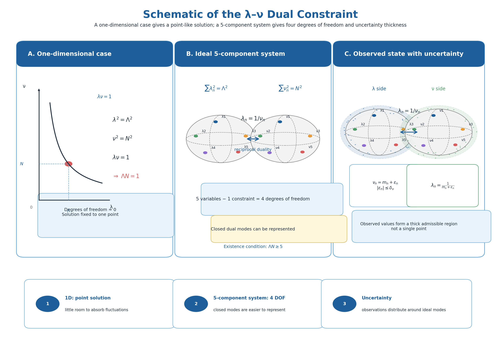
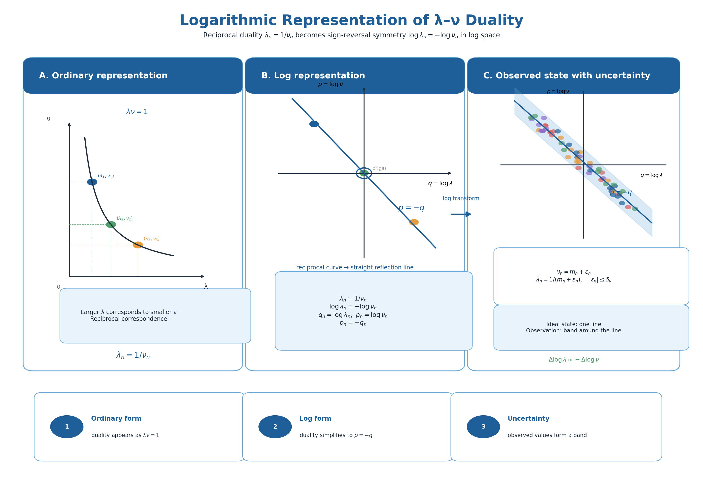

# Paper 1: Dual Geometry of Wavelength Space and Frequency Space
## A Geometric and Topological Observational Model of Reciprocal Conditions, Logarithmic Representation, and Uncertainty-Weighted Counting

**Author**: Noriaki Kihara  
**Affiliation**: WF System Co., Ltd.  
**ORCID**: 0009-0004-6753-4020  
**Version**: v0.3  
**Date**: June 2026  
**DOI (this version)**: 10.5281/zenodo.20588037  
**Concept DOI**: 10.5281/zenodo.20588036  
**License**: CC BY 4.0

---

## Abstract

In this paper we place between the wavelength components $\lambda_n$ and the frequency components $\nu_n$ the reciprocal duality condition

$$
\lambda_n=\frac{1}{\nu_n}
$$

and observe the structure that emerges when we further impose, on the wavelength space and the frequency space respectively, the constant sum-of-squares geometric conditions

$$
\sum_{n=1}^{d} \lambda_n^2=\Lambda^2,\qquad
\sum_{n=1}^{d} \nu_n^2=\mathcal{N}^2 .
$$

The purpose of this paper is not to derive physical entities such as spacetime, mass, energy, or momentum. The quantities $\lambda_n$ and $\nu_n$ here are model variables used to describe the dual geometric structure of the wavelength space and the frequency space. Accordingly, we do not identify $\nu_n$ with time-frequency, energy, momentum, or any other quantity of standard physics.

In the ordinary representation the reciprocal duality appears as the hyperbola

$$
\lambda\nu=1 ,
$$

but under the logarithmic change of variables

$$
q_n=\log \lambda_n,\qquad p_n=\log \nu_n
$$

it is simplified to the sign-reversal symmetry

$$
p_n=-q_n .
$$

We also confirm that, whereas in one dimension the solution is fixed to essentially a single point with almost no freedom for redistribution among components, a 5-component / 1-constraint system retains four degrees of freedom. Finally, when an actual 4-dimensional lattice is chosen in the frequency space or the wavelength space, we formulate the corresponding counting method. In particular, we define the fully-inscribed count without uncertainty ($\delta=0$) and the weighted count with uncertainty ($\delta>0$). However, this paper does not derive the value of $\delta$ or the form of the weight function. Their determination is outside the scope of this paper and is left to subsequent work.

---

## Keywords

wavelength space, frequency space, reciprocal duality, logarithmic representation, sign-reversal symmetry, four degrees of freedom, 4-dimensional lattice, unit-cell counting, uncertainty, geometric observational model, topological observational model

---

## 1. Introduction

Rather than presupposing space or spacetime as a known background, it is useful as a thought experiment to observe what geometric degrees of freedom arise naturally from the duality between wavelength and frequency.

In this paper we place between the wavelength components $\lambda_n$ and the frequency components $\nu_n$ the simplest reciprocal duality condition

$$
\lambda_n=\frac{1}{\nu_n} .
$$

A point to note here is that the "wavelength" and "frequency" of this paper are not to be immediately identified with physical quantities of standard physics. We treat $\lambda_n$ as a scale component along each axis and $\nu_n$ as its reciprocal component. For convenience we use the words "wavelength" and "frequency," but $\nu_n$ is not identified with time-frequency, energy, momentum, or other physical quantities.

The question of this paper can be stated as follows.

> When the wavelength space and the frequency space are connected by a reciprocal duality and each additionally carries a norm-preserving condition, what kind of degrees of freedom, symmetry, and counting structure arise naturally?

This paper does not claim the derivation of 4-dimensional spacetime or the completion of a physical theory. It is rather an observational model of what geometric and topological structure is produced by the reciprocal duality placed between the wavelength space and the frequency space.

---

## 2. Basic Setup

### 2.1 Wavelength space

Let the $d$ wavelength components be

$$
\lambda=(\lambda_1,\lambda_2,\ldots,\lambda_d) .
$$

We impose the constant sum-of-squares condition on the wavelength space,

$$
\sum_{n=1}^{d} \lambda_n^2=\Lambda^2 ,
$$

where $\Lambda$ represents a composite wavelength scale, or the norm radius in the wavelength space.

### 2.2 Frequency space

Similarly, let the $d$ frequency components be

$$
\nu=(\nu_1,\nu_2,\ldots,\nu_d) .
$$

We impose the constant sum-of-squares condition on the frequency space,

$$
\sum_{n=1}^{d} \nu_n^2=\mathcal{N}^2 ,
$$

where $\mathcal{N}$ represents a composite frequency scale, or the norm radius in the frequency space.

### 2.3 Reciprocal duality condition

Between the wavelength components and the frequency components we place the componentwise reciprocal duality condition

$$
\lambda_n\nu_n=1 ,
$$

that is,

$$
\lambda_n=\frac{1}{\nu_n} .
$$

By this condition the wavelength space and the frequency space are not independent but are dual spaces connected by a reciprocal map. When one component is large, the corresponding other component is small. Hence this is not a symmetry of identical form but a dual symmetry that includes inversion.

---

## 3. The One-Dimensional Case

In one dimension the conditions are

$$
\lambda^2=\Lambda^2,\qquad
\nu^2=\mathcal{N}^2,\qquad
\lambda\nu=1 .
$$

Considering only positive wavelength and positive frequency,

$$
\lambda=\Lambda,\qquad
\nu=\mathcal{N} ,
$$

and necessarily

$$
\Lambda\mathcal{N}=1 .
$$

Therefore, in one dimension the solution is fixed to

$$
\lambda=\Lambda,\qquad
\nu=\frac{1}{\Lambda} .
$$

This shows that in a one-dimensional system the degrees of freedom essentially vanish and there is almost no room for redistribution among components. That is, a one-dimensional system formally possesses a solution, but has almost no margin for expressing a closed dual geometry or an observational thickness.

We note that the flat (Euclidean-norm) treatment of this one-dimensional structure is **curvature-exact**, not an approximation. The Foundations volume of this series, Paper 0 [5], gives an exact evaluation of the distortion of a unit cell placed, with preserved geodesic length, in a positively-curved constant-curvature space of curvature radius $R$, and shows that the $d=1$ geodesic cell is intrinsically flat (edge, vertex angle, area, and volume all have zero distortion, independent of $R$). Curvature distortion appears only in $d\ge2$ geodesic cells that couple several axes, with $1/R^2$ as its leading coefficient. As long as the counting from this paper onward rests on a per-axis one-dimensional structure, Paper 0 provides the geometric foundation that demarcates the range in which this flat treatment is exactly valid.

---

## 4. Multicomponent Systems and the Emergence of Four Degrees of Freedom

Consider the 5-component case.

In the wavelength space we impose

$$
\sum_{n=1}^{5} \lambda_n^2=\Lambda^2 .
$$

In the frequency space we impose

$$
\sum_{n=1}^{5} \nu_n^2=\mathcal{N}^2 .
$$

On each component we impose

$$
\lambda_n\nu_n=1 .
$$

Here, since the five components are subject to one sum-of-squares constraint, ideally

$$
5-1=4
$$

degrees of freedom remain.

These four degrees of freedom are an important object of observation in this paper. However, we do not immediately identify these four degrees of freedom with the 4-dimensionality of physical spacetime. What we treat here is a degree of freedom that appears purely on the dual geometry.

### 4.1 Existence condition

Setting

$$
a_n=\lambda_n^2>0 ,
$$

we have

$$
\sum_{n=1}^{5} a_n=\Lambda^2 ,
$$

and, from

$$
\nu_n=\frac{1}{\lambda_n} ,
$$

it follows that

$$
\sum_{n=1}^{5} \frac{1}{a_n}=\mathcal{N}^2 .
$$

By a Cauchy–Schwarz type inequality,

$$
\left(\sum_{n=1}^{5} a_n\right)
\left(\sum_{n=1}^{5} \frac{1}{a_n}\right)\ge 25 .
$$

Therefore

$$
\Lambda^2\mathcal{N}^2\ge 25 ,
$$

that is,

$$
\Lambda\mathcal{N}\ge 5
$$

is a necessary condition.

Equality holds when all $a_n$ are equal, namely

$$
a_1=a_2=a_3=a_4=a_5=\frac{\Lambda^2}{5} .
$$

---

## 5. Logarithmic Representation

The reciprocal duality condition

$$
\lambda_n=\frac{1}{\nu_n}
$$

is expressed in the ordinary representation as a hyperbolic relation.

However, introducing the logarithmic variables

$$
q_n=\log\lambda_n,\qquad
p_n=\log\nu_n ,
$$

since

$$
\log\lambda_n=-\log\nu_n ,
$$

we obtain

$$
p_n=-q_n .
$$

That is, the reciprocal duality which in the ordinary representation is the hyperbola

$$
\lambda\nu=1
$$

is, in logarithmic space, the straight line of slope $-1$,

$$
p=-q .
$$

---

## 6. Introduction of Uncertainty and Its Scope

The above conditions are clear as an ideal state but are strongly constraining. We therefore formally introduce an uncertainty on the observed values or lattice values.

However, this paper does not derive the value of the uncertainty width $\delta$. Nor do we identify $\delta$ with any specific physical uncertainty. What we do in this paper is to define a counting formalism that includes $\delta$.

As an example of placing an integer lattice with a fractional fluctuation on the frequency side, we may write

$$
\nu_n=m_n+\epsilon_n,\qquad
m_n\in\mathbb{Z},\qquad
|\epsilon_n|\le \delta_\nu .
$$

The wavelength side is then induced from the reciprocal duality condition as

$$
\lambda_n=\frac{1}{m_n+\epsilon_n} .
$$

Taking the ideal integer mode as

$$
\nu_n^{(0)}=m_n ,
$$

the corresponding ideal wavelength is

$$
\lambda_n^{(0)}=\frac{1}{m_n} .
$$

The wavelength including the fluctuation is

$$
\lambda_n^{\mathrm{obs}}=
\frac{1}{m_n+\epsilon_n} .
$$

Hence the wavelength-side fluctuation is

$$
\Delta\lambda_n
=
\frac{1}{m_n+\epsilon_n}
-
\frac{1}{m_n}
=
-\frac{\epsilon_n}{m_n(m_n+\epsilon_n)} .
$$

When $|\epsilon_n|\ll m_n$, to first order

$$
\Delta\lambda_n\approx
-\frac{\epsilon_n}{m_n^2} .
$$

This formula shows that a fractional fluctuation on the frequency side appears on the wavelength side as a fluctuation of the opposite sign. However, the values and distributions of $\epsilon_n$ and $\delta_\nu$ are not determined in this paper.

---

## 7. Explanation by Figures

### Figure 1: Schematic of the $\lambda$–$\nu$ dual constraint

**Figure 1.** In one dimension, the conditions $\lambda^2=\Lambda^2$, $\nu^2=\mathcal{N}^2$, $\lambda\nu=1$ fix the solution to essentially a single point. In contrast, a 5-component / 1-constraint system retains four degrees of freedom, leaving room to build a dual geometry. Introducing uncertainty, the situation can be represented as an observational region having thickness around the ideal constraint. However, the magnitude of that thickness is not derived in this paper.

### Figure 2: Logarithmic representation of the $\lambda$–$\nu$ duality

**Figure 2.** The reciprocal duality, which in the ordinary representation is the hyperbola $\lambda\nu=1$, is expressed as the straight line $p=-q$ by using the logarithmic variables $q=\log\lambda$, $p=\log\nu$. In an observed state with uncertainty, it can be represented as a band-like distribution with thickness around the ideal line. However, this paper does not determine that thickness.

---

## 8. Counting a 4-Dimensional Lattice in an Actual Frequency / Wavelength Space

The discussion so far has mainly treated continuous dual spaces. However, if we actually choose the frequency space or the wavelength space to be a 4-dimensional lattice, the sum-of-squares condition is naturally converted into a unit-cell counting problem.

### 8.1 Fully-inscribed counting for $\delta=0$

Consider the 4-dimensional integer lattice

$$
k=(k_1,k_2,k_3,k_4)\in\mathbb{Z}^4 .
$$

Associate to each lattice point $k$ a 4-dimensional unit cell of side 1. The half-width of the unit cell in each direction is $1/2$.

The condition that this entire unit cell be fully inscribed in the 4-dimensional hyperball of radius $R$ is

$$
\sum_{i=1}^{4}
\left(|k_i|+\frac12\right)^2
\le R^2 .
$$

We therefore define the fully-inscribed cell count for $\delta=0$ as

$$
N_0(R)
=
\#\left\{
k\in\mathbb{Z}^4
\mid
\sum_{i=1}^{4}
\left(|k_i|+\frac12\right)^2
\le R^2
\right\} .
$$

This definition applies in the same form whether a 4-dimensional lattice is chosen in the frequency space or in the wavelength space. What is being counted here is not a particular physical quantity but the geometric number of 4-dimensional lattice cells subject to a sum-of-squares constraint.

Counting in order of integer radius, for example,

$$
N_0(1)=1,\qquad
N_0(2)=9,\qquad
N_0(3)=137 .
$$

In particular, the 137 obtained at $R=3$ is not introduced under any assumed correspondence with a physical constant. It is a pure counting result obtained from the 4-dimensional integer lattice, the unit cell, and the full-inscription condition.

### 8.2 Form of counting with uncertainty

In the fully-inscribed counting without uncertainty, each cell is counted as 1 if it satisfies the condition and 0 otherwise. This is counting by the indicator function

$$
\mathbf{1}[x\ge 0] .
$$

Here, define

$$
D_R(k)
=
R^2-
\sum_{i=1}^{4}
\left(|k_i|+\frac12\right)^2 .
$$

If

$$
D_R(k)\ge0 ,
$$

then that unit cell is fully inscribed in the hyperball of radius $R$.

In the case with uncertainty, the indicator function is replaced by a weight function

$$
W_\delta(x)
$$

having thickness near the boundary.

The effective cell count is then defined as

$$
N_\delta(R)
=
\sum_{k\in\mathbb{Z}^4}
W_\delta\!\left(
D_R(k)
\right) .
$$

The weight function is assumed to satisfy at least the following properties,

$$
0\le W_\delta(x)\le1 ,
$$

$$
\lim_{\delta\to0}
W_\delta(x)
=
\mathbf{1}[x\ge0] .
$$

Therefore,

$$
\lim_{\delta\to0}N_\delta(R)=N_0(R) .
$$

By this formulation, the fully-inscribed counting is expressed as the $\delta=0$ limit of the weighted counting with uncertainty.

However, this paper does not derive the explicit form of $W_\delta$, the value of $\delta$, or on which geometric quantity $\delta$ depends. Hence this paper does not perform a concrete numerical evaluation of $N_\delta(R)$.

### 8.3 Remark on dual counting

When a 4-dimensional lattice is placed in the frequency space, one can perform a unit-cell counting corresponding to the sum-of-squares condition

$$
\sum_{i=1}^{4} \nu_i^2\le \mathcal{N}^2 .
$$

On the other hand, when a 4-dimensional lattice is placed in the wavelength space, one can perform a unit-cell counting corresponding to

$$
\sum_{i=1}^{4} \lambda_i^2\le \Lambda^2 .
$$

Formally these are the same counting problem. However, since the wavelength space and the frequency space are dually connected by

$$
\lambda_i\nu_i=1 ,
$$

when both are simultaneously discretized into lattices, the lattice structures of the two spaces do not necessarily coincide in a simple way.

We therefore distinguish the following two in this paper.

1. The counting when the frequency space or the wavelength space alone is chosen as a 4-dimensional lattice.  
2. The consistency condition when both are simultaneously connected by the reciprocal duality condition.  

This paper confines itself to defining the single-space counting of (1). Counting that includes the dual consistency condition of (2) is left to subsequent work.

---

## 9. Related Work and Positioning

This paper is not a modification of an existing physical theory; it is a model that observes the geometric structure arising when a reciprocal duality condition is placed between the wavelength space and the frequency space. Accordingly, the following related work is referred to not as physical grounds for the claims of this paper but as mathematical background.

First, the idea of treating the time domain and the frequency domain complementarily in signal analysis has a classical background represented by Gabor's time–frequency analysis. Gabor presented a method of treating time and frequency symmetrically in the analysis of communication signals [1]. This paper does not physically introduce a time axis, but it shares the formal motivation of placing dual spaces side by side and observing them.

Second, regarding the abstraction of the frequency domain and of information representation, Shannon's theory of communication provides a classical background [2]. However, this paper does not treat information content or channel capacity.

Third, the 4-dimensional lattice cell counting at the end of this paper belongs to the context of the geometry of numbers, which treats lattice points or lattice cells inside convex bodies. In particular, the geometry of numbers since Minkowski has systematically treated the relations among convex bodies, lattices, volumes, and counting [3].

Fourth, the sum-of-squares condition on the 4-dimensional lattice is formally close to the representation number of a sum of four squares. However, what this paper treats is an inequality condition based on sums of positive odd squares, and it does not directly apply Jacobi's four-square theorem [4].

Fifth, the Foundations volume of this series, Paper 0 [5], demarcates, as an elementary differential-geometry computation, the range within which the flat treatment presupposed by this paper's counting (§8) is exactly valid. By Paper 0, curvature distortion appears only in $d\ge2$ coupled geometry with $1/R^2$ as its leading coefficient, and is zero at $d=1$. Since the unit-cell counting of this paper is an integer count on a flat lattice (each cell of hypervolume 1), not a measure on a curved surface, Paper 0 provides the geometric ground that this flat treatment lies in the curvature-exact region. The leading curvature correction for a reinterpretation into multi-dimensional geodesic cells (a mean-field estimate) is demarcated in Paper 0 §5; this does not imply that the current content of this paper is curvature-deficient.

---

## 10. Limitations and Future Work

This paper has clear limitations.

First, this paper does not complete a physical theory. Although it uses terms such as wavelength, frequency, norm preservation, and uncertainty, it does not directly identify them with existing physical quantities.

Second, the physical dimensions, system of units, and correspondence with observable quantities of $\lambda_n$ and $\nu_n$ are undefined.

Third, we have not shown that the four-degrees-of-freedom structure is unique. What we have shown is the observation that in one dimension the degrees of freedom are insufficient, and that in a 5-component / 1-constraint system four degrees of freedom arise naturally.

Fourth, this paper does not determine the value or distribution of the uncertainty width $\delta$. In particular, the form of the weight function $W_\delta$ and on which quantity $\delta$ depends—boundary distance, shell number, dual-consistency error in logarithmic space, etc.—are outside the scope of this paper.

Fifth, how to perform a consistent counting that simultaneously discretizes the frequency space and the wavelength space into lattices and further satisfies the reciprocal duality condition is left to future work.

---

## 11. Conclusion

In this paper we placed the reciprocal duality condition

$$
\lambda_n=\frac{1}{\nu_n}
$$

between the wavelength components $\lambda_n$ and the frequency components $\nu_n$, and observed the geometric structure that arises when, in addition, a constant sum-of-squares condition is imposed on the wavelength space and the frequency space respectively.

In one dimension the solution is fixed to essentially a single point, with almost no room for redistribution among components. In contrast, a 5-component / 1-constraint system retains four degrees of freedom.

Moreover, introducing logarithmic variables, the reciprocal duality is expressed as the sign-reversal symmetry

$$
p_n=-q_n .
$$

Finally, we showed that when the frequency space or the wavelength space is actually chosen as a 4-dimensional lattice, the sum-of-squares condition can be formulated as a unit-cell counting problem. In the case without uncertainty ($\delta=0$), the fully-inscribed cell count $N_0(R)$ is obtained. Furthermore, in the case with uncertainty, it can be formulated as the effective cell count $N_\delta(R)$ obtained by replacing the indicator function with a weight function $W_\delta$.

However, this paper does not derive the value of $\delta$ or the explicit form of $W_\delta$. These are outside the scope of this paper and are left to subsequent work.

---

## Appendix A: Existence Condition for the General $d$-Component System

For the general $d$-component system, impose

$$
\sum_{n=1}^{d} \lambda_n^2=\Lambda^2,\qquad
\sum_{n=1}^{d} \nu_n^2=\mathcal{N}^2,\qquad
\lambda_n\nu_n=1 .
$$

Setting

$$
a_n=\lambda_n^2>0 ,
$$

we have

$$
\sum_{n=1}^{d} a_n=\Lambda^2,\qquad
\sum_{n=1}^{d} \frac{1}{a_n}=\mathcal{N}^2 .
$$

By a Cauchy–Schwarz type inequality,

$$
\left(\sum_{n=1}^{d} a_n\right)
\left(\sum_{n=1}^{d} \frac{1}{a_n}\right)\ge d^2 .
$$

Therefore

$$
\Lambda\mathcal{N}\ge d
$$

is a necessary condition.

---

## References

1. Gabor, D. (1946). Theory of communication. *Journal of the Institution of Electrical Engineers - Part III: Radio and Communication Engineering*, 93(26), 429–457.

2. Shannon, C. E. (1948). A mathematical theory of communication. *Bell System Technical Journal*, 27(3), 379–423.

3. Aliev, I., & Henk, M. (2023). Minkowski's successive minima in convex and discrete geometry. *Communications in Mathematics*, 31(2), 35–59.

4. Hirschhorn, M. D. (1987). A simple proof of Jacobi's four-square theorem. *Proceedings of the American Mathematical Society*, 101(3), 436–438.

5. Kihara, N. (2026). Paper 0: Distortion of the Geodesic Unit Cell in Positively-Curved Constant-Curvature Space — Exact Evaluation of Edge, Angle, Area, and Volume. *Zenodo*. Concept DOI: 10.5281/zenodo.20680269.

---

## Figure Files

- Figure 1: `figure1_lambda_nu_dual_constraint_EN.png`
- Figure 2: `figure2_log_representation_lambda_nu_duality_EN.png`
